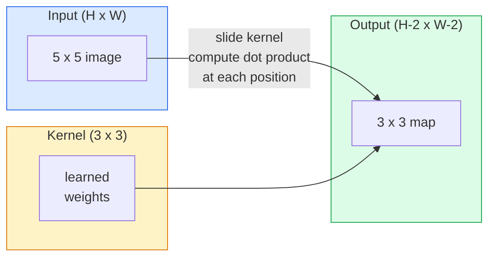
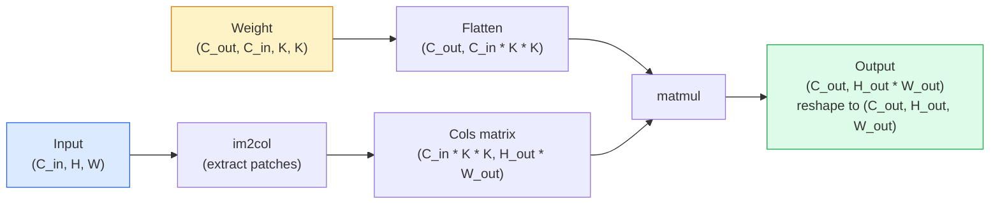

# Konwolucje od podstaw

> Konwolucja to mała gęsta warstwa, którą przesuwasz po obrazie, dzieląc te same wagi w każdym położeniu.

**Type:** Build
**Languages:** Python
**Prerequisites:** Phase 3 (Deep Learning Core), Phase 4 Lesson 01 (Image Fundamentals)
**Time:** ~75 minutes

## Learning Objectives

- Zaimplementować konwolucję 2D od podstaw używając tylko NumPy, w tym wersję z zagnieżdżonymi pętlami i zwektoryzowaną wersję `im2col`
- Obliczyć rozmiar przestrzenny wyjścia dla dowolnej kombinacji rozmiaru wejścia, rozmiaru jądra, padding'u i kroku oraz uzasadnić wzór `(H - K + 2P) / S + 1`
- Zaprojektować ręcznie jądra (krawędź, rozmycie, wyostrzenie, Sobel) i wyjaśnić, dlaczego każde z nich produkuje taki wzór aktywacji, jaki produkuje
- Układać konwolucje w ekstraktor cech i powiązać głębokość stosu z rozmiarem pola receptywnego

## The Problem

W pełni połączona warstwa na obrazie RGB 224x224 potrzebowałaby 224 * 224 * 3 = 150 528 wag wejściowych na neuron. Pojedyncza ukryta warstwa z 1000 jednostek to już 150 milionów parametrów — zanim nauczyłeś się czegokolwiek użytecznego. Co gorsza, ta warstwa nie ma pojęcia, że pies w lewym górnym rogu i pies w prawym dolnym rogu to ten sam wzór. Traktuje każdą pozycję piksela jako niezależną, co jest dokładnie błędne dla obrazów: przesunięcie kota o trzy piksele nie powinno zmuszać sieci do ponownego uczenia się koncepcji.

Dwie właściwości, których potrzebuje model obrazu, to **ekwiwariancja translacyjna** (wyjście przesuwa się, gdy wejście się przesuwa) oraz **współdzielenie parametrów** (ten sam detektor cech działa wszędzie). Gęste warstwy nie dają ani jednej, ani drugiej. Konwolucja daje obie za darmo.

Konwolucja nie została wynaleziona dla głębokiego uczenia. To ta sama operacja, która napędza kompresję JPEG, rozmycie Gaussa w Photoshopie, detekcję krawędzi w wizji przemysłowej i każdy filtr audio, jaki kiedykolwiek powstał. Powodem, dla którego CNN zdominowały ImageNet w latach 2012-2020, jest to, że konwolucja jest właściwym prior dla danych, gdzie bliskie wartości są ze sobą powiązane, a ten sam wzór może pojawić się w dowolnym miejscu.

## The Concept

### Jedno jądro, przesuwanie

Konwolucja 2D bierze małą macierz wag zwaną jądrem (lub filtrem), przesuwa ją po wejściu i w każdym położeniu oblicza sumę iloczynów element po elemencie. Ta suma staje się jednym pikselem wyjściowym.



Konkretny przykład 3x3 na wejściu 5x5 (bez padding'u, krok 1):

```
Input X (5 x 5):                Kernel W (3 x 3):

  1  2  0  1  2                   1  0 -1
  0  1  3  1  0                   2  0 -2
  2  1  0  2  1                   1  0 -1
  1  0  2  1  3
  2  1  1  0  1

The kernel slides across every valid 3 x 3 window. Output Y is 3 x 3:

 Y[0,0] = sum( W * X[0:3, 0:3] )
 Y[0,1] = sum( W * X[0:3, 1:4] )
 Y[0,2] = sum( W * X[0:3, 2:5] )
 Y[1,0] = sum( W * X[1:4, 0:3] )
 ... and so on
```

Ta jedna formuła — **współdzielone wagi, lokalność, przesuwne okno** — to cały pomysł. Wszystko inne to księgowość.

### Wzór na rozmiar wyjścia

Dany przestrzenny rozmiar wejścia `H`, rozmiar jądra `K`, padding `P`, krok `S`:

```
H_out = floor( (H - K + 2P) / S ) + 1
```

Zapamiętaj to. Będziesz to obliczać dziesiątki razy na architekturę.

| Scenario | H | K | P | S | H_out |
|----------|---|---|---|---|-------|
| Valid conv, no padding | 32 | 3 | 0 | 1 | 30 |
| Same conv (preserves size) | 32 | 3 | 1 | 1 | 32 |
| Downsample by 2 | 32 | 3 | 1 | 2 | 16 |
| Pool 2x2 | 32 | 2 | 0 | 2 | 16 |
| Large receptive field | 32 | 7 | 3 | 2 | 16 |

"Same padding" oznacza wybór P tak, aby H_out == H gdy S == 1. Dla nieparzystego K, to P = (K - 1) / 2. Dlatego dominują jądra 3x3 — to najmniejsze nieparzyste jądro, które wciąż ma środek.

### Padding

Bez padding'u każda konwolucja zmniejsza mapę cech. Nałóż 20 takich warstw, a twój obraz 224x224 stanie się 184x184, co marnuje obliczenia na krawędzi i komplikuje połączenia resztkowe wymagające dopasowania kształtów.

```
Zero padding (P = 1) on a 5 x 5 input:

  0  0  0  0  0  0  0
  0  1  2  0  1  2  0
  0  0  1  3  1  0  0
  0  2  1  0  2  1  0       Now the kernel can centre on pixel
  0  1  0  2  1  3  0       (0, 0) and still have three rows and
  0  2  1  1  0  1  0       three columns of values to multiply.
  0  0  0  0  0  0  0
```

Tryby, które spotykasz w praktyce: `zero` (najczęstsze), `reflect` (odbicie krawędzi, unika twardych granic w modelach generatywnych), `replicate` (kopiowanie krawędzi), `circular` (zawijanie, używane w problemach toroidalnych).

### Krok (Stride)

Krok to wielkość przesunięcia slajdu. `stride=1` jest domyślne. `stride=2` zmniejsza wymiary przestrzenne o połowę i jest klasycznym sposobem na próbkowanie w dół wewnątrz CNN bez osobnej warstwy pooling — każda nowoczesna architektura (ResNet, ConvNeXt, MobileNet) używa gdzieś konwolucji z krokiem zamiast max-pool.

```
Stride 1 on a 5 x 5 input, 3 x 3 kernel:

  starts: (0,0) (0,1) (0,2)        -> output row 0
          (1,0) (1,1) (1,2)        -> output row 1
          (2,0) (2,1) (2,2)        -> output row 2

  Output: 3 x 3

Stride 2 on the same input:

  starts: (0,0) (0,2)              -> output row 0
          (2,0) (2,2)              -> output row 1

  Output: 2 x 2
```

### Wiele kanałów wejściowych

Prawdziwe obrazy mają trzy kanały. Konwolucja 3x3 na wejściu RGB to tak naprawdę objętość 3x3x3: jeden wycinek 3x3 na kanał wejściowy. W każdej pozycji przestrzennej mnożysz i sumujesz wszystkie trzy wycinki oraz dodajesz bias.

```
Input:   (C_in,  H,  W)        3 x 5 x 5
Kernel:  (C_in,  K,  K)        3 x 3 x 3 (one kernel)
Output:  (1,     H', W')       2D map

For a layer that produces C_out output channels, you stack C_out kernels:

Weight:  (C_out, C_in, K, K)   e.g. 64 x 3 x 3 x 3
Output:  (C_out, H', W')       64 x 3 x 3

Parameter count: C_out * C_in * K * K + C_out   (the + C_out is biases)
```

Ta ostatnia linijka to ta, którą będziesz obliczać podczas planowania modelu. Konwolucja 3x3 z 64 kanałami na wejściu 3-kanałowym ma `64 * 3 * 3 * 3 + 64 = 1792` parametry. Tanio.

### Sztuczka im2col

Zagnieżdżone pętle są łatwe do czytania, ale wolne. GPU chcą dużych mnożeń macierzy. Sztuczka: spłaszcz każde okno pola receptywnego wejścia w jedną kolumnę dużej macierzy, spłaszcz jądro w wiersz, a cała konwolucja staje się pojedynczym matmulem.



Każda produkcyjna implementacja konwolucji to jakaś odmiana tego plus sztuczki z cache-tiling (direct conv, Winograd, FFT conv dla dużych jąder). Zrozum im2col, a zrozumiesz rdzeń.

### Pole receptywne

Pojedyncza konwolucja 3x3 patrzy na 9 pikseli wejściowych. Nałóż dwie konwolucje 3x3, a neuron w drugiej warstwie patrzy na piksele wejściowe 5x5. Trzy konwolucje 3x3 dają 7x7. Ogólnie:

```
RF after L stacked K x K convs (stride 1) = 1 + L * (K - 1)

With strides:   RF grows multiplicatively with stride along each layer.
```

Cały powód, dla którego "3x3 aż do końca" działa (VGG, ResNet, ConvNeXt) to fakt, że dwie konwolucje 3x3 widzą ten sam obszar wejściowy co jedna konwolucja 5x5, ale z mniejszą liczbą parametrów i dodatkową nieliniowością pomiędzy.

```figure
convolution-kernel
```

## Build It

### Step 1: Pad an array

Zacznij od najmniejszego prymitywu: funkcji, która dopełnia zerami wokół tablicy H x W.

```python
import numpy as np

def pad2d(x, p):
    if p == 0:
        return x
    h, w = x.shape[-2:]
    out = np.zeros(x.shape[:-2] + (h + 2 * p, w + 2 * p), dtype=x.dtype)
    out[..., p:p + h, p:p + w] = x
    return out

x = np.arange(9).reshape(3, 3)
print(x)
print()
print(pad2d(x, 1))
```

Sztuczka z końcowymi osiami `x.shape[:-2]` oznacza, że ta sama funkcja działa na `(H, W)`, `(C, H, W)` lub `(N, C, H, W)` bez modyfikacji.

### Step 2: 2D convolution with nested loops

Implementacja referencyjna — wolna, ale jednoznaczna. To w zasadzie to, co robi `torch.nn.functional.conv2d`.

```python
def conv2d_naive(x, w, b=None, stride=1, padding=0):
    c_in, h, w_in = x.shape
    c_out, c_in_w, kh, kw = w.shape
    assert c_in == c_in_w

    x_pad = pad2d(x, padding)
    h_out = (h + 2 * padding - kh) // stride + 1
    w_out = (w_in + 2 * padding - kw) // stride + 1

    out = np.zeros((c_out, h_out, w_out), dtype=np.float32)
    for oc in range(c_out):
        for i in range(h_out):
            for j in range(w_out):
                hs = i * stride
                ws = j * stride
                patch = x_pad[:, hs:hs + kh, ws:ws + kw]
                out[oc, i, j] = np.sum(patch * w[oc])
        if b is not None:
            out[oc] += b[oc]
    return out
```

Cztery zagnieżdżone pętle (kanał wyjściowy, wiersz, kolumna, plus niejawna suma po C_in, kh, kw). To jest prawda podstawowa, z którą będziesz sprawdzać każdą szybszą implementację.

### Step 3: Verify with a hand-designed kernel

Zbuduj pionowe jądro Sobela, zastosuj je do syntetycznego obrazu schodkowego i zobacz, jak pionowa krawędź się zapala.

```python
def synthetic_step_image():
    img = np.zeros((1, 16, 16), dtype=np.float32)
    img[:, :, 8:] = 1.0
    return img

sobel_x = np.array([
    [[-1, 0, 1],
     [-2, 0, 2],
     [-1, 0, 1]]
], dtype=np.float32)[None]

x = synthetic_step_image()
y = conv2d_naive(x, sobel_x, padding=1)
print(y[0].round(1))
```

Spodziewaj się dużych dodatnich wartości w kolumnie 7 (wzrost jasności od lewej do prawej) i zer wszędzie indziej. Ten pojedynczy wydruk to twój test poprawności matematyki.

### Step 4: im2col

Konwertuj każde okno wielkości jądra w wejściu na kolumnę macierzy. Dla `C_in=3, K=3`, każda kolumna to 27 liczb.

```python
def im2col(x, kh, kw, stride=1, padding=0):
    c_in, h, w = x.shape
    x_pad = pad2d(x, padding)
    h_out = (h + 2 * padding - kh) // stride + 1
    w_out = (w + 2 * padding - kw) // stride + 1

    cols = np.zeros((c_in * kh * kw, h_out * w_out), dtype=x.dtype)
    col = 0
    for i in range(h_out):
        for j in range(w_out):
            hs = i * stride
            ws = j * stride
            patch = x_pad[:, hs:hs + kh, ws:ws + kw]
            cols[:, col] = patch.reshape(-1)
            col += 1
    return cols, h_out, w_out
```

Wciąż jest to pętla w Pythonie, ale teraz ciężką pracę wykona pojedynczy zwektoryzowany matmul.

### Step 5: Fast conv via im2col + matmul

Zastąp poczwórną pętlę jednym mnożeniem macierzy.

```python
def conv2d_im2col(x, w, b=None, stride=1, padding=0):
    c_out, c_in, kh, kw = w.shape
    cols, h_out, w_out = im2col(x, kh, kw, stride, padding)
    w_flat = w.reshape(c_out, -1)
    out = w_flat @ cols
    if b is not None:
        out += b[:, None]
    return out.reshape(c_out, h_out, w_out)
```

Sprawdzenie poprawności: uruchom obie implementacje i porównaj.

```python
rng = np.random.default_rng(0)
x = rng.normal(0, 1, (3, 16, 16)).astype(np.float32)
w = rng.normal(0, 1, (8, 3, 3, 3)).astype(np.float32)
b = rng.normal(0, 1, (8,)).astype(np.float32)

y_naive = conv2d_naive(x, w, b, padding=1)
y_im2col = conv2d_im2col(x, w, b, padding=1)

print(f"max abs diff: {np.max(np.abs(y_naive - y_im2col)):.2e}")
```

`max abs diff` powinno wynosić około `1e-5` — różnica wynika z kolejności akumulacji zmiennoprzecinkowej, a nie z błędu.

### Step 6: A bank of hand-designed kernels

Pięć filtrów pokazujących, co pojedyncza warstwa splotowa może wyrazić przed jakimkolwiek treningiem.

```python
KERNELS = {
    "identity": np.array([[0, 0, 0], [0, 1, 0], [0, 0, 0]], dtype=np.float32),
    "blur_3x3": np.ones((3, 3), dtype=np.float32) / 9.0,
    "sharpen": np.array([[0, -1, 0], [-1, 5, -1], [0, -1, 0]], dtype=np.float32),
    "sobel_x": np.array([[-1, 0, 1], [-2, 0, 2], [-1, 0, 1]], dtype=np.float32),
    "sobel_y": np.array([[-1, -2, -1], [0, 0, 0], [1, 2, 1]], dtype=np.float32),
}

def apply_kernel(img2d, kernel):
    x = img2d[None].astype(np.float32)
    w = kernel[None, None]
    return conv2d_im2col(x, w, padding=1)[0]
```

Zastosowane do dowolnego obrazu w skali szarości: rozmycie zmiękcza, wyostrzenie wyostrza krawędzie, Sobel-x rozświetla pionowe krawędzie, Sobel-y rozświetla poziome krawędzie. To dokładnie te wzory, których nauczyła się *pierwsza* trenowana warstwa splotowa w AlexNet i VGG — ponieważ dobry model obrazu potrzebuje detektorów krawędzi i plam niezależnie od zadania, które nastąpi później.

## Use It

PyTorch `nn.Conv2d` opakowuje tę samą operację z autogradem, jądrami CUDA i optymalizacją cuDNN. Semantyka kształtów jest identyczna.

```python
import torch
import torch.nn as nn

conv = nn.Conv2d(in_channels=3, out_channels=64, kernel_size=3, stride=1, padding=1)
print(conv)
print(f"weight shape: {tuple(conv.weight.shape)}   # (C_out, C_in, K, K)")
print(f"bias shape:   {tuple(conv.bias.shape)}")
print(f"param count:  {sum(p.numel() for p in conv.parameters())}")

x = torch.randn(8, 3, 224, 224)
y = conv(x)
print(f"\ninput  shape: {tuple(x.shape)}")
print(f"output shape: {tuple(y.shape)}")
```

Zamień `padding=1` na `padding=0`, a wyjście spada do 222x222. Zamień `stride=1` na `stride=2`, a spada do 112x112. Ten sam wzór, który zapamiętałeś powyżej.

## Ship It

Ta lekcja produkuje:

- `outputs/prompt-cnn-architect.md` — prompt, który dla danego rozmiaru wejścia, budżetu parametrów i docelowego pola receptywnego projektuje stos warstw `Conv2d` z odpowiednim K/S/P na każdym kroku.
- `outputs/skill-conv-shape-calculator.md` — umiejętność, która przechodzi przez specyfikację sieci warstwa po warstwie i zwraca kształt wyjścia, pole receptywne i liczbę parametrów dla każdego bloku.

## Exercises

1. **(Easy)** Dla wejścia w skali szarości 128x128 i stosu `[Conv3x3(s=1,p=1), Conv3x3(s=2,p=1), Conv3x3(s=1,p=1), Conv3x3(s=2,p=1)]`, oblicz ręcznie rozmiar przestrzenny wyjścia i pole receptywne w każdej warstwie. Zweryfikuj z `nn.Sequential` fikcyjnych konwolucji w PyTorch.
2. **(Medium)** Rozszerz `conv2d_naive` i `conv2d_im2col` o przyjmowanie argumentu `groups`. Pokaż, że `groups=C_in=C_out` odtwarza konwolucję depthwise i że jej liczba parametrów to `C * K * K` zamiast `C * C * K * K`.
3. **(Hard)** Zaimplementuj ręcznie backward pass `conv2d_im2col`: mając gradient wyjścia, oblicz gradient `x` i `w`. Zweryfikuj względem `torch.autograd.grad` na tych samych wejściach i wagach. Sztuczka: gradient im2col to `col2im` i musi akumulować nakładające się okna.

## Key Terms

| Term | What people say | What it actually means |
|------|----------------|----------------------|
| Convolution | "Sliding a filter" | A learnable dot product applied at every spatial location with shared weights; mathematically a cross-correlation, but everyone calls it convolution |
| Kernel / filter | "The feature detector" | A small weight tensor of shape (C_in, K, K) whose dot product with a window of input produces one output pixel |
| Stride | "How far you jump" | The step size between consecutive kernel placements; stride 2 halves each spatial dimension |
| Padding | "Zeros on the edges" | Extra values added around the input so the kernel can centre on border pixels; `same` padding keeps output size equal to input size |
| Receptive field | "How much the neuron sees" | The patch of original input that a given output activation depends on, growing with depth and stride |
| im2col | "The GEMM trick" | Rearranging every receptive window into columns so convolution becomes one big matrix multiply — the core of every fast conv kernel |
| Depthwise conv | "One kernel per channel" | A conv with `groups == C_in`, computing each output channel from only its matching input channel; the backbone of MobileNet and ConvNeXt |
| Translation equivariance | "Shift in, shift out" | Property that shifting the input by k pixels shifts the output by k pixels; comes for free with shared weights |

## Further Reading

- [A guide to convolution arithmetic for deep learning (Dumoulin & Visin, 2016)](https://arxiv.org/abs/1603.07285) — definitywne diagramy padding/stride/dilation, które każdy kurs po cichu kopiuje
- [CS231n: Convolutional Neural Networks for Visual Recognition](https://cs231n.github.io/convolutional-networks/) — kanoniczne notatki z wykładów, w tym oryginalne wyjaśnienie im2col
- [The Annotated ConvNet (fast.ai)](https://nbviewer.org/github/fastai/fastbook/blob/master/13_convolutions.ipynb) — notatnik przechodzący od ręcznej konwolucji do wytrenowanego klasyfikatora cyfr
- [Receptive Field Arithmetic for CNNs (Dang Ha The Hien)](https://distill.pub/2019/computing-receptive-fields/) — interaktywny explainer obliczeń pola receptywnego na poziomie publikacji