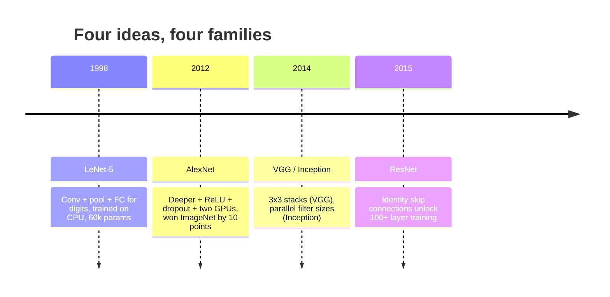
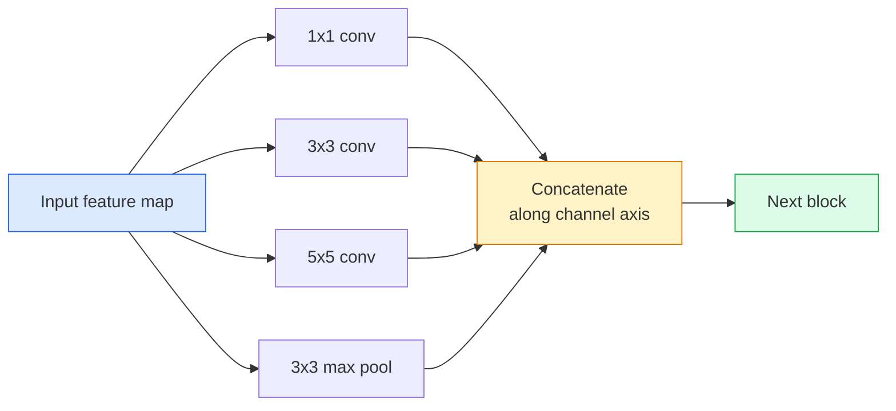
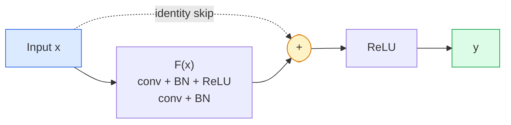

# CNN — od LeNet do ResNet

> Każda ważna CNN ostatnich trzydziestu lat to ten sam przepis konwolucja–nieliniowość–próbkowanie w dół z jednym nowym pomysłem doczepionym. Poznaj pomysły w kolejności.

**Type:** Learn + Build
**Languages:** Python
**Prerequisites:** Phase 3 Lesson 11 (PyTorch), Phase 4 Lesson 01 (Image Fundamentals), Phase 4 Lesson 02 (Convolutions from Scratch)
**Time:** ~75 minutes

## Learning Objectives

- Prześledzić linię architektoniczną LeNet-5 -> AlexNet -> VGG -> Inception -> ResNet i określić jeden nowy pomysł, który każda rodzina wniosła
- Zaimplementować LeNet-5, blok w stylu VGG i BasicBlock ResNet w PyTorch, każdy w mniej niż 40 liniach
- Wyjaśnić, dlaczego połączenia resztkowe zmieniają sieć 1000-warstwową z nietrenowalnej w najnowocześniejszą
- Czytać nowoczesny backbone (ResNet-18, ResNet-50) i przewidzieć jego kształt wyjścia, pole receptywne i liczbę parametrów przed zajrzeniem do źródła

## The Problem

W 2011 roku najlepszy klasyfikator ImageNet uzyskiwał około 74% dokładności top-5. W 2012 AlexNet uzyskał 85%. W 2015 ResNet uzyskał 96%. Żadne nowe dane. Żadna nowa generacja GPU. Zyski pochodziły z pomysłów architektonicznych. Pracujący inżynier widzenia musi wiedzieć, który pomysł pochodzi z której publikacji, ponieważ każdy produkcyjny backbone, który wdrożysz w 2026 roku, jest rekombinacją tych samych elementów — a także dlatego, że pomysły wciąż migrują: sploty grupowe przeszły z CNN do transformerów, połączenia resztkowe przeszły z ResNet do każdego LLM, normalizacja batchowa żyje w modelach dyfuzyjnych.

Studiowanie tych sieci w kolejności chroni cię również przed częstym błędem: sięganiem po największy dostępny model, gdy sieć wielkości LeNet rozwiązałaby problem. MNIST nie potrzebuje ResNet. Znajomość krzywej skalowania każdej rodziny mówi ci, gdzie na niej usiąść.

## The Concept

### Cztery pomysły, które zmieniły widzenie



Nic więcej w klasycznym widzeniu nie miało takiego znaczenia jak te cztery skoki.

### LeNet-5 (1998)

Rozpoznawacz cyfr Yanna LeCuna. 60 000 parametrów. Dwa bloki conv-pool, dwie w pełni połączone warstwy, aktywacje tanh. Zdefiniował szablon, który dziedziczy każda CNN:

```
input (1, 32, 32)
  conv 5x5 -> (6, 28, 28)
  avg pool 2x2 -> (6, 14, 14)
  conv 5x5 -> (16, 10, 10)
  avg pool 2x2 -> (16, 5, 5)
  flatten -> 400
  dense -> 120
  dense -> 84
  dense -> 10
```

Wszystko, co współczesny świat nazywa CNN — naprzemienne konwolucje i próbkowanie w dół zasilające małą głowę klasyfikatora — to LeNet z większą liczbą warstw, większymi kanałami i lepszymi aktywacjami.

### AlexNet (2012)

Trzy zmiany, które razem przełamały ImageNet:

1. **ReLU** zamiast tanh. Gradienty przestają zanikać. Trenowanie przyspiesza sześciokrotnie.
2. **Dropout** w w pełni połączonej głowie. Regularyzacja staje się warstwą, a nie sztuczką.
3. **Głębokość i szerokość**. Pięć warstw splotowych, trzy gęste warstwy, 60M parametrów, trenowane na dwóch GPU z modelem podzielonym między nie.

Rysunek 2 z publikacji wciąż pokazuje podział GPU jako dwa równoległe strumienie. Ta równoległość była obejściem sprzętowym, a nie wglądem architektonicznym — ale trzy powyższe pomysły wciąż są w każdym modelu, którego używasz.

### VGG (2014)

VGG zapytał: co się stanie, jeśli użyjesz tylko konwolucji 3x3 i pójdziesz głęboko?

```
stack:   conv 3x3 -> conv 3x3 -> pool 2x2
repeat:  16 or 19 conv layers
```

Dwie konwolucje 3x3 widzą ten sam obszar wejściowy 5x5 co jedna konwolucja 5x5, ale z mniejszą liczbą parametrów (2*9*C^2 = 18C^2 vs 25*C^2) i dodatkową ReLU pomiędzy. VGG zamienił tę obserwację w całą architekturę. Prostota — jeden typ bloku, powtarzany — uczyniła go punktem odniesienia dla wszystkiego, co przyszło później.

Koszt: 138M parametrów, wolne trenowanie, drogie wnioskowanie.

### Inception (2014, ten sam rok)

Odpowiedź Google na pytanie "jakiego rozmiaru jądra powinienem użyć?" brzmiała: wszystkich, równolegle.



Każda gałąź się specjalizuje — 1x1 do mieszania kanałów, 3x3 do lokalnej tekstury, 5x5 do większych wzorów, pooling do cech niezmienniczych na przesunięcie — a konkatenacja pozwala następnej warstwie wybrać użyteczną gałąź. Inception v1 używał konwolucji 1x1 wewnątrz każdej gałęzi jako wąskiego gardła, aby utrzymać rozsądną liczbę parametrów.

### Problem degradacji

Do 2015 roku VGG-19 działał, a VGG-32 nie. Głębokość miała pomagać, ale po około 20 warstwach zarówno błąd treningowy, jak i testowy rósł. To nie przeuczenie. To optymalizator nie znajduje użytecznych wag, ponieważ gradienty maleją multyplikatywnie przez każdą warstwę.

```
Plain deep network:
  y = f_L( f_{L-1}( ... f_1(x) ... ) )

Gradient wrt early layer:
  dL/dW_1 = dL/dy * df_L/df_{L-1} * ... * df_2/df_1 * df_1/dW_1

Each multiplicative term has magnitude roughly (weight magnitude) * (activation gain).
Stack 100 of them with gains < 1 and the gradient is effectively zero.
```

VGG działał przy 19 warstwach, ponieważ normalizacja batchowa (opublikowana równocześnie) utrzymywała aktywacje w dobrym zakresie. Ale nawet normalizacja batchowa nie mogła uratować głębokości powyżej około 30 warstw.

### ResNet (2015)

He, Zhang, Ren, Sun zaproponowali jedną zmianę, która naprawiła wszystko:

```
standard block:   y = F(x)
residual block:   y = F(x) + x
```

`+ x` oznacza, że warstwa zawsze może wybrać nic nierobienie, ustawiając `F(x)` na zero. ResNet 1000-warstwowy jest teraz co najwyżej tak zły jak sieć 1-warstwowa, ponieważ każdy dodatkowy blok ma trywialną ścieżkę ucieczki. Z tą gwarancją optymalizator jest skłonny uczynić każdy blok *lekko* użytecznym — a lekko użyteczny, nałożony 100 razy, daje najnowocześniejsze wyniki.



Dwa warianty bloku pojawiają się wszędzie:

- **BasicBlock** (ResNet-18, ResNet-34): dwie konwolucje 3x3, pominięcie wokół obu.
- **Bottleneck** (ResNet-50, -101, -152): 1x1 w dół, 3x3 w środku, 1x1 w górę, pominięcie wokół tria. Tańszy, gdy liczba kanałów jest wysoka.

Gdy pominięcie musi przekroczyć próbkowanie w dół (stride=2), ścieżka tożsamościowa jest zastępowana konwolucją 1x1 stride=2, aby dopasować kształty.

### Dlaczego reszty mają znaczenie poza widzeniem

Pomysł nie dotyczył tak naprawdę klasyfikacji obrazów. Chodziło o przekształcenie głębokich sieci z "miej nadzieję, że gradienty przetrwają" w niezawodne, skalowalne narzędzie inżynieryjne. Każdy transformer, o którym przeczytasz w następnej fazie, ma dokładnie to samo połączenie pominięciowe w każdym bloku. Bez ResNet nie ma GPT.

```figure
pooling
```

## Build It

### Step 1: LeNet-5

Minimalny, wierny LeNet. Aktywacje Tanh, średni pooling. Jedynym ustępstwem na rzecz nowoczesności jest użycie `nn.CrossEntropyLoss` zamiast oryginalnych połączeń Gaussa.

```python
import torch
import torch.nn as nn
import torch.nn.functional as F

class LeNet5(nn.Module):
    def __init__(self, num_classes=10):
        super().__init__()
        self.conv1 = nn.Conv2d(1, 6, kernel_size=5)
        self.conv2 = nn.Conv2d(6, 16, kernel_size=5)
        self.pool = nn.AvgPool2d(2)
        self.fc1 = nn.Linear(16 * 5 * 5, 120)
        self.fc2 = nn.Linear(120, 84)
        self.fc3 = nn.Linear(84, num_classes)

    def forward(self, x):
        x = self.pool(torch.tanh(self.conv1(x)))
        x = self.pool(torch.tanh(self.conv2(x)))
        x = torch.flatten(x, 1)
        x = torch.tanh(self.fc1(x))
        x = torch.tanh(self.fc2(x))
        return self.fc3(x)

net = LeNet5()
x = torch.randn(1, 1, 32, 32)
print(f"output: {net(x).shape}")
print(f"params: {sum(p.numel() for p in net.parameters()):,}")
```

Oczekiwane wyjście: `output: torch.Size([1, 10])`, `params: 61,706`. To jest cały klasyfikator cyfr, który zapoczątkował nowoczesne widzenie.

### Step 2: A VGG block

Jeden wielokrotnego użytku blok: dwie konwolucje 3x3, ReLU, batch norm, max pool.

```python
class VGGBlock(nn.Module):
    def __init__(self, in_c, out_c):
        super().__init__()
        self.conv1 = nn.Conv2d(in_c, out_c, kernel_size=3, padding=1)
        self.bn1 = nn.BatchNorm2d(out_c)
        self.conv2 = nn.Conv2d(out_c, out_c, kernel_size=3, padding=1)
        self.bn2 = nn.BatchNorm2d(out_c)
        self.pool = nn.MaxPool2d(2)

    def forward(self, x):
        x = F.relu(self.bn1(self.conv1(x)))
        x = F.relu(self.bn2(self.conv2(x)))
        return self.pool(x)

class MiniVGG(nn.Module):
    def __init__(self, num_classes=10):
        super().__init__()
        self.stack = nn.Sequential(
            VGGBlock(3, 32),
            VGGBlock(32, 64),
            VGGBlock(64, 128),
        )
        self.head = nn.Sequential(
            nn.AdaptiveAvgPool2d(1),
            nn.Flatten(),
            nn.Linear(128, num_classes),
        )

    def forward(self, x):
        return self.head(self.stack(x))

net = MiniVGG()
x = torch.randn(1, 3, 32, 32)
print(f"output: {net(x).shape}")
print(f"params: {sum(p.numel() for p in net.parameters()):,}")
```

Trzy bloki VGG na wejściu wielkości CIFAR, adaptacyjny pool, jedna warstwa liniowa. ~290k parametrów. Wystarczająco dla CIFAR-10.

### Step 3: A ResNet BasicBlock

Podstawowy blok konstrukcyjny ResNet-18 i ResNet-34.

```python
class BasicBlock(nn.Module):
    def __init__(self, in_c, out_c, stride=1):
        super().__init__()
        self.conv1 = nn.Conv2d(in_c, out_c, kernel_size=3, stride=stride, padding=1, bias=False)
        self.bn1 = nn.BatchNorm2d(out_c)
        self.conv2 = nn.Conv2d(out_c, out_c, kernel_size=3, stride=1, padding=1, bias=False)
        self.bn2 = nn.BatchNorm2d(out_c)
        if stride != 1 or in_c != out_c:
            self.shortcut = nn.Sequential(
                nn.Conv2d(in_c, out_c, kernel_size=1, stride=stride, bias=False),
                nn.BatchNorm2d(out_c),
            )
        else:
            self.shortcut = nn.Identity()

    def forward(self, x):
        out = F.relu(self.bn1(self.conv1(x)))
        out = self.bn2(self.conv2(out))
        out = out + self.shortcut(x)
        return F.relu(out)
```

`bias=False` na warstwach splotowych to konwencja batch-norm — parametr beta BN już obsługuje bias, więc przenoszenie biasu splotowego jest marnotrawstwem. `shortcut` potrzebuje prawdziwej konwolucji tylko wtedy, gdy zmienia się krok lub liczba kanałów; w przeciwnym razie jest to bezoperacyjna tożsamość.

### Step 4: A tiny ResNet

Nałóż cztery grupy BasicBlock, aby uzyskać działający ResNet dla wejść wielkości CIFAR.

```python
class TinyResNet(nn.Module):
    def __init__(self, num_classes=10):
        super().__init__()
        self.stem = nn.Sequential(
            nn.Conv2d(3, 32, kernel_size=3, stride=1, padding=1, bias=False),
            nn.BatchNorm2d(32),
            nn.ReLU(inplace=True),
        )
        self.layer1 = self._make_group(32, 32, num_blocks=2, stride=1)
        self.layer2 = self._make_group(32, 64, num_blocks=2, stride=2)
        self.layer3 = self._make_group(64, 128, num_blocks=2, stride=2)
        self.layer4 = self._make_group(128, 256, num_blocks=2, stride=2)
        self.head = nn.Sequential(
            nn.AdaptiveAvgPool2d(1),
            nn.Flatten(),
            nn.Linear(256, num_classes),
        )

    def _make_group(self, in_c, out_c, num_blocks, stride):
        blocks = [BasicBlock(in_c, out_c, stride=stride)]
        for _ in range(num_blocks - 1):
            blocks.append(BasicBlock(out_c, out_c, stride=1))
        return nn.Sequential(*blocks)

    def forward(self, x):
        x = self.stem(x)
        x = self.layer1(x)
        x = self.layer2(x)
        x = self.layer3(x)
        x = self.layer4(x)
        return self.head(x)

net = TinyResNet()
x = torch.randn(1, 3, 32, 32)
print(f"output: {net(x).shape}")
print(f"params: {sum(p.numel() for p in net.parameters()):,}")
```

Cztery grupy po dwa bloki. Krok 2 na początku grup 2, 3, 4. Liczba kanałów podwaja się przy każdym próbkowaniu w dół. Około 2,8M parametrów. To standardowa recepta, która skaluje się czysto aż do ResNet-152.

### Step 5: Compare parameter-to-feature efficiency

Przepuść to samo wejście przez wszystkie trzy sieci i porównaj liczbę parametrów.

```python
def summary(name, net, x):
    y = net(x)
    params = sum(p.numel() for p in net.parameters())
    print(f"{name:12s}  input {tuple(x.shape)} -> output {tuple(y.shape)}  params {params:>10,}")

x = torch.randn(1, 3, 32, 32)
summary("LeNet5",     LeNet5(),       torch.randn(1, 1, 32, 32))
summary("MiniVGG",    MiniVGG(),      x)
summary("TinyResNet", TinyResNet(),   x)
```

Trzy modele, trzy epoki, trzy rzędy wielkości w liczbie parametrów. Dla dokładności CIFAR-10 potrzebujesz w przybliżeniu: LeNet 60%, MiniVGG 89%, TinyResNet 93% po kilku epokach trenowania.

## Use It

`torchvision.models` udostępnia wstępnie wytrenowane wersje wszystkich powyższych. Sygnatura wywołania jest identyczna w różnych rodzinach, co jest właśnie sednem abstrakcji backbone.

```python
from torchvision.models import resnet18, ResNet18_Weights, vgg16, VGG16_Weights

r18 = resnet18(weights=ResNet18_Weights.IMAGENET1K_V1)
r18.eval()

print(f"ResNet-18 params: {sum(p.numel() for p in r18.parameters()):,}")
print(r18.layer1[0])
print()

v16 = vgg16(weights=VGG16_Weights.IMAGENET1K_V1)
v16.eval()
print(f"VGG-16   params: {sum(p.numel() for p in v16.parameters()):,}")
```

ResNet-18 ma 11,7M parametrów. VGG-16 ma 138M. Podobna dokładność top-1 ImageNet (69,8% vs 71,6%). Połączenia resztkowe kupują ci 12-krotną przewagę efektywności parametrów. Dlatego warianty ResNet dominowały od 2016 roku do czasu przyjścia ViT w 2021 — i wciąż dominują we wdrożeniach produkcyjnych, gdzie obliczenia są ograniczeniem.

Dla transfer learningu przepis jest zawsze taki sam: wczytaj wstępnie wytrenowany, zamroź backbone, zastąp głowę klasyfikatora.

```python
for p in r18.parameters():
    p.requires_grad = False
r18.fc = nn.Linear(r18.fc.in_features, 10)
```

Trzy linie. Masz teraz klasyfikator CIFAR na 10 klas, który dziedziczy reprezentacje, za które ImageNet zapłacił.

## Ship It

Ta lekcja produkuje:

- `outputs/prompt-backbone-selector.md` — prompt, który wybiera odpowiednią rodzinę CNN (LeNet/VGG/ResNet/MobileNet/ConvNeXt) w zależności od zadania, rozmiaru zbioru danych i budżetu obliczeniowego.
- `outputs/skill-residual-block-reviewer.md` — umiejętność, która czyta moduł PyTorch i flaguje błędy w połączeniach pomijających (brak skrótu przy zmianie kroku, kolejność aktywacji w skrócie, umiejscowienie BN względem dodawania).

## Exercises

1. **(Easy)** Policz parametry ręcznie dla `TinyResNet` warstwa po warstwie. Porównaj z `sum(p.numel() for p in net.parameters())`. Gdzie idzie większość budżetu parametrów — konwolucje, BN, czy głowa klasyfikatora?
2. **(Medium)** Zaimplementuj blok Bottleneck (1x1 -> 3x3 -> 1x1 z pominięciem) i użyj go do zbudowania sieci w stylu ResNet-50 dla CIFAR. Porównaj parametry z `TinyResNet`.
3. **(Hard)** Usuń połączenie pomijające z `BasicBlock`, wytrenuj 34-blokową sieć "zwykłą" i 34-blokowy ResNet na CIFAR-10 po 10 epok każdą. Narysuj wykres straty treningowej w funkcji epoki dla obu. Odtwórz wynik He i in. Rysunek 1, gdzie zwykła głęboka sieć zbiega do wyższej straty niż jej płytszy bliźniak.

## Key Terms

| Term | What people say | What it actually means |
|------|----------------|----------------------|
| Backbone | "The model" | The stack of convolutional blocks that produces the feature map fed to the task head |
| Residual connection | "Skip connection" | `y = F(x) + x`; lets the optimiser learn identity by setting F to zero, which makes arbitrary depth trainable |
| BasicBlock | "Two 3x3 convs with a skip" | The ResNet-18/34 building block: conv-BN-ReLU-conv-BN-add-ReLU |
| Bottleneck | "1x1 down, 3x3, 1x1 up" | The ResNet-50/101/152 block; cheap at high channel counts because the 3x3 runs on a reduced width |
| Degradation problem | "Deeper is worse" | Past ~20 plain conv layers, both training and test error increase; solved by residual connections, not by more data |
| Stem | "The first layer" | The initial conv that converts 3-channel input into the base feature width; usually 7x7 stride 2 for ImageNet, 3x3 stride 1 for CIFAR |
| Head | "The classifier" | The layers after the final backbone block: adaptive pool, flatten, linear(s) |
| Transfer learning | "Pretrained weights" | Loading a backbone trained on ImageNet and fine-tuning only the head on your task |

## Further Reading

- [Deep Residual Learning for Image Recognition (He et al., 2015)](https://arxiv.org/abs/1512.03385) — publikacja ResNet; każdy rysunek jest wart studiowania
- [Very Deep Convolutional Networks (Simonyan & Zisserman, 2014)](https://arxiv.org/abs/1409.1556) — publikacja VGG; wciąż najlepsze źródło "dlaczego 3x3"
- [ImageNet Classification with Deep CNNs (Krizhevsky et al., 2012)](https://papers.nips.cc/paper_files/paper/2012/hash/c399862d3b9d6b76c8436e924a68c45b-Abstract.html) — AlexNet; publikacja, która zakończyła erę ręcznie robionych cech
- [Going Deeper with Convolutions (Szegedy et al., 2014)](https://arxiv.org/abs/1409.4842) — Inception v1; pomysł równoległych filtrów wciąż pojawia się w vision transformerach