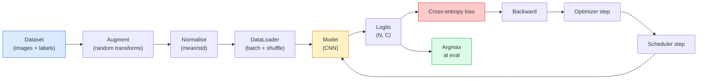

# Klasyfikacja obrazów

> Klasyfikator to funkcja z pikseli w rozkład prawdopodobieństwa nad klasami. Wszystko inne to hydraulika.

**Type:** Build
**Languages:** Python
**Prerequisites:** Phase 2 Lesson 09 (Model Evaluation), Phase 3 Lesson 10 (Mini Framework), Phase 4 Lesson 03 (CNNs)
**Time:** ~75 minutes

## Learning Objectives

- Zbudować kompletny potok klasyfikacji obrazów na CIFAR-10: zbiór danych, augmentacja, model, pętla treningowa, ewaluacja
- Wyjaśnić rolę każdego komponentu (dataloader, loss, optimizer, scheduler, augmentacja) i przewidzieć, jak złamanie któregoś z nich przejawia się w krzywej straty
- Zaimplementować mixup, cutout i label smoothing od podstaw oraz uzasadnić, kiedy każdy jest wart dodania
- Czytać macierz pomyłek i tabelę precyzji/odzysku na klasę, aby diagnozować awarie zbioru danych i modelu wykraczające poza zagregowaną dokładność

## The Problem

Każde zadanie widzenia, które trafia do produkcji, sprowadza się do klasyfikacji obrazów na pewnym poziomie. Detekcja klasyfikuje regiony. Segmentacja klasyfikuje piksele. Wyszukiwanie rankingsuje według podobieństwa do centroidów klas. Opanowanie klasyfikacji — pętli danych, polityki augmentacji, funkcji straty, ewaluacji — to umiejętność, która przenosi się na każde inne zadanie w tej fazie.

Większość błędów klasyfikacji nie tkwi w modelu. Żyją w potoku: zepsuta normalizacja, nieprzetasowany zbiór treningowy, augmentacja zniekształcająca etykiety, walidacja zanieczyszczona danymi treningowymi, tempo uczenia, które po cichu rozbiega się po epoce 30. CNN, która z poprawnym setupem osiągnęłaby 93% na CIFAR-10, z zepsutym często uzyskuje 70-75%, a krzywa straty wygląda wiarygodnie przez cały czas.

Ta lekcja łączy cały potok ręcznie, aby każda część była możliwa do sprawdzenia. Nie będziesz używać niczego z `torchvision.datasets`, co mogłoby ukryć błąd.

## The Concept

### Potok klasyfikacji



Każda linia w tej pętli to miejsce, w którym może żyć błąd. Entropia krzyżowa przyjmuje surowe logity, a nie wyjścia softmax, więc każde `model(x).softmax()` przed funkcją straty po cichu oblicza zły gradient. Augmentacje stosują się tylko do wejść, nie do etykiet — z wyjątkiem mixupu, który miesza oba. `optimizer.zero_grad()` musi nastąpić raz na krok; pominięcie go kumuluje gradienty i wygląda jak szalenie niestabilne tempo uczenia. Każdy z tych błędów spłaszcza krzywą uczenia bez rzucania błędem.

### Entropia krzyżowa, logity i softmax

Klasyfikator produkuje `C` liczb na obraz zwanych logitami. Zastosowanie softmax zamienia je w rozkład prawdopodobieństwa:

```
softmax(z)_i = exp(z_i) / sum_j exp(z_j)
```

Entropia krzyżowa mierzy ujemne log-prawdopodobieństwo poprawnej klasy:

```
CE(z, y) = -log( softmax(z)_y )
        = -z_y + log( sum_j exp(z_j) )
```

Prawa forma jest numerycznie stabilna (log-sum-exp). `nn.CrossEntropyLoss` w PyTorch łączy softmax + NLL w jednej operacji i przyjmuje bezpośrednio surowe logity. Zastosowanie softmax samodzielnie jest prawie zawsze błędem — obliczasz log(softmax(softmax(z))), wielkość bez znaczenia.

### Dlaczego augmentacja działa

CNN ma indukcyjne uprzedzenie do translacji (z współdzielenia wag), ale nie ma wbudowanej niezmienniczości na przycięcia, odwrócenia, zmiany koloru czy zasłonięcie. Jedynym sposobem na nauczenie jej tych niezmienniczości jest pokazanie jej pikseli, które je ćwiczą. Każda losowa transformacja podczas treningu to sposób na powiedzenie: "te dwa obrazy mają tę samą etykietę; naucz się cech, które ignorują różnicę."

```
Original crop:  "dog facing left"
Flip:           "dog facing right"       <- same label, different pixels
Rotate(+15):    "dog, slight tilt"
Colour jitter:  "dog in warmer light"
RandomErasing:  "dog with patch missing"
```

Zasada: augmentacja musi zachowywać etykietę. Cutout i obrót na cyfrze mogą zmienić "6" w "9"; w tym zbiorze danych używasz mniejszych zakresów obrotu i wybierasz augmentacje respektujące niezmienniczości specyficzne dla cyfr.

### Mixup i cutmix

Zwykła augmentacja przekształca piksele, ale utrzymuje etykiety w formie one-hot. **Mixup** i **cutmix** przełamują to przez interpolację obu.

```
Mixup:
  lambda ~ Beta(a, a)
  x = lambda * x_i + (1 - lambda) * x_j
  y = lambda * y_i + (1 - lambda) * y_j

Cutmix:
  paste a random rectangle of x_j into x_i
  y = area-weighted mix of y_i and y_j
```

Dlaczego to pomaga: model przestaje zapamiętywać kolczaste cele one-hot i uczy się interpolować między klasami. Strata treningowa rośnie, dokładność testowa rośnie. To najtańszy pojedynczy upgrade odporności dla dowolnego klasyfikatora.

### Wygładzanie etykiet (Label smoothing)

Kuzyn mixupu. Zamiast trenować względem `[0, 0, 1, 0, 0]`, trenuj względem `[eps/C, eps/C, 1-eps, eps/C, eps/C]` dla małego `eps` np. 0.1. Powstrzymuje model przed produkowaniem arbitralnie ostrych logitów i poprawia kalibrację prawie bez kosztu. Wbudowane w `nn.CrossEntropyLoss(label_smoothing=0.1)` od PyTorch 1.10.

### Ewaluacja poza dokładnością

Zagregowana dokładność ukrywa brak równowagi. Klasyfikator binarny 90-10, który zawsze przewiduje klasę większościową, osiąga 90%. Narzędzia, które faktycznie mówią, co się dzieje:

- **Per-class accuracy** — jedna liczba na klasę; natychmiast ujawnia słabo działające kategorie.
- **Confusion matrix** — siatka C x C z wiersz i kolumna j = liczba prawdziwej klasy i przewidzianej jako j; przekątna to poprawnie, poza przekątną mieszka twój model.
- **Top-1 / Top-5** — czy poprawna klasa jest wśród 1 lub 5 najlepszych przewidywań; Top-5 ma znaczenie dla ImageNet, ponieważ klasy takie jak "Norwich terrier" vs "Norfolk terrier" są autentycznie niejednoznaczne.
- **Calibration (ECE)** — czy przewidywanie z pewnością 0.8 jest poprawne w 80% przypadków? Nowoczesne sieci są systematycznie zbyt pewne; napraw przez skalowanie temperatury lub wygładzanie etykiet.

```figure
receptive-field
```

## Build It

### Step 1: A deterministic synthetic dataset

CIFAR-10 żyje na dysku. Aby ta lekcja była powtarzalna i szybka, budujemy syntetyczny zbiór danych wyglądający jak CIFAR — obrazy RGB 32x32 ze strukturą specyficzną dla klasy, którą model musi się nauczyć. Ten sam potok działa bez zmian na prawdziwym CIFAR-10.

```python
import numpy as np
import torch
from torch.utils.data import Dataset


def synthetic_cifar(num_per_class=1000, num_classes=10, seed=0):
    rng = np.random.default_rng(seed)
    X = []
    Y = []
    for c in range(num_classes):
        centre = rng.uniform(0, 1, (3,))
        freq = 2 + c
        for _ in range(num_per_class):
            yy, xx = np.meshgrid(np.linspace(0, 1, 32), np.linspace(0, 1, 32), indexing="ij")
            r = np.sin(xx * freq) * 0.5 + centre[0]
            g = np.cos(yy * freq) * 0.5 + centre[1]
            b = (xx + yy) * 0.5 * centre[2]
            img = np.stack([r, g, b], axis=-1)
            img += rng.normal(0, 0.08, img.shape)
            img = np.clip(img, 0, 1)
            X.append(img.astype(np.float32))
            Y.append(c)
    X = np.stack(X)
    Y = np.array(Y)
    idx = rng.permutation(len(X))
    return X[idx], Y[idx]


class ArrayDataset(Dataset):
    def __init__(self, X, Y, transform=None):
        self.X = X
        self.Y = Y
        self.transform = transform

    def __len__(self):
        return len(self.X)

    def __getitem__(self, i):
        img = self.X[i]
        if self.transform is not None:
            img = self.transform(img)
        img = torch.from_numpy(img).permute(2, 0, 1)
        return img, int(self.Y[i])
```

Każda klasa dostaje własną paletę kolorów i wzór częstotliwości, plus szum Gaussa, aby zmusić model do uczenia się sygnału, a nie zapamiętywania pikseli. Dziesięć klas, po tysiąc obrazów każda, permutowane.

### Step 2: Normalisation and augmentation

Dwie transformacje, które ma każdy potok widzenia.

```python
def standardize(mean, std):
    mean = np.array(mean, dtype=np.float32)
    std = np.array(std, dtype=np.float32)
    def _fn(img):
        return (img - mean) / std
    return _fn


def random_hflip(p=0.5):
    def _fn(img):
        if np.random.random() < p:
            return img[:, ::-1, :].copy()
        return img
    return _fn


def random_crop(pad=4):
    def _fn(img):
        h, w = img.shape[:2]
        padded = np.pad(img, ((pad, pad), (pad, pad), (0, 0)), mode="reflect")
        y = np.random.randint(0, 2 * pad)
        x = np.random.randint(0, 2 * pad)
        return padded[y:y + h, x:x + w, :]
    return _fn


def compose(*fns):
    def _fn(img):
        for fn in fns:
            img = fn(img)
        return img
    return _fn
```

Reflect-pad przed przycięciem, a nie zero-pad, ponieważ czarne krawędzie to sygnał, którego model nauczyłby się ignorować w nieużyteczny sposób.

### Step 3: Mixup

Miesza dwa obrazy i dwie etykiety wewnątrz kroku treningowego. Zaimplementowany jako transformacja batcha, aby żył obok forward passu, a nie wewnątrz zbioru danych.

```python
def mixup_batch(x, y, num_classes, alpha=0.2):
    if alpha <= 0:
        return x, torch.nn.functional.one_hot(y, num_classes).float()
    lam = float(np.random.beta(alpha, alpha))
    idx = torch.randperm(x.size(0), device=x.device)
    x_mixed = lam * x + (1 - lam) * x[idx]
    y_onehot = torch.nn.functional.one_hot(y, num_classes).float()
    y_mixed = lam * y_onehot + (1 - lam) * y_onehot[idx]
    return x_mixed, y_mixed


def soft_cross_entropy(logits, soft_targets):
    log_probs = torch.log_softmax(logits, dim=-1)
    return -(soft_targets * log_probs).sum(dim=-1).mean()
```

`soft_cross_entropy` to entropia krzyżowa względem rozkładu miękkich etykiet. Sprowadza się do zwykłego przypadku one-hot, gdy cel jest dokładnie one-hot.

### Step 4: The training loop

Kompletny przepis: jeden przebieg przez dane, gradienty raz na batch, scheduler kroczony raz na epokę.

```python
import torch
import torch.nn as nn
from torch.utils.data import DataLoader
from torch.optim import SGD
from torch.optim.lr_scheduler import CosineAnnealingLR

def train_one_epoch(model, loader, optimizer, device, num_classes, use_mixup=True):
    model.train()
    total, correct, loss_sum = 0, 0, 0.0
    for x, y in loader:
        x, y = x.to(device), y.to(device)
        if use_mixup:
            x_m, y_soft = mixup_batch(x, y, num_classes)
            logits = model(x_m)
            loss = soft_cross_entropy(logits, y_soft)
        else:
            logits = model(x)
            loss = nn.functional.cross_entropy(logits, y, label_smoothing=0.1)
        optimizer.zero_grad()
        loss.backward()
        optimizer.step()
        loss_sum += loss.item() * x.size(0)
        total += x.size(0)
        # Training accuracy vs the un-mixed labels `y` is only an approximation
        # when mixup is on (the model saw soft targets, not y). Treat it as a
        # rough progress signal; rely on val accuracy for real performance.
        with torch.no_grad():
            pred = logits.argmax(dim=-1)
            correct += (pred == y).sum().item()
    return loss_sum / total, correct / total


@torch.no_grad()
def evaluate(model, loader, device, num_classes):
    model.eval()
    total, correct = 0, 0
    loss_sum = 0.0
    cm = torch.zeros(num_classes, num_classes, dtype=torch.long)
    for x, y in loader:
        x, y = x.to(device), y.to(device)
        logits = model(x)
        loss = nn.functional.cross_entropy(logits, y)
        pred = logits.argmax(dim=-1)
        for t, p in zip(y.cpu(), pred.cpu()):
            cm[t, p] += 1
        loss_sum += loss.item() * x.size(0)
        total += x.size(0)
        correct += (pred == y).sum().item()
    return loss_sum / total, correct / total, cm
```

Pięć niezmienników, które sprawdzasz za każdym razem, gdy piszesz pętlę treningową:

1. `model.train()` przed treningiem, `model.eval()` przed ewaluacją — zmienia zachowanie dropout i batchnorm.
2. `.zero_grad()` przed `.backward()`.
3. `.item()` podczas akumulacji metryk, aby nic nie utrzymywało grafu obliczeniowego przy życiu.
4. `@torch.no_grad()` podczas ewaluacji — oszczędza pamięć i czas, zapobiega subtelnym wypadkom.
5. Argmax na surowych logitach, a nie softmax — ten sam wynik, jedna operacja mniej.

### Step 5: Put it together

Użyj `TinyResNet` z poprzedniej lekcji, trenuj przez kilka epok, ewaluuj.

```python
from main import synthetic_cifar, ArrayDataset
from main import standardize, random_hflip, random_crop, compose
from main import mixup_batch, soft_cross_entropy
from main import train_one_epoch, evaluate
# TinyResNet comes from the previous lesson (03-cnns-lenet-to-resnet).
# Adjust the import path to wherever you stored the previous lesson's code.
from cnns_lenet_to_resnet import TinyResNet  # example placeholder

X, Y = synthetic_cifar(num_per_class=500)
split = int(0.9 * len(X))
X_train, Y_train = X[:split], Y[:split]
X_val, Y_val = X[split:], Y[split:]

mean = [0.5, 0.5, 0.5]
std = [0.25, 0.25, 0.25]
train_tf = compose(random_hflip(), random_crop(pad=4), standardize(mean, std))
eval_tf = standardize(mean, std)

train_ds = ArrayDataset(X_train, Y_train, transform=train_tf)
val_ds = ArrayDataset(X_val, Y_val, transform=eval_tf)

train_loader = DataLoader(train_ds, batch_size=128, shuffle=True, num_workers=0)
val_loader = DataLoader(val_ds, batch_size=256, shuffle=False, num_workers=0)

device = "cuda" if torch.cuda.is_available() else "cpu"
model = TinyResNet(num_classes=10).to(device)
optimizer = SGD(model.parameters(), lr=0.1, momentum=0.9, weight_decay=5e-4, nesterov=True)
scheduler = CosineAnnealingLR(optimizer, T_max=10)

for epoch in range(10):
    tr_loss, tr_acc = train_one_epoch(model, train_loader, optimizer, device, 10, use_mixup=True)
    va_loss, va_acc, _ = evaluate(model, val_loader, device, 10)
    scheduler.step()
    print(f"epoch {epoch:2d}  lr {scheduler.get_last_lr()[0]:.4f}  "
          f"train {tr_loss:.3f}/{tr_acc:.3f}  val {va_loss:.3f}/{va_acc:.3f}")
```

Na syntetycznym zbiorze danych osiąga to prawie doskonałą dokładność walidacji w ciągu pięciu epok, co jest sednem: potok jest poprawny, model może nauczyć się tego, co da się nauczyć. Zamień zbiór danych na prawdziwy CIFAR-10, a ta sama pętla trenuje do ~90% bez zmian.

### Step 6: Read the confusion matrix

Sama dokładność nigdy nie mówi, gdzie model zawodzi. Macierz pomyłek tak.

```python
def print_confusion(cm, labels=None):
    c = cm.shape[0]
    labels = labels or [str(i) for i in range(c)]
    print(f"{'':>6}" + "".join(f"{l:>5}" for l in labels))
    for i in range(c):
        row = cm[i].tolist()
        print(f"{labels[i]:>6}" + "".join(f"{v:>5}" for v in row))
    print()
    tp = cm.diag().float()
    fp = cm.sum(dim=0).float() - tp
    fn = cm.sum(dim=1).float() - tp
    prec = tp / (tp + fp).clamp_min(1)
    rec = tp / (tp + fn).clamp_min(1)
    f1 = 2 * prec * rec / (prec + rec).clamp_min(1e-9)
    for i in range(c):
        print(f"{labels[i]:>6}  prec {prec[i]:.3f}  rec {rec[i]:.3f}  f1 {f1[i]:.3f}")

_, _, cm = evaluate(model, val_loader, device, 10)
print_confusion(cm)
```

Wiersze to prawdziwe klasy, kolumny to przewidywania. Skupisko wartości poza przekątną między klasami 3 i 5 oznacza, że model myli te dwie klasy i daje punkt wyjścia do celowanego zbierania danych lub augmentacji specyficznej dla klasy.

## Use It

`torchvision` opakowuje wszystko powyżej w idiomatyczne komponenty. Dla prawdziwego CIFAR-10 pełny potok to cztery linie plus pętla treningowa.

```python
from torchvision.datasets import CIFAR10
from torchvision.transforms import Compose, RandomCrop, RandomHorizontalFlip, ToTensor, Normalize

mean = (0.4914, 0.4822, 0.4465)
std = (0.2470, 0.2435, 0.2616)
train_tf = Compose([
    RandomCrop(32, padding=4, padding_mode="reflect"),
    RandomHorizontalFlip(),
    ToTensor(),
    Normalize(mean, std),
])
eval_tf = Compose([ToTensor(), Normalize(mean, std)])

train_ds = CIFAR10(root="./data", train=True,  download=True, transform=train_tf)
val_ds   = CIFAR10(root="./data", train=False, download=True, transform=eval_tf)
```

Dwie rzeczy do zauważenia: mean/std są **specyficzne dla zbioru danych** — obliczone na zbiorze treningowym CIFAR-10, a nie ImageNet — a reflect pad jest domyślną polityką przycinania społeczności. Kopiowanie-wklejanie statystyk ImageNet tutaj to ok. 1% wyciek dokładności, którego nikt nie łapie, dopóki ktoś nie profiluje modelu.

## Ship It

Ta lekcja produkuje:

- `outputs/prompt-classifier-pipeline-auditor.md` — prompt, który audytuje skrypt treningowy pod kątem pięciu niezmienników powyżej i wskazuje pierwsze naruszenie.
- `outputs/skill-classification-diagnostics.md` — umiejętność, która dla danej macierzy pomyłek i listy nazw klas podsumowuje błędy na klasę i proponuje najbardziej wpływową naprawę.

## Exercises

1. **(Easy)** Wytrenuj ten sam model z mixup i bez mixup przez pięć epok na syntetycznym zbiorze danych. Narysuj wykres straty treningowej i walidacyjnej dla obu. Wyjaśnij, dlaczego strata treningowa z mixup jest wyższa, a dokładność walidacyjna podobna lub lepsza.
2. **(Medium)** Zaimplementuj Cutout — wyzeruj losowy kwadrat 8x8 w każdym obrazie treningowym — i przeprowadź ablację vs brak augmentacji, hflip+crop, hflip+crop+cutout, hflip+crop+mixup. Raportuj dokładność walidacyjną dla każdego.
3. **(Hard)** Zbuduj potok CIFAR-100 (100 klas, ten sam rozmiar wejścia) i odtwórz trenowanie ResNet-34 w granicach 1% opublikowanej dokładności. Dodatki: przeskanuj trzy tempa uczenia i dwie wagi regularyzacji, loguj do lokalnego CSV, wyprodukuj końcową tabelę największych pomyłek w macierzy pomyłek.

## Key Terms

| Term | What people say | What it actually means |
|------|----------------|----------------------|
| Logits | "Raw outputs" | The pre-softmax vector of C numbers per image; cross-entropy expects these, not softmaxed values |
| Cross-entropy | "The loss" | Negative log-probability of the correct class; combines log-softmax and NLL in one stable op |
| DataLoader | "The batcher" | Wraps a dataset with shuffling, batching, and (optional) multi-worker loading; gets blamed for half of training bugs |
| Augmentation | "Random transforms" | Any pixel-level transform at training time that preserves the label; teaches invariances the CNN does not have natively |
| Mixup / Cutmix | "Mix two images" | Blend both inputs and labels so the classifier learns smooth interpolations instead of hard boundaries |
| Label smoothing | "Softer targets" | Replace one-hot with (1-eps, eps/(C-1), ...); improves calibration and slightly boosts accuracy |
| Top-k accuracy | "Top-5" | The correct class is in the k highest-probability predictions; used on datasets with genuinely ambiguous classes |
| Confusion matrix | "Where errors live" | C x C table where entry (i, j) counts images of true class i predicted as j; diagonal is right, off-diagonal tells you what to fix |

## Further Reading

- [CS231n: Training Neural Networks](https://cs231n.github.io/neural-networks-3/) — wciąż najczystszy przegląd potoku treningowego na jednej stronie
- [Bag of Tricks for Image Classification (He et al., 2019)](https://arxiv.org/abs/1812.01187) — każda mała sztuczka, które razem dodają 3-4% dokładności ResNet na ImageNet
- [mixup: Beyond Empirical Risk Minimization (Zhang et al., 2017)](https://arxiv.org/abs/1710.09412) — oryginalna publikacja mixup; trzy strony teorii plus przekonujące eksperymenty
- [Why temperature scaling matters (Guo et al., 2017)](https://arxiv.org/abs/1706.04599) — publikacja, która udowodniła, że nowoczesne sieci są źle skalibrowane i naprawiła to jednym skalarnym parametrem