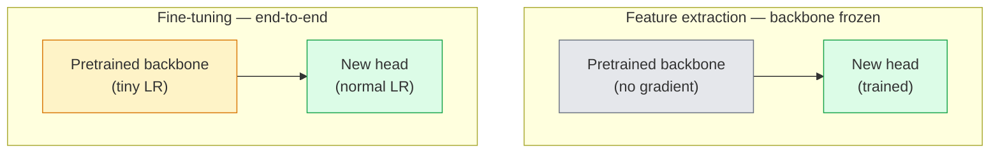

# Transfer Learning i dostrajanie

> Ktoś inny spędził milion godzin GPU na uczeniu sieci, jak wyglądają krawędzie, tekstury i części obiektów. Powinieneś pożyczyć te cechy, zanim wytrenujesz własne.

**Type:** Build
**Languages:** Python
**Prerequisites:** Phase 4 Lesson 03 (CNNs), Phase 4 Lesson 04 (Image Classification)
**Time:** ~75 minutes

## Learning Objectives

- Odróżnić ekstrakcję cech od dostrajania i wybrać właściwą na podstawie rozmiaru zbioru danych, odległości dziedziny i budżetu obliczeniowego
- Wczytać wstępnie wytrenowany backbone, zastąpić jego głowę klasyfikatora i wytrenować tylko głowę do działającego baseline'u w mniej niż 20 liniach
- Stopniowo odmrażać warstwy z dyskryminacyjnymi tempami uczenia, aby wczesne ogólne cechy otrzymywały mniejsze aktualizacje niż późne cechy specyficzne dla zadania
- Zdiagnozować trzy typowe awarie: dryf cech od zbyt wysokiego LR na odmrożonych blokach, załamanie statystyk BN na małych zbiorach danych i katastroficzne zapominanie

## The Problem

Wytrenowanie ResNet-50 na ImageNet kosztuje około 2000 godzin GPU. Bardzo niewiele zespołów ma taki budżet na każde zadanie, które wdrażają. To, co prawie każdy zespół faktycznie wdraża, to wstępnie wytrenowany backbone z nową głową wytrenowaną na kilkuset lub kilku tysiącach obrazów specyficznych dla zadania.

To nie skrót. Pierwszy blok splotowy dowolnej CNN trenowanej na ImageNet uczy się krawędzi i filtrów podobnych do Gabora. Kilka następnych bloków uczy się tekstur i prostych motywów. Środkowe bloki uczą się części obiektów. Końcowe bloki uczą się kombinacji, które zaczynają przypominać 1000 kategorii ImageNet. Pierwsze 90% tej hierarchii przenosi się prawie bez zmian do obrazowania medycznego, inspekcji przemysłowej, danych satelitarnych i każdego innego zadania widzenia — ponieważ natura ma ograniczone słownictwo krawędzi i tekstur. Ostatnie 10% to to, co faktycznie trenujesz.

Poprawne wykonanie transfer learningu kryje trzy błędy: zniszczenie wstępnie wytrenowanych cech zbyt wysokim tempem uczenia, zagłodzenie modelu informacji przez zamrożenie zbyt wiele oraz pozwolenie, aby statystyki bieżące BatchNorm dryfowały w kierunku małego zbioru danych, z którego reszta sieci nigdy się nie uczyła. Ta lekcja celowo pokazuje każdy z nich.

## The Concept

### Ekstrakcja cech vs dostrajanie

Dwa reżimy, wybierane na podstawie tego, jak bardzo ufasz wstępnie wytrenowanym cechom i ile masz danych.



Zasady kciuka:

| Dataset size | Domain distance | Recipe |
|--------------|-----------------|--------|
| < 1k images | close to ImageNet | Freeze backbone, train head only |
| 1k-10k | close | Freeze first 2-3 stages, fine-tune the rest |
| 10k-100k | any | Fine-tune end-to-end with discriminative LR |
| 100k+ | far | Fine-tune everything; consider training from scratch if domain is far enough |

"Blisko ImageNet" z grubsza oznacza naturalne zdjęcia RGB z treścią przypominającą obiekty. Medyczne skany CT, zdjęcia satelitarne z lotu ptaka i mikroskopia to odległe dziedziny — cechy wciąż pomagają, ale będziesz musiał pozwolić większej liczbie warstw się adaptować.

### Dlaczego zamrażanie w ogóle działa

Cechy ImageNet, których uczy się CNN, nie są wyspecjalizowane do 1000 kategorii. Są wyspecjalizowane do statystyk naturalnych obrazów: krawędzie pod określonymi kątami, tekstury, wzory kontrastu, prymitywy kształtów. Te statystyki są stabilne w prawie każdej dziedzinie wizualnej, którą człowiek potrafi nazwać. Dlatego model wytrenowany na ImageNet i oceniony zero-shot na CIFAR-10 z tylko nową głową liniową (bez dostrajania backbone'u) osiąga ponad 80% dokładności. Głowa uczy się, które z już poznanych cech wagi przypisać do tego zadania.

### Dyskryminacyjne tempa uczenia

Gdy odmrażasz, wczesne warstwy powinny trenować wolniej niż późne. Wczesne warstwy kodują ogólne cechy, które chcesz zachować; późne warstwy kodują strukturę specyficzną dla zadania, którą trzeba dużo przesunąć.

```
Typical recipe:

  stage 0 (stem + first group): lr = base_lr / 100    (mostly fixed)
  stage 1:                       lr = base_lr / 10
  stage 2:                       lr = base_lr / 3
  stage 3 (last backbone group): lr = base_lr
  head:                          lr = base_lr  (or slightly higher)
```

W PyTorch to po prostu lista grup parametrów przekazana do optymalizatora. Jeden model, pięć temp uczenia, zero dodatkowego kodu.

### Problem BatchNorm

Warstwy BN przechowują bufory `running_mean` i `running_var`, które zostały obliczone na ImageNet. Jeśli twoje zadanie ma inną dystrybucję pikseli — inne oświetlenie, inny sensor, inną przestrzeń barw — te bufory są błędne. Trzy opcje w kolejności preferencji:

1. **Dostrajaj z BN w trybie train.** Pozwól BN aktualizować swoje statystyki bieżące wraz z resztą. Domyślny wybór, gdy zbiór danych zadania jest średniej wielkości (>= 5k przykładów).
2. **Zamroź BN w trybie eval.** Zachowaj statystyki ImageNet i trenuj tylko wagi. Poprawne, gdy twój zbiór danych jest wystarczająco mały, że średnia ruchoma BN byłaby zaszumiona.
3. **Zastąp BN GroupNorm.** Usuwa całkowicie problem średniej ruchomej. Używane w backbone'ach detekcji i segmentacji, gdzie rozmiar batcha na GPU jest mały.

Popełnienie tego błędu po cichu obniża dokładność o 5-15%.

### Projekt głowy

Głowa klasyfikatora to 1-3 warstwy liniowe plus opcjonalny dropout. Każdy backbone torchvision ma domyślną głowę, którą zastępujesz:

```
backbone.fc = nn.Linear(backbone.fc.in_features, num_classes)          # ResNet
backbone.classifier[1] = nn.Linear(..., num_classes)                    # EfficientNet, MobileNet
backbone.heads.head = nn.Linear(..., num_classes)                       # torchvision ViT
```

Dla małych zbiorów danych pojedyncza warstwa liniowa zwykle wystarcza. Dodanie warstwy ukrytej (Linear -> ReLU -> Dropout -> Linear) pomaga, gdy dystrybucja zadania jest dalej od dystrybucji treningowej backbone'u.

### Warstwowy zanik LR

Gładsza wersja dyskryminacyjnego LR używana w nowoczesnym dostrajaniu (BEiT, DINOv2, ViT-B fine-tunes). Zamiast grupować warstwy w etapy, daj każdej warstwie nieco mniejsze LR niż warstwie nad nią:

```
lr_layer_k = base_lr * decay^(L - k)
```

Z decay = 0.75 i L = 12 bloków transformerowych, pierwszy blok trenuje przy `0.75^11 ≈ 0.04x` LR głowy. Ma większe znaczenie dla dostrajania transformerów niż dla CNN, gdzie grupowe LR na etapach zwykle wystarczają.

### Co ewaluować

Uruchomienia transfer learningu potrzebują dwóch liczb, których nie śledziłbyś przy trenowaniu od zera:

- **Pretrained-only accuracy** — dokładność głowy z zamrożonym backbone'em. To twoje podłoga.
- **Fine-tuned accuracy** — ten sam model po trenowaniu end-to-end. To twój sufit.

Jeśli fine-tuned jest mniejsze niż pretrained-only, masz błąd LR lub BN. Zawsze drukuj obie.

## Build It

### Step 1: Load a pretrained backbone and inspect it

```python
import torch
import torch.nn as nn
from torchvision.models import resnet18, ResNet18_Weights

backbone = resnet18(weights=ResNet18_Weights.IMAGENET1K_V1)
print(backbone)
print()
print("classifier head:", backbone.fc)
print("feature dim:", backbone.fc.in_features)
```

`ResNet18` ma cztery etapy (`layer1..layer4`) plus stem i głowę `fc`. Każdy backbone klasyfikacji torchvision ma analogiczną strukturę.

### Step 2: Feature extraction — freeze everything, replace the head

```python
def make_feature_extractor(num_classes=10):
    model = resnet18(weights=ResNet18_Weights.IMAGENET1K_V1)
    for p in model.parameters():
        p.requires_grad = False
    model.fc = nn.Linear(model.fc.in_features, num_classes)
    return model

model = make_feature_extractor(num_classes=10)
trainable = sum(p.numel() for p in model.parameters() if p.requires_grad)
frozen = sum(p.numel() for p in model.parameters() if not p.requires_grad)
print(f"trainable: {trainable:>10,}")
print(f"frozen:    {frozen:>10,}")
```

Tylko `model.fc` jest trenowalny. Backbone to zamrożony ekstraktor cech.

### Step 3: Discriminative fine-tuning

Narzędzie do budowania grup parametrów z tempami uczenia specyficznymi dla etapów.

```python
def discriminative_param_groups(model, base_lr=1e-3, decay=0.3):
    stages = [
        ["conv1", "bn1"],
        ["layer1"],
        ["layer2"],
        ["layer3"],
        ["layer4"],
        ["fc"],
    ]
    groups = []
    for i, names in enumerate(stages):
        lr = base_lr * (decay ** (len(stages) - 1 - i))
        params = [p for n, p in model.named_parameters()
                  if any(n.startswith(k) for k in names)]
        if params:
            groups.append({"params": params, "lr": lr, "name": "_".join(names)})
    return groups

model = resnet18(weights=ResNet18_Weights.IMAGENET1K_V1)
model.fc = nn.Linear(model.fc.in_features, 10)
for p in model.parameters():
    p.requires_grad = True

groups = discriminative_param_groups(model)
for g in groups:
    print(f"{g['name']:>10s}  lr={g['lr']:.2e}  params={sum(p.numel() for p in g['params']):>8,}")
```

`decay=0.3` oznacza, że każdy etap trenuje z 30% tempa następnego. `fc` dostaje `base_lr`, `layer4` dostaje `0.3 * base_lr`, `conv1` dostaje `0.3^5 * base_lr ≈ 0.00243 * base_lr`. Brzmi ekstremalnie; empirycznie działa.

### Step 4: BatchNorm handling

Pomocnik do zamrażania statystyk bieżących BN bez zamrażania ich wag.

```python
def freeze_bn_stats(model):
    for m in model.modules():
        if isinstance(m, (nn.BatchNorm1d, nn.BatchNorm2d, nn.BatchNorm3d)):
            m.eval()
            for p in m.parameters():
                p.requires_grad = False
    return model
```

Wywołaj to po ustawieniu `model.train()` na początku każdej epoki. `model.train()` przełącza wszystko w tryb treningowy; to odwraca to tylko dla warstw BN.

### Step 5: A minimal end-to-end fine-tuning loop

```python
from torch.optim import SGD
from torch.utils.data import DataLoader
from torch.optim.lr_scheduler import CosineAnnealingLR
import torch.nn.functional as F

def fine_tune(model, train_loader, val_loader, device, epochs=5, base_lr=1e-3, freeze_bn=False):
    model = model.to(device)
    groups = discriminative_param_groups(model, base_lr=base_lr)
    optimizer = SGD(groups, momentum=0.9, weight_decay=1e-4, nesterov=True)
    scheduler = CosineAnnealingLR(optimizer, T_max=epochs)

    for epoch in range(epochs):
        model.train()
        if freeze_bn:
            freeze_bn_stats(model)
        tr_loss, tr_correct, tr_total = 0.0, 0, 0
        for x, y in train_loader:
            x, y = x.to(device), y.to(device)
            logits = model(x)
            loss = F.cross_entropy(logits, y, label_smoothing=0.1)
            optimizer.zero_grad()
            loss.backward()
            optimizer.step()
            tr_loss += loss.item() * x.size(0)
            tr_total += x.size(0)
            tr_correct += (logits.argmax(-1) == y).sum().item()
        scheduler.step()

        model.eval()
        va_total, va_correct = 0, 0
        with torch.no_grad():
            for x, y in val_loader:
                x, y = x.to(device), y.to(device)
                pred = model(x).argmax(-1)
                va_total += x.size(0)
                va_correct += (pred == y).sum().item()
        print(f"epoch {epoch}  train {tr_loss/tr_total:.3f}/{tr_correct/tr_total:.3f}  "
              f"val {va_correct/va_total:.3f}")
    return model
```

Pięć epok z powyższym przepisem na CIFAR-10 przenosi `ResNet18-IMAGENET1K_V1` z ~70% dokładności zero-shot linear-probe do ~93% dokładności po dostrojeniu. Sama głowa zatrzymałaby się na około 86% bez dotykania backbone'u.

### Step 6: Progressive unfreezing

Harmonogram, który odmraża jeden etap na epokę od końca do początku. Łagodzi dryf cech kosztem kilku dodatkowych epok.

```python
def progressive_unfreeze_schedule(model):
    stages = ["layer4", "layer3", "layer2", "layer1"]
    yielded = set()

    def start():
        for p in model.parameters():
            p.requires_grad = False
        for p in model.fc.parameters():
            p.requires_grad = True

    def unfreeze(epoch):
        if epoch < len(stages):
            name = stages[epoch]
            yielded.add(name)
            for n, p in model.named_parameters():
                if n.startswith(name):
                    p.requires_grad = True
            return name
        return None

    return start, unfreeze
```

Wywołaj `start()` raz przed pierwszą epoką. Wywołaj `unfreeze(epoch)` na początku każdej epoki. Przebuduj optymalizator za każdym razem, gdy zmienia się zbiór trenowalnych parametrów, w przeciwnym razie zamrożone parametry wciąż przechowują buforowane momenty, które go dezorientują.

## Use It

Dla większości rzeczywistych zadań `torchvision.models` + trzy linie wystarczą. Cięższa machina powyżej ma znaczenie, gdy napotkasz problemy, których domyślne ustawienia bibliotek nie naprawią.

```python
from torchvision.models import resnet50, ResNet50_Weights

model = resnet50(weights=ResNet50_Weights.IMAGENET1K_V2)
model.fc = nn.Linear(model.fc.in_features, num_classes)
optimizer = torch.optim.AdamW(model.parameters(), lr=1e-4, weight_decay=1e-4)
```

Dwa inne domyślne ustawienia produkcyjne:

- `timm` udostępnia ~800 wstępnie wytrenowanych backbone'ów widzenia ze spójnym API (`timm.create_model("resnet50", pretrained=True, num_classes=10)`). Dla każdego dostrajania poza zoo torchvision jest to standard.
- Dla transformerów `transformers.AutoModelForImageClassification.from_pretrained(name, num_labels=N)` daje ViT / BEiT / DeiT z tą samą semantyką wczytywania co modele tekstowe.

## Ship It

Ta lekcja produkuje:

- `outputs/prompt-fine-tune-planner.md` — prompt, który wybiera ekstrakcję cech vs progresywne vs end-to-end dostrajanie na podstawie rozmiaru zbioru danych, odległości dziedziny i budżetu obliczeniowego.
- `outputs/skill-freeze-inspector.md` — umiejętność, która dla danego modelu PyTorch raportuje, które parametry są trenowalne, które warstwy BatchNorm są w trybie eval i czy optymalizator faktycznie otrzymuje trenowalne parametry.

## Exercises

1. **(Easy)** Wytrenuj `ResNet18` jako sondę liniową (backbone zamrożony) i jako pełne dostrajanie na tym samym syntetycznym zbiorze CIFAR. Raportuj obie dokładności obok siebie. Wyjaśnij, która różnica mówi, że cechy się dobrze przenoszą, a która mówi, że nie.
2. **(Medium)** Wprowadź celowo błąd: ustaw `base_lr = 1e-1` na etapie backbone'u zamiast na głowie. Pokaż, jak strata treningowa eksploduje, a następnie odzyskaj, stosując pomocnik `discriminative_param_groups`. Zapisz LR, przy którym każdy etap zaczyna rozbiegać się.
3. **(Hard)** Weź zbiór danych obrazowania medycznego (np. CheXpert-small, PatchCamelyon lub HAM10000) i porównaj trzy reżimy: (a) zamrożony backbone wstępnie wytrenowany na ImageNet + głowa liniowa; (b) wstępnie wytrenowany na ImageNet dostrajany end-to-end; (c) trenowanie od zera. Raportuj dokładność i koszt obliczeniowy dla każdego. Przy jakim rozmiarze zbioru danych trenowanie od zera staje się konkurencyjne?

## Key Terms

| Term | What people say | What it actually means |
|------|----------------|----------------------|
| Feature extraction | "Freeze and train head" | Backbone parameters frozen, only the new classifier head receives gradient |
| Fine-tuning | "Retrain end-to-end" | All parameters trainable, usually with much smaller LR than scratch training |
| Discriminative LR | "Smaller LR for early layers" | Optimizer parameter groups where early-stage LR is a fraction of late-stage LR |
| Layer-wise LR decay | "Smooth LR gradient" | Per-layer LR multiplied by decay^(L - k); common in transformer fine-tunes |
| Catastrophic forgetting | "The model lost ImageNet" | A too-high LR overwrites pretrained features before the new task signal is learnt |
| BN statistics drift | "Running mean is wrong" | BatchNorm running_mean/var computed on a different distribution than the current task, silently hurting accuracy |
| Linear probe | "Frozen backbone + linear head" | Evaluation of pretrained features — accuracy of the best linear classifier on top of the frozen representation |
| Catastrophic collapse | "Everything predicts one class" | Happens when fine-tuning with an LR high enough to destroy features before gradients from the head can stabilise |

## Further Reading

- [How transferable are features in deep neural networks? (Yosinski et al., 2014)](https://arxiv.org/abs/1411.1792) — publikacja, która skwantyfikowała możliwość przenoszenia cech między warstwami
- [Universal Language Model Fine-tuning (ULMFiT, Howard & Ruder, 2018)](https://arxiv.org/abs/1801.06146) — oryginalny przepis na dyskryminacyjne LR / progresywne odmrażanie; pomysły przenoszą się bezpośrednio na widzenie
- [timm documentation](https://huggingface.co/docs/timm) — źródło dla nowoczesnych backbone'ów widzenia i dokładnych domyślnych ustawień dostrajania, z którymi były trenowane
- [A Simple Framework for Linear-Probe Evaluation (Kornblith et al., 2019)](https://arxiv.org/abs/1805.08974) — dlaczego dokładność sondy liniowej ma znaczenie i jak ją poprawnie raportować