# Detekcja obiektów — YOLO od podstaw

> Detekcja to klasyfikacja plus regresja, uruchomiona w każdej pozycji mapy cech, a następnie oczyszczona przez tłumienie nie-maksymalne.

**Type:** Build
**Languages:** Python
**Prerequisites:** Phase 4 Lesson 03 (CNNs), Phase 4 Lesson 04 (Image Classification), Phase 4 Lesson 05 (Transfer Learning)
**Time:** ~75 minutes

## Learning Objectives

- Wyjaśnić konstrukcję siatki i kotwic, która zamienia detekcję w problem gęstej predykcji, i określić, co oznacza każda liczba w tensorze wyjściowym
- Obliczyć Intersection-over-Union między prostokątami i zaimplementować tłumienie nie-maksymalne od podstaw
- Zbudować minimalistyczną głowę w stylu YOLO na bazie wstępnie wytrenowanego backbone'u, w tym funkcje straty klasyfikacji, obiektowości i regresji prostokąta
- Odczytać wiersz metryk detekcji (precision@0.5, recall, mAP@0.5, mAP@0.5:0.95) i wybrać, które pokrętło przekręcić dalej

## The Problem

Klasyfikacja mówi "ten obraz to pies." Detekcja mówi "jest pies na pikselach (112, 40, 280, 210), jest kot na (400, 180, 560, 310) i nic więcej w kadrze." Ta jedna zmiana strukturalna — przewidywanie zmiennej liczby oznaczonych prostokątów zamiast jednej etykiety na obraz — to podstawą każdego systemu autonomicznego, każdego produktu monitoringu, każdego parsera układu dokumentów i każdej linii wizji przemysłowej.

Detekcja to również miejsce, w którym wszystkie inżynieryjne kompromisy w widzeniu pojawiają się naraz. Chcesz dokładnych prostokątów (głowa regresji), chcesz poprawnej klasy dla każdego prostokąta (głowa klasyfikacji), chcesz, aby model wiedział, kiedy nie ma nic do wykrycia (wynik obiektowości), i chcesz dokładnie jednej predykcji na prawdziwy obiekt (tłumienie nie-maksymalne). Zabraknij któregoś z tych, a potok albo gubi obiekty, albo raportuje halucynowane prostokąty, albo przewiduje ten sam obiekt piętnaście razy w nieco różnych pozycjach.

YOLO (You Only Look Once, Redmon i in. 2016) był projektem, który sprawił, że wszystko to działa w czasie rzeczywistym dzięki pojedynczemu przejściu sieci splotowej, a te same decyzje strukturalne wciąż są podstawą nowoczesnych detektorów (YOLOv8, YOLOv9, YOLO-NAS, RT-DETR). Poznaj rdzeń, a każdy wariant staje się przearanżowaniem tych samych części.

## The Concept

### Detekcja jako gęsta predykcja

Klasyfikator wyprowadza C liczb na obraz. Detektor w stylu YOLO wyprowadza `(S x S x (5 + C))` liczb na obraz, gdzie S to rozmiar siatki przestrzennej.

```mermaid
flowchart LR
    IMG["Input 416x416 RGB"] --> BB["Backbone<br/>(ResNet, DarkNet, ...)"]
    BB --> FM["Feature map<br/>(C_feat, 13, 13)"]
    FM --> HEAD["Detection head<br/>(1x1 convs)"]
    HEAD --> OUT["Output tensor<br/>(13, 13, B * (5 + C))"]
    OUT --> DEC["Decode<br/>(grid + sigmoid + exp)"]
    DEC --> NMS["Non-max suppression"]
    NMS --> RESULT["Final boxes"]

    style IMG fill:#dbeafe,stroke:#2563eb
    style HEAD fill:#fef3c7,stroke:#d97706
    style NMS fill:#fecaca,stroke:#dc2626
    style RESULT fill:#dcfce7,stroke:#16a34a
```



Każda z `S * S` komórek siatki przewiduje `B` prostokątów. Dla każdego prostokąta:

- 4 liczby opisują geometrię: `tx, ty, tw, th`.
- 1 liczba to wynik obiektowości: "czy obiekt jest wyśrodkowany w tej komórce?"
- C liczb to prawdopodobieństwa klas.

Razem na komórkę: `B * (5 + C)`. Dla VOC z `S=13, B=2, C=20` to 50 liczb na komórkę.

### Dlaczego siatki i kotwice

Zwykła regresja przewidywałaby `(x, y, w, h)` dla każdego obiektu jako bezwzględną współrzędną. To trudne dla sieci splotowej, ponieważ przesunięcie obrazu nie powinno przesuwać wszystkich predykcji o tę samą wartość — każdy obiekt jest przestrzennie zakotwiczony. Siatka odpowiada na to, przypisując każdy prostokąt prawdy naziemnej do komórki siatki, w której pada jego środek; tylko ta komórka jest odpowiedzialna za ten obiekt.

Kotwice (anchors) rozwiązują drugi problem. Konwolucja 3x3 nie może łatwo wyregresować prostokąta o szerokości 500 pikseli z komórki cech o polu receptywnym 16 pikseli. Zamiast tego pre-definiujemy `B` kształtów prostokątów prior (kotwic) na komórkę i przewidujemy małe delty od każdej kotwicy. Model uczy się wybierać odpowiednią kotwicę i poprawiać ją, zamiast regresować od zera.

```
Anchor box priors (example for 416x416 input):

  small:   (30,  60)
  medium:  (75,  170)
  large:   (200, 380)

At each grid cell, every anchor emits (tx, ty, tw, th, obj, c_1, ..., c_C).
```

Nowoczesne detektory często używają FPN z różnymi zestawami kotwic na rozdzielczość — małe kotwice na płytkich mapach wysokiej rozdzielczości, duże kotwice na głębokich mapach niskiej rozdzielczości. Ten sam pomysł, więcej skal.

### Dekodowanie predykcji

Surowe `tx, ty, tw, th` to nie współrzędne prostokąta; to cele regresji do przekształcenia przed wyświetleniem:

```
centre x  = (sigmoid(tx) + cell_x) * stride
centre y  = (sigmoid(ty) + cell_y) * stride
width     = anchor_w * exp(tw)
height    = anchor_h * exp(th)
```

`sigmoid` utrzymuje przesunięcia środka wewnątrz komórki. `exp` pozwala szerokości skalować się swobodnie od kotwicy bez zmiany znaku. `stride` skaluje współrzędne siatki z powrotem do pikseli. Ten krok dekodowania jest taki sam w każdej wersji YOLO od v2.

### IoU

Uniwersalna metryka podobieństwa między dwoma prostokątami w detekcji:

```
IoU(A, B) = area(A intersect B) / area(A union B)
```

IoU = 1 oznacza identyczne; IoU = 0 oznacza brak nakładania. IoU między predykcją a prostokątem prawdy naziemnej decyduje, czy predykcja liczy się jako prawdziwie pozytywna (zazwyczaj IoU >= 0.5). IoU między dwiema predykcjami jest tym, czego NMS używa do deduplikacji.

### Tłumienie nie-maksymalne (NMS)

Sieć splotowa trenowana na sąsiednich kotwicach będzie często przewidywać nakładające się prostokąty dla tego samego obiektu. NMS zachowuje predykcję o najwyższym poziomie ufności i usuwa każdą inną predykcję z IoU powyżej progu.

```
NMS(boxes, scores, iou_threshold):
    sort boxes by score descending
    keep = []
    while boxes not empty:
        pick the top-scoring box, add to keep
        remove every box with IoU > iou_threshold to the picked box
    return keep
```

Typowy próg: 0.45 dla detekcji obiektów. Nowoczesne detektory zastępują standardowy NMS `soft-NMS`, `DIoU-NMS` lub uczą się tłumienia bezpośrednio (RT-DETR), ale cel strukturalny jest ten sam.

### Funkcja straty

Strata YOLO to trzy straty dodane z wagami:

```
L = lambda_coord * L_box(pred, target, where obj=1)
  + lambda_obj   * L_obj(pred, 1,     where obj=1)
  + lambda_noobj * L_obj(pred, 0,     where obj=0)
  + lambda_cls   * L_cls(pred, target, where obj=1)
```

Tylko komórki zawierające obiekt przyczyniają się do strat regresji prostokąta i klasyfikacji. Komórki bez obiektów przyczyniają się tylko do straty obiektowości (ucząc model milczenia). `lambda_noobj` jest zwykle małe (~0.5), ponieważ zdecydowana większość komórek jest pusta i w przeciwnym razie zdominowałaby całkowitą stratę.

Nowoczesne warianty zamieniają stratę MSE prostokąta na CIoU / DIoU (które optymalizują IoU bezpośrednio), używają focal loss dla braku równowagi klas i balansują obiektowość z quality focal loss. Struktura trzech komponentów pozostaje niezmieniona.

### Metryki detekcji

Dokładność nie przenosi się na detekcję. Cztery liczby, które tak:

- **Precision@IoU=0.5** — z predykcji liczonych jako pozytywne, ile jest faktycznie poprawnych.
- **Recall@IoU=0.5** — z prawdziwych obiektów, ile znaleźliśmy.
- **AP@0.5** — pole pod krzywą precyzja-odzysk przy progu IoU 0.5; jedna liczba na klasę.
- **mAP@0.5:0.95** — średnia AP po progach IoU 0.5, 0.55, ..., 0.95. Metryka COCO; najbardziej rygorystyczna i informacyjna.

Raportuj wszystkie cztery. Detektor, który jest silny na mAP@0.5, ale słaby na mAP@0.5:0.95, lokalizuje w przybliżeniu, ale nie ciasno; napraw przez lepszą stratę regresji prostokąta. Detektor z wysoką precyzją i niskim odzyskiem jest zbyt konserwatywny; obniż próg ufności lub zwiększ wagę obiektowości.

## Build It

### Step 1: IoU

Koń roboczy całej lekcji. Działa na dwóch tablicach prostokątów w formacie `(x1, y1, x2, y2)`.

```python
import numpy as np

def box_iou(boxes_a, boxes_b):
    ax1, ay1, ax2, ay2 = boxes_a[:, 0], boxes_a[:, 1], boxes_a[:, 2], boxes_a[:, 3]
    bx1, by1, bx2, by2 = boxes_b[:, 0], boxes_b[:, 1], boxes_b[:, 2], boxes_b[:, 3]

    inter_x1 = np.maximum(ax1[:, None], bx1[None, :])
    inter_y1 = np.maximum(ay1[:, None], by1[None, :])
    inter_x2 = np.minimum(ax2[:, None], bx2[None, :])
    inter_y2 = np.minimum(ay2[:, None], by2[None, :])

    inter_w = np.clip(inter_x2 - inter_x1, 0, None)
    inter_h = np.clip(inter_y2 - inter_y1, 0, None)
    inter = inter_w * inter_h

    area_a = (ax2 - ax1) * (ay2 - ay1)
    area_b = (bx2 - bx1) * (by2 - by1)
    union = area_a[:, None] + area_b[None, :] - inter
    return inter / np.clip(union, 1e-8, None)
```

Zwraca macierz `(N_a, N_b)` parami IoU. Użyj jej wobec pojedynczego prostokąta prawdy naziemnej, ustawiając jeden z argumentów na kształt `(1, 4)`.

### Step 2: Non-max suppression

```python
def nms(boxes, scores, iou_threshold=0.45):
    order = np.argsort(-scores)
    keep = []
    while len(order) > 0:
        i = order[0]
        keep.append(i)
        if len(order) == 1:
            break
        rest = order[1:]
        ious = box_iou(boxes[[i]], boxes[rest])[0]
        order = rest[ious <= iou_threshold]
    return np.array(keep, dtype=np.int64)
```

Deterministyczne, `O(N log N)` z sortowania, i odpowiada zachowaniu `torchvision.ops.nms` na identycznych wejściach.

### Step 3: Box encoding and decoding

Konwersja między współrzędnymi pikseli a celami `(tx, ty, tw, th)`, które sieć faktycznie regresuje.

```python
def encode(box_xyxy, cell_x, cell_y, stride, anchor_wh):
    x1, y1, x2, y2 = box_xyxy
    cx = 0.5 * (x1 + x2)
    cy = 0.5 * (y1 + y2)
    w = x2 - x1
    h = y2 - y1
    tx = cx / stride - cell_x
    ty = cy / stride - cell_y
    tw = np.log(w / anchor_wh[0] + 1e-8)
    th = np.log(h / anchor_wh[1] + 1e-8)
    return np.array([tx, ty, tw, th])


def decode(tx_ty_tw_th, cell_x, cell_y, stride, anchor_wh):
    tx, ty, tw, th = tx_ty_tw_th
    cx = (sigmoid(tx) + cell_x) * stride
    cy = (sigmoid(ty) + cell_y) * stride
    w = anchor_wh[0] * np.exp(tw)
    h = anchor_wh[1] * np.exp(th)
    return np.array([cx - w / 2, cy - h / 2, cx + w / 2, cy + h / 2])


def sigmoid(x):
    return 1.0 / (1.0 + np.exp(-x))
```

Test: zakoduj prostokąt, a następnie zdekoduj — powinieneś otrzymać coś bardzo bliskiego oryginałowi (do granicy, że odwrotność sigmoid nie jest idealnie odwracalna, gdy `tx` nie jest w zakresie po sigmoidzie).

### Step 4: A minimal YOLO head

Jedna konwolucja 1x1 na mapie cech, przekształcenie do `(B, S, S, num_anchors, 5 + C)`.

```python
import torch
import torch.nn as nn

class YOLOHead(nn.Module):
    def __init__(self, in_c, num_anchors, num_classes):
        super().__init__()
        self.num_anchors = num_anchors
        self.num_classes = num_classes
        self.conv = nn.Conv2d(in_c, num_anchors * (5 + num_classes), kernel_size=1)

    def forward(self, x):
        n, _, h, w = x.shape
        y = self.conv(x)
        y = y.view(n, self.num_anchors, 5 + self.num_classes, h, w)
        y = y.permute(0, 3, 4, 1, 2).contiguous()
        return y
```

Kształt wyjścia: `(N, H, W, num_anchors, 5 + C)`. Ostatni wymiar zawiera `[tx, ty, tw, th, obj, cls_0, ..., cls_{C-1}]`.

### Step 5: Ground-truth assignment

Dla każdego prostokąta prawdy naziemnej zdecyduj, która `(komórka, kotwica)` jest odpowiedzialna.

```python
def assign_targets(boxes_xyxy, classes, anchors, stride, grid_size, num_classes):
    num_anchors = len(anchors)
    target = np.zeros((grid_size, grid_size, num_anchors, 5 + num_classes), dtype=np.float32)
    has_obj = np.zeros((grid_size, grid_size, num_anchors), dtype=bool)

    for box, cls in zip(boxes_xyxy, classes):
        x1, y1, x2, y2 = box
        cx, cy = 0.5 * (x1 + x2), 0.5 * (y1 + y2)
        gx, gy = int(cx / stride), int(cy / stride)
        bw, bh = x2 - x1, y2 - y1

        ious = np.array([
            (min(bw, aw) * min(bh, ah)) / (bw * bh + aw * ah - min(bw, aw) * min(bh, ah))
            for aw, ah in anchors
        ])
        best = int(np.argmax(ious))
        aw, ah = anchors[best]

        target[gy, gx, best, 0] = cx / stride - gx
        target[gy, gx, best, 1] = cy / stride - gy
        target[gy, gx, best, 2] = np.log(bw / aw + 1e-8)
        target[gy, gx, best, 3] = np.log(bh / ah + 1e-8)
        target[gy, gx, best, 4] = 1.0
        target[gy, gx, best, 5 + cls] = 1.0
        has_obj[gy, gx, best] = True
    return target, has_obj
```

Wybór kotwicy to "najlepsze dopasowanie IoU kształtu do prawdy naziemnej" — tania aproksymacja odpowiadająca przypisaniu YOLOv2/v3. v5 i późniejsze używają bardziej wyrafinowanych strategii (task-aligned matching, dynamic k), które udoskonalają ten sam pomysł.

### Step 6: The three losses

```python
def yolo_loss(pred, target, has_obj, lambda_coord=5.0, lambda_obj=1.0, lambda_noobj=0.5, lambda_cls=1.0):
    has_obj_t = torch.from_numpy(has_obj).bool()
    target_t = torch.from_numpy(target).float()

    # box-regression loss: only on cells with objects
    box_pred = pred[..., :4][has_obj_t]
    box_true = target_t[..., :4][has_obj_t]
    loss_box = torch.nn.functional.mse_loss(box_pred, box_true, reduction="sum")

    # objectness loss
    obj_pred = pred[..., 4]
    obj_true = target_t[..., 4]
    loss_obj_pos = torch.nn.functional.binary_cross_entropy_with_logits(
        obj_pred[has_obj_t], obj_true[has_obj_t], reduction="sum")
    loss_obj_neg = torch.nn.functional.binary_cross_entropy_with_logits(
        obj_pred[~has_obj_t], obj_true[~has_obj_t], reduction="sum")

    # classification loss on cells with objects
    cls_pred = pred[..., 5:][has_obj_t]
    cls_true = target_t[..., 5:][has_obj_t]
    loss_cls = torch.nn.functional.binary_cross_entropy_with_logits(
        cls_pred, cls_true, reduction="sum")

    total = (lambda_coord * loss_box
             + lambda_obj * loss_obj_pos
             + lambda_noobj * loss_obj_neg
             + lambda_cls * loss_cls)
    return total, {"box": loss_box.item(), "obj_pos": loss_obj_pos.item(),
                   "obj_neg": loss_obj_neg.item(), "cls": loss_cls.item()}
```

Pięć hiperparametrów, które każdy tutorial YOLO albo koduje na sztywno, albo przeszukuje. Proporcje mają znaczenie: `lambda_coord=5, lambda_noobj=0.5` odpowiada oryginalnej publikacji YOLOv1 i wciąż działa jako rozsądna domyślna wartość.

### Step 7: Inference pipeline

Dekoduj surowe wyjście głowy, zastosuj sigmoid/exp, proguj na obiektowości i NMS.

```python
def postprocess(pred_tensor, anchors, stride, img_size, conf_threshold=0.25, iou_threshold=0.45):
    pred = pred_tensor.detach().cpu().numpy()
    grid_h, grid_w = pred.shape[1], pred.shape[2]
    num_anchors = len(anchors)

    boxes, scores, classes = [], [], []
    for gy in range(grid_h):
        for gx in range(grid_w):
            for a in range(num_anchors):
                tx, ty, tw, th, obj, *cls = pred[0, gy, gx, a]
                score = sigmoid(obj) * sigmoid(np.array(cls)).max()
                if score < conf_threshold:
                    continue
                cls_idx = int(np.argmax(cls))
                cx = (sigmoid(tx) + gx) * stride
                cy = (sigmoid(ty) + gy) * stride
                w = anchors[a][0] * np.exp(tw)
                h = anchors[a][1] * np.exp(th)
                boxes.append([cx - w / 2, cy - h / 2, cx + w / 2, cy + h / 2])
                scores.append(float(score))
                classes.append(cls_idx)

    if not boxes:
        return np.zeros((0, 4)), np.zeros((0,)), np.zeros((0,), dtype=int)
    boxes = np.array(boxes)
    scores = np.array(scores)
    classes = np.array(classes)
    keep = nms(boxes, scores, iou_threshold)
    return boxes[keep], scores[keep], classes[keep]
```

To jest kompletna ścieżka ewaluacji: głowa -> dekodowanie -> progowanie -> NMS.

## Use It

`torchvision.models.detection` udostępnia produkcyjne detektory o tej samej koncepcyjnej strukturze. Wczytanie wstępnie wytrenowanego modelu zajmuje trzy linie.

```python
import torch
from torchvision.models.detection import fasterrcnn_resnet50_fpn_v2

model = fasterrcnn_resnet50_fpn_v2(weights="DEFAULT")
model.eval()
with torch.no_grad():
    predictions = model([torch.randn(3, 400, 600)])
print(predictions[0].keys())
print(f"boxes:  {predictions[0]['boxes'].shape}")
print(f"scores: {predictions[0]['scores'].shape}")
print(f"labels: {predictions[0]['labels'].shape}")
```

Dla potoków wnioskowania w czasie rzeczywistym `ultralytics` (YOLOv8/v9) jest standardem: `from ultralytics import YOLO; model = YOLO('yolov8n.pt'); model(img)`. Model obsługuje dekodowanie i NMS wewnętrznie i zwraca tę samą trójkę `boxes / scores / labels`, którą zbudowałeś powyżej.

## Ship It

Ta lekcja produkuje:

- `outputs/prompt-detection-metric-reader.md` — prompt, który zamienia wiersz `precision, recall, AP, mAP@0.5:0.95` w jednowierszową diagnozę i najbardziej użyteczny następny eksperyment.
- `outputs/skill-anchor-designer.md` — umiejętność, która dla danego zbioru danych prostokątów prawdy naziemnej uruchamia k-średnich na `(w, h)` i zwraca zestawy kotwic na poziom FPN oraz statystyki pokrycia potrzebne do wyboru odpowiedniej liczby kotwic.

## Exercises

1. **(Easy)** Zaimplementuj `box_iou` i uruchom go względem `torchvision.ops.box_iou` na 1000 losowych par prostokątów. Zweryfikuj, że maksymalna różnica bezwzględna jest poniżej `1e-6`.
2. **(Medium)** Przenieś `yolo_loss` do wersji używającej straty `CIoU` zamiast MSE. Pokaż na 100-zdjęciowym syntetycznym zbiorze danych, że CIoU zbiega do lepszego końcowego mAP@0.5:0.95 niż MSE w tej samej liczbie epok.
3. **(Hard)** Zaimplementuj wnioskowanie wieloskalowe: przepuść ten sam obraz w trzech rozdzielczościach przez model, połącz predykcje prostokątów i uruchom pojedynczy NMS na końcu. Zmierz wzrost mAP względem wnioskowania jednoskalowego na zbiorze wstrzymanym.

## Key Terms

| Term | What people say | What it actually means |
|------|----------------|----------------------|
| Anchor | "Box prior" | A pre-defined box shape at each grid cell from which the network predicts deltas instead of absolute coordinates |
| IoU | "Overlap" | Intersection-over-union of two boxes; the universal similarity measure in detection |
| NMS | "Deduplicate" | Greedy algorithm that keeps highest-score predictions and removes overlapping ones above a threshold |
| Objectness | "Is there something here" | Per-anchor, per-cell scalar predicting whether an object is centred in that cell |
| Grid stride | "Downsample factor" | Pixels per grid cell; a 416-px input with a 13-grid head has stride 32 |
| mAP | "Mean average precision" | Average of the area under the precision-recall curve, averaged over classes and (for COCO) IoU thresholds |
| AP@0.5 | "PASCAL VOC AP" | Average precision with IoU threshold 0.5; the lenient version of the metric |
| mAP@0.5:0.95 | "COCO AP" | Average over IoU thresholds 0.5..0.95 step 0.05; the strict version and current community standard |

## Further Reading

- [YOLOv1: You Only Look Once (Redmon et al., 2016)](https://arxiv.org/abs/1506.02640) — publikacja założycielska; każdy YOLO od tego czasu to udoskonalenie tej struktury
- [YOLOv3 (Redmon & Farhadi, 2018)](https://arxiv.org/abs/1804.02767) — publikacja wprowadzająca wieloskalowe głowy w stylu FPN; wciąż najczystszy diagram
- [Ultralytics YOLOv8 docs](https://docs.ultralytics.com) — obecne źródło produkcyjne; obejmuje formaty zbiorów danych, augmentacje, przepisy treningowe
- [The Illustrated Guide to Object Detection (Jonathan Hui)](https://jonathan-hui.medium.com/object-detection-series-24d03a12f904) — najlepszy przegląd po angielsku całego zoo detektorów; bezcenny dla zrozumienia, jak DETR, RetinaNet, FCOS i YOLO są powiązane