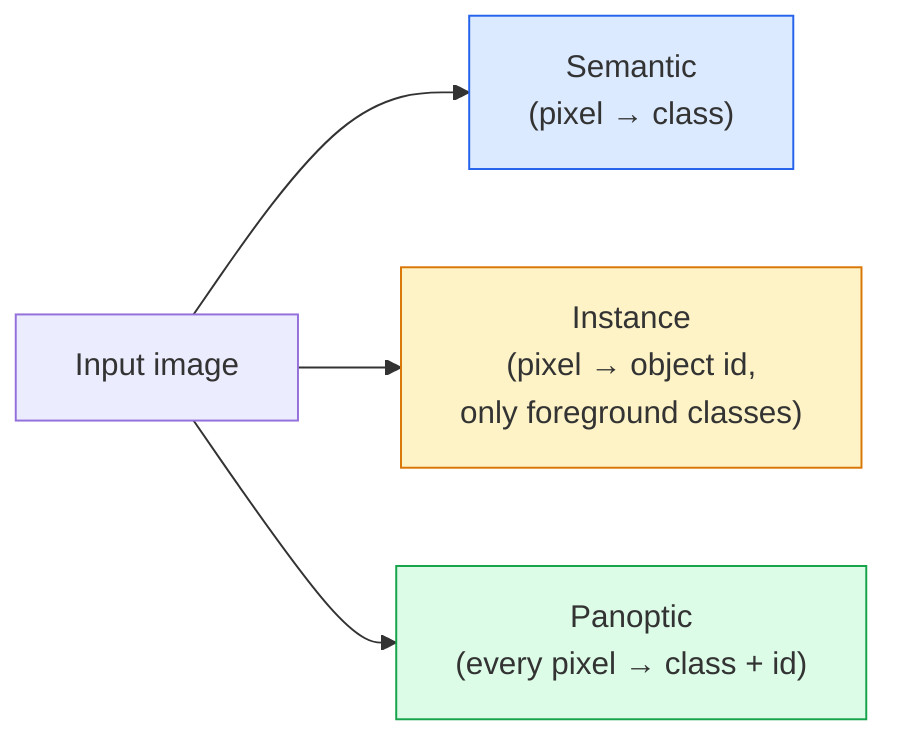
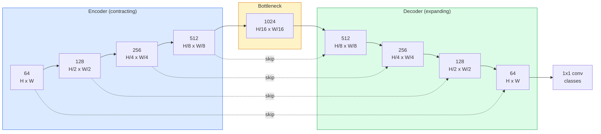

# Segmentacja semantyczna — U-Net

> Segmentacja to klasyfikacja w każdym pikselu. U-Net sprawia, że działa to przez połączenie enkodera próbkującego w dół z dekoderem próbkującym w górę i połączeniami pomijającymi między nimi.

**Type:** Build
**Languages:** Python
**Prerequisites:** Phase 4 Lesson 03 (CNNs), Phase 4 Lesson 04 (Image Classification)
**Time:** ~75 minutes

## Learning Objectives

- Odróżnić segmentację semantyczną, instancyjną i panoptyczną oraz wybrać odpowiednie zadanie dla danego problemu
- Zbudować U-Net od podstaw w PyTorch z blokami enkodera, wąskim gardłem, dekoderem z konwolucjami transponowanymi i połączeniami pomijającymi
- Zaimplementować pikselową entropię krzyżową, stratę Dice i połączoną stratę, która jest obecnie domyślną dla segmentacji medycznej i przemysłowej
- Czytać metryki IoU i Dice na klasę i diagnozować, czy niski wynik wynika z odzysku małych obiektów, dokładności granic czy braku równowagi klas

## The Problem

Klasyfikacja wyprowadza jedną etykietę na obraz. Detekcja wyprowadza garść prostokątów na obraz. Segmentacja wyprowadza jedną etykietę na piksel. Dla wejścia o rozmiarze `H x W` wyjście jest tensorem o kształcie `H x W` (semantyczna) lub `H x W x N_instancji` (instancyjna). To miliony predykcji na obraz, a nie jedna.

Struktura segmentacji jest powodem, dla którego napędza ona prawie każdy produkt widzenia oparty na gęstej predykcji: obrazowanie medyczne (maski guzów), jazda autonomiczna (droga, pas, przeszkoda), satelity (ślady budynków, granice upraw), parsowanie dokumentów (strefy układu), robotyka (obszary chwytne). Żadne z tych zadań nie może być rozwiązane przez umieszczenie prostokąta wokół obiektu; potrzebują dokładnego obrysu.

Problem architektoniczny jest prosty do sformułowania i niełatwy do rozwiązania: potrzebujesz, aby sieć widziała globalny kontekst obrazu (jaki to rodzaj sceny) i lokalny szczegół pikselowy (dokładnie który piksel to droga, a który chodnik) jednocześnie. Standardowa CNN kompresuje przestrzennie, aby uzyskać kontekst, co odrzuca szczegóły. U-Net był projektem, który uzyskał oba.

## The Concept

### Segmentacja semantyczna vs instancyjna vs panoptyczna



- **Semantyczna** mówi "ten piksel to droga, tamten piksel to samochód." Dwa samochody obok siebie łączą się w jeden obszar.
- **Instancyjna** mówi "ten piksel to samochód #3, tamten piksel to samochód #5." Ignoruje rzeczy tła ("stuff" = niebo, droga, trawa).
- **Panoptyczna** łączy oba: każdy piksel dostaje etykietę klasy, każda instancja dostaje unikalne id, zarówno rzeczy jak i tła są segmentowane.

Ta lekcja obejmuje segmentację semantyczną. Następna lekcja (Mask R-CNN) obejmuje instancyjną.

### Kształt U-Net



Enkoder czterokrotnie zmniejsza rozdzielczość przestrzenną i podwaja liczbę kanałów. Dekoder odwraca: czterokrotnie podwaja rozdzielczość przestrzenną i zmniejsza liczbę kanałów. Połączenia pomijające łączą pasujące cechy enkodera z cechami dekodera na każdej rozdzielczości. Końcowa konwolucja 1x1 mapuje `64 -> num_classes` w pełnej rozdzielczości.

Dlaczego połączenia pomijające są konieczne: dekoder widział tylko małe mapy cech, zanim próbuje wygenerować predykcje na poziomie pikseli. Bez pominięć nie może dokładnie zlokalizować krawędzi, ponieważ ta informacja została skompresowana w enkoderze. Połączenia pomijające dostarczają mu mapy cech o wysokiej rozdzielczości, które enkoder obliczył w drodze w dół.

### Transposed vs bilinear upsample

Dekoder musi rozszerzać wymiary przestrzenne. Dwie opcje:

- **Transposed convolution** (`nn.ConvTranspose2d`) — uczone próbkowanie w górę. Historyczna domyślna wartość U-Net. Może produkować artefakty szachownicy, jeśli krok i rozmiar jądra nie dzielą się równomiernie.
- **Bilinear upsample + 3x3 conv** — gładkie próbkowanie w górę, po którym następuje konwolucja. Mniej artefaktów, mniej parametrów, obecnie nowoczesna domyślna wartość.

Oba pojawiają się w praktyce. Dla pierwszego U-Net bilinearna jest bezpieczniejsza.

### Entropia krzyżowa na siatce pikseli

Dla segmentacji semantycznej z C klasami, wyjście modelu to `(N, C, H, W)`. Cel to `(N, H, W)` z całkowitymi identyfikatorami klas. Entropia krzyżowa jest identyczna jak w przypadku klasyfikacji, tylko zastosowana w każdej pozycji przestrzennej:

```
Loss = mean over (n, h, w) of -log( softmax(logits[n, :, h, w])[target[n, h, w]] )
```

`F.cross_entropy` w PyTorch obsługuje ten kształt natywnie. Nie potrzeba przekształcania.

### Strata Dice i dlaczego jej potrzebujesz

Entropia krzyżowa traktuje każdy piksel jednakowo. To jest złe, gdy jedna klasa dominuje w kadrze (obrazowanie medyczne: 99% tło, 1% guz). Sieć może osiągnąć 99% dokładności, przewidując wszędzie tło, i nadal być bezużyteczna.

Strata Dice rozwiązuje to przez bezpośrednią optymalizację nakładania się między przewidzianą a prawdziwą maską:

```
Dice(p, y) = 2 * sum(p * y) / (sum(p) + sum(y) + epsilon)
Dice_loss = 1 - Dice
```

gdzie `p` to sigmoidalna/softmax mapa prawdopodobieństwa dla klasy, a `y` to binarna maska prawdy naziemnej. Strata jest zerowa tylko wtedy, gdy nakładanie jest idealne. Ponieważ jest oparta na proporcjach, brak równowagi klas nie ma znaczenia.

W praktyce używaj **połączonej straty**:

```
L = L_cross_entropy + lambda * L_dice       (lambda ~ 1)
```

Entropia krzyżowa daje stabilne gradienty na początku treningu; Dice skupia się na końcowej fazie treningu na faktycznym dopasowaniu kształtu maski. Ta kombinacja jest domyślną wartością w obrazowaniu medycznym i trudno ją pobić na dowolnym zbiorze danych z brakiem równowagi klas.

### Metryki ewaluacji

- **Pixel accuracy** — procent pikseli przewidzianych poprawnie. Tania. Zepsuta na niezbalansowanych danych z tego samego powodu co dokładność w klasyfikacji.
- **IoU per class** — przecięcie nad sumą dla maski każdej klasy; średnia po klasach = mIoU.
- **Dice (F1 na pikselach)** — podobne do IoU; `Dice = 2 * IoU / (1 + IoU)`. Obrazowanie medyczne preferuje Dice, społeczność jeżdżąca preferuje IoU; są monotonicznie powiązane.
- **Boundary F1** — mierzy, jak blisko przewidywane granice są do granic prawdy naziemnej, karząc nawet małe przesunięcia. Ważne dla zadań o wysokiej precyzji, takich jak inspekcja półprzewodników.

Raportuj IoU na klasę, nie tylko mIoU. Średnie IoU ukrywa klasę na poziomie 15%, gdy dziewięć innych jest na 85%.

### Kompromis rozdzielczości wejścia

Enkoder U-Net czterokrotnie zmniejsza rozdzielczość, więc wejście musi być podzielne przez 16. Obrazy medyczne są często 512x512 lub 1024x1024. Kadry z jazdy autonomicznej to 2048x1024. Koszt pamięci U-Net skaluje się z `H * W * C_max`, a przy 1024x1024 z 1024 kanałami wąskiego gardła, forward pass już używa gigabajtów VRAM.

Dwa standardowe obejścia:
1. Podziel wejście na kafelki — przetwarzaj kafelki 256x256 z nakładaniem i łącz.
2. Zastąp wąskie gardło konwolucjami dylatacyjnymi, które utrzymują wyższą rozdzielczość przestrzenną, ale poszerzają pole receptywne (rodzina DeepLab).

Dla pierwszego modelu, wejście 256x256 z U-Net o bazie 64 kanałów trenuje wygodnie na 8 GB VRAM.

## Build It

### Step 1: Encoder block

Dwie konwolucje 3x3 z normalizacją batchową i ReLU. Pierwsza konwolucja zmienia liczbę kanałów; druga utrzymuje ją.

```python
import torch
import torch.nn as nn
import torch.nn.functional as F

class DoubleConv(nn.Module):
    def __init__(self, in_c, out_c):
        super().__init__()
        self.net = nn.Sequential(
            nn.Conv2d(in_c, out_c, kernel_size=3, padding=1, bias=False),
            nn.BatchNorm2d(out_c),
            nn.ReLU(inplace=True),
            nn.Conv2d(out_c, out_c, kernel_size=3, padding=1, bias=False),
            nn.BatchNorm2d(out_c),
            nn.ReLU(inplace=True),
        )

    def forward(self, x):
        return self.net(x)
```

Ten blok jest wielokrotnie używany. `bias=False` ponieważ beta BN obsługuje bias.

### Step 2: Down and up blocks

```python
class Down(nn.Module):
    def __init__(self, in_c, out_c):
        super().__init__()
        self.net = nn.Sequential(
            nn.MaxPool2d(2),
            DoubleConv(in_c, out_c),
        )

    def forward(self, x):
        return self.net(x)


class Up(nn.Module):
    def __init__(self, in_c, out_c):
        super().__init__()
        self.up = nn.Upsample(scale_factor=2, mode="bilinear", align_corners=False)
        self.conv = DoubleConv(in_c, out_c)

    def forward(self, x, skip):
        x = self.up(x)
        if x.shape[-2:] != skip.shape[-2:]:
            x = F.interpolate(x, size=skip.shape[-2:], mode="bilinear", align_corners=False)
        x = torch.cat([skip, x], dim=1)
        return self.conv(x)
```

Sprawdzenie tylko kształtu przestrzennego (`shape[-2:]`) obsługuje wejścia, których wymiary nie są podzielne przez 16; bezpieczne `F.interpolate` wyrównuje tensor przed konkatenacją. Porównanie pełnego kształtu wywołałoby się również przy różnicach liczby kanałów, co powinno być głośnym błędem, a nie cichą interpolacją.

### Step 3: The U-Net

```python
class UNet(nn.Module):
    def __init__(self, in_channels=3, num_classes=2, base=64):
        super().__init__()
        self.inc = DoubleConv(in_channels, base)
        self.d1 = Down(base, base * 2)
        self.d2 = Down(base * 2, base * 4)
        self.d3 = Down(base * 4, base * 8)
        self.d4 = Down(base * 8, base * 16)
        self.u1 = Up(base * 16 + base * 8, base * 8)
        self.u2 = Up(base * 8 + base * 4, base * 4)
        self.u3 = Up(base * 4 + base * 2, base * 2)
        self.u4 = Up(base * 2 + base, base)
        self.outc = nn.Conv2d(base, num_classes, kernel_size=1)

    def forward(self, x):
        x1 = self.inc(x)
        x2 = self.d1(x1)
        x3 = self.d2(x2)
        x4 = self.d3(x3)
        x5 = self.d4(x4)
        x = self.u1(x5, x4)
        x = self.u2(x, x3)
        x = self.u3(x, x2)
        x = self.u4(x, x1)
        return self.outc(x)

net = UNet(in_channels=3, num_classes=2, base=32)
x = torch.randn(1, 3, 256, 256)
print(f"output: {net(x).shape}")
print(f"params: {sum(p.numel() for p in net.parameters()):,}")
```

Kształt wyjścia `(1, 2, 256, 256)` — ten sam rozmiar przestrzenny co wejście, `num_classes` kanałów. Około 7,7M parametrów przy `base=32`.

### Step 4: Losses

```python
def dice_loss(logits, targets, num_classes, eps=1e-6):
    probs = F.softmax(logits, dim=1)
    targets_one_hot = F.one_hot(targets, num_classes).permute(0, 3, 1, 2).float()
    dims = (0, 2, 3)
    intersection = (probs * targets_one_hot).sum(dim=dims)
    denom = probs.sum(dim=dims) + targets_one_hot.sum(dim=dims)
    dice = (2 * intersection + eps) / (denom + eps)
    return 1 - dice.mean()


def combined_loss(logits, targets, num_classes, lam=1.0):
    ce = F.cross_entropy(logits, targets)
    dc = dice_loss(logits, targets, num_classes)
    return ce + lam * dc, {"ce": ce.item(), "dice": dc.item()}
```

Dice jest obliczane na klasę, a następnie uśrednione (macro Dice). `eps` zapobiega dzieleniu przez zero dla klas nieobecnych w batchu.

### Step 5: IoU metric

```python
@torch.no_grad()
def iou_per_class(logits, targets, num_classes):
    preds = logits.argmax(dim=1)
    ious = torch.zeros(num_classes)
    for c in range(num_classes):
        pred_c = (preds == c)
        true_c = (targets == c)
        inter = (pred_c & true_c).sum().float()
        union = (pred_c | true_c).sum().float()
        ious[c] = (inter / union) if union > 0 else torch.tensor(float("nan"))
    return ious
```

Zwraca wektor długości C. `nan` oznacza klasy nieobecne w batchu — nie uśredniaj ich przy obliczaniu mIoU.

### Step 6: Synthetic dataset for end-to-end verification

Generuj kształty na kolorowych tłach, aby sieć musiała nauczyć się kształtu, a nie koloru piksela.

```python
import numpy as np
from torch.utils.data import Dataset, DataLoader

def synthetic_segmentation(num_samples=200, size=64, seed=0):
    rng = np.random.default_rng(seed)
    images = np.zeros((num_samples, size, size, 3), dtype=np.float32)
    masks = np.zeros((num_samples, size, size), dtype=np.int64)
    for i in range(num_samples):
        bg = rng.uniform(0, 1, (3,))
        images[i] = bg
        masks[i] = 0
        num_shapes = rng.integers(1, 4)
        for _ in range(num_shapes):
            cls = int(rng.integers(1, 3))
            color = rng.uniform(0, 1, (3,))
            cx, cy = rng.integers(10, size - 10, size=2)
            r = int(rng.integers(4, 12))
            yy, xx = np.meshgrid(np.arange(size), np.arange(size), indexing="ij")
            if cls == 1:
                mask = (xx - cx) ** 2 + (yy - cy) ** 2 < r ** 2
            else:
                mask = (np.abs(xx - cx) < r) & (np.abs(yy - cy) < r)
            images[i][mask] = color
            masks[i][mask] = cls
        images[i] += rng.normal(0, 0.02, images[i].shape)
        images[i] = np.clip(images[i], 0, 1)
    return images, masks


class SegDataset(Dataset):
    def __init__(self, images, masks):
        self.images = images
        self.masks = masks

    def __len__(self):
        return len(self.images)

    def __getitem__(self, i):
        img = torch.from_numpy(self.images[i]).permute(2, 0, 1).float()
        mask = torch.from_numpy(self.masks[i]).long()
        return img, mask
```

Trzy klasy: tło (0), koła (1), kwadraty (2). Sieć musi nauczyć się odróżniać kształt.

### Step 7: Training loop

```python
def train_one_epoch(model, loader, optimizer, device, num_classes):
    model.train()
    loss_sum, total = 0.0, 0
    iou_sum = torch.zeros(num_classes)
    for x, y in loader:
        x, y = x.to(device), y.to(device)
        logits = model(x)
        loss, _ = combined_loss(logits, y, num_classes)
        optimizer.zero_grad()
        loss.backward()
        optimizer.step()
        loss_sum += loss.item() * x.size(0)
        total += x.size(0)
        iou_sum += iou_per_class(logits, y, num_classes).nan_to_num(0)
    return loss_sum / total, iou_sum / len(loader)
```

Uruchom to przez 10-30 epok na syntetycznym zbiorze danych i obserwuj, jak mIoU rośnie powyżej 0.9 dla klas kształtów. Zwróć uwagę, że `nan_to_num(0)` traktuje klasy nieobecne w batchu jako zero; dla dokładnego IoU na klasę, maskuj według obecności i używaj `torch.nanmean` przez batche w czasie ewaluacji, zamiast uśredniać tutaj.

## Use It

Do produkcji `segmentation_models_pytorch` ("smp") opakowuje każdą standardową architekturę segmentacji z dowolnym backbone'm torchvision lub timm. Trzy linie:

```python
import segmentation_models_pytorch as smp

model = smp.Unet(
    encoder_name="resnet34",
    encoder_weights="imagenet",
    in_channels=3,
    classes=3,
)
```

Warto również wiedzieć o rzeczywistej pracy:
- **DeepLabV3+** zastępuje próbkowanie w dół oparte na max-pool konwolucjami dylatacyjnymi, aby wąskie gardło zachowało rozdzielczość; szybsze granice na danych satelitarnych i jeżdżących.
- **SegFormer** zastępuje enkoder splotowy hierarchicznym transformerem; obecny SOTA na wielu benchmarkach.
- **Mask2Former** / **OneFormer** łączą segmentację semantyczną, instancyjną i panoptyczną w jednej architekturze.

Wszystkie trzy są zamiennikami typu drop-in w `smp` lub `transformers` z tym samym loaderem danych.

## Ship It

Ta lekcja produkuje:

- `outputs/prompt-segmentation-task-picker.md` — prompt, który wybiera między segmentacją semantyczną, instancyjną i panoptyczną oraz podaje architekturę dla danego zadania.
- `outputs/skill-segmentation-mask-inspector.md` — umiejętność, która raportuje rozkład klas, statystyki przewidywanej maski oraz klasy, które są niedostatecznie przewidywane lub mają rozmyte granice.

## Exercises

1. **(Easy)** Zaimplementuj `bce_dice_loss` dla zadania segmentacji binarnej (pierwszy plan vs tło). Zweryfikuj na syntetycznym dwuklasowym zbiorze danych, że połączona strata zbiega szybciej niż sama BCE, gdy pierwszy plan stanowi 5% pikseli.
2. **(Medium)** Zastąp blok `nn.Upsample + conv` blokiem `nn.ConvTranspose2d`. Wytrenuj oba na syntetycznym zbiorze danych i porównaj mIoU. Zaobserwuj, gdzie pojawiają się artefakty szachownicy w wersji z konwolucją transponowaną.
3. **(Hard)** Weź rzeczywisty zbiór danych segmentacji (Oxford-IIIT Pets, Cityscapes mini split lub podzbiór medyczny) i wytrenuj U-Net w granicach 2 punktów IoU względem referencji `smp.Unet`. Raportuj IoU na klasę i zidentyfikuj, które klasy najwięcej zyskują na dodaniu Dice do straty.

## Key Terms

| Term | What people say | What it actually means |
|------|----------------|----------------------|
| Semantic segmentation | "Label every pixel" | Per-pixel classification into C classes; instances of the same class merge |
| Instance segmentation | "Label every object" | Separates distinct instances of the same class; foreground-only |
| Panoptic segmentation | "Semantic + instance" | Every pixel gets a class; every thing instance also gets a unique id |
| Skip connection | "U-Net bridge" | Concatenation of encoder features into matching-resolution decoder features; preserves high-frequency detail |
| Transposed conv | "Deconvolution" | Learnable upsampling; can produce checkerboard artifacts |
| Dice loss | "Overlap loss" | 1 - 2|A ∩ B| / (|A| + |B|); optimises mask overlap directly and is robust to class imbalance |
| mIoU | "Mean intersection over union" | Average IoU across classes; the community-standard metric for segmentation |
| Boundary F1 | "Boundary accuracy" | F1 score computed on boundary pixels only; matters for precision-critical tasks |

## Further Reading

- [U-Net: Convolutional Networks for Biomedical Image Segmentation (Ronneberger et al., 2015)](https://arxiv.org/abs/1505.04597) — oryginalna publikacja; rysunek, który wszyscy kopiują, jest na stronie 2
- [Fully Convolutional Networks (Long et al., 2015)](https://arxiv.org/abs/1411.4038) — publikacja, która po raz pierwszy uczyniła segmentację problemem splotowym end-to-end
- [segmentation_models_pytorch](https://github.com/qubvel/segmentation_models.pytorch) — źródło dla produkcyjnej segmentacji; każda standardowa architektura plus każda standardowa strata
- [Lessons learned from training SOTA segmentation (kaggle.com competitions)](https://www.kaggle.com/code/iafoss/carvana-unet-pytorch) — opis, dlaczego TTA, pseudo-etykietowanie i wagi klas mają znaczenie na rzeczywistych danych