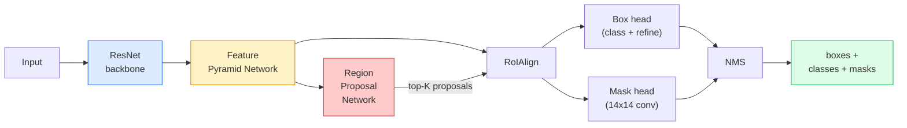

# Segmentacja instancyjna — Mask R-CNN

> Dodaj małą gałąź maski do detektora Faster R-CNN, a otrzymasz segmentację instancyjną. Trudną częścią jest RoIAlign i jest trudniejszy niż się wydaje.

**Type:** Build + Learn
**Languages:** Python
**Prerequisites:** Phase 4 Lesson 06 (YOLO), Phase 4 Lesson 07 (U-Net)
**Time:** ~75 minutes

## Learning Objectives

- Prześledzić architekturę Mask R-CNN end-to-end: backbone, FPN, RPN, RoIAlign, głowa prostokątów, głowa maski
- Zaimplementować RoIAlign od podstaw i wyjaśnić, dlaczego RoIPool nie jest już używany
- Użyć wstępnie wytrenowanego modelu `maskrcnn_resnet50_fpn_v2` z torchvision do produkcyjnych masek instancyjnych i poprawnie odczytać jego format wyjściowy
- Dostroić Mask R-CNN na małym niestandardowym zbiorze danych przez zastąpienie głów prostokątów i maski oraz utrzymanie zamrożonego backbone'u

## The Problem

Segmentacja semantyczna daje jedną maskę na klasę. Segmentacja instancyjna daje jedną maskę na obiekt, nawet gdy dwa obiekty dzielą klasę. Liczenie osobników, śledzenie między klatkami i mierzenie rzeczy (prostokąt graniczny każdej cegły w ścianie, każdej komórki w obrazie mikroskopowym) wymagają segmentacji instancyjnej.

Mask R-CNN (He i in., 2017) rozwiązał to przez przeformułowanie segmentacji instancyjnej jako detekcji-plus-maski. Projekt był tak czysty, że przez następne pięć lat prawie każda publikacja o segmentacji instancyjnej była wariantem Mask R-CNN, a implementacja torchvision wciąż jest domyślną produkcyjną dla małych i średnich zbiorów danych.

Twardym problemem inżynieryjnym jest próbkowanie: jak wyciąć region cech o stałym rozmiarze z prostokąta propozycji, którego rogi nie pokrywają się z granicami pikseli? Popełnienie tego błędu kosztuje dziesiąte części punktu mAP wszędzie. RoIAlign jest odpowiedzią.

## The Concept

### Architektura



Pięć elementów do zrozumienia:

1. **Backbone** — ResNet-50 lub ResNet-101 trenowane na ImageNet. Produkuje hierarchię map cech przy krokach 4, 8, 16, 32.
2. **FPN (Feature Pyramid Network)** — połączenia top-down + lateralne, które dają każdemu poziomowi C kanałów bogatych semantycznie cech. Detekcja odpytuje poziom FPN odpowiadający rozmiarowi obiektu.
3. **RPN (Region Proposal Network)** — mała głowa splotowa, która w każdej pozycji kotwicy przewiduje "czy jest tu obiekt?" i "jak poprawić prostokąt?". Produkuje ~1000 propozycji na obraz.
4. **RoIAlign** — próbkuje łatkę cech o stałym rozmiarze (np. 7x7) z dowolnego prostokąta na dowolnym poziomie FPN. Próbkowanie bilinearne, bez kwantyzacji.
5. **Heads** — dwuwarstwowa głowa prostokątów, która poprawia prostokąt i wybiera klasę, plus mała głowa splotowa, która wyprowadza binarną maskę `28x28` dla każdej propozycji.

### Dlaczego RoIAlign, a nie RoIPool

Oryginalny Fast R-CNN używał RoIPool, który dzieli prostokąt propozycji na siatkę, bierze maksymalną cechę w każdej komórce i zaokrągla wszystkie współrzędne do liczb całkowitych. To zaokrąglanie rozstraja mapę cech od współrzędnych pikseli wejściowych o nawet cały piksel mapy cech — mało na obrazie 224x224, katastrofalne, gdy mapa cech ma krok 32.

```
RoIPool:
  box (34.7, 51.3, 98.2, 142.9)
  round -> (34, 51, 98, 142)
  split grid -> round each cell boundary
  misalignment accumulates at every step

RoIAlign:
  box (34.7, 51.3, 98.2, 142.9)
  sample at exact float coordinates using bilinear interpolation
  no rounding anywhere
```

RoIAlign podnosi AP maski o 3-4 punkty na COCO za darmo. Każdy detektor dbający o lokalizację teraz go używa — YOLOv7 seg, RT-DETR, Mask2Former podobnie.

### RPN w jednym akapicie

W każdej pozycji mapy cech umieść K prostokątów kotwiczących o różnych rozmiarach i kształtach. Przewidź wynik obiektowości dla każdej kotwicy i przesunięcie regresji, aby zamienić kotwicę w lepiej dopasowany prostokąt. Zachowaj najlepsze ~1000 prostokątów według wyniku, zastosuj NMS przy IoU 0.7 i przekaż ocalałych do głów. RPN jest trenowany z własną mini-funkcją straty — tą samą strukturą co strata YOLO z Lekcji 6, tylko z dwiema klasami (obiekt / brak obiektu).

### Głowa maski

Dla każdej propozycji (po RoIAlign) głowa maski to mały FCN: cztery konwolucje 3x3, dekonwolucja 2x, końcowa konwolucja 1x1 produkująca `num_classes` kanałów wyjściowych w rozdzielczości `28x28`. Tylko kanał odpowiadający przewidywanej klasie jest zachowywany; pozostałe są ignorowane. To oddziela predykcję maski od klasyfikacji.

Próbkuj maskę 28x28 w górę do oryginalnego rozmiaru pikselowego propozycji, aby uzyskać końcową maskę binarną.

### Funkcje straty

Mask R-CNN ma cztery straty dodane razem:

```
L = L_rpn_cls + L_rpn_box + L_box_cls + L_box_reg + L_mask
```

- `L_rpn_cls`, `L_rpn_box` — obiektowość + regresja prostokąta dla propozycji RPN.
- `L_box_cls` — entropia krzyżowa nad (C+1) klasami (w tym tło) na klasyfikatorze głowy.
- `L_box_reg` — gładka L1 na poprawie prostokąta głowy.
- `L_mask` — binarna entropia krzyżowa na piksel wyjścia maski 28x28.

Każda strata ma swoją domyślną wagę; implementacja torchvision udostępnia je jako argumenty konstruktora.

### Format wyjściowy

`torchvision.models.detection.maskrcnn_resnet50_fpn_v2` zwraca listę słowników, jeden na obraz:

```
{
    "boxes":  (N, 4) in (x1, y1, x2, y2) pixel coordinates,
    "labels": (N,) class IDs, 0 = background so indices are 1-based,
    "scores": (N,) confidence scores,
    "masks":  (N, 1, H, W) float masks in [0, 1] — threshold at 0.5 for binary,
}
```

Maska jest już w pełnej rozdzielczości obrazu. Wyjście głowy 28x28 zostało wewnętrznie próbkowane w górę.

## Build It

### Step 1: RoIAlign from scratch

To jest jeden komponent Mask R-CNN, który łatwiej zrozumieć jako kod niż jako prozę.

```python
import torch
import torch.nn.functional as F

def roi_align_single(feature, box, output_size=7, spatial_scale=1 / 16.0):
    """
    feature: (C, H, W) single-image feature map
    box: (x1, y1, x2, y2) in original image pixel coordinates
    output_size: side of the output grid (7 for box head, 14 for mask head)
    spatial_scale: reciprocal of the feature map stride
    """
    C, H, W = feature.shape
    x1, y1, x2, y2 = [c * spatial_scale - 0.5 for c in box]
    bin_w = (x2 - x1) / output_size
    bin_h = (y2 - y1) / output_size

    grid_y = torch.linspace(y1 + bin_h / 2, y2 - bin_h / 2, output_size)
    grid_x = torch.linspace(x1 + bin_w / 2, x2 - bin_w / 2, output_size)
    yy, xx = torch.meshgrid(grid_y, grid_x, indexing="ij")

    gx = 2 * (xx + 0.5) / W - 1
    gy = 2 * (yy + 0.5) / H - 1
    grid = torch.stack([gx, gy], dim=-1).unsqueeze(0)
    sampled = F.grid_sample(feature.unsqueeze(0), grid, mode="bilinear",
                            align_corners=False)
    return sampled.squeeze(0)
```

Każda liczba jest w pozycji próbkowanej bilinearnie. Bez zaokrąglania, bez kwantyzacji, bez upuszczonych gradientów.

### Step 2: Compare to torchvision's RoIAlign

```python
from torchvision.ops import roi_align

feature = torch.randn(1, 16, 50, 50)
boxes = torch.tensor([[0, 10, 20, 100, 90]], dtype=torch.float32)  # (batch_idx, x1, y1, x2, y2)

ours = roi_align_single(feature[0], boxes[0, 1:].tolist(), output_size=7, spatial_scale=1/4)
theirs = roi_align(feature, boxes, output_size=(7, 7), spatial_scale=1/4, sampling_ratio=1, aligned=True)[0]

print(f"shape ours:   {tuple(ours.shape)}")
print(f"shape theirs: {tuple(theirs.shape)}")
print(f"max|diff|:    {(ours - theirs).abs().max().item():.3e}")
```

Z `sampling_ratio=1` i `aligned=True`, oba są zgodne w granicach `1e-5`.

### Step 3: Load a pretrained Mask R-CNN

```python
import torch
from torchvision.models.detection import maskrcnn_resnet50_fpn_v2, MaskRCNN_ResNet50_FPN_V2_Weights

model = maskrcnn_resnet50_fpn_v2(weights=MaskRCNN_ResNet50_FPN_V2_Weights.DEFAULT)
model.eval()
print(f"params: {sum(p.numel() for p in model.parameters()):,}")
print(f"classes (including background): {len(model.roi_heads.box_predictor.cls_score.out_features * [0])}")
```

46M parametrów, 91 klas (COCO). Pierwsza klasa (id 0) to tło; wszystko, co model faktycznie wykrywa, zaczyna się od id 1.

### Step 4: Run inference

```python
with torch.no_grad():
    x = torch.randn(3, 400, 600)
    predictions = model([x])
p = predictions[0]
print(f"boxes:  {tuple(p['boxes'].shape)}")
print(f"labels: {tuple(p['labels'].shape)}")
print(f"scores: {tuple(p['scores'].shape)}")
print(f"masks:  {tuple(p['masks'].shape)}")
```

Tensor maski ma kształt `(N, 1, H, W)`. Proguj przy 0.5, aby uzyskać binarną maskę na obiekt:

```python
binary_masks = (p['masks'] > 0.5).squeeze(1)  # (N, H, W) boolean
```

### Step 5: Swap the heads for a custom class count

Typowy przepis na dostrajanie: użyj ponownie backbone'u, FPN i RPN; zastąp dwie głowy klasyfikatora.

```python
from torchvision.models.detection.faster_rcnn import FastRCNNPredictor
from torchvision.models.detection.mask_rcnn import MaskRCNNPredictor

def build_custom_maskrcnn(num_classes):
    model = maskrcnn_resnet50_fpn_v2(weights=MaskRCNN_ResNet50_FPN_V2_Weights.DEFAULT)
    in_features = model.roi_heads.box_predictor.cls_score.in_features
    model.roi_heads.box_predictor = FastRCNNPredictor(in_features, num_classes)
    in_features_mask = model.roi_heads.mask_predictor.conv5_mask.in_channels
    hidden_layer = 256
    model.roi_heads.mask_predictor = MaskRCNNPredictor(in_features_mask, hidden_layer, num_classes)
    return model

custom = build_custom_maskrcnn(num_classes=5)
print(f"custom cls_score.out_features: {custom.roi_heads.box_predictor.cls_score.out_features}")
```

`num_classes` musi zawierać klasę tła, więc zbiór danych z 4 klasami obiektów używa `num_classes=5`.

### Step 6: Freeze what does not need training

Na małych zbiorach danych zamroź backbone i FPN. Tylko obiektowość RPN + regresja i dwie głowy się uczą.

```python
def freeze_backbone_and_fpn(model):
    # torchvision Mask R-CNN packs the FPN inside `model.backbone` (as
    # `model.backbone.fpn`), so iterating `model.backbone.parameters()` covers
    # both the ResNet feature layers and the FPN lateral/output convs.
    for p in model.backbone.parameters():
        p.requires_grad = False
    return model

custom = freeze_backbone_and_fpn(custom)
trainable = sum(p.numel() for p in custom.parameters() if p.requires_grad)
print(f"trainable after freeze: {trainable:,}")
```

Na zbiorach danych z 500 obrazami to różnica między zbieżnością a przeuczeniem.

## Use It

Pełna pętla treningowa dla Mask R-CNN w torchvision to 40 linii i nie zmienia się znacząco między zadaniami — zamień zbiory danych i działaj.

```python
def train_step(model, images, targets, optimizer):
    model.train()
    loss_dict = model(images, targets)
    losses = sum(loss for loss in loss_dict.values())
    optimizer.zero_grad()
    losses.backward()
    optimizer.step()
    return {k: v.item() for k, v in loss_dict.items()}
```

Lista `targets` musi zawierać słowniki na obraz z `boxes`, `labels` i `masks` (jako binarne tensory `(num_instances, H, W)`). Model zwraca słownik czterech strat podczas treningu i listę predykcji podczas ewaluacji, w zależności od `model.training`.

Ewaluator `pycocotools` produkuje mAP@IoU=0.5:0.95 zarówno dla prostokątów, jak i masek; potrzebujesz obu liczb, aby wiedzieć, czy głowa prostokątów czy głowa maski jest wąskim gardłem.

## Ship It

Ta lekcja produkuje:

- `outputs/prompt-instance-vs-semantic-router.md` — prompt, który zadaje trzy pytania i wybiera instancyjną vs semantyczną vs panoptyczną plus dokładny model do rozpoczęcia.
- `outputs/skill-mask-rcnn-head-swapper.md` — umiejętność, która generuje 10 linii kodu do wymiany głów na dowolnym modelu detekcji torchvision, biorąc nowe `num_classes`.

## Exercises

1. **(Easy)** Zweryfikuj swój RoIAlign względem `torchvision.ops.roi_align` na 100 losowych prostokątach. Raportuj maksymalną różnicę bezwzględną. Uruchom również RoIPool (zachowanie sprzed 2017) i pokaż, że rozbiega się o ~1-2 piksele mapy cech na prostokątach blisko krawędzi.
2. **(Medium)** Dostrój `maskrcnn_resnet50_fpn_v2` na niestandardowym zbiorze danych z 50 obrazami (dwie dowolne klasy: balony, ryby, dziury, logo). Zamroź backbone, trenuj przez 20 epok, raportuj mask AP@0.5.
3. **(Hard)** Zastąp głowę maski Mask R-CNN taką, która przewiduje w 56x56 zamiast 28x28. Zmierz mAP@IoU=0.75 przed i po. Wyjaśnij, dlaczego zysk (lub jego brak) odpowiada oczekiwanemu kompromisowi między precyzją granicy a pamięcią.

## Key Terms

| Term | What people say | What it actually means |
|------|----------------|----------------------|
| Mask R-CNN | "Detection plus masks" | Faster R-CNN + a small FCN head that predicts a 28x28 mask per proposal per class |
| FPN | "Feature pyramid" | Top-down + lateral connections that give every stride level C channels of semantic-rich features |
| RPN | "Region proposer" | A small conv head that produces ~1000 object/no-object proposals per image |
| RoIAlign | "No-rounding crop" | Bilinearly samples a fixed-size feature grid from any float-coordinate box |
| RoIPool | "Pre-2017 crop" | Same purpose as RoIAlign but rounds box coordinates; obsolete |
| Mask AP | "Instance mAP" | Average precision computed with mask IoU instead of box IoU; the COCO instance segmentation metric |
| Binary mask head | "Per-class mask" | Predicts one binary mask per class for each proposal; only the predicted class's channel is kept |
| Background class | "Class 0" | The catch-all "no object" class; indices for real classes start at 1 |

## Further Reading

- [Mask R-CNN (He et al., 2017)](https://arxiv.org/abs/1703.06870) — publikacja; sekcja 3 o RoIAlign jest krytyczną lekturą
- [FPN: Feature Pyramid Networks (Lin et al., 2017)](https://arxiv.org/abs/1612.03144) — publikacja FPN; każdy nowoczesny detektor jej używa
- [torchvision Mask R-CNN tutorial](https://pytorch.org/tutorials/intermediate/torchvision_tutorial.html) — źródło dla pętli dostrajania
- [Detectron2 model zoo](https://github.com/facebookresearch/detectron2/blob/main/MODEL_ZOO.md) — implementacje produkcyjne z wytrenowanymi wagami dla prawie każdego wariantu detekcji i segmentacji