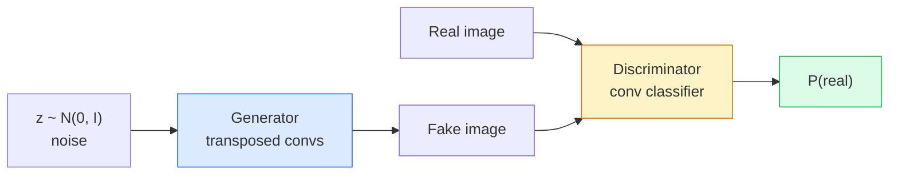
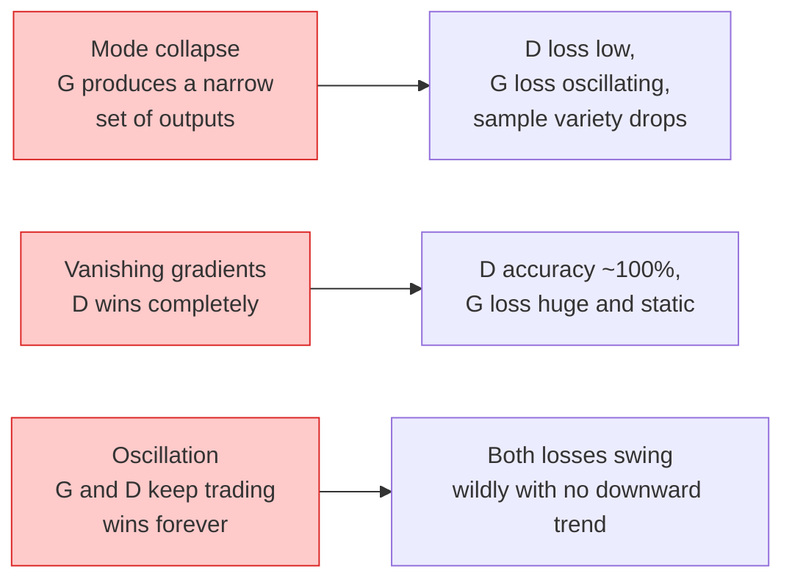

# Generowanie obrazów — GAN

> GAN to dwie sieci neuronowe w ustalonej grze. Jedna rysuje, jedna krytykuje. Stają się lepsze razem, aż rysunki oszukają krytyka.

**Type:** Build
**Languages:** Python
**Prerequisites:** Phase 4 Lesson 03 (CNNs), Phase 3 Lesson 06 (Optimizers), Phase 3 Lesson 07 (Regularization)
**Time:** ~75 minutes

## Learning Objectives

- Wyjaśnić grę minimax między generatorem a dyskryminatorem i dlaczego równowaga odpowiada p_model = p_data
- Zaimplementować DCGAN w PyTorch i sprawić, by generował spójne syntetyczne obrazy 32x32 w mniej niż 60 liniach
- Ustabilizować trening GAN trzema standardowymi sztuczkami: strata nienasycająca, norma spektralna, TTUR (zasada aktualizacji dwóch skal czasowych)
- Czytać krzywe treningowe odróżniające zdrową zbieżność od załamania trybu, oscylacji i całkowitego zwycięstwa dyskryminatora

## The Problem

Klasyfikacja uczy sieć mapowania obrazów na etykiety. Generowanie odwraca problem: próbkuj nowe obrazy, które wyglądają, jakby pochodziły z tego samego rozkładu. Nie ma "poprawnego" wyjścia, z którym możesz porównać; jest tylko rozkład, który chcesz naśladować.

Standardowe funkcje straty (MSE, entropia krzyżowa) nie mogą zmierzyć "czy ta próbka pochodzi z prawdziwego rozkładu." Minimalizacja błędu na piksel produkuje rozmyte średnie, a nie realistyczne próbki. Przełomem było nauczenie się straty: wytrenuj drugą sieć, której zadaniem jest odróżniać prawdziwe od fałszywych, i użyj jej osądu, aby popchnąć generator.

GAN (Goodfellow i in., 2014) zdefiniował ten framework. Do 2018 roku StyleGAN produkował twarze 1024x1024 nie do odróżnienia od fotografii. Modele dyfuzyjne przejęły od tego czasu tron pod względem jakości i sterowalności, ale każda sztuczka, która czyni dyfuzję praktyczną — wybory normalizacji, przestrzenie ukryte, straty cech — została najpierw zrozumiana na GAN-ach.

## The Concept

### Dwie sieci



**Generator** G bierze wektor szumu `z` i wyprowadza obraz. **Dyskryminator** D bierze obraz i wyprowadza pojedynczy skalar: prawdopodobieństwo, że obraz jest prawdziwy.

### Gra

G chce, aby D był w błędzie. D chce mieć rację. Formalnie:

```
min_G max_D  E_x[log D(x)] + E_z[log(1 - D(G(z)))]
```

Czytaj od prawej do lewej: D maksymalizuje dokładność na prawdziwych (`log D(real)`) i fałszywych (`log (1 - D(fake))`) obrazach. G minimalizuje dokładność D na fałszywkach — chce, aby `D(G(z))` było wysokie.

Goodfellow udowodnił, że to minimax ma globalną równowagę, gdzie `p_G = p_data`, D wyprowadza 0.5 wszędzie, a dywergencja Jensena-Shannona między wygenerowanymi a prawdziwymi rozkładami wynosi zero. Trudną częścią jest dotarcie tam.

### Strata nienasycająca (Non-saturating loss)

Powyższa forma jest numerycznie niestabilna. Wczesnym etapem treningu `D(G(z))` jest bliskie zera dla każdej fałszywki, więc `log(1 - D(G(z)))` ma zanikające gradienty względem G. Naprawa: odwróć stratę G.

```
L_D = -E_x[log D(x)] - E_z[log(1 - D(G(z)))]
L_G = -E_z[log D(G(z))]                          # non-saturating
```

Teraz, gdy `D(G(z))` jest bliskie zera, strata G jest duża, a jej gradient jest informacyjny. Każdy nowoczesny GAN trenuje z tym wariantem.

### Zasady architektury DCGAN

Radford, Metz, Chintala (2015) destylowali lata nieudanych eksperymentów w pięć zasad, które czynią trening GAN stabilnym:

1. Zastąp pooling konwolucjami z krokiem (obie sieci).
2. Użyj normalizacji batchowej zarówno w generatorze, jak i dyskryminatorze, z wyjątkiem wyjścia G i wejścia D.
3. Usuń w pełni połączone warstwy w głębszych architekturach.
4. G używa ReLU na wszystkich warstwach z wyjątkiem wyjścia (tanh dla wyjścia w [-1, 1]).
5. D używa LeakyReLU (negative_slope=0.2) na wszystkich warstwach.

Każdy nowoczesny GAN oparty na konwolucji (StyleGAN, BigGAN, GigaGAN) wciąż zaczyna od tych zasad i zastępuje elementy pojedynczo.

### Tryby awarii i ich sygnatury



- **Za ´lamanie trybu (Mode collapse)**: G znajduje jeden obraz, który oszukuje D, i produkuje tylko ten. Naprawa: dodaj dyskryminację minibatch, normę spektralną lub warunkowanie etykietą.
- **Dyskryminator wygrywa**: D staje się zbyt silny zbyt szybko, gradienty G zanikają. Naprawa: mniejszy D, niższe tempo uczenia D lub zastosuj wygładzanie etykiet na prawdziwych etykietach.
- **Oscylacja**: obie sieci wymieniają się zwycięstwami, nigdy nie zbliżając się do równowagi. Naprawa: TTUR (D uczy się szybciej niż G o czynnik 2-4) lub przełącz na stratę Wasserstein.

### Ewaluacja

GAN nie mają prawdy naziemnej, więc skąd wiesz, że działają?

- **Sample inspection** — po prostu spójrz na 64 próbki na koniec każdej epoki. Bez negocjacji.
- **FID (Fréchet Inception Distance)** — odległość między rozkładami cech Inception-v3 prawdziwych i wygenerowanych zestawów. Niższe jest lepsze. Standard społeczności.
- **Inception Score** — starszy, bardziej kruchy; preferuj FID.
- **Precision/Recall for generative models** — mierzy jakość (precyzję) i pokrycie (odzysk) oddzielnie. Bardziej informacyjne niż samo FID.

Dla małego uruchomienia na syntetycznych danych inspekcja próbek wystarczy.

## Build It

### Step 1: Generator

Mały generator DCGAN, który bierze 64-wymiarowy szum i produkuje obraz 32x32.

```python
import torch
import torch.nn as nn

class Generator(nn.Module):
    def __init__(self, z_dim=64, img_channels=3, feat=64):
        super().__init__()
        self.net = nn.Sequential(
            nn.ConvTranspose2d(z_dim, feat * 4, kernel_size=4, stride=1, padding=0, bias=False),
            nn.BatchNorm2d(feat * 4),
            nn.ReLU(inplace=True),
            nn.ConvTranspose2d(feat * 4, feat * 2, kernel_size=4, stride=2, padding=1, bias=False),
            nn.BatchNorm2d(feat * 2),
            nn.ReLU(inplace=True),
            nn.ConvTranspose2d(feat * 2, feat, kernel_size=4, stride=2, padding=1, bias=False),
            nn.BatchNorm2d(feat),
            nn.ReLU(inplace=True),
            nn.ConvTranspose2d(feat, img_channels, kernel_size=4, stride=2, padding=1, bias=False),
            nn.Tanh(),
        )

    def forward(self, z):
        return self.net(z.view(z.size(0), -1, 1, 1))
```

Cztery konwolucje transponowane, każda z `kernel_size=4, stride=2, padding=1`, aby czysto podwajały rozmiar przestrzenny. Aktywacje wyjścia w [-1, 1] przez tanh.

### Step 2: Discriminator

Odbicie generatora. LeakyReLU, konwolucje z krokiem, kończy się skalarnym logitem.

```python
class Discriminator(nn.Module):
    def __init__(self, img_channels=3, feat=64):
        super().__init__()
        self.net = nn.Sequential(
            nn.Conv2d(img_channels, feat, kernel_size=4, stride=2, padding=1),
            nn.LeakyReLU(0.2, inplace=True),
            nn.Conv2d(feat, feat * 2, kernel_size=4, stride=2, padding=1, bias=False),
            nn.BatchNorm2d(feat * 2),
            nn.LeakyReLU(0.2, inplace=True),
            nn.Conv2d(feat * 2, feat * 4, kernel_size=4, stride=2, padding=1, bias=False),
            nn.BatchNorm2d(feat * 4),
            nn.LeakyReLU(0.2, inplace=True),
            nn.Conv2d(feat * 4, 1, kernel_size=4, stride=1, padding=0),
        )

    def forward(self, x):
        return self.net(x).view(-1)
```

Ostatnia konwolucja redukuje mapę cech `4x4` do `1x1`. Wyjście to pojedynczy skalar na obraz; zastosuj sigmoid tylko podczas obliczania straty.

### Step 3: Training step

Naprzemiennie: aktualizuj D raz, potem G raz, każdy batch.

```python
import torch.nn.functional as F

def train_step(G, D, real, z, opt_g, opt_d, device):
    real = real.to(device)
    bs = real.size(0)

    # D step
    opt_d.zero_grad()
    d_real = D(real)
    d_fake = D(G(z).detach())
    loss_d = (F.binary_cross_entropy_with_logits(d_real, torch.ones_like(d_real))
              + F.binary_cross_entropy_with_logits(d_fake, torch.zeros_like(d_fake)))
    loss_d.backward()
    opt_d.step()

    # G step
    opt_g.zero_grad()
    d_fake = D(G(z))
    loss_g = F.binary_cross_entropy_with_logits(d_fake, torch.ones_like(d_fake))
    loss_g.backward()
    opt_g.step()

    return loss_d.item(), loss_g.item()
```

`G(z).detach()` w kroku D jest krytyczne: nie chcemy, aby gradienty płynęły do G podczas jego aktualizacji. Zapomnienie o tym to klasyczny błąd początkującego.

### Step 4: Full training loop on synthetic shapes

```python
from torch.utils.data import DataLoader, TensorDataset
import numpy as np

def synthetic_images(num=2000, size=32, seed=0):
    rng = np.random.default_rng(seed)
    imgs = np.zeros((num, 3, size, size), dtype=np.float32) - 1.0
    for i in range(num):
        r = rng.uniform(6, 12)
        cx, cy = rng.uniform(r, size - r, size=2)
        yy, xx = np.meshgrid(np.arange(size), np.arange(size), indexing="ij")
        mask = (xx - cx) ** 2 + (yy - cy) ** 2 < r ** 2
        color = rng.uniform(-0.5, 1.0, size=3)
        for c in range(3):
            imgs[i, c][mask] = color[c]
    return torch.from_numpy(imgs)

device = "cuda" if torch.cuda.is_available() else "cpu"
data = synthetic_images()
loader = DataLoader(TensorDataset(data), batch_size=64, shuffle=True)

G = Generator(z_dim=64, img_channels=3, feat=32).to(device)
D = Discriminator(img_channels=3, feat=32).to(device)
opt_g = torch.optim.Adam(G.parameters(), lr=2e-4, betas=(0.5, 0.999))
opt_d = torch.optim.Adam(D.parameters(), lr=2e-4, betas=(0.5, 0.999))

for epoch in range(10):
    for (batch,) in loader:
        z = torch.randn(batch.size(0), 64, device=device)
        ld, lg = train_step(G, D, batch, z, opt_g, opt_d, device)
    print(f"epoch {epoch}  D {ld:.3f}  G {lg:.3f}")
```

`Adam(lr=2e-4, betas=(0.5, 0.999))` to domyślna wartość DCGAN — niska beta1 zapobiega zbytniemu stabilizowaniu gry adversarialnej przez człon pędu.

### Step 5: Sampling

```python
@torch.no_grad()
def sample(G, n=16, z_dim=64, device="cpu"):
    G.eval()
    z = torch.randn(n, z_dim, device=device)
    imgs = G(z)
    imgs = (imgs + 1) / 2
    return imgs.clamp(0, 1)
```

Zawsze przełączaj w tryb eval przed próbkowaniem. Dla DCGAN ma to znaczenie, ponieważ statystyki bieżące batch norm są używane zamiast statystyk batcha.

### Step 6: Spectral normalisation

Zamiennik BN w dyskryminatorze, który gwarantuje, że sieć jest 1-Lipschitz. Naprawia większość awarii "D wygrywa za mocno".

```python
from torch.nn.utils import spectral_norm

def build_sn_discriminator(img_channels=3, feat=64):
    return nn.Sequential(
        spectral_norm(nn.Conv2d(img_channels, feat, 4, 2, 1)),
        nn.LeakyReLU(0.2, inplace=True),
        spectral_norm(nn.Conv2d(feat, feat * 2, 4, 2, 1)),
        nn.LeakyReLU(0.2, inplace=True),
        spectral_norm(nn.Conv2d(feat * 2, feat * 4, 4, 2, 1)),
        nn.LeakyReLU(0.2, inplace=True),
        spectral_norm(nn.Conv2d(feat * 4, 1, 4, 1, 0)),
    )
```

Zamień `Discriminator` na `build_sn_discriminator()` i często nie potrzebujesz sztuczki TTUR. Norma spektralna to najłatwiejszy pojedynczy upgrade odporności, jaki możesz zastosować.

## Use It

Do poważnego generowania używaj wstępnie wytrenowanych wag lub przełącz się na dyfuzję. Dwie standardowe biblioteki:

- `torch_fidelity` oblicza FID / IS na twoim generatorze bez pisania niestandardowego kodu ewaluacji.
- `pytorch-gan-zoo` (legacy) i `StudioGAN` udostępniają przetestowane implementacje DCGAN, WGAN-GP, SN-GAN, StyleGAN i BigGAN.

W 2026 roku GAN są wciąż najlepszym wyborem dla: generowania obrazów w czasie rzeczywistym (opóźnienie <10 ms), transfer stylu, tłumaczenie obraz-na-obraz z precyzyjną kontrolą (Pix2Pix, CycleGAN). Dyfuzja wygrywa w fotorealizmie i warunkowaniu tekstem.

## Ship It

Ta lekcja produkuje:

- `outputs/prompt-gan-training-triage.md` — prompt, który czyta opis krzywej treningowej i wybiera tryb awarii (załamanie trybu, D-wygrywa, oscylacja) plus zalecaną naprawę.
- `outputs/skill-dcgan-scaffold.md` — umiejętność, która pisze szkielet DCGAN z `z_dim`, docelowego `image_size` i `num_channels`, w tym pętlę treningową i zapis próbek.

## Exercises

1. **(Easy)** Wytrenuj DCGAN powyżej na syntetycznym zbiorze danych kółek i zapisz siatkę 16 próbek na koniec każdej epoki. W której epoce wygenerowane koła stają się wyraźnie okrągłe?
2. **(Medium)** Zastąp normalizację batchową dyskryminatora normą spektralną. Wytrenuj obie wersje obok siebie. Która zbiega szybciej? Która ma niższą wariancję między trzema ziarnami?
3. **(Hard)** Zaimplementuj warunkowy DCGAN: podaj etykietę klasy do G i D (dołącz one-hot do szumu w G, dołącz embedding klasy jako kanał w D). Wytrenuj na syntetycznym zbiorze "koła vs kwadraty" z lekcji 7 i pokaż, że warunkowanie działa przez próbkowanie z konkretnymi etykietami.

## Key Terms

| Term | What people say | What it actually means |
|------|----------------|----------------------|
| Generator (G) | "The draws-stuff net" | Maps noise to images; trained to fool the discriminator |
| Discriminator (D) | "The critic" | Binary classifier; trained to distinguish real from generated images |
| Minimax | "The game" | min over G, max over D of an adversarial loss; equilibrium is p_G = p_data |
| Non-saturating loss | "The numerically sane version" | G's loss is -log(D(G(z))) instead of log(1 - D(G(z))) to avoid vanishing gradients early in training |
| Mode collapse | "Generator makes one thing" | G produces only a small subset of the data distribution; fix with SN, minibatch discrimination, or larger batch |
| TTUR | "Two learning rates" | D learns faster than G, typically by a factor of 2-4; stabilises training |
| Spectral norm | "1-Lipschitz layer" | A weight-normalisation that bounds each layer's Lipschitz constant; stops D from becoming arbitrarily steep |
| FID | "Fréchet Inception Distance" | Distance between Inception-v3 feature distributions of real and generated sets; the standard evaluation metric |

## Further Reading

- [Generative Adversarial Networks (Goodfellow et al., 2014)](https://arxiv.org/abs/1406.2661) — publikacja, która to wszystko zaczęła
- [DCGAN (Radford, Metz, Chintala, 2015)](https://arxiv.org/abs/1511.06434) — zasady architektury, które uczyniły GAN trenowalnymi
- [Spectral Normalization for GANs (Miyato et al., 2018)](https://arxiv.org/abs/1802.05957) — najbardziej użyteczna pojedyncza sztuczka stabilizacyjna
- [StyleGAN3 (Karras et al., 2021)](https://arxiv.org/abs/2106.12423) — SOTA GAN; czyta się jak album z największymi hitami każdej sztuczki z ostatniej dekady