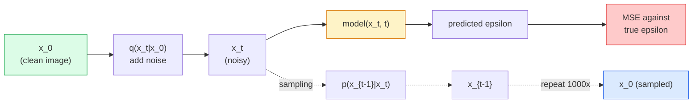

# Generowanie obrazów — modele dyfuzyjne

> Model dyfuzyjny uczy się odszumiać. Wytrenuj go, aby usuwał odrobinę szumu z zaszumionego obrazu, powtórz to wstecz tysiąc razy, a otrzymasz generator obrazów.

**Type:** Build
**Languages:** Python
**Prerequisites:** Phase 4 Lesson 07 (U-Net), Phase 1 Lesson 06 (Probability), Phase 3 Lesson 06 (Optimizers)
**Time:** ~75 minutes

## Learning Objectives

- Wyprowadzić proces szumienia w przód `x_0 -> x_1 -> ... -> x_T` i wyjaśnić, dlaczego postać zamknięta `q(x_t | x_0)` zachodzi dla dowolnego t
- Zaimplementować cel treningowy w stylu DDPM, który regresuje szum dodany na każdym kroku, oraz próbnik, który przechodzi od czystego szumu do obrazu
- Zbudować U-Net warunkowany czasem (wystarczająco mały, aby trenować na CPU), który przewiduje szum dla dowolnego kroku czasowego
- Wyjaśnić różnicę między próbkowaniem DDPM a DDIM oraz kiedy każdy jest odpowiedni (Lekcja 23 obejmuje flow matching i rectified flow w głębi)

## The Problem

GAN-y generują jednoetapowo: szum w środku, obraz na wyjściu, jeden forward pass. Są szybkie i trudne do trenowania. Modele dyfuzyjne generują iteracyjnie: zacznij od czystego szumu, odszumiaj małymi krokami, obraz się wyłania. Są wolne i łatwe do trenowania. Przez ostatnie pięć lat ta druga właściwość dominowała: każdy mały zespół może wytrenować model dyfuzyjny i uzyskać rozsądne próbki; trenowanie GAN to rzemiosło, którego uczysz się przez lata nieudanych uruchomień.

Poza stabilnością treningu, iteracyjna struktura dyfuzji jest tym, co odblokowuje wszystko, co robi nowoczesne generowanie obrazów: warunkowanie tekstem, inpainting, edycję obrazów, superrozdzielczość, sterowalny styl. Każdy krok pętli próbkowania to miejsce do wstrzyknięcia nowego ograniczenia. Ten hak jest powodem, dla którego Stable Diffusion, Imagen, DALL-E 3, Midjourney i każdy sterowalny model obrazu, którego użyjesz, są oparte na dyfuzji.

Ta lekcja buduje minimalny DDPM: szumienie w przód, odszumianie wstecz, pętlę treningową. Następna lekcja (Stable Diffusion) łączy to w system produkcyjny z VAE, enkoderem tekstu i wskazówkami bez klasyfikatora.

## The Concept

### Proces w przód

Weź obraz `x_0`. Dodaj odrobinę szumu Gaussa, aby otrzymać `x_1`. Dodaj odrobinę więcej, aby otrzymać `x_2`. Kontynuuj przez T kroków, aż `x_T` będzie prawie nie do odróżnienia od czystego szumu Gaussa.

```
q(x_t | x_{t-1}) = N(x_t; sqrt(1 - beta_t) * x_{t-1},  beta_t * I)
```

`beta_t` to mały harmonogram wariancji, zazwyczaj liniowy od 0.0001 do 0.02 przez T=1000 kroków. Każdy krok nieco zmniejsza sygnał i wstrzykuje świeży szum.

### Skok w postaci zamkniętej

Dodawanie szumu krok po kroku to łańcuch Markowa, ale matematyka się składa: możesz próbkować `x_t` bezpośrednio z `x_0` w jednym kroku.

```
Define alpha_t = 1 - beta_t
Define alpha_bar_t = prod_{s=1..t} alpha_s

Then:
  q(x_t | x_0) = N(x_t; sqrt(alpha_bar_t) * x_0,  (1 - alpha_bar_t) * I)

Equivalently:
  x_t = sqrt(alpha_bar_t) * x_0 + sqrt(1 - alpha_bar_t) * epsilon
  where epsilon ~ N(0, I)
```

To pojedyncze równanie jest całym powodem, dla którego dyfuzja jest praktyczna. Podczas treningu wybierasz losowe `t`, próbkujesz `x_t` bezpośrednio z `x_0` i trenujesz w jednym kroku — nie ma potrzeby symulacji pełnego łańcucha Markowa.

### Proces wstecz

Proces w przód jest stały. Proces wstecz `p(x_{t-1} | x_t)` jest tym, czego uczy się sieć neuronowa. Modele dyfuzyjne nie przewidują `x_{t-1}` bezpośrednio; przewidują szum `epsilon` dodany w kroku t, a matematyka wyprowadza `x_{t-1}` z niego.



### Strata treningowa

Dla każdego kroku treningowego:

1. Próbkuj prawdziwy obraz `x_0`.
2. Próbkuj krok czasowy `t` jednostajnie z [1, T].
3. Próbkuj szum `epsilon ~ N(0, I)`.
4. Oblicz `x_t = sqrt(alpha_bar_t) * x_0 + sqrt(1 - alpha_bar_t) * epsilon`.
5. Przewidź `epsilon_theta(x_t, t)` za pomocą sieci.
6. Minimalizuj `|| epsilon - epsilon_theta(x_t, t) ||^2`.

To wszystko. Sieć neuronowa uczy się przewidywać szum w dowolnym kroku czasowym. Strata to MSE. Nie ma gry adversarialnej, żadnego załamania, żadnej oscylacji.

### Próbnik (DDPM)

Aby wygenerować: zacznij od `x_T ~ N(0, I)` i idź wstecz jeden krok na raz.

```
for t = T, T-1, ..., 1:
    eps = model(x_t, t)
    x_{t-1} = (1 / sqrt(alpha_t)) * (x_t - (beta_t / sqrt(1 - alpha_bar_t)) * eps) + sqrt(beta_t) * z
    where z ~ N(0, I) if t > 1, else 0
return x_0
```

Kluczowe jest to, że chociaż warunek wsteczny nie jest znany w postaci zamkniętej ogólnie, dla tego konkretnego procesu Gaussa w przód jest. Brzydko wyglądające współczynniki są tym, co daje ci reguła Bayesa.

### Dlaczego 1000 kroków

Harmonogram szumu w przód jest tak dobrany, że każdy krok dodaje wystarczająco dużo szumu, aby krok wstecz był prawie Gaussowski. Zbyt mało kroków, a krok wstecz jest daleki od Gaussa, sieć nie może go dobrze modelować. Zbyt wiele kroków, a próbkowanie staje się kosztowne z malejącymi zyskami. T=1000 z liniowym harmonogramem to domyślna wartość DDPM.

### DDIM: 20x szybsze próbkowanie

Trening jest taki sam. Próbkowanie się zmienia. DDIM (Song i in., 2020) definiuje deterministyczny proces wstecz, który pomija kroki czasowe bez konieczności ponownego trenowania. Próbkowanie w 50 krokach z DDIM daje jakość bliską 1000-krokowemu DDPM. Każdy system produkcyjny używa DDIM lub jeszcze szybszego wariantu (DPM-Solver, Euler ancestral).

### Warunkowanie czasem

Sieć `epsilon_theta(x_t, t)` musi wiedzieć, który krok czasowy odszumia. Nowoczesne modele dyfuzyjne wstrzykują `t` przez sinusoidalne embeddingi czasu (ten sam pomysł co kodowanie pozycyjne w transformerach), które są dodawane do map cech na każdym poziomie U-Net.

```
t_embedding = sinusoidal(t)
feature_map += MLP(t_embedding)
```

Bez warunkowania czasem sieć musi odgadnąć poziom szumu z samego obrazu, co działa, ale jest znacznie mniej wydajne próbkowo.

## Build It

### Step 1: Noise schedule

```python
import torch

def linear_beta_schedule(T=1000, beta_start=1e-4, beta_end=2e-2):
    return torch.linspace(beta_start, beta_end, T)


def precompute_schedule(betas):
    alphas = 1.0 - betas
    alphas_cumprod = torch.cumprod(alphas, dim=0)
    return {
        "betas": betas,
        "alphas": alphas,
        "alphas_cumprod": alphas_cumprod,
        "sqrt_alphas_cumprod": torch.sqrt(alphas_cumprod),
        "sqrt_one_minus_alphas_cumprod": torch.sqrt(1.0 - alphas_cumprod),
        "sqrt_recip_alphas": torch.sqrt(1.0 / alphas),
    }

schedule = precompute_schedule(linear_beta_schedule(T=1000))
```

Oblicz raz, pobieraj przez indeks podczas treningu i próbkowania.

### Step 2: Forward diffusion (q_sample)

```python
def q_sample(x0, t, noise, schedule):
    sqrt_a = schedule["sqrt_alphas_cumprod"][t].view(-1, 1, 1, 1)
    sqrt_one_minus_a = schedule["sqrt_one_minus_alphas_cumprod"][t].view(-1, 1, 1, 1)
    return sqrt_a * x0 + sqrt_one_minus_a * noise
```

Jednowierszowa postać zamknięta. `t` to batch kroków czasowych, jeden na obraz w batchu.

### Step 3: A tiny time-conditioned U-Net

```python
import torch.nn as nn
import torch.nn.functional as F
import math

def timestep_embedding(t, dim=64):
    half = dim // 2
    freqs = torch.exp(-math.log(10000) * torch.arange(half, device=t.device) / half)
    args = t[:, None].float() * freqs[None]
    emb = torch.cat([args.sin(), args.cos()], dim=-1)
    return emb


class TinyUNet(nn.Module):
    def __init__(self, img_channels=3, base=32, t_dim=64):
        super().__init__()
        self.t_mlp = nn.Sequential(
            nn.Linear(t_dim, base * 4),
            nn.SiLU(),
            nn.Linear(base * 4, base * 4),
        )
        self.t_dim = t_dim
        self.enc1 = nn.Conv2d(img_channels, base, 3, padding=1)
        self.enc2 = nn.Conv2d(base, base * 2, 4, stride=2, padding=1)
        self.mid = nn.Conv2d(base * 2, base * 2, 3, padding=1)
        self.dec1 = nn.ConvTranspose2d(base * 2, base, 4, stride=2, padding=1)
        self.dec2 = nn.Conv2d(base * 2, img_channels, 3, padding=1)
        self.time_proj = nn.Linear(base * 4, base * 2)

    def forward(self, x, t):
        t_emb = timestep_embedding(t, self.t_dim)
        t_emb = self.t_mlp(t_emb)
        t_proj = self.time_proj(t_emb)[:, :, None, None]

        h1 = F.silu(self.enc1(x))
        h2 = F.silu(self.enc2(h1)) + t_proj
        h3 = F.silu(self.mid(h2))
        d1 = F.silu(self.dec1(h3))
        d2 = torch.cat([d1, h1], dim=1)
        return self.dec2(d2)
```

Dwupoziomowy U-Net z warunkowaniem czasowym wstrzykniętym w wąskim gardle. Zwiększ głębokość i szerokość dla prawdziwych obrazów.

### Step 4: Training loop

```python
def train_step(model, x0, schedule, optimizer, device, T=1000):
    model.train()
    x0 = x0.to(device)
    bs = x0.size(0)
    t = torch.randint(0, T, (bs,), device=device)
    noise = torch.randn_like(x0)
    x_t = q_sample(x0, t, noise, schedule)
    pred = model(x_t, t)
    loss = F.mse_loss(pred, noise)
    optimizer.zero_grad()
    loss.backward()
    optimizer.step()
    return loss.item()
```

To cała pętla treningowa. Żadna gra GAN, żadna wyspecjalizowana strata, jedno wywołanie MSE.

### Step 5: Sampler (DDPM)

```python
@torch.no_grad()
def sample(model, schedule, shape, T=1000, device="cpu"):
    model.eval()
    x = torch.randn(shape, device=device)
    betas = schedule["betas"].to(device)
    sqrt_one_minus_a = schedule["sqrt_one_minus_alphas_cumprod"].to(device)
    sqrt_recip_alphas = schedule["sqrt_recip_alphas"].to(device)

    for t in reversed(range(T)):
        t_batch = torch.full((shape[0],), t, dtype=torch.long, device=device)
        eps = model(x, t_batch)
        coef = betas[t] / sqrt_one_minus_a[t]
        mean = sqrt_recip_alphas[t] * (x - coef * eps)
        if t > 0:
            x = mean + torch.sqrt(betas[t]) * torch.randn_like(x)
        else:
            x = mean
    return x
```

1000 forward passów, aby wyprodukować jeden batch próbek. W prawdziwym kodzie zamieniłbyś to na 50-krokowy próbnik DDIM.

### Step 6: DDIM sampler (deterministic, ~20x faster)

```python
@torch.no_grad()
def sample_ddim(model, schedule, shape, steps=50, T=1000, device="cpu", eta=0.0):
    model.eval()
    x = torch.randn(shape, device=device)
    alphas_cumprod = schedule["alphas_cumprod"].to(device)

    ts = torch.linspace(T - 1, 0, steps + 1).long()
    for i in range(steps):
        t = ts[i]
        t_prev = ts[i + 1]
        t_batch = torch.full((shape[0],), t, dtype=torch.long, device=device)
        eps = model(x, t_batch)
        a_t = alphas_cumprod[t]
        a_prev = alphas_cumprod[t_prev] if t_prev >= 0 else torch.tensor(1.0, device=device)
        x0_pred = (x - torch.sqrt(1 - a_t) * eps) / torch.sqrt(a_t)
        sigma = eta * torch.sqrt((1 - a_prev) / (1 - a_t) * (1 - a_t / a_prev))
        dir_xt = torch.sqrt(1 - a_prev - sigma ** 2) * eps
        noise = sigma * torch.randn_like(x) if eta > 0 else 0
        x = torch.sqrt(a_prev) * x0_pred + dir_xt + noise
    return x
```

`eta=0` jest w pełni deterministyczne (to samo wejście szumu zawsze produkuje to samo wyjście). `eta=1` odtwarza DDPM.

## Use It

Do pracy produkcyjnej używaj `diffusers`:

```python
from diffusers import DDPMScheduler, UNet2DModel

unet = UNet2DModel(sample_size=32, in_channels=3, out_channels=3, layers_per_block=2)
scheduler = DDPMScheduler(num_train_timesteps=1000)
```

Biblioteka zawiera gotowe schedulery (DDPM, DDIM, DPM-Solver, Euler, Heun), konfigurowalne U-Net, potoki do text-to-image i image-to-image oraz pomocniki do dostrajania LoRA.

Do badań, `k-diffusion` (Katherine Crowson) ma najbardziej wierne implementacje referencyjne i najlepsze warianty próbkowania.

## Ship It

Ta lekcja produkuje:

- `outputs/prompt-diffusion-sampler-picker.md` — prompt, który wybiera DDPM / DDIM / DPM-Solver / Euler na podstawie celu jakości, budżetu opóźnienia i typu warunkowania.
- `outputs/skill-noise-schedule-designer.md` — umiejętność, która produkuje liniowy, cosinusowy lub sigmoidalny harmonogram beta, biorąc T i docelowy poziom zniekształcenia, plus wykresy diagnostyczne stosunku sygnału do szumu w czasie.

## Exercises

1. **(Easy)** Wizualizuj proces w przód: weź jeden obraz i narysuj `x_t` dla `t in [0, 100, 250, 500, 750, 1000]`. Zweryfikuj, że `x_1000` wygląda jak czysty szum Gaussa.
2. **(Medium)** Wytrenuj TinyUNet na syntetycznym zbiorze kółek przez 20 epok i próbkuj 16 kółek. Porównaj próbkowanie DDPM (1000 kroków) i DDIM (50 kroków) — czy produkują podobne obrazy z tego samego ziarna szumu?
3. **(Hard)** Zaimplementuj cosinusowy harmonogram szumu (Nichol & Dhariwal, 2021): `alpha_bar_t = cos^2((t/T + s) / (1 + s) * pi / 2)`. Wytrenuj ten sam model z liniowym i cosinusowym harmonogramem i pokaż, że cosinus daje lepsze próbki przy małej liczbie kroków.

## Key Terms

| Term | What people say | What it actually means |
|------|----------------|----------------------|
| Forward process | "Add noise over time" | Fixed Markov chain that corrupts an image into Gaussian noise over T steps |
| Reverse process | "Denoise step by step" | Learned distribution that walks back from noise to image |
| Epsilon prediction | "Predict the noise" | The training target: `epsilon_theta(x_t, t)` predicts the noise added at step t |
| Beta schedule | "Noise amounts" | Sequence of T small variances that define how much noise enters per step |
| alpha_bar_t | "Cumulative retain factor" | Product of (1 - beta_s) up to time t; bigger t means less signal left |
| DDPM sampler | "Ancestral, stochastic" | Samples each x_{t-1} from its conditional Gaussian; 1000 steps |
| DDIM sampler | "Deterministic, fast" | Rewrites sampling as a deterministic ODE; 20-100 steps with similar quality |
| Time conditioning | "Tell the model which t" | Sinusoidal embedding of t injected into the U-Net so it knows the noise level |

## Further Reading

- [Denoising Diffusion Probabilistic Models (Ho et al., 2020)](https://arxiv.org/abs/2006.11239) — publikacja, która uczyniła dyfuzję praktyczną i pobiła GAN na FID
- [Improved DDPM (Nichol & Dhariwal, 2021)](https://arxiv.org/abs/2102.09672) — harmonogram cosinusowy i parametryzacja v
- [DDIM (Song, Meng, Ermon, 2020)](https://arxiv.org/abs/2010.02502) — deterministyczny próbnik, który umożliwił wnioskowanie w czasie rzeczywistym
- [Elucidating the Design Space of Diffusion (Karras et al., 2022)](https://arxiv.org/abs/2206.00364) — ujednolicony widok każdego wyboru projektowego dyfuzji; obecnie najlepsze źródło