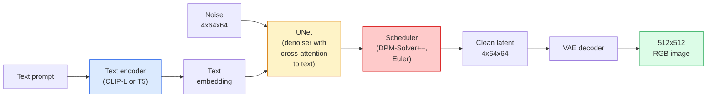

# Stable Diffusion — Architektura i dostrajanie

> Stable Diffusion to DDPM działający w przestrzeni latentnej wstępnie wytrenowanego VAE, warunkowany tekstem przez cross-attention, próbkowany szybkim deterministycznym solverem ODE i sterowany przez wskazówki bez klasyfikatora.

**Type:** Learn + Use
**Languages:** Python
**Prerequisites:** Phase 4 Lesson 10 (Diffusion), Phase 7 Lesson 02 (Self-Attention)
**Time:** ~75 minutes

## Learning Objectives

- Prześledzić pięć elementów potoku Stable Diffusion: VAE, enkoder tekstu, U-Net, scheduler, bezpiecznik — i co każdy z nich faktycznie robi
- Wyjaśnić dyfuzję latentną i dlaczego trenowanie w przestrzeni latentnej 4x64x64 (zamiast obrazu 3x512x512) zmniejsza obliczenia 48x bez utraty jakości
- Użyć `diffusers` do generowania obrazów, uruchamiania image-to-image, inpainting i generowania sterowanego przez ControlNet
- Dostroić Stable Diffusion za pomocą LoRA na małym niestandardowym zbiorze danych i wczytać adapter LoRA w czasie wnioskowania

## The Problem

Trenowanie DDPM bezpośrednio na obrazach RGB 512x512 jest kosztowne. Każdy krok treningowy propaguje wstecz przez U-Net, który widzi 3x512x512 = 786 432 wartości wejściowych, a próbkowanie wymaga 50+ forward passów przez ten sam U-Net. Na poziomie jakości Stable Diffusion 1.5 (wydany 2022), dyfuzja w przestrzeni pikseli potrzebowałaby około 256 GPU-miesięcy treningu i 10-30 sekund na obraz na konsumenckim GPU.

Sztuczką, która uczyniła text-to-image z otwartymi wagami praktycznym, była **dyfuzja latentna** (Rombach i in., CVPR 2022). Wytrenuj VAE, który mapuje obraz 3x512x512 do tensora latentnego 4x64x64 i z powrotem, a następnie wykonuj dyfuzję w tej przestrzeni latentnej. Obliczenia spadają o `(3*512*512)/(4*64*64) = 48x`. Próbkowanie spada z dziesiątek sekund do poniżej dwóch sekund na tym samym GPU.

Prawie każdy nowoczesny model generowania obrazów — SDXL, SD3, FLUX, HunyuanDiT, Wan-Video — to model dyfuzji latentnej z wariacjami na temat autoenkodera, denoisera (U-Net lub DiT) i warunkowania tekstem. Naucz się Stable Diffusion, a poznasz szablon.

## The Concept

### Potok



- **VAE** — zamrożony autoenkoder. Enkoder zamienia obraz w latenty (używane do img2img i treningu). Dekoder zamienia latenty z powrotem w obraz.
- **Text encoder** — enkoder tekstu CLIP (SD 1.x/2.x), CLIP-L + CLIP-G (SDXL) lub T5-XXL (SD3/FLUX). Produkuje sekwencję embeddingów tokenów.
- **U-Net** — denoiser. Ma warstwy cross-attention, które uwzględniają embedding tekstu na każdym poziomie rozdzielczości.
- **Scheduler** — algorytm próbkowania (DDIM, Euler, DPM-Solver++). Wybiera sigmy, miesza przewidywany szum z powrotem z latentem.
- **Safety checker** — opcjonalny filtr NSFW / nielegalnych treści na obrazie wyjściowym.

### Wskazówki bez klasyfikatora (CFG)

Zwykłe warunkowanie tekstem uczy `epsilon_theta(x_t, t, c)` dla każdego promptu `c`. CFG trenuje tę samą sieć, upuszczając `c` w 10% przypadków (zastąpionego pustym embeddingiem), dając pojedynczy model, który przewiduje zarówno szum warunkowy, jak i bezwarunkowy. W czasie wnioskowania:

```
eps = eps_uncond + w * (eps_cond - eps_uncond)
```

`w` to skala wskazówek. `w=0` to bezwarunkowe, `w=1` to zwykłe warunkowe, `w>1` popycha wyjście w kierunku "bardziej warunkowego promptem" kosztem różnorodności. Domyślna wartość SD to `w=7.5`.

CFG jest powodem, dla którego text-to-image działa na poziomie produkcyjnym. Bez niego prompty słabo wpływają na wyjście; z nim prompty dominują.

### Geometria przestrzeni latentnej

4-kanałowy latent VAE to nie tylko skompresowany obraz. To rozmaitość, na której arytmetyka z grubsza odpowiada edycjom semantycznym (inżynieria promptów + interpolacja oba tu żyją), i gdzie U-Net dyfuzyjny został wytrenowany, aby wydać cały swój budżet modelowania. Dekodowanie losowego latenta 4x64x64 nie produkuje losowo wyglądającego obrazu — produkuje śmieci, ponieważ tylko określona podrozmaitość latentów dekoduje się do prawidłowych obrazów.

Dwie konsekwencje:

1. **Img2img** = zakoduj obraz do latenta, dodaj częściowy szum, uruchom denoiser, zdekoduj. Struktura obrazu przetrwa, ponieważ kodowanie jest prawie odwracalne; treść zmienia się w zależności od promptu.
2. **Inpainting** = to samo co img2img, ale denoiser aktualizuje tylko zamaskowane regiony; niemaskowane regiony są utrzymywane na zakodowanym latencie.

### Architektura U-Net

U-Net SD to duża wersja TinyUNet z Lekcji 10 z trzema dodatkami:

- **Bloki transformerowe** na każdej rozdzielczości przestrzennej, zawierające self-attention + cross-attention do embeddingu tekstu.
- **Embedding czasu** przez MLP na kodowaniu sinusoidalnym.
- **Połączenia pomijające** między enkoderem a dekoderem na pasujących rozdzielczościach.

Łączna liczba parametrów w SD 1.5: ~860M. SDXL: ~2.6B. FLUX: ~12B. Skok parametrów to głównie warstwy attention.

### Dostrajanie LoRA

Pełne dostrajanie Stable Diffusion potrzebuje 20+ GB VRAM i aktualizuje 860M parametrów. LoRA (Low-Rank Adaptation) utrzymuje bazowy model zamrożony i wstrzykuje małe macierze dekompozycji rzędu do warstw attention. Adapter LoRA dla SD ma zazwyczaj 10-50 MB, trenuje w 10-60 minut na pojedynczym konsumenckim GPU i jest wczytywany w czasie wnioskowania jako modyfikacja typu drop-in.

```
Original: W_q : (d_in, d_out)   frozen
LoRA:     W_q + alpha * (A @ B)   where A : (d_in, r), B : (r, d_out)

r is typically 4-32.
```

LoRA to sposób, w jaki dystrybuowana jest prawie każda społecznościowa fine-tuna. CivitAI i Hugging Face hostują ich miliony.

### Schedulery, które zobaczysz

- **DDIM** — deterministyczny, ~50 kroków, prosty.
- **Euler ancestral** — stochastyczny, 30-50 kroków, nieco bardziej kreatywne próbki.
- **DPM-Solver++ 2M Karras** — deterministyczny, 20-30 kroków, domyślna wartość produkcyjna.
- **LCM / TCD / Turbo** — modele spójności i warianty destylowane; 1-4 kroki kosztem pewnej jakości.

Zmiana schedulera to zmiana jednej linii w `diffusers` i czasami naprawia problemy z próbkami bez konieczności ponownego trenowania.

## Build It

Ta lekcja używa `diffusers` end-to-end zamiast odbudowywać Stable Diffusion od podstaw. Elementy, które musiałbyś odbudować (VAE, enkoder tekstu, U-Net, scheduler), to tematy osobnych lekcji; tutaj celem jest biegłość w API produkcyjnym.

### Step 1: Text-to-image

```python
import torch
from diffusers import StableDiffusionPipeline

pipe = StableDiffusionPipeline.from_pretrained(
    "runwayml/stable-diffusion-v1-5",
    torch_dtype=torch.float16,
).to("cuda")

image = pipe(
    prompt="a dog riding a skateboard in tokyo, studio ghibli style",
    guidance_scale=7.5,
    num_inference_steps=25,
    generator=torch.Generator("cuda").manual_seed(42),
).images[0]
image.save("dog.png")
```

`float16` dzieli VRAM na pół bez widocznej utraty jakości. `num_inference_steps=25` z domyślnym DPM-Solver++ odpowiada `num_inference_steps=50` z DDIM.

### Step 2: Swap the scheduler

```python
from diffusers import DPMSolverMultistepScheduler, EulerAncestralDiscreteScheduler

pipe.scheduler = DPMSolverMultistepScheduler.from_config(pipe.scheduler.config)
pipe.scheduler = EulerAncestralDiscreteScheduler.from_config(pipe.scheduler.config)
```

Stan schedulera jest odseparowany od wag U-Net. Możesz trenować na DDPM i próbkować z dowolnym schedulerem.

### Step 3: Image-to-image

```python
from diffusers import StableDiffusionImg2ImgPipeline
from PIL import Image

img2img = StableDiffusionImg2ImgPipeline.from_pretrained(
    "runwayml/stable-diffusion-v1-5",
    torch_dtype=torch.float16,
).to("cuda")

init_image = Image.open("dog.png").convert("RGB").resize((512, 512))
out = img2img(
    prompt="a dog riding a skateboard, oil painting",
    image=init_image,
    strength=0.6,
    guidance_scale=7.5,
).images[0]
```

`strength` to ilość szumu do dodania przed odszumianiem (0.0 = bez zmian, 1.0 = pełna regeneracja). 0.5-0.7 to standardowy zakres transferu stylu.

### Step 4: Inpainting

```python
from diffusers import StableDiffusionInpaintPipeline

inpaint = StableDiffusionInpaintPipeline.from_pretrained(
    "runwayml/stable-diffusion-inpainting",
    torch_dtype=torch.float16,
).to("cuda")

image = Image.open("dog.png").convert("RGB").resize((512, 512))
mask = Image.open("dog_mask.png").convert("L").resize((512, 512))

out = inpaint(
    prompt="a cat",
    image=image,
    mask_image=mask,
    guidance_scale=7.5,
).images[0]
```

Białe piksele w masce to obszar do regeneracji. Czarne piksele są zachowane.

### Step 5: LoRA loading

```python
pipe.load_lora_weights("sayakpaul/sd-lora-ghibli")
pipe.fuse_lora(lora_scale=0.8)

image = pipe(prompt="a village square in ghibli style").images[0]
```

`lora_scale` kontroluje siłę; 0.0 = brak efektu, 1.0 = pełny efekt. `fuse_lora` wbudowuje adapter w wagi na miejscu dla szybkości, ale uniemożliwia wymianę. Wywołaj `pipe.unfuse_lora()` przed wczytaniem innego adaptera.

### Step 6: LoRA training (sketch)

Prawdziwe trenowanie LoRA żyje w `peft` lub `diffusers.training`. Zarys:

```python
# Pseudocode
for step, batch in enumerate(dataloader):
    images, prompts = batch
    latents = vae.encode(images).latent_dist.sample() * 0.18215

    t = torch.randint(0, num_train_timesteps, (batch_size,))
    noise = torch.randn_like(latents)
    noisy_latents = scheduler.add_noise(latents, noise, t)

    text_emb = text_encoder(tokenizer(prompts))

    pred_noise = unet(noisy_latents, t, text_emb)  # LoRA weights injected here

    loss = F.mse_loss(pred_noise, noise)
    loss.backward()
    optimizer.step()
```

Tylko macierze LoRA otrzymują gradient; bazowy U-Net, VAE i enkoder tekstu są zamrożone. Z rozmiarem batcha 1 i gradient checkpointing mieści się to w 8 GB VRAM.

## Use It

W produkcji decyzje, które faktycznie podejmujesz:

- **Rodzina modeli**: SD 1.5 dla społecznościowych fine-tun open-source, SDXL dla wyższej wierności, SD3 / FLUX dla stanu sztuki i ścisłych wymogów licencyjnych.
- **Scheduler**: DPM-Solver++ 2M Karras dla 20-30 kroków, LCM-LoRA, gdy opóźnienie jest poniżej 1s.
- **Precyzja**: `float16` na 4080/4090, `bfloat16` na A100 i nowszych, `int8` (przez `bitsandbytes` lub `compel`), gdy VRAM jest ciasny.
- **Conditioning**: zwykły tekst działa; dla silniejszej kontroli dodaj ControlNet (canny, depth, pose) na bazowym potoku.

Dla generowania wsadowego `AUTO1111` / `ComfyUI` to narzędzia społecznościowe; dla API produkcyjnych `diffusers` + `accelerate` lub `optimum-nvidia` z kompilacją TensorRT.

## Ship It

Ta lekcja produkuje:

- `outputs/prompt-sd-pipeline-planner.md` — prompt, który wybiera SD 1.5 / SDXL / SD3 / FLUX plus scheduler i precyzję na podstawie budżetu opóźnienia, celu wierności i ograniczeń licencyjnych.
- `outputs/skill-lora-training-setup.md` — umiejętność, która pisze pełną konfigurację treningu LoRA dla niestandardowego zbioru danych, w tym podpisy, rząd, rozmiar batcha i tempo uczenia.

## Exercises

1. **(Easy)** Wygeneruj ten sam prompt z `guidance_scale` w `[1, 3, 5, 7.5, 10, 15]`. Opisz, jak zmienia się obraz. Przy jakiej wartości wskazówek pojawiają się artefakty?
2. **(Medium)** Weź dowolne prawdziwe zdjęcie, przepuść je przez `StableDiffusionImg2ImgPipeline` z `strength` w `[0.2, 0.4, 0.6, 0.8, 1.0]`. Jaka siła zachowuje kompozycję, zmieniając styl? Dlaczego 1.0 całkowicie ignoruje wejście?
3. **(Hard)** Wytrenuj LoRA na 10-20 obrazach pojedynczego tematu (zwierzę domowe, logo, postać) i wygeneruj nowe sceny z tym tematem. Raportuj rząd LoRA i kroki treningowe, które dały najlepsze zachowanie tożsamości bez przeuczenia na obrazach wejściowych.

## Key Terms

| Term | What people say | What it actually means |
|------|----------------|----------------------|
| Latent diffusion | "Diffuse in latents" | Run the entire DDPM in the VAE latent space (4x64x64) instead of pixel space (3x512x512); 48x compute saving |
| VAE scale factor | "0.18215" | Constant that rescales the VAE's raw latent to roughly unit variance; hardcoded in every SD pipeline |
| Classifier-free guidance | "CFG" | Mix conditional and unconditional noise predictions; the single most impactful inference knob |
| Scheduler | "Sampler" | The algorithm that turns noise + model predictions into a denoised latent trajectory |
| LoRA | "Low-rank adapter" | Small rank-decomposition matrices that fine-tune attention layers without touching base weights |
| Cross-attention | "Text-image attention" | Attention from latent tokens to text tokens; injects prompt information at every U-Net level |
| ControlNet | "Structure conditioning" | A separately-trained adapter that steers SD with an extra input (canny, depth, pose, segmentation) |
| DPM-Solver++ | "The default scheduler" | Second-order deterministic ODE solver; best quality at low step counts (20-30) in 2026 |

## Further Reading

- [High-Resolution Image Synthesis with Latent Diffusion (Rombach et al., 2022)](https://arxiv.org/abs/2112.10752) — publikacja Stable Diffusion; zawiera każdą ablację uzasadniającą projekt
- [Classifier-Free Diffusion Guidance (Ho & Salimans, 2022)](https://arxiv.org/abs/2207.12598) — publikacja CFG
- [LoRA: Low-Rank Adaptation of Large Language Models (Hu et al., 2021)](https://arxiv.org/abs/2106.09685) — LoRA był najpierw NLP; przeniósł się do SD prawie bez zmian
- [diffusers documentation](https://huggingface.co/docs/diffusers) — źródło dla każdego potoku SD / SDXL / SD3 / FLUX