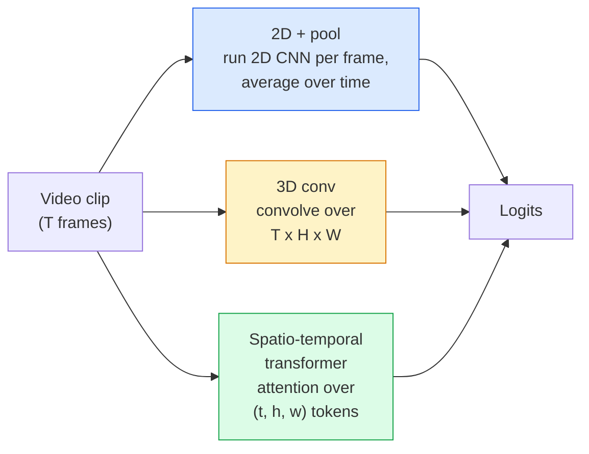

# Rozumienie wideo — modelowanie czasowe

> Wideo to sekwencja obrazów plus fizyka, która je łączy. Każdy model wideo albo traktuje czas jako dodatkową oś (konwolucja 3D), sekwencję do uwzględnienia (transformer) lub cechę do wyodrębnienia i uśrednienia (2D+pool).

**Type:** Learn + Build
**Languages:** Python
**Prerequisites:** Phase 4 Lesson 03 (CNNs), Phase 4 Lesson 04 (Image Classification)
**Time:** ~45 minutes

## Learning Objectives

- Odróżnić trzy główne podejścia do modelowania wideo (2D+pool, konwolucja 3D, transformer czasoprzestrzenny) i przewidzieć ich kompromisy kosztu i dokładności
- Zaimplementować próbkowanie klatek, agregację czasową i bazowy klasyfikator 2D+pool w PyTorch
- Wyjaśnić, dlaczego "nadmuchane" (inflated) jądra 3D I3D dobrze się przenoszą z wag ImageNet i czym różni się splot sfaktoryzowany (2+1)D
- Czytać standardowe zbiory danych i metryki rozpoznawania akcji: Kinetics-400/600, UCF101, Something-Something V2; dokładność top-1 na poziomie klipu i wideo

## The Problem

30-sekundowe wideo przy 30 fps to 900 obrazów. Naiwnie, klasyfikacja wideo to klasyfikacja obrazów uruchomiona 900 razy, po której następuje jakaś agregacja. To działa, gdy akcja jest widoczna w prawie każdej klatce (sport, gotowanie, filmy ćwiczeniowe) i fatalnie zawodzi, gdy akcja jest definiowana przez sam ruch: "pchanie czegoś z lewej na prawo" wygląda jak dwa nieruchome obiekty w każdej pojedynczej klatce.

Podstawowe pytanie dla każdej architektury wideo brzmi: kiedy struktura czasowa jest modelowana i jak? Odpowiedź napędza wszystko inne — koszt obliczeniowy, strategię wstępnego trenowania, czy możesz ponownie użyć wag ImageNet, na jakich zbiorach danych model trenuje.

Ta lekcja jest celowo krótsza niż lekcje o obrazach statycznych. Podstawowa mechanika obrazu jest już na miejscu, a rozumienie wideo to głównie historia czasowa: próbkowanie, modelowanie i agregacja.

## The Concept

### Trzy rodziny architektoniczne



### 2D + pool

Weź 2D CNN (ResNet, EfficientNet, ViT). Uruchom ją niezależnie na każdej próbkowanej klatce. Uśrednij (lub max-pool, lub attention-pool) embeddingi z klatek. Podaj uśredniony wektor do klasyfikatora.

Zalety:
- Wstępne trenowanie ImageNet przenosi się bezpośrednio.
- Najprostsze do zaimplementowania.
- Tanie: T klatek * koszt wnioskowania pojedynczego obrazu.

Wady:
- Nie może modelować ruchu. Akcja = agregacja wyglądów.
- Agregacja czasowa jest niezmienna na kolejność; "otwórz drzwi" i "zamknij drzwi" wyglądają tak samo.

Kiedy używać: zadania oparte na wyglądzie, transfer learning na małych zbiorach wideo, początkowe baseline'y.

### Konwolucje 3D

Zastąp jądra 2D (H, W) jądrami 3D (T, H, W). Sieć konwoluuje zarówno w przestrzeni, jak i czasie. Wczesna rodzina: C3D, I3D, SlowFast.

Sztuczka I3D: weź wstępnie wytrenowany model 2D ImageNet, "nadmuchaj" każde jądro 2D przez skopiowanie go wzdłuż nowej osi czasu. Konwolucja 2D 3x3 staje się konwolucją 3D 3x3x3. To daje modelowi 3D silne wstępnie wytrenowane wagi zamiast trenowania od zera.

Zalety:
- Bezpośrednio modeluje ruch.
- Nadmuchanie I3D daje darmowy transfer learning.

Wady:
- T/8 więcej FLOPów niż odpowiednik 2D (dla jądra czasowego 3 ułożonego 3 razy).
- Jądra czasowe są małe; ruch dalekiego zasięgu potrzebuje piramidy lub podejścia dwustrumieniowego.

Kiedy używać: rozpoznawanie akcji, gdzie ruch jest sygnałem (Something-Something V2, Kinetics z klasami ciężkimi ruchowo).

### Transformery czasoprzestrzenne

Tokenizuj wideo na siatkę łat czasoprzestrzennych i uwzględniaj wszystkie. TimeSformer, ViViT, Video Swin, VideoMAE.

Wzory attention, które mają znaczenie:
- **Joint** — jedna duża attention nad (t, h, w). Kwadratowa w `T*H*W`; kosztowna.
- **Divided** — dwie attention na blok: jedna nad czasem, jedna nad przestrzenią. Skalowanie liniowe.
- **Factorised** — attention czasu zmienia się z attention przestrzeni między blokami.

Zalety:
- SOTA dokładność na każdym ważnym benchmarku.
- Przenosi się z transformerów obrazu (ViT) przez nadmuchanie łat.
- Obsługuje długi kontekst wideo przez rzadką attention.

Wady:
- Głodne obliczeniowo.
- Wymaga starannego wyboru wzoru attention, bo inaczej runtime balonuje.

Kiedy używać: duże zbiory danych, rozumienie wideo o wysokiej wierności, multimodalne zadania wideo+tekst.

### Próbkowanie klatek

10-sekundowy klip przy 30 fps to 300 klatek; podanie wszystkich 300 do dowolnego modelu jest marnotrawstwem. Standardowe strategie:

- **Uniform sampling** — wybierz T klatek równomiernie z klipu. Domyślna dla 2D+pool.
- **Dense sampling** — losowe ciągłe okno T-klatek. Częste dla konwolucji 3D, ponieważ ruch wymaga sąsiednich klatek.
- **Multi-clip** — próbkuj wiele okien T-klatek z tego samego wideo, klasyfikuj każde, uśrednij predykcje w czasie testu.

T to zazwyczaj 8, 16, 32 lub 64. Wyższe T = więcej sygnału czasowego przy więcej obliczeniach.

### Ewaluacja

Dwa poziomy:
- **Clip-level accuracy** — model widzi jeden klip T-klatek, raportuje top-k.
- **Video-level accuracy** — uśrednij predykcje na poziomie klipu z wielu klipów na wideo; wyższe i bardziej stabilne.

Zawsze raportuj oba. Model, który osiąga 78% klip / 82% wideo, polega mocno na uśrednianiu w czasie testu; taki, który osiąga 80% / 81%, jest bardziej solidny na klip.

### Zbiory danych, które poznasz

- **Kinetics-400 / 600 / 700** — ogólnego przeznaczenia zbiór akcji. 400k klipów; URL-e YouTube (wiele już martwych).
- **Something-Something V2** — akcje zdefiniowane ruchem ("przesuwanie X z lewej na prawo"). Nie można rozwiązać przez 2D+pool.
- **UCF-101**, **HMDB-51** — starsze, mniejsze, wciąż raportowane.
- **AVA** — lokalizacja akcji w przestrzeni i czasie; trudniejsze niż klasyfikacja.

## Build It

### Step 1: Frame sampler

Próbnik uniform i dense działające na liście klatek (lub tensorze wideo).

```python
import numpy as np

def sample_uniform(num_frames_total, T):
    if num_frames_total <= T:
        return list(range(num_frames_total)) + [num_frames_total - 1] * (T - num_frames_total)
    step = num_frames_total / T
    return [int(i * step) for i in range(T)]


def sample_dense(num_frames_total, T, rng=None):
    rng = rng or np.random.default_rng()
    if num_frames_total <= T:
        return list(range(num_frames_total)) + [num_frames_total - 1] * (T - num_frames_total)
    start = int(rng.integers(0, num_frames_total - T + 1))
    return list(range(start, start + T))
```

Oba zwracają `T` indeksów, których używasz do wycinania tensora wideo.

### Step 2: A 2D+pool baseline

Uruchom 2D ResNet-18 na każdej klatce, uśrednij cechy, klasyfikuj.

```python
import torch
import torch.nn as nn
from torchvision.models import resnet18, ResNet18_Weights

class FramePool(nn.Module):
    def __init__(self, num_classes=400, pretrained=True):
        super().__init__()
        weights = ResNet18_Weights.IMAGENET1K_V1 if pretrained else None
        backbone = resnet18(weights=weights)
        self.features = nn.Sequential(*(list(backbone.children())[:-1]))  # global avg pool kept
        self.head = nn.Linear(512, num_classes)

    def forward(self, x):
        # x: (N, T, 3, H, W)
        N, T = x.shape[:2]
        x = x.view(N * T, *x.shape[2:])
        feats = self.features(x).view(N, T, -1)
        pooled = feats.mean(dim=1)
        return self.head(pooled)

model = FramePool(num_classes=10)
x = torch.randn(2, 8, 3, 224, 224)
print(f"output: {model(x).shape}")
print(f"params: {sum(p.numel() for p in model.parameters()):,}")
```

Jedenaście milionów parametrów, wstępnie wytrenowany na ImageNet, działa na klatkę, uśrednia, klasyfikuje. Ten baseline jest często w granicach 5-10 punktów od właściwych modeli 3D na zadaniach opartych na wyglądzie — czasem lepszy, ponieważ używa silniejszego backbone'u ImageNet.

### Step 3: An I3D-style inflated 3D conv

Zamień pojedynczą konwolucję 2D w konwolucję 3D przez powtórzenie wag wzdłuż nowej osi czasu.

```python
def inflate_2d_to_3d(conv2d, time_kernel=3):
    out_c, in_c, kh, kw = conv2d.weight.shape
    weight_3d = conv2d.weight.data.unsqueeze(2)  # (out, in, 1, kh, kw)
    weight_3d = weight_3d.repeat(1, 1, time_kernel, 1, 1) / time_kernel
    conv3d = nn.Conv3d(in_c, out_c, kernel_size=(time_kernel, kh, kw),
                        padding=(time_kernel // 2, conv2d.padding[0], conv2d.padding[1]),
                        stride=(1, conv2d.stride[0], conv2d.stride[1]),
                        bias=False)
    conv3d.weight.data = weight_3d
    return conv3d

conv2d = nn.Conv2d(3, 64, kernel_size=3, padding=1, bias=False)
conv3d = inflate_2d_to_3d(conv2d, time_kernel=3)
print(f"2D weight shape:  {tuple(conv2d.weight.shape)}")
print(f"3D weight shape:  {tuple(conv3d.weight.shape)}")
x = torch.randn(1, 3, 8, 56, 56)
print(f"3D output shape:  {tuple(conv3d(x).shape)}")
```

Dzielenie przez `time_kernel` utrzymuje wielkości aktywacji w przybliżeniu stałe — ważne, aby nie zepsuć statystyk batch norm na pierwszym przejściu.

### Step 4: Factorised (2+1)D conv

Podziel konwolucję 3D na konwolucję 2D (przestrzenną) i 1D (czasową). To samo pole receptywne, mniej parametrów, lepsza dokładność na niektórych benchmarkach.

```python
class Conv2Plus1D(nn.Module):
    def __init__(self, in_c, out_c, kernel_size=3):
        super().__init__()
        mid_c = (in_c * out_c * kernel_size * kernel_size * kernel_size) \
                // (in_c * kernel_size * kernel_size + out_c * kernel_size)
        self.spatial = nn.Conv3d(in_c, mid_c, kernel_size=(1, kernel_size, kernel_size),
                                 padding=(0, kernel_size // 2, kernel_size // 2), bias=False)
        self.bn = nn.BatchNorm3d(mid_c)
        self.act = nn.ReLU(inplace=True)
        self.temporal = nn.Conv3d(mid_c, out_c, kernel_size=(kernel_size, 1, 1),
                                  padding=(kernel_size // 2, 0, 0), bias=False)

    def forward(self, x):
        return self.temporal(self.act(self.bn(self.spatial(x))))

c = Conv2Plus1D(3, 64)
x = torch.randn(1, 3, 8, 56, 56)
print(f"(2+1)D output: {tuple(c(x).shape)}")
```

Pełna sieć R(2+1)D to to samo co ResNet-18 z każdą konwolucją 3x3 zastąpioną przez `Conv2Plus1D`.

## Use It

Dwie biblioteki obejmują produkcyjną pracę z wideo:

- `torchvision.models.video` — R(2+1)D, MViT, Swin3D z wstępnie wytrenowanymi wagami Kinetics. To samo API co modele obrazów.
- `pytorchvideo` (Meta) — zoo modeli, loadery danych dla Kinetics / SSv2 / AVA, standardowe transformacje.

Dla modeli wideo-językowych (podpisywanie wideo, pytania i odpowiedzi wideo), używaj `transformers` (`VideoMAE`, `VideoLLaMA`, `InternVideo`).

## Ship It

Ta lekcja produkuje:

- `outputs/prompt-video-architecture-picker.md` — prompt, który wybiera 2D+pool / I3D / (2+1)D / transformer na podstawie wyglądu-vs-ruchu, rozmiaru zbioru danych i budżetu obliczeniowego.
- `outputs/skill-frame-sampler-auditor.md` — umiejętność, która inspekcjonuje próbnik potoku wideo i flaguje typowe błędy: błąd off-by-one w indeksie, nierówne próbkowanie gdy `num_frames < T`, brak przycięcia z zachowaniem proporcji itp.

## Exercises

1. **(Easy)** Oblicz FLOPy (w przybliżeniu) dla FramePool z T=8 vs I3D-style 3D ResNet z T=8. Uzasadnij, dlaczego 2D+pool jest 3-5x tańszy.
2. **(Medium)** Wygeneruj syntetyczny zbiór danych wideo: losowe kule poruszające się w losowych kierunkach, oznaczone kierunkiem ruchu ("lewo-prawo", "prawo-lewo", "góra-dół po przekątnej"). Wytrenuj FramePool na nim. Pokaż, że osiąga dokładność bliską przypadkowej, dowodząc, że sam wygląd nie wystarcza do zadań ruchowych.
3. **(Hard)** Zbuduj R(2+1)D-18 przez zastąpienie każdej Conv2d w ResNet-18 przez `Conv2Plus1D`. Nadmuchaj wagi pierwszej konwolucji z wstępnie wytrenowanego ResNet-18 na ImageNet. Wytrenuj na zbiorze danych ruchu z ćwiczenia 2 i pokonaj FramePool.

## Key Terms

| Term | What people say | What it actually means |
|------|----------------|----------------------|
| 2D + pool | "Per-frame classifier" | Run a 2D CNN on every sampled frame, average-pool features across time, classify |
| 3D convolution | "Spatio-temporal kernel" | Kernel that convolves over (T, H, W); can model motion natively |
| Inflation | "Lift 2D weights to 3D" | Initialise 3D conv weights by repeating a 2D conv's weights along the new time axis, then divide by kernel_T to preserve activation scale |
| (2+1)D | "Factorised conv" | Split 3D into 2D spatial + 1D temporal; fewer parameters, extra non-linearity between |
| Divided attention | "Time then space" | Transformer block with two attentions per layer: one over tokens at the same frame, one over tokens at the same position |
| Clip | "T-frame window" | A sampled subsequence of T frames; the unit a video model consumes |
| Clip vs video accuracy | "Two eval settings" | Clip = one sample per video, video = average across multiple sampled clips |
| Kinetics | "The ImageNet of video" | 400-700 action classes, 300k+ YouTube clips, the standard video pretraining corpus |

## Further Reading

- [I3D: Quo Vadis, Action Recognition (Carreira & Zisserman, 2017)](https://arxiv.org/abs/1705.07750) — wprowadza nadmuchiwanie i zbiór danych Kinetics
- [R(2+1)D: A Closer Look at Spatiotemporal Convolutions (Tran et al., 2018)](https://arxiv.org/abs/1711.11248) — splot sfaktoryzowany, wciąż silny baseline
- [TimeSformer: Is Space-Time Attention All You Need? (Bertasius et al., 2021)](https://arxiv.org/abs/2102.05095) — pierwszy silny transformer wideo
- [VideoMAE (Tong et al., 2022)](https://arxiv.org/abs/2203.12602) — wstępne trenowanie maskowanego autoenkodera dla wideo; obecnie dominujący przepis na wstępne trenowanie