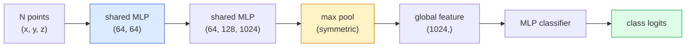

# Widzenie 3D — Chmury punktów i NeRF

> Widzenie 3D występuje w dwóch odmianach. Chmury punktów to surowe wyjście sensora. NeRF to uczone pole objętościowe. Obie odpowiadają na pytanie "co jest gdzie w przestrzeni."

**Type:** Learn + Build
**Languages:** Python
**Prerequisites:** Phase 4 Lesson 03 (CNNs), Phase 1 Lesson 12 (Tensor Operations)
**Time:** ~45 minutes

## Learning Objectives

- Odróżnić jawne (chmura punktów, siatka, woksel) i niejawne (pole odległości z sygnaturą, NeRF) reprezentacje 3D i wiedzieć, kiedy każda jest używana
- Zrozumieć sztuczkę symetrycznej funkcji PointNet, która czyni sieć neuronową niezmienniczą na permutacje nad nieuporządkowanym zbiorem punktów
- Prześledzić forward pass NeRF: rzucanie promieni, renderowanie wolumetryczne, kodowanie pozycyjne, głowa MLP gęstość+kolor
- Użyć `nerfstudio` lub `instant-ngp` do wstępnie wytrenowanej rekonstrukcji 3D z małego zestawu obrazów z pozami

## The Problem

Kamera produkuje obraz 2D. LIDAR produkuje zbiór punktów 3D bez uporządkowania. Potok structure-from-motion produkuje rzadką chmurę kluczowych punktów 3D. NeRF rekonstruuje całą scenę 3D z garści obrazów z pozami. Wszystkie te są "widzeniem", ale żaden nie wygląda jak gęsty tensor, którego chce CNN.

Widzenie 3D ma znaczenie, ponieważ prawie każde zadanie robotyczne o wysokiej wartości działa w 3D: chwytanie, omijanie przeszkód, nawigacja, okluzja AR, przechwytywanie treści 3D. Inżynier widzenia, który rozumie tylko obrazy 2D, jest zamknięty na najszybciej rosnący wycinek tej dziedziny (treści AR/VR, robotyka, stosy jazdy autonomicznej, rekonstrukcja 3D oparta na NeRF dla nieruchomości lub budownictwa).

Dwie reprezentacje dominują z różnych powodów. Chmury punktów to to, co sensory dają za darmo. NeRF i ich następcy (3D Gaussian splatting, neuralne SDF) to to, co otrzymujesz, gdy prosisz sieć neuronową o nauczenie się sceny.

## The Concept

### Chmury punktów

Chmura punktów to nieuporządkowany zbiór N punktów w R^3, opcjonalnie każdy z cechami (kolor, intensywność, normalna).

```
cloud = [
  (x1, y1, z1, r1, g1, b1),
  (x2, y2, z2, r2, g2, b2),
  ...
  (xN, yN, zN, rN, gN, bN),
]
```

Brak siatki, brak łączności. Dwie właściwości czynią to trudnym dla sieci neuronowych:

- **Niezmienniczość na permutacje** — wyjście nie może zależeć od kolejności punktów.
- **Zmienne N** — jeden model musi obsługiwać chmury o różnych rozmiarach.

PointNet (Qi i in., 2017) rozwiązał obie jednym pomysłem: zastosuj współdzielony MLP do każdego punktu, a następnie agreguj za pomocą symetrycznej funkcji (max pool). Wynikiem jest wektor o stałym rozmiarze, który nie zależy od kolejności.

```
f(P) = max_{p in P} MLP(p)
```

To jest cały rdzeń PointNet. Głębsze warianty (PointNet++, Point Transformer) dodają hierarchiczne próbkowanie i lokalną agregację, ale sztuczka symetrycznej funkcji pozostaje niezmieniona.

### Architektura PointNet



"Współdzielony MLP" oznacza, że ten sam MLP działa na każdym punkcie niezależnie. Zaimplementowany jako konwolucja 1x1 nad wymiarem punktów dla wydajności.

### Neural Radiance Fields (NeRF)

NeRF (Mildenhall i in., 2020) wziął pytanie "czy możemy zrekonstruować scenę 3D z N zdjęć?" i odpowiedział siecią neuronową, która jest sceną. Sieć mapuje `(x, y, z, kierunek_patrzenia)` na `(gęstość, kolor)`. Renderowanie nowego widoku to pętla rzucania promieni przez tę sieć.

```
NeRF MLP:  (x, y, z, theta, phi) -> (sigma, r, g, b)

To render a pixel (u, v) of a new view:
  1. Cast a ray from the camera through pixel (u, v)
  2. Sample points along the ray at distances t_1, t_2, ..., t_N
  3. Query the MLP at each point
  4. Composite the colours weighted by (1 - exp(-sigma * dt))
  5. The sum is the rendered pixel colour
```

Strata porównuje wyrenderowany piksel z pikselem prawdy naziemnej w zdjęciach treningowych. Propagacja wstecz przez krok renderowania aktualizuje MLP. Żadna prawda naziemna 3D, żadna jawna geometria — scena jest przechowywana w wagach MLP.

### Kodowanie pozycyjne w NeRF

Zwykły MLP na `(x, y, z)` nie może reprezentować szczegółów o wysokiej częstotliwości, ponieważ MLP są spektralnie uprzedzone w kierunku niskich częstotliwości. NeRF naprawia to przez kodowanie każdej współrzędnej w wektor cech Fouriera przed MLP:

```
gamma(p) = (sin(2^0 pi p), cos(2^0 pi p), sin(2^1 pi p), cos(2^1 pi p), ...)
```

Do L=10 poziomów częstotliwości. To ta sama sztuczka, której transformery używają dla pozycji, i pojawia się ponownie w warunkowaniu czasem dyfuzji (Lekcja 10). Bez tego NeRF wyglądają rozmyto.

### Renderowanie wolumetryczne

```
C(r) = sum_i T_i * (1 - exp(-sigma_i * delta_i)) * c_i

T_i  = exp(- sum_{j<i} sigma_j * delta_j)
delta_i = t_{i+1} - t_i
```

`T_i` to transmitancja — ile światła dociera do punktu i. `(1 - exp(-sigma_i * delta_i))` to nieprzezroczystość w punkcie i. `c_i` to kolor. Końcowy piksel to ważona suma wzdłuż promienia.

### Co zastąpiło NeRF

Czyste NeRF są wolne w trenowaniu (godziny) i wolne w renderowaniu (sekundy na obraz). Linia od tego czasu:

- **Instant-NGP** (2022) — kodowanie siatki haszowej zastępuje wejście pozycyjne MLP; trenuje w sekundach.
- **Mip-NeRF 360** — obsługuje nieograniczone sceny i antyaliasing.
- **3D Gaussian Splatting** (2023) — zastępuje pole objętościowe milionami 3D Gaussianów; trenuje w minutach, renderuje w czasie rzeczywistym. Obecny domyślny produkcyjny.

Prawie każdy prawdziwy produkt NeRF w 2026 to tak naprawdę 3D Gaussian splatting. Model mentalny to wciąż NeRF.

### Zbiory danych i benchmarki

- **ShapeNet** — klasyfikacja i segmentacja modeli CAD 3D jako chmur punktów.
- **ScanNet** — rzeczywiste skany wewnętrzne do segmentacji.
- **KITTI** — zewnętrzne chmury punktów LIDAR dla jazdy autonomicznej.
- **NeRF Synthetic** / **Blended MVS** — zbiory danych obrazów z pozami do syntezy widoków.
- **Mip-NeRF 360** dataset — nieograniczone rzeczywiste sceny.

## Build It

### Step 1: PointNet classifier

```python
import torch
import torch.nn as nn

class PointNet(nn.Module):
    def __init__(self, num_classes=10):
        super().__init__()
        self.mlp1 = nn.Sequential(
            nn.Conv1d(3, 64, 1),    nn.BatchNorm1d(64),   nn.ReLU(inplace=True),
            nn.Conv1d(64, 64, 1),   nn.BatchNorm1d(64),   nn.ReLU(inplace=True),
        )
        self.mlp2 = nn.Sequential(
            nn.Conv1d(64, 128, 1),  nn.BatchNorm1d(128),  nn.ReLU(inplace=True),
            nn.Conv1d(128, 1024, 1), nn.BatchNorm1d(1024), nn.ReLU(inplace=True),
        )
        self.head = nn.Sequential(
            nn.Linear(1024, 512),   nn.BatchNorm1d(512),  nn.ReLU(inplace=True),
            nn.Dropout(0.3),
            nn.Linear(512, 256),    nn.BatchNorm1d(256),  nn.ReLU(inplace=True),
            nn.Dropout(0.3),
            nn.Linear(256, num_classes),
        )

    def forward(self, x):
        # x: (N, 3, num_points) — transposed for Conv1d
        x = self.mlp1(x)
        x = self.mlp2(x)
        x = torch.max(x, dim=-1)[0]       # (N, 1024)
        return self.head(x)

pts = torch.randn(4, 3, 1024)
net = PointNet(num_classes=10)
print(f"output: {net(pts).shape}")
print(f"params: {sum(p.numel() for p in net.parameters()):,}")
```

Około 1,6M parametrów. Działa na 1024 punktach na chmurę.

### Step 2: Positional encoding

```python
def positional_encoding(x, L=10):
    """
    x: (..., D) -> (..., D * 2 * L)
    """
    freqs = 2.0 ** torch.arange(L, dtype=x.dtype, device=x.device)
    args = x.unsqueeze(-1) * freqs * 3.141592653589793
    sinc = torch.cat([args.sin(), args.cos()], dim=-1)
    return sinc.reshape(*x.shape[:-1], -1)

x = torch.randn(5, 3)
y = positional_encoding(x, L=10)
print(f"input:  {x.shape}")
print(f"encoded: {y.shape}     # (5, 60)")
```

Mnożenie przez `2^l * pi` daje progresywnie wyższe częstotliwości.

### Step 3: Tiny NeRF MLP

```python
class TinyNeRF(nn.Module):
    def __init__(self, L_pos=10, L_dir=4, hidden=128):
        super().__init__()
        self.L_pos = L_pos
        self.L_dir = L_dir
        pos_dim = 3 * 2 * L_pos
        dir_dim = 3 * 2 * L_dir
        self.trunk = nn.Sequential(
            nn.Linear(pos_dim, hidden), nn.ReLU(inplace=True),
            nn.Linear(hidden, hidden),  nn.ReLU(inplace=True),
            nn.Linear(hidden, hidden),  nn.ReLU(inplace=True),
            nn.Linear(hidden, hidden),  nn.ReLU(inplace=True),
        )
        self.sigma = nn.Linear(hidden, 1)
        self.color = nn.Sequential(
            nn.Linear(hidden + dir_dim, hidden // 2), nn.ReLU(inplace=True),
            nn.Linear(hidden // 2, 3), nn.Sigmoid(),
        )

    def forward(self, x, d):
        x_enc = positional_encoding(x, self.L_pos)
        d_enc = positional_encoding(d, self.L_dir)
        h = self.trunk(x_enc)
        sigma = torch.relu(self.sigma(h)).squeeze(-1)
        rgb = self.color(torch.cat([h, d_enc], dim=-1))
        return sigma, rgb

nerf = TinyNeRF()
x = torch.randn(128, 3)
d = torch.randn(128, 3)
s, c = nerf(x, d)
print(f"sigma: {s.shape}   rgb: {c.shape}")
```

Mały w porównaniu z oryginalnym NeRF (który ma 2 pnie MLP o głębokości 8). Wystarczający do zademonstrowania architektury.

### Step 4: Volumetric rendering along a ray

```python
def volumetric_render(sigma, rgb, t_vals):
    """
    sigma: (..., N_samples)
    rgb:   (..., N_samples, 3)
    t_vals: (N_samples,) distances along the ray
    """
    delta = torch.cat([t_vals[1:] - t_vals[:-1], torch.full_like(t_vals[:1], 1e10)])
    alpha = 1.0 - torch.exp(-sigma * delta)
    trans = torch.cumprod(torch.cat([torch.ones_like(alpha[..., :1]), 1.0 - alpha + 1e-10], dim=-1), dim=-1)[..., :-1]
    weights = alpha * trans
    rendered = (weights.unsqueeze(-1) * rgb).sum(dim=-2)
    depth = (weights * t_vals).sum(dim=-1)
    return rendered, depth, weights


N = 64
t_vals = torch.linspace(2.0, 6.0, N)
sigma = torch.rand(N) * 0.5
rgb = torch.rand(N, 3)
rendered, depth, weights = volumetric_render(sigma, rgb, t_vals)
print(f"rendered colour: {rendered.tolist()}")
print(f"depth:           {depth.item():.2f}")
```

Jeden promień, 64 próbki, złożone w pojedynczy piksel RGB i głębokość.

## Use It

Do rzeczywistej pracy:

- `nerfstudio` (Tancik i in.) — obecna biblioteka referencyjna dla NeRF / Instant-NGP / Gaussian Splatting. Linia poleceń plus przeglądarka internetowa.
- `pytorch3d` (Meta) — różniczkowalne renderowanie, narzędzia do chmur punktów, operacje na siatkach.
- `open3d` — przetwarzanie chmur punktów, rejestracja, wizualizacja.

Do wdrożenia, 3D Gaussian splatting w dużej mierze zastąpił czyste NeRF, ponieważ renderuje 100x szybciej. Jakość rekonstrukcji jest porównywalna.

## Ship It

Ta lekcja produkuje:

- `outputs/prompt-3d-task-router.md` — prompt, który kieruje do odpowiedniej reprezentacji 3D (chmura punktów, siatka, woksel, NeRF, Gaussian splat) na podstawie zadania i danych wejściowych.
- `outputs/skill-point-cloud-loader.md` — umiejętność, która pisze `Dataset` PyTorch dla plików .ply / .pcd / .xyz z poprawną normalizacją, centrowaniem i próbkowaniem punktów.

## Exercises

1. **(Easy)** Pokaż, że PointNet jest niezmienniczy na permutacje: przepuść tę samą chmurę dwa razy, raz z przetasowanymi punktami. Zweryfikuj, że wyjścia są identyczne w granicach szumu zmiennoprzecinkowego.
2. **(Medium)** Zaimplementuj minimalną funkcję generowania promieni, która dla danych parametrów wewnętrznych kamery i pozycji, produkuje początki i kierunki promieni dla każdego piksela obrazu H x W.
3. **(Hard)** Wytrenuj TinyNeRF na syntetycznym zbiorze danych wyrenderowanych widoków kolorowego sześcianu (wygenerowanych przez różniczkowalne renderowanie lub prosty ray tracer). Raportuj stratę renderowania w epoce 1, 10 i 100. W której epoce model produkuje rozpoznawalne widoki?

## Key Terms

| Term | What people say | What it actually means |
|------|----------------|----------------------|
| Point cloud | "3D points from LIDAR" | Unordered set of (x, y, z) + optional features per point |
| PointNet | "First neural net on point clouds" | Shared MLP per point + symmetric (max) pool; permutation-invariant by construction |
| NeRF | "MLP that is the scene" | Network mapping (x, y, z, dir) to (density, colour); rendered by ray casting |
| Positional encoding | "Fourier features" | Encode each coordinate into sin/cos at multiple frequencies to overcome MLP low-frequency bias |
| Volumetric rendering | "Ray integration" | Composite samples along a ray into a single pixel using transmittance and alpha |
| Instant-NGP | "Hash-grid NeRF" | Replaces NeRF's coordinate MLP with a multi-resolution hash grid; 100-1000x faster |
| 3D Gaussian splatting | "Millions of Gaussians" | Scene = collection of 3D Gaussians; renders in real time, trains in minutes |
| SDF | "Signed distance field" | Function returning signed distance to the nearest surface; another implicit representation |

## Further Reading

- [PointNet (Qi et al., 2017)](https://arxiv.org/abs/1612.00593) — klasyfikator niezmienniczy na permutacje
- [NeRF (Mildenhall et al., 2020)](https://arxiv.org/abs/2003.08934) — publikacja, która uczyniła rekonstrukcję 3D ze zdjęć problemem sieci neuronowej
- [Instant-NGP (Müller et al., 2022)](https://arxiv.org/abs/2201.05989) — siatki haszowe, 1000x przyspieszenie
- [3D Gaussian Splatting (Kerbl et al., 2023)](https://arxiv.org/abs/2308.04079) — architektura, która zastąpiła NeRF w produkcji