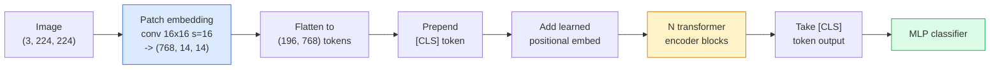

# Vision Transformers (ViT)

> Potnij obraz na łatki, traktuj każdą łatkę jako słowo, uruchom standardowy transformer. Nie oglądaj się za siebie.

**Type:** Build
**Languages:** Python
**Prerequisites:** Phase 7 Lesson 02 (Self-Attention), Phase 4 Lesson 04 (Image Classification)
**Time:** ~45 minutes

## Learning Objectives

- Zaimplementować embedding łat, uczony embedding pozycyjny, token klasy i bloki enkodera transformera od podstaw, aby zbudować minimalny ViT
- Wyjaśnić, dlaczego uważano, że ViT potrzebuje masywnych danych wstępnego trenowania, dopóki DeiT i MAE nie udowodniły inaczej
- Porównać ViT, Swin i ConvNeXt pod kątem ich priorytetów architektonicznych (brak, lokalna attention w oknie, backbone splotowy)
- Dostroić wstępnie wytrenowany ViT na małym zbiorze danych za pomocą `timm` i standardowego przepisu sonda liniowa / dostrajanie

## The Problem

Przez dekadę konwolucja była synonimem komputerowego widzenia. CNN miały silne uprzedzenia indukcyjne — lokalność, ekwiwariancję translacyjną — których, jak sądzono, nikt nie mógł zastąpić. Następnie Dosovitskiy i in. (2020) pokazali, że zwykły transformer zastosowany do spłaszczonych łat obrazu, bez żadnej maszynerii splotowej, może dorównać lub pobić najlepsze CNN w skali.

Haczykiem było "w skali." ViT na ImageNet-1k przegrywał z ResNet. ViT wstępnie wytrenowany na ImageNet-21k lub JFT-300M, a następnie dostrojony na ImageNet-1k, go pobił. Wniosek był taki, że transformerom brakowało użytecznych priorytetów, ale mogły się ich nauczyć z wystarczającej ilości danych. Późniejsze prace (DeiT, MAE, DINO) pokazały, że z odpowiednimi przepisami treningowymi — silną augmentacją, samonadzorowanym wstępnym trenowaniem, dystylacją — ViT trenują dobrze również na małych danych.

Do 2026 roku czyste CNN wciąż są konkurencyjne na urządzeniach brzegowych (ConvNeXt jest najsilniejszy), ale transformery dominują wszystko inne: segmentację (Mask2Former, SegFormer), detekcję (DETR, RT-DETR), multimodalność (CLIP, SigLIP), wideo (VideoMAE, VJEPA). Struktura bloku ViT jest tą, którą trzeba znać.

## The Concept

### Potok



Siedem kroków. Łatki -> tokeny -> attention -> klasyfikator. Każdy wariant (DeiT, Swin, ConvNeXt, wstępne trenowanie MAE) zmienia jeden lub dwa z siedmiu i resztę pozostawia bez zmian.

### Embedding łat

Pierwsza konwolucja jest sekretem. Rozmiar jądra 16, krok 16, więc obraz 224x224 staje się siatką 14x14 łat 16x16, każda rzutowana do 768-wymiarowego embeddingu. Ta pojedyncza konwolucja zarówno dzieli na łatki, jak i liniowo projektuje.

```
Input:  (3, 224, 224)
Conv (3 -> 768, k=16, s=16, no padding):
Output: (768, 14, 14)
Flatten spatial: (196, 768)
```

196 łat = 196 tokenów. Wymiar cech każdego tokena to 768 (ViT-B), 1024 (ViT-L) lub 1280 (ViT-H).

### Token klasy

Pojedynczy uczony wektor dodany na początku sekwencji:

```
tokens = [CLS; patch_1; patch_2; ...; patch_196]   shape (197, 768)
```

Po N blokach transformerowych, wyjście `[CLS]` jest globalną reprezentacją obrazu. Głowa klasyfikacji czyta tylko ten jeden wektor.

### Embedding pozycyjny

Transformery nie mają wbudowanego pojęcia pozycji przestrzennej. Dodaj uczony wektor do każdego tokena:

```
tokens = tokens + learned_pos_embedding   (also shape (197, 768))
```

Embedding jest parametrem modelu; trening gradientowy dostosowuje go do struktury obrazu 2D. Sinusoidalne alternatywy 2D istnieją, ale są rzadko używane w praktyce.

### Blok enkodera transformera

Standardowy. Self-attention z wieloma głowami, MLP, połączenia resztkowe, pre-LayerNorm.

```
x = x + MSA(LN(x))
x = x + MLP(LN(x))

MLP is two-layer with GELU: Linear(d -> 4d) -> GELU -> Linear(4d -> d)
```

ViT-B/16 układa 12 takich bloków, każdy z 12 głowami attention, łącznie 86M parametrów.

### Dlaczego pre-LN

Wczesne transformery używały post-LN (`x = LN(x + sublayer(x))`) i miały trudności z trenowaniem powyżej 6-8 warstw bez rozgrzewki. Pre-LN (`x = x + sublayer(LN(x))`) trenuje głębsze sieci stabilnie bez rozgrzewki. Każdy ViT i każdy nowoczesny LLM używa pre-LN.

### Kompromis rozmiaru łat

- Łatki 16x16 -> 196 tokenów, standard.
- Łatki 32x32 -> 49 tokenów, szybciej, ale niższa rozdzielczość.
- Łatki 8x8 -> 784 tokenów, drobniej, ale koszt attention O(n^2) skaluje się źle.

Większe łatki = mniej tokenów = szybciej, ale mniej szczegółów przestrzennych. SwinV2 używa 4x4 łat w hierarchicznych oknach.

### Przepis DeiT na trenowanie ViT na ImageNet-1k

Oryginalny ViT potrzebował JFT-300M, aby pobić CNN. DeiT (Touvron i in., 2020) wytrenował ViT-B do 81.8% top-1 na samym ImageNet-1k z czterema zmianami:

1. Ciężka augmentacja: RandAugment, Mixup, CutMix, Random Erasing.
2. Stochastic depth (losowe usuwanie całych bloków podczas treningu).
3. Powtórzona augmentacja (ten sam obraz próbkowany 3 razy na batch).
4. Dystylacja z nauczyciela CNN (opcjonalnie, podnosi dokładność dalej).

Każdy nowoczesny przepis treningowy ViT wywodzi się z DeiT.

### Swin vs ConvNeXt

- **Swin** (Liu i in., 2021) — attention w oknach. Każdy blok uwzględnia w lokalnym oknie; naprzemienne bloki przesuwają okno, aby wymieszać informacje między oknami. Przywraca prior lokalności podobny do CNN, zachowując operator attention.
- **ConvNeXt** (Liu i in., 2022) — przeprojektowana CNN, która dopasowuje wybory architektoniczne Swin (konwolucje depthwise, LayerNorm, GELU, odwrócone wąskie gardło). Pokazał, że różnica to nie "attention vs konwolucja", ale "nowoczesny przepis treningowy + architektura."

W 2026 roku ConvNeXt-V2 i Swin-V2 są oba produkcyjne; właściwy wybór zależy od stosu wnioskowania (ConvNeXt lepiej kompiluje się na brzegu) i korpusu wstępnego trenowania.

### Wstępne trenowanie MAE

Masked Autoencoder (He i in., 2022): zamaskuj 75% łat losowo, wytrenuj enkoder do przetwarzania tylko widocznych 25%, wytrenuj mały dekoder do rekonstrukcji zamaskowanych łat z wyjścia enkodera. Po wstępnym trenowaniu odrzuć dekoder i dostrój enkoder.

MAE czyni ViT trenowalnym na samym ImageNet-1k, osiąga SOTA i jest obecnie domyślnym samonadzorowanym przepisem.

## Build It

### Step 1: Patch embedding

```python
import torch
import torch.nn as nn

class PatchEmbedding(nn.Module):
    def __init__(self, in_channels=3, patch_size=16, dim=192, image_size=64):
        super().__init__()
        assert image_size % patch_size == 0
        self.proj = nn.Conv2d(in_channels, dim, kernel_size=patch_size, stride=patch_size)
        num_patches = (image_size // patch_size) ** 2
        self.num_patches = num_patches

    def forward(self, x):
        x = self.proj(x)
        return x.flatten(2).transpose(1, 2)
```

Jedna konwolucja, jedno spłaszczenie, jedna transpozycja. To cały krok obraz-do-tokenów.

### Step 2: Transformer block

Pre-LN, self-attention z wieloma głowami, MLP z GELU, połączenia resztkowe.

```python
class Block(nn.Module):
    def __init__(self, dim, num_heads, mlp_ratio=4, dropout=0.0):
        super().__init__()
        self.ln1 = nn.LayerNorm(dim)
        self.attn = nn.MultiheadAttention(dim, num_heads, dropout=dropout, batch_first=True)
        self.ln2 = nn.LayerNorm(dim)
        self.mlp = nn.Sequential(
            nn.Linear(dim, dim * mlp_ratio),
            nn.GELU(),
            nn.Dropout(dropout),
            nn.Linear(dim * mlp_ratio, dim),
            nn.Dropout(dropout),
        )

    def forward(self, x):
        a, _ = self.attn(self.ln1(x), self.ln1(x), self.ln1(x), need_weights=False)
        x = x + a
        x = x + self.mlp(self.ln2(x))
        return x
```

`nn.MultiheadAttention` obsługuje dzielenie na głowy, skalowany iloczyn skalarny i projekcję wyjściową. `batch_first=True`, aby kształty były `(N, seq, dim)`.

### Step 3: The ViT

```python
class ViT(nn.Module):
    def __init__(self, image_size=64, patch_size=16, in_channels=3,
                 num_classes=10, dim=192, depth=6, num_heads=3, mlp_ratio=4):
        super().__init__()
        self.patch = PatchEmbedding(in_channels, patch_size, dim, image_size)
        num_patches = self.patch.num_patches
        self.cls_token = nn.Parameter(torch.zeros(1, 1, dim))
        self.pos_embed = nn.Parameter(torch.zeros(1, num_patches + 1, dim))
        self.blocks = nn.ModuleList([
            Block(dim, num_heads, mlp_ratio) for _ in range(depth)
        ])
        self.ln = nn.LayerNorm(dim)
        self.head = nn.Linear(dim, num_classes)
        nn.init.trunc_normal_(self.pos_embed, std=0.02)
        nn.init.trunc_normal_(self.cls_token, std=0.02)

    def forward(self, x):
        x = self.patch(x)
        cls = self.cls_token.expand(x.size(0), -1, -1)
        x = torch.cat([cls, x], dim=1)
        x = x + self.pos_embed
        for blk in self.blocks:
            x = blk(x)
        x = self.ln(x[:, 0])
        return self.head(x)

vit = ViT(image_size=64, patch_size=16, num_classes=10, dim=192, depth=6, num_heads=3)
x = torch.randn(2, 3, 64, 64)
print(f"output: {vit(x).shape}")
print(f"params: {sum(p.numel() for p in vit.parameters()):,}")
```

Około 2.8M parametrów — mały ViT wykonalny na CPU. Prawdziwy ViT-B to 86M; ta sama definicja klasy z `dim=768, depth=12, num_heads=12`.

### Step 4: Sanity check — single image inference

```python
logits = vit(torch.randn(1, 3, 64, 64))
print(f"logits: {logits}")
print(f"probs:  {logits.softmax(-1)}")
```

Powinno działać bez błędu. Prawdopodobieństwa sumują się do 1.

## Use It

`timm` dostarcza każdy wariant ViT z wstępnie wytrenowanymi wagami ImageNet. Jedna linia:

```python
import timm

model = timm.create_model("vit_base_patch16_224", pretrained=True, num_classes=10)
```

`timm` jest domyślną produkcyjną dla vision transformerów w 2026. Obsługuje ViT, DeiT, Swin, Swin-V2, ConvNeXt, ConvNeXt-V2, MaxViT, MViT, EfficientFormer i dziesiątki innych pod tym samym API.

Do pracy multimodalnej (obraz + tekst), `transformers` dostarcza CLIP, SigLIP, BLIP-2, LLaVA. Enkoder obrazu we wszystkich z nich jest wariantem ViT.

## Ship It

Ta lekcja produkuje:

- `outputs/prompt-vit-vs-cnn-picker.md` — prompt, który wybiera między ViT, ConvNeXt lub Swin na podstawie rozmiaru zbioru danych, obliczeń i stosu wnioskowania.
- `outputs/skill-vit-patch-and-pos-embed-inspector.md` — umiejętność, która weryfikuje, czy kształty embeddingu łat i embeddingu pozycyjnego ViT pasują do oczekiwanej długości sekwencji modelu, łapiąc najczęstsze błędy przenoszenia.

## Exercises

1. **(Easy)** Wydrukuj kształty każdego tensora pośredniego dla forward pass przez mały ViT powyżej. Potwierdź: wejście `(N, 3, 64, 64)` -> łatki `(N, 16, 192)` -> z CLS `(N, 17, 192)` -> wejście klasyfikatora `(N, 192)` -> wyjście `(N, num_classes)`.
2. **(Medium)** Dostrój wstępnie wytrenowany `timm` ViT-S/16 na syntetycznym zbiorze CIFAR z Lekcji 4. Porównaj z dostrajaniem ResNet-18 na tych samych danych. Raportuj czas treningu i końcową dokładność.
3. **(Hard)** Zaimplementuj wstępne trenowanie MAE dla małego ViT: zamaskuj 75% łat, wytrenuj enkoder + mały dekoder do rekonstrukcji zamaskowanych łat. Oceń dokładność sondy liniowej na syntetycznych danych przed i po wstępnym trenowaniu.

## Key Terms

| Term | What people say | What it actually means |
|------|----------------|----------------------|
| Patch embedding | "The first conv" | A conv with kernel size = stride = patch size; turns the image into a grid of token embeddings |
| Class token | "[CLS]" | A learned vector prepended to the token sequence; its final output is the global image representation |
| Positional embedding | "Learned pos" | A learned vector added to every token so the transformer knows where each patch came from |
| Pre-LN | "LayerNorm before sublayer" | The stable transformer variant: `x + sublayer(LN(x))` instead of `LN(x + sublayer(x))` |
| Multi-head attention | "Parallel attention" | Standard transformer attention split into num_heads independent subspaces, concatenated afterwards |
| ViT-B/16 | "Base, patch 16" | The canonical size: dim=768, depth=12, heads=12, patch_size=16, image=224; ~86M params |
| DeiT | "Data-efficient ViT" | ViT trained on ImageNet-1k alone with strong augmentation; proved large pretraining datasets are not strictly required |
| MAE | "Masked autoencoder" | Self-supervised pretraining: mask 75% of patches, reconstruct; the dominant ViT pretraining recipe |

## Further Reading

- [An Image is Worth 16x16 Words (Dosovitskiy et al., 2020)](https://arxiv.org/abs/2010.11929) — publikacja ViT
- [DeiT: Data-efficient Image Transformers (Touvron et al., 2020)](https://arxiv.org/abs/2012.12877) — jak trenować ViT na samym ImageNet-1k
- [Masked Autoencoders are Scalable Vision Learners (He et al., 2022)](https://arxiv.org/abs/2111.06377) — wstępne trenowanie MAE
- [timm documentation](https://huggingface.co/docs/timm) — źródło dla każdego vision transformera, którego użyjesz w produkcji