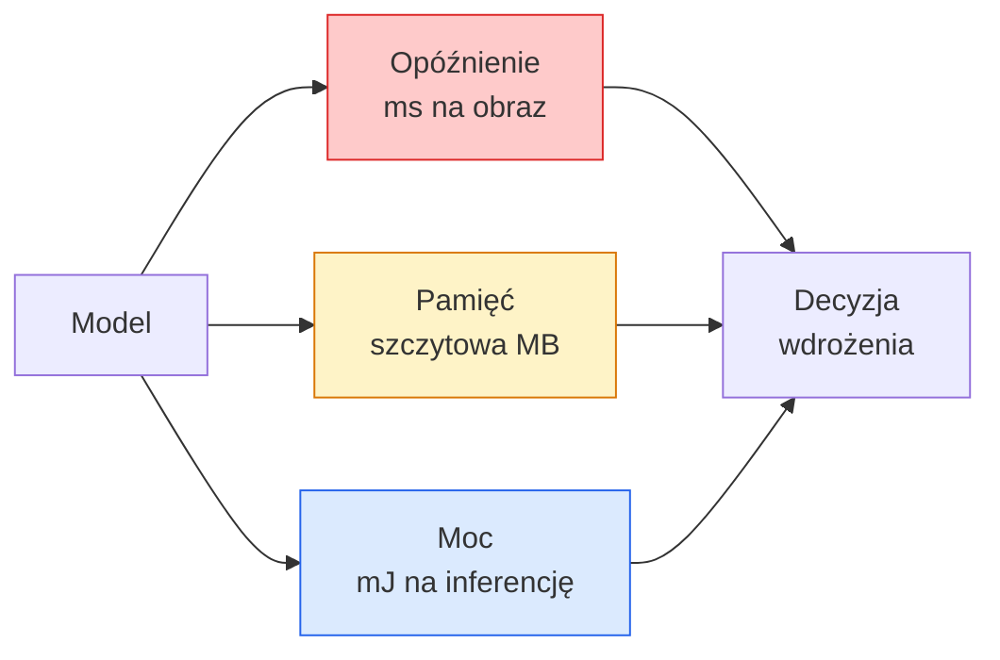

# Widzenie w Czasie Rzeczywistym — Wdrożenie na Urządzeniach Brzegowych

> Inferencja brzegowa to sztuka uruchomienia modelu o dokładności 90% z szybkością 30 klatek na sekundę na urządzeniu z 2 GB RAM. Każdy punkt procentowy dokładności jest wymieniany na milisekundy opóźnienia.

**Type:** Learn + Build
**Languages:** Python
**Prerequisites:** Phase 4 Lesson 04 (Image Classification), Phase 10 Lesson 11 (Quantization)
**Time:** ~75 minut

## Cele Kształcenia

- Zmierzyć opóźnienie inferencji, szczytowe zużycie pamięci i przepustowość dla dowolnego modelu PyTorch oraz odczytać kompromis FLOPs / parametry / opóźnienie
- Skwantyzować model wizyjny do INT8 przy użyciu kwantyzacji po treningu PyTorch i zweryfikować utratę dokładności < 1%
- Wyeksportować do ONNX i skompilować z ONNX Runtime lub TensorRT; wymienić trzy najczęstsze błędy eksportu i ich poprawki
- Wyjaśnić, kiedy wybrać MobileNetV3, EfficientNet-Lite, ConvNeXt-Tiny lub MobileViT dla ograniczeń urządzenia brzegowego

## Problem

Model wizyjny z czasów treningu to potwór zmiennoprzecinkowy. 100M parametrów, 10 GFLOPów na przejście w przód, 2 GB VRAM. Nic z tego nie mieści się w telefonie, jednostce infotainment samochodu, kamerze przemysłowej czy dronie. Wdrożenie systemu wizyjnego oznacza dopasowanie tych samych predykcji do budżetu 100 razy mniejszego.

Trzy pokrętła wykonują większość pracy: wybór modelu (mniejsza architektura z tym samym przepisem), kwantyzacja (INT8 zamiast FP32) i środowisko uruchomieniowe inferencji (ONNX Runtime, TensorRT, Core ML, TFLite). Odpowiednie ich ustawienie to różnica między demem działającym na stacji roboczej a produktem działającym na module kamery za 30 dolarów.

Ta lekcja najpierw ustanawia dyscyplinę pomiarową (nie możesz optymalizować tego, czego nie możesz zmierzyć), a następnie omawia trzy pokrętła. Celem nie jest nauczenie się każdego środowiska brzegowego, ale poznanie, jakie dźwignie istnieją i jak zweryfikować, że każda działa zgodnie z oczekiwaniami.

## Koncepcja

### Trzy budżety



- **Opóźnienie**: p50, p95, p99. Uśrednianie tylko p50 ukrywa zachowanie ogonów, które ma znaczenie dla systemów czasu rzeczywistego.
- **Szczytowa pamięć**: maksimum, jakie kiedykolwiek widzi urządzenie, a nie średnia stanu ustalonego. Ma to znaczenie, ponieważ błędy OOM są krytyczne na platformach wbudowanych.
- **Moc / energia**: milidżule na inferencję na urządzeniu zasilanym bateryjnie. Często aproksymowane przez wykorzystanie CPU/GPU * czas.

Tabela (model, opóźnienie, pamięć, dokładność) to podstawa decyzji o wdrożeniu brzegowym. Każda komórka jest mierzona na docelowym urządzeniu, a nie na stacji roboczej.

### Dyscyplina pomiarowa

Trzy zasady, których powinien przestrzegać każdy profil brzegowy:

1. **Rozgrzej** model 5-10 pustymi przejściami w przód przed pomiarem. Zimne pamięci podręczne i kompilacja JIT dają niereprezentatywne pierwsze liczby.
2. **Zsynchronizuj** obciążenia GPU za pomocą `torch.cuda.synchronize()` przed i po mierzonym bloku. Bez tego mierzysz wysyłanie jąder, a nie ich wykonanie.
3. **Ustal rozmiary wejściowe** na docelową rozdzielczość. Opóźnienie przy 224x224 nie jest opóźnieniem przy 512x512.

### FLOPs jako przybliżenie

FLOPs (operacje zmiennoprzecinkowe na inferencję) to tanie, niezależne od urządzenia przybliżenie opóźnienia. Przydatne do porównywania architektur, mylące jako bezwzględny czas ścienny. Model o 10% większej liczbie FLOPs może być w praktyce 2 razy szybszy, ponieważ używa operacji przyjaznych sprzętowo (konwolucje depthwise kompilują się dobrze, duże konwolucje 7x7 nie).

Zasada: używaj FLOPs do poszukiwania architektury, używaj opóźnienia na urządzeniu do decyzji wdrożeniowych.

### Kwantyzacja w jednym akapicie

Zastąp wagi i aktywacje FP32 na INT8. Rozmiar modelu spada 4x, przepustowość pamięci spada 4x, obliczenia spadają 2-4x na sprzęcie z jądrami INT8 (każdy nowoczesny SoC mobilny, każda karta NVIDIA GPU z Tensor Cores). Utrata dokładności w zadaniach wizyjnych wynosi typowo 0.1-1 punktu procentowego przy statycznej kwantyzacji po treningu.

Rodzaje:

- **Dynamiczna** — kwantyzacja wag do INT8, aktywacje obliczane w FP. Łatwa, niewielkie przyspieszenie.
- **Statyczna (po treningu)** — kwantyzacja wag + kalibracja zakresów aktywacji na małym zbiorze kalibracyjnym. Znacznie szybsza niż dynamiczna.
- **Trening świadomy kwantyzacji (QAT)** — symulacja kwantyzacji podczas treningu, aby model się do niej dostosował. Najlepsza dokładność, wymaga oznakowanych danych.

Dla widzenia, statyczna kwantyzacja po treningu daje 95% korzyści przy 5% wysiłku. Używaj QAT tylko wtedy, gdy utrata dokładności po PTQ jest nie do zaakceptowania.

### Przycinanie i destylacja

- **Przycinanie** — usuwanie nieistotnych wag (oparte na magnitudzie) lub kanałów (strukturalne). Działa dobrze na modelach przestymulowanych; mniej przydatne w już kompaktowych architekturach.
- **Destylacja** — trenowanie małego ucznia do naśladowania logitów dużego nauczyciela. Często odzyskuje większość dokładności utraconej przez zmniejszenie modelu. Standard dla produkcyjnych modeli brzegowych.

### Środowiska uruchomieniowe inferencji

- **PyTorch eager** — wolne, nie do wdrożenia. Używaj tylko do rozwoju.
- **TorchScript** — przestarzałe. Zastąpione przez `torch.compile` i eksport ONNX.
- **ONNX Runtime** — neutralne środowisko. CPU, CUDA, CoreML, TensorRT, OpenVINO — wszystkie mają dostawców ONNX. Zacznij tutaj.
- **TensorRT** — kompilator NVIDIA. Najlepsze opóźnienie na kartach NVIDIA GPU (stacja robocza i Jetson). Integruje się z ONNX Runtime lub działa samodzielnie.
- **Core ML** — środowisko Apple dla iOS/macOS. Wymaga `.mlmodel` lub `.mlpackage`.
- **TFLite** — środowisko Google dla Android/ARM. Wymaga `.tflite`.
- **OpenVINO** — środowisko Intel dla CPU/VPU. Wymaga `.xml` + `.bin`.

W praktyce: eksport PyTorch -> ONNX -> wybierz środowisko dla platformy docelowej. ONNX jest językiem uniwersalnym.

### Wybór architektury brzegowej

| Budżet | Model | Dlaczego |
|--------|-------|----------|
| < 3M parametrów | MobileNetV3-Small | Kompiluje się wszędzie, dobry baseline |
| 3-10M | EfficientNet-Lite-B0 | Najlepsza dokładność na parametr w TFLite |
| 10-20M | ConvNeXt-Tiny | Najlepsza dokładność-na-parametr, przyjazny CPU |
| 20-30M | MobileViT-S lub EfficientViT | Transformer z dokładnością ImageNet |
| 30-80M | Swin-V2-Tiny | Jeśli stos obsługuje attention okienkową |

Skwantyzuj wszystkie te modele do INT8, chyba że masz konkretny powód, by tego nie robić.

```figure
cnn-param-count
```

## Zbuduj To

### Krok 1: Poprawny pomiar opóźnienia

```python
import time
import torch

def measure_latency(model, input_shape, device="cpu", warmup=10, iters=50):
    model = model.to(device).eval()
    x = torch.randn(input_shape, device=device)
    with torch.no_grad():
        for _ in range(warmup):
            model(x)
        if device == "cuda":
            torch.cuda.synchronize()
        times = []
        for _ in range(iters):
            if device == "cuda":
                torch.cuda.synchronize()
            t0 = time.perf_counter()
            model(x)
            if device == "cuda":
                torch.cuda.synchronize()
            times.append((time.perf_counter() - t0) * 1000)
    times.sort()
    return {
        "p50_ms": times[len(times) // 2],
        "p95_ms": times[int(len(times) * 0.95)],
        "p99_ms": times[int(len(times) * 0.99)],
        "mean_ms": sum(times) / len(times),
    }
```

Rozgrzej, synchronizuj, używaj `time.perf_counter()`. Raportuj percentyle, nie tylko średnią.

### Krok 2: Liczba parametrów i FLOPów

```python
def parameter_count(model):
    return sum(p.numel() for p in model.parameters())

def flops_estimate(model, input_shape):
    """
    Przybliżona liczba FLOPów dla modelu tylko z konwolucjami/liniowymi.
    Do użytku produkcyjnego użyj `fvcore` lub `ptflops`.
    """
    total = 0
    def conv_hook(m, inp, out):
        nonlocal total
        c_out, c_in, kh, kw = m.weight.shape
        h, w = out.shape[-2:]
        total += 2 * c_in * c_out * kh * kw * h * w
    def linear_hook(m, inp, out):
        nonlocal total
        total += 2 * m.in_features * m.out_features
    hooks = []
    for m in model.modules():
        if isinstance(m, torch.nn.Conv2d):
            hooks.append(m.register_forward_hook(conv_hook))
        elif isinstance(m, torch.nn.Linear):
            hooks.append(m.register_forward_hook(linear_hook))
    model.eval()
    with torch.no_grad():
        model(torch.randn(input_shape))
    for h in hooks:
        h.remove()
    return total
```

W rzeczywistych projektach używaj `fvcore.nn.FlopCountAnalysis` lub `ptflops`; obsługują one poprawnie każdy typ modułu.

### Krok 3: Statyczna kwantyzacja po treningu

```python
def quantise_ptq(model, calibration_loader, backend="x86"):
    import torch.ao.quantization as tq
    model = model.eval().cpu()
    model.qconfig = tq.get_default_qconfig(backend)
    tq.prepare(model, inplace=True)
    with torch.no_grad():
        for x, _ in calibration_loader:
            model(x)
    tq.convert(model, inplace=True)
    return model
```

Trzy kroki: skonfiguruj, przygotuj (wstaw obserwatory), skalibruj na prawdziwych danych, konwertuj (połącz + skwantyzuj). Wymaga połączenia modelu (`Conv -> BN -> ReLU` -> `ConvBnReLU`), którym zajmuje się `torch.ao.quantization.fuse_modules`.

### Krok 4: Eksport do ONNX

```python
def export_onnx(model, sample_input, path="model.onnx"):
    model = model.eval()
    torch.onnx.export(
        model,
        sample_input,
        path,
        input_names=["input"],
        output_names=["output"],
        dynamic_axes={"input": {0: "batch"}, "output": {0: "batch"}},
        opset_version=17,
    )
    return path
```

`opset_version=17` to bezpieczna wartość domyślna w 2026 roku. `dynamic_axes` pozwala uruchomić model ONNX z dowolnym rozmiarem batcha.

### Krok 5: Benchmark i porównanie reżimów

```python
import torch.nn as nn
from torchvision.models import mobilenet_v3_small

def compare_regimes():
    model = mobilenet_v3_small(weights=None, num_classes=10)
    params = parameter_count(model)
    flops = flops_estimate(model, (1, 3, 224, 224))
    lat_fp32 = measure_latency(model, (1, 3, 224, 224), device="cpu")
    print(f"FP32 MobileNetV3-Small: {params:,} params  {flops/1e9:.2f} GFLOPs  "
          f"p50={lat_fp32['p50_ms']:.2f}ms  p95={lat_fp32['p95_ms']:.2f}ms")
```

Uruchom tę samą funkcję dla `resnet50`, `efficientnet_v2_s` i `convnext_tiny`, a otrzymasz tabelę porównawczą potrzebną do decyzji wdrożeniowej.

## Użyj Tego

Produkcyjne stosy zbiegają się do jednej z trzech ścieżek:

- **Web / serverless**: PyTorch -> ONNX -> ONNX Runtime (CPU lub CUDA provider). Najłatwiejsze, wystarczająco dobre dla większości.
- **NVIDIA edge (Jetson, GPU server)**: PyTorch -> ONNX -> TensorRT. Najlepsze opóźnienie, największy wysiłek inżynieryjny.
- **Mobile**: PyTorch -> ONNX -> Core ML (iOS) lub TFLite (Android). Skwantyzuj przed eksportem.

Do pomiarów: `torch-tb-profiler`, `nvprof` / `nsys` i Instruments na macOS dają analizę warstwa po warstwie. `benchmark_app` (OpenVINO) i `trtexec` (TensorRT) dają samodzielne liczby CLI.

## Dostarcz To

Ta lekcja produkuje:

- `outputs/prompt-edge-deployment-planner.md` — prompt, który wybiera szkielet, strategię kwantyzacji i środowisko uruchomieniowe dla danego urządzenia docelowego i SLA opóźnienia.
- `outputs/skill-latency-profiler.md` — umiejętność, która pisze kompletny skrypt do benchmarkowania opóźnienia z rozgrzewką, synchronizacją, percentylami i śledzeniem pamięci.

## Ćwiczenia

1. **(Łatwe)** Zmierz opóźnienie p50 dla `resnet18`, `mobilenet_v3_small`, `efficientnet_v2_s` i `convnext_tiny` przy 224x224 na CPU. Raportuj tabelę i wskaż, która architektura ma najlepszą dokładność-na-ms.
2. **(Średnie)** Zastosuj statyczną kwantyzację po treningu do `mobilenet_v3_small`. Raportuj opóźnienie FP32 vs INT8 i utratę dokładności na wydzielonej podzbiorze CIFAR-10 lub podobnym.
3. **(Trudne)** Eksportuj `convnext_tiny` do ONNX, uruchom przez `onnxruntime` z `CPUExecutionProvider` i porównaj opóźnienie z baseline'em PyTorch eager. Wskaż pierwszą warstwę, w której ONNX Runtime jest szybszy i wyjaśnij dlaczego.

## Kluczowe Pojęcia

| Termin | Co ludzie mówią | Co faktycznie oznacza |
|--------|-----------------|----------------------|
| Opóźnienie | "Jak szybko" | Czas od wejścia do wyjścia; percentyle p50/p95/p99, nie średnia |
| FLOPs | "Rozmiar modelu" | Operacje zmiennoprzecinkowe na przejście w przód; przybliżony koszt obliczeniowy |
| Kwantyzacja INT8 | "8-bit" | Zastąpienie wag/aktywacji FP32 8-bitowymi liczbami całkowitymi; ~4x mniejsze, 2-4x szybsze |
| PTQ | "Kwantyzacja po treningu" | Kwantyzacja wytrenowanego modelu bez ponownego treningu; łatwe, zwykle wystarczające |
| QAT | "Trening świadomy kwantyzacji" | Symulacja kwantyzacji podczas treningu; najlepsza dokładność, wymaga oznakowanych danych |
| ONNX | "Neutralny format" | Format wymiany modeli obsługiwany przez każde główne środowisko inferencji |
| TensorRT | "Kompilator NVIDIA" | Kompiluje ONNX do zoptymalizowanego silnika dla kart NVIDIA GPU |
| Destylacja | "Nauczyciel -> uczeń" | Trenowanie małego modelu do naśladowania logitów dużego modelu; odzyskuje większość utraconej dokładności |

## Dalsza Lektura

- [EfficientNet (Tan & Le, 2019)](https://arxiv.org/abs/1905.11946) — skalowanie złożone dla wydajnych architektur
- [MobileNetV3 (Howard et al., 2019)](https://arxiv.org/abs/1905.02244) — architektura mobilna z h-swish i squeeze-excite
- [A Practical Guide to TensorRT Optimization (NVIDIA)](https://developer.nvidia.com/blog/accelerating-model-inference-with-tensorrt-tips-and-best-practices-for-pytorch-users/) — jak faktycznie uzyskać liczby przepustowości z artykułu
- [ONNX Runtime docs](https://onnxruntime.ai/docs/) — kwantyzacja, optymalizacja grafu, wybór dostawcy