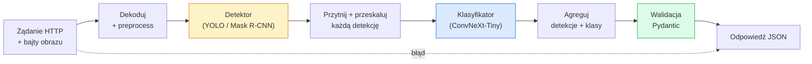

# Zbuduj Kompletny Pipeline Wizyjny — Capstone

> Produkcyjny system wizyjny to łańcuch modeli i reguł zszytych kontraktami danych. Elementy są już w tej fazie; capstone łączy je od końca do końca.

**Type:** Build
**Languages:** Python
**Prerequisites:** Phase 4 Lessons 01-15
**Time:** ~120 minut

## Cele Kształcenia

- Zaprojektować produkcyjny pipeline wizyjny, który wykrywa obiekty, klasyfikuje je i emituje strukturalny JSON — z obsługą każdej ścieżki awaryjnej
- Podłączyć detektor (Mask R-CNN lub YOLO), klasyfikator (ConvNeXt-Tiny) i kontrakt danych (Pydantic) do jednej usługi
- Przebenchmarkować pipeline od końca do końca i zidentyfikować pierwsze wąskie gardło (zazwyczaj preprocessing, potem detektor)
- Dostarczyć minimalną usługę FastAPI, która przyjmuje przesłany obraz, uruchamia pipeline i zwraca detekcje z klasyfikacjami

## Problem

Pojedyncze modele wizyjne są użyteczne; produkty wizyjne to ich łańcuchy. Audyt półki sklepowej to detektor plus klasyfikator produktów plus pipeline OCR do cen. Autonomiczna jazda to detektor 2D plus detektor 3D plus segmenter plus tracker plus planista. Preskryning medyczny to segmenter plus klasyfikator regionów plus interfejs klinicysty.

Łączenie tych łańcuchów to część oddzielająca prototyp ML od produktu. Każdy interfejs między modelami to nowe miejsce na błędy. Każda transformacja współrzędnych, każda normalizacja, każde skalowanie maski to cichy potencjalny błąd. Pipeline jest tak silny, jak jego najsłabszy interfejs.

Ten capstone ustanawia minimalny wykonalny pipeline: detekcja + klasyfikacja + strukturalne wyjście + warstwa serwująca. Wszystko inne w Fazie 4 wchodzi w ten szkielet: zamień Mask R-CNN na YOLOv8, dodaj głowicę OCR, dodaj gałąź segmentacji, dodaj tracker. Architektura jest stabilna; elementy są wymienne.

## Koncepcja

### Pipeline



Siedem etapów. Dwa etapy modelowe są kosztowne; pięć pozostałych etapów to miejsce, gdzie żyją błędy.

### Kontrakty danych z Pydantic

Każda granica modelu staje się obiektem z typowaniem. To zamienia ciche awarie w głośne.

```
Detection(
    box: tuple[float, float, float, float],   # (x1, y1, x2, y2), piksele bezwzględne
    score: float,                              # [0, 1]
    class_id: int,                             # z mapy etykiet detektora
    mask: Optional[list[list[int]]],           # zakodowany RLE jeśli obecny
)

PipelineResult(
    image_id: str,
    detections: list[Detection],
    classifications: list[Classification],
    inference_ms: float,
)
```

Gdy detektor zwraca ramki w `(cx, cy, w, h)` zamiast `(x1, y1, x2, y2)`, walidacja Pydantic zawodzi na granicy i dowiadujesz się natychmiast, zamiast debugować downstreamowe przycinanie, które po cichu zwraca puste regiony.

### Gdzie idzie opóźnienie

Trzy prawdy obowiązują w prawie każdym pipeline wizyjnym:

1. **Preprocessing jest często największym pojedynczym blokiem.** Dekodowanie JPEG, konwersja przestrzeni kolorów, skalowanie — to wszystko jest związane z CPU i łatwe do przeoczenia.
2. **Detektor dominuje w czasie GPU.** 70-90% czasu GPU to przejście w przód detektora.
3. **Postprocessing (NMS, kodowanie/dekodowanie RLE) jest tani na GPU, drogi na CPU.** Zawsze profiluj na rzeczywistej platformie docelowej.

Znajomość rozkładu zamienia optymalizację w priorytetyzowaną listę.

### Sposoby awarii

- **Puste detekcje** — zwróć pustą listę, nie ulegaj awarii. Loguj.
- **Ramki poza zakresem** — przytnij do rozmiaru obrazu przed przycinaniem.
- **Małe przycięcia** — pomiń klasyfikację dla ramek mniejszych niż minimalne wejście klasyfikatora.
- **Uszkodzone przesłanie** — odpowiedź 400 z konkretnym kodem błędu, nie 500.
- **Błąd ładowania modelu** — zakończ awarią przy starcie usługi, nie przy pierwszym żądaniu.

Produkcyjny pipeline obsługuje każdy z tych przypadków bez pisania ogólnego `try/except`, które ukrywa awarię. Każda awaria ma nazwany kod i odpowiedź.

### Batchowanie

Produkcyjna usługa obsługuje wielu klientów. Batchowanie detekcji i klasyfikacji między żądaniami mnoży przepustowość. Kompromis: dodatkowe opóźnienie z oczekiwania na wypełnienie batcha. Typowa konfiguracja: zbieraj żądania przez maksymalnie 20ms, batchnij razem, przetwarzaj, dystrybuuj odpowiedzi. `torchserve` i `triton` robią to natywnie; małe usługi z przewidywalnym obciążeniem piszą własny mikrobatcher.

## Zbuduj To

### Krok 1: Kontrakty danych

```python
from pydantic import BaseModel, Field
from typing import List, Optional, Tuple

class Detection(BaseModel):
    box: Tuple[float, float, float, float]
    score: float = Field(ge=0, le=1)
    class_id: int = Field(ge=0)
    mask_rle: Optional[str] = None


class Classification(BaseModel):
    detection_index: int
    class_id: int
    class_name: str
    score: float = Field(ge=0, le=1)


class PipelineResult(BaseModel):
    image_id: str
    detections: List[Detection]
    classifications: List[Classification]
    inference_ms: float
```

Pięć sekund kodu oszczędza godzinę debugowania w każdym poważnym pipeline.

### Krok 2: Minimalna klasa Pipeline

```python
import time
import numpy as np
import torch
from PIL import Image

class VisionPipeline:
    def __init__(self, detector, classifier, class_names,
                 device="cpu", min_crop=32):
        self.detector = detector.to(device).eval()
        self.classifier = classifier.to(device).eval()
        self.class_names = class_names
        self.device = device
        self.min_crop = min_crop

    def preprocess(self, image):
        """
        image: PIL.Image lub np.ndarray (H, W, 3) uint8
        zwraca: tensor CHW float na urządzeniu
        """
        if isinstance(image, Image.Image):
            image = np.asarray(image.convert("RGB"))
        tensor = torch.from_numpy(image).permute(2, 0, 1).float() / 255.0
        return tensor.to(self.device)

    @torch.no_grad()
    def detect(self, image_tensor):
        return self.detector([image_tensor])[0]

    @torch.no_grad()
    def classify(self, crops):
        if len(crops) == 0:
            return []
        batch = torch.stack(crops).to(self.device)
        logits = self.classifier(batch)
        probs = logits.softmax(-1)
        scores, cls = probs.max(-1)
        return list(zip(cls.tolist(), scores.tolist()))

    def run(self, image, image_id="anonymous"):
        t0 = time.perf_counter()
        tensor = self.preprocess(image)
        det = self.detect(tensor)

        crops = []
        detections = []
        valid_indices = []
        for i, (box, score, cls) in enumerate(zip(det["boxes"], det["scores"], det["labels"])):
            x1, y1, x2, y2 = [max(0, int(b)) for b in box.tolist()]
            x2 = min(x2, tensor.shape[-1])
            y2 = min(y2, tensor.shape[-2])
            detections.append(Detection(
                box=(x1, y1, x2, y2),
                score=float(score),
                class_id=int(cls),
            ))
            if (x2 - x1) < self.min_crop or (y2 - y1) < self.min_crop:
                continue
            crop = tensor[:, y1:y2, x1:x2]
            crop = torch.nn.functional.interpolate(
                crop.unsqueeze(0),
                size=(224, 224),
                mode="bilinear",
                align_corners=False,
            )[0]
            crops.append(crop)
            valid_indices.append(i)

        class_preds = self.classify(crops)

        classifications = []
        for valid_idx, (cls_id, cls_score) in zip(valid_indices, class_preds):
            classifications.append(Classification(
                detection_index=valid_idx,
                class_id=int(cls_id),
                class_name=self.class_names[cls_id],
                score=float(cls_score),
            ))

        return PipelineResult(
            image_id=image_id,
            detections=detections,
            classifications=classifications,
            inference_ms=(time.perf_counter() - t0) * 1000,
        )
```

Każdy interfejs jest typowany. Każda ścieżka awaryjna ma konkretną decyzję obsługi.

### Krok 3: Podłącz detektor i klasyfikator

```python
from torchvision.models.detection import maskrcnn_resnet50_fpn_v2
from torchvision.models import convnext_tiny

# Użyj wag wytrenowanych na ImageNet dla realistycznego pipeline bez treningu
detector = maskrcnn_resnet50_fpn_v2(weights="DEFAULT")
classifier = convnext_tiny(weights="DEFAULT")
class_names = [f"imagenet_class_{i}" for i in range(1000)]

pipe = VisionPipeline(detector, classifier, class_names)

# Test dymny z syntetycznym obrazem
test_image = (np.random.rand(400, 600, 3) * 255).astype(np.uint8)
result = pipe.run(test_image, image_id="demo")
print(result.model_dump_json(indent=2)[:500])
```

### Krok 4: Usługa FastAPI

```python
from fastapi import FastAPI, UploadFile, HTTPException
from io import BytesIO

app = FastAPI()
pipe = None  # inicjalizowany przy starcie

@app.on_event("startup")
def load():
    global pipe
    detector = maskrcnn_resnet50_fpn_v2(weights="DEFAULT").eval()
    classifier = convnext_tiny(weights="DEFAULT").eval()
    pipe = VisionPipeline(detector, classifier, class_names=[f"c{i}" for i in range(1000)])

@app.post("/detect")
async def detect_endpoint(file: UploadFile):
    if file.content_type not in {"image/jpeg", "image/png", "image/webp"}:
        raise HTTPException(status_code=400, detail="unsupported image type")
    data = await file.read()
    try:
        img = Image.open(BytesIO(data)).convert("RGB")
    except Exception:
        raise HTTPException(status_code=400, detail="cannot decode image")
    result = pipe.run(img, image_id=file.filename or "upload")
    return result.model_dump()
```

Uruchom z `uvicorn main:app --host 0.0.0.0 --port 8000`. Przetestuj z `curl -F 'file=@dog.jpg' http://localhost:8000/detect`.

### Krok 5: Benchmark pipeline

```python
import time

def benchmark(pipe, num_runs=20, image_size=(400, 600)):
    img = (np.random.rand(*image_size, 3) * 255).astype(np.uint8)
    pipe.run(img)  # rozgrzewka

    stages = {"preprocess": [], "detect": [], "classify": [], "total": []}
    for _ in range(num_runs):
        t0 = time.perf_counter()
        tensor = pipe.preprocess(img)
        t1 = time.perf_counter()
        det = pipe.detect(tensor)
        t2 = time.perf_counter()
        crops = []
        for box in det["boxes"]:
            x1, y1, x2, y2 = [max(0, int(b)) for b in box.tolist()]
            x2 = min(x2, tensor.shape[-1])
            y2 = min(y2, tensor.shape[-2])
            if (x2 - x1) >= pipe.min_crop and (y2 - y1) >= pipe.min_crop:
                crop = tensor[:, y1:y2, x1:x2]
                crop = torch.nn.functional.interpolate(
                    crop.unsqueeze(0), size=(224, 224), mode="bilinear", align_corners=False
                )[0]
                crops.append(crop)
        pipe.classify(crops)
        t3 = time.perf_counter()
        stages["preprocess"].append((t1 - t0) * 1000)
        stages["detect"].append((t2 - t1) * 1000)
        stages["classify"].append((t3 - t2) * 1000)
        stages["total"].append((t3 - t0) * 1000)

    for stage, times in stages.items():
        times.sort()
        print(f"{stage:12s}  p50={times[len(times)//2]:7.1f} ms  p95={times[int(len(times)*0.95)]:7.1f} ms")
```

Typowe wyjście na CPU: preprocess ~3 ms, detect 300-500 ms, classify 20-40 ms, total 350-550 ms. Na GPU detect zajmuje 20-40 ms, a preprocess i classify zaczynają bardziej liczyć się relatywnie.

## Użyj Tego

Szablony produkcyjne zbiegają się do tej samej struktury, plus:

- **Wersjonowanie modeli** — zawsze loguj nazwę modelu i hash wag w odpowiedzi.
- **Identyfikatory trace na żądanie** — loguj czasy każdego etapu dla każdego żądania, aby móc korelować wolne odpowiedzi z etapami.
- **Ścieżka awaryjna** — jeśli klasyfikator przekroczy limit czasu, zwróć detekcje bez klasyfikacji, zamiast zawodzić całe żądanie.
- **Filtry bezpieczeństwa** — filtry NSFW / PII uruchamiane po klasyfikacji, przed opuszczeniem usługi przez odpowiedź.
- **Endpunkt batchowy** — `/detect_batch` przyjmujący listę URL-i obrazów do przetwarzania zbiorczego.

Do serwowania produkcyjnego, `torchserve`, `Triton Inference Server` i `BentoML` obsługują batchowanie, wersjonowanie, metryki i health checki od razu. Uruchamianie `FastAPI` bezpośrednio jest w porządku dla prototypów i małych produktów.

## Dostarcz To

Ta lekcja produkuje:

- `outputs/prompt-vision-service-shape-reviewer.md` — prompt, który recenzuje kod usługi wizyjnej pod kątem naruszeń kontraktu/kształtu odpowiedzi i wskazuje pierwszy krytyczny błąd.
- `outputs/skill-pipeline-budget-planner.md` — umiejętność, która dla docelowego opóźnienia i przepustowości przydziela budżet czasowy każdemu etapowi pipeline i wskazuje, który etap pierwszy przekroczy budżet.

## Ćwiczenia

1. **(Łatwe)** Uruchom pipeline na 10 obrazach z dowolnego otwartego zestawu danych. Raportuj średni czas na etap i rozkład liczby detekcji na obraz.
2. **(Średnie)** Dodaj pole wyjściowe maski do `Detection` i zakoduj je jako RLE. Zweryfikuj, że JSON pozostaje poniżej 1MB nawet dla obrazu z 10 obiektami.
3. **(Trudne)** Dodaj mikrobatcher przed klasyfikatorem: zbieraj przycięcia przez maksymalnie 10 ms, klasyfikuj wszystkie w jednym wywołaniu GPU, zwróć wyniki na żądanie. Zmierz wzrost przepustowości przy 5 równoczesnych żądaniach na sekundę i dodane opóźnienie.

## Kluczowe Pojęcia

| Termin | Co ludzie mówią | Co faktycznie oznacza |
|--------|-----------------|----------------------|
| Pipeline | "System" | Uporządkowany łańcuch kroków preprocessingu, inferencji i postprocessingu z typowanym interfejsem między każdą parą |
| Kontrakt danych | "Schemat" | Definicje Pydantic / dataclass, którym podlega wejście i wyjście każdego etapu; wyłapuje błędy integracji na granicy |
| Preprocessing | "Przed modelem" | Dekodowanie, konwersja kolorów, skalowanie, normalizacja; zwykle największy pożeracz czasu CPU |
| Postprocessing | "Po modelu" | NMS, skalowanie maski, progowanie, kodowanie RLE; tani na GPU, drogi na CPU |
| Mikrobatcher | "Zbierz potem prześlij" | Agregator czekający ustalone okno czasowe na wiele żądań, uruchamiający pojedyncze batchnione przejście w przód |
| Identyfikator trace | "Identyfikator żądania" | Identyfikator na żądanie logowany na każdym etapie, aby wolne żądania można było śledzić od końca do końca |
| Kod awarii | "Nazwany błąd" | Konkretny kod błędu na klasę awarii zamiast ogólnego 500; umożliwia logikę ponawiania po stronie klienta |
| Health check | "Sonda gotowości" | Tani endpunkt raportujący, czy usługa może odpowiadać; loadbalancery polegają na tym |

## Dalsza Lektura

- [Full Stack Deep Learning — Deploying Models](https://fullstackdeeplearning.com/course/2022/lecture-5-deployment/) — kanoniczny przegląd produkcyjnego wdrażania ML
- [BentoML docs](https://docs.bentoml.com) — framework serwujący z batchowaniem, wersjonowaniem i metrykami
- [torchserve docs](https://pytorch.org/serve/) — oficjalna biblioteka serwująca PyTorch
- [NVIDIA Triton Inference Server](https://developer.nvidia.com/triton-inference-server) — serwowanie wysokiej przepustowości z batchowaniem i wsparciem wielu modeli