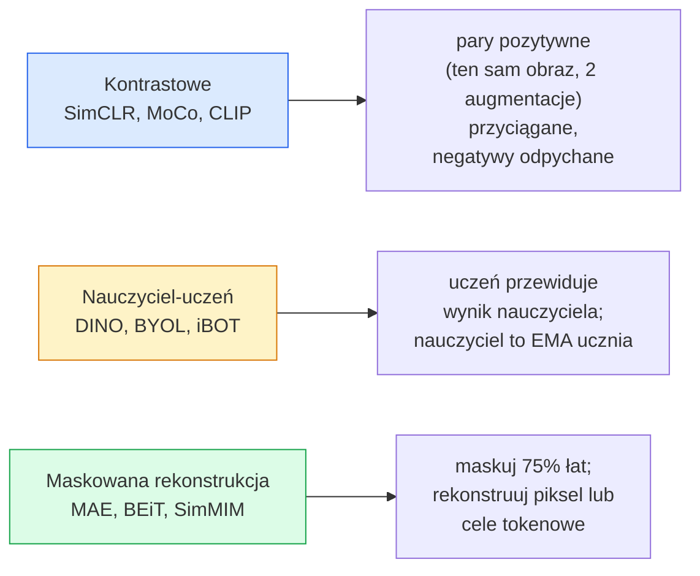

# Samonadzorowane Widzenie — SimCLR, DINO, MAE

> Etykiety są wąskim gardłem nadzorowanego widzenia. Pretrening samonadzorowany usuwa je: naucz się cech wizualnych z 100M nieoznakowanych obrazów, dostrój na 10 tysiącach oznakowanych.

**Type:** Learn + Build
**Languages:** Python
**Prerequisites:** Phase 4 Lesson 04 (Image Classification), Phase 4 Lesson 14 (ViT)
**Time:** ~75 minut

## Cele Kształcenia

- Prześledzić trzy główne rodziny samonadzorowane — kontrastową (SimCLR), nauczyciel-uczeń (DINO), maskowaną rekonstrukcję (MAE) — i określić, co każda optymalizuje
- Zaimplementować stratę InfoNCE od zera i wyjaśnić, dlaczego batch 512 działa, a batch 32 zawodzi
- Wyjaśnić, dlaczego współczynnik maskowania MAE wynoszący 75% nie jest arbitralny i jak różni się od 15% BERTa dla tekstu
- Użyć checkpointów DINOv2 lub MAE ImageNet do liniowego sondowania i zerokadrowego wyszukiwania

## Problem

Nadzorowany ImageNet ma 1.3M oznakowanych obrazów, których koszt adnotacji szacuje się na 10 milionów dolarów. Medyczne i przemysłowe zbiory danych są mniejsze i jeszcze droższe do oznakowania. Każdy zespół wizyjny pyta: czy możemy pretrenować na tanich nieoznakowanych danych — klatkach YouTube, przeszukaniach sieci, nagraniach z kamer, skanach satelitarnych — a następnie dostroić na małym oznakowanym zbiorze?

Uczenie samonadzorowane jest odpowiedzią. Nowoczesny samonadzorowany ViT wytrenowany na LAION lub JFT osiąga lub przewyższa nadzorowaną dokładność ImageNet po dostrojeniu. Transferuje się też lepiej do downstreamowych zadań (detekcja, segmentacja, głębokość) niż nadzorowany pretrening. DINOv2 (Meta, 2023) i MAE (Meta, 2022) są obecnie produkcyjnymi domyślnymi rozwiązaniami dla transferowalnych cech wizyjnych.

Zmiana koncepcyjna polega na tym, że zadanie pretekstowe — to, do czego model jest trenowany — nie musi być zadaniem downstreamowym. Liczy się to, że zmusza model do nauczenia się użytecznych cech. Przewidywanie koloru obrazów w skali szarości, obracanie obrazów i proszenie modelu o klasyfikację obrotu, maskowanie łat i ich rekonstrukcja — wszystko to działało. Trzy podejścia, które skalują się, to uczenie kontrastowe, destylacja nauczyciel-uczeń i maskowana rekonstrukcja.

## Koncepcja

### Trzy rodziny



### Uczenie kontrastowe (SimCLR)

Weź jeden obraz, zastosuj dwie losowe augmentacje, uzyskaj dwa widoki. Przepuść oba przez ten sam enkoder plus głowicę projekcyjną. Minimalizuj stratę, która mówi "te dwie embeddingi powinny być blisko" i "ten embedding powinien być daleko od embeddingów każdego innego obrazu w batchu."

```
Strata dla pary pozytywnej (z_i, z_j) wśród 2N widoków na batch:

   L_ij = -log( exp(sim(z_i, z_j) / tau) / sum_k w batch \ {i} exp(sim(z_i, z_k) / tau) )

sim = podobieństwo cosinusowe
tau = temperatura (0.1 standardowo)
```

To jest strata InfoNCE. Wymaga wielu negatywów na jeden pozytyw, więc rozmiar batcha ma znaczenie — SimCLR potrzebuje 512-8192. MoCo wprowadziło kolejkę momentum poprzednich batchy, aby odseparować liczbę negatywów od rozmiaru batcha.

### Nauczyciel-uczeń (DINO)

Dwie sieci o tej samej architekturze: uczeń i nauczyciel. Nauczyciel to wykładniczo średnia ruchoma (EMA) wag ucznia. Oba widzą augmentowane widoki obrazu. Wynik ucznia jest trenowany, aby dopasować się do nauczyciela — bez jawnych negatywów.

```
loss = CE( uczeń_wyjście(widok_1),  nauczyciel_wyjście(widok_2) )
     + CE( uczeń_wyjście(widok_2),  nauczyciel_wyjście(widok_1) )

nauczyciel_wagi = m * nauczyciel_wagi + (1 - m) * uczeń_wagi   (m ≈ 0.996)
```

Dlaczego nie zapada się do "przewidywania stałej": wynik nauczyciela jest centrowany (odejmij średnią na wymiar) i wyostrzany (podziel przez małą temperaturę). Centrowanie zapobiega dominacji jednego wymiaru; wyostrzanie zapobiega zapadnięciu się wyniku do jednorodnego.

DINO to to, co DINOv2 skaluje, na 142M starannie wyselekcjonowanych obrazach. Wynikające z tego cechy to obecny SOTA dla zerokadrowego wyszukiwania wizualnego i gęstej predykcji.

### Maskowana rekonstrukcja (MAE)

Zamaskuj 75% łat wejścia ViT. Przepuść tylko widoczne 25% przez enkoder. Mały dekoder otrzymuje wynik enkodera plus tokeny maski w zamaskowanych pozycjach i jest trenowany do rekonstrukcji pikseli zamaskowanych łat.

```
Enkoder:  widoczne 25% łat -> cechy
Dekoder:  cechy + tokeny maski w zamaskowanych pozycjach -> zrekonstruowane piksele
Strata:   MSE między zrekonstruowanymi a oryginalnymi pikselami tylko na zamaskowanych łatach
```

Kluczowe decyzje projektowe, które sprawiają, że MAE działa:

- **75% współczynnik maskowania** — wysoki. Zmusza enkoder do uczenia się cech semantycznych; rekonstrukcja 25% byłaby prawie trywialna (sąsiednie piksele są tak skorelowane, że CNN poradziłoby sobie doskonale).
- **Asymetryczny enkoder/dekoder** — duży enkoder ViT widzi tylko widoczne łaty; mały dekoder (8-warstwowy, 512-wymiarowy) zajmuje się rekonstrukcją. 3x szybszy pretrening niż naiwny BEiT.
- **Cel rekonstrukcji w przestrzeni pikseli** — prostszy niż tokenizowany cel BEiTa i działa lepiej na ViT.

Po pretreningu odrzuć dekoder. Enkoder jest ekstraktorem cech.

### Dlaczego 75%, a nie 15%

BERT maskuje 15% tokenów. MAE maskuje 75%. Różnica to gęstość informacji.

- Język naturalny ma wysoką entropię na token. Przewidywanie 15% tokenów jest wciąż trudne, ponieważ każda zamaskowana pozycja ma wiele prawdopodobnych uzupełnień.
- Łaty obrazu mają niską entropię — niezamaskowane sąsiedztwo często determinuje piksele zamaskowanej łaty prawie dokładnie. Aby wymusić semantyczne zrozumienie, trzeba maskować agresywnie.

75% jest wystarczająco wysokie, aby prosta ekstrapolacja przestrzenna nie mogła rozwiązać zadania; enkoder musi reprezentować treść obrazu.

### Ewaluacja przez liniową sondę

Po samonadzorowanym pretreningu standardową ewaluacją jest **sonda liniowa**: zamroź enkoder, wytrenuj pojedynczy liniowy klasyfikator na górze na etykietach ImageNet. Raportuje dokładność top-1.

- SimCLR ResNet-50: ~71% (2020)
- DINO ViT-S/16: ~77% (2021)
- MAE ViT-L/16: ~76% (2022)
- DINOv2 ViT-g/14: ~86% (2023)

Sonda liniowa to czysta miara jakości cech; dostrojenie zwykle dodaje 2-5 punktów, ale miesza też efekt przenauczania głowicy.

## Zbuduj To

### Krok 1: Pipeline augmentacji dwuwidokowej

```python
import torch
import torchvision.transforms as T

two_view_train = lambda: T.Compose([
    T.RandomResizedCrop(96, scale=(0.2, 1.0)),
    T.RandomHorizontalFlip(),
    T.ColorJitter(0.4, 0.4, 0.4, 0.1),
    T.RandomGrayscale(p=0.2),
    T.ToTensor(),
])


class TwoViewDataset(torch.utils.data.Dataset):
    def __init__(self, base):
        self.base = base
        self.aug = two_view_train()

    def __len__(self):
        return len(self.base)

    def __getitem__(self, i):
        img, _ = self.base[i]
        v1 = self.aug(img)
        v2 = self.aug(img)
        return v1, v2
```

Każdy __getitem__ zwraca dwa augmentowane widoki tego samego obrazu; etykiety nie są potrzebne.

### Krok 2: Strata InfoNCE

```python
import torch.nn.functional as F

def info_nce(z1, z2, tau=0.1):
    """
    z1, z2: (N, D) embeddingi sparowanych widoków znormalizowane L2
    """
    N, D = z1.shape
    z = torch.cat([z1, z2], dim=0)  # (2N, D)
    sim = z @ z.T / tau              # (2N, 2N)

    mask = torch.eye(2 * N, dtype=torch.bool, device=z.device)
    sim = sim.masked_fill(mask, float("-inf"))

    targets = torch.cat([torch.arange(N, 2 * N), torch.arange(0, N)]).to(z.device)
    return F.cross_entropy(sim, targets)
```

Normalizuj embeddingi L2 przed wywołaniem. `tau=0.1` to domyślna wartość SimCLR; niższa wartość wyostrza stratę i wymaga więcej negatywów.

### Krok 3: Test poprawności InfoNCE

```python
z1 = F.normalize(torch.randn(16, 32), dim=-1)
z2 = z1.clone()
loss_same = info_nce(z1, z2, tau=0.1).item()
z2_random = F.normalize(torch.randn(16, 32), dim=-1)
loss_random = info_nce(z1, z2_random, tau=0.1).item()
print(f"InfoNCE z identycznymi parami:  {loss_same:.3f}")
print(f"InfoNCE z losowymi parami:      {loss_random:.3f}")
```

Identyczne pary powinny dać niską stratę (blisko 0 dla dużego batcha i niskiej temperatury). Losowe pary powinny dać log(2N-1) = ~log(31) = ~3.4 dla batcha 16 par.

### Krok 4: Maskowanie w stylu MAE

```python
def random_mask_indices(num_patches, mask_ratio=0.75, seed=0):
    g = torch.Generator().manual_seed(seed)
    n_keep = int(num_patches * (1 - mask_ratio))
    perm = torch.randperm(num_patches, generator=g)
    visible = perm[:n_keep]
    masked = perm[n_keep:]
    return visible.sort().values, masked.sort().values


num_patches = 196
visible, masked = random_mask_indices(num_patches, mask_ratio=0.75)
print(f"visible: {len(visible)} / {num_patches}")
print(f"masked:  {len(masked)} / {num_patches}")
```

Proste, szybkie i deterministyczne dla danego ziarna. Prawdziwe implementacje MAE batchują to i utrzymują maski na próbkę.

## Użyj Tego

DINOv2 jest standardem produkcyjnym w 2026:

```python
import torch
from transformers import AutoImageProcessor, AutoModel

processor = AutoImageProcessor.from_pretrained("facebook/dinov2-base")
model = AutoModel.from_pretrained("facebook/dinov2-base")
model.eval()

# Embeddingi na obraz do zerokadrowego wyszukiwania
with torch.no_grad():
    inputs = processor(images=[pil_image], return_tensors="pt")
    outputs = model(**inputs)
    embedding = outputs.last_hidden_state[:, 0]  # token CLS
```

Wynikowy 768-wymiarowy embedding to szkielet nowoczesnego wyszukiwania obrazów, gęstej korespondencji i zerokadrowych pipeline transferowych. Dostrojenie do zadania downstreamowego rzadko potrzebuje więcej niż liniowej głowicy.

Dla embeddingów obraz-tekst, SigLIP lub OpenCLIP są odpowiednikiem; dla dostrajania w stylu MAE, repozytorium `timm` dostarcza każdy checkpoint MAE.

## Dostarcz To

Ta lekcja produkuje:

- `outputs/prompt-ssl-pretraining-picker.md` — prompt wybierający SimCLR / MAE / DINOv2 dla danego rozmiaru zbioru danych, mocy obliczeniowej i zadania downstreamowego.
- `outputs/skill-linear-probe-runner.md` — umiejętność pisząca ewaluację sondy liniowej dla dowolnego zamrożonego enkodera i oznakowanego zbioru danych.

## Ćwiczenia

1. **(Łatwe)** Zweryfikuj, że strata InfoNCE spada, gdy zmniejszasz temperaturę dla dobrze dopasowanych embeddingów i rośnie, gdy zmniejszasz temperaturę dla losowych embeddingów. Stwórz wykres `tau in [0.05, 0.1, 0.2, 0.5]` vs strata.
2. **(Średnie)** Zaimplementuj bufor centrowania w stylu DINO. Pokaż, że bez centrowania uczeń zapada się do stałego wektora w ciągu kilku epok.
3. **(Trudne)** Wytrenuj MAE na CIFAR-100 używając TinyUNet z Lekcji 10 jako szkieletu. Raportuj dokładność sondy liniowej po 10, 50 i 200 epokach. Pokaż, że sonda liniowa z pretreningiem MAE przewyższa sondę liniową trenowaną od zera na tym samym 1000-obrazowym podzbiorze.

## Kluczowe Pojęcia

| Termin | Co ludzie mówią | Co faktycznie oznacza |
|--------|-----------------|----------------------|
| Samonadzorowane | "Bez etykiet" | Zadanie pretekstowe, które produkuje użyteczne reprezentacje z nieoznakowanych danych |
| Zadanie pretekstowe | "Fałszywe zadanie" | Cel używany podczas SSL (rekonstrukcja łat, dopasowanie widoków); odrzucany po pretreningu |
| Sonda liniowa | "Zamrożony enkoder + głowica liniowa" | Standardowa ewaluacja SSL: trenuj tylko liniowy klasyfikator na zamrożonych cechach |
| InfoNCE | "Strata kontrastowa" | softmax na podobieństwach cosinusowych; para pozytywna to klasa docelowa, wszystkie inne to negatywy |
| Nauczyciel EMA | "Nauczyciel średniej ruchomej" | Nauczyciel, którego wagi są wykładniczą średnią ruchomą ucznia; używany przez BYOL, MoCo, DINO |
| Współczynnik maskowania | "% ukrytych łat" | Frakcja łat maskowanych podczas MAE; 75% dla widzenia, 15% dla tekstu |
| Zapadnięcie reprezentacji | "Stałe wyjście" | Awaria SSL, gdy enkoder wyprowadza stały wektor dla wszystkich wejść; zapobiegane przez centrowanie, wyostrzanie lub negatywy |
| DINOv2 | "Produkcyjny szkielet SSL" | Samonadzorowany ViT Meta z 2023; najsilniejsze ogólnego przeznaczenia cechy obrazu w 2026 |

## Dalsza Lektura

- [SimCLR (Chen et al., 2020)](https://arxiv.org/abs/2002.05709) — referencja uczenia kontrastowego
- [DINO (Caron et al., 2021)](https://arxiv.org/abs/2104.14294) — nauczyciel-uczeń z momentum, centrowaniem, wyostrzaniem
- [MAE (He et al., 2022)](https://arxiv.org/abs/2111.06377) — maskowany autoenkoder pretrening dla ViT
- [DINOv2 (Oquab et al., 2023)](https://arxiv.org/abs/2304.07193) — skalowanie samonadzorowanego ViT do produkcyjnych cech