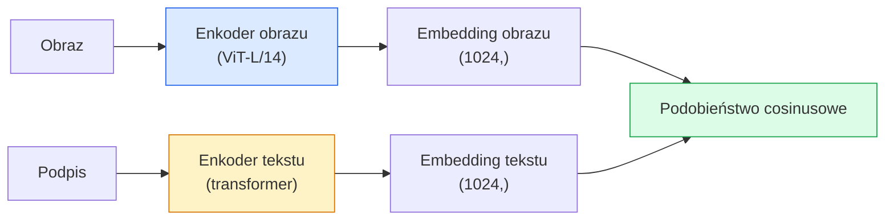

# Widzenie Otwartego Słownika — CLIP

> Trenuj enkoder obrazu i enkoder tekstu razem, aby pasujące pary (obraz, podpis) lądowały w tym samym punkcie wspólnej przestrzeni. To cały trik.

**Type:** Build + Use
**Languages:** Python
**Prerequisites:** Phase 4 Lesson 14 (ViT), Phase 4 Lesson 17 (Self-Supervised)
**Time:** ~45 minut

## Cele Kształcenia

- Wyjaśnić architekturę dwóch wież CLIP i kontrastowy cel treningowy
- Użyć wytrenowanego CLIP (lub SigLIP) do zerokadrowej klasyfikacji bez jakiegokolwiek treningu specyficznego dla zadania
- Zaimplementować zerokadrową klasyfikację od zera: zakoduj prompt klas, oblicz podobieństwo cosinusowe, weź argmax
- Rozróżnić CLIP, SigLIP, OpenCLIP i LLaVA/LLaMA-vision — do czego każdy służy w 2026

## Problem

Tradycyjne klasyfikatory mają zamknięty słownik: model ImageNet z 1000 klasami może przewidzieć tylko 1000 etykiet. Każda nowa kategoria wymaga oznakowanych danych i przenauczonej głowicy.

CLIP (Radford et al., OpenAI 2021) pokazał, że trenowanie na 400M parach (obraz, podpis) zebranych z sieci produkuje model, który może klasyfikować do dowolnego zestawu kategorii w czasie inferencji, opisanych czysto w języku naturalnym. Podajesz nową klasę, pisząc zdanie.

Ta zdolność — transfer zerokadrowy — jest powodem, dla którego każdy nowoczesny system wizyjny zaczyna od checkpointa z rodziny CLIP. Detekcja (Grounding DINO, OWL-ViT), segmentacja (CLIPSeg, SAM), wyszukiwanie, moderacja treści, VLM i generowanie tekstu-na-obraz wszystko opiera się na wspólnych embeddingach w stylu CLIP.

## Koncepcja

### Dwie wieże



Oba enkodery kończą się liniową projekcją do tego samego wymiaru embeddingu (512 dla CLIP-B/32, 1024 dla CLIP-L/14). Normalizuj L2 i oblicz podobieństwo cosinusowe.

### Cel

Dla batcha N par (obraz, podpis), zbuduj macierz podobieństwa NxN. Trenuj oba enkodery, aby przekątna (pasujące pary) miała wysokie podobieństwo, a poza przekątną (niepasujące) niskie.

```
sim_matrix = embeddingi_obrazu @ embeddingi_tekstu.T / tau

loss_i2t = cross_entropy(sim_matrix,       targets=arange(N))
loss_t2i = cross_entropy(sim_matrix.T,     targets=arange(N))
loss = (loss_i2t + loss_t2i) / 2
```

Symetryczne, ponieważ zarówno wyszukiwanie obraz-do-tekstu, jak i tekst-do-obrazu powinno działać. `tau` (temperatura) jest zazwyczaj uczonym parametrem skalarnym, inicjalizowanym na 0.07.

### SigLIP: lepsza strata

SigLIP (Zhai et al., 2023) zastąpił softmax sigmoidem na parę:

```
loss = średnia po parach z log(1 + exp(-y_ij * sim_ij))
y_ij = +1 jeśli pasuje, -1 w przeciwnym razie
```

Strata na parę usuwa normalizację na poziomie batcha, której wymaga CLIP. SigLIP trenuje lepiej przy małych rozmiarach batcha i dorównuje lub przewyższa CLIP przy równych danych.

### Klasyfikacja zerokadrowa

Mając wytrenowany CLIP:

1. Dla każdej klasy, skomponuj prompt: "a photo of a {class}".
2. Zakoduj wszystkie prompt klas enkoderem tekstu -> `T` kształt (C, d).
3. Zakoduj obraz testowy -> `I` kształt (1, d).
4. Podobieństwo = `I @ T.T` kształt (1, C).
5. Argmax -> przewidywana klasa.

Inżynieria promptów ma znaczenie. OpenAI opublikowało 80 szablonów promptów dla ImageNet ("a photo of a {}", "a blurry photo of a {}", "a sketch of a {}", ...). Uśrednij embeddingi wszystkich szablonów na klasę dla dodatkowych 1-3% dokładności top-1.

### Gdzie modele w stylu CLIP są używane w 2026

- **Klasyfikacja zerokadrowa** — bezpośrednie użycie.
- **Wyszukiwanie obrazów** — zakoduj wszystkie obrazy raz, osadź zapytanie w czasie inferencji.
- **Detekcja warunkowana tekstem** — Grounding DINO, OWL-ViT owijają wieżę tekstową CLIP wokół detektora.
- **Segmentacja warunkowana tekstem** — CLIPSeg; SAM używa promptów tekstowych przez CLIP.
- **VLM** — LLaVA, Qwen-VL, InternVL łączą enkoder wizyjny z rodziny CLIP z LLM.
- **Generowanie tekstu-na-obraz** — Stable Diffusion, DALL-E 3 warunkują się na embeddingach tekstowych CLIP.

Gdy masz wspólną przestrzeń embeddingu, każde zadanie wizja+język staje się obliczaniem odległości.

## Zbuduj To

### Krok 1: Mały model dwóch wież

Prawdziwy CLIP to ViT + transformer. W tej lekcji wieże to małe MLP na wstępnie wyodrębnionych cechach, aby sygnał treningowy był widoczny na CPU.

```python
import torch
import torch.nn as nn
import torch.nn.functional as F


class TwoTower(nn.Module):
    def __init__(self, img_in=128, txt_in=64, emb=64):
        super().__init__()
        self.image_proj = nn.Sequential(nn.Linear(img_in, 128), nn.ReLU(), nn.Linear(128, emb))
        self.text_proj = nn.Sequential(nn.Linear(txt_in, 128), nn.ReLU(), nn.Linear(128, emb))
        self.logit_scale = nn.Parameter(torch.ones([]) * 2.6592)  # ln(1/0.07)

    def forward(self, img_feats, txt_feats):
        i = F.normalize(self.image_proj(img_feats), dim=-1)
        t = F.normalize(self.text_proj(txt_feats), dim=-1)
        return i, t, self.logit_scale.exp()
```

Dwie projekcje, wyjście wspólnego wymiaru, uczona temperatura. Ten sam kształt co prawdziwe API CLIP.

### Krok 2: Strata kontrastowa

```python
def clip_loss(image_emb, text_emb, logit_scale):
    N = image_emb.size(0)
    sim = logit_scale * image_emb @ text_emb.T
    targets = torch.arange(N, device=sim.device)
    l_i = F.cross_entropy(sim, targets)
    l_t = F.cross_entropy(sim.T, targets)
    return (l_i + l_t) / 2
```

Symetryczna. Wyższa `logit_scale` = ostrzejszy softmax = większa pewność, ale ryzyko niestabilności.

### Krok 3: Klasyfikator zerokadrowy

```python
@torch.no_grad()
def zero_shot_classify(model, image_feats, class_text_feats, class_names):
    """
    image_feats:      (N, img_in)
    class_text_feats: (C, txt_in)   jeden uśredniony embedding na klasę
    """
    i = F.normalize(model.image_proj(image_feats), dim=-1)
    t = F.normalize(model.text_proj(class_text_feats), dim=-1)
    sim = i @ t.T
    pred = sim.argmax(dim=-1)
    return [class_names[p] for p in pred.tolist()]
```

Jedna linia na krok. To jest dokładna zerokadrowa procedura używana z produkcyjnym checkpointem CLIP.

### Krok 4: Test poprawności

```python
torch.manual_seed(0)
model = TwoTower()

img = torch.randn(8, 128)
txt = torch.randn(8, 64)
i, t, scale = model(img, txt)
loss = clip_loss(i, t, scale)
print(f"batch size: {i.size(0)}   loss: {loss.item():.3f}")
```

Strata powinna być bliska `log(N) = log(8) = 2.08` dla losowo zainicjalizowanego modelu — symetryczny cel entropii krzyżowej, gdy żadna struktura nie jest jeszcze nauczona.

## Użyj Tego

OpenCLIP jest domyślnym rozwiązaniem społeczności w 2026:

```python
import open_clip
import torch
from PIL import Image

model, _, preprocess = open_clip.create_model_and_transforms("ViT-B-32", pretrained="laion2b_s34b_b79k")
tokenizer = open_clip.get_tokenizer("ViT-B-32")

image = preprocess(Image.open("dog.jpg")).unsqueeze(0)
text = tokenizer(["a photo of a dog", "a photo of a cat", "a photo of a car"])

with torch.no_grad():
    image_features = model.encode_image(image)
    text_features = model.encode_text(text)
    image_features = image_features / image_features.norm(dim=-1, keepdim=True)
    text_features = text_features / text_features.norm(dim=-1, keepdim=True)
    probs = (100.0 * image_features @ text_features.T).softmax(dim=-1)

print(probs)
```

SigLIP jest nowszy, trenuje lepiej przy małych skalach i jest preferowany do nowych prac: `google/siglip-base-patch16-224`. Hugging Face dostarcza oba.

## Dostarcz To

Ta lekcja produkuje:

- `outputs/prompt-zero-shot-class-picker.md` — prompt projektujący szablony klas dla zerokadrowego CLIP dla danej listy klas i domeny.
- `outputs/skill-image-text-retriever.md` — umiejętność budująca indeks embeddingów obrazów z dowolnym checkpointem CLIP, obsługująca zapytania przez tekst i przez obraz.

## Ćwiczenia

1. **(Łatwe)** Użyj wytrenowanego OpenCLIP ViT-B/32 i wykonaj zerokadrową klasyfikację na CIFAR-10 z zestawem 80 szablonów promptów. Raportuj dokładność top-1; powinna wynosić około 85-90%.
2. **(Średnie)** Porównaj pojedynczy szablon ("a photo of a {}") vs uśrednione embeddingi z 80 szablonów na tym samym zadaniu CIFAR-10. Określ ilościowo różnicę i wyjaśnij, dlaczego szablony pomagają.
3. **(Trudne)** Zbuduj zerokadrowy indeks wyszukiwania obrazów: osadź 1000 obrazów z CLIP, zbuduj indeks FAISS, zapytaj z opisem w języku naturalnym. Raportuj recall@K wyszukiwania dla 20 wstrzymanych zapytań napisanych ręcznie.

## Kluczowe Pojęcia

| Termin | Co ludzie mówią | Co faktycznie oznacza |
|--------|-----------------|----------------------|
| Dwie wieże | "Podwójny enkoder" | Osobne enkodery obrazu i tekstu kończące się głowicą projekcyjną wspólnego wymiaru |
| Zerokadrowy | "Bez treningu specyficznego dla zadania" | Klasyfikuj do klas opisanych tylko tekstem w czasie inferencji; bez dotykania etykiet |
| Temperatura / logit_scale | "tau" | Uczony skalar skalujący macierz podobieństwa przed softmaxem |
| Szablon promptu | "A photo of a {}" | Otoczka w języku naturalnym wokół nazw klas; uśrednianie wielu szablonów zwiększa dokładność zerokadrową |
| CLIP | "Model obraz+tekst" | Model OpenAI z 2021; słownictwo dziedziny w 2026 |
| SigLIP | "Sigmodowy CLIP" | Zamienia softmax na sigmoid na parę; trenuje lepiej przy małych batchach |
| OpenCLIP | "Otwarta reprodukcja" | Warianty CLIP trenowane przez społeczność na LAION; produkcyjny standard dla otwartych pipeline |
| VLM | "Model wizyjno-językowy" | Enkoder z rodziny CLIP plus LLM, trenowany do odpowiadania na pytania o obrazy |

## Dalsza Lektura

- [CLIP: Learning Transferable Visual Models from Natural Language Supervision (Radford et al., 2021)](https://arxiv.org/abs/2103.00020)
- [SigLIP: Sigmoid Loss for Language-Image Pre-Training (Zhai et al., 2023)](https://arxiv.org/abs/2303.15343)
- [OpenCLIP](https://github.com/mlfoundations/open_clip) — kod społeczności
- [DINOv2 vs CLIP vs MAE: a features comparison](https://huggingface.co/blog/dinov2) — przewodnik HF z przypadkami użycia obok siebie