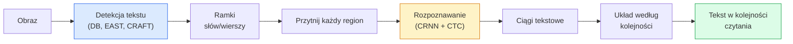

# OCR & Rozumienie Dokumentów

> OCR to trzyetapowy pipeline — wykryj ramki tekstu, rozpoznaj znaki, a następnie ułóż je. Każdy nowoczesny system OCR przestawia te etapy lub je łączy.

**Type:** Learn + Use
**Languages:** Python
**Prerequisites:** Phase 4 Lesson 06 (Detection), Phase 7 Lesson 02 (Self-Attention)
**Time:** ~45 minut

## Cele Kształcenia

- Prześledzić klasyczny pipeline OCR (wykryj -> rozpoznaj -> układ) i nowoczesne alternatywy typu end-to-end (Donut, Qwen-VL-OCR)
- Zaimplementować stratę CTC (Connectionist Temporal Classification) do treningu OCR sekwencja-do-sekwencji
- Użyć PaddleOCR lub EasyOCR do produkcyjnego parsowania dokumentów bez treningu
- Rozróżnić OCR, parsowanie układu i rozumienie dokumentów — i wybrać odpowiednie narzędzie do zadania

## Problem

Obrazy pełne tekstu są wszędzie: paragony, faktury, dowody tożsamości, skanowane książki, formularze, tablice, zrzuty ekranu. Wyodrębnianie z nich strukturalnych danych — nie tylko znaków, ale "to jest całkowita kwota" — to jeden z najbardziej wartościowych problemów stosowanego widzenia.

Dziedzina dzieli się na trzy poziomy umiejętności:

1. **Właściwy OCR**: zamień piksele w tekst.
2. **Parsowanie układu**: grupuj wyniki OCR w regiony (tytuł, treść, tabela, nagłówek).
3. **Rozumienie dokumentów**: wyodrębnij strukturalne pola ("invoice_total = 42.50 zł") z układu.

Każdy poziom ma klasyczne i nowoczesne podejścia, a różnica między "chcę tekst z obrazu" a "potrzebuję całkowitej kwoty z tego paragonu" jest większa, niż większość zespołów zdaje sobie sprawę.

## Koncepcja

### Klasyczny pipeline



- **Detekcja tekstu** produkuje czworokąty na wiersz lub słowo.
- **Rozpoznawanie** przycina każdy region do stałej wysokości, uruchamia CNN + BiLSTM + CTC, aby uzyskać sekwencję znaków.
- **Układ** odbudowuje kolejność czytania (od góry do dołu, od lewej do prawej dla łaciny; inaczej dla arabskiego, japońskiego).

### CTC w jednym akapicie

Rozpoznawanie OCR produkuje sekwencję o zmiennej długości z mapy cech o stałej długości. CTC (Graves et al., 2006) pozwala to trenować bez dopasowania na poziomie znaków. Model wyprowadza rozkład na (słownictwo + puste) w każdym kroku czasowym; strata CTC marginalizuje po wszystkich dopasowaniach, które redukują się do docelowego tekstu po scaleniu powtórzeń i usunięciu pustych.

```
surowy wynik: "h h h _ _ e e l l _ l l o _ _"
po scaleniu powtórzeń i usunięciu pustych: "hello"
```

CTC to powód, dla którego CRNN działał w 2015 i wciąż trenuje większość produkcyjnych modeli OCR w 2026.

### Nowoczesne modele end-to-end

- **Donut** (Kim et al., 2022) — enkoder ViT + dekoder tekstu; czyta obraz i emituje JSON bezpośrednio. Bez detektora tekstu, bez modułu układu.
- **TrOCR** — ViT + dekoder transformer dla OCR na poziomie wiersza.
- **Qwen-VL-OCR / InternVL** — pełne modele wizyjno-językowe dostrojone do zadań OCR; najlepsza dokładność w 2026 na złożonych dokumentach.
- **PaddleOCR** — klasyczny pipeline DB + CRNN w dojrzałym pakiecie produkcyjnym; wciąż koń roboczy open source.

Modele end-to-end potrzebują więcej danych i mocy obliczeniowej, ale pomijają akumulację błędów pipelineów wieloetapowych.

### Parsowanie układu

Dla strukturalnych dokumentów uruchom detektor układu (LayoutLMv3, DocLayNet), który etykietuje każdy region: Tytuł, Akapit, Rysunek, Tabela, Przypis. Kolejność czytania staje się wtedy "iteruj przez regiony w kolejności układu, konkatenuj".

Dla formularzy używaj modeli **ekstrakcji klucz-wartość** (Donut dla bogatych wizualnie dokumentów, LayoutLMv3 dla zwykłych skanów). Przyjmują obraz + wykryty tekst + pozycje i przewidują strukturalne pary klucz-wartość.

### Metryki ewaluacji

- **Współczynnik błędów znaków (CER)** — odległość Levenshteina / długość referencji. Niższy znaczy lepszy. Cel produkcyjny: < 2% na czystych skanach.
- **Współczynnik błędów słów (WER)** — to samo na poziomie słów.
- **F1 dla pól strukturalnych** — dla zadań klucz-wartość; mierzy, czy `{invoice_total: 42.50}` pojawia się poprawnie.
- **Odległość edycyjna na JSON** — dla end-to-end parsowania dokumentów; artykuł Donut wprowadził znormalizowaną odległość edycyjną drzewa.

## Zbuduj To

### Krok 1: Strata CTC + dekoder zachłanny

```python
import torch
import torch.nn as nn
import torch.nn.functional as F


def ctc_loss(log_probs, targets, input_lengths, target_lengths, blank=0):
    """
    log_probs:      (T, N, C) log-softmax na słownictwie z pustym na indeksie 0
    targets:        (N, S) cele int (bez pustych)
    input_lengths:  (N,) użyte kroki czasowe na próbkę
    target_lengths: (N,) długość celu na próbkę
    """
    return F.ctc_loss(log_probs, targets, input_lengths, target_lengths,
                      blank=blank, reduction="mean", zero_infinity=True)


def greedy_ctc_decode(log_probs, blank=0):
    """
    log_probs: (T, N, C) log-softmax
    zwraca: lista sekwencji indeksów (puste usunięte, powtórzenia scalone)
    """
    preds = log_probs.argmax(dim=-1).transpose(0, 1).cpu().tolist()
    out = []
    for seq in preds:
        decoded = []
        prev = None
        for idx in seq:
            if idx != prev and idx != blank:
                decoded.append(idx)
            prev = idx
        out.append(decoded)
    return out
```

`F.ctc_loss` używa wydajnej implementacji CuDNN, gdy dostępna. Dekoder zachłanny jest prostszy niż wiązkowe przeszukiwanie i zwykle mieści się w 1% CER od niego.

### Krok 2: Malutki rozpoznawca CRNN

Minimalny CNN + BiLSTM do OCR wiersza.

```python
class TinyCRNN(nn.Module):
    def __init__(self, vocab_size=40, hidden=128, feat=32):
        super().__init__()
        self.cnn = nn.Sequential(
            nn.Conv2d(1, feat, 3, 1, 1), nn.BatchNorm2d(feat), nn.ReLU(inplace=True),
            nn.MaxPool2d(2),
            nn.Conv2d(feat, feat * 2, 3, 1, 1), nn.BatchNorm2d(feat * 2), nn.ReLU(inplace=True),
            nn.MaxPool2d(2),
            nn.Conv2d(feat * 2, feat * 4, 3, 1, 1), nn.BatchNorm2d(feat * 4), nn.ReLU(inplace=True),
            nn.MaxPool2d((2, 1)),
            nn.Conv2d(feat * 4, feat * 4, 3, 1, 1), nn.BatchNorm2d(feat * 4), nn.ReLU(inplace=True),
            nn.MaxPool2d((2, 1)),
        )
        self.rnn = nn.LSTM(feat * 4, hidden, bidirectional=True, batch_first=True)
        self.head = nn.Linear(hidden * 2, vocab_size)

    def forward(self, x):
        # x: (N, 1, H, W)
        f = self.cnn(x)                # (N, C, H', W')
        f = f.mean(dim=2).transpose(1, 2)  # (N, W', C)
        h, _ = self.rnn(f)
        return F.log_softmax(self.head(h).transpose(0, 1), dim=-1)  # (W', N, vocab)
```

Wejście o stałej wysokości (CNN max-pooluje wysokość do 1). Szerokość to wymiar czasu dla CTC.

### Krok 3: Syntetyczny OCR

Generuj czarno-białe ciągi cyfr do testu dymnego end-to-end.

```python
import numpy as np

def synthetic_line(text, height=32, char_width=16):
    W = char_width * len(text)
    img = np.ones((height, W), dtype=np.float32)
    for i, c in enumerate(text):
        x = i * char_width
        shade = 0.0 if c.isalnum() else 0.5
        img[6:height - 6, x + 2:x + char_width - 2] = shade
    return img


def build_batch(strings, vocab):
    H = 32
    W = 16 * max(len(s) for s in strings)
    imgs = np.ones((len(strings), 1, H, W), dtype=np.float32)
    target_lengths = []
    targets = []
    for i, s in enumerate(strings):
        imgs[i, 0, :, :16 * len(s)] = synthetic_line(s)
        ids = [vocab.index(c) for c in s]
        targets.extend(ids)
        target_lengths.append(len(ids))
    return torch.from_numpy(imgs), torch.tensor(targets), torch.tensor(target_lengths)


vocab = ["_"] + list("0123456789abcdefghijklmnopqrstuvwxyz")
imgs, targets, lengths = build_batch(["hello", "world"], vocab)
print(f"images: {imgs.shape}   targets: {targets.shape}   lengths: {lengths.tolist()}")
```

Prawdziwy zestaw danych OCR dodaje czcionki, szum, obrót, rozmycie i kolor. Pipeline powyżej jest identyczny.

### Krok 4: Szkic treningu

```python
model = TinyCRNN(vocab_size=len(vocab))
opt = torch.optim.Adam(model.parameters(), lr=1e-3)

for step in range(200):
    strings = ["abc" + str(step % 10)] * 4 + ["xyz" + str((step + 1) % 10)] * 4
    imgs, targets, target_lens = build_batch(strings, vocab)
    log_probs = model(imgs)  # (W', 8, vocab)
    input_lens = torch.full((8,), log_probs.size(0), dtype=torch.long)
    loss = ctc_loss(log_probs, targets, input_lens, target_lens, blank=0)
    opt.zero_grad(); loss.backward(); opt.step()
```

Strata powinna spaść z ~3 do ~0.2 w ciągu 200 kroków na tych trywialnych syntetycznych danych.

## Użyj Tego

Trzy ścieżki produkcyjne:

- **PaddleOCR** — dojrzały, szybki, wielojęzyczny. Użycie w jednej linii: `paddleocr.PaddleOCR(lang="en").ocr(image_path)`.
- **EasyOCR** — natywny Python, wielojęzyczny, szkielet PyTorch.
- **Tesseract** — klasyczny; wciąż przydatny dla starych skanowanych dokumentów, gdy modele mają trudności.

Do end-to-end parsowania dokumentów używaj Donut lub VLM:

```python
from transformers import DonutProcessor, VisionEncoderDecoderModel

processor = DonutProcessor.from_pretrained("naver-clova-ix/donut-base-finetuned-cord-v2")
model = VisionEncoderDecoderModel.from_pretrained("naver-clova-ix/donut-base-finetuned-cord-v2")
```

Dla paragonów, faktur i formularzy z powtarzalną strukturą, dostrój Donut. Dla dowolnych dokumentów lub OCR z rozumowaniem, VLM taki jak Qwen-VL-OCR jest obecnym domyślnym rozwiązaniem.

## Dostarcz To

Ta lekcja produkuje:

- `outputs/prompt-ocr-stack-picker.md` — prompt wybierający Tesseract / PaddleOCR / Donut / VLM-OCR dla danego typu dokumentu, języka i struktury.
- `outputs/skill-ctc-decoder.md` — umiejętność pisząca zachłanne i wiązkowe dekodery CTC od zera, włączając normalizację długości.

## Ćwiczenia

1. **(Łatwe)** Wytrenuj TinyCRNN na 5-cyfrowych losowych ciągach numerycznych przez 500 kroków. Raportuj CER na wstrzymanym zbiorze.
2. **(Średnie)** Zastąp dekodowanie zachłanne wiązkowym przeszukiwaniem (beam_width=5). Raportuj różnicę CER. Na których wejściach wiązkowe przeszukiwanie wygrywa?
3. **(Trudne)** Użyj PaddleOCR na zestawie 20 paragonów, wyodrębnij pozycje i oblicz F1 względem ręcznie oznakowanej prawdy podstawowej dla par {nazwa_produktu, cena}.

## Kluczowe Pojęcia

| Termin | Co ludzie mówią | Co faktycznie oznacza |
|--------|-----------------|----------------------|
| OCR | "Tekst z pikseli" | Zamiana regionów obrazu na sekwencje znaków |
| CTC | "Strata bez dopasowania" | Strata trenująca model sekwencyjny bez etykiet na krok czasowy; marginalizacja po dopasowaniach |
| CRNN | "Klasyczny model OCR" | Ekstraktor cech Conv + BiLSTM + CTC; baseline z 2015 wciąż używany produkcyjnie |
| Donut | "OCR end-to-end" | Enkoder ViT + dekoder tekstu; emituje JSON bezpośrednio z obrazu |
| Parsowanie układu | "Znajdź regiony" | Wykryj i oznacz regiony Tytuł/Tabela/Rysunek/Akapit w dokumencie |
| Kolejność czytania | "Sekwencja tekstu" | Uporządkowanie rozpoznanych regionów w zdanie; trywialne dla łaciny, nietrywialne dla mieszanych układów |
| CER / WER | "Współczynniki błędów" | Odległość Levenshteina / długość referencji na poziomie znaku lub słowa |
| VLM-OCR | "LLM, który czyta" | Model wizyjno-językowy trenowany lub promptowany do zadań OCR; obecny SOTA na złożonych dokumentach |

## Dalsza Lektura

- [CRNN (Shi et al., 2015)](https://arxiv.org/abs/1507.05717) — oryginalna architektura CNN+RNN+CTC
- [CTC (Graves et al., 2006)](https://www.cs.toronto.edu/~graves/icml_2006.pdf) — oryginalny artykuł CTC; gęsto wypełniony pomysłami algorytmicznymi
- [Donut (Kim et al., 2022)](https://arxiv.org/abs/2111.15664) — transformer do rozumienia dokumentów bez OCR
- [PaddleOCR](https://github.com/PaddlePaddle/PaddleOCR) — produkcyjny stos OCR open source