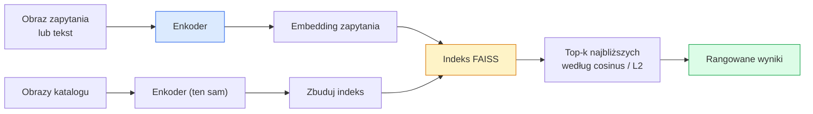

# Wyszukiwanie Obrazów & Uczenie Metryk

> System wyszukiwania rankinguje kandydatów według odległości w przestrzeni embeddingu. Uczenie metryk to dyscyplina kształtowania tej przestrzeni tak, aby odległości oznaczały to, co chcesz.

**Type:** Build
**Languages:** Python
**Prerequisites:** Phase 4 Lesson 14 (ViT), Phase 4 Lesson 18 (CLIP)
**Time:** ~45 minut

## Cele Kształcenia

- Wyjaśnić tripletowe, kontrastowe i proxy-based straty uczenia metryk i wybrać odpowiednią dla danego zbioru danych
- Poprawnie zaimplementować normalizację L2 i podobieństwo cosinusowe oraz zbadać różnicę między wyszukiwaniem "tego samego elementu" a "tej samej klasy"
- Zbudować indeks FAISS, przeszukiwać go tekstem i obrazem oraz raportować recall@K dla wstrzymanego zestawu zapytań
- Używać DINOv2, CLIP i SigLIP jako gotowych szkieletów embeddingu i wiedzieć, kiedy każdy wygrywa

## Problem

Wyszukiwanie jest wszędzie w produkcyjnym widzeniu: wykrywanie duplikatów, odwrotne wyszukiwanie obrazów, wyszukiwanie wizualne ("znajdź podobne produkty"), ponowna identyfikacja twarzy, ponowna ID osoby dla monitoringu, dopasowanie na poziomie instancji dla e-commerce. Pytanie produktowe jest zawsze takie samo: "mając ten obraz zapytania, rankinguj mój katalog."

Dwie decyzje projektowe kształtują cały system. Embedding — jaki model produkuje wektory. Indeks — jak znaleźć najbliższych sąsiadów w skali. Oba są towarem w 2026 (DINOv2 dla embeddingu, FAISS dla indeksu), co podnosi poprzeczkę: trudną częścią jest zdefiniowanie, *co liczy się jako podobne* dla twojej aplikacji, a następnie ukształtowanie przestrzeni embeddingu, aby odległości odpowiadały temu.

To kształtowanie to uczenie metryk. Jest to mała, ale bardzo wpływowa dyscyplina.

## Koncepcja

### Wyszukiwanie w pigułce



### Cztery rodziny strat

| Strata | Wymaga | Zalety | Wady |
|--------|--------|--------|------|
| **Kontrastowa** | (kotwica, pozytyw) + negatywy | Prosta, działa z dowolną etykietą pary | Wolno zbiega bez wielu negatywów |
| **Tripletowa** | (kotwica, pozytyw, negatyw) | Intuicyjna; bezpośrednia kontrola marginesu | Trudne wydobywanie tripletów jest kosztowne |
| **NT-Xent / InfoNCE** | Pary + batchowe negatywy | Skaluje się do dużych batchy | Potrzebuje dużego batcha lub kolejki momentum |
| **Proxy-based (ProxyNCA)** | Tylko etykiety klas | Szybka, stabilna, bez wydobywania | Może przetrenować się na proxy przy małych zbiorach |

Dla większości przypadków produkcyjnych zacznij od wytrenowanego szkieletu i dodaj dostrojenie metryk tylko wtedy, gdy gotowe embeddingi działają słabo na twoim zbiorze testowym.

### Strata tripletowa formalnie

```
L = max(0, ||f(a) - f(p)||^2 - ||f(a) - f(n)||^2 + margin)
```

Przyciągnij kotwicę `a` blisko pozytywu `p`, odepchnij od negatywu `n`, z `margin` zapewniającym odstęp. Trzyobrazkowa struktura uogólnia się do dowolnego porządkowania podobieństwa.

Wydobywanie ma znaczenie: łatwe triplety (`n` już daleko od `a`) dają zerową stratę; tylko trudne triplety uczą sieć. Półtrudne wydobywanie (`n` dalej niż `p`, ale w obrębie marginesu) to przepis FaceNet z 2016 i wciąż dominuje.

### Podobieństwo cosinusowe vs L2

Dwie metryki, dwie konwencje:

- **Cosinus**: kąt między wektorami. Wymaga embeddingów znormalizowanych L2.
- **L2**: odległość euklidesowa. Działa na surowych lub znormalizowanych embeddingach, ale zwykle łączona z L2-znormalizowanymi + L2 do kwadratu.

Dla większości nowoczesnych sieci obie są równoważne: `||a - b||^2 = 2 - 2 cos(a, b)` gdy `||a|| = ||b|| = 1`. Wybierz konwencję pasującą do treningu twojego embeddingu; mieszanie ich po cichu zmienia znaczenie "najbliższy."

### Recall@K

Standardowa metryka wyszukiwania:

```
recall@K = frakcja zapytań, gdzie co najmniej jeden poprawny wynik jest wśród K najlepszych
```

Raportuj recall@1, @5, @10 obok siebie. Recall@10 powyżej 0.95 z recall@1 poniżej 0.5 oznacza, że przestrzeń embeddingu ma właściwą strukturę, ale ranking jest zaszumiony — spróbuj dłuższego dostrojenia lub kroku ponownego rankingu.

Dla wykrywania duplikatów precision@K ma większe znaczenie, ponieważ każdy fałszywie pozytywny wynik to widoczny dla użytkownika błąd. Dla wyszukiwania wizualnego recall@K to sygnał produktowy.

### FAISS w jednym akapicie

Facebook AI Similarity Search. De-facto biblioteka do wyszukiwania najbliższych sąsiadów. Trzy wybory indeksu:

- `IndexFlatIP` / `IndexFlatL2` — brute force, dokładny, bez treningu. Używaj do ~1M wektorów.
- `IndexIVFFlat` — partycjonowanie na K komórek, przeszukiwanie tylko najbliższych kilku komórek. Aproksymacyjny, szybki, potrzebuje danych treningowych.
- `IndexHNSW` — oparty na grafie, najszybszy dla wielu zapytań, duży rozmiar indeksu.

Dla 100k wektorów prawdopodobnie chcesz `IndexFlatIP` na podobieństwie cosinusowym. Dla 10M chcesz `IndexIVFFlat`. Dla 100M+ w połączeniu z kwantyzacją produktową (`IndexIVFPQ`).

### Wyszukiwanie na poziomie instancji vs kategorii

Dwa bardzo różne problemy o tej samej nazwie:

- **Poziom kategorii** — "znajdź koty w moim katalogu." Podobieństwo warunkowane klasą; gotowe embeddingi CLIP / DINOv2 działają dobrze.
- **Poziom instancji** — "znajdź *ten konkretny produkt* w moim katalogu." Potrzebuje drobnoziarnistego rozróżniania między wizualnie podobnymi obiektami tej samej klasy; gotowe embeddingi działają słabo; dostrojenie z uczeniem metryk ma znaczenie.

Zawsze pytaj, który rozwiązujesz, przed wyborem modelu.

## Zbuduj To

### Krok 1: Strata tripletowa

```python
import torch
import torch.nn.functional as F

def triplet_loss(anchor, positive, negative, margin=0.2):
    d_ap = F.pairwise_distance(anchor, positive, p=2)
    d_an = F.pairwise_distance(anchor, negative, p=2)
    return F.relu(d_ap - d_an + margin).mean()
```

Jedna linia. Działa na embeddingach znormalizowanych L2 lub surowych.

### Krok 2: Półtrudne wydobywanie

Mając batch embeddingów i etykiet, znajdź najtwardszy półtrudny negatyw dla każdej kotwicy.

```python
def semi_hard_negatives(emb, labels, margin=0.2):
    dist = torch.cdist(emb, emb)
    same_class = labels[:, None] == labels[None, :]
    diff_class = ~same_class
    N = emb.size(0)

    positives = dist.clone()
    positives[~same_class] = float("-inf")
    positives.fill_diagonal_(float("-inf"))
    pos_idx = positives.argmax(dim=1)

    semi_hard = dist.clone()
    semi_hard[same_class] = float("inf")
    d_ap = dist[torch.arange(N), pos_idx].unsqueeze(1)
    semi_hard[dist <= d_ap] = float("inf")
    neg_idx = semi_hard.argmin(dim=1)

    fallback_mask = semi_hard[torch.arange(N), neg_idx] == float("inf")
    if fallback_mask.any():
        hardest = dist.clone()
        hardest[same_class] = float("inf")
        neg_idx = torch.where(fallback_mask, hardest.argmin(dim=1), neg_idx)
    return pos_idx, neg_idx
```

Każda kotwica otrzymuje najtwardszy pozytyw w klasie i półtrudny negatyw, który jest dalej niż pozytyw, ale w obrębie marginesu.

### Krok 3: Recall@K

```python
def recall_at_k(query_emb, gallery_emb, query_labels, gallery_labels, k=1):
    sim = query_emb @ gallery_emb.T
    _, top_k = sim.topk(k, dim=-1)
    matches = (gallery_labels[top_k] == query_labels[:, None]).any(dim=-1)
    return matches.float().mean().item()
```

Top-k przez iloczyn skalarny na embeddingach L2-znormalizowanych równa się top-k przez cosinus. Raportuj średnią proporcję zapytań z co najmniej jednym poprawnym sąsiadem.

### Krok 4: Składanie wszystkiego razem

```python
import torch
import torch.nn as nn
from torch.optim import Adam

class Encoder(nn.Module):
    def __init__(self, in_dim=128, emb_dim=64):
        super().__init__()
        self.net = nn.Sequential(
            nn.Linear(in_dim, 128), nn.ReLU(),
            nn.Linear(128, emb_dim),
        )

    def forward(self, x):
        return F.normalize(self.net(x), dim=-1)

torch.manual_seed(0)
num_classes = 6
protos = F.normalize(torch.randn(num_classes, 128), dim=-1)

def sample_batch(bs=32):
    labels = torch.randint(0, num_classes, (bs,))
    x = protos[labels] + 0.15 * torch.randn(bs, 128)
    return x, labels

enc = Encoder()
opt = Adam(enc.parameters(), lr=3e-3)

for step in range(200):
    x, y = sample_batch(32)
    emb = enc(x)
    pos_idx, neg_idx = semi_hard_negatives(emb, y)
    loss = triplet_loss(emb, emb[pos_idx], emb[neg_idx])
    opt.zero_grad(); loss.backward(); opt.step()
```

Po kilkuset krokach klastry embeddingu tworzą jeden klaster na klasę.

## Użyj Tego

Stosy produkcyjne w 2026:

- **DINOv2 + FAISS** — ogólne wyszukiwanie wizualne. Działa od ręki.
- **CLIP + FAISS** — gdy zapytania są tekstem.
- **Dostrojony DINOv2 + FAISS** — wyszukiwanie na poziomie instancji, re-ID twarzy, moda, e-commerce.
- **Milvus / Weaviate / Qdrant** — zarządzane otoczki wektorowych baz danych wokół FAISS lub HNSW.

Dla SOTA wyszukiwania instancji przepis to: szkielet DINOv2, dodaj głowicę embeddingu, dostrój z tripletową lub InfoNCE stratą na parach oznakowanych instancyjnie, indeksuj w FAISS.

## Dostarcz To

Ta lekcja produkuje:

- `outputs/prompt-retrieval-loss-picker.md` — prompt wybierający triplet / InfoNCE / ProxyNCA dla danego problemu wyszukiwania.
- `outputs/skill-recall-at-k-runner.md` — umiejętność pisząca czysty harness ewaluacyjny dla recall@K z podziałem train/val/gallery i właściwym kontraktem danych.

## Ćwiczenia

1. **(Łatwe)** Uruchom powyższy przykład zabawkowy. Narysuj embeddingi PCA przed i po treningu, aby zobaczyć formowanie się sześciu klastrów.
2. **(Średnie)** Dodaj implementację straty ProxyNCA: jedno uczone "proxy" na klasę, standardowa entropia krzyżowa na podobieństwie cosinusowym. Porównaj szybkość zbiegania vs strata tripletowa na danych zabawkowych.
3. **(Trudne)** Weź 1000 obrazów walidacyjnych ImageNet, osadź z DINOv2 przez HuggingFace, zbuduj płaski indeks FAISS i raportuj recall@{1, 5, 10} względem tych samych obrazów jako zapytań (powinno być 1.0) i względem wstrzymanego podziału z etykietami ImageNet jako prawdą podstawową.

## Kluczowe Pojęcia

| Termin | Co ludzie mówią | Co faktycznie oznacza |
|--------|-----------------|----------------------|
| Uczenie metryk | "Kształtuj przestrzeń" | Trenowanie enkodera tak, aby odległości w jego przestrzeni wyjściowej odzwierciedlały docelowe podobieństwo |
| Strata tripletowa | "Przyciągnij i odepchnij" | L = max(0, d(a, p) - d(a, n) + margin); kanoniczna strata uczenia metryk |
| Półtrudne wydobywanie | "Użyteczne negatywy" | Negatywy dalej od kotwicy niż pozytyw, ale w obrębie marginesu; empirycznie najbardziej informacyjne |
| Strata proxy-based | "Prototypy klas" | Jedno uczone proxy na klasę; entropia krzyżowa na podobieństwie-do-proxy; bez wydobywania par |
| Recall@K | "Współczynnik trafień w top-K" | Frakcja zapytań z co najmniej jednym poprawnym wynikiem w top K |
| Wyszukiwanie instancji | "Znajdź tę konkretną rzecz" | Dopasowanie drobnoziarniste; gotowe cechy zwykle działają słabo |
| FAISS | "Biblioteka NN" | Biblioteka najbliższych sąsiadów Facebooka; obsługuje indeksy dokładne i aproksymacyjne |
| HNSW | "Indeks grafowy" | Hierarchiczna mała światowa sieć; szybki aproksymacyjny NN z małym narzutem pamięci |

## Dalsza Lektura

- [FaceNet: A Unified Embedding for Face Recognition (Schroff et al., 2015)](https://arxiv.org/abs/1503.03832) — artykuł o stracie tripletowej / półtrudnym wydobywaniu
- [In Defense of the Triplet Loss for Person Re-Identification (Hermans et al., 2017)](https://arxiv.org/abs/1703.07737) — praktyczny przewodnik po dostrajaniu tripletowym
- [FAISS documentation](https://github.com/facebookresearch/faiss/wiki) — każdy indeks, każdy kompromis
- [SMoT: Metric Learning Taxonomy (Kim et al., 2021)](https://arxiv.org/abs/2010.06927) — przegląd nowoczesnych strat i ich powiązań