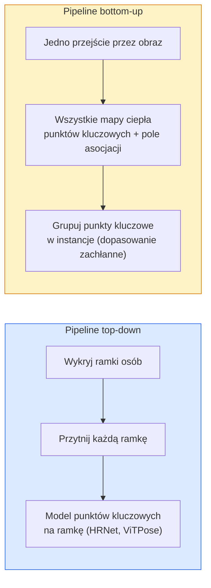

# Detekcja Punktów Kluczowych & Estymacja Pozy

> Poza to zestaw uporządkowanych punktów kluczowych. Detektor punktów kluczowych to regresor map ciepła. Cała reszta to księgowość.

**Type:** Build
**Languages:** Python
**Prerequisites:** Phase 4 Lesson 06 (Detection), Phase 4 Lesson 07 (U-Net)
**Time:** ~45 minut

## Cele Kształcenia

- Rozróżnić estymację pozy typu top-down i bottom-up oraz określić, kiedy każda jest używana
- Regresować mapy ciepła dla K punktów kluczowych z celem Gaussa na punkt kluczowy i wyodrębniać współrzędne punktów kluczowych w czasie inferencji
- Wyjaśnić Part Affinity Fields (PAF) i jak pipeline bottom-up kojarzą punkty kluczowe w instancje
- Używać MediaPipe Pose lub MMPose do produkcyjnej estymacji punktów kluczowych i rozumieć format ich wyjścia

## Problem

Zadania punktów kluczowych kryją się pod wieloma nazwami: poza człowieka (17 stawów ciała), landmarki twarzy (68 lub 478 punktów), dłoń (21 punktów), poza zwierząt, poza obiektów robotycznych, anatomiczne landmarki medyczne. Każde z nich ma tę samą strukturę: wykryj K dyskretnych punktów na obiekcie i wyprowadź ich współrzędne (x, y).

Estymacja pozy jest fundamentem motion capture, aplikacji fitness, analityki sportowej, sterowania gestami, animacji, przymierzania AR i chwytania robotycznego. Przypadek 2D jest dojrzały; poza 3D (estymacja pozycji stawów we współrzędnych świata z pojedynczej kamery) to obecna granica badawcza.

Pytanie inżynieryjne dotyczy skali. Poza dla pojedynczej osoby na pojedynczym obrazie to problem 20ms. Poza wielu osób w tłumie przy 30 fps to inny problem z innymi architekturami.

## Koncepcja

### Top-down vs bottom-up



- **Top-down** — wykryj ludzi najpierw, następnie uruchom model punktów kluczowych na osobę na każdym przycięciu. Najwyższa dokładność; skaluje się liniowo z liczbą osób.
- **Bottom-up** — jedno przejście w przód przewiduje wszystkie punkty kluczowe plus pole asocjacji; grupuj je. Stały czas niezależnie od rozmiaru tłumu.

Top-down (HRNet, ViTPose) to lider dokładności; bottom-up (OpenPose, HigherHRNet) to lider przepustowości dla zatłoczonych scen.

### Regresja map ciepła

Zamiast regresji bezpośredniej `(x, y)`, przewiduj mapę ciepła `H x W` na punkt kluczowy z gaussowskim rozmyciem wyśrodkowanym na prawdziwej lokalizacji.

```
target[k, y, x] = exp(-((x - cx_k)^2 + (y - cy_k)^2) / (2 sigma^2))
```

W czasie inferencji argmax każdej mapy ciepła to przewidywana lokalizacja punktu kluczowego.

Dlaczego mapy ciepła działają lepiej niż bezpośrednia regresja: struktura przestrzenna sieci (mapa cech konwolucyjnych) naturalnie dopasowuje się do przestrzennego wyjścia. Gausowskie cele również regularyzują — mały błąd lokalizacji daje małą stratę, a nie zero.

### Lokalizacja subpikselowa

Argmax daje współrzędne całkowite. Dla precyzji subpikselowej, udoskonal poprzez dopasowanie paraboli do argmax i jego sąsiadów lub użyj dobrze znanego przesunięcia `(dx, dy) = 0.25 * (heatmap[y, x+1] - heatmap[y, x-1], ...)` kierunku.

### Part Affinity Fields (PAF)

Trik OpenPose do kojarzenia bottom-up. Dla każdej pary połączonych punktów kluczowych (np. lewe ramię do lewego łokcia), przewiduj 2-kanałowe pole kodujące wektor jednostkowy wskazujący od jednego do drugiego. Aby skojarzyć ramię z jego łokciem, scałkuj PAF wzdłuż linii łączącej kandydatów na parę; para z najwyższą całką jest dopasowana.

```
Dla każdego połączenia (kończyny):
  Kanały PAF: 2 (wektor jednostkowy x, y)
  Całka liniowa: suma po punktach próbkowania (PAF . kierunek_linii)
  Wyższa całka = silniejsze dopasowanie
```

Eleganckie i skaluje się do dowolnych rozmiarów tłumu bez przycinania na osobę.

### Punkty kluczowe COCO

Standardowy zestaw danych pozy ciała: 17 punktów kluczowych na osobę, PCK (Percentage of Correct Keypoints) i OKS (Object Keypoint Similarity) jako metryki. OKS jest odpowiednikiem IoU dla punktów kluczowych i jest tym, co raportuje COCO mAP@OKS.

### 2D vs 3D

- **Poza 2D** — współrzędne obrazu; rozwiązana na poziomie produkcyjnym (MediaPipe, HRNet, ViTPose).
- **Poza 3D** — współrzędne świata / kamery; wciąż aktywny temat badań. Typowe podejścia:
  - Podnieś przewidywania 2D do 3D małym MLP (VideoPose3D).
  - Bezpośrednia regresja 3D z obrazu (PyMAF, MHFormer).
  - Układy wielokamerowe (CMU Panoptic) dla prawdy podstawowej.

## Zbuduj To

### Krok 1: Gausowski cel mapy ciepła

```python
import numpy as np
import torch

def gaussian_heatmap(size, cx, cy, sigma=2.0):
    yy, xx = np.meshgrid(np.arange(size), np.arange(size), indexing="ij")
    return np.exp(-((xx - cx) ** 2 + (yy - cy) ** 2) / (2 * sigma ** 2)).astype(np.float32)

hm = gaussian_heatmap(64, 32, 32, sigma=2.0)
print(f"peak: {hm.max():.3f} at ({hm.argmax() % 64}, {hm.argmax() // 64})")
```

Mapy ciepła na punkt kluczowy ułożone wzdłuż osi kanałów dają pełny tensor celu.

### Krok 2: Malutka głowica punktów kluczowych

Model w stylu U-Net, który wyprowadza K kanałów map ciepła.

```python
import torch.nn as nn
import torch.nn.functional as F

class TinyKeypointNet(nn.Module):
    def __init__(self, num_keypoints=4, base=16):
        super().__init__()
        self.down1 = nn.Sequential(nn.Conv2d(3, base, 3, 2, 1), nn.ReLU(inplace=True))
        self.down2 = nn.Sequential(nn.Conv2d(base, base * 2, 3, 2, 1), nn.ReLU(inplace=True))
        self.mid = nn.Sequential(nn.Conv2d(base * 2, base * 2, 3, 1, 1), nn.ReLU(inplace=True))
        self.up1 = nn.ConvTranspose2d(base * 2, base, 2, 2)
        self.up2 = nn.ConvTranspose2d(base, num_keypoints, 2, 2)

    def forward(self, x):
        h1 = self.down1(x)
        h2 = self.down2(h1)
        h3 = self.mid(h2)
        u1 = self.up1(h3)
        return self.up2(u1)
```

Wejście `(N, 3, H, W)`, wyjście `(N, K, H, W)`. Strata to MSE na piksel względem gaussowskich celów.

### Krok 3: Inferencja — wyodrębnij współrzędne punktów kluczowych

```python
def heatmap_to_coords(heatmaps):
    """
    heatmaps: (N, K, H, W)
    zwraca:  (N, K, 2) współrzędne float w pikselach obrazu
    """
    N, K, H, W = heatmaps.shape
    hm = heatmaps.reshape(N, K, -1)
    idx = hm.argmax(dim=-1)
    ys = (idx // W).float()
    xs = (idx % W).float()
    return torch.stack([xs, ys], dim=-1)

coords = heatmap_to_coords(torch.randn(2, 4, 32, 32))
print(f"coords: {coords.shape}")  # (2, 4, 2)
```

Jedna linia w inferencji. Dla udoskonalenia subpikselowego, interpoluj wokół argmax.

### Krok 4: Syntetyczny zestaw danych punktów kluczowych

Prosty: narysuj cztery punkty na białym płótnie i naucz się je przewidywać.

```python
def make_synthetic_sample(size=64):
    img = np.ones((3, size, size), dtype=np.float32)
    rng = np.random.default_rng()
    kps = rng.integers(8, size - 8, size=(4, 2))
    for cx, cy in kps:
        img[:, cy - 2:cy + 2, cx - 2:cx + 2] = 0.0
    hms = np.stack([gaussian_heatmap(size, cx, cy) for cx, cy in kps])
    return img, hms, kps
```

Wystarczająco łatwe, aby malutki model nauczył się w minutę.

### Krok 5: Trening

```python
model = TinyKeypointNet(num_keypoints=4)
opt = torch.optim.Adam(model.parameters(), lr=3e-3)

for step in range(200):
    batch = [make_synthetic_sample() for _ in range(16)]
    imgs = torch.from_numpy(np.stack([b[0] for b in batch]))
    hms = torch.from_numpy(np.stack([b[1] for b in batch]))
    pred = model(imgs)
    # Próbkuj pred do pełnej rozdzielczości
    pred = F.interpolate(pred, size=hms.shape[-2:], mode="bilinear", align_corners=False)
    loss = F.mse_loss(pred, hms)
    opt.zero_grad(); loss.backward(); opt.step()
```

## Użyj Tego

- **MediaPipe Pose** — produkcyjny estymator pozy Google; dostarcza środowiska WebGL + mobilne z opóźnieniem poniżej 10ms.
- **MMPose** (OpenMMLab) — kompleksowa baza kodu badawczego; każda architektura SOTA z wytrenowanymi wagami.
- **YOLOv8-pose** — najszybsza wieloosobowa poza w czasie rzeczywistym z pojedynczym przejściem w przód.
- **transformers HumanDPT / PoseAnything** — nowsze podejścia wizyjno-językowe dla pozy o otwartym słownictwie (dowolny obiekt, dowolny zestaw punktów kluczowych).

## Dostarcz To

Ta lekcja produkuje:

- `outputs/prompt-pose-stack-picker.md` — prompt wybierający MediaPipe / YOLOv8-pose / HRNet / ViTPose dla danego opóźnienia, rozmiaru tłumu i potrzeby 2D vs 3D.
- `outputs/skill-heatmap-to-coords.md` — umiejętność pisząca subpikselową rutynę mapy ciepła-do-współrzędnych używaną przez każdy produkcyjny model pozy.

## Ćwiczenia

1. **(Łatwe)** Wytrenuj malutki model punktów kluczowych na syntetycznym 4-punktowym zbiorze danych. Raportuj średni błąd L2 między przewidzianymi a prawdziwymi punktami kluczowymi po 200 krokach.
2. **(Średnie)** Dodaj udoskonalenie subpikselowe: dla pozycji argmax, dopasuj 1D parabolę wzdłuż x i y z sąsiednich pikseli. Raportuj wzrost dokładności vs całkowity argmax.
3. **(Trudne)** Zbuduj syntetyczny zestaw danych 2-osobowy, gdzie każdy obraz pokazuje dwie instancje 4-punktowego wzorca. Wytrenuj pipeline bottom-up z PAF przewidującymi, który punkt kluczowy należy do której instancji, i oceń OKS.

## Kluczowe Pojęcia

| Termin | Co ludzie mówią | Co faktycznie oznacza |
|--------|-----------------|----------------------|
| Punkt kluczowy | "Landmark" | Konkretny uporządkowany punkt na obiekcie (staw, narożnik, cecha) |
| Poza | "Szkielet" | Uporządkowany zestaw punktów kluczowych należących do jednej instancji |
| Top-down | "Wykryj potem pozę" | Dwuetapowy pipeline: detektor osób + model punktów kluczowych na przycięcie; najwyższa dokładność |
| Bottom-up | "Najpierw poza, potem grupuj" | Jednoprzebiegowa predykcja wszystkich punktów kluczowych + grupowanie; stały czas przy rozmiarze tłumu |
| Mapa ciepła | "Cel gaussowski" | Tensor H x W na punkt kluczowy z pikiem w prawdziwej lokalizacji; preferowany cel regresji |
| PAF | "Part Affinity Field" | 2-kanałowe pole wektora jednostkowego kodujące kierunki kończyn; używane do grupowania punktów kluczowych w instancje |
| OKS | "IoU dla punktów kluczowych" | Object Keypoint Similarity; metryka COCO dla pozy |
| HRNet | "High-Resolution Net" | Dominująca top-down architektura punktów kluczowych; zachowuje wysokorozdzielcze cechy przez cały czas |

## Dalsza Lektura

- [OpenPose (Cao et al., 2017)](https://arxiv.org/abs/1812.08008) — bottom-up z PAF; wciąż najlepszy opis podejścia
- [HRNet (Sun et al., 2019)](https://arxiv.org/abs/1902.09212) — referencyjna top-down architektura
- [ViTPose (Xu et al., 2022)](https://arxiv.org/abs/2204.12484) — zwykły ViT jako szkielet pozy; obecny SOTA na wielu benchmarkach
- [MediaPipe Pose](https://developers.google.com/mediapipe/solutions/vision/pose_landmarker) — produkcyjna poza w czasie rzeczywistym; najszybszy wdrożony stos w 2026