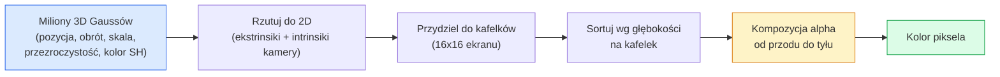

# 3D Gaussian Splatting od Podstaw

> Scena to chmura milionów 3D Gaussów. Każdy ma pozycję, orientację, skalę, przezroczystość i kolor zależny od kierunku patrzenia. Rasteryzuj je, cofnij propagację przez rasteryzację, gotowe.

**Type:** Build
**Languages:** Python
**Prerequisites:** Phase 4 Lesson 13 (3D Vision & NeRF), Phase 1 Lesson 12 (Tensor Operations), Phase 4 Lesson 10 (Diffusion basics optional)
**Time:** ~90 minut

## Cele Kształcenia

- Wyjaśnić, dlaczego 3D Gaussian Splatting zastąpił NeRF jako produkcyjny standard fotorealistycznej rekonstrukcji 3D w 2026
- Wymienić sześć parametrów na Gauss (pozycja, kwaternion obrotu, skala, przezroczystość, kolor harmonicznych sferycznych, opcjonalna cecha) i ile liczb zmiennoprzecinkowych każdy wnosi
- Zaimplementować rasteryzator 2D Gaussian splatting od zera używając kompozycji `alpha`, a następnie pokazać, jak przypadek 3D rzutuje się do tej samej pętli
- Użyć `nerfstudio`, `gsplat` lub `SuperSplat` do rekonstrukcji sceny z 20-50 zdjęć i eksportu do rozszerzenia glTF `KHR_gaussian_splatting` lub schematu OpenUSD 26.03 `UsdVolParticleField3DGaussianSplat`

## Problem

NeRF przechowuje scenę jako wagi MLP. Każdy wyrenderowany piksel to setki zapytań MLP wzdłuż promienia. Trening trwa godziny, renderowanie sekundy, a wag nie można edytować — jeśli chcesz przesunąć krzesło w scenie, musisz trenować od nowa.

3D Gaussian Splatting (Kerbl, Kopanas, Leimkühler, Drettakis, SIGGRAPH 2023) zastąpił to wszystko. Scena to jawny zestaw 3D Gaussów. Renderowanie to rasteryzacja GPU przy 100+ fps. Trening trwa minuty. Edycja jest bezpośrednia: przesuń podzbiór Gaussów i przesunąłeś krzesło. Do 2026 roku Khronos Group ratyfikowała rozszerzenie glTF dla splatów Gaussa, OpenUSD 26.03 dostarcza schemat splatów Gaussa, Zillow i Apartments.com renderują nieruchomości za ich pomocą, a większość nowych artykułów badawczych o rekonstrukcji 3D to warianty podstawowej idei 3DGS.

Model mentalny jest prosty, matematyka ma wystarczająco dużo ruchomych części, że większość wprowadzeń zaczyna od rasteryzacji i pomija projekcje oraz harmoniczne sferyczne. Ta lekcja buduje całość — najpierw wersję 2D, potem rozszerzenie 3D.

## Koncepcja

### Co niesie Gauss

Jeden 3D Gauss to parametryczna plama w przestrzeni z tymi atrybutami:

```
position         mu         (3,)    środek we współrzędnych świata
rotation         q          (4,)    kwaternion jednostkowy kodujący orientację
scale            s          (3,)    log-skale na oś (wykładnicze w czasie renderowania)
opacity          alpha      (1,)    przezroczystość po sigmoidzie [0, 1]
SH coefficients  c_lm       (3 * (L+1)^2,)   kolor zależny od widoku
```

Obrót + skala budują kowariancję 3x3: `Sigma = R S S^T R^T`. To jest kształt Gaussa w 3D. Harmoniczne sferyczne pozwalają kolorowi zmieniać się z kierunkiem patrzenia — spekulatywne podświetlenia, subtelny połysk, poświata zależna od widoku — bez przechowywania tekstur na widok. Przy stopniu SH 3 otrzymujesz 16 współczynników na kanał koloru, 48 liczb zmiennoprzecinkowych na samego Gaussa dla koloru.

Scena ma zazwyczaj 1-5 milionów Gaussów. Każdy przechowuje około 60 liczb zmiennoprzecinkowych (3 + 4 + 3 + 1 + 48 + różne). To 240 MB dla sceny z pięcioma milionami Gaussów — znacznie mniej niż równoważna chmura punktów z teksturą na punkt i o rząd wielkości mniej niż wagi MLP NeRF renderowane w wysokiej rozdzielczości.

### Rasteryzacja, nie ray marching



Pięć kroków, wszystkie przyjazne GPU. Żadnego zapytania MLP na piksel. Pojedynczy RTX 3080 Ti renderuje 6 milionów splatów przy 147 fps.

### Krok projekcji

3D Gauss w pozycji świata `mu` z kowariancją 3D `Sigma` rzutuje się do 2D Gaussa w pozycji ekranu `mu'` z kowariancją 2D `Sigma'`:

```
mu' = project(mu)
Sigma' = J W Sigma W^T J^T          (2 x 2)

W = transformacja widoku (obrót + translacja kamery)
J = Jakobian projekcji perspektywicznej w mu'
```

Ślad 2D Gaussa to elipsa, której osie to wektory własne `Sigma'`. Każdy piksel wewnątrz tej elipsy otrzymuje wkład Gaussa, ważony przez `exp(-0.5 * (p - mu')^T Sigma'^-1 (p - mu'))`.

### Reguła kompozycji alpha

Dla jednego piksela, Gaussy które go pokrywają są sortowane od tyłu do przodu (lub równoważnie od przodu do tyłu z odwróconym wzorem). Kolor jest komponowany z tym samym równaniem co każdy półprzezroczysty rasteryzator od lat 80.:

```
C_piksel = sum_i alpha_i * T_i * c_i

T_i = prod_{j < i} (1 - alpha_j)       transmitancja do i
alpha_i = przezroczystosc_i * exp(-0.5 * d^T Sigma'^-1 d)   lokalny wkład
c_i = eval_SH(SH_i, kierunek_widoku)    kolor zależny od widoku
```

To jest **to samo równanie co objętościowy render NeRF**, tylko po jawnym rzadkim zbiorze Gaussów zamiast gęstych próbek wzdłuż promienia. Ta tożsamość jest powodem, dla którego jakość renderowania dorównuje NeRF — oba całkują to samo równanie pola radiance.

### Dlaczego to jest różniczkowalne

Każdy krok — projekcja, przydział do kafelków, kompozycja alpha, ewaluacja SH — jest różniczkowalny względem parametrów Gaussa. Mając obraz prawdy podstawowej, oblicz stratę renderowanego piksela, cofnij propagację przez rasteryzator, zaktualizuj wszystkie `(mu, q, s, alpha, c_lm)` przez gradient prosty. Po ~30,000 iteracji Gaussy znajdują swoje właściwe pozycje, skale i kolory.

### Zagęszczanie i przycinanie

Stały zestaw Gaussów nie może pokryć złożonej sceny. Trening obejmuje dwa mechanizmy adaptacyjne:

- **Klonuj** Gaussa w jego bieżącej pozycji, gdy jego magnituda gradientu jest wysoka, ale skala mała — rekonstrukcja potrzebuje więcej szczegółów tutaj.
- **Podziel** Gaussa o dużej skali na dwa mniejsze, gdy jego gradient jest wysoki — jeden duży Gauss jest zbyt wygładzony, aby dopasować region.
- **Przytnij** Gaussy, których przezroczystość spada poniżej progu — nie wnoszą wkładu.

Zagęszczanie uruchamia się co N iteracji. Scena typowo rośnie od ~100k początkowych Gaussów (zaszczepionych z punktów SfM) do 1-5M pod koniec treningu.

### Harmoniczne sferyczne w jednym akapicie

Kolor zależny od widoku to funkcja `c(kierunek)` na sferze jednostkowej. Harmoniczne sferyczne to baza Fouriera sfery. Obetnij przy stopniu `L` i otrzymujesz `(L+1)^2` funkcji bazowych na kanał. Ewaluacja koloru dla nowego widoku to iloczyn skalarny między nauczonymi współczynnikami SH a bazą ewaluowaną w kierunku patrzenia. Stopień 0 = jeden współczynnik = stały kolor. Stopień 3 = 16 współczynników = wystarczające do uchwycenia cieniowania Lambertowskiego, spekularnego i łagodnych odbić. Artykuły SD Gaussian Splatting używają domyślnie stopnia 3.

### Stos produkcyjny 2026

```
1. Zbieranie         smartfon / dron DJI / skaner ręczny
2. SfM / MVS         COLMAP lub GLOMAP wyprowadza pozy kamer + rzadkie punkty
3. Trening 3DGS      nerfstudio / gsplat / inria official / PostShot (~10-30 min na RTX 4090)
4. Edycja            SuperSplat / SplatForge (usuń latające elementy, segmentuj)
5. Eksport           .ply -> glTF KHR_gaussian_splatting lub .usd (OpenUSD 26.03)
6. Podgląd           Cesium / Unreal / Babylon.js / Three.js / Vision Pro
```

### Warianty 4D i generatywne

- **4D Gaussian Splatting** — Gaussy jako funkcje czasu; używane do wideo objętościowego (Superman 2026, A$AP Rocky "Helicopter").
- **Generatywne splaty** — tekst-do-splatu modele (Marble od World Labs), które halucynują całe sceny.
- **3D Gaussian Unscented Transform** — wariant NVIDIA NuRec do symulacji autonomicznej jazdy.

## Zbuduj To

### Krok 1: 2D Gauss

Najpierw budujemy rasteryzator 2D. Przypadek 3D redukuje się do niego po projekcji.

```python
import torch
import torch.nn as nn
import torch.nn.functional as F


def eval_2d_gaussian(means, covs, points):
    """
    means:  (G, 2)      środki
    covs:   (G, 2, 2)   macierze kowariancji
    points: (H, W, 2)   współrzędne pikseli
    zwraca: (G, H, W)  gęstość w każdym pikselu dla każdego Gaussa
    """
    G = means.size(0)
    H, W, _ = points.shape
    flat = points.view(-1, 2)
    inv = torch.linalg.inv(covs)
    diff = flat[None, :, :] - means[:, None, :]
    d = torch.einsum("gpi,gij,gpj->gp", diff, inv, diff)
    density = torch.exp(-0.5 * d)
    return density.view(G, H, W)
```

`einsum` wykonuje formę kwadratową `diff^T Sigma^-1 diff` dla każdej pary (Gauss, piksel).

### Krok 2: Rasteryzator 2D splatting

Kompozycja alpha od przodu do tyłu. Głębokość w 2D nie ma znaczenia, więc używamy nauczonego skalara na Gauss dla porządku.

```python
def rasterise_2d(means, covs, colours, opacities, depths, image_size):
    """
    means:     (G, 2)
    covs:      (G, 2, 2)
    colours:   (G, 3)
    opacities: (G,)     w [0, 1]
    depths:    (G,)     skalar na Gauss używany do porządkowania
    image_size: (H, W)
    zwraca:   (H, W, 3) wyrenderowany obraz
    """
    H, W = image_size
    yy, xx = torch.meshgrid(
        torch.arange(H, dtype=torch.float32, device=means.device),
        torch.arange(W, dtype=torch.float32, device=means.device),
        indexing="ij",
    )
    points = torch.stack([xx, yy], dim=-1)

    densities = eval_2d_gaussian(means, covs, points)
    alphas = opacities[:, None, None] * densities
    alphas = alphas.clamp(0.0, 0.99)

    order = torch.argsort(depths)
    alphas = alphas[order]
    colours_sorted = colours[order]

    T = torch.ones(H, W, device=means.device)
    out = torch.zeros(H, W, 3, device=means.device)
    for i in range(means.size(0)):
        a = alphas[i]
        out += (T * a)[..., None] * colours_sorted[i][None, None, :]
        T = T * (1.0 - a)
    return out
```

Nieszybkie — prawdziwa implementacja używa kafelkowych jąder CUDA — ale dokładnie właściwa matematyka i w pełni różniczkowalne.

### Krok 3: Trenowalna scena 2D splat

```python
class Splats2D(nn.Module):
    def __init__(self, num_splats=128, image_size=64, seed=0):
        super().__init__()
        g = torch.Generator().manual_seed(seed)
        H, W = image_size, image_size
        self.means = nn.Parameter(torch.rand(num_splats, 2, generator=g) * torch.tensor([W, H]))
        self.log_scale = nn.Parameter(torch.ones(num_splats, 2) * math.log(2.0))
        self.rot = nn.Parameter(torch.zeros(num_splats))  # pojedynczy kąt w 2D
        self.colour_logits = nn.Parameter(torch.randn(num_splats, 3, generator=g) * 0.5)
        self.opacity_logit = nn.Parameter(torch.zeros(num_splats))
        self.depth = nn.Parameter(torch.rand(num_splats, generator=g))

    def covs(self):
        s = torch.exp(self.log_scale)
        c, si = torch.cos(self.rot), torch.sin(self.rot)
        R = torch.stack([
            torch.stack([c, -si], dim=-1),
            torch.stack([si, c], dim=-1),
        ], dim=-2)
        S = torch.diag_embed(s ** 2)
        return R @ S @ R.transpose(-1, -2)

    def forward(self, image_size):
        covs = self.covs()
        colours = torch.sigmoid(self.colour_logits)
        opacities = torch.sigmoid(self.opacity_logit)
        return rasterise_2d(self.means, covs, colours, opacities, self.depth, image_size)
```

`log_scale`, `opacity_logit` i `colour_logits` to wszystkie nieograniczone parametry mapowane przez właściwą aktywację w czasie renderowania. To jest standardowy wzór dla każdej implementacji 3DGS.

### Krok 4: Dopasuj 2D Gaussy do docelowego obrazu

```python
import math
import numpy as np

def make_target(size=64):
    yy, xx = np.meshgrid(np.arange(size), np.arange(size), indexing="ij")
    img = np.zeros((size, size, 3), dtype=np.float32)
    # Czerwone koło
    mask = (xx - 20) ** 2 + (yy - 20) ** 2 < 10 ** 2
    img[mask] = [1.0, 0.2, 0.2]
    # Niebieski kwadrat
    mask = (np.abs(xx - 45) < 8) & (np.abs(yy - 40) < 8)
    img[mask] = [0.2, 0.3, 1.0]
    return torch.from_numpy(img)


target = make_target(64)
model = Splats2D(num_splats=64, image_size=64)
opt = torch.optim.Adam(model.parameters(), lr=0.05)

for step in range(200):
    pred = model((64, 64))
    loss = F.mse_loss(pred, target)
    opt.zero_grad(); loss.backward(); opt.step()
    if step % 40 == 0:
        print(f"step {step:3d}  mse {loss.item():.4f}")
```

Po 200 krokach 64 Gaussy układają się w dwa kształty. To jest cała idea — gradient prosty na jawnych geometrycznych prymitywach.

### Krok 5: Od 2D do 3D

Rozszerzenie 3D zachowuje tę samą pętlę. Dodatki:

1. Obrót na Gauss to kwaternion zamiast pojedynczego kąta.
2. Kowariancja to `R S S^T R^T` z `R` zbudowanym z kwaternionu i `S = diag(exp(log_scale))`.
3. Projekcja `(mu, Sigma) -> (mu', Sigma')` używa ekstrinsików kamery i Jakobianu projekcji perspektywicznej w `mu`.
4. Kolor staje się rozwinięciem w harmoniczne sferyczne; ewaluuj go w kierunku patrzenia.
5. Sortowanie wg głębokości z rzeczywistego z kamery przestrzeni zamiast nauczonego skalara.

Każda produkcyjna implementacja (`gsplat`, `inria/gaussian-splatting`, `nerfstudio`) robi dokładnie to na GPU z kafelkowymi jądrami CUDA.

### Krok 6: Ewaluacja harmonicznych sferycznych

Baza SH do stopnia 3 ma 16 wyrazów na kanał. Ewaluacja:

```python
def eval_sh_degree_3(sh_coeffs, dirs):
    """
    sh_coeffs: (..., 16, 3)   ostatni wymiar to kanały RGB
    dirs:      (..., 3)       wektory jednostkowe
    zwraca:   (..., 3)
    """
    C0 = 0.282094791773878
    C1 = 0.488602511902920
    C2 = [1.092548430592079, 1.092548430592079,
          0.315391565252520, 1.092548430592079,
          0.546274215296039]
    x, y, z = dirs[..., 0], dirs[..., 1], dirs[..., 2]
    x2, y2, z2 = x * x, y * y, z * z
    xy, yz, xz = x * y, y * z, x * z

    result = C0 * sh_coeffs[..., 0, :]
    result = result - C1 * y[..., None] * sh_coeffs[..., 1, :]
    result = result + C1 * z[..., None] * sh_coeffs[..., 2, :]
    result = result - C1 * x[..., None] * sh_coeffs[..., 3, :]

    result = result + C2[0] * xy[..., None] * sh_coeffs[..., 4, :]
    result = result + C2[1] * yz[..., None] * sh_coeffs[..., 5, :]
    result = result + C2[2] * (2.0 * z2 - x2 - y2)[..., None] * sh_coeffs[..., 6, :]
    result = result + C2[3] * xz[..., None] * sh_coeffs[..., 7, :]
    result = result + C2[4] * (x2 - y2)[..., None] * sh_coeffs[..., 8, :]

    # terminy stopnia 3 pominięte dla zwięzłości; pełna 16-współczynnikowa wersja w pliku code
    return result
```

Nauczone `sh_coeffs` przechowują "kolor w każdym kierunku" dla tego Gaussa. W czasie renderowania ewaluujesz względem bieżącego kierunku widoku i otrzymujesz 3-wektor RGB.

## Użyj Tego

Do rzeczywistej pracy z 3DGS używaj `gsplat` (Meta) lub `nerfstudio`:

```bash
pip install nerfstudio gsplat
ns-download-data example
ns-train splatfacto --data path/to/data
```

`splatfacto` to trener 3DGS w nerfstudio. Uruchomienie zajmuje 10-30 minut na RTX 4090 dla typowej sceny.

Opcje eksportu, które mają znaczenie w 2026:

- `.ply` — surowa chmura Gaussów (przenośna, największy plik).
- `.splat` — skwantowany format PlayCanvas / SuperSplat.
- glTF `KHR_gaussian_splatting` — standard Khronos, przenośny między przeglądarkami (RC luty 2026).
- OpenUSD `UsdVolParticleField3DGaussianSplat` — natywny USD, dla pipeline NVIDIA Omniverse i Vision Pro.

Dla scen 4D / dynamicznych, `4DGS` i `Deformable-3DGS` rozszerzają ten sam mechanizm ze zmiennymi w czasie środkami i przezroczystościami.

## Dostarcz To

Ta lekcja produkuje:

- `outputs/prompt-3dgs-capture-planner.md` — prompt planujący sesję przechwytywania (liczba zdjęć, ścieżka kamery, oświetlenie) dla danego typu sceny.
- `outputs/skill-3dgs-export-router.md` — umiejętność wybierająca odpowiedni format eksportu (`.ply` / `.splat` / glTF / USD) dla docelowej przeglądarki lub silnika.

## Ćwiczenia

1. **(Łatwe)** Uruchom powyższy trener 2D splat na innym syntetycznym obrazie. Zmieniaj `num_splats` w `[16, 64, 256]` i wykreśl MSE vs krok dla każdego. Zidentyfikuj punkt malejących przychodów.
2. **(Średnie)** Rozszerz rasteryzator 2D o obsługę kolorów RGB na Gauss zależnych od skalarnego "kąta widzenia" przez harmoniczną stopnia 2. Trenuj na parze docelowych obrazów i zweryfikuj, że model odtwarza oba.
3. **(Trudne)** Sklonuj `nerfstudio` i wytrenuj `splatfacto` na 20-zdjęciowym zestawie dowolnej sceny (biurko, roślina, twarz, pokój). Eksportuj do glTF `KHR_gaussian_splatting` i otwórz w przeglądarce (Three.js `GaussianSplats3D`, SuperSplat, Babylon.js V9). Raportuj czas treningu, liczbę Gaussów i wyrenderowane fps.

## Kluczowe Pojęcia

| Termin | Co ludzie mówią | Co faktycznie oznacza |
|--------|-----------------|----------------------|
| 3DGS | "Gaussian splaty" | Jawna reprezentacja sceny jako miliony 3D Gaussów z pozycją, obrotem, skalą, przezroczystością, kolorem SH na Gauss |
| Kowariancja | "Kształt Gaussa" | `Sigma = R S S^T R^T`; orientacja i anizotropowa skala jednego Gaussa |
| Kompozycja alpha | "Mieszanie od tyłu do przodu" | To samo równanie co render objętościowy NeRF, teraz na jawnym rzadkim zbiorze |
| Zagęszczanie | "Klonuj i dziel" | Adaptacyjne dodawanie nowych Gaussów, gdzie rekonstrukcja jest niedopasowana |
| Przycinanie | "Usuń niską przezroczystość" | Usuń Gaussy, które skurczyły się do prawie zerowej przezroczystości podczas treningu |
| Harmoniczne sferyczne | "Kolor zależny od widoku" | Baza Fouriera na sferze; przechowuje kolor jako funkcję kierunku patrzenia |
| Splatfacto | "3DGS w nerfstudio" | Najłatwiejsza ścieżka do trenowania 3DGS w 2026 |
| `KHR_gaussian_splatting` | "Standard glTF" | Rozszerzenie Khronos 2026, które czyni 3DGS przenośnym między przeglądarkami i silnikami |

## Dalsza Lektura

- [3D Gaussian Splatting for Real-Time Radiance Field Rendering (Kerbl et al., SIGGRAPH 2023)](https://repo-sam.inria.fr/fungraph/3d-gaussian-splatting/) — oryginalny artykuł
- [gsplat (Meta/nerfstudio)](https://github.com/nerfstudio-project/gsplat) — produkcyjny rasteryzator CUDA
- [nerfstudio Splatfacto](https://docs.nerf.studio/nerfology/methods/splat.html) — referencyjny przepis treningowy
- [Khronos KHR_gaussian_splatting extension](https://github.com/KhronosGroup/glTF/blob/main/extensions/2.0/Khronos/KHR_gaussian_splatting/README.md) — przenośny format 2026
- [OpenUSD 26.03 release notes](https://openusd.org/release/) — schemat `UsdVolParticleField3DGaussianSplat`
- [THE FUTURE 3D State of Gaussian Splatting 2026](https://www.thefuture3d.com/blog-0/2026/4/4/state-of-gaussian-splatting-2026) — przegląd branżowy