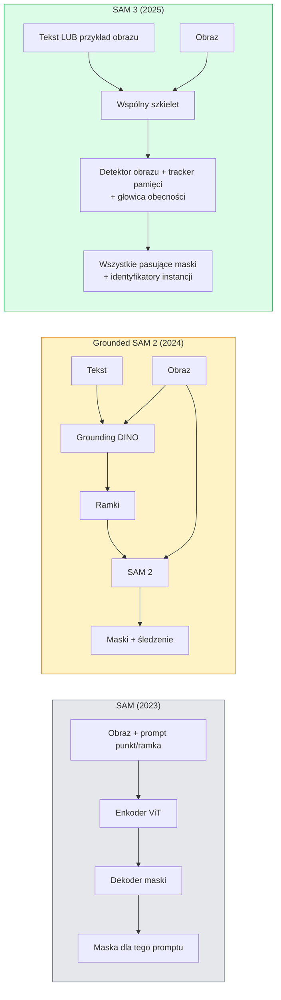

# SAM 3 & Segmentacja Otwartego Słownictwa

> Daj modelowi prompt tekstowy i obraz, a otrzymasz maski dla każdego pasującego obiektu. SAM 3 sprawił, że to jedno przejście w przód.

**Type:** Use + Build
**Languages:** Python
**Prerequisites:** Phase 4 Lesson 07 (U-Net), Phase 4 Lesson 08 (Mask R-CNN), Phase 4 Lesson 18 (CLIP)
**Time:** ~60 minut

## Cele Kształcenia

- Rozróżnić SAM (tylko prompt wizualny), Grounded SAM / SAM 2 (detektor + SAM) i SAM 3 (natywne prompty tekstowe przez Promptable Concept Segmentation)
- Wyjaśnić architekturę SAM 3: wspólny szkielet + detektor obrazu + tracker oparty na pamięci dla wideo + głowica obecności + odseparowany projekt detektor-tracker
- Użyć integracji Hugging Face `transformers` SAM 3 do detekcji, segmentacji i śledzenia wideo na prompt tekstowy
- Wybrać między SAM 3, Grounded SAM 2, YOLO-World i SAM-MI w oparciu o opóźnienie, złożoność koncepcji i platformę docelową

## Problem

SAM z 2023 był modelem tylko z promptem wizualnym: klikasz punkt lub rysujesz ramkę, a on zwraca maskę. Dla "pokaż mi wszystkie pomarańcze na tym zdjęciu" potrzebowałeś detektora (Grounding DINO) do produkcji ramek, a następnie SAM do segmentacji każdej. Grounded SAM zamienił to w pipeline, ale była to kaskada dwóch zamrożonych modeli z nieuniknioną akumulacją błędów.

SAM 3 (Meta, listopad 2025, ICLR 2026) skrócił kaskadę. Przyjmuje krótką frazę rzeczownikową lub przykład obrazu jako prompt i zwraca wszystkie pasujące maski i identyfikatory instancji w jednym przejściu w przód. To jest **Promptable Concept Segmentation (PCS)**. W połączeniu z aktualizacją Object Multiplex z marca 2026 (SAM 3.1), śledzi wiele instancji tego samego konceptu przez wideo wydajnie.

Ta lekcja dotyczy strukturalnej zmiany, jaką to reprezentuje. Segmentacja 2D, detekcja i dopasowanie tekst-obraz połączyły się w jeden model. Pytanie produkcyjne nie brzmi już "który pipeline łańcuchuję", ale "który model z promptem obsługuje mój przypadek użycia od końca do końca."

## Koncepcja

### Trzy generacje



### Promptable Concept Segmentation

"Prompt koncepcyjny" to krótka fraza rzeczownikowa (`"yellow school bus"`, `"striped red umbrella"`, `"hand holding a mug"`) lub przykład obrazu. Model zwraca maski segmentacji dla każdej instancji w obrazie pasującej do konceptu, plus unikalny identyfikator instancji na dopasowanie.

Różni się to od klasycznego SAM z promptem wizualnym na trzy sposoby:

1. Nie wymaga promptowania na instancję — jeden prompt tekstowy zwraca wszystkie dopasowania.
2. Otwarte słownictwo — koncept może być czymkolwiek opisywalnym w języku naturalnym.
3. Zwraca wiele instancji jednocześnie, a nie jedną maskę na prompt.

### Kluczowe elementy architektoniczne

- **Wspólny szkielet** — pojedynczy ViT przetwarza obraz. Zarówno głowica detektora, jak i tracker oparty na pamięci czytają z niego.
- **Głowica obecności** — przewiduje, czy koncept w ogóle występuje w obrazie. Rozdziela "czy to jest tutaj?" od "gdzie to jest?". Redukuje fałszywie pozytywne wyniki dla nieobecnych konceptów.
- **Odseparowany detektor-tracker** — detekcja na poziomie obrazu i śledzenie na poziomie wideo mają oddzielne głowice, aby nie przeszkadzały sobie.
- **Bank pamięci** — przechowuje cechy na instancję między klatkami do śledzenia wideo (ten sam mechanizm, którego używał SAM 2).

### Trenowanie w skali

SAM 3 został wytrenowany na **4 milionach unikalnych konceptów** wygenerowanych przez silnik danych, który iteracyjnie adnotuje i koryguje przy użyciu AI + recenzji ludzkiej. Nowy **benchmark SA-CO** zawiera 270K unikalnych konceptów, 50x więcej niż poprzednie benchmarki. SAM 3 osiąga 75-80% ludzkiej wydajności na SA-CO i podwaja istniejące systemy na obrazowym i wideo PCS.

### SAM 3.1 Object Multiplex

Aktualizacja z marca 2026: **Object Multiplex** wprowadza mechanizm współdzielonej pamięci do wspólnego śledzenia wielu instancji tego samego konceptu jednocześnie. Wcześniej śledzenie N instancji oznaczało N oddzielnych banków pamięci. Multiplex zwija je w jedną współdzieloną pamięć z zapytaniami na instancję. Wynik: znacznie szybsze śledzenie wielu obiektów bez poświęcania dokładności.

### Gdzie Grounded SAM wciąż ma znaczenie w 2026

- Gdy potrzebujesz konkretnego detektora otwartego słownictwa (DINO-X, Florence-2).
- Gdy licencja SAM 3 (kontrolowana na HF) jest blokerem.
- Gdy potrzebujesz więcej kontroli nad progiem detektora, niż udostępnia SAM 3.
- Do prac badawczych / ablacyjnych nad komponentem detektora.

Modularne pipeline wciąż mają swoje miejsce. Dla większości pracy produkcyjnej SAM 3 jest prostszą odpowiedzią.

### YOLO-World vs SAM 3

- **YOLO-World** — tylko detektor otwartego słownictwa (bez masek). Czas rzeczywisty. Najlepszy, gdy potrzebujesz ramek przy wysokim fps.
- **SAM 3** — pełna segmentacja + śledzenie. Wolniejszy, ale bogatsze wyjście.

Podział produkcyjny: YOLO-World dla szybkich pipeline tylko-detekcyjnych (nawigacja robotów, szybkie dashboardy), SAM 3 dla wszystkiego, co potrzebuje masek lub śledzenia.

### Wydajność SAM-MI

SAM-MI (2025-2026) rozwiązuje wąskie gardło dekodera SAM. Kluczowe pomysły:

- **Rzadkie promptowanie punktami** — używa kilku dobrze dobranych punktów zamiast gęstych promptów; redukuje wywołania dekodera o 96%.
- **Płytka agregacja masek** — łączy przybliżone predykcje masek w jedną ostrzejszą maskę.
- **Odseparowane wstrzykiwanie maski** — dekoder otrzymuje wstępnie obliczone cechy maski zamiast ponownego uruchamiania.

Wynik: ~1.6× przyspieszenie względem Grounded-SAM na benchmarkach otwartego słownictwa.

### Format wyjścia dla trzech modeli

Wszystkie zwracają tę samą ogólną strukturę (ramki + etykiety + wyniki + maski + ID), co jest pomocne — twój downstreamowy pipeline nie musi się rozgałęziać w zależności od tego, który model został uruchomiony.

## Zbuduj To

### Krok 1: Konstrukcja promptu

Zbuduj pomocnik, który zamienia zdanie użytkownika na listę promptów koncepcyjnych SAM 3. To jest granica, gdzie "co wpisał użytkownik" spotyka się z "co konsumuje model".

```python
def split_concepts(sentence):
    """
    Heurystyczny dzielnik dla promptów wielokoncepcyjnych.
    Zwraca listę krótkich fraz rzeczownikowych.
    """
    for sep in [",", ";", "and", "or", "&"]:
        if sep in sentence:
            parts = [p.strip() for p in sentence.replace("and ", ",").split(",")]
            return [p for p in parts if p]
    return [sentence.strip()]

print(split_concepts("cats, dogs and balloons"))
```

SAM 3 akceptuje jeden koncept na przejście w przód; dla zapytań wielokoncepcyjnych zapętlij lub batchnij je.

### Krok 2: Pomocniki postprocessingu

Zamień surowe wyjścia SAM 3 na czystą listę detekcji pasujących do naszego kontraktu pipeline z Lekcji 16 Fazy 4.

```python
from dataclasses import dataclass
from typing import List

@dataclass
class ConceptDetection:
    concept: str
    instance_id: int
    box: tuple          # (x1, y1, x2, y2)
    score: float
    mask_rle: str       # zakodowane długością serii


def rle_encode(binary_mask):
    flat = binary_mask.flatten().astype("uint8")
    runs = []
    prev, count = flat[0], 0
    for v in flat:
        if v == prev:
            count += 1
        else:
            runs.append((int(prev), count))
            prev, count = v, 1
    runs.append((int(prev), count))
    return ";".join(f"{v}x{c}" for v, c in runs)
```

RLE utrzymuje małe ładunki odpowiedzi nawet dla wielu wysokorozdzielczych masek. Ten sam format działa w SAM 2, SAM 3, Grounded SAM 2.

### Krok 3: Ujednolicony interfejs segmentacji otwartego słownictwa

Owiń dowolny backend (SAM 3, Grounded SAM 2, YOLO-World + SAM 2) za pojedynczą metodą. Twój downstreamowy kod nie zmienia się, gdy zmienia się backend.

```python
from abc import ABC, abstractmethod
import numpy as np

class OpenVocabSeg(ABC):
    @abstractmethod
    def detect(self, image: np.ndarray, concept: str) -> List[ConceptDetection]:
        ...


class StubOpenVocabSeg(OpenVocabSeg):
    """
    Deterministyczny stub używany do testowania pipeline, gdy prawdziwe modele nie są załadowane.
    """
    def detect(self, image, concept):
        h, w = image.shape[:2]
        return [
            ConceptDetection(
                concept=concept,
                instance_id=0,
                box=(w * 0.2, h * 0.3, w * 0.5, h * 0.8),
                score=0.89,
                mask_rle="0x100;1x50;0x200",
            ),
            ConceptDetection(
                concept=concept,
                instance_id=1,
                box=(w * 0.55, h * 0.25, w * 0.85, h * 0.75),
                score=0.74,
                mask_rle="0x80;1x40;0x220",
            ),
        ]
```

Prawdziwa podklasa `SAM3OpenVocabSeg` owijałaby `transformers.Sam3Model` i `Sam3Processor`.

### Krok 4: Użycie Hugging Face SAM 3 (referencja)

Dla rzeczywistego modelu, integracja `transformers`:

```python
from transformers import Sam3Processor, Sam3Model
import torch

processor = Sam3Processor.from_pretrained("facebook/sam3")
model = Sam3Model.from_pretrained("facebook/sam3").eval()

inputs = processor(images=pil_image, return_tensors="pt")
inputs = processor.set_text_prompt(inputs, "yellow school bus")

with torch.no_grad():
    outputs = model(**inputs)

masks = processor.post_process_masks(
    outputs.masks, inputs.original_sizes, inputs.reshaped_input_sizes
)
boxes = outputs.boxes
scores = outputs.scores
```

Jeden prompt, wszystkie dopasowania zwrócone w pojedynczym wywołaniu.

### Krok 5: Zmierz, co Grounded SAM 2 dawał za darmo

Uczciwy benchmark: co się dzieje, gdy zamienisz Grounded SAM 2 na SAM 3 w prawdziwym pipeline?

- Opóźnienie: SAM 3 oszczędza jedno przejście w przód (bez oddzielnego detektora), ale sam model jest cięższy; zwykle neutralny lub niewielkie przyspieszenie.
- Dokładność: SAM 3 znacznie lepszy na rzadkich lub kompozycyjnych konceptach ("striped red umbrella"). Podobny na typowych konceptach jednowyrazowych.
- Elastyczność: Grounded SAM 2 pozwala wymieniać detektory (DINO-X, Florence-2, Grounding DINO 1.5); SAM 3 jest monolityczny.

Wniosek: SAM 3 to domyślny wybór dla segmentacji otwartego słownictwa w 2026. Grounded SAM 2 to wciąż właściwa odpowiedź, gdy potrzebujesz elastyczności detektora lub innych warunków licencyjnych.

## Użyj Tego

Wzorce wdrożeń produkcyjnych:

- **Adnotacja w czasie rzeczywistym** — SAM 3 + funkcja CVAT label-as-text-prompt. Annotatorzy wybierają nazwę etykiety; SAM 3 wstępnie etykietuje każdą pasującą instancję. Przegląd i korekta.
- **Analityka wideo** — SAM 3.1 Object Multiplex do śledzenia wielu obiektów; podawaj klatki do trackera opartego na pamięci.
- **Robotyka** — SAM 3 do manipulacji otwartego słownictwa ("podnieś czerwony kubek"); działa jako prymityw planowania.
- **Obrazowanie medyczne** — SAM 3 dostrojony na konceptach medycznych; wymaga wniosku o dostęp na HF.

Ultralytics owija SAM 3 w swoim pakiecie Python:

```python
from ultralytics import SAM

model = SAM("sam3.pt")
results = model(image_path, prompts="yellow school bus")
```

Ten sam interfejs co YOLO i SAM 2.

## Dostarcz To

Ta lekcja produkuje:

- `outputs/prompt-open-vocab-stack-picker.md` — prompt wybierający SAM 3 / Grounded SAM 2 / YOLO-World / SAM-MI w oparciu o opóźnienie, złożoność konceptu i licencjonowanie.
- `outputs/skill-concept-prompt-designer.md` — umiejętność zamieniająca wypowiedzi użytkownika na dobrze sformułowane prompty koncepcyjne SAM 3 (dzielenie, ujednoznacznianie, awaryjne).

## Ćwiczenia

1. **(Łatwe)** Uruchom SAM 3 na 10 obrazach z wybranymi przez siebie promptami koncepcyjnymi. Porównaj z SAM 2 + Grounding DINO 1.5 na tych samych obrazach. Raportuj, które koncepty każdy model przegapił.
2. **(Średnie)** Zbuduj interfejs "kliknij, aby dołączyć / kliknij, aby wykluczyć" na SAM 3: prompt tekstowy zwraca kandydatów na instancje; użytkownik klika, które uznać za pozytywne. Wyjściem jest końcowy zestaw konceptów jako JSON.
3. **(Trudne)** Dostrój SAM 3 na niestandardowym zestawie konceptów (np. 5 typów komponentów elektronicznych) z 20 oznakowanymi obrazami każdy. Porównaj z zerokadrowym SAM 3 na tym samym zestawie testowym; zmierz poprawę IoU maski.

## Kluczowe Pojęcia

| Termin | Co ludzie mówią | Co faktycznie oznacza |
|--------|-----------------|----------------------|
| Segmentacja otwartego słownictwa | "Segmentuj przez tekst" | Produkuj maski dla obiektów opisanych w języku naturalnym, a nie w stałym zestawie etykiet |
| PCS | "Promptable Concept Segmentation" | Główne zadanie SAM 3 — mając frazę rzeczownikową lub przykład obrazu, segmentuj wszystkie pasujące instancje |
| Prompt koncepcyjny | "Wejście tekstowe" | Krótka fraza rzeczownikowa lub przykład obrazu; nie pełne zdanie |
| Głowica obecności | "Czy to tu jest?" | Moduł SAM 3 decydujący, czy koncept istnieje w obrazie przed lokalizacją |
| SA-CO | "Benchmark SAM 3" | 270K-koncepcyjny benchmark segmentacji otwartego słownictwa; 50x większy niż poprzednie benchmarki |
| Object Multiplex | "Aktualizacja SAM 3.1" | Współdzielona pamięć do śledzenia wielu obiektów; szybkie wspólne śledzenie wielu instancji |
| Grounded SAM 2 | "Pipeline modularny" | Kaskada detektor + SAM 2; wciąż istotna, gdy zmiana detektora ma znaczenie |
| SAM-MI | "Wydajny wariant SAM" | Wstrzykiwanie maski dla 1.6x przyspieszenia względem Grounded-SAM |

## Dalsza Lektura

- [SAM 3: Segment Anything with Concepts (arXiv 2511.16719)](https://arxiv.org/abs/2511.16719)
- [SAM 3.1 Object Multiplex (Meta AI, March 2026)](https://ai.meta.com/blog/segment-anything-model-3/)
- [SAM 3 model page on Hugging Face](https://huggingface.co/facebook/sam3)
- [Grounded SAM 2 tutorial (PyImageSearch)](https://pyimagesearch.com/2026/01/19/grounded-sam-2-from-open-set-detection-to-segmentation-and-tracking/)
- [Ultralytics SAM 3 docs](https://docs.ultralytics.com/models/sam-3/)
- [SAM3-I: Instruction-aware SAM (arXiv 2512.04585)](https://arxiv.org/abs/2512.04585)