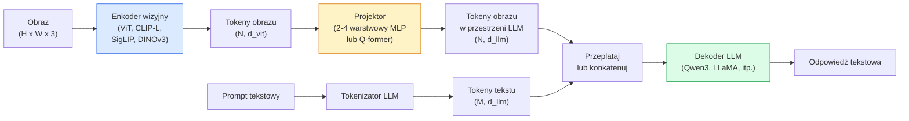

# Modele Wizyjno-Językowe — Wzorzec ViT-MLP-LLM

> Enkoder wizyjny zamienia obraz w tokeny. MLP projektor mapuje te tokeny do przestrzeni embeddingu LLM. Model językowy robi resztę. Ten wzorzec — ViT-MLP-LLM — to każdy produkcyjny VLM w 2026.

**Type:** Learn + Use
**Languages:** Python
**Prerequisites:** Phase 4 Lesson 14 (ViT), Phase 4 Lesson 18 (CLIP), Phase 7 Lesson 02 (Self-Attention)
**Time:** ~75 minut

## Cele Kształcenia

- Opisać architekturę ViT-MLP-LLM i wyjaśnić, co wnosi każdy z trzech komponentów
- Porównać Qwen3-VL, InternVL3.5, LLaVA-Next i GLM-4.6V pod względem liczby parametrów, długości kontekstu i wydajności benchmarkowej
- Wyjaśnić DeepStack: dlaczego wielopoziomowe cechy ViT zaciskają dopasowanie wizyjno-językowe lepiej niż pojedyncza cecha z ostatniej warstwy
- Zmierzyć halucynację VLM w produkcji za pomocą Cross-Modal Error Rate (CMER) i działać na sygnale

## Problem

CLIP (Faza 4 Lekcja 18) daje wspólną przestrzeń embeddingu dla obrazów i tekstu, co wystarcza do zerokadrowej klasyfikacji i wyszukiwania. Nie może odpowiedzieć "ile czerwonych samochodów jest na tym obrazie?", ponieważ CLIP nie generuje tekstu — tylko ocenia podobieństwa.

Modele Wizyjno-Językowe (VLM) — Qwen3-VL, InternVL3.5, LLaVA-Next, GLM-4.6V — łączą enkoder obrazu z rodziny CLIP z pełnym modelem językowym. Model widzi obraz plus pytanie i generuje odpowiedź. W 2026 roku VLM typu open source dorównują lub przewyższają GPT-5 i Gemini-2.5-Pro w multimodalnych benchmarkach (MMMU, MMBench, DocVQA, ChartQA, MathVista, OSWorld).

Trójka elementów (ViT, projektor, LLM) jest standardem. Różnice między modelami dotyczą tego, który ViT, który projektor, który LLM, dane treningowe i przepis na dopasowanie. Gdy zrozumiesz wzorzec, wymiana dowolnego komponentu jest mechaniczna.

## Koncepcja

### Architektura ViT-MLP-LLM



1. **Enkoder wizyjny** — wytrenowany ViT (CLIP-L/14, SigLIP, DINOv3 lub dostrojony wariant). Produkuje tokeny łat.
2. **Projektor** — mały moduł (2-4 warstwowy MLP lub Q-former), który mapuje tokeny wizyjne do wymiaru embeddingu LLM. To tutaj odbywa się większość dostrajania.
3. **LLM** — model językowy tylko-dekoder (Qwen3, Llama, Mistral, GLM, InternLM). Czyta tokeny wizyjne + tekstowe w sekwencji, generuje tekst.

Wszystkie trzy elementy są w zasadzie trenowalne. W praktyce enkoder wizyjny i LLM pozostają głównie zamrożone, podczas gdy projektor trenuje — kilka miliardów parametrów sygnału tanio.

### DeepStack

Zwykła projekcja używa tylko ostatniej warstwy ViT. DeepStack (Qwen3-VL) próbkuje cechy z wielu głębokości ViT i układa je w stos. Głębsze warstwy niosą semantykę wysokiego poziomu; płytsze warstwy niosą drobnoziarnistą informację przestrzenną i teksturalną. Podawanie obu do LLM zamyka lukę między "co zawiera obraz" (semantyka) a "gdzie dokładnie" (zakotwiczenie przestrzenne).

### Trzy etapy treningu

Nowoczesne VLM trenują w etapach:

1. **Dopasowanie** — zamroź ViT i LLM. Trenuj tylko projektor na parach obraz-podpis. Uczy projektor mapować przestrzeń wizyjną do przestrzeni językowej.
2. **Pretrening** — odmroź wszystko. Trenuj na wielkoskalowych przeplatanych danych obraz-tekst (500M+ par). Buduje wiedzę wizualną modelu.
3. **Dostrajanie instrukcyjne** — dostrój na starannie wyselekcjonowanych trójkach (obraz, pytanie, odpowiedź). Uczy zachowania konwersacyjnego i formatów zadań. To właśnie zamienia "świadomy wizyjnie LM" w użytecznego asystenta.

Większość dostrojeń LoRA celuje w etap 3 z małym oznakowanym zbiorem danych.

### Porównanie rodzin modeli (początek 2026)

| Model | Parametry | Enkoder wizyjny | LLM | Kontekst | Mocne strony |
|-------|-----------|-----------------|-----|----------|--------------|
| Qwen3-VL-235B-A22B (MoE) | 235B (22B aktywne) | własny ViT + DeepStack | Qwen3 | 256K | Ogólny SOTA, agent GUI |
| Qwen3-VL-30B-A3B (MoE) | 30B (3B aktywne) | własny ViT + DeepStack | Qwen3 | 256K | Mniejsza alternatywa MoE |
| Qwen3-VL-8B (gęsty) | 8B | własny ViT | Qwen3 | 128K | Produkcyjny gęsty domyślny |
| InternVL3.5-38B | 38B | InternViT-6B | Qwen3 + GPT-OSS | 128K | Silny MMBench / MMVet |
| InternVL3.5-241B-A28B | 241B (28B aktywne) | InternViT-6B | Qwen3 | 128K | Konkurencyjny z GPT-4o |
| LLaVA-Next 72B | 72B | SigLIP | Llama-3 | 32K | Otwarty, łatwy do dostrojenia |
| GLM-4.6V | ~70B | własny | GLM | 64K | Otwarty, silne OCR |
| MiniCPM-V-2.6 | 8B | SigLIP | MiniCPM | 32K | Przyjazny dla urządzeń brzegowych |

### Agenci wizualni

Qwen3-VL-235B osiąga najwyższą globalną wydajność na OSWorld — benchmarku dla **agentów wizualnych**, którzy obsługują GUI (desktop, mobile, web). Model widzi zrzut ekranu, rozumie UI i emituje akcje (kliknij, wpisz, przewiń). W połączeniu z narzędziami zamyka pętlę na typowych zadaniach biurkowych. To właśnie pod maską większości "AI PC" w 2026.

### Zdolności agencyjne + warianty RoPE

VLM muszą wiedzieć **kiedy** klatka jest w filmie. Qwen3-VL ewoluował od T-RoPE (czasowe rotary position embeddings) do **tekstowego dopasowania czasu** — jawne tokeny timestamp tekstowe przeplatane z klatkami wideo. Model widzi "`<timestamp 00:32>` frame, prompt" i może rozumować o związkach czasowych.

### Problem dopasowania

12% par obraz-tekst w przeszukanym zbiorze danych zawiera opisy, które nie są w pełni zakotwiczone w obrazie. VLM wytrenowany na tym po cichu uczy się halucynować — wymyślać obiekty, błędnie odczytywać liczby, wymyślać związki. W produkcji jest to dominujący tryb awarii.

Skywork.ai wprowadził **Cross-Modal Error Rate (CMER)**, aby to śledzić:

```
CMER = frakcja wyników, gdzie pewność tekstowa jest wysoka, ale podobieństwo obraz-tekst (przez checker z rodziny CLIP) jest niskie
```

Wysoki CMER oznacza, że model z pewnością mówi rzeczy niezakotwiczone w obrazie. Monitorowanie CMER i traktowanie go jako produkcyjnego KPI zmniejszyło wskaźnik halucynacji o ~35% w ich wdrożeniu. Sztuczka polega nie na "naprawieniu modelu", ale na "kierowaniu wyników o wysokim CMER do recenzji ludzkiej."

### Dostrajanie z LoRA / QLoRA

Pełne dostrojenie 70B VLM jest poza zasięgiem większości zespołów. LoRA (ranga 16-64) na warstwach uwagi + projektora, lub QLoRA z 4-bitowymi wagami bazowymi, mieści się na pojedynczym A100 / H100. Koszt: 5,000-50,000 przykładów, $100-$5,000 w obliczeniach, 2-10 godzin treningu.

### Rozumowanie przestrzenne jest wciąż słabe

Obecne VLM uzyskują 50-60% na benchmarkach rozumowania przestrzennego (nad-pod, lewo-prawo, liczenie, odległość). Jeśli twój przypadek użycia zależy od "który obiekt jest na którym," waliduj intensywnie — ogólna wydajność VLM jest poniżej ludzkiej. Lepsze alternatywy dla czysto przestrzennych zadań: wyspecjalizowany estymator punktów kluczowych / pozy, model głębokości lub model detekcji z post-processowaną geometrią ramek.

## Zbuduj To

### Krok 1: Projektor

Część, którą będziesz trenować najczęściej. 2-4 warstwowy MLP z GELU.

```python
import torch
import torch.nn as nn


class Projector(nn.Module):
    def __init__(self, vit_dim=768, llm_dim=4096, hidden=4096):
        super().__init__()
        self.net = nn.Sequential(
            nn.Linear(vit_dim, hidden),
            nn.GELU(),
            nn.Linear(hidden, llm_dim),
        )

    def forward(self, x):
        return self.net(x)
```

Wejście to tensor tokenów `(N_patches, d_vit)`. Wyjście to `(N_patches, d_llm)`. LLM traktuje każdy wiersz wyjścia jako kolejny token.

### Krok 2: Złóż ViT-MLP-LLM od końca do końca

Szkielet przejścia w przód dla minimalnego VLM. Prawdziwy kod używa `transformers`; to jest układ koncepcyjny.

```python
class MinimalVLM(nn.Module):
    def __init__(self, vit, projector, llm, image_token_id):
        super().__init__()
        self.vit = vit
        self.projector = projector
        self.llm = llm
        self.image_token_id = image_token_id  # token zastępczy w prompcie tekstowym

    def forward(self, image, input_ids, attention_mask):
        # 1. cechy wizyjne
        vision_tokens = self.vit(image)                     # (B, N_patches, d_vit)
        vision_embeds = self.projector(vision_tokens)       # (B, N_patches, d_llm)

        # 2. embeddingi tekstowe
        text_embeds = self.llm.get_input_embeddings()(input_ids)  # (B, M, d_llm)

        # 3. zastąp tokeny zastępcze obrazu embeddingami wizyjnymi
        merged = self._merge(text_embeds, vision_embeds, input_ids)

        # 4. uruchom LLM
        return self.llm(inputs_embeds=merged, attention_mask=attention_mask)

    def _merge(self, text_embeds, vision_embeds, input_ids):
        out = text_embeds.clone()
        expected = vision_embeds.size(1)
        for b in range(input_ids.size(0)):
            positions = (input_ids[b] == self.image_token_id).nonzero(as_tuple=True)[0]
            if len(positions) != expected:
                raise ValueError(
                    f"batch item {b} has {len(positions)} image tokens but vision_embeds has {expected} patches."
                    " Every sample in the batch must be pre-padded to the same number of image placeholder tokens.")
            out[b, positions] = vision_embeds[b]
        return out
```

Token zastępczy `<image>` w tekście zostaje zastąpiony rzeczywistymi embeddingami obrazu — ten sam wzór, którego używają LLaVA, Qwen-VL i InternVL.

### Krok 3: Obliczanie CMER

Lekka kontrola w czasie wykonania.

```python
import torch.nn.functional as F


def cross_modal_error_rate(image_emb, text_emb, text_confidence, sim_threshold=0.25, conf_threshold=0.8):
    """
    image_emb, text_emb: embeddingi obrazu i wygenerowanego tekstu (normalizowane wewnętrznie)
    text_confidence:     średnie prawdopodobieństwo na token w [0, 1]
    Zwraca:              frakcję wyników o wysokiej pewności z niskim dopasowaniem obraz-tekst
    """
    image_emb = F.normalize(image_emb, dim=-1)
    text_emb = F.normalize(text_emb, dim=-1)
    sim = (image_emb * text_emb).sum(dim=-1)        # podobieństwo cosinusowe
    high_conf_low_sim = (text_confidence > conf_threshold) & (sim < sim_threshold)
    return high_conf_low_sim.float().mean().item()
```

Traktuj CMER jako produkcyjny KPI. Monitoruj go na endpunkt, na typ promptu, na klienta. Rosnący CMER wskazuje, że model zaczyna halucynować na jakiejś dystrybucji wejściowej.

### Krok 4: Zabawkowy klasyfikator VLM (uruchamialny)

Zademonstruj, że projektor trenuje. Sztuczne "cechy ViT" wchodzą; mały token w stylu LLM przewiduje klasę.

```python
class ToyVLM(nn.Module):
    def __init__(self, vit_dim=32, llm_dim=64, num_classes=5):
        super().__init__()
        self.projector = Projector(vit_dim, llm_dim, hidden=64)
        self.head = nn.Linear(llm_dim, num_classes)

    def forward(self, vision_tokens):
        projected = self.projector(vision_tokens)
        pooled = projected.mean(dim=1)
        return self.head(pooled)
```

Można to dopasować na syntetycznych parach (cecha, klasa) w poniżej 200 krokach — wystarczy, aby pokazać, że wzorzec projektora działa.

## Użyj Tego

Trzy sposoby, w jakie zespoły produkcyjne używają VLM w 2026:

- **Hostowane API** — OpenAI Vision, Anthropic Claude Vision, Google Gemini Vision. Zero infrastruktury, ryzyko vendor lock-in.
- **Samodzielne hostowanie open source** — Qwen3-VL lub InternVL3.5 przez `transformers` i `vllm`. Pełna kontrola, wyższy początkowy wysiłek.
- **Dostrojenie domenowe** — załaduj Qwen2.5-VL-7B lub LLaVA-1.6-7B, LoRA na 5k-50k niestandardowych przykładów, serwuj z `vllm` lub `TGI`.

```python
from transformers import AutoProcessor, AutoModelForVision2Seq
import torch
from PIL import Image

model_id = "Qwen/Qwen3-VL-8B-Instruct"
processor = AutoProcessor.from_pretrained(model_id)
model = AutoModelForVision2Seq.from_pretrained(model_id, torch_dtype=torch.bfloat16, device_map="auto")

messages = [{
    "role": "user",
    "content": [
        {"type": "image", "image": Image.open("plot.png")},
        {"type": "text", "text": "What does this chart show?"},
    ],
}]
inputs = processor.apply_chat_template(messages, add_generation_prompt=True, tokenize=True, return_dict=True, return_tensors="pt").to("cuda")
generated = model.generate(**inputs, max_new_tokens=256)
answer = processor.decode(generated[0][inputs["input_ids"].shape[1]:], skip_special_tokens=True)
```

`apply_chat_template` ukrywa tokenizację tokena zastępczego `<image>`; model obsługuje scalanie wewnętrznie.

## Dostarcz To

Ta lekcja produkuje:

- `outputs/prompt-vlm-selector.md` — wybiera Qwen3-VL / InternVL3.5 / LLaVA-Next / API dla danych wymagań dokładności, opóźnienia, długości kontekstu i budżetu.
- `outputs/skill-cmer-monitor.md` — emituje kod do instrumentowania produkcyjnego endpunktu VLM z cross-modal error rate, dashboardami na endpunkt i progami alarmowania.

## Ćwiczenia

1. **(Łatwe)** Uruchom trzy prompty ("what is this?", "count the objects", "describe the scene") przez dowolny otwarty VLM na pięciu obrazach. Oceń każdą odpowiedź jako poprawną / częściowo poprawną / halucynację ręcznie. Oblicz wstępny wskaźnik podobny do CMER.
2. **(Średnie)** Dostrój Qwen2.5-VL-3B lub LLaVA-1.6-7B z LoRA (ranga 16) na 500 obrazach domeny docelowej z podpisami. Porównaj dokładność w stylu MMBench zerokadrowo vs po dostrojeniu.
3. **(Trudne)** Zastąp enkoder obrazu VLM DINOv3 zamiast domyślnego SigLIP/CLIP. Trenuj tylko projektor (zamrożony LLM + zamrożony DINOv3). Zmierz, czy zadania gęstej predykcji (liczenie, rozumowanie przestrzenne) ulegają poprawie.

## Kluczowe Pojęcia

| Termin | Co ludzie mówią | Co faktycznie oznacza |
|--------|-----------------|----------------------|
| ViT-MLP-LLM | "Wzorzec VLM" | Enkoder wizyjny + projektor + model językowy; każdy VLM w 2026 |
| Projektor | "Most" | 2-4 warstwowy MLP (lub Q-former) mapujący tokeny wizyjne do przestrzeni embeddingu LLM |
| DeepStack | "Trik cech Qwen3-VL" | Wielopoziomowe cechy ViT ułożone w stos, a nie tylko ostatnia warstwa |
| Token obrazu | "Znacznik <image>" | Specjalny token w strumieniu tekstowym zastępowany rzutowanymi embeddingami wizyjnymi |
| CMER | "KPI halucynacji" | Cross-Modal Error Rate; wysoki, gdy pewność tekstowa jest wysoka, ale podobieństwo obraz-tekst niskie |
| Agent wizualny | "VLM, który klika" | VLM obsługujący GUI (OSWorld, mobile, web) z wywołaniami narzędzi |
| Q-former | "Most o stałej liczbie tokenów" | Projektor w stylu BLIP-2 produkujący stałą liczbę wizyjnych tokenów zapytań |
| Dopasowanie / pretrening / dostrajanie instrukcyjne | "Trzy etapy" | Standardowy pipeline treningowy VLM |

## Dalsza Lektura

- [Qwen3-VL Technical Report (arXiv 2511.21631)](https://arxiv.org/abs/2511.21631)
- [InternVL3.5 Advancing Open-Source Multimodal Models (arXiv 2508.18265)](https://arxiv.org/html/2508.18265v1)
- [LLaVA-Next series](https://llava-vl.github.io/blog/2024-05-10-llava-next-stronger-llms/)
- [BentoML: Best Open-Source VLMs 2026](https://www.bentoml.com/blog/multimodal-ai-a-guide-to-open-source-vision-language-models)
- [MMMU: Multi-discipline Multimodal Understanding benchmark](https://mmmu-benchmark.github.io/)
- [VLMs in manufacturing (Robotics Tomorrow, March 2026)](https://www.roboticstomorrow.com/story/2026/03/when-machines-learn-to-see-like-experts-the-rise-of-vision-language-models-in-manufacturing/26335/)