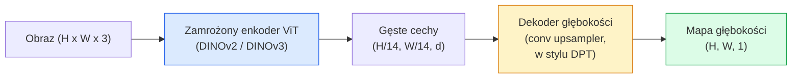

# Głębokość Monokularna & Estymacja Geometrii

> Mapa głębokości to obraz jednokanałowy, gdzie każdy piksel to odległość od kamery. Przewidywanie jej z pojedynczej klatki RGB było kiedyś niemożliwe bez stereo lub LiDAR. W 2026 zamrożony enkoder ViT plus lekka głowica mieści się w kilku procentach od prawdy podstawowej.

**Type:** Build + Use
**Languages:** Python
**Prerequisites:** Phase 4 Lesson 14 (ViT), Phase 4 Lesson 17 (Self-Supervised Vision), Phase 4 Lesson 07 (U-Net)
**Time:** ~60 minut

## Cele Kształcenia

- Rozróżnić głębokość względną i metryczną oraz określić, którą rozwiązuje każdy produkcyjny model (MiDaS, Marigold, Depth Anything V3, ZoeDepth)
- Użyć Depth Anything V3 (szkielet DINOv2) do przewidywania głębokości dla dowolnych pojedynczych obrazów bez kalibracji
- Wyjaśnić, dlaczego głębokość monokularna w ogóle działa z pojedynczego obrazu (wskazówki perspektywy, gradienty tekstury, wyuczone priorytety) i czego nie może odzyskać (bezwzględna skala, przesłonięta geometria)
- Podnieść detekcje 2D do punktów 3D używając mapy głębokości i intrinsików kamery otworkowej

## Problem

Głębokość to brakująca oś w 2D wizji komputerowej. Mając RGB, wiesz, gdzie rzeczy pojawiają się w płaszczyźnie obrazu; nie wiesz, jak daleko są. Czujniki głębokości (rigi stereo, LiDAR, time-of-flight) rozwiązują to bezpośrednio, ale są drogie, delikatne i ograniczone zasięgiem.

Estymacja głębokości monokularnej — przewidywanie głębokości z pojedynczej klatki RGB — produkowała kiedyś rozmyte, zawodne wyniki. Do 2026 roku duże wytrenowane enkodery to zmieniły: Depth Anything V3 używa zamrożonego szkieletu DINOv2 i produkuje mapy głębokości, które generalizują na domeny wewnętrzne, zewnętrzne, medyczne i satelitarne. Marigold przeformułowuje głębokość jako problem warunkowej dyfuzji. ZoeDepth regresuje prawdziwe odległości metryczne.

Głębokość jest również mostem między detekcją 2D a rozumieniem 3D: pomnóż piksele wykrytej ramki przez głębokość, a podnosisz obiekt 2D do chmury punktów 3D. To jest sedno każdego systemu okluzji AR, każdego pipeline unikania przeszkód i każdego robota "podnieś kubek."

## Koncepcja

### Głębokość względna vs metryczna

- **Głębokość względna** — uporządkowane wartości `z` bez jednostki ze świata rzeczywistego. "Piksel A jest bliżej niż piksel B, ale stosunek odległości nie jest zakotwiczony w metrach."
- **Głębokość metryczna** — bezwzględna odległość w metrach od kamery. Wymaga, aby model nauczył się statystycznej zależności między wskazówkami obrazu a rzeczywistą odległością.

MiDaS i Depth Anything V3 produkują głębokość względną. Marigold produkuje głębokość względną. ZoeDepth, UniDepth i Metric3D produkują głębokość metryczną. Modele metryczne są wrażliwe na intrisiki kamery; modele względne nie.

### Wzorzec enkoder-dekoder



Depth Anything V3 zamraża enkoder i trenuje tylko dekoder w stylu DPT. Enkoder dostarcza bogate cechy; dekoder interpoluje je z powrotem do rozdzielczości obrazu i regresuje głębokość.

### Dlaczego pojedynczy obraz w ogóle produkuje głębokość

Obraz 2D zawiera wiele wskazówek monokularnych skorelowanych z głębokością:

- **Perspektywa** — linie równoległe w 3D zbiegają się w 2D.
- **Gradient tekstury** — powierzchnie daleko mają mniejszą, gęstszą teksturę.
- **Kolejność okluzji** — bliższe obiekty przesłaniają dalsze.
- **Stałość rozmiaru** — znane obiekty (samochody, ludzie) dają przybliżoną skalę.
- **Perspektywa atmosferyczna** — odległe obiekty wydają się bardziej zamglone i niebieskie w scenach zewnętrznych.

ViT wytrenowany na miliardach obrazów internalizuje te wskazówki. Z wystarczającą ilością danych i silnym szkieletem, głębokość monokularna osiąga rozsądną dokładność bez żadnego jawnego nadzoru 3D.

### Czego głębokość monokularna nie może zrobić

- **Bezwzględnej skali metrycznej** bez intrinsików lub znanego obiektu w scenie. Sieć może przewidzieć "kubek jest dwa razy dalej niż łyżka" bez wiedzy, czy kubek jest 1 m czy 10 m dalej.
- **Przesłoniętej geometrii** — tył krzesła jest niewidoczny i nie może być wiarygodnie wywnioskowany.
- **Naprawdę bezteksturowe / odblaskowe powierzchnie** — lustra, szkło, jednolite ściany. Sieć raportuje prawdopodobną, ale błędną głębokość.

### Depth Anything V3 w 2026

- Zwykły DINOv2 ViT-L/14 jako enkoder (zamrożony).
- Dekoder DPT.
- Trenowany na sparowanych obrazach z różnych źródeł (bez jawnego nadzoru głębokości poza spójnością fotometryczną).
- Przewiduje przestrzennie spójną geometrię z **dowolnej liczby wejść wizualnych, ze znanymi lub nieznanymi pozycjami kamery**.
- SOTA w głębokości monokularnej, geometrii dowolnego widoku, renderowaniu wizualnym, estymacji pozy kamery.

To jest model do wstawienia, gdy potrzebujesz głębokości w 2026.

### Marigold — dyfuzja dla głębokości

Marigold (Ke et al., CVPR 2024) przeformułowuje estymację głębokości jako warunkową dyfuzję obraz-do-obrazu. Warunkowanie: RGB. Cel: mapa głębokości. Używa wytrenowanego Stable Diffusion 2 U-Net jako szkieletu. Wynikowe mapy głębokości są wyjątkowo ostre na granicach obiektów. Kompromis: wolniejsza inferencja niż modele feed-forward (10-50 kroków denoisingu).

### Intrinsiki i kamera otworkowa

Aby podnieść piksel `(u, v)` z głębokością `d` do punktu 3D `(X, Y, Z)` we współrzędnych kamery:

```
fx, fy, cx, cy = intrinsiki kamery
X = (u - cx) * d / fx
Y = (v - cy) * d / fy
Z = d
```

Intrinsiki pochodzą z metadanych EXIF, wzorca kalibracyjnego lub monokularnego estymatora intrinsików (Perspective Fields, UniDepth). Bez intrinsików możesz wciąż renderować chmurę punktów, zakładając 60-70° FOV i umiarkowaną rozdzielczość — użyteczne do wizualizacji, nie do pomiarów.

### Ewaluacja

Dwie standardowe metryki:

- **AbsRel** (bezwzględny błąd względny): `mean(|d_pred - d_gt| / d_gt)`. Niższy znaczy lepszy. 0.05-0.1 dla modeli produkcyjnych.
- **delta < 1.25** (dokładność progowa): frakcja pikseli, gdzie `max(d_pred/d_gt, d_gt/d_pred) < 1.25`. Wyższy znaczy lepszy. 0.9+ dla SOTA.

Dla głębokości względnej (Depth Anything V3, MiDaS), ewaluacja używa wariantów obu metryk niezmienniczych na skalę i przesunięcie.

## Zbuduj To

### Krok 1: Metryki głębokości

```python
import torch

def abs_rel_error(pred, target, mask=None):
    if mask is not None:
        pred = pred[mask]
        target = target[mask]
    return (torch.abs(pred - target) / target.clamp(min=1e-6)).mean().item()


def delta_accuracy(pred, target, threshold=1.25, mask=None):
    if mask is not None:
        pred = pred[mask]
        target = target[mask]
    ratio = torch.maximum(pred / target.clamp(min=1e-6), target / pred.clamp(min=1e-6))
    return (ratio < threshold).float().mean().item()
```

Zawsze maskuj nieprawidłowe piksele głębokości (zero, NaN, nasycone) przed ewaluacją.

### Krok 2: Dopasowanie skali i przesunięcia

Dla modeli głębokości względnej, dopasuj predykcję do prawdy podstawowej przed obliczeniem metryk. Dopasowanie metodą najmniejszych kwadratów `a * pred + b = target`:

```python
def align_scale_shift(pred, target, mask=None):
    if mask is not None:
        p = pred[mask]
        t = target[mask]
    else:
        p = pred.flatten()
        t = target.flatten()
    A = torch.stack([p, torch.ones_like(p)], dim=1)
    coeffs, *_ = torch.linalg.lstsq(A, t.unsqueeze(-1))
    a, b = coeffs[:2, 0]
    return a * pred + b
```

Uruchom `align_scale_shift` przed `abs_rel_error` przy ewaluacji MiDaS / Depth Anything.

### Krok 3: Podnieś głębokość do chmury punktów

```python
import numpy as np

def depth_to_point_cloud(depth, intrinsics):
    H, W = depth.shape
    fx, fy, cx, cy = intrinsics
    v, u = np.meshgrid(np.arange(H), np.arange(W), indexing="ij")
    z = depth
    x = (u - cx) * z / fx
    y = (v - cy) * z / fy
    return np.stack([x, y, z], axis=-1)


depth = np.random.uniform(0.5, 4.0, (240, 320))
intr = (320.0, 320.0, 160.0, 120.0)
pc = depth_to_point_cloud(depth, intr)
print(f"point cloud shape: {pc.shape}  (H, W, 3)")
```

Jedna funkcja, każda aplikacja 3D. Eksportuj chmurę punktów do `.ply` i otwórz w MeshLab lub CloudCompare.

### Krok 4: Test dymny z syntetyczną sceną głębokości

```python
def synthetic_depth(size=96):
    yy, xx = np.meshgrid(np.arange(size), np.arange(size), indexing="ij")
    # Podłoga: gradient liniowy od blisko (góra) do daleko (dół)
    depth = 1.0 + (yy / size) * 4.0
    # Pudełko na środku: bliżej
    mask = (np.abs(xx - size / 2) < size / 6) & (np.abs(yy - size * 0.6) < size / 6)
    depth[mask] = 2.0
    return depth.astype(np.float32)


gt = torch.from_numpy(synthetic_depth(96))
pred = gt + 0.3 * torch.randn_like(gt)  # symulowana predykcja
aligned = align_scale_shift(pred, gt)
print(f"before align  absRel = {abs_rel_error(pred, gt):.3f}")
print(f"after align   absRel = {abs_rel_error(aligned, gt):.3f}")
```

### Krok 5: Użycie Depth Anything V3 (referencja)

```python
import torch
from transformers import pipeline
from PIL import Image

pipe = pipeline(task="depth-estimation", model="LiheYoung/depth-anything-v2-large")

image = Image.open("street.jpg").convert("RGB")
out = pipe(image)
depth_np = np.array(out["depth"])
```

Trzy linie. `out["depth"]` to PIL grayscale; przekonwertuj do numpy do obliczeń. Dla Depth Anything V3 konkretnie, zamień id modelu po wydaniu; API pozostaje niezmienione.

## Użyj Tego

- **Depth Anything V3** (Meta AI / ByteDance, 2024-2026) — domyślny dla głębokości względnej. Najszybszy model z backbone'em ViT-large w produkcji.
- **Marigold** (ETH, 2024) — najwyższa jakość wizualna, wolna inferencja.
- **UniDepth** (ETH, 2024) — głębokość metryczna z estymacją intrinsików kamery.
- **ZoeDepth** (Intel, 2023) — głębokość metryczna; starszy, wciąż niezawodny.
- **MiDaS v3.1** — przestarzały, ale stabilny; dobry baseline do porównań.

Typowy wzorzec integracji:

1. Klatka RGB przychodzi.
2. Model głębokości produkuje mapę głębokości.
3. Detektor produkuje ramki.
4. Podnieś centroidy ramek przez głębokość do 3D; scal z chmurą punktów, jeśli dostępna.
5. Downstream: okluzja AR, planowanie ścieżki, estymacja rozmiaru obiektu, zamiennik stereo.

Do użytku w czasie rzeczywistym, Depth Anything V2 Small (INT8 skwantyzowany) osiąga ~30 fps na konsumenckim GPU przy 518x518.

## Dostarcz To

Ta lekcja produkuje:

- `outputs/prompt-depth-model-picker.md` — wybiera między Depth Anything V3, Marigold, UniDepth, MiDaS dla danych wymagań opóźnienia, potrzeby metrycznej-vs-względnej i typu sceny.
- `outputs/skill-depth-to-pointcloud.md` — umiejętność budująca chmury punktów z map głębokości z poprawną obsługą intrinsików i eksportem do `.ply`.

## Ćwiczenia

1. **(Łatwe)** Uruchom Depth Anything V2 na dowolnych 10 obrazach swojego biurka. Zapisz głębokość jako grayscale PNG i sprawdź. Zidentyfikuj jeden obiekt, którego przewidziana głębokość wygląda źle i wyjaśnij, dlaczego wskazówki monokularne zawiodły.
2. **(Średnie)** Mając RGB + głębokość z Depth Anything V2, podnieś do chmury punktów i wyrenderuj z `open3d`. Porównaj dwie sceny (wewnętrzna / zewnętrzna) i zanotuj, która wygląda bardziej wiarygodnie.
3. **(Trudne)** Weź pięć par obrazów różniących się tylko pozycją znanego obiektu (np. butelka przesunięta o 30 cm bliżej). Użyj UniDepth do przewidzenia głębokości metrycznej na obu. Raportuj przewidzianą różnicę odległości vs prawdziwe 30 cm.

## Kluczowe Pojęcia

| Termin | Co ludzie mówią | Co faktycznie oznacza |
|--------|-----------------|----------------------|
| Głębokość monokularna | "Głębokość z jednego obrazu" | Estymacja głębokości z jednej klatki RGB, bez stereo ani LiDAR |
| Głębokość względna | "Uporządkowana głębokość" | Uporządkowane wartości z bez jednostek ze świata rzeczywistego |
| Głębokość metryczna | "Bezwzględna odległość" | Głębokość w metrach; wymaga kalibracji lub modelu trenowanego z nadzorem metrycznym |
| AbsRel | "Bezwzględny błąd względny" | Średnia z \|d_pred - d_gt\| / d_gt; standardowa metryka głębokości |
| Dokładność delta | "delta < 1.25" | Frakcja pikseli z predykcją w ciągu 25% prawdy podstawowej |
| Kamera otworkowa | "fx, fy, cx, cy" | Model kamery używany do podnoszenia (u, v, d) do (X, Y, Z) |
| DPT | "Gęsty Transformer Predykcyjny" | Dekoder oparty na konwolucji używany na zamrożonych enkoderach ViT dla głębokości |
| Backbone DINOv2 | "Powód, dla którego to działa" | Samonadzorowane cechy, które generalizują między domenami bez etykiet głębokości |

## Dalsza Lektura

- [Depth Anything V3 paper page](https://depth-anything.github.io/) — SOTA głębokość monokularna z enkoderem DINOv2
- [Marigold (Ke et al., CVPR 2024)](https://marigoldmonodepth.github.io/) — estymacja głębokości oparta na dyfuzji
- [UniDepth (Piccinelli et al., 2024)](https://arxiv.org/abs/2403.18913) — głębokość metryczna z intrinsikami
- [MiDaS v3.1 (Intel ISL)](https://github.com/isl-org/MiDaS) — kanoniczny baseline głębokości względnej
- [DINOv3 blog post (Meta)](https://ai.meta.com/blog/dinov3-self-supervised-vision-model/) — rodzina enkoderów, która podnosi dokładność głębokości