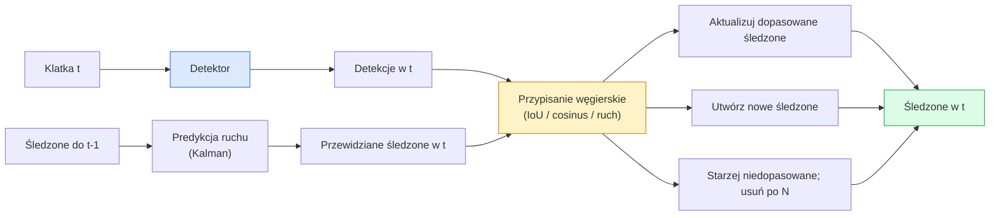

# Śledzenie Wielu Obiektów & Pamięć Wideo

> Śledzenie to detekcja plus asocjacja. Wykryj każdą klatkę. Dopasuj detekcje z tej klatki do śledzonych obiektów z poprzedniej klatki po ID.

**Type:** Build
**Languages:** Python
**Prerequisites:** Phase 4 Lesson 06 (YOLO Detection), Phase 4 Lesson 08 (Mask R-CNN), Phase 4 Lesson 24 (SAM 3)
**Time:** ~60 minut

## Cele Kształcenia

- Rozróżnić tracking-by-detection od śledzenia opartego na zapytaniach i wymienić rodziny algorytmów (SORT, DeepSORT, ByteTrack, BoT-SORT, tracker pamięci SAM 2, SAM 3.1 Object Multiplex)
- Zaimplementować przypisanie IoU + Hungarian od zera dla klasycznego tracking-by-detection
- Wyjaśnić bank pamięci SAM 2 i dlaczego radzi sobie z okluzją lepiej niż asocjacja oparta na IoU
- Odczytać trzy metryki śledzenia (MOTA, IDF1, HOTA) i wybrać, która ma znaczenie dla danego przypadku użycia

## Problem

Detektor mówi ci, gdzie są obiekty w pojedynczej klatce. Tracker mówi ci, która detekcja w klatce `t` jest tym samym obiektem co detekcja w klatce `t-1`. Bez tego nie możesz policzyć obiektów przekraczających linię, śledzić piłki przez okluzję, ani wiedzieć "samochód #4 jest na pasie od 8 sekund."

Śledzenie jest niezbędne w każdym produkcie wideo: analityka sportowa, monitoring, autonomiczna jazda, analiza wideo medycznego, monitoring dzikiej przyrody, liczenie znaków towarowych. Podstawowe bloki są wspólne: detektor na klatkę, model ruchu (filtr Kalmana lub coś bogatszego), krok asocjacji (algorytm węgierski na IoU / cosinus / nauczone cechy) i cykl życia śledzenia (narodziny, aktualizacja, śmierć).

Rok 2026 przyniósł dwa nowe wzorce: **śledzenie oparte na pamięci SAM 2** (asocjacja przez pamięć cech zamiast modelu ruchu) i **SAM 3.1 Object Multiplex** (współdzielona pamięć dla wielu instancji tego samego konceptu). Ta lekcja najpierw omawia klasyczny stos, a potem podejście oparte na pamięci.

## Koncepcja

### Tracking-by-detection



Każdy tracker, który napotkasz w 2026, jest wariacją tej pętli. Różnice:

- **SORT** (2016): filtr Kalmana + węgierskie IoU. Prosty, szybki, bez modelu wyglądu.
- **DeepSORT** (2017): SORT + cecha wyglądu oparta na CNN na śledzony (embedding ReID). Lepiej radzi sobie z krzyżowaniem.
- **ByteTrack** (2021): asocjuje detekcje o niskiej pewności jako drugi etap; nie potrzebuje cech wyglądu, ale najlepszy na MOT17.
- **BoT-SORT** (2022): Byte + kompensacja ruchu kamery + ReID.
- **StrongSORT / OC-SORT** — pochodne ByteTrack z lepszym ruchem i wyglądem.

### Filtr Kalmana w jednym akapicie

Filtr Kalmana utrzymuje stan na śledzony `(x, y, w, h, dx, dy, dw, dh)` z kowariancją. W każdej klatce **przewiduj** stan używając modelu stałej prędkości, a następnie **aktualizuj** dopasowaną detekcją. Aktualizacja ufa detekcji bardziej, gdy niepewność predykcji jest wysoka. To daje gładkie trajektorie i zdolność kontynuowania śledzonego przez krótką okluzję (1-5 klatek).

Każdy klasyczny tracker używa filtru Kalmana w kroku predykcji ruchu.

### Algorytm węgierski

Mając macierz kosztów `M x N` (śledzone x detekcje), znajdź przypisanie jeden-do-jednego minimalizujące całkowity koszt. Koszt to zazwyczaj `1 - IoU(ramka_śledzonego, ramka_detekcji)` lub ujemne podobieństwo cosinusowe cech wyglądu. Złożoność to O((M+N)^3); dla M, N do ~1000 jest wystarczająco szybkie w Pythonie przez `scipy.optimize.linear_sum_assignment`.

### Kluczowy pomysł ByteTrack

Standardowe trackery odrzucają detekcje o niskiej pewności (< 0.5). ByteTrack utrzymuje je jako **kandydatów drugiego etapu**: po dopasowaniu śledzonych do detekcji o wysokiej pewności, niedopasowane śledzone próbują dopasować się do detekcji o niskiej pewności z nieco luźniejszym progiem IoU. Odzyskuje krótkie okluzje, zmiany ID w pobliżu tłumu.

### Śledzenie oparte na pamięci SAM 2

SAM 2 obsługuje wideo poprzez utrzymywanie **banku pamięci** cech czasoprzestrzennych na instancję. Mając prompt (kliknięcie, ramka, tekst) na jednej klatce, koduje instancję do pamięci. Na kolejnych klatkach pamięć jest poddawana cross-attention z cechami nowej klatki, a dekoder produkuje maskę dla tej samej instancji w nowej klatce.

Bez filtru Kalmana, bez przypisania węgierskiego. Asocjacja jest domyślna w operacji memory-attention.

Zalety:
- Odporny na duże okluzje (pamięć niesie tożsamość instancji przez wiele klatek).
- Otwarte słownictwo w połączeniu z promptami tekstowymi SAM 3.
- Działa bez oddzielnego modelu ruchu.

Wady:
- Wolniejszy niż ByteTrack dla śledzenia wielu obiektów.
- Bank pamięci rośnie; ogranicza okno kontekstu.

### SAM 3.1 Object Multiplex

Wcześniejsze śledzenie SAM 2 / SAM 3 utrzymuje oddzielny bank pamięci na instancję. Dla 50 obiektów, 50 banków pamięci. Object Multiplex (marzec 2026) zwija je w jedną współdzieloną pamięć z **tokenami zapytań na instancję**. Koszt skaluje się sub-liniowo z liczbą instancji.

Multiplex jest nowym domyślnym rozwiązaniem dla śledzenia tłumu w 2026: koncerty, pracownicy magazynu, skrzyżowania.

### Trzy metryki do poznania

- **MOTA (Multi-Object Tracking Accuracy)** — 1 - (FN + FP + zmiany ID) / GT. Ważona typem błędu; pojedyncza metryka łącząca awarie detekcji i asocjacji.
- **IDF1 (ID F1)** — średnia harmoniczna precyzji i odzysku ID. Skupia się konkretnie na tym, jak dobrze każda ścieżka prawdy podstawowej utrzymuje swoje ID w czasie. Lepsza niż MOTA dla zadań wrażliwych na zmiany ID.
- **HOTA (Higher Order Tracking Accuracy)** — dekomponuje się na dokładność detekcji (DetA) i dokładność asocjacji (AssA). Standard społeczności od 2020; najbardziej kompleksowa.

Dla monitoringu (kto jest kim): raportuj IDF1. Dla analityki sportowej (liczenie podań): HOTA. Dla ogólnego porównania akademickiego: HOTA.

## Zbuduj To

### Krok 1: Macierz kosztów oparta na IoU

```python
import numpy as np


def bbox_iou(a, b):
    """
    a, b: tablice (N, 4) [x1, y1, x2, y2].
    Zwraca macierz IoU (N_a, N_b).
    """
    ax1, ay1, ax2, ay2 = a[:, 0], a[:, 1], a[:, 2], a[:, 3]
    bx1, by1, bx2, by2 = b[:, 0], b[:, 1], b[:, 2], b[:, 3]
    inter_x1 = np.maximum(ax1[:, None], bx1[None, :])
    inter_y1 = np.maximum(ay1[:, None], by1[None, :])
    inter_x2 = np.minimum(ax2[:, None], bx2[None, :])
    inter_y2 = np.minimum(ay2[:, None], by2[None, :])
    inter = np.clip(inter_x2 - inter_x1, 0, None) * np.clip(inter_y2 - inter_y1, 0, None)
    area_a = (ax2 - ax1) * (ay2 - ay1)
    area_b = (bx2 - bx1) * (by2 - by1)
    union = area_a[:, None] + area_b[None, :] - inter
    return inter / np.clip(union, 1e-8, None)
```

### Krok 2: Minimalny tracker w stylu SORT

Stały filtr Kalmana stałej prędkości pominięty dla zwięzłości — używamy tutaj prostej asocjacji IoU; w produkcji predykcja Kalmana jest niezbędna. Pakiet `sort` w Pythonie dostarcza pełną wersję.

```python
from scipy.optimize import linear_sum_assignment


class Track:
    def __init__(self, tid, bbox, frame):
        self.id = tid
        self.bbox = bbox
        self.last_frame = frame
        self.hits = 1

    def update(self, bbox, frame):
        self.bbox = bbox
        self.last_frame = frame
        self.hits += 1


class SimpleTracker:
    def __init__(self, iou_threshold=0.3, max_age=5):
        self.tracks = []
        self.next_id = 1
        self.iou_threshold = iou_threshold
        self.max_age = max_age

    def step(self, detections, frame):
        if not self.tracks:
            for d in detections:
                self.tracks.append(Track(self.next_id, d, frame))
                self.next_id += 1
            return [(t.id, t.bbox) for t in self.tracks]

        track_boxes = np.array([t.bbox for t in self.tracks])
        det_boxes = np.array(detections) if len(detections) else np.empty((0, 4))

        iou = bbox_iou(track_boxes, det_boxes) if len(det_boxes) else np.zeros((len(track_boxes), 0))
        cost = 1 - iou
        cost[iou < self.iou_threshold] = 1e6

        matched_track = set()
        matched_det = set()
        if cost.size > 0:
            row, col = linear_sum_assignment(cost)
            for r, c in zip(row, col):
                if cost[r, c] < 1.0:
                    self.tracks[r].update(det_boxes[c], frame)
                    matched_track.add(r); matched_det.add(c)

        for i, d in enumerate(det_boxes):
            if i not in matched_det:
                self.tracks.append(Track(self.next_id, d, frame))
                self.next_id += 1

        self.tracks = [t for t in self.tracks if frame - t.last_frame <= self.max_age]
        return [(t.id, t.bbox) for t in self.tracks]
```

60 linii. Przyjmuje detekcje na klatkę, zwraca ID śledzonych na klatkę. Prawdziwe systemy dodają predykcję Kalmana, drugi etap ponownego dopasowania ByteTrack i cechy wyglądu.

### Krok 3: Test syntetycznej trajektorii

```python
def synthetic_frames(num_frames=20, num_objects=3, H=240, W=320, seed=0):
    rng = np.random.default_rng(seed)
    starts = rng.uniform(20, 200, size=(num_objects, 2))
    velocities = rng.uniform(-5, 5, size=(num_objects, 2))
    frames = []
    for f in range(num_frames):
        dets = []
        for i in range(num_objects):
            cx, cy = starts[i] + f * velocities[i]
            dets.append([cx - 10, cy - 10, cx + 10, cy + 10])
        frames.append(dets)
    return frames


tracker = SimpleTracker()
for f, dets in enumerate(synthetic_frames()):
    tracks = tracker.step(dets, f)
```

Trzy obiekty poruszające się po liniach prostych powinny zachować swoje ID przez wszystkie 20 klatek.

### Krok 4: Metryka zmiany ID

```python
def count_id_switches(tracks_per_frame, gt_per_frame):
    """
    tracks_per_frame:  lista list (track_id, bbox)
    gt_per_frame:      lista list (gt_id, bbox)
    Zwraca liczbę zmian ID.
    """
    prev_assignment = {}
    switches = 0
    for tracks, gts in zip(tracks_per_frame, gt_per_frame):
        if not tracks or not gts:
            continue
        t_boxes = np.array([b for _, b in tracks])
        g_boxes = np.array([b for _, b in gts])
        iou = bbox_iou(g_boxes, t_boxes)
        for g_idx, (gt_id, _) in enumerate(gts):
            j = iou[g_idx].argmax()
            if iou[g_idx, j] > 0.5:
                t_id = tracks[j][0]
                if gt_id in prev_assignment and prev_assignment[gt_id] != t_id:
                    switches += 1
                prev_assignment[gt_id] = t_id
    return switches
```

To jest uproszczona metryka zbliżona do IDF1: zlicza, ile razy obiekt prawdy podstawowej zmienia swój przypisany przewidziany ID śledzonego. Prawdziwe narzędzia MOTA / IDF1 / HOTA znajdują się w `py-motmetrics` i `TrackEval`.

## Użyj Tego

Produkcyjne trackery w 2026:

- `ultralytics` — YOLOv8 + ByteTrack / BoT-SORT wbudowane. `results = model.track(source, tracker="bytetrack.yaml")`. Domyślny.
- `supervision` (Roboflow) — otoczki ByteTrack plus narzędzia do adnotacji.
- SAM 2 / SAM 3.1 — śledzenie oparte na pamięci przez `processor.track()`.
- Własny stos: detektor (YOLOv8 / RT-DETR) + `sort-tracker` / `OC-SORT` / `StrongSORT`.

Wybór:

- Piesi / samochody / pudła przy 30+ fps: **ByteTrack z ultralytics**.
- Wiele instancji jednej klasy w tłumie: **SAM 3.1 Object Multiplex**.
- Ciężkie okluzje z identyfikowalnym wyglądem: **DeepSORT / StrongSORT** (cechy ReID).
- Sport / złożone interakcje: **BoT-SORT** lub uczone trackery (MOTRv3).

## Dostarcz To

Ta lekcja produkuje:

- `outputs/prompt-tracker-picker.md` — wybiera SORT / ByteTrack / BoT-SORT / SAM 2 / SAM 3.1 dla danego typu sceny, wzorców okluzji i budżetu opóźnienia.
- `outputs/skill-mot-evaluator.md` — pisze kompletny harness ewaluacyjny dla MOTA / IDF1 / HOTA względem ścieżek prawdy podstawowej.

## Ćwiczenia

1. **(Łatwe)** Uruchom powyższy syntetyczny tracker z 3, 10 i 30 obiektami. Raportuj liczbę zmian ID w każdym przypadku. Zidentyfikuj, gdzie prosta asocjacja tylko-IoU zaczyna zawodzić.
2. **(Średnie)** Dodaj krok predykcji Kalmana o stałej prędkości przed asocjacją. Pokaż, że krótkie (2-3 klatkowe) okluzje nie powodują już zmian ID.
3. **(Trudne)** Zintegruj tracker oparty na pamięci SAM 2 (przez `transformers`) jako alternatywny backend trackera. Uruchom zarówno SimpleTracker, jak i SAM 2 na 30-sekundowym klipie tłumu i porównaj liczbę zmian ID, ręcznie oznaczając ID prawdy podstawowej dla 5 widocznych osób.

## Kluczowe Pojęcia

| Termin | Co ludzie mówią | Co faktycznie oznacza |
|--------|-----------------|----------------------|
| Tracking-by-detection | "Wykryj potem skojarz" | Detektor na klatkę + przypisanie węgierskie na IoU / wyglądzie |
| Filtr Kalmana | "Predykcja ruchu" | Dynamika liniowa + kowariancja dla gładkich predykcji śledzonych i obsługi okluzji |
| Algorytm węgierski | "Optymalne przypisanie" | Rozwiązuje problem minimalnokosztowego dopasowania dwudzielnego; `scipy.optimize.linear_sum_assignment` |
| ByteTrack | "Drugi przebieg niskiej pewności" | Ponowne dopasowanie niedopasowanych śledzonych do detekcji o niskiej pewności w celu odzyskania krótkich okluzji |
| DeepSORT | "SORT + wygląd" | Dodaje cechę ReID do dopasowania międzyklatkowego; lepsze dla zachowania ID |
| Bank pamięci | "Trik SAM 2" | Cechy czasoprzestrzenne na instancję przechowywane między klatkami; cross-attention zastępuje jawną asocjację |
| Object Multiplex | "Współdzielona pamięć SAM 3.1" | Pojedyncza współdzielona pamięć z zapytaniami na instancję dla szybkiego śledzenia wielu obiektów |
| HOTA | "Nowoczesna metryka śledzenia" | Dekomponuje się na dokładność detekcji i asocjacji; standard społeczności |

## Dalsza Lektura

- [SORT (Bewley et al., 2016)](https://arxiv.org/abs/1602.00763) — minimalny artykuł o tracking-by-detection
- [DeepSORT (Wojke et al., 2017)](https://arxiv.org/abs/1703.07402) — dodaje cechę wyglądu
- [ByteTrack (Zhang et al., 2022)](https://arxiv.org/abs/2110.06864) — drugi przebieg niskiej pewności
- [BoT-SORT (Aharon et al., 2022)](https://arxiv.org/abs/2206.14651) — kompensacja ruchu kamery
- [HOTA (Luiten et al., 2020)](https://arxiv.org/abs/2009.07736) — zdekomponowana metryka śledzenia
- [SAM 2 video segmentation (Meta, 2024)](https://ai.meta.com/sam2/) — tracker oparty na pamięci
- [SAM 3.1 Object Multiplex (Meta, March 2026)](https://ai.meta.com/blog/segment-anything-model-3/)