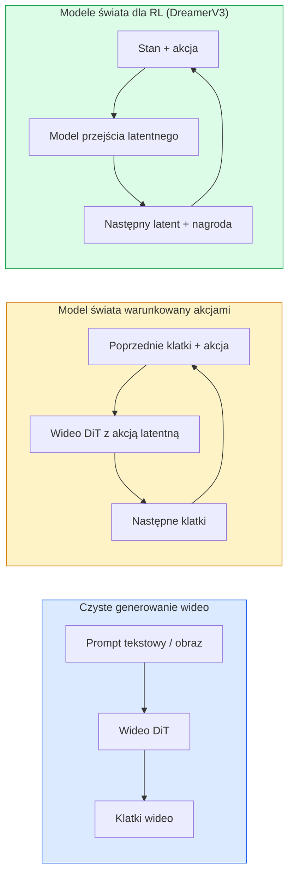

# Modele Świata & Dyfuzja Wideo

> Model wideo przewidujący następne sekundy sceny jest symulatorem świata. Warunkuj tę predykcję na akcjach, a masz nauczony silnik gry.

**Type:** Learn + Build
**Languages:** Python
**Prerequisites:** Phase 4 Lesson 10 (Diffusion), Phase 4 Lesson 12 (Video Understanding), Phase 4 Lesson 23 (DiT + Rectified Flow)
**Time:** ~75 minut

## Cele Kształcenia

- Wyjaśnić różnicę między czystym modelem generowania wideo (Sora 2) a modelem świata warunkowanym akcjami (Genie 3, DreamerV3)
- Opisać wideo DiT: łatki czasoprzestrzenne, 3D kodowanie pozycyjne, wspólna uwaga na tokenach (T, H, W)
- Prześledzić, jak model świata włącza się do robotyki: VLM planuje → model wideo symuluje → dynamika odwrotna emituje akcje
- Wybrać między Sora 2, Genie 3, Runway GWM-1 Worlds, Wan-Video i HunyuanVideo dla danego przypadku użycia (kreatywne wideo, interaktywny symulator, synteza autonomicznej jazdy)

## Problem

Generowanie wideo i modelowanie świata zbiegły się w 2026 roku. Model, który może wygenerować spójną minutę wideo, w pewnym sensie nauczył się, jak porusza się świat: trwałość obiektów, grawitacja, przyczynowość, styl. Jeśli warunkujesz tę predykcję na akcjach (idź w lewo, otwórz drzwi), model wideo staje się uczonym symulatorem, który może zastąpić silnik gry, symulator jazdy lub środowisko robotyczne.

Stawki są konkretne. Genie 3 generuje grywalne środowiska z pojedynczego obrazu. Runway GWM-1 Worlds syntetyzuje nieskończone eksplorowalne sceny. Sora 2 produkuje minutowe wideo z zsynchronizowanym dźwiękiem i modelowaną fizyką. NVIDIA Cosmos-Drive, Wayve Gaia-2 i Tesla DrivingWorld generują realistyczne wideo jazdy do trenowania danych dla pojazdów autonomicznych. Paradygmat modelu świata po cichu przejmuje sim-to-real dla robotyki.

Ta lekcja to lekcja "dużego obrazu" dla Fazy 4. Łączy generowanie obrazu, rozumienie wideo i rozumowanie agencyjne we wzorzec architektoniczny, w kierunku którego zmierza dominująca część badań.

## Koncepcja

### Trzy rodziny modelowania świata



- **Sora 2** to czyste generowanie wideo warunkowane promptami. Bez interfejsu akcji. Nie możesz go "sterować" w trakcie generowania.
- **Genie 3**, **GWM-1 Worlds**, **Mirage / Magica** to modele świata warunkowane akcjami. Wnioskują akcje latentne z obserwowanego wideo, a następnie warunkują przewidywania przyszłych klatek na akcjach. Interaktywne — naciskasz klawisze lub przesuwasz kamerę, a scena reaguje.
- **DreamerV3** i klasyczna rodzina modeli świata RL przewidują w przestrzeni latentnej z jawnym warunkowaniem akcji, trenowane na sygnale nagrody. Mniej wizualne; bardziej użyteczne dla RL oszczędzającego próbki.

### Architektura wideo DiT

```
Latent wideo:          (C, T, H, W)
Łatkowanie (przestrzenne):    siatka P_h x P_w łat na klatkę
Łatkowanie (czasowe):   grupuj P_t klatek w łatę czasową
Wynikowe tokeny:      (T / P_t) * (H / P_h) * (W / P_w) tokenów
```

Kodowanie pozycyjne jest 3D: nauczony lub rotary embedding na współrzędną (t, h, w). Uwaga może być:

- **Pełna wspólna** — wszystkie tokeny uwzględniają wszystkie tokeny. O(N^2) z N tokenami. Niewykonalne dla długich wideo.
- **Dzielona** — naprzemienna uwaga czasowa (ta sama pozycja przestrzenna, w czasie: `(H*W) * T^2`) i uwaga przestrzenna (ten sam krok czasowy, w przestrzeni: `T * (H*W)^2`). Używana przez TimeSformer i większość wideo DiT.
- **Okienna** — lokalne okna w (t, h, w). Używana przez Video Swin.

Każdy model dyfuzji wideo z 2026 używa jednego z tych trzech wzorców plus warunkowania AdaLN (Lekcja 23) i przepływu prostowanego.

### Warunkowanie na akcjach: modele akcji latentnej

Genie uczy **akcji latentnej** na klatkę poprzez dyskryminacyjne przewidywanie akcji między parą kolejnych klatek. Dekoder modelu następnie warunkuje się na wywnioskowanej akcji latentnej — nie na jawnych klawiszach. W inferencji użytkownik może określić akcję latentną (lub próbkować ją z nowego priora), a model generuje następną klatkę zgodną z tą akcją.

Sora pomija interfejs akcji całkowicie. Jej dekoder przewiduje następne tokeny czasoprzestrzenne z poprzednich tokenów czasoprzestrzennych. Prompt warunkuje początek; nic nie steruje nim w trakcie generowania.

### Wiarygodność fizyczna

Wydanie Sory 2 w 2026 jawnie reklamowało **wiarygodność fizyczną**: wagę, równowagę, trwałość obiektów, przyczynowość i skutek. Mierzone przez zespół ręcznie ocenianymi wynikami wiarygodności; model widocznie poprawił się w zakresie upuszczonych obiektów, kolizji postaci i celowych porażek (nieudany skok) w porównaniu z Sorą 1.

Wiarygodność pozostaje dominującym trybem awarii. Filmy z 2024-2025 przedstawiające ludzi jedzących spaghetti lub pijących ze szklanek ujawniły brak trwałej reprezentacji obiektów w modelu. Modele z 2026 (Sora 2, Runway Gen-5, HunyuanVideo) redukują, ale nie eliminują tych problemów.

### Modele świata do autonomicznej jazdy

Modele świata jazdy generują realistyczne sceny drogowe warunkowane trajektoriami, ramkami ograniczającymi lub mapami nawigacyjnymi. Zastosowanie:

- **Cosmos-Drive-Dreams** (NVIDIA) — generuje minuty wideo jazdy do treningu RL.
- **Gaia-2** (Wayve) — synteza scen warunkowanych trajektorią do ewaluacji polityki.
- **DrivingWorld** (Tesla) — symuluje różne warunki pogodowe, pory dnia, warunki ruchu.
- **Vista** (ByteDance) — reaktywna synteza scen jazdy.

Zastępują kosztowne zbieranie danych ze świata rzeczywistego dla przypadków brzegowych — piesi przechodzący w nocy, oblodzone skrzyżowania, nietypowe typy pojazdów — które w innym przypadku wymagałyby milionów mil jazdy.

### Stos robotyczny: VLM + model wideo + dynamika odwrotna

Wyłaniająca się trójkomponentowa pętla robotyczna:

1. **VLM** analizuje cel ("podnieś czerwony kubek"), planuje sekwencję akcji wysokiego poziomu.
2. **Model generowania wideo** symuluje, jak wyglądałoby wykonanie każdej akcji — przewiduje obserwacje N klatek do przodu.
3. **Model dynamiki odwrotnej** wyodrębnia konkretne polecenia silnikowe, które wyprodukowałyby te obserwacje.

To zastępuje kształtowanie nagrody i RL wymagający wielu próbek. Model świata wykonuje wyobraźnię; dynamika odwrotna zamyka pętlę na aktuacji. Genie Envisioner jest jedną z instancji; wiele grup badawczych zbiega się do tej struktury.

### Ewaluacja

- **Jakość wizualna** — FVD (Fréchet Video Distance), badania użytkowników.
- **Dopasowanie promptu** — CLIPScore na klatkę, ewaluacja w stylu VQA.
- **Wiarygodność fizyczna** — oceniana ręcznie na zestawie benchmarków (wewnętrzny benchmark Sora 2, VBench).
- **Sterowalność** (dla interaktywnych modeli świata) — spójność akcja → obserwacja; czy możesz wrócić do poprzedniego stanu?

### Krajobraz modeli w 2026

| Model | Zastosowanie | Parametry | Wynik | Licencja |
|-------|-------------|-----------|-------|----------|
| Sora 2 | tekst-do-wideo, audio | — | 1-min 1080p + audio | API only |
| Runway Gen-5 | tekst/obraz-do-wideo | — | 10s klipy | API |
| Runway GWM-1 Worlds | interaktywny świat | — | nieskończony 3D rollout | API |
| Genie 3 | interaktywny świat z obrazu | 11B+ | grywalne klatki | research preview |
| Wan-Video 2.1 | otwarty tekst-do-wideo | 14B | wysokiej jakości klipy | non-commercial |
| HunyuanVideo | otwarty tekst-do-wideo | 13B | 10s klipy | permissive |
| Cosmos / Cosmos-Drive | symulator autonomicznej jazdy | 7-14B | sceny jazdy | NVIDIA open |
| Magica / Mirage 2 | natywny silnik gry AI | — | modyfikowalne światy | produkt |

## Zbuduj To

### Krok 1: 3D łatkowanie dla wideo

```python
import torch
import torch.nn as nn


class VideoPatch3D(nn.Module):
    def __init__(self, in_channels=4, dim=64, patch_t=2, patch_h=2, patch_w=2):
        super().__init__()
        self.proj = nn.Conv3d(
            in_channels, dim,
            kernel_size=(patch_t, patch_h, patch_w),
            stride=(patch_t, patch_h, patch_w),
        )
        self.patch_t = patch_t
        self.patch_h = patch_h
        self.patch_w = patch_w

    def forward(self, x):
        # x: (N, C, T, H, W)
        x = self.proj(x)
        n, c, t, h, w = x.shape
        tokens = x.reshape(n, c, t * h * w).transpose(1, 2)
        return tokens, (t, h, w)
```

Konwolucja 3D z krokiem równym jądrze działa jako czasoprzestrzenny łatkownik. `(T, H, W) -> (T/2, H/2, W/2)` siatka tokenów.

### Krok 2: 3D rotary position encoding

Rotary Position Embeddings (RoPE) stosowane osobno wzdłuż osi `t`, `h`, `w`:

```python
def rope_3d(tokens, t_dim, h_dim, w_dim, grid):
    """
    tokens: (N, T*H*W, D)
    grid: (T, H, W) rozmiary
    t_dim + h_dim + w_dim == D
    """
    T, H, W = grid
    n, seq, d = tokens.shape
    if t_dim + h_dim + w_dim != d:
        raise ValueError(f"t_dim+h_dim+w_dim ({t_dim}+{h_dim}+{w_dim}) must equal D={d}")
    assert seq == T * H * W
    t_idx = torch.arange(T, device=tokens.device).repeat_interleave(H * W)
    h_idx = torch.arange(H, device=tokens.device).repeat_interleave(W).repeat(T)
    w_idx = torch.arange(W, device=tokens.device).repeat(T * H)
    # Uproszczone: tylko skaluj kanały przez częstotliwości. Prawdziwe RoPE obraca pary.
    freqs_t = torch.exp(-torch.log(torch.tensor(10000.0)) * torch.arange(t_dim // 2, device=tokens.device) / (t_dim // 2))
    freqs_h = torch.exp(-torch.log(torch.tensor(10000.0)) * torch.arange(h_dim // 2, device=tokens.device) / (h_dim // 2))
    freqs_w = torch.exp(-torch.log(torch.tensor(10000.0)) * torch.arange(w_dim // 2, device=tokens.device) / (w_dim // 2))
    emb_t = torch.cat([torch.sin(t_idx[:, None] * freqs_t), torch.cos(t_idx[:, None] * freqs_t)], dim=-1)
    emb_h = torch.cat([torch.sin(h_idx[:, None] * freqs_h), torch.cos(h_idx[:, None] * freqs_h)], dim=-1)
    emb_w = torch.cat([torch.sin(w_idx[:, None] * freqs_w), torch.cos(w_idx[:, None] * freqs_w)], dim=-1)
    return tokens + torch.cat([emb_t, emb_h, emb_w], dim=-1)
```

Uproszczona forma addytywna. Prawdziwe RoPE obraca sparowane kanały przy częstotliwościach; informacja pozycyjna jest taka sama.

### Krok 3: Blok dzielonej uwagi

```python
class DividedAttentionBlock(nn.Module):
    def __init__(self, dim=64, heads=2):
        super().__init__()
        self.time_attn = nn.MultiheadAttention(dim, heads, batch_first=True)
        self.space_attn = nn.MultiheadAttention(dim, heads, batch_first=True)
        self.ln1 = nn.LayerNorm(dim)
        self.ln2 = nn.LayerNorm(dim)
        self.ln3 = nn.LayerNorm(dim)
        self.mlp = nn.Sequential(nn.Linear(dim, 4 * dim), nn.GELU(), nn.Linear(4 * dim, dim))

    def forward(self, x, grid):
        T, H, W = grid
        n, seq, d = x.shape
        # uwaga czasowa: to samo (h, w), w poprzek t
        xt = x.view(n, T, H * W, d).permute(0, 2, 1, 3).reshape(n * H * W, T, d)
        a, _ = self.time_attn(self.ln1(xt), self.ln1(xt), self.ln1(xt), need_weights=False)
        xt = (xt + a).reshape(n, H * W, T, d).permute(0, 2, 1, 3).reshape(n, seq, d)
        # uwaga przestrzenna: to samo t, w poprzek (h, w)
        xs = xt.view(n, T, H * W, d).reshape(n * T, H * W, d)
        a, _ = self.space_attn(self.ln2(xs), self.ln2(xs), self.ln2(xs), need_weights=False)
        xs = (xs + a).reshape(n, T, H * W, d).reshape(n, seq, d)
        xs = xs + self.mlp(self.ln3(xs))
        return xs
```

Uwaga czasowa uwzględnia w każdej pozycji przestrzennej w poprzek czasu; uwaga przestrzenna uwzględnia w każdej klatce w poprzek pozycji. Dwie operacje O(T^2 + (HW)^2) zamiast jednej O((THW)^2). To jest sedno TimeSformer i każdego nowoczesnego wideo DiT.

### Krok 4: Złóż mały wideo DiT

```python
class TinyVideoDiT(nn.Module):
    def __init__(self, in_channels=4, dim=64, depth=2, heads=2):
        super().__init__()
        self.patch = VideoPatch3D(in_channels=in_channels, dim=dim, patch_t=2, patch_h=2, patch_w=2)
        self.blocks = nn.ModuleList([DividedAttentionBlock(dim, heads) for _ in range(depth)])
        self.out = nn.Linear(dim, in_channels * 2 * 2 * 2)

    def forward(self, x):
        tokens, grid = self.patch(x)
        for blk in self.blocks:
            tokens = blk(tokens, grid)
        return self.out(tokens), grid
```

Nie działający generator wideo; demo strukturalne pokazujące, że każdy element kształtuje się poprawnie.

### Krok 5: Sprawdź kształty

```python
vid = torch.randn(1, 4, 8, 16, 16)  # (N, C, T, H, W)
model = TinyVideoDiT()
out, grid = model(vid)
print(f"input  {tuple(vid.shape)}")
print(f"tokens grid {grid}")
print(f"output {tuple(out.shape)}")
```

Oczekuj `grid = (4, 8, 8)` i `out = (1, 256, 32)` po łatkowaniu; głowica następnie projektuje na token czasoprzestrzennych łat, gotowych do odłatkowania z powrotem do wideo.

## Użyj Tego

Wzorce dostępu produkcyjnego dla 2026:

- **Sora 2 API** (OpenAI) — tekst-do-wideo, zsynchronizowane audio. Premium pricing.
- **Runway Gen-5 / GWM-1** (Runway) — obraz-do-wideo, interaktywne światy.
- **Wan-Video 2.1 / HunyuanVideo** — open-source self-host.
- **Cosmos / Cosmos-Drive** (NVIDIA) — symulacja jazdy otwarte wagi.
- **Genie 3** — research preview, wnioskuj o dostęp.

Do zbudowania interaktywnego demo modelu świata: zacznij od Wan-Video dla jakości, nałóż adapter akcji latentnej dla interaktywności. Do symulacji autonomicznej jazdy: Cosmos-Drive to otwarta referencja 2026.

Dla robotyki, stos w terenie:

1. Cel językowy -> VLM (Qwen3-VL) -> plan wysokiego poziomu.
2. Plan -> model wideo z akcją latentną -> wyobrażony rollout.
3. Rollout -> model dynamiki odwrotnej -> akcje niskiego poziomu.
4. Akcje wykonane -> obserwacja podawana z powrotem do kroku 1.

## Dostarcz To

Ta lekcja produkuje:

- `outputs/prompt-video-model-picker.md` — wybiera między Sora 2 / Runway / Wan / HunyuanVideo / Cosmos dla danego zadania, licencji i opóźnienia.
- `outputs/skill-physical-plausibility-checks.md` — umiejętność definiująca automatyczne kontrole (trwałość obiektów, grawitacja, ciągłość) do uruchomienia na dowolnym wygenerowanym wideo przed dostarczeniem.

## Ćwiczenia

1. **(Łatwe)** Oblicz liczbę tokenów dla 5-sekundowego wideo 360p przy patch-t=2, patch-h=8, patch-w=8. Przemysł o pamięci dla uwagi przy tym rozmiarze.
2. **(Średnie)** Zamień powyższy blok dzielonej uwagi na blok pełnej wspólnej uwagi i zmierz kształt oraz liczbę parametrów. Wyjaśnij, dlaczego dzielona uwaga jest konieczna dla prawdziwych modeli wideo.
3. **(Trudne)** Zbuduj minimalny model wideo z akcją latentną: weź zestaw danych trójek (klatka_t, akcja_t, klatka_{t+1}) (dowolna prosta gra 2D), wytrenuj mały wideo DiT warunkowany embeddingami akcji i pokaż, że różne akcje produkują różne następne klatki.

## Kluczowe Pojęcia

| Termin | Co ludzie mówią | Co faktycznie oznacza |
|--------|-----------------|----------------------|
| Model świata | "Uczony symulator" | Model przewidujący przyszłe obserwacje na podstawie stanu i akcji |
| Wideo DiT | "Transformer czasoprzestrzenny" | Transformer dyfuzyjny z 3D łatkowaniem i dzieloną uwagą |
| Akcja latentna | "Wywnioskowane sterowanie" | Latent akcji dyskretny lub ciągły wywnioskowany z par klatek; używany do warunkowania generowania następnej klatki |
| Dzielona uwaga | "Najpierw czas, potem przestrzeń" | Dwie operacje uwagi na blok — w poprzek czasu, następnie w poprzek przestrzeni — aby utrzymać O(N^2) w ryzach |
| Trwałość obiektów | "Rzeczy pozostają rzeczywiste" | Właściwość sceny, której modele wideo muszą się nauczyć; klasyczny tryb awarii na jedzeniu, szkle |
| FVD | "Fréchet Video Distance" | Wideo odpowiednik FID; podstawowa metryka jakości wizualnej |
| Model dynamiki odwrotnej | "Obserwacje do akcji" | Mając (stan, następny stan), wyprowadź akcję, która je łączy; zamyka pętlę robotyczną |
| Cosmos-Drive | "Symulator jazdy NVIDIA" | Model świata autonomicznej jazdy o otwartych wagach dla RL i ewaluacji |

## Dalsza Lektura

- [Sora technical report (OpenAI)](https://openai.com/index/video-generation-models-as-world-simulators/)
- [Genie: Generative Interactive Environments (Bruce et al., 2024)](https://arxiv.org/abs/2402.15391) — modele świata z akcją latentną
- [TimeSformer (Bertasius et al., 2021)](https://arxiv.org/abs/2102.05095) — dzielona uwaga dla transformerów wideo
- [DreamerV3 (Hafner et al., 2023)](https://arxiv.org/abs/2301.04104) — modele świata dla RL
- [Cosmos-Drive-Dreams (NVIDIA, 2025)](https://research.nvidia.com/labs/toronto-ai/cosmos-drive-dreams/) — model świata jazdy
- [Top 10 Video Generation Models 2026 (DataCamp)](https://www.datacamp.com/blog/top-video-generation-models)
- [From Video Generation to World Model — survey repo](https://github.com/ziqihuangg/Awesome-From-Video-Generation-to-World-Model/)