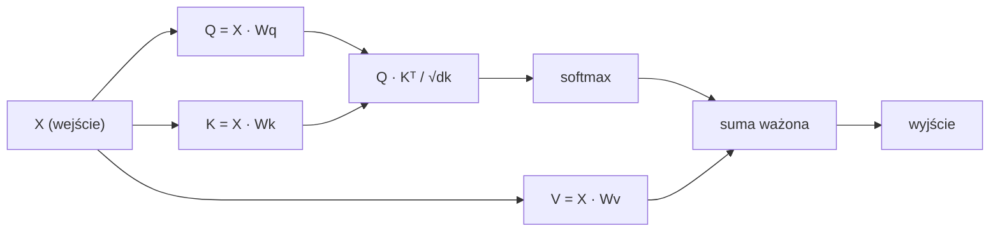

# Samo-Uwaga (Self-Attention) od Podstaw

> Uwaga to tablica przeglądowa, gdzie każde słowo pyta "kto jest dla mnie ważny?" — i uczy się odpowiedzi.

**Type:** Build
**Languages:** Python
**Prerequisites:** Phase 3 (Deep Learning Core), Phase 5 Lesson 10 (Sequence-to-Sequence)
**Time:** ~90 minutes

## Cele Nauczania

- Zaimplementuj skalowaną uwagę iloczynową (scaled dot-product self-attention) od podstaw używając tylko NumPy, włączając projekcje zapytań/kluczy/wartości oraz sumę ważoną softmax
- Zbuduj wielogłowicową warstwę uwagi (multi-head attention), która dzieli głowy, oblicza równoległą uwagę i łączy wyniki
- Prześledź, jak macierz uwagi przechwytuje relacje między tokenami i wyjaśnij, dlaczego skalowanie przez sqrt(d_k) zapobiega nasyceniu softmax
- Zastosuj maskowanie przyczynowe (causal masking), aby przekonwertować dwukierunkową uwagę na autoregresyjną (w stylu dekodera)

## Problem

RNN przetwarzają sekwencje jeden token na raz. Zanim dotrzesz do tokena 50, informacja z tokena 1 została przeciśnięta przez 50 kroków kompresji. Zależności dalekiego zasięgu są miażdżone w stan ukryty o stałym rozmiarze — wąskie gardło, którego żadne bramkowanie LSTM w pełni nie rozwiązuje.

Artykuł Bahdanau z 2014 roku o uwadze pokazał rozwiązanie: pozwól dekoderowi spojrzeć wstecz na każdą pozycję enkodera i zdecydować, które z nich są ważne dla bieżącego kroku. Ale wciąż było to doklejone do RNN. Artykuł z 2017 roku "Attention Is All You Need" zadał ostrzejsze pytanie: co jeśli uwaga jest *jedynym* mechanizmem? Żadnej rekurencji. Żadnej konwolucji. Tylko uwaga.

Samo-uwaga (self-attention) pozwala każdej pozycji w sekwencji zwracać uwagę na każdą inną pozycję w jednym równoległym kroku. To właśnie sprawia, że transformery są szybkie, skalowalne i dominujące.

## Koncepcja

### Analogia do Przeszukiwania Bazy Danych

Myśl o uwadze jak o miękkim przeszukiwaniu bazy danych:

```
Tradycyjna baza danych:
  Zapytanie: "stolica Francji"  -->  dokładne dopasowanie  -->  "Paryż"

Uwaga:
  Zapytanie: "stolica Francji"  -->  podobieństwo do WSZYSTKICH kluczy  -->  ważona mieszanka WSZYSTKICH wartości
```

Każdy token generuje trzy wektory:
- **Zapytanie (Query, Q)**: "Czego szukam?"
- **Klucz (Key, K)**: "Co zawieram?"
- **Wartość (Value, V)**: "Jaką informację dostarczam, jeśli zostanę wybrany?"

Iloczyn skalarny między zapytaniem a wszystkimi kluczami daje wyniki uwagi. Wysoki wynik oznacza "ten klucz pasuje do mojego zapytania." Te wyniki ważą wartości. Wynikiem jest ważona suma wartości.

### Obliczenia Q, K, V

Każde osadzenie tokena jest rzutowane przez trzy wyuczone macierze wag:

```
Osadzenia wejściowe (sekwencja n tokenów, każdy d-wymiarowy):

  X = [x1, x2, x3, ..., xn]       kształt: (n, d)

Trzy macierze wag:

  Wq  kształt: (d, dk)
  Wk  kształt: (d, dk)
  Wv  kształt: (d, dv)

Projekcje:

  Q = X @ Wq    kształt: (n, dk)      zapytanie każdego tokena
  K = X @ Wk    kształt: (n, dk)      klucz każdego tokena
  V = X @ Wv    kształt: (n, dv)      wartość każdego tokena
```

Wizualnie, dla jednego tokena:

```
             Wq
  x_i ------[*]------> q_i    "Czego szukam?"
       |
       |     Wk
       +----[*]------> k_i    "Co zawieram?"
       |
       |     Wv
       +----[*]------> v_i    "Co oferuję?"
```

### Macierz Uwagi

Gdy masz Q, K, V dla wszystkich tokenów, wyniki uwagi tworzą macierz:

```
Wyniki = Q @ K^T    kształt: (n, n)

              k1    k2    k3    k4    k5
        +-----+-----+-----+-----+-----+
   q1   | 2.1 | 0.3 | 0.1 | 0.8 | 0.2 |   <- jak bardzo q1 zwraca uwagę na każdy klucz
        +-----+-----+-----+-----+-----+
   q2   | 0.4 | 1.9 | 0.7 | 0.1 | 0.3 |
        +-----+-----+-----+-----+-----+
   q3   | 0.2 | 0.6 | 2.3 | 0.5 | 0.1 |
        +-----+-----+-----+-----+-----+
   q4   | 0.9 | 0.1 | 0.4 | 1.7 | 0.6 |
        +-----+-----+-----+-----+-----+
   q5   | 0.1 | 0.3 | 0.2 | 0.5 | 2.0 |
        +-----+-----+-----+-----+-----+

Każdy wiersz: uwaga jednego tokena na całą sekwencję
```

Obserwuj jedno zapytanie na raz przesuwające się przez klucze: każdy wiersz punktuje każdy token, softmax zamienia wyniki na wagi, a wektor kontekstu jest ważoną mieszanką wartości.

```figure
attention-matrix
```

### Dlaczego Skalować?

Iloczyny skalarne rosną z wymiarem dk. Jeśli dk = 64, iloczyny skalarne mogą być w zakresie dziesiątek, wpychając softmax w regiony, gdzie gradienty zanikają. Rozwiązanie: podziel przez sqrt(dk).

```
Skalowane wyniki = (Q @ K^T) / sqrt(dk)
```

To utrzymuje wartości w zakresie, w którym softmax wytwarza użyteczne gradienty.

### Softmax Zamienia Wyniki na Wagi

Softmax konwertuje surowe wyniki na rozkład prawdopodobieństwa w każdym wierszu:

```
Surowe wyniki dla q1:   [2.1, 0.3, 0.1, 0.8, 0.2]
                            |
                         softmax
                            |
Wagi uwagi:           [0.52, 0.09, 0.07, 0.14, 0.08]   (sumuje się do ~1.0)
```

Teraz każdy token ma zestaw wag mówiących, jak bardzo zwracać uwagę na każdy inny token.

### Ważona Suma Wartości

Ostateczne wyjście dla każdego tokena to ważona suma wszystkich wektorów wartości:

```
output_i = sum( attention_weight[i][j] * v_j  for all j )

Dla tokena 1:
  output_1 = 0.52 * v1 + 0.09 * v2 + 0.07 * v3 + 0.14 * v4 + 0.08 * v5
```

### Pełny Potok



Wzór w jednej linii:

```
Attention(Q, K, V) = softmax( Q @ K^T / sqrt(dk) ) @ V
```

```figure
softmax-attention-scaling
```

## Zbuduj To

### Krok 1: Softmax od podstaw

Softmax zamienia surowe logity na prawdopodobieństwa. Odejmij maksimum dla stabilności numerycznej.

```python
import numpy as np

def softmax(x):
    shifted = x - np.max(x, axis=-1, keepdims=True)
    exp_x = np.exp(shifted)
    return exp_x / np.sum(exp_x, axis=-1, keepdims=True)

logits = np.array([2.0, 1.0, 0.1])
print(f"logits:  {logits}")
print(f"softmax: {softmax(logits)}")
print(f"sum:     {softmax(logits).sum():.4f}")
```

### Krok 2: Skalowana uwaga iloczynowa (scaled dot-product attention)

Główna funkcja. Przyjmuje macierze Q, K, V i zwraca wyjście uwagi oraz macierz wag.

```python
def scaled_dot_product_attention(Q, K, V):
    dk = Q.shape[-1]
    scores = Q @ K.T / np.sqrt(dk)
    weights = softmax(scores)
    output = weights @ V
    return output, weights
```

### Krok 3: Klasa samo-uwagi z wyuczonymi projekcjami

Pełny moduł samo-uwagi z macierzami wag Wq, Wk, Wv zainicjalizowanymi skalowaniem w stylu Xaviera.

```python
class SelfAttention:
    def __init__(self, d_model, dk, dv, seed=42):
        rng = np.random.default_rng(seed)
        scale = np.sqrt(2.0 / (d_model + dk))
        self.Wq = rng.normal(0, scale, (d_model, dk))
        self.Wk = rng.normal(0, scale, (d_model, dk))
        scale_v = np.sqrt(2.0 / (d_model + dv))
        self.Wv = rng.normal(0, scale_v, (d_model, dv))
        self.dk = dk

    def forward(self, X):
        Q = X @ self.Wq
        K = X @ self.Wk
        V = X @ self.Wv
        output, weights = scaled_dot_product_attention(Q, K, V)
        return output, weights
```

### Krok 4: Uruchom na zdaniu

Utwórz sztuczne osadzenia dla zdania i obserwuj wagi uwagi.

```python
sentence = ["The", "cat", "sat", "on", "the", "mat"]
n_tokens = len(sentence)
d_model = 8
dk = 4
dv = 4

rng = np.random.default_rng(42)
X = rng.normal(0, 1, (n_tokens, d_model))

attn = SelfAttention(d_model, dk, dv, seed=42)
output, weights = attn.forward(X)

print("Attention weights (each row: where that token looks):\n")
print(f"{'':>6}", end="")
for token in sentence:
    print(f"{token:>6}", end="")
print()

for i, token in enumerate(sentence):
    print(f"{token:>6}", end="")
    for j in range(n_tokens):
        w = weights[i][j]
        print(f"{w:6.3f}", end="")
    print()
```

### Krok 5: Wizualizuj uwagę za pomocą mapy ciepła ASCII

Zamapuj wagi uwagi na znaki, aby uzyskać szybką wizualizację.

```python
def ascii_heatmap(weights, tokens, chars=" ░▒▓█"):
    n = len(tokens)
    print(f"\n{'':>6}", end="")
    for t in tokens:
        print(f"{t:>6}", end="")
    print()

    for i in range(n):
        print(f"{tokens[i]:>6}", end="")
        for j in range(n):
            level = int(weights[i][j] * (len(chars) - 1) / weights.max())
            level = min(level, len(chars) - 1)
            print(f"{'  ' + chars[level] + '   '}", end="")
        print()

ascii_heatmap(weights, sentence)
```

## Użyj Tego

`nn.MultiheadAttention` w PyTorch robi dokładnie to, co zbudowaliśmy, plus dzielenie na głowy i projekcję wyjściową:

```python
import torch
import torch.nn as nn

d_model = 8
n_heads = 2
seq_len = 6

mha = nn.MultiheadAttention(embed_dim=d_model, num_heads=n_heads, batch_first=True)

X_torch = torch.randn(1, seq_len, d_model)

output, attn_weights = mha(X_torch, X_torch, X_torch)

print(f"Input shape:            {X_torch.shape}")
print(f"Output shape:           {output.shape}")
print(f"Attention weight shape: {attn_weights.shape}")
print(f"\nAttn weights (averaged over heads):")
print(attn_weights[0].detach().numpy().round(3))
```

Kluczowa różnica: wielogłowicowa uwaga uruchamia wiele funkcji uwagi równolegle, każdą z własnymi projekcjami Q, K, V o rozmiarze dk = d_model / n_heads, a następnie łączy wyniki. Pozwala to modelowi jednocześnie zwracać uwagę na różne typy relacji.

## Dostarcz To

Ta lekcja produkuje:
- `outputs/prompt-attention-explainer.md` — prompt do wyjaśniania uwagi przez analogię do przeszukiwania bazy danych

## Ćwiczenia

1. Zmodyfikuj `scaled_dot_product_attention`, aby akceptowała opcjonalną macierz maski, która ustawia określone pozycje na minus nieskończoność przed softmax (tak działa maskowanie przyczynowe/dekodera)
2. Zaimplementuj wielogłowicową uwagę od podstaw: podziel Q, K, V na `n_heads` części, uruchom uwagę na każdej, połącz i przepuść przez końcową macierz wag Wo
3. Weź dwa różne zdania o tej samej długości, przepuść je przez tę samą instancję `SelfAttention` i porównaj ich wzorce uwagi. Co się zmienia? Co pozostaje takie samo?

## Kluczowe Terminy

| Termin | Co ludzie mówią | Co naprawdę oznacza |
|------|----------------|----------------------|
| Zapytanie (Query, Q) | "Wektor pytania" | Wyuczona projekcja wejścia, która reprezentuje, jakiej informacji szuka ten token |
| Klucz (Key, K) | "Wektor etykiety" | Wyuczona projekcja reprezentująca, jaką informację zawiera ten token, dopasowywana do zapytań |
| Wartość (Value, V) | "Wektor treści" | Wyuczona projekcja niosąca rzeczywistą informację, która jest agregowana na podstawie wyników uwagi |
| Skalowana uwaga iloczynowa (Scaled dot-product attention) | "Wzór uwagi" | softmax(QK^T / sqrt(dk)) @ V — skalowanie zapobiega nasyceniu softmax w wysokich wymiarach |
| Samo-uwaga (Self-attention) | "Token patrzy na siebie i innych" | Uwaga, gdzie Q, K, V wszystkie pochodzą z tej samej sekwencji, pozwalając każdej pozycji zwracać uwagę na każdą inną |
| Wagi uwagi (Attention weights) | "Ile skupienia" | Rozkład prawdopodobieństwa na pozycjach, wytworzony przez softmax na skalowanych iloczynach skalarnych |
| Wielogłowicowa uwaga (Multi-head attention) | "Równoległa uwaga" | Uruchamianie wielu funkcji uwagi z różnymi projekcjami, a następnie łączenie wyników dla bogatszych reprezentacji |

## Dalsza Lektura

- [Attention Is All You Need (Vaswani et al., 2017)](https://arxiv.org/abs/1706.03762) — oryginalny artykuł o transformerach
- [The Illustrated Transformer (Jay Alammar)](https://jalammar.github.io/illustrated-transformer/) — najlepszy wizualny przewodnik po pełnej architekturze
- [The Annotated Transformer (Harvard NLP)](https://nlp.seas.harvard.edu/annotated-transformer/) — implementacja PyTorch linia po linii z wyjaśnieniami