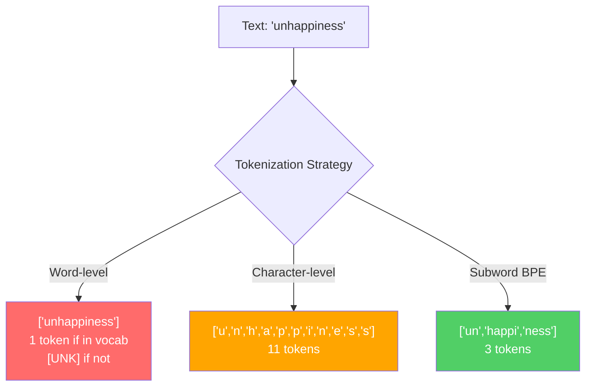
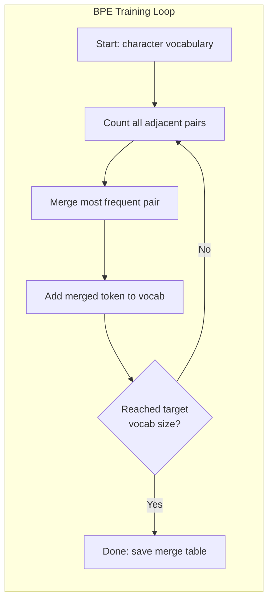
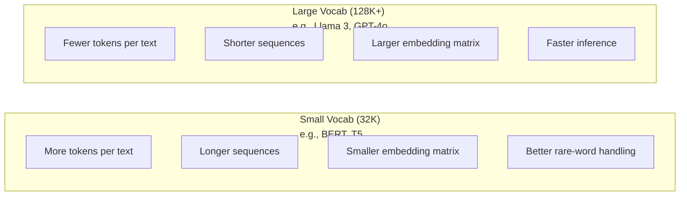

# Tokenizatory: BPE, WordPiece, SentencePiece

> Twój LLM nie czyta po angielsku. Czyta liczby całkowite. Tokenizator decyduje, czy te liczby niosą znaczenie, czy są stratą.

**Type:** Build
**Languages:** Python
**Prerequisites:** Phase 05 (NLP Foundations)
**Time:** ~90 minutes

## Learning Objectives

- Zaimplementuj algorytmy tokenizacji BPE, WordPiece i Unigram od podstaw i porównaj ich strategie łączenia
- Wyjaśnij, jak rozmiar słownika wpływa na wydajność modelu: zbyt mały tworzy długie sekwencje, zbyt duży marnuje parametry osadzeń
- Analizuj artefakty tokenizacji w różnych językach i kodzie, identyfikując gdzie konkretne tokenizatory zawodzą
- Użyj bibliotek tiktoken i sentencepiece do tokenizacji tekstu i inspekcji wynikowych identyfikatorów tokenów

## Problem

Twój LLM nie czyta po angielsku. Nie czyta żadnego języka. Czyta liczby.

Przepaść między "Hello, world!" a [15496, 11, 995, 0] to tokenizator. Każde słowo, każda spacja, każdy znak interpunkcyjny musi zostać przekonwertowany na liczbę całkowitą, zanim model będzie mógł go przetworzyć. Ta konwersja nie jest neutralna. Wbudowuje w model założenia, których nie da się później cofnąć.

Jeśli zrobisz to źle, twój model marnuje pojemność na kodowanie popularnych słów wieloma tokenami. "unfortunately" staje się czterema tokenami zamiast jednym. Twoje 128-tysięczne okno kontekstowe właśnie skurczyło się o 75% dla tekstu bogatego w wielosylabowe słowa. Zrób to dobrze, a to samo okno kontekstowe pomieści dwa razy więcej znaczenia. Różnica między "this model handles code well" a "this model chokes on Python" często sprowadza się do tego, jak wytrenowano tokenizator.

Każde wywołanie API do GPT-4 czy Claude jest rozliczane za token. Każdy token wygenerowany przez twój model kosztuje moc obliczeniową. Im mniej tokenów potrzeba do reprezentacji wyniku, tym szybsza jest inferencja end-to-end. Tokenizacja to nie preprocessing. To architektura.

## Koncepcja

### Trzy Podejścia, Które Zawiodły (i Jedno, Które Wygrało)

Istnieją trzy oczywiste sposoby konwersji tekstu na liczby. Dwa z nich nie działają na dużą skalę.

**Tokenizacja na poziomie słów** dzieli na spacjach i znakach interpunkcyjnych. "The cat sat" staje się ["The", "cat", "sat"]. Proste. Ale co z "tokenization"? Albo "GPT-4o"? Albo niemieckim słowem złożonym jak "Geschwindigkeitsbegrenzung"? Poziom słów wymaga ogromnego słownika, aby pokryć każde słowo w każdym języku. Brak słowa i dostajesz przerażający token `[UNK]` -- sposób modelu na powiedzenie "nie mam pojęcia, co to jest." Sam angielski ma ponad milion form słownych. Dodaj kod, URL-e, notację naukową i 100 innych języków, a potrzebujesz nieskończonego słownika.

**Tokenizacja na poziomie znaków** idzie w przeciwnym kierunku. "hello" staje się ["h", "e", "l", "l", "o"]. Słownik jest malutki (kilkaset znaków). Nigdy nie ma nieznanych tokenów. Ale sekwencje stają się ekstremalnie długie. Zdanie, które miałoby 10 tokenów na poziomie słów, staje się 50 tokenami na poziomie znaków. Model musi nauczyć się, że "t", "h", "e" razem znaczą "the" -- marnując pojemność uwagi na coś, czego człowiek uczy się w wieku trzech lat.

**Tokenizacja podwyrazowa** znajduje złoty środek. Popularne słowa pozostają całe: "the" to jeden token. Rzadkie słowa rozkładają się na znaczące części: "unhappiness" staje się ["un", "happi", "ness"]. Słownik pozostaje zarządzalny (30K do 128K tokenów). Sekwencje pozostają krótkie. Nieznane tokeny praktycznie znikają, ponieważ każde słowo można zbudować z części podwyrazowych.

Każdy nowoczesny LLM używa tokenizacji podwyrazowej. GPT-2, GPT-4, BERT, Llama 3, Claude -- wszystkie. Pytanie brzmi: który algorytm.



### BPE: Byte Pair Encoding

BPE to zachłanny algorytm kompresji zaadaptowany do tokenizacji. Pomysł jest na tyle prosty, że mieści się na kartce indeksowej.

Zacznij od pojedynczych znaków. Policz każdą sąsiednią parę w korpusie treningowym. Połącz najczęstszą parę w nowy token. Powtarzaj, aż osiągniesz docelowy rozmiar słownika.

```figure
tokenizer-bpe
```

Oto BPE działający na małym korpusie ze słowami "lower", "lowest" i "newest":

```
Corpus (with word frequencies):
  "lower"  x5
  "lowest" x2
  "newest" x6

Step 0 -- Start with characters:
  l o w e r       (x5)
  l o w e s t     (x2)
  n e w e s t     (x6)

Step 1 -- Count adjacent pairs:
  (e,s): 8    (s,t): 8    (l,o): 7    (o,w): 7
  (w,e): 13   (e,r): 5    (n,e): 6    ...

Step 2 -- Merge most frequent pair (w,e) -> "we":
  l o we r        (x5)
  l o we s t      (x2)
  n e we s t      (x6)

Step 3 -- Recount and merge (e,s) -> "es":
  l o we r        (x5)
  l o we s t      (x2)    <- 'es' only forms from 'e'+'s', not 'we'+'s'
  n e we s t      (x6)    <- wait, the 'e' before 'we' and 's' after 'we'

Actually tracking this precisely:
  After "we" merge, remaining pairs:
  (l,o): 7   (o,we): 7   (we,r): 5   (we,s): 8
  (s,t): 8   (n,e): 6    (e,we): 6

Step 3 -- Merge (we,s) -> "wes" or (s,t) -> "st" (tied at 8, pick first):
  Merge (we,s) -> "wes":
  l o we r        (x5)
  l o wes t       (x2)
  n e wes t       (x6)

Step 4 -- Merge (wes,t) -> "west":
  l o we r        (x5)
  l o west        (x2)
  n e west        (x6)

...continue until target vocab size reached.
```

Tabela łączeń to tokenizator. Aby zakodować nowy tekst, zastosuj łączenia w kolejności, w jakiej zostały nauczone. Korpus treningowy określa, które łączenia istnieją, a ten wybór trwale kształtuje to, co widzi model.



### Byte-Level BPE (GPT-2, GPT-3, GPT-4)

Standardowy BPE operuje na znakach Unicode. Byte-level BPE operuje na surowych bajtach (0-255). Daje to bazowy słownik dokładnie 256, obsługuje każdy język i kodowanie i nigdy nie produkuje nieznanego tokena.

GPT-2 wprowadził to podejście. Bazowy słownik obejmuje każdy możliwy bajt. Łączenia BPE budują na tym. Biblioteka tiktoken od OpenAI implementuje byte-level BPE z następującymi rozmiarami słowników:

- GPT-2: 50,257 tokenów
- GPT-3.5/GPT-4: ~100,256 tokenów (kodowanie cl100k_base)
- GPT-4o: 200,019 tokenów (kodowanie o200k_base)

### WordPiece (BERT)

WordPiece wygląda podobnie do BPE, ale wybiera łączenia inaczej. Zamiast surowej częstotliwości, maksymalizuje prawdopodobieństwo danych treningowych:

```
BPE merge criterion:      count(A, B)
WordPiece merge criterion: count(AB) / (count(A) * count(B))
```

BPE pyta: "Która para pojawia się najczęściej?" WordPiece pyta: "Która para pojawia się razem częściej, niż można by oczekiwać przypadkowo?" Ta subtelna różnica produkuje różne słowniki. WordPiece faworyzuje łączenia, gdzie współwystępowanie jest zaskakujące, nie tylko częste.

WordPiece używa również prefiksu "##" dla kontynuacji podwyrazów:

```
"unhappiness" -> ["un", "##happi", "##ness"]
"embedding"   -> ["em", "##bed", "##ding"]
```

Prefiks "##" informuje, że ta część kontynuuje poprzedni token. BERT używa WordPiece ze słownikiem 30,522 tokenów. Każdy wariant BERT -- DistilBERT, tokenizator RoBERTa to właściwie BPE, ale sam BERT to WordPiece.

### SentencePiece (Llama, T5)

SentencePiece traktuje wejście jako surowy strumień znaków Unicode, włączając białe znaki. Brak etapu pre-tokenizacji. Brak reguł specyficznych dla języka dotyczących granic słów. To czyni go prawdziwie niezależnym językowo -- działa na chińskim, japońskim, tajskim i innych językach, gdzie spacje nie oddzielają słów.

SentencePiece wspiera dwa algorytmy:
- **Tryb BPE**: ta sama logika łączenia co standardowy BPE, zastosowana do surowych sekwencji znaków
- **Tryb Unigram**: zaczyna od dużego słownika i iteracyjnie usuwa tokeny, które najmniej wpływają na ogólne prawdopodobieństwo. Odwrotność BPE -- przycinaj zamiast łączyć.

Llama 2 używa SentencePiece BPE ze słownikiem 32,000 tokenów. T5 używa SentencePiece Unigram z 32,000 tokenów. Uwaga: Llama 3 przeszła na tokenizator byte-level BPE oparty na tiktoken z 128,256 tokenami.

### Kompromisy Rozmiaru Słownika

To prawdziwa decyzja inżynieryjna z mierzalnymi konsekwencjami.



Konkretne liczby. Dla słownika 128K z osadzeniami 4096-wymiarowymi, sama macierz osadzeń to 128,000 x 4,096 = 524 miliony parametrów. Dla słownika 32K to 131 milionów parametrów. To różnica 400M parametrów wynikająca wyłącznie z wyboru tokenizatora.

Ale większe słowniki kompresują tekst bardziej agresywnie. Ten sam angielski akapit, który zajmuje 100 tokenów przy słowniku 32K, może zająć 70 tokenów przy słowniku 128K. To oznacza 30% mniej przejść w przód podczas generacji. Dla modelu obsługującego miliony żądań to bezpośrednia redukcja kosztów obliczeniowych.

Trend jest jasny: rozmiary słowników rosną. GPT-2 używał 50,257. GPT-4 używa ~100K. Llama 3 używa 128K. GPT-4o używa 200K.

| Model | Rozmiar słownika | Typ tokenizatora | Średnia liczba tokenów na angielskie słowo |
|-------|-----------|----------------|---------------------------|
| BERT | 30,522 | WordPiece | ~1.4 |
| GPT-2 | 50,257 | Byte-level BPE | ~1.3 |
| Llama 2 | 32,000 | SentencePiece BPE | ~1.4 |
| GPT-4 | ~100,256 | Byte-level BPE | ~1.2 |
| Llama 3 | 128,256 | Byte-level BPE (tiktoken) | ~1.1 |
| GPT-4o | 200,019 | Byte-level BPE | ~1.0 |

### Podatek Wielojęzyczny

Tokenizatory trenowane głównie na angielskim są brutalne dla innych języków. Koreański tekst w tokenizatorze GPT-2 średnio 2-3 tokeny na słowo. Chiński może być gorszy. Oznacza to, że koreański użytkownik ma efektywnie okno kontekstowe o połowę mniejsze niż użytkownik angielski -- płacąc tę samą cenę za mniejszą gęstość informacji.

Dlatego Llama 3 zwiększyła swój słownik czterokrotnie z 32K do 128K. Więcej tokenów dedykowanych skryptom nieangielskim oznacza sprawiedliwszą kompresję między językami.

```figure
tokenizer-tradeoff
```

## Zbuduj To

### Krok 1: Tokenizator na Poziomie Znaków

Zacznij od fundamentów. Tokenizator na poziomie znaków mapuje każdy znak na jego punkt kodowy Unicode. Bez treningu. Bez nieznanych tokenów. Po prostu bezpośrednie mapowanie.

```python
class CharTokenizer:
    def encode(self, text):
        return [ord(c) for c in text]

    def decode(self, tokens):
        return "".join(chr(t) for t in tokens)
```

"hello" staje się [104, 101, 108, 108, 111]. Każdy znak to własny token. To punkt odniesienia, który ulepszymy.

### Krok 2: Tokenizator BPE od Podstaw

Prawdziwa implementacja. Trenujemy na surowych bajtach (jak GPT-2), liczymy pary, łączymy najczęstszą i zapisujemy każde łączenie w kolejności. Tabela łączeń to tokenizator.

```python
from collections import Counter

class BPETokenizer:
    def __init__(self):
        self.merges = {}
        self.vocab = {}

    def _get_pairs(self, tokens):
        pairs = Counter()
        for i in range(len(tokens) - 1):
            pairs[(tokens[i], tokens[i + 1])] += 1
        return pairs

    def _merge_pair(self, tokens, pair, new_token):
        merged = []
        i = 0
        while i < len(tokens):
            if i < len(tokens) - 1 and tokens[i] == pair[0] and tokens[i + 1] == pair[1]:
                merged.append(new_token)
                i += 2
            else:
                merged.append(tokens[i])
                i += 1
        return merged

    def train(self, text, num_merges):
        tokens = list(text.encode("utf-8"))
        self.vocab = {i: bytes([i]) for i in range(256)}

        for i in range(num_merges):
            pairs = self._get_pairs(tokens)
            if not pairs:
                break
            best_pair = max(pairs, key=pairs.get)
            new_token = 256 + i
            tokens = self._merge_pair(tokens, best_pair, new_token)
            self.merges[best_pair] = new_token
            self.vocab[new_token] = self.vocab[best_pair[0]] + self.vocab[best_pair[1]]

        return self

    def encode(self, text):
        tokens = list(text.encode("utf-8"))
        for pair, new_token in self.merges.items():
            tokens = self._merge_pair(tokens, pair, new_token)
        return tokens

    def decode(self, tokens):
        byte_sequence = b"".join(self.vocab[t] for t in tokens)
        return byte_sequence.decode("utf-8", errors="replace")
```

Pętla treningowa to rdzeń BPE: policz pary, połącz zwycięzcę, powtórz. Każde łączenie zmniejsza całkowitą liczbę tokenów. Po `num_merges` rundach słownik rośnie z 256 (bazowe bajty) do 256 + num_merges.

Kodowanie stosuje łączenia w dokładnej kolejności, w jakiej zostały nauczone. To ma znaczenie. Jeśli łączenie 1 utworzyło "th", a łączenie 5 utworzyło "the", kodowanie musi najpierw zastosować łączenie 1, aby "the" mogło powstać z "th" + "e" w łączeniu 5.

Dekodowanie jest odwrotnością: znajdź każdy identyfikator tokena w słowniku, połącz bajty, zdekoduj do UTF-8.

### Krok 3: Kodowanie i Dekodowanie w Obie Strony

```python
corpus = (
    "The cat sat on the mat. The cat ate the rat. "
    "The dog sat on the log. The dog ate the frog. "
    "Natural language processing is the study of how computers "
    "understand and generate human language. "
    "Tokenization is the first step in any NLP pipeline."
)

tokenizer = BPETokenizer()
tokenizer.train(corpus, num_merges=40)

test_sentences = [
    "The cat sat on the mat.",
    "Natural language processing",
    "tokenization pipeline",
    "unhappiness",
]

for sentence in test_sentences:
    encoded = tokenizer.encode(sentence)
    decoded = tokenizer.decode(encoded)
    raw_bytes = len(sentence.encode("utf-8"))
    ratio = len(encoded) / raw_bytes
    print(f"'{sentence}'")
    print(f"  Tokens: {len(encoded)} (from {raw_bytes} bytes) -- ratio: {ratio:.2f}")
    print(f"  Roundtrip: {'PASS' if decoded == sentence else 'FAIL'}")
```

Współczynnik kompresji mówi, jak skuteczny jest tokenizator. Współczynnik 0.50 oznacza, że tokenizator skompresował tekst do połowy liczby tokenów w porównaniu do surowych bajtów. Niższy znaczy lepiej. Na korpusie treningowym współczynnik będzie dobry. Na tekście spoza dystrybucji, jak "unhappiness" (które nie występuje w korpusie), współczynnik będzie gorszy -- tokenizator cofa się do kodowania na poziomie znaków dla niewidzianych wzorców.

### Krok 4: Porównanie z tiktoken

```python
import tiktoken

enc = tiktoken.get_encoding("cl100k_base")

texts = [
    "The cat sat on the mat.",
    "unhappiness",
    "Hello, world!",
    "def fibonacci(n): return n if n < 2 else fibonacci(n-1) + fibonacci(n-2)",
    "Geschwindigkeitsbegrenzung",
]

for text in texts:
    our_tokens = tokenizer.encode(text)
    tiktoken_tokens = enc.encode(text)
    tiktoken_pieces = [enc.decode([t]) for t in tiktoken_tokens]
    print(f"'{text}'")
    print(f"  Our BPE:   {len(our_tokens)} tokens")
    print(f"  tiktoken:  {len(tiktoken_tokens)} tokens -> {tiktoken_pieces}")
```

tiktoken używa dokładnie tego samego algorytmu, ale wytrenowanego na setkach gigabajtów tekstu ze 100,000 łączeń. Algorytm jest identyczny. Różnica to dane treningowe i liczba łączeń. Twój tokenizator wytrenowany na akapicie z 40 łączeniami nie może konkurować ze 100K łączeniami tiktoken na ogromnym korpusie. Ale mechanizm jest ten sam.

### Krok 5: Analiza Słownika

```python
def analyze_vocabulary(tokenizer, test_texts):
    total_tokens = 0
    total_chars = 0
    token_usage = Counter()

    for text in test_texts:
        encoded = tokenizer.encode(text)
        total_tokens += len(encoded)
        total_chars += len(text)
        for t in encoded:
            token_usage[t] += 1

    print(f"Vocabulary size: {len(tokenizer.vocab)}")
    print(f"Total tokens across all texts: {total_tokens}")
    print(f"Total characters: {total_chars}")
    print(f"Avg tokens per character: {total_tokens / total_chars:.2f}")

    print(f"\nMost used tokens:")
    for token_id, count in token_usage.most_common(10):
        token_bytes = tokenizer.vocab[token_id]
        display = token_bytes.decode("utf-8", errors="replace")
        print(f"  Token {token_id:4d}: '{display}' (used {count} times)")

    unused = [t for t in tokenizer.vocab if t not in token_usage]
    print(f"\nUnused tokens: {len(unused)} out of {len(tokenizer.vocab)}")
```

To ujawnia rozkład Zipfa w twoim słowniku. Kilka tokenów dominuje (spacje, "the", "e"). Większość tokenów jest rzadko używana. Produkcyjne tokenizatory optymalizują pod ten rozkład -- popularne wzorce dostają krótkie identyfikatory tokenów, rzadkie wzorce dostają dłuższe reprezentacje.

## Użyj Tego

Twój BPE od podstaw działa. Teraz zobacz, jak wyglądają narzędzia produkcyjne.

### tiktoken (OpenAI)

```python
import tiktoken

enc = tiktoken.get_encoding("cl100k_base")

text = "Tokenizers convert text to integers"
tokens = enc.encode(text)
print(f"Tokens: {tokens}")
print(f"Pieces: {[enc.decode([t]) for t in tokens]}")
print(f"Roundtrip: {enc.decode(tokens)}")
```

tiktoken jest napisany w Rust z wiązaniami Pythona. Koduje miliony tokenów na sekundę. Ten sam algorytm BPE, implementacja przemysłowa.

### Hugging Face tokenizers

```python
from tokenizers import Tokenizer
from tokenizers.models import BPE
from tokenizers.trainers import BpeTrainer
from tokenizers.pre_tokenizers import ByteLevel

tokenizer = Tokenizer(BPE())
tokenizer.pre_tokenizer = ByteLevel()

trainer = BpeTrainer(vocab_size=1000, special_tokens=["<pad>", "<eos>", "<unk>"])
tokenizer.train(["corpus.txt"], trainer)

output = tokenizer.encode("The cat sat on the mat.")
print(f"Tokens: {output.tokens}")
print(f"IDs: {output.ids}")
```

Biblioteka Hugging Face tokenizers również jest w Rust pod spodem. Trenuje BPE na korpusach wielkości gigabajtów w sekundach. Tego używasz, gdy trenujesz własny model.

### Ładowanie Tokenizatora Llamy

```python
from transformers import AutoTokenizer

tokenizer = AutoTokenizer.from_pretrained("meta-llama/Llama-3.1-8B")

text = "Tokenizers are the unsung heroes of LLMs"
tokens = tokenizer.encode(text)
print(f"Token IDs: {tokens}")
print(f"Tokens: {tokenizer.convert_ids_to_tokens(tokens)}")
print(f"Vocab size: {tokenizer.vocab_size}")

multilingual = ["Hello world", "Hola mundo", "Bonjour le monde"]
for text in multilingual:
    ids = tokenizer.encode(text)
    print(f"'{text}' -> {len(ids)} tokens")
```

Słownik 128K Llamy 3 kompresuje tekst nieangielski znacznie lepiej niż słownik 50K GPT-2. Możesz to samodzielnie zweryfikować -- zakoduj to samo zdanie w wielu językach i policz tokeny.

## Dostarcz To

Ta lekcja produkuje `outputs/prompt-tokenizer-analyzer.md` -- wielokrotnego użytku prompt, który analizuje wydajność tokenizacji dla dowolnej kombinacji tekstu i modelu. Podaj próbkę tekstu, a on powie, który tokenizator modelu radzi sobie z nią najlepiej.

## Ćwiczenia

1. Zmodyfikuj tokenizator BPE, aby wypisywał słownik na każdym etapie łączenia. Obserwuj, jak "t" + "h" staje się "th", a następnie "th" + "e" staje się "the". Śledź, jak popularne angielskie słowa są składane kawałek po kawałku.

2. Dodaj specjalne tokeny (`<pad>`, `<eos>`, `<unk>`) do tokenizatora BPE. Przypisz im ID 0, 1, 2 i przesuń wszystkie inne tokeny odpowiednio. Zaimplementuj etap pre-tokenizacji, który dzieli na białych znakach przed uruchomieniem BPE.

3. Zaimplementuj kryterium łączenia WordPiece (iloraz wiarygodności zamiast częstotliwości). Wytrenuj zarówno BPE, jak i WordPiece na tym samym korpusie z tą samą liczbą łączeń. Porównaj powstałe słowniki -- który produkuje bardziej językowo znaczące podwyrazy?

4. Zbuduj wielojęzyczny benchmark wydajności tokenizatora. Weź 10 zdań w angielskim, hiszpańskim, chińskim, koreańskim i arabskim. Tokenizuj każde za pomocą tiktoken (cl100k_base) i zmierz średnią liczbę tokenów na znak. Określ ilościowo "podatek wielojęzyczny" dla każdego języka.

5. Wytrenuj swój tokenizator BPE na większym korpusie (pobierz artykuł z Wikipedii). Dostrój liczbę łączeń, aby osiągnąć współczynnik kompresji w granicach 10% tiktoken na tym samym tekście. To zmusza cię do zrozumienia związku między rozmiarem korpusu, liczbą łączeń a jakością kompresji.

## Kluczowe Terminy

| Termin | Co ludzie mówią | Co to naprawdę znaczy |
|------|----------------|----------------------|
| Token | "Słowo" | Jednostka w słowniku modelu -- może być znakiem, podwyrazem, słowem lub fragmentem wielowyrazowym |
| BPE | "Jakaś kompresja" | Byte Pair Encoding -- iteracyjne łączenie najczęstszej sąsiedniej pary tokenów aż do osiągnięcia docelowego rozmiaru słownika |
| WordPiece | "Tokenizator BERTa" | Jak BPE, ale łączenia maksymalizują iloraz wiarygodności count(AB)/(count(A)*count(B)) zamiast surowej częstotliwości |
| SentencePiece | "Biblioteka tokenizatora" | Niezależny językowo tokenizator operujący na surowym Unicode bez pre-tokenizacji, wspierający algorytmy BPE i Unigram |
| Rozmiar słownika | "Ile słów zna" | Całkowita liczba unikalnych tokenów: GPT-2 ma 50,257, BERT ma 30,522, Llama 3 ma 128,256 |
| Płodność | "Nie termin tokenizatora" | Średnia liczba tokenów na słowo -- mierzy wydajność tokenizatora między językami (1.0 jest idealne, 3.0 oznacza, że model pracuje trzy razy ciężej) |
| Byte-level BPE | "Tokenizator GPT" | BPE operujący na surowych bajtach (0-255) zamiast znaków Unicode, gwarantujący brak nieznanych tokenów dla dowolnego wejścia |
| Tabela łączeń | "Plik tokenizatora" | Uporządkowana lista łączeń par nauczonych podczas treningu -- TO JEST tokenizator, a kolejność ma znaczenie |
| Pre-tokenizacja | "Dzielenie na spacjach" | Reguły stosowane przed tokenizacją podwyrazową: dzielenie na białych znakach, separacja cyfr, obsługa interpunkcji |
| Współczynnik kompresji | "Jak wydajny jest tokenizator" | Liczba wyprodukowanych tokenów podzielona przez bajty wejściowe -- niższy oznacza lepszą kompresję i szybszą inferencję |

## Dalsza Lektura

- [Sennrich et al., 2016 -- "Neural Machine Translation of Rare Words with Subword Units"](https://arxiv.org/abs/1508.07909) -- artykuł, który wprowadził BPE do NLP, zamieniając algorytm kompresji z 1994 roku w fundament nowoczesnej tokenizacji
- [Kudo & Richardson, 2018 -- "SentencePiece: A simple and language independent subword tokenizer"](https://arxiv.org/abs/1808.06226) -- niezależna językowo tokenizacja, która uczyniła modele wielojęzyczne praktycznymi
- [OpenAI tiktoken repository](https://github.com/openai/tiktoken) -- produkcyjna implementacja BPE w Rust z wiązaniami Pythona, używana przez GPT-3.5/4/4o
- [Hugging Face Tokenizers documentation](https://huggingface.co/docs/tokenizers) -- trenowanie tokenizatorów klasy produkcyjnej z wydajnością Rusta