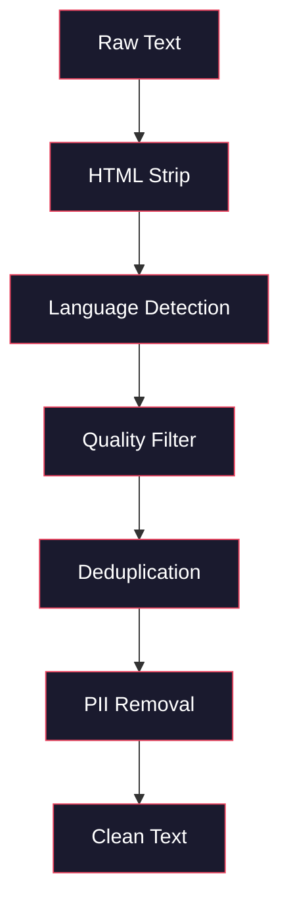
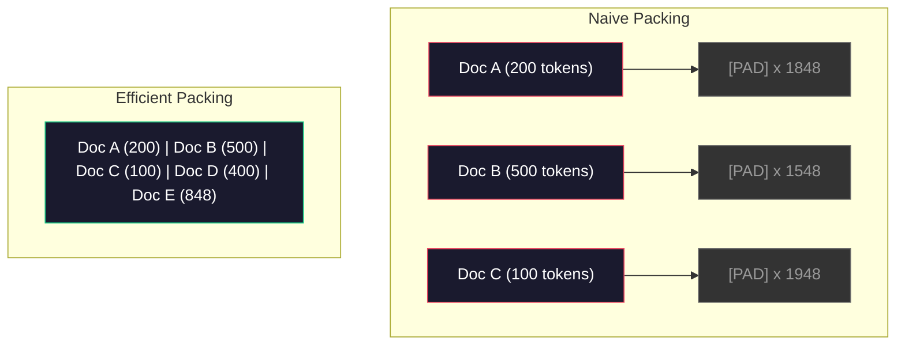

# Potoki Danych do Pre-Treningu

> Model jest lustrem. Odbija dane, którymi go karmisz. Nakarm go śmieciami, odbija śmieci z doskonałą płynnością.

**Type:** Build
**Languages:** Python
**Prerequisites:** Phase 10, Lessons 01-02 (Tokenizers, Building a Tokenizer)
**Time:** ~90 minutes

## Learning Objectives

- Zbuduj strumieniowy potok danych, który tokenizuje, dzieli na fragmenty, tasuje i grupuje w wsady terabajty tekstu bez ładowania wszystkiego do pamięci
- Zaimplementuj filtry jakości danych (deduplikacja, wykrywanie języka, filtrowanie treści) używane w prawdziwych potokach pre-treningowych
- Twórz sekwencje treningowe o stałej długości z odpowiednimi maskami uwagi i obsługą granic dokumentów
- Profiluj przepustowość potoku, aby upewnić się, że ładowarka danych nadąża za szybkością treningu GPU

## Problem

Masz tokenizator. Teraz potrzebujesz danych.

Nie zbioru danych. Nie pliku CSV. Terabajtów tekstu -- oczyszczonego, zdeduplikowanego, przefiltrowanego pod kątem jakości, stokenizowanego na sekwencje o stałej długości i serwowanego w zrandomizowanych wsadach wystarczająco szybko, aby twój klaster 8 GPU nigdy nie czekał na następny wsad.

Większość ludzi myśli, że trenowanie LLM-a dotyczy architektury modelu. Nie. Llama 3 użyła 15,6 biliona tokenów. GPT-3 użył 300 miliardów. DeepSeek-V2 użył 8,1 biliona. Architektura we wszystkich trzech jest mniej więcej taka sama: ułożone bloki transformera z uwagą i warstwami typu feedforward. Różnica w jakości wyników pochodzi w przeważającej mierze z danych.

Artykuł Chinchilla od DeepMind sprecyzował to. Dla danego budżetu obliczeniowego istnieje optymalny stosunek parametrów modelu do tokenów treningowych. Chinchilla pokazała, że większość modeli w 2022 roku była dramatycznie niedotrenowana -- miały zbyt wiele parametrów w stosunku do ilości danych, które widziały. Model 70B parametrów wytrenowany na 1,4 biliona tokenów (optymalny Chinchilla) przewyższał model 280B wytrenowany na 300 miliardach tokenów (Gopher).

Twój potok danych decyduje, czy twój model uczy się języka, czy uczy się szumu.

## Koncepcja

### Skąd Pochodzą Dane

Każdy duży model językowy jest trenowany na mieszance źródeł. Dokładny skład jest ściśle strzeżoną tajemnicą dla większości laboratoriów, ale wiemy wystarczająco dużo, aby zrozumieć kategorie.

| Źródło | Rozmiar | Jakość | Używane przez |
|--------|------|---------|---------|
| Common Crawl | ~250 TB surowe | Niska (wymaga intensywnego filtrowania) | GPT-3, Llama, większość otwartych modeli |
| Wikipedia | ~20 GB | Wysoka | Każdy duży LLM |
| Kod z GitHub | ~1 TB+ | Średnia (dużo duplikatów, martwego kodu) | StarCoder, CodeLlama, DeepSeek-Coder |
| Książki (BookCorpus, Pile) | ~100 GB | Wysoka | GPT-2, GPT-3, wczesne modele |
| Artykuły naukowe (arXiv, S2ORC) | ~100 GB | Wysoka dla STEM | Llama, Galactica |
| StackOverflow, Reddit | ~100 GB | Średnia | Llama, Falcon |
| Kuratorowana sieć (C4, RefinedWeb) | ~5 TB | Średnio-wysoka (wstępnie przefiltrowana) | T5, Falcon |

Llama 3 ujawniła swoją mieszankę danych: około 50% danych internetowych, 25% kodu, 13% książek i artykułów naukowych, 8% danych matematycznych i 4% wielojęzycznych danych internetowych. Łącznie było to 15,6 biliona tokenów ze źródeł przekraczających 5 TB surowego tekstu.

Stosunek ma znaczenie tak samo jak całkowity rozmiar. Zbyt dużo danych internetowych i model staje się papugą Reddita. Zbyt mało kodu i nie umie programować. Zbyt mało matematyki i zawodzi w rozumowaniu. Uzyskanie właściwej mieszanki to jedna z najtrudniejszych części trenowania LLM-a i nie ma na to wzoru -- wymaga eksperymentowania i ewaluacji.

### Czyszczenie Danych

Surowe dane internetowe są brudne. Typowy zrzut Common Crawl zawiera:

- Znaczniki HTML i JavaScript
- Standardowe nagłówki, stopki, menu nawigacyjne
- Zduplikowane strony (dokładne i prawie-duplikaty)
- Spam generowany maszynowo
- Osobiście identyfikowalne informacje (PII)
- Tekst niskiej jakości (listy słów kluczowych, spam SEO)
- Treści nietekstowe zakodowane jako tekst

Czyszczenie tego nie jest opcjonalne. To różnica między modelem generującym spójne akapity a takim, który wyprowadza znaczniki HTML wymieszane z listami produktów.



Każdy krok eliminuje kategorię szumu:

**Usuwanie HTML:** Usuń całe znaczniki. Zachowaj tylko widoczną treść tekstową. Biblioteki takie jak `trafilatura` lub `readability` wyodrębniają treść artykułu, odrzucając nawigację, reklamy i standardowe elementy.

**Wykrywanie języka:** Użyj modelu identyfikacji języka fastText (lid.176.bin), aby sklasyfikować każdy dokument. Filtruj do docelowych języków. Dokument sklasyfikowany jako angielski z pewnością poniżej 0.8 prawdopodobnie nie jest czystym angielskim.

**Filtrowanie jakości:** To tutaj robi się interesująco. RefinedWeb (zbiór danych stojący za Falconem) używa filtra opartego na perplexity: wytrenuj mały model językowy na Wikipedii, a następnie oceń każdy dokument. Wysoka perplexity oznacza, że dokument różni się od Wikipedii -- prawdopodobnie spam, listy słów kluczowych lub treść generowana maszynowo. Dokumenty z perplexity powyżej progu są usuwane.

**Deduplikacja:** Pojedynczy najbardziej wpływowy krok czyszczenia. Common Crawl zawiera ogromne liczby zduplikowanych stron -- zastrzeżenia prawne, informacje o ciasteczkach, regulaminy. Trenowanie na duplikatach marnuje moc obliczeniową i może spowodować, że model zapamięta i będzie odtwarzać określone fragmenty dosłownie.

**Usuwanie PII:** Imiona, adresy e-mail, numery telefonów, numery ubezpieczenia społecznego. Wykrywanie oparte na regex dla strukturalnych PII, modele NER dla imion w kontekście.

### Deduplikacja z MinHash

Dokładna deduplikacja jest łatwa: haszuj każdy dokument, usuń duplikaty. Ale prawie-duplikaty to prawdziwy problem. Dwie kopie tego samego artykułu informacyjnego z nieco innymi reklamami wokół to prawie-duplikaty. Treść jest w 95% identyczna, ale bajt po bajcie się różnią.

MinHash + Locality-Sensitive Hashing (LSH) rozwiązuje to wydajnie.


Pomysł:

1. **Shingling:** Konwertuj każdy dokument na zbiór n-gramów (np. 5-gramów słów lub znaków). "the quick brown fox" z 3-wyrazowymi shinglami staje się {"the quick brown", "quick brown fox"}.

2. **MinHash:** Dla zbioru shingli każdego dokumentu oblicz k wartości hasz. Każda wartość hasz to minimalny hasz ze wszystkich shingli pod różną funkcją haszującą. Tworzy to sygnaturę o stałym rozmiarze, która przybliża podobieństwo Jaccarda między dowolnymi dwoma dokumentami.

3. **LSH:** Grupuj dokumenty w wiadra na podstawie pasm ich sygnatury MinHash. Dokumenty w tym samym wiadrze to kandydaci na prawie-duplikaty. Pozwala to uniknąć porównywania każdej pary -- porównujesz tylko kandydatów.

4. **Weryfikacja:** Dla każdej pary kandydatów oblicz dokładne podobieństwo Jaccarda. Usuń jedną kopię, jeśli podobieństwo przekracza próg (zazwyczaj 0.8).

Zespół Llamy zgłosił usunięcie około 38% swoich danych internetowych poprzez deduplikację. To nie jest mała liczba. Ponad jedna trzecia Common Crawl to treści zduplikowane lub prawie-zduplikowane.

### Pakowanie Sekwencji

Twój model oczekuje sekwencji wejściowych o stałej długości. Twoje dokumenty mają zmienną długość. Niektóre mają 50 tokenów. Niektóre mają 50,000 tokenów.

Naiwne podejście: dopełnij każdy dokument do maksymalnej długości sekwencji. Marnuje to ogromną moc obliczeniową na tokeny dopełniające, które nie wnoszą nic do nauki.

Lepsze podejście: zapakuj wiele dokumentów w jedną sekwencję, oddzielonych tokenami końca sekwencji. Sekwencja 2048 tokenów może zawierać trzy krótkie dokumenty połączone tokenami [EOS] między nimi.



Maska uwagi musi być ustawiona poprawnie. Tokeny z Dokumentu A nie powinny zwracać uwagi na tokeny z Dokumentu B w tej samej zapakowanej sekwencji. Wymaga to blokowo-diagonalnej maski uwagi.

Długie dokumenty są obcinane lub dzielone na fragmenty na granicach sekwencji. Miejsce podziału ma znaczenie: dzielenie w środku zdania zmusza model do widzenia niekompletnych myśli. Niektóre potoki wyrównują podziały do granic akapitów lub zdań, gdy to możliwe.

### Prawo Skalowania Chinchilla

Dla stałego budżetu obliczeniowego C (mierzonego w FLOPs), optymalny rozmiar modelu N i rozmiar zbioru danych D są zgodne z:

```
N_opt ~ C^0.5
D_opt ~ C^0.5
```

W praktyce oznacza to, że powinieneś skalować rozmiar modelu i rozmiar zbioru danych mniej więcej równo. Model z 10x więcej parametrami potrzebuje mniej więcej 10x więcej tokenów treningowych, aby osiągnąć tę samą stratę.

| Model | Parametry | Tokeny treningowe | Optymalny Chinchilla? |
|-------|-----------|----------------|-------------------|
| GPT-3 | 175B | 300B | Nie (niedotrenowany 3-4x) |
| Chinchilla | 70B | 1.4T | Tak (z założenia) |
| Llama 2 | 70B | 2T | Przetrenowany (celowo) |
| Llama 3 | 70B | 15T | Mocno przetrenowany |

Llama 3 celowo narusza prawo Chinchilla. Meta odkryła, że przetrenowanie na większej ilości danych -- daleko poza optymalnym stosunkiem obliczeniowym -- produkuje lepsze modele do inferencji. Dodatkowy koszt treningu jest płacony raz, ale mniejszy model jest tańszy w serwowaniu na zawsze. Jest to czasami nazywane podejściem skalowania "optymalnego dla inferencji" i stało się standardem branżowym od 2024 roku.

## Zbuduj To

### Krok 1: Czyszczenie Tekstu

Usuń HTML, normalizuj białe znaki, usuń treści nietekstowe. Użyjemy tekstu z domeny publicznej (Project Gutenberg) jako naszego małego korpusu.

```python
import re

def clean_text(text):
    text = re.sub(r"<[^>]+>", "", text)
    text = re.sub(r"http\S+", "", text)
    text = re.sub(r"[^\x20-\x7E\n]", "", text)
    text = re.sub(r"\n{3,}", "\n\n", text)
    text = re.sub(r" {2,}", " ", text)
    return text.strip()

def quality_filter(text, min_words=50, max_ratio_caps=0.3, max_ratio_special=0.1):
    words = text.split()
    if len(words) < min_words:
        return False
    caps_ratio = sum(1 for w in words if w.isupper()) / len(words)
    if caps_ratio > max_ratio_caps:
        return False
    special_chars = sum(1 for c in text if not c.isalnum() and not c.isspace())
    if special_chars / max(len(text), 1) > max_ratio_special:
        return False
    return True
```

Filtr jakości wyłapuje spam SEO (WSZYSTKIE WIELKIE LITERY), szum generowany maszynowo (wysoki stosunek znaków specjalnych) i strony stubowe (zbyt krótkie). Te trzy kontrole same w sobie usuwają zaskakującą ilość śmieci z przeszukań internetowych.

### Krok 2: Deduplikacja MinHash

Zaimplementuj MinHash od podstaw. Żadne zewnętrzne biblioteki nie są wymagane -- wystarczy `hashlib`.

```python
import hashlib
from collections import defaultdict

def get_shingles(text, k=5):
    words = text.lower().split()
    if len(words) < k:
        return set()
    return {" ".join(words[i:i+k]) for i in range(len(words) - k + 1)}

def minhash_signature(shingles, num_hashes=128):
    signature = []
    for i in range(num_hashes):
        min_hash = float("inf")
        for shingle in shingles:
            h = int(hashlib.sha256(f"{i}:{shingle}".encode()).hexdigest(), 16)
            min_hash = min(min_hash, h)
        signature.append(min_hash)
    return signature

def lsh_buckets(signature, bands=16):
    rows_per_band = len(signature) // bands
    buckets = []
    for b in range(bands):
        start = b * rows_per_band
        band_data = tuple(signature[start:start + rows_per_band])
        bucket_hash = hashlib.md5(str(band_data).encode()).hexdigest()
        buckets.append((b, bucket_hash))
    return buckets

def deduplicate(documents, threshold=0.8, num_hashes=128, bands=16):
    signatures = []
    shingle_sets = []
    for doc in documents:
        shingles = get_shingles(doc)
        shingle_sets.append(shingles)
        signatures.append(minhash_signature(shingles, num_hashes))

    bucket_map = defaultdict(list)
    for doc_idx, sig in enumerate(signatures):
        for band_id, bucket_hash in lsh_buckets(sig, bands):
            bucket_map[(band_id, bucket_hash)].append(doc_idx)

    duplicate_pairs = set()
    for bucket_docs in bucket_map.values():
        if len(bucket_docs) < 2:
            continue
        for i in range(len(bucket_docs)):
            for j in range(i + 1, len(bucket_docs)):
                duplicate_pairs.add((bucket_docs[i], bucket_docs[j]))

    removed = set()
    for i, j in duplicate_pairs:
        if i in removed or j in removed:
            continue
        s1, s2 = shingle_sets[i], shingle_sets[j]
        if not s1 or not s2:
            continue
        jaccard = len(s1 & s2) / len(s1 | s2)
        if jaccard >= threshold:
            removed.add(j)

    return [doc for idx, doc in enumerate(documents) if idx not in removed], len(removed)
```

Parametry `num_hashes=128` i `bands=16` kontrolują kompromis precyzji i czułości. Więcej haszy daje dokładniejsze oszacowania podobieństwa. Więcej pasm zwiększa czułość (łapie więcej duplikatów) kosztem większej liczby fałszywych trafień. Te wartości działają dobrze dla typowego tekstu internetowego.

### Krok 3: Tokenizuj i Pakuj Sekwencje

Weź czysty, zdeduplikowany tekst, tokenizuj go i zapakuj w sekwencje o stałej długości do treningu.

```python
def tokenize_corpus(documents, tokenizer):
    all_tokens = []
    for doc in documents:
        tokens = tokenizer.encode(doc)
        all_tokens.extend(tokens)
        all_tokens.append(tokenizer.eos_id)
    return all_tokens

def pack_sequences(token_ids, seq_length, pad_id=0):
    sequences = []
    attention_masks = []
    for i in range(0, len(token_ids), seq_length):
        seq = token_ids[i:i + seq_length]
        mask = [1] * len(seq)
        if len(seq) < seq_length:
            pad_count = seq_length - len(seq)
            seq = seq + [pad_id] * pad_count
            mask = mask + [0] * pad_count
        sequences.append(seq)
        attention_masks.append(mask)
    return sequences, attention_masks
```

### Krok 4: Ładowarka Danych do Treningu

Zwracaj zrandomizowane wsady zapakowanych sekwencji. To jest to, co pętla treningowa konsumuje.

```python
import random

class PreTrainingDataLoader:
    def __init__(self, sequences, attention_masks, batch_size, shuffle=True):
        self.sequences = sequences
        self.attention_masks = attention_masks
        self.batch_size = batch_size
        self.shuffle = shuffle

    def __len__(self):
        return (len(self.sequences) + self.batch_size - 1) // self.batch_size

    def __iter__(self):
        indices = list(range(len(self.sequences)))
        if self.shuffle:
            random.shuffle(indices)
        for start in range(0, len(indices), self.batch_size):
            batch_idx = indices[start:start + self.batch_size]
            batch_seqs = [self.sequences[i] for i in batch_idx]
            batch_masks = [self.attention_masks[i] for i in batch_idx]
            yield batch_seqs, batch_masks
```

### Krok 5: Statystyki Zbioru Danych

Oblicz liczby, które mają znaczenie: całkowita liczba tokenów, unikalne tokeny, współczynnik kompresji, rozkład długości dokumentów.

```python
from collections import Counter

def compute_statistics(documents, token_ids, sequences, tokenizer_vocab_size):
    total_chars = sum(len(d) for d in documents)
    total_tokens = len(token_ids)
    unique_tokens = len(set(token_ids))
    compression_ratio = total_chars / total_tokens

    doc_lengths = [len(d.split()) for d in documents]
    avg_doc_length = sum(doc_lengths) / max(len(doc_lengths), 1)
    max_doc_length = max(doc_lengths) if doc_lengths else 0
    min_doc_length = min(doc_lengths) if doc_lengths else 0

    token_counts = Counter(token_ids)
    top_tokens = token_counts.most_common(10)

    non_pad_tokens = sum(sum(1 for t in seq if t != 0) for seq in sequences)
    total_positions = sum(len(seq) for seq in sequences)
    utilization = non_pad_tokens / max(total_positions, 1)

    stats = {
        "total_documents": len(documents),
        "total_characters": total_chars,
        "total_tokens": total_tokens,
        "unique_tokens": unique_tokens,
        "vocab_utilization": unique_tokens / tokenizer_vocab_size,
        "compression_ratio": compression_ratio,
        "avg_doc_length_words": avg_doc_length,
        "max_doc_length_words": max_doc_length,
        "min_doc_length_words": min_doc_length,
        "num_sequences": len(sequences),
        "sequence_utilization": utilization,
        "top_10_tokens": top_tokens,
    }
    return stats
```

Współczynnik kompresji mówi, jak wydajny jest tokenizator na tym korpusie. Angielski tekst zazwyczaj kompresuje się do około 3-4 znaków na token. Jeśli widzisz 1.5 znaku na token, twój tokenizator dzieli zbyt agresywnie. Jeśli widzisz 8+, nauczył się bardzo specyficznych dla domeny łączeń.

Wykorzystanie sekwencji mówi, ile z twoich zapakowanych sekwencji to prawdziwe dane w porównaniu do dopełnienia. Poniżej 90% oznacza, że twoje pakowanie jest nieefektywne -- marnujesz moc obliczeniową na tokeny dopełniające.

## Użyj Tego

### Porównanie z HuggingFace Datasets

Załaduj ten sam korpus przez bibliotekę datasets HuggingFace i porównaj szybkość potoku.

```python
from datasets import load_dataset
from transformers import AutoTokenizer

ds = load_dataset("wikitext", "wikitext-2-raw-v1", split="train")
tokenizer = AutoTokenizer.from_pretrained("meta-llama/Meta-Llama-3-8B")

import time

start = time.time()
tokenized = ds.map(
    lambda x: tokenizer(x["text"], truncation=True, max_length=2048),
    batched=True,
    num_proc=4,
)
hf_time = time.time() - start
total_tokens = sum(len(t) for t in tokenized["input_ids"])
print(f"HuggingFace: {total_tokens:,} tokens in {hf_time:.2f}s ({total_tokens/hf_time:,.0f} tokens/sec)")
```

Potok HuggingFace używa tokenizatorów w Rust pod spodem i przetwarzania równoległego na 4 rdzeniach. Twój czysty potok w Pythonie będzie 10-50x wolniejszy. Ta różnica jest powodem, dla którego zespoły produkcyjne używają skompilowanych tokenizatorów. Algorytm jest ten sam. Język implementacji stanowi różnicę.

## Dostarcz To

Ta lekcja produkuje prompt do walidacji i debugowania jakości danych w potokach treningowych LLM. Zobacz `outputs/prompt-data-quality-checker.md`.

## Ćwiczenia

1. **Łatwe:** Dodaj wykrywanie języka do potoku czyszczenia za pomocą prostej heurystyki (analiza zestawu znaków). Filtruj tylko do dokumentów angielskich i zmierz, ile dokumentów zostało usuniętych.
2. **Średnie:** Zaimplementuj dokładną deduplikację za pomocą haszy SHA-256 obok deduplikacji MinHash dla prawie-duplikatów. Porównaj liczbę duplikatów złapanych przez każdą metodę na korpusie z przeszukania internetowego.
3. **Trudne:** Zbuduj filtr jakości oparty na perplexity. Wytrenuj mały bigramowy model językowy na tekście z Wikipedii, oceń każdy dokument pod kątem perplexity i usuń dolne 20%. Porównaj jakość wyników modelu podczas trenowania na danych filtrowanych vs niefiltrowanych.

## Kluczowe Terminy

| Termin | Co ludzie mówią | Co to naprawdę znaczy |
|------|----------------|----------------------|
| Common Crawl | "Internet" | Organizacja non-profit, która comiesięcznie przeszukuje sieć -- ~250TB surowe, punkt wyjścia dla większości danych treningowych LLM |
| MinHash | "Jakaś sztuczka z haszowaniem" | Technika szacowania podobieństwa Jaccarda między zbiorami za pomocą sygnatur o stałym rozmiarze -- umożliwia wykrywanie prawie-duplikatów na dużą skalę |
| LSH | "Locality-Sensitive Hashing" | Metoda grupowania podobnych elementów w to samo wiadro -- redukuje porównania parami z O(n^2) do prawie liniowego |
| Pakowanie sekwencji | "Konkatenowanie dokumentów" | Dopasowywanie wielu dokumentów do sekwencji o stałej długości z odpowiednimi maskami uwagi -- eliminuje marnowanie na dopełnianie |
| Skalowanie Chinchilla | "Trenuj na większej ilości danych" | Dla stałego budżetu obliczeniowego optymalna wydajność wymaga skalowania rozmiaru modelu i tokenów treningowych mniej więcej równo |
| Płodność | "Tokeny na słowo" | Średnia liczba tokenów na słowo -- 1.3 dla angielskiego w GPT-4, wyższa dla skryptów niełacińskich |
| Mieszanie danych | "Wybór danych treningowych" | Stosunek kodu do tekstu do matematyki do danych wielojęzycznych -- bez wzoru, wymaga eksperymentowania |
| Filtr perplexity | "Ocena jakości" | Użyj małego modelu językowego do oceny dokumentów -- wysoka perplexity oznacza, że tekst różni się od czystych danych referencyjnych |
| Deduplikacja | "Usuwanie kopii" | Eliminowanie dokładnych i prawie-zduplikowanych dokumentów -- zazwyczaj usuwa 30-40% surowych danych internetowych |
| Maska uwagi | "Na które tokeny patrzeć" | Maska binarna, która zapobiega uwadze między granicami dokumentów w zapakowanych sekwencjach |

## Dalsza Lektura

- [Hoffmann et al., 2022 -- Training Compute-Optimal Large Language Models (Chinchilla)](https://arxiv.org/abs/2203.15556) -- artykuł, który zmienił sposób, w jaki myślimy o skali danych
- [Penedo et al., 2023 -- The RefinedWeb Dataset for Falcon LLM](https://arxiv.org/abs/2306.01116) -- jak filtrować Common Crawl do wysokiej jakości
- [Touvron et al., 2023 -- Llama 2: Open Foundation and Fine-Tuned Chat Models](https://arxiv.org/abs/2307.09288) -- szczegóły potoku danych dla Llamy 2
- [Lee et al., 2022 -- Deduplicating Training Data Makes Language Models Better](https://arxiv.org/abs/2107.06499) -- dlaczego deduplikacja ma większe znaczenie niż myślisz
- [Broder, 1997 -- On the Resemblance and Containment of Documents](https://ieeexplore.ieee.org/document/666900) -- oryginalny artykuł o MinHash
- [Meta, 2024 -- Llama 3 Technical Report](https://arxiv.org/abs/2407.21783) -- 15.6T tokenów, proporcje mieszania danych, potok filtrowania