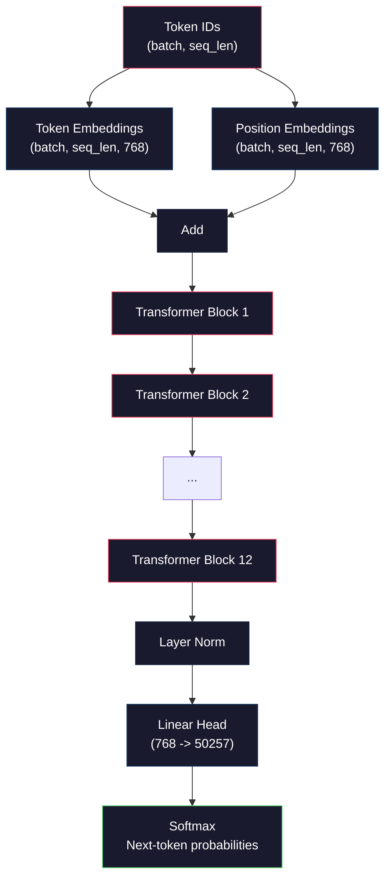
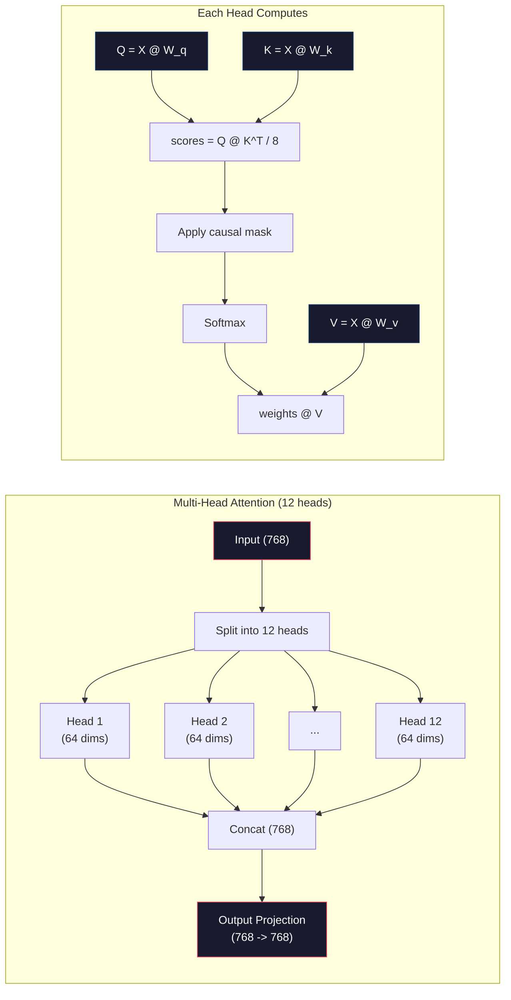
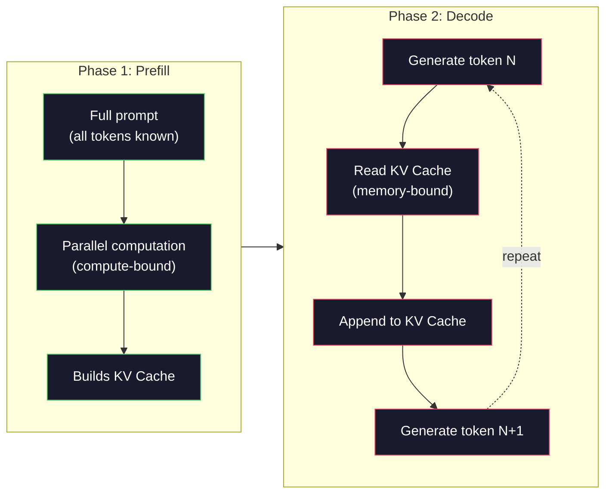

# Pre-Trening Mini GPT (124M Parametrów)

> GPT-2 Small ma 124 miliony parametrów. To 12 warstw transformera, 12 głowic uwagi i 768-wymiarowe osadzenia. Możesz go wytrenować od zera na pojedynczym GPU w kilka godzin. Większość ludzi nigdy tego nie robi. Używają wstępnie wytrenowanych punktów kontrolnych. Ale jeśli sam nie wytrenujesz jednego, tak naprawdę nie rozumiesz, co dzieje się wewnątrz modelu, na którym budujesz produkty.

**Type:** Build
**Languages:** Python (with numpy)
**Prerequisites:** Phase 10, Lessons 01-03 (Tokenizers, Building a Tokenizer, Data Pipelines)
**Time:** ~120 minutes

## Learning Objectives

- Zaimplementuj pełną architekturę GPT-2 (124M parametrów) od podstaw: osadzenia tokenów, osadzenia pozycyjne, bloki transformera i głowę modelu językowego
- Wytrenuj model GPT na korpusie tekstowym za pomocą predykcji następnego tokena z funkcją straty cross-entropy
- Zaimplementuj autoregresyjne generowanie tekstu z próbkowaniem temperaturowym i filtrowaniem top-k/top-p
- Monitoruj krzywe straty treningowej i zweryfikuj, że model uczy się spójnych wzorców językowych

## Problem

Wiesz, czym jest transformer. Czytałeś diagramy. Potrafisz wyrecytować "attention is all you need" i narysować na tablicy pudełka oznaczone "Multi-Head Attention".

Żadne z tego nie oznacza, że rozumiesz, co się dzieje, gdy model generuje tekst.

W GPT-2 Small (z weight tying) jest 124,438,272 parametrów. Każdy z nich został ustawiony przez uruchomienie pętli treningowej: przejście w przód, obliczenie straty, przejście w tył, aktualizacja wag. Dwanaście bloków transformera. Dwanaście głowic uwagi na blok. 768-wymiarowa przestrzeń osadzeń. Słownik 50,257 tokenów. Za każdym razem, gdy model generuje token, wszystkie 124 miliony parametrów uczestniczy w pojedynczym łańcuchu mnożenia macierzy, który przyjmuje sekwencję identyfikatorów tokenów i produkuje rozkład prawdopodobieństwa nad następnym tokenem.

Jeśli nigdy sam tego nie zbudowałeś, pracujesz z czarną skrzynką. Możesz używać API. Możesz dostrajać. Ale gdy coś pójdzie nie tak -- gdy model halucynuje, gdy się powtarza, gdy odmawia wykonania instrukcji -- nie masz modelu mentalnego *dlaczego*.

Ta lekcja buduje GPT-2 Small od podstaw. Nie w PyTorch. W numpy. Każde mnożenie macierzy jest widoczne. Każdy gradient jest obliczany przez twój kod. Zobaczysz dokładnie, jak 124 miliony liczb spiskują, aby przewidzieć następne słowo.

## Koncepcja

### Architektura GPT

GPT to autoregresyjny model językowy. "Autoregresyjny" oznacza, że generuje jeden token na raz, każdy uwarunkowany wszystkimi poprzednimi tokenami. Architektura to stos bloków dekodera transformera.

Oto pełny graf obliczeniowy od identyfikatorów tokenów do prawdopodobieństw następnego tokena:

1. Wchodzą identyfikatory tokenów. Kształt: (batch_size, seq_len).
2. Wyszukiwanie osadzeń tokenów. Każdy ID mapuje się na 768-wymiarowy wektor. Kształt: (batch_size, seq_len, 768).
3. Wyszukiwanie osadzeń pozycyjnych. Każda pozycja (0, 1, 2, ...) mapuje się na 768-wymiarowy wektor. Ten sam kształt.
4. Dodaj osadzenia tokenów + osadzenia pozycyjne.
5. Przejdź przez 12 bloków transformera.
6. Końcowa normalizacja warstwowa.
7. Projekcja liniowa do rozmiaru słownika. Kształt: (batch_size, seq_len, vocab_size).
8. Softmax, aby uzyskać prawdopodobieństwa.

To jest cały model. Żadnych konwolucji. Żadnej rekurencji. Tylko osadzenia, uwaga, sieci feedforward i normalizacje warstwowe ułożone 12 razy.



### Blok Transformera

Każdy z 12 bloków podąża za tym samym wzorcem. Architektura pre-norm (GPT-2 używa pre-norm, a nie post-norm jak oryginalny transformer):

1. LayerNorm
2. Multi-Head Self-Attention
3. Połączenie resztkowe (dodaj wejście z powrotem)
4. LayerNorm
5. Sieć Feed-Forward (MLP)
6. Połączenie resztkowe (dodaj wejście z powrotem)

Połączenia resztkowe są krytyczne. Bez nich gradienty znikają, zanim dotrą do bloku 1 podczas wstecznej propagacji. Z nimi gradienty mogą płynąć bezpośrednio od straty do dowolnej warstwy przez ścieżkę "pomijającą". Dlatego możesz układać 12, 32, a nawet 96 bloków (mówi się, że GPT-4 używa 120).

### Uwaga: Podstawowy Mechanizm

Samo-uwaga pozwala każdemu tokenowi patrzeć na każdy poprzedni token i decydować, jak bardzo zwracać uwagę na każdy z nich. Oto matematyka.

Dla każdej pozycji tokena oblicz trzy wektory z wejścia:
- **Query (Q)**: "Czego szukam?"
- **Key (K)**: "Co zawieram?"
- **Value (V)**: "Jakie informacje niosę?"

```
Q = input @ W_q    (768 -> 768)
K = input @ W_k    (768 -> 768)
V = input @ W_v    (768 -> 768)

attention_scores = Q @ K^T / sqrt(d_k)
attention_scores = mask(attention_scores)   # causal mask: -inf for future positions
attention_weights = softmax(attention_scores)
output = attention_weights @ V
```

Maska przyczynowa jest tym, co czyni GPT autoregresyjnym. Pozycja 5 może zwracać uwagę na pozycje 0-5, ale nie na 6, 7, 8 itd. To zapobiega "oszukiwaniu" przez model poprzez patrzenie na przyszłe tokeny podczas treningu.

**Uwaga wielogłowicowa** dzieli 768-wymiarową przestrzeń na 12 głowic po 64 wymiary każda. Każda głowica uczy się innego wzorca uwagi. Jedna głowica może śledzić relacje składniowe (zgodność podmiotu z orzeczeniem). Inna może śledzić podobieństwo semantyczne (synonimy). Inna może śledzić bliskość pozycyjną (sąsiednie słowa). Wyniki ze wszystkich 12 głowic są konkatenowane i projektowane z powrotem do 768 wymiarów.



Dzielenie przez sqrt(d_k) -- sqrt(64) = 8 -- to skalowanie. Bez niego iloczyny skalarne rosną dla wektorów wysokowymiarowych, wpychając softmax w obszary, gdzie gradienty są prawie zerowe. To był jeden z kluczowych insightów w oryginalnym artykule "Attention Is All You Need".

### KV Cache: Dlaczego Inferencja Jest Szybka

Podczas treningu przetwarzasz całą sekwencję naraz. Podczas inferencji generujesz jeden token na raz. Bez optymalizacji, wygenerowanie tokena N wymaga ponownego obliczenia uwagi dla wszystkich N-1 poprzednich tokenów. To O(N^2) na wygenerowany token, czyli O(N^3) łącznie dla sekwencji długości N.

KV Cache rozwiązuje to. Po obliczeniu K i V dla każdego tokena, przechowuj je. Podczas generowania tokena N+1, potrzebujesz tylko obliczyć Q dla nowego tokena i odczytać z pamięci podręcznej K i V ze wszystkich poprzednich tokenów. To redukuje koszt na token z O(N) do O(1) dla obliczeń K i V. Obliczanie wyniku uwagi jest nadal O(N), ponieważ zwracasz uwagę na wszystkie poprzednie pozycje, ale unikasz zbędnych mnożeń macierzy na wejściu.

Dla GPT-2 z 12 warstwami i 12 głowicami, KV cache przechowuje 2 (K + V) x 12 warstw x 12 głowic x 64 wymiary = 18,432 wartości na token. Dla sekwencji 1024 tokenów to około 75MB w FP32. Dla Llamy 3 405B ze 128 warstwami, KV cache dla pojedynczej sekwencji może przekroczyć 10GB. Dlatego inferencja długiego kontekstu jest ograniczona przez pamięć.

### Prefill vs Decode: Dwie Fazy Inferencji

Gdy wysyłasz prompt do LLM-a, inferencja odbywa się w dwóch odrębnych fazach.

**Prefill** przetwarza cały prompt równolegle. Wszystkie tokeny są znane, więc model może obliczyć uwagę dla wszystkich pozycji jednocześnie. Ta faza jest ograniczona obliczeniowo -- GPU wykonuje mnożenia macierzy z pełną przepustowością. Dla prompta 1000 tokenów na A100, prefill zajmuje około 20-50ms.

**Decode** generuje tokeny jeden po drugim. Każdy nowy token zależy od wszystkich poprzednich tokenów. Ta faza jest ograniczona przez pamięć -- wąskim gardłem jest odczytywanie wag modelu i KV cache z pamięci GPU, a nie sama matematyka macierzy. Rdzenie obliczeniowe GPU siedzą głównie bezczynnie, czekając na odczyty pamięci. Dla GPT-2, każdy krok dekodowania zajmuje mniej więcej tyle samo czasu, niezależnie od tego, ile FLOPs wymagają mnożenia macierzy, ponieważ przepustowość pamięci jest ograniczeniem.

To rozróżnienie ma znaczenie dla systemów produkcyjnych. Przepustowość Prefill skaluje się z mocą obliczeniową GPU (więcej FLOPS = szybszy prefill). Przepustowość Decode skaluje się z przepustowością pamięci (szybsza pamięć = szybsze dekodowanie). Dlatego NVIDIA H100 skupiła się na ulepszeniach przepustowości pamięci w stosunku do A100 -- bezpośrednio przyspiesza to generowanie tokenów.



### Pętla Treningowa

Trenowanie LLM-a to predykcja następnego tokena. Mając tokeny [0, 1, 2, ..., N-1], przewiduj tokeny [1, 2, 3, ..., N]. Funkcja straty to cross-entropia między przewidywanym rozkładem prawdopodobieństwa modelu a rzeczywistym następnym tokenem.

Jeden krok treningowy:

1. **Przejście w przód**: Przepuść wsad przez wszystkie 12 bloków. Uzyskaj logity (wyniki przed softmax) dla każdej pozycji.
2. **Oblicz stratę**: Cross-entropia między logitami a docelowymi tokenami (wejście przesunięte o jedną pozycję).
3. **Przejście w tył**: Oblicz gradienty dla wszystkich 124M parametrów za pomocą wstecznej propagacji.
4. **Krok optymalizatora**: Zaktualizuj wagi. GPT-2 używa Adama z rozgrzewaniem współczynnika uczenia i wygaszaniem cosinusoidalnym.

Harmonogram współczynnika uczenia ma większe znaczenie, niż możesz się spodziewać. GPT-2 rozgrzewa się od 0 do szczytowego współczynnika uczenia przez pierwsze 2,000 kroków, a następnie wygasa zgodnie z krzywą cosinusoidalną. Rozpoczęcie z wysokim współczynnikiem uczenia powoduje rozbieżność modelu. Utrzymywanie stałego wysokiego współczynnika powoduje oscylacje w późniejszym treningu. Wzorzec rozgrzewania, a następnie wygaszania jest używany przez każdy duży LLM.

### GPT-2 Small: Liczby

| Komponent | Kształt | Parametry |
|-----------|-------|------------|
| Osadzenia tokenów | (50257, 768) | 38,597,376 |
| Osadzenia pozycyjne | (1024, 768) | 786,432 |
| Uwaga na blok (W_q, W_k, W_v, W_out) | 4 x (768, 768) | 2,359,296 |
| FFN na blok (w górę + w dół) | (768, 3072) + (3072, 768) | 4,718,592 |
| LayerNorms na blok (2x) | 2 x 768 x 2 | 3,072 |
| Końcowy LayerNorm | 768 x 2 | 1,536 |
| **Razem na blok** | | **7,080,960** |
| **Razem (12 bloków)** | | **85,054,464 + 39,383,808 = 124,438,272** |

Projekcja wyjściowa (głowica logitów) dzieli wagi z macierzą osadzeń tokenów. Nazywa się to wiązaniem wag (weight tying) -- redukuje liczbę parametrów o 38M i poprawia wydajność, ponieważ zmusza model do używania tej samej przestrzeni reprezentacji dla wejścia i wyjścia.

## Zbuduj To

### Krok 1: Warstwa Osadzeń

Osadzenia tokenów mapują każdy z 50,257 możliwych tokenów na 768-wymiarowy wektor. Osadzenia pozycyjne dodają informację o tym, gdzie każdy token znajduje się w sekwencji. Te dwie są sumowane.

```python
import numpy as np

class Embedding:
    def __init__(self, vocab_size, embed_dim, max_seq_len):
        self.token_embed = np.random.randn(vocab_size, embed_dim) * 0.02
        self.pos_embed = np.random.randn(max_seq_len, embed_dim) * 0.02

    def forward(self, token_ids):
        seq_len = token_ids.shape[-1]
        tok_emb = self.token_embed[token_ids]
        pos_emb = self.pos_embed[:seq_len]
        return tok_emb + pos_emb
```

Odchylenie standardowe 0.02 dla inicjalizacji pochodzi z artykułu GPT-2. Zbyt duże powoduje, że początkowe przejścia w przód produkują ekstremalne wartości destabilizujące trening. Zbyt małe powoduje, że początkowe wyniki są prawie identyczne dla wszystkich wejść, czyniąc wczesne sygnały gradientu bezużytecznymi.

### Krok 2: Samo-Uwaga z Maską Przyczynową

Najpierw uwaga jednogłowicowa. Maska przyczynowa ustawia przyszłe pozycje na ujemną nieskończoność przed softmax, zapewniając, że każda pozycja może zwracać uwagę tylko na siebie i wcześniejsze pozycje.

```python
def attention(Q, K, V, mask=None):
    d_k = Q.shape[-1]
    scores = Q @ K.transpose(0, -1, -2 if Q.ndim == 4 else 1) / np.sqrt(d_k)
    if mask is not None:
        scores = scores + mask
    weights = np.exp(scores - scores.max(axis=-1, keepdims=True))
    weights = weights / weights.sum(axis=-1, keepdims=True)
    return weights @ V
```

Implementacja softmax odejmuje maksimum przed potęgowaniem. Bez tego exp(duża_liczba) przepełnia się do nieskończoności. To sztuczka numerycznej stabilności, która nie zmienia wyniku, ponieważ softmax(x - c) = softmax(x) dla dowolnej stałej c.

### Krok 3: Uwaga Wielogłowicowa

Podziel 768-wymiarowe wejście na 12 głowic po 64 wymiary każda. Każda głowica oblicza uwagę niezależnie. Konkatenuj wyniki i projektuj z powrotem do 768 wymiarów.

```python
class MultiHeadAttention:
    def __init__(self, embed_dim, num_heads):
        self.num_heads = num_heads
        self.head_dim = embed_dim // num_heads
        self.W_q = np.random.randn(embed_dim, embed_dim) * 0.02
        self.W_k = np.random.randn(embed_dim, embed_dim) * 0.02
        self.W_v = np.random.randn(embed_dim, embed_dim) * 0.02
        self.W_out = np.random.randn(embed_dim, embed_dim) * 0.02

    def forward(self, x, mask=None):
        batch, seq_len, d = x.shape
        Q = (x @ self.W_q).reshape(batch, seq_len, self.num_heads, self.head_dim).transpose(0, 2, 1, 3)
        K = (x @ self.W_k).reshape(batch, seq_len, self.num_heads, self.head_dim).transpose(0, 2, 1, 3)
        V = (x @ self.W_v).reshape(batch, seq_len, self.num_heads, self.head_dim).transpose(0, 2, 1, 3)

        scores = Q @ K.transpose(0, 1, 3, 2) / np.sqrt(self.head_dim)
        if mask is not None:
            scores = scores + mask
        weights = np.exp(scores - scores.max(axis=-1, keepdims=True))
        weights = weights / weights.sum(axis=-1, keepdims=True)
        attn_out = weights @ V

        attn_out = attn_out.transpose(0, 2, 1, 3).reshape(batch, seq_len, d)
        return attn_out @ self.W_out
```

Taniec reshape-transpose-reshape to najbardziej myląca część uwagi wielogłowicowej. Oto co się dzieje: tensor (batch, seq_len, 768) staje się (batch, seq_len, 12, 64), następnie (batch, 12, seq_len, 64). Teraz każda z 12 głowic ma własną macierz (seq_len, 64) do uruchomienia uwagi. Po uwadze odwracamy proces: (batch, 12, seq_len, 64) staje się (batch, seq_len, 12, 64) staje się (batch, seq_len, 768).

### Krok 4: Blok Transformera

Jeden kompletny blok transformera: LayerNorm, uwaga wielogłowicowa z połączeniem resztkowym, LayerNorm, feedforward z połączeniem resztkowym.

```python
class LayerNorm:
    def __init__(self, dim, eps=1e-5):
        self.gamma = np.ones(dim)
        self.beta = np.zeros(dim)
        self.eps = eps

    def forward(self, x):
        mean = x.mean(axis=-1, keepdims=True)
        var = x.var(axis=-1, keepdims=True)
        return self.gamma * (x - mean) / np.sqrt(var + self.eps) + self.beta


class FeedForward:
    def __init__(self, embed_dim, ff_dim):
        self.W1 = np.random.randn(embed_dim, ff_dim) * 0.02
        self.b1 = np.zeros(ff_dim)
        self.W2 = np.random.randn(ff_dim, embed_dim) * 0.02
        self.b2 = np.zeros(embed_dim)

    def forward(self, x):
        h = x @ self.W1 + self.b1
        h = np.maximum(0, h)  # GELU approximation: ReLU for simplicity
        return h @ self.W2 + self.b2


class TransformerBlock:
    def __init__(self, embed_dim, num_heads, ff_dim):
        self.ln1 = LayerNorm(embed_dim)
        self.attn = MultiHeadAttention(embed_dim, num_heads)
        self.ln2 = LayerNorm(embed_dim)
        self.ffn = FeedForward(embed_dim, ff_dim)

    def forward(self, x, mask=None):
        x = x + self.attn.forward(self.ln1.forward(x), mask)
        x = x + self.ffn.forward(self.ln2.forward(x))
        return x
```

Sieć feedforward rozszerza 768-wymiarowe wejście do 3,072 wymiarów (4x), stosuje nieliniowość, a następnie projektuje z powrotem do 768. Ten wzorzec ekspansji-kontrakcji daje modelowi "szerszą" wewnętrzną reprezentację do pracy na każdej pozycji. GPT-2 używa aktywacji GELU, ale my używamy ReLU dla uproszczenia -- różnica jest niewielka dla zrozumienia architektury.

### Krok 5: Pełny Model GPT

Ułóż 12 bloków transformera. Dodaj warstwę osadzeń z przodu i projekcję wyjściową z tyłu.

```python
class MiniGPT:
    def __init__(self, vocab_size=50257, embed_dim=768, num_heads=12,
                 num_layers=12, max_seq_len=1024, ff_dim=3072):
        self.embedding = Embedding(vocab_size, embed_dim, max_seq_len)
        self.blocks = [
            TransformerBlock(embed_dim, num_heads, ff_dim)
            for _ in range(num_layers)
        ]
        self.ln_f = LayerNorm(embed_dim)
        self.vocab_size = vocab_size
        self.embed_dim = embed_dim

    def forward(self, token_ids):
        seq_len = token_ids.shape[-1]
        mask = np.triu(np.full((seq_len, seq_len), -1e9), k=1)

        x = self.embedding.forward(token_ids)
        for block in self.blocks:
            x = block.forward(x, mask)
        x = self.ln_f.forward(x)

        logits = x @ self.embedding.token_embed.T
        return logits

    def count_parameters(self):
        total = 0
        total += self.embedding.token_embed.size
        total += self.embedding.pos_embed.size
        for block in self.blocks:
            total += block.attn.W_q.size + block.attn.W_k.size
            total += block.attn.W_v.size + block.attn.W_out.size
            total += block.ffn.W1.size + block.ffn.b1.size
            total += block.ffn.W2.size + block.ffn.b2.size
            total += block.ln1.gamma.size + block.ln1.beta.size
            total += block.ln2.gamma.size + block.ln2.beta.size
        total += self.ln_f.gamma.size + self.ln_f.beta.size
        return total
```

Zwróć uwagę na wiązanie wag: `logits = x @ self.embedding.token_embed.T`. Projekcja wyjściowa ponownie używa macierzy osadzeń tokenów (transponowanej). To nie tylko sztuczka oszczędzania parametrów. Oznacza, że model używa tej samej przestrzeni wektorowej do rozumienia tokenów (osadzenia) i przewidywania ich (wynik).

### Krok 6: Pętla Treningowa

Dla prawdziwego treningu na 124M parametrach potrzebowałbyś GPU i PyTorch. Ta pętla treningowa demonstruje mechanikę na małym modelu, który działa w czystym numpy. Używamy małego modelu (4 warstwy, 4 głowice, 128 wymiarów), aby był wykonalny.

```python
def cross_entropy_loss(logits, targets):
    batch, seq_len, vocab_size = logits.shape
    logits_flat = logits.reshape(-1, vocab_size)
    targets_flat = targets.reshape(-1)

    max_logits = logits_flat.max(axis=-1, keepdims=True)
    log_softmax = logits_flat - max_logits - np.log(
        np.exp(logits_flat - max_logits).sum(axis=-1, keepdims=True)
    )

    loss = -log_softmax[np.arange(len(targets_flat)), targets_flat].mean()
    return loss


def train_mini_gpt(text, vocab_size=256, embed_dim=128, num_heads=4,
                   num_layers=4, seq_len=64, num_steps=200, lr=3e-4):
    tokens = np.array(list(text.encode("utf-8")[:2048]))
    model = MiniGPT(
        vocab_size=vocab_size, embed_dim=embed_dim, num_heads=num_heads,
        num_layers=num_layers, max_seq_len=seq_len, ff_dim=embed_dim * 4
    )

    print(f"Model parameters: {model.count_parameters():,}")
    print(f"Training tokens: {len(tokens):,}")
    print(f"Config: {num_layers} layers, {num_heads} heads, {embed_dim} dims")
    print()

    for step in range(num_steps):
        start_idx = np.random.randint(0, max(1, len(tokens) - seq_len - 1))
        batch_tokens = tokens[start_idx:start_idx + seq_len + 1]

        input_ids = batch_tokens[:-1].reshape(1, -1)
        target_ids = batch_tokens[1:].reshape(1, -1)

        logits = model.forward(input_ids)
        loss = cross_entropy_loss(logits, target_ids)

        if step % 20 == 0:
            print(f"Step {step:4d} | Loss: {loss:.4f}")

    return model
```

Strata zaczyna się blisko ln(vocab_size) -- dla słownika 256 tokenów na poziomie bajtów to ln(256) = 5.55. Losowy model przypisuje równe prawdopodobieństwo każdemu tokenowi. W miarę postępu treningu strata spada, ponieważ model uczy się przewidywać popularne wzorce: "th" po "t", spacja po kropce i tak dalej.

W produkcji użyłbyś optymalizatora Adam z akumulacją gradientów, rozgrzewaniem współczynnika uczenia i przycinaniem gradientów. Pętla forward-pass-loss-backward-update jest identyczna. Optymalizator jest bardziej wyrafinowany.

### Krok 7: Generowanie Tekstu

Generowanie używa wytrenowanego modelu do przewidywania jednego tokena na raz. Każda predykcja jest próbkowana z rozkładu wyjściowego (lub pobierana zachłannie jako argmax).

```python
def generate(model, prompt_tokens, max_new_tokens=100, temperature=0.8):
    tokens = list(prompt_tokens)
    seq_len = model.embedding.pos_embed.shape[0]

    for _ in range(max_new_tokens):
        context = np.array(tokens[-seq_len:]).reshape(1, -1)
        logits = model.forward(context)
        next_logits = logits[0, -1, :]

        next_logits = next_logits / temperature
        probs = np.exp(next_logits - next_logits.max())
        probs = probs / probs.sum()

        next_token = np.random.choice(len(probs), p=probs)
        tokens.append(next_token)

    return tokens
```

Temperatura kontroluje losowość. Temperatura 1.0 używa surowego rozkładu. Temperatura 0.5 wyostrza go (bardziej deterministyczny -- model częściej wybiera swoje najlepsze opcje). Temperatura 1.5 spłaszcza go (bardziej losowy -- tokeny o niskim prawdopodobieństwie dostają większą szansę). Temperatura 0.0 to dekodowanie zachłanne (zawsze wybieraj token o najwyższym prawdopodobieństwie).

Okno `tokens[-seq_len:]` jest konieczne, ponieważ model ma maksymalną długość kontekstu (1024 dla GPT-2). Gdy ją przekroczysz, musisz odrzucić najstarsze tokeny. To jest "okno kontekstowe", o którym wszyscy mówią.

```figure
sampling-decoder
```

## Użyj Tego

### Pełna Demonstracja Treningu i Generowania

```python
corpus = """The transformer architecture has revolutionized natural language processing.
Attention mechanisms allow the model to focus on relevant parts of the input.
Self-attention computes relationships between all pairs of positions in a sequence.
Multi-head attention splits the representation into multiple subspaces.
Each attention head can learn different types of relationships.
The feedforward network provides nonlinear transformations at each position.
Residual connections enable gradient flow through deep networks.
Layer normalization stabilizes training by normalizing activations.
Position embeddings give the model information about token ordering.
The causal mask ensures autoregressive generation during training.
Pre-training on large text corpora teaches the model general language understanding.
Fine-tuning adapts the pre-trained model to specific downstream tasks."""

model = train_mini_gpt(corpus, num_steps=200)

prompt = list("The transformer".encode("utf-8"))
output_tokens = generate(model, prompt, max_new_tokens=100, temperature=0.8)
generated_text = bytes(output_tokens).decode("utf-8", errors="replace")
print(f"\nGenerated: {generated_text}")
```

Na małym korpusie z małym modelem wygenerowany tekst będzie co najwyżej pół-spójny. Nauczy się pewnych wzorców na poziomie bajtów z tekstu treningowego, ale nie będzie w stanie generalizować tak, jak GPT-2 z 40GB danych treningowych i pełną architekturą 124M parametrów. Nie chodzi o jakość wyniku. Chodzi o to, że możesz prześledzić każdy krok: wyszukiwanie osadzeń, obliczanie uwagi, transformację feedforward, projekcję logitów, softmax i próbkowanie. Każda operacja jest widoczna.

## Dostarcz To

Ta lekcja produkuje `outputs/prompt-gpt-architecture-analyzer.md` -- prompt, który analizuje wybory architektoniczne w dowolnym modelu stylu GPT. Podaj kartę modelu lub raport techniczny, a on rozłoży alokację parametrów, projekt uwagi i decyzje dotyczące skalowania.

## Ćwiczenia

1. Zmodyfikuj model, aby używał 24 warstw i 16 głowic zamiast 12/12. Policz parametry. Jak podwojenie głębokości ma się do podwojenia szerokości (wymiaru osadzeń)?

2. Zaimplementuj funkcję aktywacji GELU (GELU(x) = x * 0.5 * (1 + erf(x / sqrt(2)))) i zastąp ReLU w sieci feedforward. Uruchom trening na 500 kroków z każdą aktywacją i porównaj końcową stratę.

3. Dodaj KV cache do funkcji generowania. Przechowuj tensory K i V dla każdej warstwy po pierwszym przejściu w przód i używaj ich ponownie dla kolejnych tokenów. Zmierz przyspieszenie: wygeneruj 200 tokenów z i bez cache i porównaj czas rzeczywisty.

4. Zaimplementuj próbkowanie top-k (uwzględniaj tylko k tokenów o najwyższym prawdopodobieństwie) i próbkowanie top-p (próbkowanie jądrowe: rozważ najmniejszy zestaw tokenów, których skumulowane prawdopodobieństwo przekracza p). Porównaj jakość wyniku przy temperaturze 0.8 z top-k=50 vs top-p=0.95.

5. Zbuduj kreślarz krzywej straty treningowej. Trenuj model przez 1000 kroków i wykreśl stratę względem kroku. Zidentyfikuj trzy fazy: szybki początkowy spadek (nauka popularnych bajtów), wolniejsza faza środkowa (nauka wzorców bajtów) i plateau (przetrenowanie na małym korpusie). Kształt tej krzywej jest taki sam, niezależnie od tego, czy trenujesz model 128-wymiarowy, czy GPT-4.

## Kluczowe Terminy

| Termin | Co ludzie mówią | Co to naprawdę znaczy |
|------|----------------|----------------------|
| Autoregresyjny | "Generuje jedno słowo na raz" | Każdy token wyjściowy jest uwarunkowany wszystkimi poprzednimi tokenami -- model przewiduje P(token_n \| token_0, ..., token_{n-1}) |
| Maska przyczynowa | "Nie widzi przyszłości" | Górna-trójkątna macierz wartości -infinity, która zapobiega uwadze na przyszłe pozycje podczas treningu |
| Uwaga wielogłowicowa | "Wiele wzorców uwagi" | Dzielenie Q, K, V na równoległe głowice (np. 12 głowic po 64 wymiary dla GPT-2), aby każda głowica mogła uczyć się różnych typów relacji |
| KV Cache | "Buforowanie dla szybkości" | Przechowywanie obliczonych tensorów Key i Value z poprzednich tokenów, aby uniknąć zbędnych obliczeń podczas autoregresyjnego generowania |
| Prefill | "Przetwarzanie prompta" | Pierwsza faza inferencji, gdzie wszystkie tokeny prompta są przetwarzane równolegle -- ograniczona obliczeniowo przez FLOPS GPU |
| Decode | "Generowanie tokenów" | Druga faza inferencji, gdzie tokeny są generowane jeden po drugim -- ograniczona przez przepustowość pamięci GPU |
| Wiązanie wag | "Współdzielenie osadzeń" | Używanie tej samej macierzy dla wejściowych osadzeń tokenów i wyjściowej głowicy projekcji -- oszczędza 38M parametrów w GPT-2 |
| Połączenie resztkowe | "Połączenie pomijające" | Dodawanie wejścia bezpośrednio do wyniku podwarstwy (x + sublayer(x)) -- umożliwia przepływ gradientów w głębokich sieciach |
| Normalizacja warstwowa | "Normalizowanie aktywacji" | Normalizacja wzdłuż wymiaru cech do średniej 0 i wariancji 1, z uczonymi parametrami skali i przesunięcia |
| Strata cross-entropii | "Jak błędne są przewidywania" | -log(prawdopodobieństwo przypisane poprawnemu następnemu tokenowi), uśrednione po wszystkich pozycjach -- standardowy cel treningowy LLM |

## Dalsza Lektura

- [Radford et al., 2019 -- "Language Models are Unsupervised Multitask Learners" (GPT-2)](https://cdn.openai.com/better-language-models/language_models_are_unsupervised_multitask_learners.pdf) -- artykuł GPT-2, który wprowadził rodzinę 124M do 1.5B parametrów
- [Vaswani et al., 2017 -- "Attention Is All You Need"](https://arxiv.org/abs/1706.03762) -- oryginalny artykuł o transformerze z skalowaną uwagą iloczynową i uwagą wielogłowicową
- [Llama 3 Technical Report](https://arxiv.org/abs/2407.21783) -- jak Meta przeskalowała architekturę GPT do 405B parametrów na 16K GPU
- [Pope et al., 2022 -- "Efficiently Scaling Transformer Inference"](https://arxiv.org/abs/2211.05102) -- artykuł, który sformalizował prefill vs decode i analizę KV cache