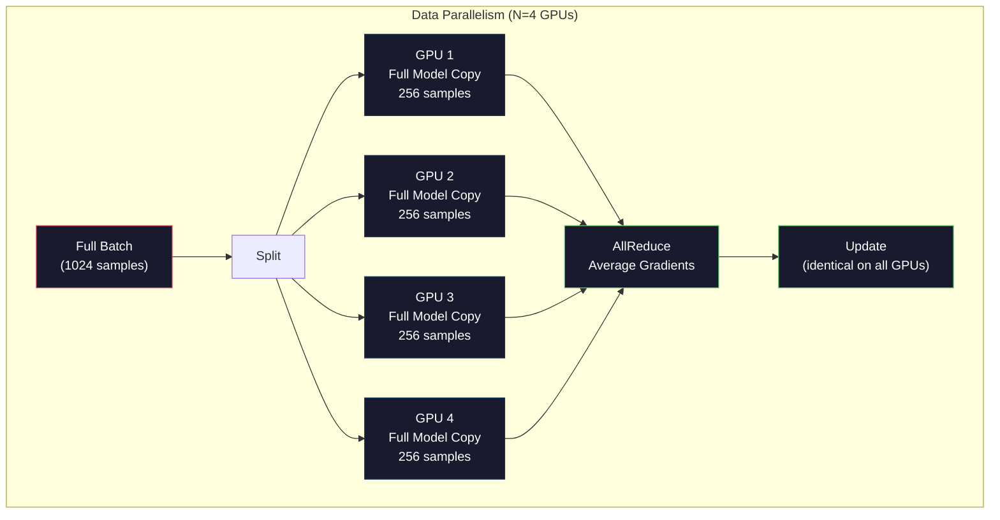
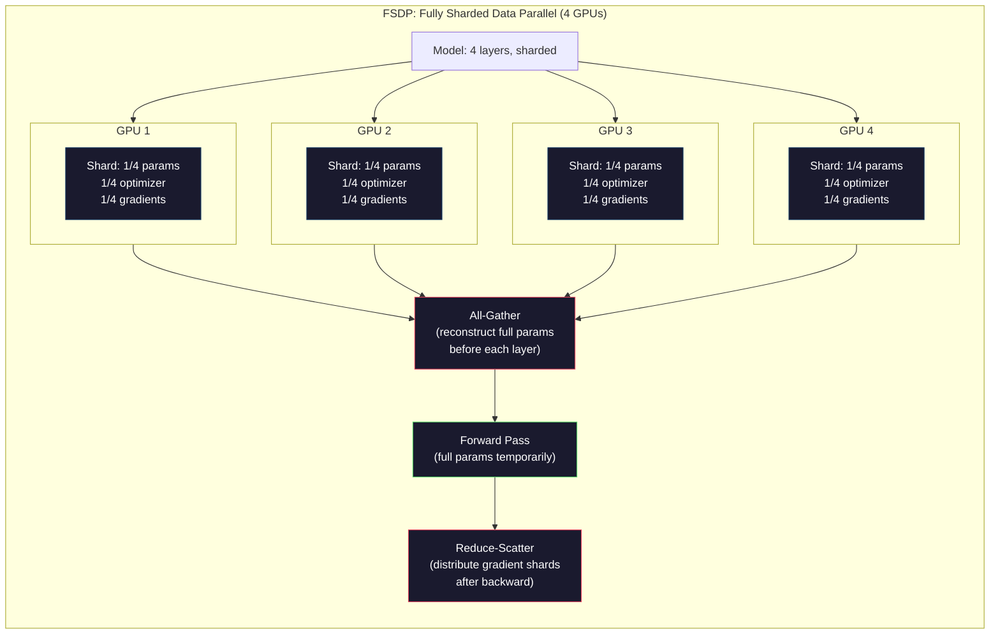
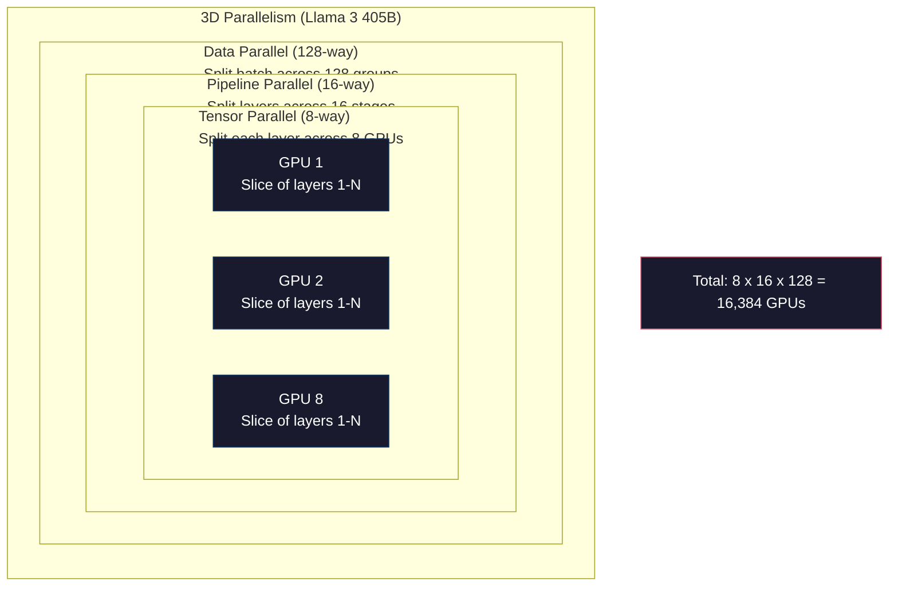

# Skalowanie: Trening Rozproszony, FSDP, DeepSpeed

> Twój model 124M wytrenowany na jednym GPU. Teraz spróbuj 7 miliardów parametrów. Model nie mieści się w pamięci. Dane zajmują tygodnie na pojedynczej maszynie. Trening rozproszony nie jest opcjonalny przy skali. To jedyna droga naprzód.

**Type:** Build
**Languages:** Python
**Prerequisites:** Phase 10, Lesson 04 (Pre-Training a Mini GPT)
**Time:** ~120 minutes

## Learning Objectives

- Wyjaśnij trzy typy równoległości (danych, tensorów, potoku) i kiedy każdy jest niezbędny w zależności od rozmiaru modelu i klastra
- Zaimplementuj trening równoległy danych za pomocą PyTorch DDP z synchronizacją gradientów na wielu GPU
- Oblicz budżet pamięci dla danego rozmiaru modelu (wagi + stany optymalizatora + gradienty + aktywacje), aby określić minimalny sprzęt
- Skonfiguruj FSDP lub DeepSpeed ZeRO, aby dzielić stany modelu między GPU i dopasować modele przekraczające pamięć pojedynczego GPU

## Problem

Model 7B parametrów w FP16 potrzebuje 14GB tylko na wagi. Optymalizator Adam przechowuje dwie dodatkowe kopie każdego parametru (estymaty pierwszego i drugiego momentu). To kolejne 28GB. Gradienty podczas wstecznej propagacji dodają 14GB więcej. Jesteś na 56GB, zanim przechowana zostanie pojedyncza aktywacja.

NVIDIA A100 ma 80GB pamięci.

56GB z 80GB zużyte. Zostaje 24GB na aktywacje -- wartości pośrednie obliczone podczas przejścia w przód, które muszą być utrzymywane dla wstecznej propagacji. Dla sekwencji 2048 tokenów z modelem 4096-wymiarowym, aktywacje pojedynczej warstwy zużywają około 64MB. Przy 32 warstwach potrzebujesz 2GB na próbkę. Rozmiar wsadu 8 wymaga 16GB. Masz 24GB. Rozmiar wsadu 12 eksploduje.

Teraz spróbuj 70B parametrów. Same wagi: 140GB w FP16. Nie mieści się na jednym GPU. Potrzebujesz co najmniej 2 A100 (2 x 80GB = 160GB) tylko do utrzymania wag. Dodaj stany optymalizatora i gradienty, a potrzebujesz znacznie więcej: minimum 3+ GPU, a realistycznie 8-16 w zależności od strategii dzielenia.

Llama 3 405B była trenowana na 16,384 NVIDIA H100 GPU. Koszt treningu oszacowano na około 100 milionów dolarów w mocy obliczeniowej. DeepSeek V3 wytrenował porównywalny model za około 5.6 miliona dolarów, będąc sprytnym w kwestii architektury (Mixture of Experts oznacza, że tylko ułamek parametrów aktywuje się na token) i wydajności treningu.

Ta lekcja obejmuje cztery strategie, które umożliwiają trenowanie na dużą skalę: równoległość danych, równoległość tensorów, równoległość potoku i w pełni dzielona równoległość danych. Zasymulujesz każdą z nich w czystym Pythonie, aby zrozumieć mechanikę, zanim kiedykolwiek dotkniesz frameworka do treningu rozproszonego.

## Koncepcja

### Dlaczego Dystrybucja jest Wymagana

Oto matematyka pamięci dla prawdziwych modeli. Każda liczba jest obliczona, nie oszacowana.

| Model | Parametry | Wagi (FP16) | Stany Adama | Gradienty (FP16) | Razem (bez aktywacji) |
|-------|--------|----------------|-------------|------------------|----------------------|
| GPT-2 Small | 124M | 248 MB | 992 MB | 248 MB | 1.5 GB |
| Llama 3 8B | 8B | 16 GB | 64 GB | 16 GB | 96 GB |
| Llama 3 70B | 70B | 140 GB | 560 GB | 140 GB | 840 GB |
| Llama 3 405B | 405B | 810 GB | 3,240 GB | 810 GB | 4,860 GB |

Kolumna "Stany Adama" jest zabójcą. Adam przechowuje średnią bieżącą (m) i wariancję bieżącą (v) dla każdego parametru, obie w FP32. Dla modelu 70B to 70B x 4 bajty x 2 = 560GB. Sam optymalizator potrzebuje siedmiu A100.

Pojedynczy H100 ma 80GB. Llama 3 405B potrzebuje co najmniej 61 H100 do utrzymania wag, optymalizatora i gradientów. Dodaj aktywacje, a liczba rośnie dalej. Meta użyła 16,384 GPU nie dlatego, że chciała -- dlatego, że musiała.

### Równoległość Danych

Najprostsza strategia rozproszona. Skopiuj cały model na N GPU. Podziel każdy wsad treningowy na N równych części. Każde GPU wykonuje przejście w przód i w tył na swoim fragmencie danych. Po przejściu w tył, uśrednij gradienty na wszystkich GPU. Każde GPU aktualizuje swoją kopię wag tymi samymi uśrednionymi gradientami, utrzymując wszystkie kopie zsynchronizowane.

**Dobre:** Liniowe skalowanie przepustowości. N GPU przetwarza N razy więcej danych na krok. Komunikacja jest ograniczona do uśredniania gradientów, które nakłada się na obliczenia.

**Złe:** Każde GPU trzyma kompletną kopię modelu, stanów optymalizatora i gradientów. Dla modelu 70B, każde GPU potrzebuje 840GB. Równoległość danych nic nie robi, aby zmniejszyć pamięć na GPU. Tylko skraca czas treningu.

**Matematyka:** Efektywny rozmiar wsadu = per_gpu_batch_size x N. Dla N=64 GPU z per-GPU wsadem 16, efektywny wsad to 1,024. Llama 3 używała efektywnego rozmiaru wsadu 16 milionów tokenów na krok.



### Równoległość Tensorów

Podziel poszczególne warstwy między GPU. Pojedyncze mnożenie macierzy jest dzielone między GPU, każde oblicza część wyniku.

Rozważ macierz wag o kształcie (8192, 8192) w warstwie feedforward. Przy 4-kierunkowej równoległości tensorów, każde GPU trzyma fragment (8192, 2048). Każde GPU mnoży wejście przez swój fragment, produkując częściowy wynik. Częściowe wyniki są łączone (poprzez all-reduce lub all-gather), aby uzyskać pełny wynik.

**Dobre:** Zmniejsza pamięć na GPU dla wag modelu. Model 70B podzielony na 8 GPU oznacza, że każde GPU trzyma wagi warte ~8.75B parametrów.

**Złe:** Wymaga szybkiej komunikacji między GPU po każdej warstwie. All-reduce po każdym mnożeniu macierzy dodaje opóźnienie. Działa dobrze z NVLink (900 GB/s między GPU na tym samym węźle), ale słabo między węzłami połączonymi przez InfiniBand (400 Gb/s, około 50 GB/s). Równoległość tensorów jest prawie zawsze ograniczona do pojedynczego węzła (8 GPU).

**Rzeczywiste użycie:** Megatron-LM zapoczątkował równoległość tensorów. Llama 3 405B używa 8-kierunkowej równoległości tensorów w każdym węźle.

### Równoległość Potoku

Podziel model według warstw. GPU 1 uruchamia warstwy 1-8. GPU 2 uruchamia warstwy 9-16. GPU 3 uruchamia warstwy 17-24. GPU 4 uruchamia warstwy 25-32. Dane przepływają przez potok: GPU 1 oblicza swoje warstwy i wysyła aktywacje do GPU 2, które oblicza swoje warstwy i wysyła do GPU 3, i tak dalej.

**Dobre:** Minimalna komunikacja między GPU -- tylko aktywacje na granicach warstw, które są małe w porównaniu do gradientów lub wag. Działa między węzłami, ponieważ wymagania dotyczące przepustowości są niskie.

**Złe:** Pęcherze potoku. Gdy GPU 4 oblicza przejście w przód na mikro-wsadzie 1, GPU 1, 2 i 3 są bezczynne (już przesłały swoją część). Podczas przejścia w tył wzór się odwraca. Przy naiwnym potokowaniu, wykorzystanie GPU wynosi tylko 1/N dla N etapów potoku.

**GPipe i PipeDream** rozwiązują problem pęcherzy, dzieląc wsad na mikro-wsady. GPU 1 zaczyna na mikro-wsadzie 2, gdy tylko zakończy przesyłanie mikro-wsadu 1. To nakłada obliczenia na etapy potoku. Przy M mikro-wsadach i N etapach, frakcja pęcherza spada do (N-1)/M. Użyj M=16 mikro-wsadów z N=4 etapami, a pęcherz to 3/16 = 18.75% czasu bezczynności.

### FSDP: W Pełni Dzielona Równoległość Danych

FSDP łączy skalowalność równoległości danych z wydajnością pamięciową dzielenia. Zamiast każdego GPU trzymającego kompletną kopię modelu, każde GPU trzyma tylko 1/N parametrów, gradientów i stanów optymalizatora.

Przed przejściem w przód warstwy, FSDP uruchamia **all-gather**, aby zebrać pełne parametry ze wszystkich GPU do pamięci każdego GPU. Po przejściu w przód, każde GPU odrzuca parametry nielokalne. Podczas wstecznego, all-gather uruchamia się ponownie, aby zrekonstruować parametry do obliczania gradientów. Po przejściu w tył, **reduce-scatter** dystrybuuje fragmenty gradientów, tak aby każde GPU przechowywało tylko 1/N gradientów.

**Matematyka dla modelu 70B na 8 GPU:**

| Komponent | Bez FSDP | Z FSDP |
|-----------|-------------|-----------|
| Wagi (FP16) | 140 GB na GPU | 17.5 GB na GPU |
| Stany Adama (FP32) | 560 GB na GPU | 70 GB na GPU |
| Gradienty (FP16) | 140 GB na GPU | 17.5 GB na GPU |
| **Razem** | **840 GB na GPU** | **105 GB na GPU** |

Bez FSDP nie możesz zmieścić modelu 70B na pojedynczym GPU 80GB. Z FSDP na 8 GPU, każde GPU używa 105GB -- chwila, to wciąż się nie mieści. Potrzebujesz co najmniej 16 GPU, aby zejść poniżej 80GB na GPU, lub połącz FSDP z punktami kontrolnymi aktywacji (przeliczaj aktywacje podczas wstecznego zamiast je przechowywać).

Koszt komunikacji jest wyższy niż w zwykłej równoległości danych z powodu all-gather przed każdą warstwą. Ale oszczędności pamięci sprawiają, że wcześniej niemożliwe treningi stają się możliwe.



### DeepSpeed ZeRO

ZeRO (Zero Redundancy Optimizer) od DeepSpeed jest koncepcyjnie identyczny z FSDP, ale został opracowany niezależnie przez Microsoft. Definiuje trzy etapy, każdy dzielący bardziej agresywnie:

| Etap | Dzieli | Oszczędność pamięci | Komunikacja |
|-------|--------|---------------|---------------|
| ZeRO-1 | Tylko stany optymalizatora | ~4x redukcja | Taka sama jak równoległość danych |
| ZeRO-2 | + Gradienty | ~8x redukcja | Nieco więcej |
| ZeRO-3 | + Parametry | ~Nx redukcja (N GPU) | All-gather na warstwę |

ZeRO-3 jest równoważny FSDP. Nazewnictwo jest inne, mechanizm ten sam. PyTorch dodał FSDP jako natywną implementację po tym, jak DeepSpeed udowodnił koncepcję.

DeepSpeed wprowadził również ZeRO-Offload (przenoszenie stanów optymalizatora do pamięci RAM CPU, która jest tańsza i większa) i ZeRO-Infinity (przenoszenie do dysków NVMe). Te zamieniają szybkość obliczeń na pojemność pamięci -- przeniesione operacje są wolniejsze, ale zwalniają pamięć GPU.

### Trening Mieszanej Precyzji

Nowoczesny trening używa wielu formatów zmiennoprzecinkowych jednocześnie:

- **Przejście w przód**: FP16 lub BF16 (16-bit). Połowa pamięci FP32. Mnożenia macierzy działają 2x szybciej na tensor cores.
- **Wagi główne**: FP32 (32-bit). Utrzymywane przez optymalizator dla precyzji numerycznej podczas aktualizacji wag.
- **Skalowanie straty**: Pomnóż stratę przez dużą stałą przed przejściem w tył, aby zapobiec niedomiarowi gradientów FP16 do zera. Podziel przez tę samą stałą przed krokiem optymalizatora.

BF16 (Brain Float 16) ma ten sam zakres wykładnika co FP32 (8 bitów wykładnika), ale zmniejszoną precyzję (7 bitów mantysy vs 23 FP32). Rzadko potrzebuje skalowania straty, ponieważ może reprezentować ten sam zakres wartości. FP16 ma 5 bitów wykładnika i 10 bitów mantysy -- może reprezentować drobnoziarniste wartości, ale przepełnia/niedomiar przy ekstremalnych wielkościach.

TPU Google używają natywnie BF16. NVIDIA A100 i H100 obsługują zarówno FP16, jak i BF16. Branża w dużej mierze przeszła na BF16, ponieważ eliminuje problemy ze skalowaniem straty.

**Porównanie pamięci dla modelu 7B:**

| Precyzja | Wagi | Optymalizator | Gradienty | Razem |
|-----------|---------|-----------|-----------|-------|
| FP32 wszędzie | 28 GB | 56 GB | 28 GB | 112 GB |
| Mieszana (BF16 + FP32 master) | 14 GB | 56 GB | 14 GB | 84 GB |

Mieszana precyzja oszczędza 28GB na tym modelu. Stany optymalizatora pozostają w FP32 niezależnie -- to tutaj idzie większość pamięci.

### Megatron-LM i Równoległość 3D

Prawdziwy trening na dużą skalę łączy wszystkie trzy rodzaje równoległości:

- **Równoległość danych** między grupami węzłów (skaluj rozmiar wsadu)
- **Równoległość tensorów** w obrębie węzła (dziel warstwy na 8 GPU)
- **Równoległość potoku** między węzłami (dziel grupy warstw między maszyny)

Llama 3 405B na 16,384 H100:
- 8-kierunkowa równoległość tensorów w każdym węźle (8 GPU na węzeł)
- 16-kierunkowa równoległość potoku między węzłami (16 etapów potoku)
- 128-kierunkowa równoległość danych w pozostałym wymiarze (16,384 / 8 / 16 = 128)

Ta dekompozycja 3D (8 x 16 x 128 = 16,384) to sposób na skalowanie do tysięcy GPU. Każde GPU widzi inny fragment danych (równoległość danych), trzyma jeden wycinek każdej warstwy (równoległość tensorów) i oblicza inny zestaw warstw (równoległość potoku).

DeepSeek V3 przyjął inne podejście. Ich architektura Mixture of Experts aktywuje tylko 37B z 671B parametrów na token. Oznacza to, że każde GPU musi tylko obliczać (i przechowywać aktywacje dla) aktywnych parametrów. Trenowali na 2,048 H800 GPU -- mniej niż 1/8 liczby GPU Meta -- za 5.6M dolarów vs szacowane 100M dolarów Meta.



```figure
paged-kv-cache
```

## Zbuduj To

### Krok 1: Symuluj Równoległość Danych

Podziel wsad między symulowane GPU. Każde GPU wykonuje przejście w przód na swoim fragmencie. Uśrednij "gradienty" (symulujemy je jako wartości straty).

```python
import numpy as np

def simulate_data_parallelism(data, num_gpus, model_fn):
    batch_size = len(data)
    shard_size = batch_size // num_gpus
    remainder = batch_size % num_gpus

    gpu_losses = []
    gpu_gradients = []

    offset = 0
    for gpu_id in range(num_gpus):
        extra = 1 if gpu_id < remainder else 0
        shard = data[offset:offset + shard_size + extra]
        offset += shard_size + extra

        loss, grad = model_fn(shard)
        gpu_losses.append(loss)
        gpu_gradients.append(grad)

    avg_loss = np.mean(gpu_losses)
    avg_gradient = np.mean(gpu_gradients, axis=0)

    return avg_loss, avg_gradient
```

Operacja all-reduce (uśrednianie gradientów) to jedyna komunikacja w równoległości danych. W praktyce używa biblioteki NCCL na GPU NVIDIA, która implementuje pierścieniowy all-reduce: każde GPU wysyła 1/N swoich gradientów do sąsiada, otrzymuje 1/N od drugiego sąsiada, a po N-1 krokach każde GPU ma kompletną średnią. Całkowity wolumen komunikacji: 2 x rozmiar_gradientu x (N-1)/N, zbliżając się do 2x rozmiaru gradientu dla dużego N.

### Krok 2: Symuluj Równoległość Tensorów

Podziel macierz wag między GPU. Każde GPU oblicza częściowe mnożenie macierzy. Połącz wyniki.

```python
def simulate_tensor_parallelism(input_data, weight_matrix, num_gpus):
    d_in, d_out = weight_matrix.shape
    assert d_out % num_gpus == 0, f"d_out {d_out} not divisible by num_gpus {num_gpus}"
    shard_size = d_out // num_gpus

    partial_results = []
    for gpu_id in range(num_gpus):
        start = gpu_id * shard_size
        end = start + shard_size
        weight_shard = weight_matrix[:, start:end]

        partial = input_data @ weight_shard
        partial_results.append(partial)

    full_output = np.concatenate(partial_results, axis=-1)

    direct_output = input_data @ weight_matrix
    error = np.abs(full_output - direct_output).max()

    return full_output, error
```

Błąd powinien być dokładnie zerowy (lub epsilon maszynowy). Równoległość tensorów jest matematycznie dokładna -- produkuje ten sam wynik, co obliczenie pełnego mnożenia macierzy na jednym GPU. Podział jest wzdłuż wymiaru wyjściowego, więc każde GPU produkuje inny fragment kolumn, a konkatenacja rekonstruuje pełny wynik.

Dla warstw liniowych równoległych kolumnowo (dzielenie wymiaru wyjściowego) konkatenujesz. Dla równoległych wierszowo (dzielenie wymiaru wejściowego) sumujesz. W transformerze FFN, pierwsza warstwa liniowa (ekspansja) używa równoległości kolumnowej, a druga (kontrakcja) używa równoległości wierszowej. Pozwala to uniknąć all-reduce między dwiema warstwami.

### Krok 3: Symuluj Równoległość Potoku

Podziel warstwy modelu między wirtualne GPU. Pokaż problem pęcherza, gdzie wczesne etapy siedzą bezczynnie, podczas gdy późniejsze etapy obliczają.

```python
def simulate_pipeline_parallelism(num_layers, num_stages, num_microbatches):
    layers_per_stage = num_layers // num_stages

    timeline = {}
    clock = 0

    for mb in range(num_microbatches):
        for stage in range(num_stages):
            start_time = max(
                timeline.get((stage, mb - 1, "fwd"), (0, 0))[1] if mb > 0 else 0,
                timeline.get((stage - 1, mb, "fwd"), (0, 0))[1] if stage > 0 else 0,
            )
            end_time = start_time + layers_per_stage
            timeline[(stage, mb, "fwd")] = (start_time, end_time)

    last_fwd_end = max(v[1] for v in timeline.values())

    for mb in range(num_microbatches - 1, -1, -1):
        for stage in range(num_stages - 1, -1, -1):
            deps = [last_fwd_end]
            if mb < num_microbatches - 1 and (stage, mb + 1, "bwd") in timeline:
                deps.append(timeline[(stage, mb + 1, "bwd")][1])
            if stage < num_stages - 1 and (stage + 1, mb, "bwd") in timeline:
                deps.append(timeline[(stage + 1, mb, "bwd")][1])
            start_time = max(deps)
            end_time = start_time + layers_per_stage
            timeline[(stage, mb, "bwd")] = (start_time, end_time)

    total_time = max(v[1] for v in timeline.values())
    compute_time = num_microbatches * num_stages * layers_per_stage * 2
    bubble_fraction = 1.0 - compute_time / (total_time * num_stages)

    return timeline, total_time, bubble_fraction
```

Przy 4 etapach i 1 mikro-wsadzie, frakcja pęcherza wynosi 75% -- trzy z czterech GPU bezczynne w dowolnym momencie. Przy 16 mikro-wsadach spada do około 19%. Kosztem eliminacji pęcherzy jest pamięć: musisz przechowywać aktywacje dla wszystkich równocześnie przetwarzanych mikro-wsadów.

### Krok 4: Kalkulator Pamięci

Oblicz dokładne wymagania pamięciowe dla trenowania dowolnego rozmiaru modelu.

```python
def memory_calculator(
    params_billions,
    precision_bytes=2,
    optimizer="adam",
    num_gpus=1,
    sharding="none",
    sequence_length=2048,
    batch_size_per_gpu=1,
    hidden_dim=None,
    num_layers=None,
):
    params = params_billions * 1e9

    weight_memory = params * precision_bytes

    if optimizer == "adam":
        optimizer_memory = params * 4 * 2
    elif optimizer == "sgd":
        optimizer_memory = params * 4
    else:
        optimizer_memory = 0

    gradient_memory = params * precision_bytes

    total_no_activation = weight_memory + optimizer_memory + gradient_memory

    if hidden_dim and num_layers:
        activation_per_layer = (
            sequence_length * batch_size_per_gpu * hidden_dim * precision_bytes * 4
        )
        activation_memory = activation_per_layer * num_layers
    else:
        activation_memory = params * precision_bytes * 0.5

    if sharding == "fsdp" or sharding == "zero3":
        weight_memory /= num_gpus
        optimizer_memory /= num_gpus
        gradient_memory /= num_gpus
    elif sharding == "zero2":
        optimizer_memory /= num_gpus
        gradient_memory /= num_gpus
    elif sharding == "zero1":
        optimizer_memory /= num_gpus

    per_gpu_total = weight_memory + optimizer_memory + gradient_memory + activation_memory

    return {
        "params_billions": params_billions,
        "weights_gb": weight_memory / 1e9,
        "optimizer_gb": optimizer_memory / 1e9,
        "gradients_gb": gradient_memory / 1e9,
        "activations_gb": activation_memory / 1e9,
        "per_gpu_total_gb": per_gpu_total / 1e9,
        "total_across_gpus_gb": per_gpu_total * num_gpus / 1e9,
        "fits_on_80gb": per_gpu_total / 1e9 <= 80,
        "num_gpus": num_gpus,
        "sharding": sharding,
    }
```

Ten kalkulator odpowiada na pytanie, które zadaje każdy inżynier ML: "Ile GPU potrzebuję?" Podaj rozmiar modelu i zobacz, czy się mieści. Dostosuj strategię dzielenia, aż suma na GPU spadnie poniżej 80GB.

### Krok 5: Symulacja Mieszanej Precyzji

Porównaj użycie pamięci między FP32, FP16 a treningiem mieszanej precyzji.

```python
def mixed_precision_comparison(params_billions):
    params = params_billions * 1e9

    fp32_weights = params * 4
    fp32_optimizer = params * 4 * 2
    fp32_gradients = params * 4
    fp32_total = fp32_weights + fp32_optimizer + fp32_gradients

    fp16_weights = params * 2
    fp16_master = params * 4
    fp16_optimizer = params * 4 * 2
    fp16_gradients = params * 2
    fp16_total = fp16_weights + fp16_master + fp16_optimizer + fp16_gradients

    mixed_weights = params * 2
    mixed_optimizer = params * 4 * 2
    mixed_gradients = params * 2
    mixed_total = mixed_weights + mixed_optimizer + mixed_gradients

    return {
        "fp32_total_gb": fp32_total / 1e9,
        "fp16_with_master_gb": fp16_total / 1e9,
        "mixed_bf16_gb": mixed_total / 1e9,
        "savings_vs_fp32": 1 - mixed_total / fp32_total,
    }
```

Największe zaskoczenie dla większości ludzi: mieszana precyzja nie zmniejsza pamięci o połowę. Stany optymalizatora (m i v Adama) pozostają w FP32 niezależnie od precyzji. Dla modelu 7B, trening FP32 używa 112GB. Mieszana precyzja używa 84GB. To redukcja o 25%, nie 50%. Optymalizator dominuje.

## Użyj Tego

### Uruchom Wszystkie Symulacje

```python
def run_all_demos():
    print("=" * 70)
    print("DATA PARALLELISM SIMULATION")
    print("=" * 70)

    np.random.seed(42)
    data = np.random.randn(64, 32)
    weight = np.random.randn(32, 16)

    def model_fn(batch):
        output = batch @ weight
        loss = np.mean(output ** 2)
        grad = 2 * batch.T @ (batch @ weight) / len(batch)
        return loss, grad

    for n_gpus in [1, 2, 4, 8]:
        loss, grad = simulate_data_parallelism(data, n_gpus, model_fn)
        print(f"  {n_gpus} GPUs: loss={loss:.4f}, grad_norm={np.linalg.norm(grad):.4f}")

    print()
    print("=" * 70)
    print("TENSOR PARALLELISM SIMULATION")
    print("=" * 70)

    x = np.random.randn(4, 8192)
    W = np.random.randn(8192, 8192)

    for n_gpus in [1, 2, 4, 8]:
        output, error = simulate_tensor_parallelism(x, W, n_gpus)
        print(f"  {n_gpus} GPUs: output_shape={output.shape}, max_error={error:.2e}")

    print()
    print("=" * 70)
    print("PIPELINE PARALLELISM SIMULATION")
    print("=" * 70)

    for n_mb in [1, 4, 8, 16, 32]:
        _, total_t, bubble = simulate_pipeline_parallelism(32, 4, n_mb)
        print(f"  {n_mb:2d} micro-batches: total_time={total_t:4d}, bubble={bubble:.1%}")

    print()
    print("=" * 70)
    print("MEMORY CALCULATOR")
    print("=" * 70)

    configs = [
        (7, "none", 1),
        (7, "fsdp", 8),
        (70, "none", 1),
        (70, "fsdp", 8),
        (70, "fsdp", 16),
        (405, "fsdp", 64),
        (405, "fsdp", 128),
    ]

    print(f"  {'Model':>8} {'Sharding':>8} {'GPUs':>5} {'Per-GPU':>10} {'Fits 80GB':>10}")
    print("  " + "-" * 50)
    for params, shard, gpus in configs:
        result = memory_calculator(params, num_gpus=gpus, sharding=shard)
        fits = "Yes" if result["fits_on_80gb"] else "No"
        print(f"  {params:>6}B {shard:>8} {gpus:>5} {result['per_gpu_total_gb']:>8.1f}GB {fits:>10}")

    print()
    print("=" * 70)
    print("MIXED PRECISION COMPARISON")
    print("=" * 70)

    for params_b in [7, 13, 70, 405]:
        result = mixed_precision_comparison(params_b)
        print(f"  {params_b}B: FP32={result['fp32_total_gb']:.0f}GB, "
              f"Mixed BF16={result['mixed_bf16_gb']:.0f}GB, "
              f"Savings={result['savings_vs_fp32']:.0%}")
```

## Dostarcz To

Ta lekcja produkuje `outputs/prompt-distributed-training-planner.md` -- prompt, który przyjmuje rozmiar modelu i dostępny sprzęt, a następnie produkuje kompletny plan treningu rozproszonego: strategię równoległości, budżet pamięci, narzut komunikacyjny i oczekiwaną przepustowość.

## Ćwiczenia

1. Zmodyfikuj kalkulator pamięci, aby uwzględnił punktowanie kontrolne aktywacji. Przy punktowaniu kontrolnym przechowuj tylko aktywacje co K-tej warstwy (typowe K=1, oznacza przeliczenie wszystkich). Pokaż kompromis pamięć-obliczenia: ile pamięci oszczędza punktowanie kontrolne i o ile spowalnia trening (około 33% więcej obliczeń dla pełnego punktowania kontrolnego)?

2. Rozszerz symulację równoległości potoku, aby zaimplementować harmonogram 1F1B (one forward, one backward) używany przez PipeDream. Porównaj frakcję pęcherza z naiwnym harmonogramem dla 4 etapów i 8 mikro-wsadów. Harmonogram 1F1B powinien mieć mniejszą szczytową pamięć, ponieważ wcześniej rozpoczyna przejścia wsteczne.

3. Zaimplementuj symulator akumulacji gradientów. Zamiast all-reduce po każdym mikro-wsadzie, akumuluj gradienty lokalnie przez K kroków, a następnie wykonaj all-reduce. Pokaż, jak to redukuje komunikację K razy, ale produkuje identyczne końcowe gradienty (a zatem identyczny trening).

4. Zbuduj estymator kosztów. Mając rozmiar modelu, docelową liczbę tokenów, typ GPU (A100 za 2$/godz, H100 za 3.50$/godz) i strategię równoległości, oszacuj całkowity koszt treningu w dolarach. Zweryfikuj względem znanych kosztów: Llama 3 405B podobno kosztowała ~100M dolarów, DeepSeek V3 kosztował ~5.6M dolarów.

5. Dodaj ZeRO-Offload do kalkulatora pamięci. Załóż, że RAM CPU to 512GB na węzeł, a NVMe to 2TB. Pokaż, jak przeniesienie stanów optymalizatora do CPU pozwala trenować model 70B na 4 GPU zamiast 16, kosztem 30-50% wolniejszych kroków optymalizatora.

## Kluczowe Terminy

| Termin | Co ludzie mówią | Co to naprawdę znaczy |
|------|----------------|----------------------|
| Równoległość danych | "Skopiuj model na każde GPU" | Każde GPU przetwarza inny fragment danych; gradienty są uśredniane przez all-reduce po każdym kroku |
| Równoległość tensorów | "Podziel warstwę między GPU" | Partycjonuj macierze wag, tak aby każde GPU obliczało część mnożenia macierzy; wymaga szybkiego połączenia NVLink |
| Równoległość potoku | "Podziel warstwy między GPU" | Każde GPU uruchamia inną grupę warstw; dane przepływają przez potok z mikro-wsadami, aby zmniejszyć pęcherze |
| FSDP | "Dziel wszystko" | Fully Sharded Data Parallel -- każde GPU trzyma 1/N wag, gradientów i stanów optymalizatora; all-gather przed obliczeniami |
| ZeRO | "Wersja FSDP od DeepSpeed" | Zero Redundancy Optimizer z 3 etapami: dziel optymalizator (Etap 1), + gradienty (Etap 2), + parametry (Etap 3) |
| All-reduce | "Uśrednij między GPU" | Operacja kolektywna, gdzie każde GPU kończy z sumą (lub średnią) wejść wszystkich GPU -- zazwyczaj implementowana jako pierścieniowy all-reduce |
| All-gather | "Zbierz ze wszystkich GPU" | Operacja kolektywna, gdzie każde GPU kończy z konkatenacją danych wszystkich GPU -- używana w FSDP do rekonstrukcji pełnych parametrów |
| Reduce-scatter | "Sumuj i dystrybuuj" | Operacja kolektywna, która redukuje (sumuje) dane i rozrzuca różne fragmenty do różnych GPU -- używana w FSDP do dzielenia gradientów |
| Mieszana precyzja | "Trenuj w połówkowej precyzji" | Użyj FP16/BF16 dla przejścia w przód/tył i FP32 dla stanów optymalizatora -- oszczędza ~25% pamięci, nie 50%, ponieważ optymalizator dominuje |
| Pęcherz potoku | "Czas bezczynności w potoku" | Frakcja czasu, gdy GPU siedzą bezczynnie, czekając na dane z poprzedniego etapu -- zmniejszana przez użycie większej liczby mikro-wsadów |

## Dalsza Lektura

- [Rajbhandari et al., 2020 -- "ZeRO: Memory Optimizations Toward Training Trillion Parameter Models"](https://arxiv.org/abs/1910.02054) -- artykuł DeepSpeed ZeRO, który zdefiniował trzy etapy dzielenia
- [Shoeybi et al., 2020 -- "Megatron-LM: Training Multi-Billion Parameter Language Models Using Model Parallelism"](https://arxiv.org/abs/1909.08053) -- równoległość tensorów NVIDIA dla transformerów
- [Narayanan et al., 2021 -- "Efficient Large-Scale Language Model Training on GPU Clusters Using Megatron-LM"](https://arxiv.org/abs/2104.04473) -- równoległość 3D łącząca dane, tensory i potok
- [Zhao et al., 2023 -- "PyTorch FSDP: Experiences on Scaling Fully Sharded Data Parallel"](https://arxiv.org/abs/2304.11277) -- natywna implementacja FSDP w PyTorch
- [Llama 3 Technical Report](https://arxiv.org/abs/2407.21783) -- trening na 16,384 GPU ze szczegółami równoległości 3D
- [DeepSeek-V3 Technical Report](https://arxiv.org/abs/2412.19437) -- jak architektura MoE redukuje koszt treningu o rząd wielkości