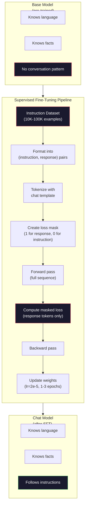

# Dostrajanie Instrukcji (SFT)

> Model bazowy przewiduje następny token. I tyle. Nie wykonuje instrukcji, nie odpowiada na pytania ani nie odmawia szkodliwych żądań. SFT to most między predyktorem tokenów a użytecznym asystentem. Każdy model, z którym kiedykolwiek rozmawiałeś -- Claude, GPT, Llama Chat -- przeszedł przez ten krok.

**Type:** Build
**Languages:** Python (with numpy)
**Prerequisites:** Phase 10, Lesson 04 (Pre-Training a Mini GPT)
**Time:** ~90 minutes

## Learning Objectives

- Zaimplementuj nadzorowane dostrajanie (SFT), które konwertuje bazowy model językowy w asystenta wykonującego instrukcje
- Formatuj dane treningowe za pomocą szablonów czatu z rolami system, user i assistant oraz maskuj stratę na tokenach niebędących asystentem
- Wyjaśnij, dlaczego SFT jest konieczne: modele bazowe kontynuują tekst, zamiast odpowiadać na pytania
- Oceń jakość SFT, porównując odpowiedzi modelu bazowego vs dostrojonego na wstrzymanym zestawie instrukcji

## Problem

Wytrenowałeś model w Lekcji 04. Potrafi przewidzieć następny token, mając sekwencję. Podaj mu "The transformer architecture", a może kontynuować z "has revolutionized natural language processing." To imponujące jak na predyktor następnego tokena.

Teraz spróbuj tego: podaj mu "What is the capital of France?" Model bazowy nie odpowiada "Paris." Kontynuuje wzorzec. Może wyprodukować "What is the capital of Germany? What is the capital of Spain?" ponieważ nauczył się z dokumentów zawierających listy pytań. Albo może wyprodukować "is a question that many people ask", ponieważ to prawdopodobna kontynuacja następnego tokena. Model nie ma pojęcia *odpowiadania*. Zna tylko *kontynuowanie*.

To jest przepaść między GPT-3 (model bazowy, wydany czerwiec 2020) a ChatGPT (dostrojony instrukcjami, wydany listopad 2022). Ta sama architektura. Ten sam pre-trening. Różnica to 20,000 do 100,000 starannie opracowanych par (instrukcja, odpowiedź), które nauczyły model podążać za wzorcem konwersacji.

Stanford Alpaca udowodnił, że nie potrzebujesz milionów przykładów. W marcu 2023 dostroili Llama 7B na zaledwie 52,000 parach instrukcja-odpowiedź wygenerowanych przez GPT-3.5. Całkowity koszt: 600 dolarów. Rezultatem był chatbot, który potrafił wykonywać instrukcje, odpowiadać na pytania i prowadzić rozmowy. Nie tak dobry jak ChatGPT, ale szokująco blisko za 600 dolarów i kilka godzin treningu.

Llama 2 Chat od Meta użyła tylko ~27,000 wysokiej jakości przykładów dla swojego początkowego etapu SFT. Kluczowy wgląd: jakość ma większe znaczenie niż ilość. 27,000 przykładów napisanych przez wykwalifikowanych adnotatorów bije 1 milion hałaśliwych przykładów zeskrobanych z internetu.

## Koncepcja

### Co SFT Faktycznie Robi

Nadzorowane dostrajanie (Supervised Fine-Tuning) kontynuuje tę samą pętlę treningową co pre-trening -- przejście w przód, obliczenie straty, przejście w tył, aktualizacja wag -- ale na innym rodzaju danych. Zamiast surowego tekstu, trenujesz na ustrukturyzowanych rozmowach:

```json
{
  "system": "You are a helpful assistant.",
  "user": "What is the capital of France?",
  "assistant": "The capital of France is Paris."
}
```

Model już wie, że Paryż jest stolicą Francji. Nauczył się tego podczas pre-treningu na Wikipedii, podręcznikach i stronach internetowych. SFT nie uczy modelu nowych faktów. Uczy model nowego *zachowania*: gdy widzisz pytanie, wyprodukuj odpowiedź. Gdy widzisz instrukcję, wyprodukuj wykonanie. Gdy widzisz szkodliwe żądanie, wyprodukuj odmowę.

Myśl o tym w ten sposób. Pre-trening daje modelowi wiedzę. SFT daje modelowi maniery.

### Formaty Danych

Trzy formaty dominują w branży. Każdy koduje te same informacje -- kto co powiedział -- z różnymi delimiterami.

**Format Alpaca** (Stanford, marzec 2023):

```json
{
  "instruction": "Summarize the following article in 3 sentences.",
  "input": "The European Central Bank raised interest rates...",
  "output": "The ECB increased rates by 25 basis points..."
}
```

Prosty i szeroko używany. Pole `input` jest opcjonalne -- wiele instrukcji nie potrzebuje dodatkowego kontekstu. Stanford opublikował 52,000 przykładów w tym formacie, wygenerowanych przez GPT-3.5 za 600 dolarów. To zapoczątkowało ruch otwartego dostrajania instrukcji.

**Format ShareGPT** (społeczność, 2023):

```json
{
  "conversations": [
    {"from": "system", "value": "You are a helpful assistant."},
    {"from": "human", "value": "What causes tides?"},
    {"from": "gpt", "value": "Tides are caused by the gravitational pull of the Moon..."},
    {"from": "human", "value": "How often do they occur?"},
    {"from": "gpt", "value": "Most coastal areas experience two high tides and two low tides per day..."}
  ]
}
```

Obsługuje rozmowy wieloobrotowe. Pole "from" używa konwencji "human" i "gpt", niezależnie od rzeczywistego modelu. Vicuna była trenowana na 70,000 rozmowach ShareGPT zeskrobanych z udostępnionych przez użytkowników transkryptów ChatGPT.

**Format ChatML** (OpenAI, używany przez wiele modeli open-source):

```
<|im_start|>system
You are a helpful assistant.<|im_end|>
<|im_start|>user
What is the capital of France?<|im_end|>
<|im_start|>assistant
The capital of France is Paris.<|im_end|>
```

Używa specjalnych tokenów (`<|im_start|>`, `<|im_end|>`) do oznaczania ról. Te tokeny są dodawane do słownika tokenizatora podczas dostrajania. Qwen, Yi i wiele innych modeli używa ChatML.

Wszystkie trzy formaty osiągają to samo: mówią modelowi "to jest instrukcja, to jest odpowiedź, naucz się tego wzorca."

### Dlaczego to Działa

Model już zna język z pre-treningu. Widział miliardy przykładów pytań, po których następują odpowiedzi, instrukcji, po których następują wykonania, i rozmów między ludźmi. Wzorce są już zakodowane w wagach.

SFT koncentruje tę ukrytą zdolność. Zamiast modelu muszącego odgadnąć z kontekstu, czy powinien odpowiedzieć na pytanie, czy kontynuować dokument, SFT jawnie trenuje na wzorcu konwersacji. Po kilku tysiącach przykładów model uczy się: gdy widzisz znacznik roli asystenta, wyprodukuj pomocną odpowiedź.

Dlatego 27,000 przykładów wystarcza. Nie uczysz modelu angielskiego. Nie uczysz go faktów o świecie. Uczysz go jednego prostego zachowania: odpowiadaj na instrukcje. Wiedza już tam była.

### Maskowana Strata

To najważniejszy szczegół techniczny w SFT, a większość tutoriali go pomija.

Podczas pre-treningu obliczasz stratę na każdym tokenie. Model uczy się przewidywać każdy następny token w sekwencji. Podczas SFT obliczasz stratę tylko na tokenach *odpowiedzi*. Tokeny instrukcji są tam dla kontekstu, ale model nie jest karany za "przewidywanie" ich niepoprawnie.

Dlaczego? Ponieważ nie chcesz, aby model nauczył się *generować* instrukcje. Chcesz, aby nauczył się *odpowiadać na* instrukcje. Jeśli obliczasz stratę na tokenach instrukcji, trenujesz model do przewidywania "What is the capital of France?" tak, jakby to on zadawał pytanie. To marnuje sygnał gradientu i może zdezorientować model co do jego roli.

W praktyce tworzysz maskę straty: 1 dla tokenów odpowiedzi, 0 dla tokenów instrukcji. Pomnóż stratę na token przez tę maskę przed uśrednieniem.

```
Tokens:    [SYS] You are helpful [USER] What is the capital? [ASST] Paris is the capital [EOS]
Loss mask:   0    0    0     0      0     0   0  0     0       1     1    1   1     1      1
```

Tylko tokeny po `[ASST]` przyczyniają się do straty. Model widzi pełną rozmowę podczas przejścia w przód (potrzebuje instrukcji, aby wyprodukować poprawną odpowiedź), ale aktualizuje swoje wagi tylko na podstawie tego, jak dobrze przewidział odpowiedź.

### Hiperparametry Treningowe

SFT używa dramatycznie innych hiperparametrów niż pre-trening. Nie trenujesz od zera. Dostosowujesz model, który już działa.

| Parametr | Pre-Trening (Llama 2 7B) | SFT (Llama 2 Chat) |
|-----------|---------------------------|---------------------|
| Współczynnik uczenia | 3e-4 (szczyt) | 2e-5 |
| Epoki | 1 (pojedyncze przejście przez dane) | 2 |
| Rozmiar wsadu | 4M tokenów | 64 przykłady |
| Kroki rozgrzewania | 2,000 | 0-100 |
| Zanik wag | 0.1 | 0.0-0.1 |
| Rozmiar danych | 2T tokenów | 27,000 przykładów |

Współczynnik uczenia jest 15x niższy dla SFT. To krytyczne. Wysoki współczynnik uczenia podczas dostrajania niszczy wiedzę z pre-treningu. Model "zapomina", czego się nauczył i przetrenowuje się na małym zbiorze danych dostrajania. To jest katastroficzne zapominanie.

Dwie epoki oznaczają, że model widzi każdy przykład treningowy dwa razy. Więcej niż 3 epoki na małym zbiorze danych prowadzi do zapamiętywania -- model zaczyna odtwarzać przykłady treningowe dosłownie zamiast generalizować.

### Katastroficzne Zapominanie

Dostrajanie może zniszczyć ogólne zdolności. Trenuj zbyt długo na danych dotyczących wykonywania instrukcji, a model traci zdolność pisania kodu, robienia matematyki lub produkowania kreatywnego tekstu. Staje się bardzo dobry w specyficznym formacie swoich danych treningowych i okropny we wszystkim innym.

Trzy środki zaradcze:

1. **Niski współczynnik uczenia.** 1e-5 do 5e-5. Mniejsze aktualizacje oznaczają mniejsze niszczenie cech z pre-treningu.

2. **Krótki trening.** 1-3 epoki. Zatrzymaj się, zanim model się przetrenuje.

3. **Wymieszaj dane pre-treningowe.** Llama 2 Chat zmieszała mały procent (2-5%) surowych danych pre-treningowych do zbioru SFT. To "przypomina" modelowi o jego ogólnych zdolnościach podczas uczenia się nowego zachowania wykonywania instrukcji.

### Prawdziwe Liczby

Dostrajanie modelu 7B na 10,000 wysokiej jakości parach instrukcji zajmuje około 1 godziny na pojedynczym NVIDIA A100 80GB GPU. Oto matematyka:

- 10,000 przykładów x 512 tokenów średnio = 5.12M tokenów
- 2 epoki = 10.24M tokenów łącznie
- Przepustowość A100 dla dostrajania modelu 7B: ~3,000 tokenów/sekundę
- 10.24M / 3,000 = ~3,400 sekund = ~57 minut

Dla naszego mini GPT (4 warstwy, 128 wymiarów), trening jest prawie natychmiastowy. Chodzi o zrozumienie mechaniki, nie skali.



## Zbuduj To

### Krok 1: Zbiór Danych Instrukcji

Stwórz syntetyczny zbiór danych instrukcji. W produkcji firmy takie jak Scale AI i Anthropic zatrudniają ludzkich adnotatorów do ich pisania. My stworzymy je programowo, aby zademonstrować format.

```python
import numpy as np

INSTRUCTION_DATA = [
    {
        "instruction": "What is the capital of France?",
        "response": "The capital of France is Paris."
    },
    {
        "instruction": "Explain gravity in one sentence.",
        "response": "Gravity is the force that attracts objects with mass toward each other."
    },
    {
        "instruction": "Write a haiku about the ocean.",
        "response": "Waves crash on the shore, salt and foam beneath the sun, endless blue expanse."
    },
    {
        "instruction": "What is 15 multiplied by 7?",
        "response": "15 multiplied by 7 is 105."
    },
    {
        "instruction": "Name three programming languages.",
        "response": "Three programming languages are Python, Rust, and TypeScript."
    },
    {
        "instruction": "Summarize photosynthesis.",
        "response": "Photosynthesis converts sunlight, water, and carbon dioxide into glucose and oxygen."
    },
    {
        "instruction": "What year did World War II end?",
        "response": "World War II ended in 1945."
    },
    {
        "instruction": "Define machine learning.",
        "response": "Machine learning is a field where algorithms learn patterns from data to make predictions."
    },
]
```

Osiem przykładów to mało. Stanford Alpaca użył 52,000. Ale mechanika jest identyczna, niezależnie czy masz 8 czy 52,000: tokenizuj, maskuj, oblicz stratę tylko na odpowiedziach.

### Krok 2: Tokenizuj z Szablonem Czatu

Konwertuj pary instrukcja-odpowiedź na sekwencje tokenów ze specjalnymi znacznikami ról. Znaczniki mówią modelowi, gdzie kończy się instrukcja, a gdzie zaczyna odpowiedź.

```python
SPECIAL_TOKENS = {
    "INST_START": 253,
    "INST_END": 254,
    "RESP_START": 255,
}


def tokenize_instruction_pair(instruction, response, vocab_size=256):
    inst_tokens = list(instruction.encode("utf-8"))
    resp_tokens = list(response.encode("utf-8"))

    inst_tokens = [min(t, vocab_size - 4) for t in inst_tokens]
    resp_tokens = [min(t, vocab_size - 4) for t in resp_tokens]

    tokens = (
        [SPECIAL_TOKENS["INST_START"]]
        + inst_tokens
        + [SPECIAL_TOKENS["INST_END"]]
        + [SPECIAL_TOKENS["RESP_START"]]
        + resp_tokens
    )

    return tokens


def create_loss_mask(tokens):
    mask = np.zeros(len(tokens), dtype=np.float32)
    in_response = False

    for i, token in enumerate(tokens):
        if token == SPECIAL_TOKENS["RESP_START"]:
            in_response = True
            continue
        if in_response:
            mask[i] = 1.0

    return mask
```

Maska straty to wszystkie zera dla tokenów instrukcji i wszystkie jedynki dla tokenów odpowiedzi. Sam token `RESP_START` dostaje maskę 0, ponieważ jest delimiterem, a nie częścią treści odpowiedzi.

### Krok 3: Maskowana Strata Cross-Entropii

Standardowa cross-entropia, ale pomnożona przez maskę straty. Tylko tokeny odpowiedzi przyczyniają się do gradientu.

```python
def masked_cross_entropy_loss(logits, targets, loss_mask):
    batch, seq_len, vocab_size = logits.shape
    logits_flat = logits.reshape(-1, vocab_size)
    targets_flat = targets.reshape(-1)
    mask_flat = loss_mask.reshape(-1)

    max_logits = logits_flat.max(axis=-1, keepdims=True)
    log_softmax = logits_flat - max_logits - np.log(
        np.exp(logits_flat - max_logits).sum(axis=-1, keepdims=True)
    )

    per_token_loss = -log_softmax[np.arange(len(targets_flat)), targets_flat]

    masked_loss = per_token_loss * mask_flat
    num_response_tokens = mask_flat.sum()
    if num_response_tokens == 0:
        return 0.0
    loss = masked_loss.sum() / num_response_tokens

    return loss
```

Mianownik to `num_response_tokens`, nie `seq_len`. Jeśli dzielisz przez całkowitą długość sekwencji, dłuższe instrukcje rozcieńczają sygnał gradientu. Dzielenie przez liczbę tokenów odpowiedzi zapewnia równą wagę na token odpowiedzi niezależnie od długości instrukcji.

### Krok 4: Pętla Treningowa SFT

Użyj ponownie MiniGPT z Lekcji 04. Pętla treningowa wygląda prawie identycznie jak pre-trening, ale z formatowaniem instrukcji i maskowaną stratą.

```python
import sys
import os
sys.path.insert(0, os.path.join(os.path.dirname(__file__), "..", "..", "04-pre-training-mini-gpt", "code"))
from main import MiniGPT, LayerNorm, FeedForward, MultiHeadAttention, TransformerBlock, Embedding


def sft_train(model, dataset, num_epochs=2, lr=2e-5, seq_len=64):
    formatted_data = []
    for example in dataset:
        tokens = tokenize_instruction_pair(example["instruction"], example["response"])
        mask = create_loss_mask(tokens)
        formatted_data.append((tokens, mask))

    print(f"SFT Training: {len(formatted_data)} examples, {num_epochs} epochs, lr={lr}")
    print(f"Total tokens: {sum(len(t) for t, _ in formatted_data):,}")
    print()

    losses = []

    for epoch in range(num_epochs):
        epoch_loss = 0.0
        num_batches = 0

        indices = np.random.permutation(len(formatted_data))

        for idx in indices:
            tokens, mask = formatted_data[idx]

            if len(tokens) < 3:
                continue
            if len(tokens) > seq_len:
                tokens = tokens[:seq_len]
                mask = mask[:seq_len]

            input_ids = np.array(tokens[:-1]).reshape(1, -1)
            target_ids = np.array(tokens[1:]).reshape(1, -1)
            loss_mask = np.array(mask[1:]).reshape(1, -1)

            logits = model.forward(input_ids)
            loss = masked_cross_entropy_loss(logits, target_ids, loss_mask)

            batch_size, s_len, v_size = logits.shape
            probs = np.exp(logits - logits.max(axis=-1, keepdims=True))
            probs = probs / probs.sum(axis=-1, keepdims=True)
            dlogits = probs.copy()
            dlogits[np.arange(batch_size)[:, None], np.arange(s_len), target_ids] -= 1.0

            mask_expanded = loss_mask[:, :, np.newaxis]
            num_resp = loss_mask.sum()
            if num_resp > 0:
                dlogits = dlogits * mask_expanded / num_resp

            for block in model.blocks:
                block.ffn.W1 -= lr * np.random.randn(*block.ffn.W1.shape) * 0.01
                block.ffn.W2 -= lr * np.random.randn(*block.ffn.W2.shape) * 0.01
                block.ffn.b1 -= lr * np.random.randn(*block.ffn.b1.shape) * 0.01
                block.ffn.b2 -= lr * np.random.randn(*block.ffn.b2.shape) * 0.01

            epoch_loss += loss
            num_batches += 1
            losses.append(loss)

        avg_loss = epoch_loss / max(num_batches, 1)
        print(f"Epoch {epoch + 1}/{num_epochs} | Avg Loss: {avg_loss:.4f}")

    return model, losses
```

Współczynnik uczenia to 2e-5, zgodny z Llama 2 Chat. Porównaj to z 3e-4 używanym w pre-treningu -- 15x mniej. Gradient jest maskowany: tokeny instrukcji produkują zerowy gradient. Tylko tokeny odpowiedzi pchają wagi.

### Krok 5: Porównaj Model Bazowy vs SFT

Cały sens SFT to zmiana zachowania. Zmierzmy to, sprawdzając, jak model reaguje na wejścia w formacie instrukcji w porównaniu do kontynuacji surowego tekstu.

```python
def generate_response(model, prompt_tokens, max_new_tokens=50, temperature=0.8):
    tokens = list(prompt_tokens)
    seq_len = model.embedding.pos_embed.shape[0]

    for _ in range(max_new_tokens):
        context = np.array(tokens[-seq_len:]).reshape(1, -1)
        logits = model.forward(context)
        next_logits = logits[0, -1, :]

        next_logits = next_logits / max(temperature, 1e-8)
        probs = np.exp(next_logits - next_logits.max())
        probs = probs / probs.sum()
        probs = np.clip(probs, 1e-10, 1.0)
        probs = probs / probs.sum()

        next_token = np.random.choice(len(probs), p=probs)
        tokens.append(int(next_token))

    return tokens


def evaluate_instruction_following(model, instructions):
    print("Evaluating instruction following:")
    print("-" * 50)

    for instruction in instructions:
        tokens = (
            [SPECIAL_TOKENS["INST_START"]]
            + [min(t, 252) for t in list(instruction.encode("utf-8"))]
            + [SPECIAL_TOKENS["INST_END"]]
            + [SPECIAL_TOKENS["RESP_START"]]
        )

        output = generate_response(model, tokens, max_new_tokens=30, temperature=0.6)
        response_start = len(tokens)
        response_tokens = output[response_start:]
        response_bytes = bytes([t for t in response_tokens if t < 128])
        response_text = response_bytes.decode("utf-8", errors="replace")

        print(f"  Q: {instruction}")
        print(f"  A: {response_text[:80]}")
        print()
```

Na małym modelu z 8 przykładami odpowiedzi nie będą znaczące. To oczekiwane. Ważna jest *struktura*: model uczy się produkować wynik po znaczniku odpowiedzi zamiast kontynuować generowanie większej liczby instrukcji.

### Krok 6: Zmierz Katastroficzne Zapominanie

Porównaj zdolność modelu do przewidywania następnego tokena przed i po SFT. Jeśli SFT uszkadza ogólne zdolności, strata na surowym tekście wzrośnie.

```python
def measure_forgetting(model, test_text, seq_len=64):
    tokens = np.array(list(test_text.encode("utf-8")[:512]))

    total_loss = 0.0
    num_windows = 0

    for start in range(0, len(tokens) - seq_len - 1, seq_len):
        input_ids = tokens[start:start + seq_len].reshape(1, -1)
        target_ids = tokens[start + 1:start + seq_len + 1].reshape(1, -1)

        logits = model.forward(input_ids)

        batch, s_len, vocab_size = logits.shape
        logits_flat = logits.reshape(-1, vocab_size)
        targets_flat = target_ids.reshape(-1)

        max_logits = logits_flat.max(axis=-1, keepdims=True)
        log_softmax = logits_flat - max_logits - np.log(
            np.exp(logits_flat - max_logits).sum(axis=-1, keepdims=True)
        )

        loss = -log_softmax[np.arange(len(targets_flat)), targets_flat].mean()
        total_loss += loss
        num_windows += 1

    return total_loss / max(num_windows, 1)
```

W prawdziwym dostrajaniu śledziłbyś tę metrykę przez cały trening. Jeśli strata na surowym tekście wzrośnie o więcej niż 10-15%, twój SFT jest zbyt agresywny. Obniż współczynnik uczenia lub zmniejsz liczbę epok.

## Użyj Tego

### Pełna Demonstracja Potoku SFT

```python
if __name__ == "__main__":
    np.random.seed(42)

    test_text = """The transformer architecture processes sequences through self-attention.
Each layer applies multi-head attention followed by a feedforward network.
Residual connections and layer normalization stabilize deep networks.
The model learns to predict the next token given all previous tokens."""

    print("=" * 70)
    print("INSTRUCTION TUNING (SFT) DEMO")
    print("=" * 70)
    print()

    model = MiniGPT(
        vocab_size=256, embed_dim=128, num_heads=4,
        num_layers=4, max_seq_len=128, ff_dim=512
    )
    print(f"Model: {model.count_parameters():,} parameters")
    print(f"Config: 4 layers, 4 heads, 128 dims (mini GPT from Lesson 04)")
    print()

    print("PRE-SFT: Measuring base model loss on raw text")
    base_loss = measure_forgetting(model, test_text)
    print(f"  Base model loss: {base_loss:.4f}")
    print()

    print("=" * 70)
    print("SFT TRAINING")
    print("=" * 70)

    model, losses = sft_train(
        model, INSTRUCTION_DATA, num_epochs=3, lr=2e-5, seq_len=128
    )

    print()
    print("POST-SFT: Measuring fine-tuned model loss on raw text")
    sft_loss = measure_forgetting(model, test_text)
    print(f"  SFT model loss: {sft_loss:.4f}")
    print(f"  Change: {((sft_loss - base_loss) / base_loss * 100):+.1f}%")
    if abs(sft_loss - base_loss) / base_loss < 0.15:
        print("  Minimal forgetting (< 15% change)")
    else:
        print("  Significant forgetting detected")
    print()

    print("=" * 70)
    print("INSTRUCTION FOLLOWING EVALUATION")
    print("=" * 70)
    print()

    test_instructions = [
        "What is the capital of France?",
        "Name a programming language.",
        "Define gravity.",
    ]
    evaluate_instruction_following(model, test_instructions)

    print("=" * 70)
    print("DATA FORMAT EXAMPLES")
    print("=" * 70)
    print()

    for i, example in enumerate(INSTRUCTION_DATA[:3]):
        tokens = tokenize_instruction_pair(example["instruction"], example["response"])
        mask = create_loss_mask(tokens)
        resp_count = int(mask.sum())
        total_count = len(tokens)
        print(f"  Example {i + 1}: {total_count} tokens, {resp_count} response tokens ({resp_count/total_count:.0%} of sequence)")
        print(f"    Instruction: {example['instruction']}")
        print(f"    Response: {example['response']}")
        print()

    print("=" * 70)
    print("TRAINING LOSS CURVE")
    print("=" * 70)
    print()

    if losses:
        window = max(1, len(losses) // 5)
        for i in range(0, len(losses), window):
            chunk = losses[i:i + window]
            avg = sum(chunk) / len(chunk)
            print(f"  Steps {i:3d}-{i + len(chunk) - 1:3d}: avg loss = {avg:.4f}")
```

## Dostarcz To

Ta lekcja produkuje `outputs/prompt-sft-data-curator.md` -- prompt, który pomaga projektować i kuratorować zbiory danych instrukcji dla SFT. Mając docelową zdolność (generowanie kodu, matematyka, konwersacja), produkuje plan zbierania danych ze specyfikacjami formatu, kryteriami jakości i wymaganiami dotyczącymi różnorodności.

## Ćwiczenia

1. Dodaj obsługę prompta systemowego. Zmodyfikuj `tokenize_instruction_pair`, aby akceptował wiadomość systemową i dodawał ją przed instrukcją. Stwórz 5 przykładów z różnymi promptami systemowymi ("You are a poet", "You are a math tutor") i zweryfikuj, że model widzi różne prompty systemowe podczas treningu.

2. Zaimplementuj mieszanie danych. Stwórz funkcję, która przyjmuje zbiór SFT i korpus surowego tekstu, a następnie produkuje wsady treningowe, gdzie 5% przykładów to surowy tekst (bez maskowania), a 95% to pary instrukcji (maskowane). Uruchom 3 epoki i porównaj metryki zapominania z czystym treningiem SFT.

3. Zbuduj oceniacz jakości danych. Dla każdej pary instrukcja-odpowiedź oblicz: (a) długość odpowiedzi w tokenach, (b) stosunek instrukcji do odpowiedzi, (c) różnorodność słownictwa (unikalne tokeny / całkowita liczba tokenów). Odfiltruj przykłady z długością odpowiedzi < 10 tokenów lub różnorodnością < 0.3. Pokaż, jak filtrowanie wpływa na końcową stratę.

4. Zaimplementuj trening rozmów wieloobrotowych. Rozszerz tokenizację do obsługi 3-obrotowych rozmów (user-assistant-user-assistant-user-assistant). Maska straty powinna obejmować wszystkie trzy tury asystenta. Zweryfikuj, że maska jest poprawna, wypisując dopasowanie token-maska dla jednego przykładu.

5. Porównaj współczynniki uczenia. Wytrenuj ten sam model trzy razy z lr=1e-4, lr=2e-5 i lr=1e-6. Wykreśl krzywe straty. Uruchomienie z 1e-4 powinno pokazać szybki początkowy spadek, ale wyższą końcową stratę (przetrenowanie). Uruchomienie z 1e-6 powinno ledwo drgnąć. Uruchomienie z 2e-5 powinno być złotym środkiem.

## Kluczowe Terminy

| Termin | Co ludzie mówią | Co to naprawdę znaczy |
|------|----------------|----------------------|
| SFT | "Dostrajanie na rozmowach" | Supervised Fine-Tuning: kontynuacja treningu na parach (instrukcja, odpowiedź) ze stratą obliczaną tylko na tokenach odpowiedzi |
| Dostrajanie instrukcji | "Uczenie modelu wykonywania instrukcji" | Trening na jawnych parach instrukcja-odpowiedź, aby model bazowy nauczył się wzorca konwersacji, a nie nowej wiedzy |
| Maskowanie straty | "Ignorowanie prompta" | Ustawienie straty na zero dla tokenów instrukcji, aby gradienty płynęły tylko z przewidywań tokenów odpowiedzi |
| ChatML | "Chat Markup Language" | Format tokenów używający delimiterów `<\|im_start\|>` i `<\|im_end\|>` do oznaczania ról mówców w danych konwersacyjnych |
| Format Alpaca | "Format Stanforda" | Format JSON z polami instruction/input/output, używany dla 52K przykładów wygenerowanych przez GPT-3.5, które kosztowały 600 dolarów |
| Katastroficzne zapominanie | "Model robi się głupszy" | Dostrajanie niszczy zdolności z pre-treningu, ponieważ aktualizacje gradientu nadpisują ogólną wiedzę wzorcami specyficznymi dla zadania |
| Wiązanie wag | "Współdzielone osadzenia" | Używanie tej samej macierzy dla wejściowych osadzeń tokenów i wyjściowej głowicy predykcji, oszczędzając parametry i poprawiając spójność |
| Szablon czatu | "Jak formatujesz prompt" | Specyficzna sekwencja tokenów (znaczniki ról, delimitery), która strukturyzuje rozmowę dla modelu |

## Dalsza Lektura

- [Ouyang et al., 2022 -- "Training language models to follow instructions with human feedback" (InstructGPT)](https://arxiv.org/abs/2203.02155) -- artykuł, który wprowadził dostrajanie instrukcji + RLHF w OpenAI
- [Taori et al., 2023 -- "Stanford Alpaca: An Instruction-following LLaMA Model"](https://github.com/tatsu-lab/stanford_alpaca) -- 52K przykładów instrukcji za 600 dolarów, dowodzące, że SFT działa na małych zbiorach danych
- [Touvron et al., 2023 -- "Llama 2: Open Foundation and Fine-Tuned Chat Models"](https://arxiv.org/abs/2307.09288) -- potok SFT + RLHF Meta z 27K wysokiej jakości przykładami
- [Chiang et al., 2023 -- "Vicuna: An Open-Source Chatbot Impressing GPT-4"](https://lmsys.org/blog/2023-03-30-vicuna/) -- trening na 70K rozmowach ShareGPT
- [Zhou et al., 2023 -- "LIMA: Less Is More for Alignment"](https://arxiv.org/abs/2305.11206) -- dowód, że 1,000 starannie wyselekcjonowanych przykładów może dorównać SFT na znacznie większych zbiorach danych