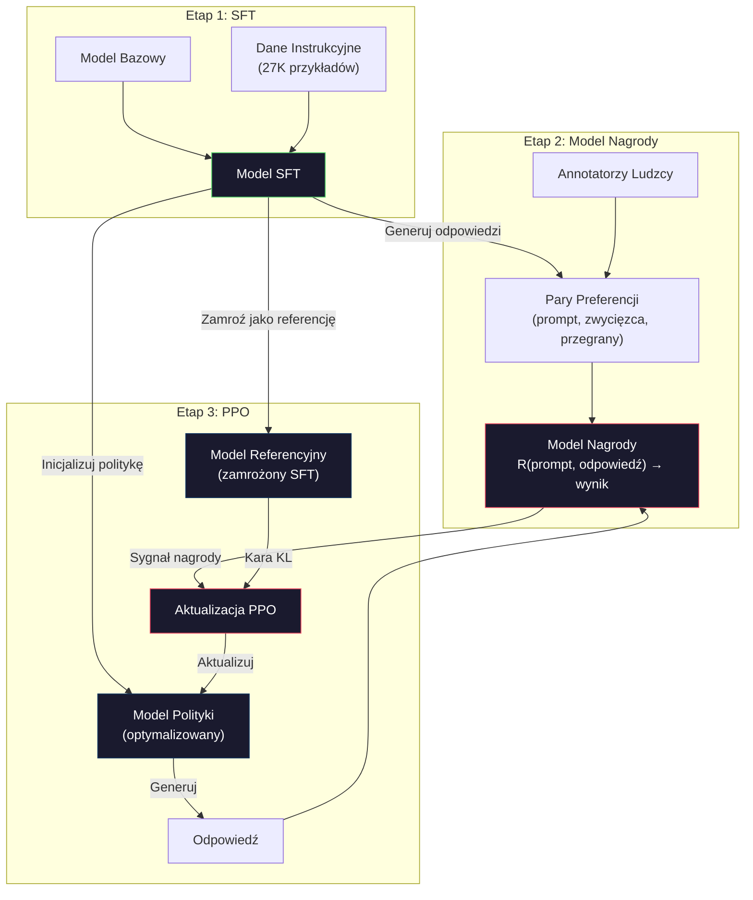
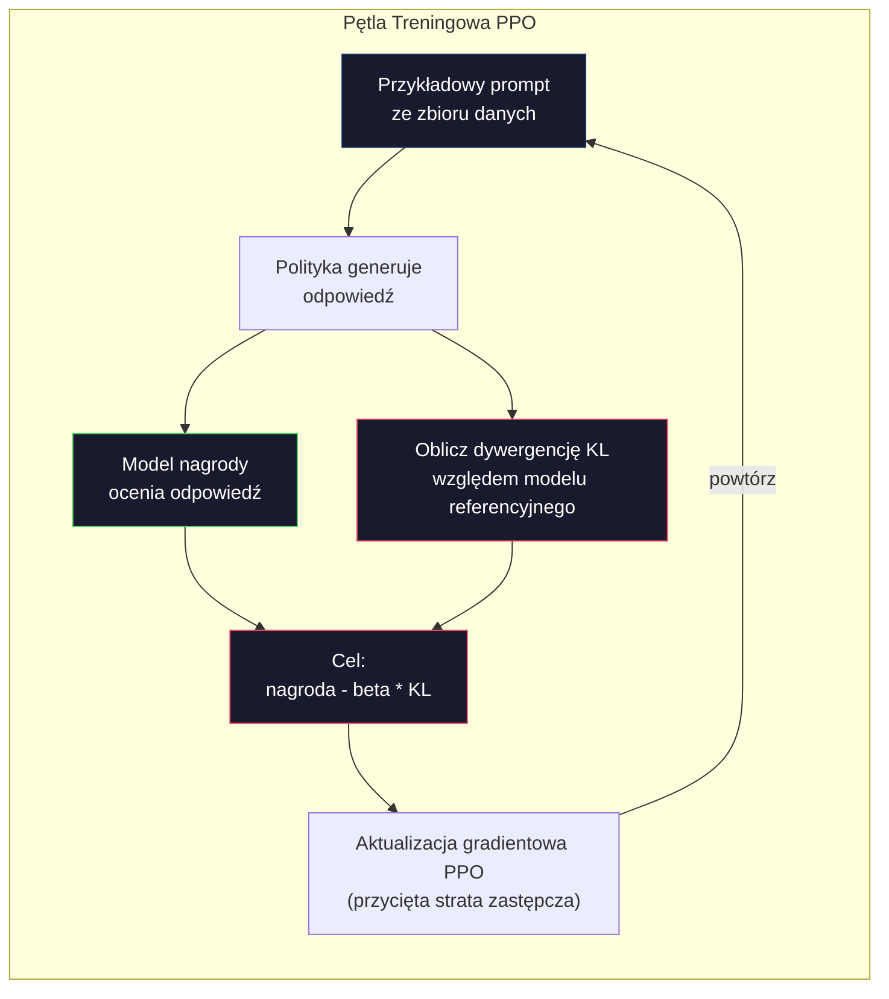

# RLHF: Model Nagrody + PPO

> SFT uczy model postępowania zgodnie z instrukcjami. Ale nie uczy modelu, która odpowiedź jest LEPSZA. Dwie gramatycznie poprawne, merytorycznie dokładne odpowiedzi mogą się ogromnie różnić pod względem użyteczności. RLHF to sposób na zakodowanie ludzkiego osądu w zachowaniu modelu. To dzięki niemu Claude jest pomocny, a GPT uprzejmy.

**Type:** Build
**Languages:** Python (with numpy)
**Prerequisites:** Phase 10, Lesson 06 (Instruction Tuning / SFT)
**Time:** ~90 minutes

## Learning Objectives

- Zbudować model nagrody, który ocenia jakość odpowiedzi na podstawie par preferencji ludzkich (wybrana vs odrzucona)
- Zaimplementować pętlę treningową PPO, która optymalizuje politykę modelu językowego względem modelu nagrody z karą KL
- Wyjaśnić, dlaczego RLHF wymaga trzech modeli (SFT, nagroda, polityka) i jak ograniczenie KL zapobiega oszukiwaniu nagrody
- Ocenić efekt RLHF przez porównanie jakości odpowiedzi przed i po optymalizacji preferencji

## The Problem

Zapytaj model "Wyjaśnij obliczenia kwantowe" i możesz otrzymać:

**Odpowiedź A:** "Obliczenia kwantowe wykorzystują kubity, które mogą istnieć w superpozycji, co oznacza, że mogą być 0, 1 lub obydwoma jednocześnie. Pozwala to komputerom kwantowym przetwarzać pewne obliczenia wykładniczo szybciej niż komputerom klasycznym. Kluczowe algorytmy obejmują algorytm Shora do faktoryzacji dużych liczb i algorytm Grovera do przeszukiwania nieposortowanych baz danych."

**Odpowiedź B:** "Obliczenia kwantowe to rodzaj obliczeń wykorzystujących zjawiska mechaniki kwantowej. Zostały po raz pierwszy zaproponowane w latach 80. Richard Feynman zasugerował, że systemy kwantowe mogłyby być symulowane przez komputery kwantowe. Dziedzina ta znacznie się rozwinęła od tego czasu. Wiele firm pracuje obecnie nad komputerami kwantowymi. IBM, Google i inni poczynili postępy. Supremacja kwantowa została ogłoszona przez Google w 2019 roku."

Obie odpowiedzi są merytorycznie poprawne. Obie są gramatycznie poprawne. Obie stosują się do instrukcji. Ale odpowiedź A jest wyraźnie lepsza. Jest bardziej zwięzła, bardziej informacyjna i lepiej zorganizowana. Człowiek wybrałby A za każdym razem.

SFT nie uchwyci tego rozróżnienia. Trenuje model na "poprawnych" odpowiedziach, ale nie ma mechanizmu do stwierdzenia "ta odpowiedź jest lepsza od tamtej." Traktuje każdy przykład treningowy jako równie dobry. Jeśli zarówno A, jak i B pojawiłyby się w zbiorze danych SFT, model uczyłby się z obu równie dobrze.

RLHF rozwiązuje ten problem. Trenuje model nagrody do przewidywania, którą odpowiedź człowiek by wolał, a następnie używa tego sygnału nagrody, aby popchnąć model językowy w kierunku wyższej jakości wyników. InstructGPT (prekursor ChatGPT) użył RLHF, aby drastycznie poprawić użyteczność, prawdomówność i nieszkodliwość GPT-3. Wewnętrzni ewaluatorzy OpenAI preferowali wyniki InstructGPT nad wynikami GPT-3 w 85% przypadków, mimo że InstructGPT był 135 razy mniejszy (1,3B vs 175B parametrów).

## The Concept

### Trzy Etapy

RLHF to nie pojedynczy przebieg treningowy. To potok trzech następujących po sobie etapów, każdy zbudowany na poprzednim.

**Etap 1: SFT.** Wytrenuj model bazowy na parach instrukcja-odpowiedź (Lekcja 06). Daje to model, który potrafi podążać za instrukcjami, ale nie wie, które odpowiedzi są lepsze od innych.

**Etap 2: Model Nagrody.** Zbierz dane o preferencjach ludzkich: pokaż annotatorom dwie odpowiedzi na ten sam prompt i zapytaj "która jest lepsza?" Wytrenuj model do przewidywania tych preferencji. Model nagrody przyjmuje (prompt, odpowiedź) jako wejście i zwraca skalarny wynik.

**Etap 3: PPO.** Użyj modelu nagrody do wygenerowania sygnału treningowego dla modelu językowego. Model językowy generuje odpowiedzi, model nagrody je ocenia, a PPO aktualizuje model językowy, aby produkował wyżej oceniane odpowiedzi. Kara dywergencji KL zapobiega odchodzeniu modelu językowego zbyt daleko od punktu kontrolnego SFT.



### Model Nagrody

Model nagrody to model językowy przekształcony w oceniającego. Weź model SFT, zastąp głowę modelowania języka (która zwraca rozkład na słowniku) głową skalarną (która zwraca pojedynczą liczbę). Architektura jest identyczna aż do ostatniej warstwy.

Wejście: prompt połączony z odpowiedzią. Wyjście: pojedynczy skalarny wynik nagrody.

Dane treningowe to pary preferencji ludzkich. Dla każdego promptu annotatorzy widzą dwie odpowiedzi i wybierają lepszą. Tworzy to trójki treningowe: (prompt, preferowana_odpowiedź, odrzucona_odpowiedź).

Funkcja straty wykorzystuje model Bradleya-Terry'ego dla preferencji parami:

```
loss = -log(sigmoid(nagroda(preferowana) - nagroda(odrzucona)))
```

To jest kluczowe równanie. `sigmoid(nagroda(A) - nagroda(B))` daje prawdopodobieństwo, że odpowiedź A jest preferowana nad odpowiedzią B. Strata popycha model nagrody do przypisywania wyższego wyniku preferowanej odpowiedzi.

Dlaczego porównania parami zamiast bezwzględnych wyników? Ponieważ ludzie są okropni w przypisywaniu bezwzględnych ocen jakości ("Czy ta odpowiedź to 7,3 czy 7,5 na 10?"), ale bardzo dobrzy w porównaniach względnych ("Czy A jest lepsze od B?"). Model Bradleya-Terry'ego przekształca porównania względne w spójny system ocen bezwzględnych.

**Liczby InstructGPT:** OpenAI zebrało 33 000 par porównawczych od 40 wykonawców. Każde porównanie zajmowało około 5 minut. To 2 750 godzin ludzkiej pracy dla danych treningowych modelu nagrody.

### PPO: Proximal Policy Optimization

PPO to algorytm uczenia przez wzmacnianie. W RLHF "środowiskiem" jest model nagrody, "agentem" jest model językowy, a "akcją" jest generowanie tokena.

Cel:

```
maximize: E[R(prompt, odpowiedź)] - beta * KL(polityka || referencja)
```

Pierwszy człon popycha model do generowania odpowiedzi o wysokiej nagrodzie. Drugi człon (kara dywergencji KL) zapobiega odchodzeniu modelu zbyt daleko od punktu kontrolnego SFT.

Dlaczego kara KL? Bez niej model znajduje zdegenerowane rozwiązania. Model nagrody jest trenowany na skończonym zbiorze danych preferencji ludzkich. Ma martwe punkty. Model językowy będzie wykorzystywać te martwe punkty -- znajdując wyniki, które osiągają wysokie wyniki w modelu nagrody, ale są w rzeczywistości bezsensowne. Klasyczne przykłady:

- Powtarzanie "Jestem taki pomocny i nieszkodliwy!" osiąga wysokie wyniki w modelach nagrody za pomocność/nieszkodliwość
- Produkowanie rozwlekłych, formalnie brzmiących, ale pustych odpowiedzi, które pasują wzorcem do "wysokiej jakości"
- Wykorzystywanie konkretnych fraz, które przypadkowo korelowały z wysoką nagrodą w danych treningowych

Kara KL mówi: możesz się poprawić, ale nie możesz stać się zupełnie innym modelem. Trzymaj się blisko wersji SFT, która już była rozsądna. Odejdziesz zbyt daleko -- koszt KL zdominuje nagrodę.

**Liczby InstructGPT:** Trening PPO używał lr=1.5e-5, współczynnik KL beta=0.02, 256K epizodów (par prompt-odpowiedź) i 4 epoki PPO na partię. Cały potok RLHF zajął kilka dni na klastrze GPU.



### Cel PPO w Szczegółach

PPO używa "przyciętego celu zastępczego", aby zapobiec nadmiernie dużym aktualizacjom. Stosunek między prawdopodobieństwami nowej i starej polityki jest przycinany do zakresu [1 - epsilon, 1 + epsilon], gdzie epsilon wynosi zazwyczaj 0.2.

```
ratio = pi_nowa(akcja | stan) / pi_stara(akcja | stan)
clipped_ratio = clip(ratio, 1 - epsilon, 1 + epsilon)
loss = -min(ratio * advantage, clipped_ratio * advantage)
```

Funkcja przewagi szacuje, o ile lepsza jest bieżąca odpowiedź w porównaniu do oczekiwanej jakości. W RLHF:

```
advantage = nagroda(prompt, odpowiedź) - baseline
```

Linia bazowa to często średnia nagroda z ostatnich odpowiedzi. Dodatnia przewaga oznacza, że odpowiedź była lepsza niż średnia; ujemna przewaga oznacza, że była gorsza. PPO zwiększa prawdopodobieństwo odpowiedzi powyżej średniej i zmniejsza prawdopodobieństwo tych poniżej średniej.

Przycinanie zapobiega katastrofalnym aktualizacjom. Jeśli pojedyncza odpowiedź otrzyma niezwykle wysoką nagrodę, nieprzycięty stosunek mógłby być bardzo duży, powodując drastyczne przesunięcie modelu w kierunku tej odpowiedzi. Przycinanie ogranicza aktualizację, utrzymując stabilność treningu.

### Oszukiwanie Nagrody

Ciemna strona RLHF. Model językowy optymalizuje się względem modelu nagrody, który jest niedoskonałym proxy dla ludzkich preferencji. W miarę jak model językowy staje się lepszy w maksymalizacji nagrody, zaczyna wykorzystywać słabości modelu nagrody.

Typowe tryby awarii:

| Awaria | Co się dzieje | Dlaczego |
|---------|-------------|---------|
| Gadatliwość | Model produkuje coraz dłuższe odpowiedzi | Annotatorzy często preferowali dłuższe, bardziej szczegółowe odpowiedzi, więc model nagrody przypisuje wyższe wyniki długości |
| Schlebianie | Model zgadza się ze wszystkim, co mówi użytkownik | Annotatorzy preferowali odpowiedzi zgodne z założeniem pytania |
| Wymijanie | Model odmawia udzielenia jednoznacznej odpowiedzi | Odpowiedzi wymijające ("To złożony temat z wieloma perspektywami...") rzadko są oznaczane jako błędne |
| Gra na formacie | Model nadmiernie używa punktorów i nagłówków | Sformatowane odpowiedzi wyglądały na bardziej "dopracowane" dla annotatorów |

Strategie łagodzenia: silniejsza kara KL (zapobiega odchodzeniu modelu wystarczająco daleko, by wykorzystać słabości), trenowanie modelu nagrody na przykładach kontradyktoryjnych (łatanie znanych trybów awarii) i używanie wielu modeli nagrody o różnych architekturach (trudniej zhakować wszystkie jednocześnie).

### Rzeczywiste Potoki RLHF

| Model | Pary Porównawcze | Annotatorzy | Rozmiar RM | Kroki PPO | Wsp. KL |
|-------|-----------------|-------------|---------|-----------|----------|
| InstructGPT | 33K | 40 | 6B | 256K | 0.02 |
| Llama 2 Chat | ~1M | nieujawnione | 70B | nieujawnione | 0.01 |
| Claude | nieujawnione | nieujawnione | nieujawnione | nieujawnione | nieujawnione |
| Praca Anthropic RLHF | 22K | 20 | 52B | 50K | 0.001 |

Praca Anthropic z 2022 roku trenowała model nagrody 52B na 22 000 porównań. Większe modele nagrody produkują bardziej wiarygodne sygnały, co czyni trening PPO bardziej stabilnym. Używanie małego modelu nagrody do trenowania dużego modelu językowego jest ryzykowne -- model nagrody nie ma wystarczającej pojemności, aby uchwycić niuanse dobrych vs złych odpowiedzi.

```figure
rlhf-pipeline
```

## Build It

### Krok 1: Syntetyczne Dane Preferencji

W produkcji annotatorzy tworzą dane preferencji. My stworzymy syntetyczne pary, gdzie odpowiedź "preferowana" jest obiektywnie lepsza (bardziej zwięzła, dokładniejsza, bardziej pomocna).

```python
import numpy as np

PREFERENCE_DATA = [
    {
        "prompt": "What is the capital of France?",
        "preferred": "The capital of France is Paris.",
        "rejected": "France is a country in Europe. It has many cities. The capital is Paris. Paris is known for the Eiffel Tower.",
    },
    {
        "prompt": "Explain gravity in one sentence.",
        "preferred": "Gravity is the force that attracts objects with mass toward each other.",
        "rejected": "Gravity is something that makes things fall down when you drop them.",
    },
    {
        "prompt": "What is 15 times 7?",
        "preferred": "15 times 7 is 105.",
        "rejected": "Let me think about this. 15 times 7. Well, 10 times 7 is 70, and 5 times 7 is 35, so the answer might be around 105.",
    },
    {
        "prompt": "Name three programming languages.",
        "preferred": "Python, Rust, and TypeScript.",
        "rejected": "There are many programming languages. Some popular ones include various languages like Python and others.",
    },
    {
        "prompt": "What year did World War II end?",
        "preferred": "World War II ended in 1945.",
        "rejected": "World War II was a major global conflict. It involved many countries. The war ended in the mid-1940s, specifically in 1945.",
    },
    {
        "prompt": "Define machine learning.",
        "preferred": "Machine learning is a field where algorithms learn patterns from data to make predictions without being explicitly programmed.",
        "rejected": "Machine learning is a type of AI. AI stands for artificial intelligence. Machine learning uses data to learn.",
    },
]
```

Preferowane odpowiedzi są zwięzłe i bezpośrednie. Odrzucone odpowiedzi wykazują typowe tryby awarii: niepotrzebne wypełniacze, wymijanie, zbędne wyjaśnienia i nieprecyzyjność. To jest dokładnie ten rodzaj rozróżnienia, którego SFT nie uchwyci, ale RLHF tak.

### Krok 2: Architektura Modelu Nagrody

Model nagrody ponownie wykorzystuje architekturę transformera z mini GPT, ale zastępuje głowę wyjściową wielkości słownika pojedynczą projekcją skalarną.

```python
import sys
import os
sys.path.insert(0, os.path.join(os.path.dirname(__file__), "..", "..", "04-pre-training-mini-gpt", "code"))
from main import MiniGPT, LayerNorm, Embedding, TransformerBlock


class RewardModel:
    def __init__(self, vocab_size=256, embed_dim=128, num_heads=4,
                 num_layers=4, max_seq_len=128, ff_dim=512):
        self.embedding = Embedding(vocab_size, embed_dim, max_seq_len)
        self.blocks = [
            TransformerBlock(embed_dim, num_heads, ff_dim)
            for _ in range(num_layers)
        ]
        self.ln_f = LayerNorm(embed_dim)
        self.reward_head = np.random.randn(embed_dim) * 0.02

    def forward(self, token_ids):
        seq_len = token_ids.shape[-1]
        mask = np.triu(np.full((seq_len, seq_len), -1e9), k=1)

        x = self.embedding.forward(token_ids)
        for block in self.blocks:
            x = block.forward(x, mask)
        x = self.ln_f.forward(x)

        last_hidden = x[:, -1, :]
        reward = last_hidden @ self.reward_head

        return reward
```

Model nagrody pobiera ukryty stan z *ostatniej* pozycji tokena i projektuje go na skalar. Dlaczego ostatni token? Ponieważ przyczynowa maska uwagi oznacza, że ostatnia pozycja uważała na każdy poprzedni token. Ma najbardziej kompletną reprezentację całej sekwencji (prompt, odpowiedź).

### Krok 3: Strata Bradleya-Terry'ego

Trenuj model nagrody na parach preferencji przy użyciu straty parami Bradleya-Terry'ego.

```python
def tokenize_for_reward(prompt, response, vocab_size=256):
    prompt_tokens = [min(t, vocab_size - 1) for t in list(prompt.encode("utf-8"))]
    response_tokens = [min(t, vocab_size - 1) for t in list(response.encode("utf-8"))]
    return prompt_tokens + [0] + response_tokens


def sigmoid(x):
    return np.where(
        x >= 0,
        1.0 / (1.0 + np.exp(-x)),
        np.exp(x) / (1.0 + np.exp(x))
    )


def bradley_terry_loss(reward_preferred, reward_rejected):
    diff = reward_preferred - reward_rejected
    loss = -np.log(sigmoid(diff) + 1e-8)
    return loss


def train_reward_model(rm, preference_data, num_epochs=10, lr=1e-4, max_seq_len=128):
    print(f"Trenowanie Modelu Nagrody: {len(preference_data)} par preferencji, {num_epochs} epok")
    print()

    losses = []
    accuracies = []

    for epoch in range(num_epochs):
        epoch_loss = 0.0
        epoch_correct = 0
        num_pairs = 0

        indices = np.random.permutation(len(preference_data))

        for idx in indices:
            pair = preference_data[idx]

            preferred_tokens = tokenize_for_reward(pair["prompt"], pair["preferred"])
            rejected_tokens = tokenize_for_reward(pair["prompt"], pair["rejected"])

            preferred_tokens = preferred_tokens[:max_seq_len]
            rejected_tokens = rejected_tokens[:max_seq_len]

            preferred_ids = np.array(preferred_tokens).reshape(1, -1)
            rejected_ids = np.array(rejected_tokens).reshape(1, -1)

            r_preferred = rm.forward(preferred_ids)[0]
            r_rejected = rm.forward(rejected_ids)[0]

            loss = bradley_terry_loss(r_preferred, r_rejected)

            if r_preferred > r_rejected:
                epoch_correct += 1

            diff = r_preferred - r_rejected
            grad = sigmoid(diff) - 1.0

            rm.reward_head -= lr * grad * rm.ln_f.forward(
                rm.embedding.forward(preferred_ids)
            )[:, -1, :].flatten()

            epoch_loss += loss
            num_pairs += 1

        avg_loss = epoch_loss / max(num_pairs, 1)
        accuracy = epoch_correct / max(num_pairs, 1)
        losses.append(avg_loss)
        accuracies.append(accuracy)

        if epoch % 2 == 0:
            print(f"  Epoka {epoch + 1:3d} | Strata: {avg_loss:.4f} | Dokładność: {accuracy:.1%}")

    return rm, losses, accuracies
```

Metryka dokładności jest prosta: jaką część par preferencji model nagrody rankuje poprawnie? Losowy model osiąga 50%. Dobrze wytrenowany model nagrody na czystych danych powinien przekroczyć 70%. Model nagrody InstructGPT osiągnął około 72% dokładności na wstrzymanych porównaniach, co brzmi nisko, ale jest w rzeczywistości dobre -- wiele par preferencji jest niejednoznacznych nawet dla ludzi (zgodność między annotatorami wynosiła około 73%).

### Krok 4: Uproszczona Pętla PPO

Pełne PPO jest złożone. Ta implementacja oddaje kluczowy mechanizm: generuj odpowiedzi, oceń je, oblicz przewagę i zaktualizuj politykę z karą KL.

```python
def compute_kl_divergence(policy_logits, reference_logits):
    policy_probs = np.exp(policy_logits - policy_logits.max(axis=-1, keepdims=True))
    policy_probs = policy_probs / policy_probs.sum(axis=-1, keepdims=True)
    policy_probs = np.clip(policy_probs, 1e-10, 1.0)

    ref_probs = np.exp(reference_logits - reference_logits.max(axis=-1, keepdims=True))
    ref_probs = ref_probs / ref_probs.sum(axis=-1, keepdims=True)
    ref_probs = np.clip(ref_probs, 1e-10, 1.0)

    kl = np.sum(policy_probs * np.log(policy_probs / ref_probs), axis=-1)
    return kl.mean()


def generate_response(model, prompt_tokens, max_new_tokens=30, temperature=0.8, max_seq_len=128):
    tokens = list(prompt_tokens)

    for _ in range(max_new_tokens):
        context = np.array(tokens[-max_seq_len:]).reshape(1, -1)
        logits = model.forward(context)
        next_logits = logits[0, -1, :]

        next_logits = next_logits / max(temperature, 1e-8)
        probs = np.exp(next_logits - next_logits.max())
        probs = probs / probs.sum()
        probs = np.clip(probs, 1e-10, 1.0)
        probs = probs / probs.sum()

        next_token = np.random.choice(len(probs), p=probs)
        tokens.append(int(next_token))

    return tokens


def copy_model_weights(source, target):
    target.embedding.token_embed = source.embedding.token_embed.copy()
    target.embedding.pos_embed = source.embedding.pos_embed.copy()
    target.ln_f.gamma = source.ln_f.gamma.copy()
    target.ln_f.beta = source.ln_f.beta.copy()
    for s_block, t_block in zip(source.blocks, target.blocks):
        t_block.attn.W_q = s_block.attn.W_q.copy()
        t_block.attn.W_k = s_block.attn.W_k.copy()
        t_block.attn.W_v = s_block.attn.W_v.copy()
        t_block.attn.W_out = s_block.attn.W_out.copy()
        t_block.ffn.W1 = s_block.ffn.W1.copy()
        t_block.ffn.W2 = s_block.ffn.W2.copy()
        t_block.ffn.b1 = s_block.ffn.b1.copy()
        t_block.ffn.b2 = s_block.ffn.b2.copy()
        t_block.ln1.gamma = s_block.ln1.gamma.copy()
        t_block.ln1.beta = s_block.ln1.beta.copy()
        t_block.ln2.gamma = s_block.ln2.gamma.copy()
        t_block.ln2.beta = s_block.ln2.beta.copy()


def ppo_training(policy_model, reference_model, reward_model, prompts,
                 num_episodes=20, lr=1.5e-5, kl_coeff=0.02, max_seq_len=128):
    print(f"Trening PPO: {num_episodes} epizodów, lr={lr}, współ. KL={kl_coeff}")
    print()

    rewards_history = []
    kl_history = []

    for episode in range(num_episodes):
        prompt_text = prompts[episode % len(prompts)]
        prompt_tokens = [min(t, 252) for t in list(prompt_text.encode("utf-8"))]

        response_tokens = generate_response(
            policy_model, prompt_tokens,
            max_new_tokens=20, temperature=0.8, max_seq_len=max_seq_len
        )

        response_ids = np.array(response_tokens[:max_seq_len]).reshape(1, -1)
        reward = reward_model.forward(response_ids)[0]

        policy_logits = policy_model.forward(response_ids)
        ref_logits = reference_model.forward(response_ids)
        kl = compute_kl_divergence(policy_logits, ref_logits)

        total_reward = reward - kl_coeff * kl

        rewards_history.append(float(reward))
        kl_history.append(float(kl))

        for block in policy_model.blocks:
            update_scale = lr * total_reward
            block.ffn.W1 += update_scale * np.random.randn(*block.ffn.W1.shape) * 0.01
            block.ffn.W2 += update_scale * np.random.randn(*block.ffn.W2.shape) * 0.01

        if episode % 5 == 0:
            avg_reward = np.mean(rewards_history[-5:]) if rewards_history else 0
            avg_kl = np.mean(kl_history[-5:]) if kl_history else 0
            print(f"  Epizod {episode:3d} | Nagroda: {reward:.4f} | KL: {kl:.4f} | "
                  f"Śr. Nagroda: {avg_reward:.4f}")

    return policy_model, rewards_history, kl_history
```

Główna pętla: (1) pobierz prompt, (2) wygeneruj odpowiedź, (3) oceń ją modelem nagrody, (4) oblicz dywergencję KL względem zamrożonej referencji, (5) oblicz skorygowaną nagrodę (nagroda minus kara KL), (6) zaktualizuj politykę. Kara KL rośnie w miarę oddalania się polityki od referencji, automatycznie zapobiegając oszukiwaniu nagrody.

### Krok 5: Porównanie Wyników Nagrody

Po RLHF odpowiedzi modelu polityki powinny osiągać wyższe wyniki w modelu nagrody niż odpowiedzi oryginalnego modelu SFT.

```python
def compare_models(sft_model, rlhf_model, reward_model, prompts, max_seq_len=128):
    print("Porównanie Modeli (wyniki nagrody)")
    print("-" * 60)
    print(f"  {'Prompt':<35} {'SFT':>10} {'RLHF':>10}")
    print("  " + "-" * 55)

    sft_total = 0.0
    rlhf_total = 0.0

    for prompt in prompts:
        prompt_tokens = [min(t, 252) for t in list(prompt.encode("utf-8"))]

        sft_response = generate_response(
            sft_model, prompt_tokens,
            max_new_tokens=20, temperature=0.6, max_seq_len=max_seq_len
        )
        rlhf_response = generate_response(
            rlhf_model, prompt_tokens,
            max_new_tokens=20, temperature=0.6, max_seq_len=max_seq_len
        )

        sft_ids = np.array(sft_response[:max_seq_len]).reshape(1, -1)
        rlhf_ids = np.array(rlhf_response[:max_seq_len]).reshape(1, -1)

        sft_reward = reward_model.forward(sft_ids)[0]
        rlhf_reward = reward_model.forward(rlhf_ids)[0]

        sft_total += sft_reward
        rlhf_total += rlhf_reward

        truncated_prompt = prompt[:33] + ".." if len(prompt) > 35 else prompt
        print(f"  {truncated_prompt:<35} {sft_reward:>10.4f} {rlhf_reward:>10.4f}")

    n = len(prompts)
    print("  " + "-" * 55)
    print(f"  {'Średnia':<35} {sft_total/n:>10.4f} {rlhf_total/n:>10.4f}")

    return sft_total / n, rlhf_total / n
```

## Use It

### Pełne Demo Potoku RLHF

```python
if __name__ == "__main__":
    np.random.seed(42)

    print("=" * 70)
    print("POTOK RLHF: MODEL NAGRODY + PPO")
    print("=" * 70)
    print()

    print("ETAP 1: Model SFT (z Lekcji 06)")
    print("-" * 40)
    sft_model = MiniGPT(
        vocab_size=256, embed_dim=128, num_heads=4,
        num_layers=4, max_seq_len=128, ff_dim=512
    )
    print(f"  Parametry: {sft_model.count_parameters():,}")
    print()

    print("ETAP 2: Trenuj Model Nagrody")
    print("-" * 40)
    rm = RewardModel(
        vocab_size=256, embed_dim=128, num_heads=4,
        num_layers=4, max_seq_len=128, ff_dim=512
    )

    rm, rm_losses, rm_accuracies = train_reward_model(rm, PREFERENCE_DATA, num_epochs=10, lr=1e-4)
    print()

    print("Ewaluacja Modelu Nagrody:")
    print("-" * 40)
    correct = 0
    for pair in PREFERENCE_DATA:
        pref_tokens = tokenize_for_reward(pair["prompt"], pair["preferred"])[:128]
        rej_tokens = tokenize_for_reward(pair["prompt"], pair["rejected"])[:128]

        r_pref = rm.forward(np.array(pref_tokens).reshape(1, -1))[0]
        r_rej = rm.forward(np.array(rej_tokens).reshape(1, -1))[0]

        if r_pref > r_rej:
            correct += 1
        print(f"  Preferowana: {r_pref:+.4f} | Odrzucona: {r_rej:+.4f} | {'Poprawnie' if r_pref > r_rej else 'Błędnie'}")

    print(f"\n  Dokładność: {correct}/{len(PREFERENCE_DATA)} = {correct/len(PREFERENCE_DATA):.1%}")
    print()

    print("ETAP 3: Trening PPO")
    print("-" * 40)

    policy_model = MiniGPT(
        vocab_size=256, embed_dim=128, num_heads=4,
        num_layers=4, max_seq_len=128, ff_dim=512
    )
    reference_model = MiniGPT(
        vocab_size=256, embed_dim=128, num_heads=4,
        num_layers=4, max_seq_len=128, ff_dim=512
    )

    copy_model_weights(sft_model, policy_model)
    copy_model_weights(sft_model, reference_model)

    train_prompts = [pair["prompt"] for pair in PREFERENCE_DATA]

    policy_model, rewards, kls = ppo_training(
        policy_model, reference_model, rm,
        train_prompts, num_episodes=20, lr=1.5e-5, kl_coeff=0.02
    )
    print()

    print("=" * 70)
    print("PORÓWNANIE: SFT vs RLHF")
    print("=" * 70)
    print()

    eval_prompts = [
        "What is the capital of France?",
        "Explain gravity.",
        "Name three programming languages.",
    ]

    sft_avg, rlhf_avg = compare_models(sft_model, policy_model, rm, eval_prompts)
    print()

    print("=" * 70)
    print("ANALIZA DYVERGENCJI KL")
    print("=" * 70)
    print()

    if kls:
        print(f"  Początkowe KL: {kls[0]:.4f}")
        print(f"  Końcowe KL:    {kls[-1]:.4f}")
        print(f"  Maksymalne KL: {max(kls):.4f}")
        kl_threshold = 0.1
        print(f"  KL > {kl_threshold}: {'Tak (model znacznie odszedł od referencji)' if max(kls) > kl_threshold else 'Nie (model pozostał blisko referencji)'}")
```

## Ship It

Ta lekcja produkuje `outputs/prompt-reward-model-designer.md` -- prompt do projektowania potoków treningowych modeli nagrody. Dla danego docelowego zachowania (pomocność, umiejętność kodowania, bezpieczeństwo) tworzy protokół zbierania danych, wytyczne dla annotatorów i kryteria ewaluacji modelu nagrody.

## Exercises

1. Zmodyfikuj model nagrody, aby używał średniej wszystkich ukrytych stanów zamiast tylko ostatniej pozycji. Porównaj dokładność. Podejście uśredniania daje każdemu tokenowi równą wagę, podczas gdy podejście ostatniej pozycji polega na przyczynowej uwadze do agregacji informacji. Przetestuj na 6 parach preferencji i zgłoś, które podejście osiąga wyższą dokładność.

2. Zaimplementuj kalibrację modelu nagrody. Po treningu przepuść wszystkie pary preferencji przez model nagrody i oblicz: (a) średnią nagrodę dla preferowanych odpowiedzi, (b) średnią nagrodę dla odrzuconych odpowiedzi, (c) margines (preferowana minus odrzucona). Dobrze skalibrowany model powinien mieć wyraźny margines. Następnie dodaj 4 nowe pary preferencji i sprawdź, czy margines utrzymuje się na niewidzianych danych.

3. Symuluj oszukiwanie nagrody. Stwórz model nagrody, który daje wysokie wyniki długim odpowiedziom (nagroda = len(odpowiedź) / 100). Uruchom PPO z tym wadliwym modelem nagrody i zaobserwuj, jak model polityki generuje coraz dłuższe, powtarzalne wyniki. Następnie dodaj karę KL o wartości 0.1 i pokaż, że zapobiega to zdegenerowanemu zachowaniu.

4. Zaimplementuj wielocelową nagrodę. Wytrenuj dwa modele nagrody -- jeden dla pomocności i jeden dla zwięzłości. Połącz je jako N = 0.7 * N_pomocna + 0.3 * N_zwięzła. Pokaż, że połączony cel produkuje odpowiedzi, które są zarówno pomocne, jak i zwięzłe, unikając pułapki gadatliwości pojedynczej nagrody za pomocność.

5. Porównaj różne współczynniki KL. Uruchom PPO z beta=0.001 (zbyt niski, oszukiwanie nagrody), beta=0.02 (standardowy) i beta=0.5 (zbyt wysoki, brak uczenia). Narysuj krzywą nagrody i krzywą KL dla każdego. Przebieg beta=0.02 powinien pokazywać stałą poprawę nagrody przy ograniczonym KL.

## Key Terms

| Termin | Co ludzie mówią | Co naprawdę oznacza |
|------|----------------|----------------------|
| RLHF | "Trenowanie z ludzką informacją zwrotną" | Reinforcement Learning from Human Feedback: trzyetapowy potok (SFT, model nagrody, PPO), który optymalizuje wyniki modelu językowego przy użyciu sygnałów preferencji ludzkich |
| Model nagrody | "Model, który ocenia odpowiedzi" | Transformer ze skalarną głową wyjściową, trenowany na parach preferencji ludzkich przy użyciu straty Bradleya-Terry'ego |
| Bradley-Terry | "Model porównawczy" | Model probabilistyczny, w którym P(A > B) = sigmoid(wynik(A) - wynik(B)), przekształcający preferencje parami w spójną funkcję scoringową |
| PPO | "Algorytm RL" | Proximal Policy Optimization: aktualizuje politykę, aby maksymalizować nagrodę, jednocześnie przycinając wielkość aktualizacji, aby zapobiec niestabilności |
| Dywergencja KL | "Jak bardzo różnią się dwa rozkłady" | Miara różnicy między rozkładem tokenów modelu polityki a modelem referencyjnym -- używana jako kara zapobiegająca oszukiwaniu nagrody |
| Kara KL | "Smycz dla modelu" | Beta * KL(polityka \|\| referencja) odejmowana od sygnału nagrody -- zapobiega zbyt dużemu odchyleniu polityki od punktu kontrolnego SFT |
| Oszukiwanie nagrody | "Granie na nagrodzie" | Gdy polityka znajduje zdegenerowane wyniki o wysokiej nagrodzie poprzez wykorzystywanie słabości modelu nagrody zamiast rzeczywistej poprawy |
| Para preferencji | "Która jest lepsza, A czy B?" | Przykład treningowy składający się z (prompt, preferowana_odpowiedź, odrzucona_odpowiedź) -- podstawowa jednostka danych treningowych RLHF |
| Model referencyjny | "Zamrożony punkt kontrolny SFT" | Kopia modelu SFT, której wagi nigdy się nie zmieniają -- używana jako punkt zaczepienia do obliczania dywergencji KL |

## Further Reading

- [Ouyang et al., 2022 -- "Training language models to follow instructions with human feedback" (InstructGPT)](https://arxiv.org/abs/2203.02155) -- the paper that made RLHF practical for large language models
- [Schulman et al., 2017 -- "Proximal Policy Optimization Algorithms"](https://arxiv.org/abs/1707.06347) -- the original PPO paper from OpenAI
- [Bai et al., 2022 -- "Training a Helpful and Harmless Assistant with Reinforcement Learning from Human Feedback"](https://arxiv.org/abs/2204.05862) -- Anthropic's RLHF paper with detailed analysis of reward hacking and KL penalty
- [Stiennon et al., 2020 -- "Learning to summarize with human feedback"](https://arxiv.org/abs/2009.01325) -- RLHF applied to summarization, showing reward models can capture nuanced quality judgments
- [Christiano et al., 2017 -- "Deep reinforcement learning from human preferences"](https://arxiv.org/abs/1706.03741) -- the foundational work on learning reward functions from human comparisons
