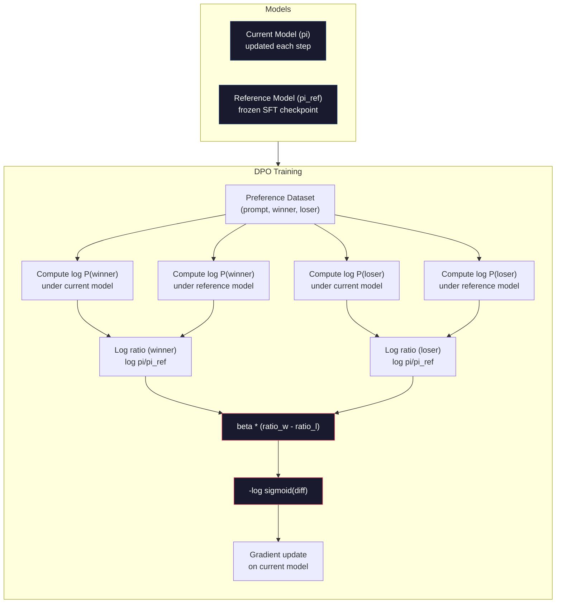

# DPO: Direct Preference Optimization

> RLHF działa. Wymaga też trenowania trzech modeli (SFT, model nagrody, polityka), zarządzania niestabilnością PPO i strojenia kary KL. DPO pyta: co jeśli można by pominąć to wszystko? DPO bezpośrednio optymalizuje model językowy na parach preferencji. Żaden model nagrody. Żadne PPO. Jedna pętla treningowa. Te same wyniki.

**Type:** Build
**Languages:** Python (with numpy)
**Prerequisites:** Phase 10, Lesson 07 (RLHF)
**Time:** ~90 minutes

## Learning Objectives

- Zaimplementować trening DPO, który bezpośrednio optymalizuje model językowy na parach preferencji bez osobnego modelu nagrody
- Wyprowadzić funkcję straty DPO i wyjaśnić, jak niejawnie reprezentuje ona model nagrody przez log-prawdopodobieństwa polityki
- Porównać DPO vs RLHF pod względem stabilności treningu, kosztów obliczeniowych i liczby wymaganych modeli
- Dostroić parametr beta, aby kontrolować, jak daleko trenowana polityka odbiega od modelu referencyjnego

## The Problem

Zbudowałeś potok RLHF w Lekcji 07. Trzy etapy. Trzy modele. Model SFT, model nagrody i model polityki optymalizowany za pomocą PPO. Sam model nagrody wymagał tysięcy par preferencji ludzkich i osobnej pętli treningowej. PPO wymagało starannego dostrojenia współczynnika KL, tempa uczenia, współczynnika przycięcia i liczby epok.

W praktyce trening PPO jest notorycznie niestabilny. Małe zmiany hiperparametrów powodują rozbieżność treningu. Model nagrody jest niedoskonałym proxy dla ludzkich preferencji, a polityka znajduje sposoby na wykorzystanie jego słabości. Kara KL pomaga, ale wymaga własnego strojenia -- zbyt niska i dostajesz oszukiwanie nagrody, zbyt wysoka i model ledwie się uczy.

Ta złożoność jest powodem, dla którego większość modeli open-source miała problemy z RLHF przez lata po publikacji InstructGPT. Trzyetapowy potok jest kruchy. Każdy etap ma swoje własne tryby awarii, a błędy się kumulują.

W maju 2023 Rafael Rafailov, Archit Sharma i współpracownicy ze Stanford opublikowali "Direct Preference Optimization: Your Language Model is Secretly a Reward Model". Kluczowy wgląd: nie potrzebujesz osobnego modelu nagrody. Optymalna funkcja nagrody jest matematycznie określona przez prawdopodobieństwa tokenów samego modelu językowego. Możesz całkowicie pominąć model nagrody i optymalizować model językowy bezpośrednio na parach preferencji.

DPO redukuje RLHF do pojedynczego kroku uczenia nadzorowanego. Jeden model. Jedna funkcja straty. Jedna pętla treningowa. Żadnego uczenia przez wzmacnianie. Zephyr-7B, jeden z pierwszych modeli używających DPO na dużą skalę, dorównał lub pobił modele trenowane z pełnym RLHF na kilku benchmarkach. Meta użyła DPO jako części potoku dostrajania Llama 3. Anthropic cytował metody typu DPO w swoich badaniach nad alignmentem.

## The Concept

### Kluczowy Wgląd

RLHF optymalizuje ten cel:

```
maximize: E[R(x, y)] - beta * KL(pi || pi_ref)
```

gdzie R to model nagrody, pi to polityka, pi_ref to model referencyjny, a beta to współczynnik KL.

Artykuł DPO wykazał, że ten cel ma optymalne rozwiązanie w postaci zamkniętej. Dla dowolnej funkcji nagrody R, optymalna polityka to:

```
pi*(y | x) = pi_ref(y | x) * exp(R(x, y) / beta) / Z(x)
```

gdzie Z(x) to stała normalizująca. Przekształcając:

```
R(x, y) = beta * log(pi*(y | x) / pi_ref(y | x)) + beta * log Z(x)
```

To jest przełom. Nagroda jest wyrażona wyłącznie w kategoriach prawdopodobieństw modelu polityki i modelu referencyjnego. Nie musisz trenować osobnego modelu nagrody. Nagroda jest *niejawna* w stosunku prawdopodobieństw.

Podstawiając to do modelu preferencji Bradleya-Terry'ego:

```
P(y_w > y_l | x) = sigmoid(R(x, y_w) - R(x, y_l))
                  = sigmoid(beta * (log pi(y_w|x)/pi_ref(y_w|x) - log pi(y_l|x)/pi_ref(y_l|x)))
```

Człony Z(x) się znoszą, ponieważ obie odpowiedzi są warunkowane na tym samym prompcie x. To co zostaje, jest funkcją tylko log-prawdopodobieństw modelu polityki i modelu referencyjnego dla preferowanej i odrzuconej odpowiedzi.

### Strata DPO

```
L_DPO = -log(sigmoid(beta * (log pi(y_w|x)/pi_ref(y_w|x) - log pi(y_l|x)/pi_ref(y_l|x))))
```

Rozłóżmy każdy element:

- **y_w** = preferowana (zwycięska) odpowiedź
- **y_l** = odrzucona (przegrana) odpowiedź
- **x** = prompt
- **pi** = bieżący model (trenowany)
- **pi_ref** = model referencyjny (zamrożony punkt kontrolny SFT)
- **beta** = parametr temperatury kontrolujący odchylenie od referencji (typowe 0.1 do 0.5)

Stosunek `log pi(y|x) / pi_ref(y|x)` to logarytm stosunku prawdopodobieństw. Gdy ten stosunek jest dodatni, bieżący model przypisuje wyższe prawdopodobieństwo odpowiedzi y niż model referencyjny. Gdy ujemny, bieżący model przypisuje niższe prawdopodobieństwo.

Strata DPO popycha model do zwiększenia logarytmu stosunku prawdopodobieństw dla preferowanych odpowiedzi i zmniejszenia go dla odrzuconych. Parametr beta kontroluje, jak agresywnie model może odbiegać od referencji -- małe beta oznacza dopuszczalne duże odchylenia, duże beta utrzymuje model blisko referencji.



### Dlaczego DPO jest Prostszy

| Aspekt | RLHF (PPO) | DPO |
|--------|-----------|-----|
| Modele do trenowania | 3 (SFT + nagroda + polityka) | 1 (tylko polityka) |
| Pętle treningowe | 3 (SFT, trening RM, PPO) | 2 (SFT, DPO) |
| Hiperparametry | lr, współ. KL, współ. przycięcia, lr RM, epoki x3 | lr, beta, epoki |
| Model nagrody | Wymagany (osobny trening) | Niejawny w prawdopodobieństwach modelu |
| Algorytm RL | PPO (złożony, niestabilny) | Uczenie nadzorowane (stabilne) |
| Pamięć GPU | 3-4 modele w pamięci podczas PPO | 2 modele (bieżący + referencyjny) |
| Stabilność treningu | Wrażliwa na hiperparametry | Odporna, podobna do SFT |

DPO potrzebuje dwóch modeli w pamięci podczas treningu -- bieżącego modelu i zamrożonej referencji. RLHF potrzebuje trzech lub czterech: polityki, referencji, modelu nagrody i opcjonalnie wartości funkcji bazowej. Dla modelu 70B każda kopia zajmuje 140GB w FP16. Oszczędności pamięci z wyeliminowania modelu nagrody są znaczące.

### Kiedy DPO Biję RLHF

**Małe zbiory danych.** Przy 5 000-20 000 par preferencji DPO często dorównuje lub przewyższa RLHF. Model nagrody w RLHF potrzebuje wystarczającej ilości danych, aby generalizować -- przy ograniczonych danych overfituje i produkuje zawodne sygnały nagrody. DPO omija ten problem, ponieważ w ogóle nie potrzebuje modelu nagrody.

**Ograniczone zasoby obliczeniowe.** DPO wymaga około jednej trzeciej mocy obliczeniowej pełnego RLHF (jedna pętla treningowa zamiast trzech). Dla zespołów bez dużych klastrów GPU jest to praktyczny wybór.

**Szybka iteracja.** Chcesz wypróbować 10 różnych zbiorów danych preferencji, aby zobaczyć, który daje najlepszy model? DPO pozwala przeprowadzić każdy eksperyment w godzinach. RLHF wymaga ponownego trenowania modelu nagrody dla każdego zbioru danych.

### Kiedy RLHF Biję DPO

**Trening na dużą skalę.** Na skali GPT-4 lub Claude, osobny model nagrody w RLHF może uchwycić bardziej niuansowe sygnały preferencji. Model nagrody działa jako wyuczona funkcja straty, która dostosowuje się do złożonych kryteriów jakości.

**Złożone sygnały nagrody.** Gdy "lepszy" obejmuje wiele wymiarów (pomocność, nieszkodliwość, uczciwość), model nagrody może nauczyć się tego wieloobiektywnego kompromisu. DPO traktuje każdą parę preferencji jako sygnał binarny -- jedna jest lepsza, druga gorsza -- bez modelowania dlaczego.

**Iteracyjne dostrajanie.** Potoki RLHF mogą generować nowe odpowiedzi z bieżącej polityki, mieć je oceniane przez ludzi i ponownie trenować model nagrody w pętli online. DPO działa na stałym zbiorze par preferencji. Constitutional AI (podejście Anthropic) w dużym stopniu korzysta z tej iteracyjnej właściwości RLHF.

### Poza DPO: KTO, ORPO, SimPO

DPO zainspirowało rodzinę uproszczonych metod alignmentu.

**KTO (Kahneman-Tversky Optimization, 2024):** Nie potrzebujesz nawet par. KTO działa na niesparowanych opiniach -- po prostu oznacz każdą odpowiedź jako "dobra" lub "zła" bez porównywania jej z alternatywą. To dramatycznie upraszcza zbieranie danych. Zamiast pokazywać annotatorom dwie odpowiedzi i pytać "która jest lepsza?", pokazujesz jedną odpowiedź i pytasz "czy to jest dobre?" Funkcja straty stosuje awersję do straty z teorii perspektywy: złe odpowiedzi są karane bardziej niż dobre są nagradzane.

**ORPO (Odds Ratio Preference Optimization, 2024):** Łączy SFT i alignment w jednym kroku treningowym. Zamiast najpierw robić SFT, a potem DPO, ORPO modyfikuje stratę SFT, aby zawierała sygnał preferencji. Strata ma dwa człony: standardową stratę predykcji następnego tokena na preferowanych odpowiedziach plus człon ilorazu szans, który zwiększa różnicę między prawdopodobieństwami preferowanych i odrzuconych odpowiedzi. Jedna pętla treningowa zamiast dwóch.

**SimPO (Simple Preference Optimization, 2024):** Całkowicie eliminuje model referencyjny. Zamiast obliczać logarytmy stosunków prawdopodobieństw względem zamrożonej referencji, SimPO używa średniego log-prawdopodobieństwa odpowiedzi (znormalizowanego przez długość) jako niejawnej nagrody. Oszczędza to pamięć (nie potrzeba modelu referencyjnego) i upraszcza trening. Normalizacja długości zapobiega faworyzowaniu krótszych odpowiedzi przez model.

| Metoda | Rok | Modele w Pamięci | Potrzebuje Par? | Potrzebuje Referencji? | Pętle Treningowe |
|--------|------|-----------------|-------------|-----------------|----------------|
| RLHF | 2022 | 3-4 | Tak (dla RM) | Tak | 3 |
| DPO | 2023 | 2 | Tak | Tak | 2 |
| KTO | 2024 | 2 | Nie (niesparowane) | Tak | 2 |
| ORPO | 2024 | 1 | Tak | Nie | 1 |
| SimPO | 2024 | 1 | Tak | Nie | 1 |

Trend jest jasny: każda metoda eliminuje jeden kolejny element złożoności. RLHF potrzebował modelu nagrody i PPO. DPO wyeliminowało oba. KTO wyeliminował sparowane dane. ORPO wyeliminowało osobny etap SFT. SimPO wyeliminowało model referencyjny. Podatek alignmentu -- koszt obliczeniowy i złożoność przejścia od modelu bazowego do modelu dostrojonego -- stale maleje.

### Rzeczywiste Wdrożenia DPO

**Zephyr-7B (HuggingFace, październik 2023):** Mistral 7B jako baza, SFT na UltraChat (200K przykładów), następnie DPO na UltraFeedback (60K par preferencji). Osiągnął 6.47 na MT-Bench -- najwyższy wynik dla modelu 7B w tamtym czasie. Dla porównania, Llama 2 Chat 70B osiągnęła 6.86, co oznacza, że Zephyr był w 6% modelu 10 razy większego, używając tylko alignmentu DPO.

**Llama 3 (Meta, kwiecień 2024):** Użyła DPO po początkowych etapach RLHF. Połączenie sugeruje, że DPO i RLHF mogą być komplementarne -- RLHF dla szerokiego alignmentu, DPO dla ukierunkowanego dopracowania.

**Neural Magic / nm-chat (2024):** Zastosował DPO do wielu modeli open-source, konsekwentnie pokazując 5-15% poprawy na benchmarkach alignmentu w porównaniu do bazowych modeli SFT.

```figure
dpo-loss
```

## Build It

### Krok 1: Zbiór Danych Preferencji

Ten sam format co w RLHF -- trójki (prompt, preferowana, odrzucona). DPO konsumuje te dane bezpośrednio bez pośredniego modelu nagrody.

```python
import numpy as np
import sys
import os
sys.path.insert(0, os.path.join(os.path.dirname(__file__), "..", "..", "04-pre-training-mini-gpt", "code"))
from main import MiniGPT, LayerNorm, Embedding, TransformerBlock

PREFERENCE_DATA = [
    {
        "prompt": "What is the capital of France?",
        "preferred": "The capital of France is Paris.",
        "rejected": "France is a country in Europe. It has many cities. The capital is Paris. Paris is known for the Eiffel Tower.",
    },
    {
        "prompt": "Explain gravity in one sentence.",
        "preferred": "Gravity is the force that attracts objects with mass toward each other.",
        "rejected": "Gravity is something that makes things fall down when you drop them.",
    },
    {
        "prompt": "What is 15 times 7?",
        "preferred": "15 times 7 is 105.",
        "rejected": "Let me think about this. 15 times 7. Well, 10 times 7 is 70, and 5 times 7 is 35, so the answer might be around 105.",
    },
    {
        "prompt": "Name three programming languages.",
        "preferred": "Python, Rust, and TypeScript.",
        "rejected": "There are many programming languages. Some popular ones include various languages like Python and others.",
    },
    {
        "prompt": "What year did World War II end?",
        "preferred": "World War II ended in 1945.",
        "rejected": "World War II was a major global conflict. It involved many countries. The war ended in the mid-1940s, specifically in 1945.",
    },
    {
        "prompt": "Define machine learning.",
        "preferred": "Machine learning is a field where algorithms learn patterns from data to make predictions without being explicitly programmed.",
        "rejected": "Machine learning is a type of AI. AI stands for artificial intelligence. Machine learning uses data to learn.",
    },
]
```

### Krok 2: Log-Prawdopodobieństwo Sekwencji

Strata DPO wymaga obliczenia całkowitego log-prawdopodobieństwa odpowiedzi dla danego promptu. Oznacza to przepuszczenie modelu przez pełną sekwencję (prompt + odpowiedź) i zsumowanie log-prawdopodobieństw każdego tokena odpowiedzi.

```python
def tokenize_sequence(text, vocab_size=256):
    return [min(t, vocab_size - 1) for t in list(text.encode("utf-8"))]


def compute_sequence_log_prob(model, prompt_tokens, response_tokens, max_seq_len=128):
    full_sequence = prompt_tokens + response_tokens
    if len(full_sequence) > max_seq_len:
        full_sequence = full_sequence[:max_seq_len]

    if len(full_sequence) < 2:
        return 0.0

    input_ids = np.array(full_sequence[:-1]).reshape(1, -1)
    target_ids = np.array(full_sequence[1:])

    logits = model.forward(input_ids)
    logits = logits[0]

    max_logits = logits.max(axis=-1, keepdims=True)
    log_probs = logits - max_logits - np.log(
        np.exp(logits - max_logits).sum(axis=-1, keepdims=True)
    )

    prompt_len = len(prompt_tokens)
    response_start = max(0, prompt_len - 1)
    response_end = len(target_ids)

    if response_start >= response_end:
        return 0.0

    response_log_probs = log_probs[response_start:response_end, :]
    response_targets = target_ids[response_start:response_end]

    total_log_prob = 0.0
    for i, target in enumerate(response_targets):
        total_log_prob += response_log_probs[i, target]

    return total_log_prob
```

Ta funkcja jest koniem roboczym DPO. Dla każdej pary preferencji uruchamiana jest cztery razy: model na preferowanej odpowiedzi, model na odrzuconej odpowiedzi, referencja na preferowanej odpowiedzi, referencja na odrzuconej odpowiedzi. To 4 przejścia w przód na przykład treningowy w porównaniu do generacji + oceny nagrody + estymacji wartości + aktualizacji PPO w RLHF. Prościej, szybciej, stabilniej.

### Krok 3: Strata DPO

Sedno artykułu w kodzie. Jedna funkcja. Jedna strata. Żaden model nagrody.

```python
def sigmoid(x):
    return np.where(
        x >= 0,
        1.0 / (1.0 + np.exp(-x)),
        np.exp(x) / (1.0 + np.exp(x))
    )


def dpo_loss(policy_logprob_preferred, policy_logprob_rejected,
             ref_logprob_preferred, ref_logprob_rejected, beta=0.1):
    preferred_ratio = policy_logprob_preferred - ref_logprob_preferred
    rejected_ratio = policy_logprob_rejected - ref_logprob_rejected

    logit = beta * (preferred_ratio - rejected_ratio)

    loss = -np.log(sigmoid(logit) + 1e-8)

    preferred_reward = beta * preferred_ratio
    rejected_reward = beta * rejected_ratio

    return loss, {
        "preferred_ratio": float(preferred_ratio),
        "rejected_ratio": float(rejected_ratio),
        "logit": float(logit),
        "implicit_preferred_reward": float(preferred_reward),
        "implicit_rejected_reward": float(rejected_reward),
        "reward_margin": float(preferred_reward - rejected_reward),
    }
```

`preferred_ratio` i `rejected_ratio` to logarytmy stosunków prawdopodobieństw z wyprowadzenia DPO. Gdy bieżący model przypisuje wyższe prawdopodobieństwo preferowanej odpowiedzi (względem referencji) i niższe prawdopodobieństwo odrzuconej odpowiedzi, logit jest dodatni, a strata niska. Sygnał treningowy popycha model dokładnie w tym kierunku.

`implicit_preferred_reward` i `implicit_rejected_reward` to nagrody, które strata DPO niejawnie przypisuje. Możesz je wyodrębnić, aby zweryfikować, że trening działa -- margines między preferowaną a odrzuconą nagrodą powinien rosnąć w trakcie treningu.

### Krok 4: Pętla Treningowa DPO

Standardowa pętla treningu nadzorowanego. Żadnego PPO. Żadnego modelu nagrody. Tylko przejścia w przód i aktualizacje gradientowe.

```python
def copy_model_weights(source, target):
    target.embedding.token_embed = source.embedding.token_embed.copy()
    target.embedding.pos_embed = source.embedding.pos_embed.copy()
    target.ln_f.gamma = source.ln_f.gamma.copy()
    target.ln_f.beta = source.ln_f.beta.copy()
    for s_block, t_block in zip(source.blocks, target.blocks):
        t_block.attn.W_q = s_block.attn.W_q.copy()
        t_block.attn.W_k = s_block.attn.W_k.copy()
        t_block.attn.W_v = s_block.attn.W_v.copy()
        t_block.attn.W_out = s_block.attn.W_out.copy()
        t_block.ffn.W1 = s_block.ffn.W1.copy()
        t_block.ffn.W2 = s_block.ffn.W2.copy()
        t_block.ffn.b1 = s_block.ffn.b1.copy()
        t_block.ffn.b2 = s_block.ffn.b2.copy()
        t_block.ln1.gamma = s_block.ln1.gamma.copy()
        t_block.ln1.beta = s_block.ln1.beta.copy()
        t_block.ln2.gamma = s_block.ln2.gamma.copy()
        t_block.ln2.beta = s_block.ln2.beta.copy()


def dpo_train(policy_model, reference_model, preference_data,
              num_epochs=5, lr=5e-6, beta=0.1, max_seq_len=128):
    print(f"DPO Training: {len(preference_data)} pairs, {num_epochs} epochs, "
          f"lr={lr}, beta={beta}")
    print()

    losses = []
    margins = []

    for epoch in range(num_epochs):
        epoch_loss = 0.0
        epoch_margin = 0.0
        num_examples = 0

        indices = np.random.permutation(len(preference_data))

        for idx in indices:
            pair = preference_data[idx]

            prompt_tokens = tokenize_sequence(pair["prompt"])
            preferred_tokens = tokenize_sequence(pair["preferred"])
            rejected_tokens = tokenize_sequence(pair["rejected"])

            pi_logprob_w = compute_sequence_log_prob(
                policy_model, prompt_tokens, preferred_tokens, max_seq_len
            )
            pi_logprob_l = compute_sequence_log_prob(
                policy_model, prompt_tokens, rejected_tokens, max_seq_len
            )
            ref_logprob_w = compute_sequence_log_prob(
                reference_model, prompt_tokens, preferred_tokens, max_seq_len
            )
            ref_logprob_l = compute_sequence_log_prob(
                reference_model, prompt_tokens, rejected_tokens, max_seq_len
            )

            loss, metrics = dpo_loss(
                pi_logprob_w, pi_logprob_l,
                ref_logprob_w, ref_logprob_l, beta
            )

            update_direction = 1.0 if metrics["logit"] < 0 else -0.1
            for block in policy_model.blocks:
                block.ffn.W1 += lr * update_direction * np.random.randn(*block.ffn.W1.shape) * 0.01
                block.ffn.W2 += lr * update_direction * np.random.randn(*block.ffn.W2.shape) * 0.01

            epoch_loss += loss
            epoch_margin += metrics["reward_margin"]
            num_examples += 1
            losses.append(float(loss))
            margins.append(metrics["reward_margin"])

        avg_loss = epoch_loss / max(num_examples, 1)
        avg_margin = epoch_margin / max(num_examples, 1)

        print(f"  Epoch {epoch + 1}/{num_epochs} | Loss: {avg_loss:.4f} | "
              f"Avg Margin: {avg_margin:.4f}")

    return policy_model, losses, margins
```

Pętla treningowa jest odświeżająco prosta w porównaniu do RLHF. Dla każdej pary preferencji: oblicz cztery log-prawdopodobieństwa (dwa modele, dwie odpowiedzi), wstaw je do straty DPO, oblicz gradient, zaktualizuj politykę. Żadnego kroku generacji. Żadnej inferencji modelu nagrody. Żadnej estymacji przewagi. Żadnego przycinania.

### Krok 5: Porównaj DPO vs RLHF

Zmierz niejawne marginesy nagrody i przesunięcia log-prawdopodobieństw, aby porównać DPO z modelem RLHF z Lekcji 07.

```python
def evaluate_preference_accuracy(model, reference_model, preference_data, beta=0.1, max_seq_len=128):
    correct = 0
    total = 0

    for pair in preference_data:
        prompt_tokens = tokenize_sequence(pair["prompt"])
        preferred_tokens = tokenize_sequence(pair["preferred"])
        rejected_tokens = tokenize_sequence(pair["rejected"])

        pi_w = compute_sequence_log_prob(model, prompt_tokens, preferred_tokens, max_seq_len)
        pi_l = compute_sequence_log_prob(model, prompt_tokens, rejected_tokens, max_seq_len)
        ref_w = compute_sequence_log_prob(reference_model, prompt_tokens, preferred_tokens, max_seq_len)
        ref_l = compute_sequence_log_prob(reference_model, prompt_tokens, rejected_tokens, max_seq_len)

        preferred_reward = beta * (pi_w - ref_w)
        rejected_reward = beta * (pi_l - ref_l)

        if preferred_reward > rejected_reward:
            correct += 1
        total += 1

    return correct / max(total, 1)


def analyze_implicit_rewards(model, reference_model, preference_data, beta=0.1, max_seq_len=128):
    print("Implicit Reward Analysis:")
    print("-" * 65)
    print(f"  {'Prompt':<30} {'Pref Reward':>12} {'Rej Reward':>12} {'Margin':>10}")
    print("  " + "-" * 60)

    for pair in preference_data:
        prompt_tokens = tokenize_sequence(pair["prompt"])
        preferred_tokens = tokenize_sequence(pair["preferred"])
        rejected_tokens = tokenize_sequence(pair["rejected"])

        pi_w = compute_sequence_log_prob(model, prompt_tokens, preferred_tokens, max_seq_len)
        pi_l = compute_sequence_log_prob(model, prompt_tokens, rejected_tokens, max_seq_len)
        ref_w = compute_sequence_log_prob(reference_model, prompt_tokens, preferred_tokens, max_seq_len)
        ref_l = compute_sequence_log_prob(reference_model, prompt_tokens, rejected_tokens, max_seq_len)

        pref_reward = beta * (pi_w - ref_w)
        rej_reward = beta * (pi_l - ref_l)
        margin = pref_reward - rej_reward

        truncated = pair["prompt"][:28] + ".." if len(pair["prompt"]) > 30 else pair["prompt"]
        print(f"  {truncated:<30} {pref_reward:>12.4f} {rej_reward:>12.4f} {margin:>10.4f}")

    print()
```

### Krok 6: Analiza Wrażliwości Beta

Parametr beta jest w DPO odpowiednikiem współczynnika KL w RLHF. Kontroluje, jak bardzo model może odbiegać od referencji. Ten eksperyment pokazuje jego efekt.

```python
def beta_sensitivity_analysis(sft_model, preference_data, betas, max_seq_len=128):
    print("Beta Sensitivity Analysis")
    print("-" * 60)
    print(f"  {'Beta':>8} {'Final Loss':>12} {'Final Margin':>14} {'Accuracy':>10}")
    print("  " + "-" * 55)

    results = []

    for beta in betas:
        policy = MiniGPT(
            vocab_size=256, embed_dim=128, num_heads=4,
            num_layers=4, max_seq_len=max_seq_len, ff_dim=512
        )
        reference = MiniGPT(
            vocab_size=256, embed_dim=128, num_heads=4,
            num_layers=4, max_seq_len=max_seq_len, ff_dim=512
        )
        copy_model_weights(sft_model, policy)
        copy_model_weights(sft_model, reference)

        policy, losses, margins_list = dpo_train(
            policy, reference, preference_data,
            num_epochs=3, lr=5e-6, beta=beta, max_seq_len=max_seq_len
        )

        accuracy = evaluate_preference_accuracy(
            policy, reference, preference_data, beta, max_seq_len
        )

        final_loss = losses[-1] if losses else 0
        final_margin = margins_list[-1] if margins_list else 0

        print(f"  {beta:>8.3f} {final_loss:>12.4f} {final_margin:>14.4f} {accuracy:>10.1%}")
        results.append({
            "beta": beta,
            "final_loss": final_loss,
            "final_margin": final_margin,
            "accuracy": accuracy,
        })

        print()

    return results
```

Małe beta (0.01) pozwala modelowi swobodnie odbiegać od referencji -- szybkie uczenie, ale ryzyko zdegenerowanych rozwiązań. Duże beta (1.0) utrzymuje model blisko referencji -- stabilne, ale powolne uczenie. Optymalny zakres dla większości zastosowań to 0.1 do 0.3.

## Use It

### Pełne Demo Potoku DPO

```python
if __name__ == "__main__":
    np.random.seed(42)

    print("=" * 70)
    print("DPO: DIRECT PREFERENCE OPTIMIZATION")
    print("=" * 70)
    print()

    print("STEP 1: Initialize SFT Model (from Lesson 06)")
    print("-" * 50)
    sft_model = MiniGPT(
        vocab_size=256, embed_dim=128, num_heads=4,
        num_layers=4, max_seq_len=128, ff_dim=512
    )
    print(f"  Parameters: {sft_model.count_parameters():,}")
    print()

    print("STEP 2: DPO Training")
    print("-" * 50)

    policy_model = MiniGPT(
        vocab_size=256, embed_dim=128, num_heads=4,
        num_layers=4, max_seq_len=128, ff_dim=512
    )
    reference_model = MiniGPT(
        vocab_size=256, embed_dim=128, num_heads=4,
        num_layers=4, max_seq_len=128, ff_dim=512
    )
    copy_model_weights(sft_model, policy_model)
    copy_model_weights(sft_model, reference_model)

    policy_model, losses, margins = dpo_train(
        policy_model, reference_model, PREFERENCE_DATA,
        num_epochs=5, lr=5e-6, beta=0.1
    )
    print()

    print("=" * 70)
    print("STEP 3: Evaluate")
    print("=" * 70)
    print()

    pre_accuracy = evaluate_preference_accuracy(
        sft_model, reference_model, PREFERENCE_DATA, beta=0.1
    )
    post_accuracy = evaluate_preference_accuracy(
        policy_model, reference_model, PREFERENCE_DATA, beta=0.1
    )

    print(f"  Preference accuracy (pre-DPO):  {pre_accuracy:.1%}")
    print(f"  Preference accuracy (post-DPO): {post_accuracy:.1%}")
    print()

    analyze_implicit_rewards(policy_model, reference_model, PREFERENCE_DATA, beta=0.1)

    print("=" * 70)
    print("STEP 4: Training Dynamics")
    print("=" * 70)
    print()

    if losses:
        print("  Loss curve:")
        window = max(1, len(losses) // 5)
        for i in range(0, len(losses), window):
            chunk = losses[i:i + window]
            avg = sum(chunk) / len(chunk)
            print(f"    Steps {i:3d}-{i + len(chunk) - 1:3d}: loss = {avg:.4f}")
        print()

    if margins:
        print("  Reward margin curve:")
        window = max(1, len(margins) // 5)
        for i in range(0, len(margins), window):
            chunk = margins[i:i + window]
            avg = sum(chunk) / len(chunk)
            print(f"    Steps {i:3d}-{i + len(chunk) - 1:3d}: margin = {avg:.4f}")
        print()

    print("=" * 70)
    print("STEP 5: Beta Sensitivity")
    print("=" * 70)
    print()

    beta_results = beta_sensitivity_analysis(
        sft_model, PREFERENCE_DATA, betas=[0.01, 0.1, 0.3, 1.0]
    )

    print("=" * 70)
    print("DPO vs RLHF COMPARISON")
    print("=" * 70)
    print()
    print("  DPO advantages:")
    print("    - 1 training loop (vs 3 for RLHF)")
    print("    - 2 models in memory (vs 3-4 for RLHF)")
    print("    - Supervised learning (vs RL, more stable)")
    print("    - No reward model to train or maintain")
    print()
    print("  RLHF advantages:")
    print("    - Separate reward model captures complex preferences")
    print("    - Online learning: generate, rate, retrain")
    print("    - Better for multi-objective alignment")
    print("    - Proven at largest scales (GPT-4, Claude)")
    print()
    print("  Practical guidance:")
    print("    - Start with DPO. It's simpler and often sufficient.")
    print("    - Switch to RLHF if DPO plateaus on your eval metrics.")
    print("    - Many production systems use both: RLHF first, DPO to refine.")
```

## Ship It

Ta lekcja produkuje `outputs/prompt-alignment-method-selector.md` -- prompt, który pomaga wybrać odpowiednią metodę alignmentu (SFT, RLHF, DPO, KTO, ORPO, SimPO) dla twojego przypadku użycia. Biorąc pod uwagę dostępność danych, budżet obliczeniowy i cele alignmentu, zaleca metodę i plan treningowy.

## Exercises

1. Zaimplementuj KTO (Kahneman-Tversky Optimization). KTO nie potrzebuje par -- po prostu oznacz każdą odpowiedź jako "dobrą" lub "złą." Strata dla dobrej odpowiedzi to `-log(sigmoid(beta * log_ratio))`, a dla złej to `-log(1 - sigmoid(beta * log_ratio))` z mnożnikiem awersji do straty (zazwyczaj 1.5x) na stracie złej odpowiedzi. Trenuj na tych samych danych (traktuj preferowane jako "dobre", a odrzucone jako "złe" niezależnie) i porównaj dokładność z DPO.

2. Zaimplementuj DPO z normalizacją długości. Zamiast surowych log-prawdopodobieństw, podziel przez liczbę tokenów odpowiedzi: `normalized_logprob = total_logprob / num_tokens`. Zapobiega to faworyzowaniu krótszych odpowiedzi przez model (które mają wyższe całkowite log-prawdopodobieństwo). Porównaj niejawne marginesy nagrody z normalizacją i bez.

3. Zbuduj połączoną stratę w stylu ORPO. Dodaj standardową stratę predykcji następnego tokena na preferowanej odpowiedzi do straty DPO: `L = L_sft(preferred) + alpha * L_dpo`. Wypróbuj wartości alpha 0.1, 0.5 i 1.0. Połączona strata powinna produkować model, który zarówno podąża za instrukcjami (z członu SFT), jak i preferuje lepsze odpowiedzi (z członu DPO), eliminując potrzebę osobnego etapu SFT.

4. Zaimplementuj iteracyjne DPO. Uruchom DPO na 3 epoki, następnie wygeneruj nowe odpowiedzi z wytrenowanego modelu, sparuj je z oryginalnymi preferowanymi odpowiedziami jako nowe pary preferencji i uruchom DPO ponownie. Dwie rundy tego procesu "samodzielnej gry". Porównaj dokładność preferencji po rundzie 1 i rundzie 2, aby sprawdzić, czy iteracyjne dopracowanie pomaga.

5. Porównaj DPO z różnymi modelami referencyjnymi. Zamiast używać punktu kontrolnego SFT jako referencji, wypróbuj: (a) model bazowy (przed SFT), (b) punkt kontrolny z epoki 1 DPO, (c) wykładniczą średnią kroczącą modelu polityki. Raportuj, która referencja daje najwyższą dokładność preferencji i najbardziej stabilną krzywą treningową.

## Key Terms

| Termin | Co ludzie mówią | Co naprawdę oznacza |
|------|----------------|----------------------|
| DPO | "RLHF bez RL" | Direct Preference Optimization: algorytm uczenia nadzorowanego, który optymalizuje model językowy bezpośrednio na parach preferencji, omijając model nagrody i PPO |
| Niejawna nagroda | "Nagroda jest w modelu" | Funkcja nagrody jest określona przez logarytm stosunku prawdopodobieństw między polityką a modelem referencyjnym -- nie jest potrzebny osobny model nagrody |
| Beta (DPO) | "Temperatura" | Kontroluje, jak daleko polityka może odbiegać od modelu referencyjnego -- małe beta pozwala na duże odchylenia, duże beta utrzymuje model blisko |
| Logarytm stosunku prawdopodobieństw | "Jak bardzo model się zmienił" | log pi(y\|x) - log pi_ref(y\|x) -- dodatni oznacza, że bieżący model przypisuje wyższe prawdopodobieństwo niż referencja |
| Model referencyjny | "Zamrożony punkt kontrolny" | Kopia modelu SFT, której wagi nigdy się nie zmieniają -- służy jako kotwica do obliczania stosunków prawdopodobieństw |
| KTO | "DPO bez par" | Kahneman-Tversky Optimization: działa z niesparowanymi etykietami "dobry" lub "zły" zamiast wymagać par preferencji |
| ORPO | "Jednoetapowy alignment" | Odds Ratio Preference Optimization: łączy SFT i alignment w jedną pętlę treningową przez dodanie członu preferencji do straty SFT |
| SimPO | "Bez referencji" | Simple Preference Optimization: eliminuje model referencyjny, używając znormalizowanego średniego log-prawdopodobieństwa jako niejawnej nagrody |
| Podatek alignmentu | "Koszt bezpiecznych modeli" | Dodatkowe zasoby obliczeniowe, dane i złożoność wymagane do przejścia od modelu bazowego do modelu dostrojonego -- DPO znacząco go zmniejsza |

## Further Reading

- [Rafailov et al., 2023 -- "Direct Preference Optimization: Your Language Model is Secretly a Reward Model"](https://arxiv.org/abs/2305.18290) -- the DPO paper that simplified alignment from RLHF to supervised learning
- [Tunstall et al., 2023 -- "Zephyr: Direct Distillation of LM Alignment"](https://arxiv.org/abs/2310.16944) -- Zephyr-7B, showing DPO on UltraFeedback matches RLHF on benchmarks
- [Ethayarajh et al., 2024 -- "KTO: Model Alignment as Prospect Theoretic Optimization"](https://arxiv.org/abs/2402.01306) -- eliminating the need for paired preferences
- [Hong et al., 2024 -- "ORPO: Monolithic Preference Optimization without Reference Model"](https://arxiv.org/abs/2403.07691) -- combining SFT and alignment in one step
- [Meng et al., 2024 -- "SimPO: Simple Preference Optimization with a Reference-Free Reward"](https://arxiv.org/abs/2405.14734) -- eliminating the reference model entirely
- [Llama 3 Technical Report](https://arxiv.org/abs/2407.21783) -- Meta's alignment pipeline combining RLHF and DPO