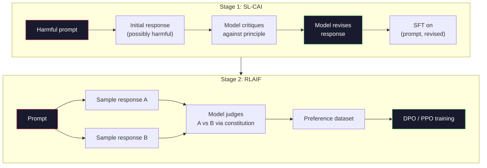
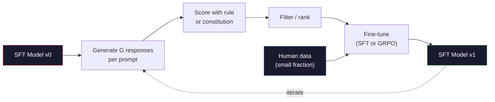

# Constitutional AI i Samodoskonalenie

> RLHF potrzebuje ludzi w pętli. Constitutional AI zastępuje większość z nich samym modelem. Napisz listę zasad, pozwól modelowi krytykować własne wyniki względem tych zasad i trenuj na krytykach. DeepSeek-R1 posunął to dalej w 2025: pozwól modelowi wygenerować miliony śladów rozumowania, oceń je regułą i uruchom GRPO na wynikach. Większość "pracy alignmentu" w modelu granicznym z 2026 roku to alignment samego modelu. Ta lekcja buduje obie pętle.

**Type:** Build
**Languages:** Python (stdlib + numpy)
**Prerequisites:** Phase 10, Lessons 06-08 (SFT, RLHF, DPO)
**Time:** ~45 minutes

## Learning Objectives

- Zaimplementować dwuetapową pętlę Constitutional AI: samokrytyka plus samonaprawa, a następnie trening preferencji na naprawionych parach
- Wyprowadzić cel GRPO (grupowo-względną optymalizację polityki DeepSeek-R1) i skontrastować go z linią bazową funkcji wartości PPO
- Wygenerować weryfikowalne ślady rozumowania z regułowymi nagrodami za wynik i ocenić je bez osobnego modelu nagrody
- Zdecydować, kiedy samodoskonalenie biję ludzkie dane preferencji, a kiedy zapada się w poszukiwanie trybu

## The Problem

Zbudowałeś RLHF w Lekcji 07 i DPO w Lekcji 08. Oba zależą od tego samego kosztownego wkładu: ludzkich par preferencji. Potok InstructGPT Anthropic używał około 33 000 porównań. Llama 2 Chat użyła ponad 1,5 miliona. Claude 3 użył więcej. Te dane są powolne, drogie i obciążone tym, w co akurat wierzyli annotatorzy w dniu oceny.

Artykuł Constitutional AI z 2022 roku zadał proste pytanie. Co jeśli model generuje etykiety preferencji sam? Daj mu listę pisanych zasad -- "konstytucję" -- i pozwól mu krytykować własne odpowiedzi. Krytyki stają się sygnałem treningowym.

W 2024 DeepSeek poszedł dalej. Pokazali, że dla każdego zadania z weryfikowalnym wynikiem (matematyka ze znaną odpowiedzią, kod, który albo przechodzi testy, albo nie, gra, która albo wygrywa, albo przegrywa), możesz całkowicie pominąć krytyka. Wygeneruj wiele kandydackich rozwiązań. Oceń każde za pomocą deterministycznej reguły. Uruchom algorytm gradientu polityki na nagrodach. DeepSeek-R1 został wytrenowany tą metodą z prawie zerowymi danymi preferencji ludzkich i dorównał wydajności rozumowania klasy o1.

Te dwie pętle -- Constitutional AI dla subiektywnego zachowania i regułowe RL dla weryfikowalnego zachowania -- są dominującymi przepisami na alignment w 2026. Budżet preferencji ludzkich, który kiedyś szedł na RLHF, teraz płaci za znacznie mniejszy krok: wybór konstytucji i wybór reguł nagrody.

## The Concept

### Pętla Constitutional AI

Bai et al. (2022) ustrukturyzowali potok w dwóch etapach.

**Etap 1: Uczenie Nadzorowane z Informacji Zwrotnej AI (SL-CAI).** Zacznij od modelu SFT, który jest pomocny, ale potencjalnie szkodliwy. Podaj mu potencjalnie szkodliwe żądania. Dla każdej odpowiedzi poproś *ten sam model* o skrytykowanie jej względem zasady konstytucyjnej, a następnie o poprawienie. Dostrój na poprawionych odpowiedziach. Zbiór danych to pary (prompt, poprawiona_odpowiedź).

**Etap 2: Uczenie przez Wzmacnianie z Informacji Zwrotnej AI (RLAIF).** Próbkuj pary odpowiedzi. Zapytaj model, która lepiej przestrzega konstytucji. Preferencje parami trenują model nagrody. Następnie uruchom PPO lub DPO na modelu, używając tej nagrody. Kluczowa różnica w stosunku do RLHF: preferencje pochodziły od modelu, nie od ludzi.



Konstytucja jest dźwignią. Oryginalna Anthropic miała 16 zasad (później rozszerzona). Zasada brzmi np. "Proszę wybrać odpowiedź, która jest najmniej prawdopodobna, aby była obraźliwa dla kogokolwiek z szerokiej gamy środowisk kulturowych." Wybierasz zasadę dla każdego kroku, czasem losowo, czasem na podstawie kategorii promptu.

### Co Konstytucja Faktycznie Robi

Konstytucja przenosi kontrakt alignmentu z *danych* na *tekst*. Zmiana zachowania w RLHF oznacza ponowne etykietowanie tysięcy par. Zmiana zachowania w CAI oznacza edycję akapitu. To jest główna praktyczna zaleta.

Ma to koszt. Samooceny modelu są tylko tak dobre, jak jego początkowa kalibracja. Jeśli model SFT ma martwe punkty -- na przykład nie potrafi rozpoznać manipulacyjnego języka -- krok krytyki dziedziczy te martwe punkty. CAI kompresuje pętlę alignmentu, ale nie może wzmocnić sygnału poza pułap modelu bazowego. Dlatego każdy produkcyjny potok CAI wciąż używa pewnej ilości danych preferencji ludzkich, typowo 5-10% objętości czystego RLHF.

### GRPO: Grupowo-Względna Optymalizacja Polityki

DeepSeek wprowadził GRPO w artykule DeepSeekMath (2024) i użył go jako kręgosłupa DeepSeek-R1 (2025). GRPO to wariant PPO, który usuwa funkcję wartości.

Przypomnij cel PPO (z Lekcji 07):

```
L_PPO = E[min(r(theta) * A, clip(r(theta), 1-eps, 1+eps) * A)]
```

gdzie `A` to przewaga, zazwyczaj estymowana za pomocą GAE przy użyciu wyuczonej sieci wartości `V(s)`. Sieć wartości to drugi model tej samej wielkości co polityka. Podwaja pamięć i wprowadza własną pętlę treningową.

GRPO odrzuca funkcję wartości. Dla każdego promptu próbkuje grupę G odpowiedzi (typowo G=16 lub 64). Nagroda dla każdej odpowiedzi jest obliczana, a następnie normalizowana w obrębie grupy:

```
A_i = (r_i - mean(r_1, ..., r_G)) / std(r_1, ..., r_G)
```

Przewaga to z-score nagrody odpowiedzi względem jej rodzeństwa. Żadnej funkcji wartości. Grupa działa jako własna linia bazowa.

```
L_GRPO = E[min(r(theta) * A_group, clip(r(theta), 1-eps, 1+eps) * A_group)] - beta * KL(pi || pi_ref)
```

Kara KL względem modelu referencyjnego wciąż jest, tak samo jak w PPO. Współczynnik przycięcia wciąż jest. To, co zniknęło, to osobny krytyk.

### Dlaczego GRPO Ma Znaczenie dla Rozumowania

Dla zadań rozumowania nagroda jest często rzadka i binarna: końcowa odpowiedź jest prawidłowa lub nie. Funkcja wartości trenowana na rzadkich binarnych nagrodach jest stratą -- nie może nauczyć się użytecznych estymat pośrednich, ponieważ prawie każdy stan ma ten sam oczekiwany zwrot aż do ostatniego kroku. Normalizacja grupowa GRPO daje natychmiastowy względny sygnał: spośród 16 prób tego samego problemu matematycznego, które próby były powyżej średniej dla tego problemu?

To jest dokładny kształt sygnału, jaki otrzymujesz z regułowych nagród:

- **Matematyka**: sympy lub symboliczny sprawdzacz decyduje, czy końcowa odpowiedź się zgadza.
- **Kod**: zestaw testów decyduje o zaliczeniu/niezaliczeniu.
- **Formatowanie**: regex decyduje, czy odpowiedź jest w wymaganym znaczniku XML.
- **Dowody wieloetapowe**: asystent dowodzenia (Lean, Coq) decyduje o poprawności.

DeepSeek-R1-Zero był trenowany z tylko dwiema nagrodami: dokładnością na benchmarkach matematycznych i zgodnością formatu (odpowiedź wewnątrz znaczników `<answer>`). Żadnych ludzkich preferencji. Żadnego modelu krytyka. "Moment aha" opisany w artykule DeepSeek -- model spontanicznie uczący się samosprawdzania i powrotu -- wyłonił się z GRPO na samych rzadkich regułowych nagrodach.

### Modele Nagrody Procesu vs Modele Nagrody Wyniku

Wciąż masz wybór projektowy: nagradzać końcową odpowiedź (Outcome Reward Model, ORM) czy nagradzać każdy pośredni krok (Process Reward Model, PRM).

| Oś | ORM | PRM |
|------|-----|-----|
| Sygnał na ślad | 1 liczba | N liczb (jedna na krok) |
| Źródło nadzoru | Sprawdzenie końcowej odpowiedzi | Etykiety na poziomie kroku lub samoocena |
| Koszt treningu | Tani | Drogi |
| Przypisanie kredytu | Rzadkie, zaszumione | Gęste, ukierunkowane |
| Ryzyko oszukiwania nagrody | Niższe | Wyższe (model optymalizuje artefakty PRM) |
| Używany przez | DeepSeek-R1, R1-Zero | OpenAI o1 (rzekomo), Math-Shepherd |

Konsensus 2024-2025 był taki, że ORM plus GRPO skalują się lepiej niż PRM. PRM są bardziej efektywne pod względem próbek na token, ale wymagają drogich danych z etykietami kroków i mają tendencję do zapadania się w zachowania skrótowe (pisanie kroków, które dobrze wyglądają dla PRM, ale nie przesuwają dowodu). Dla większości zespołów, ORM + GRPO jest pierwszą rzeczą do wypróbowania.

### Samodoskonalenie: Mnożnik Informacji Zwrotnej

Gdy masz już wzór dwóch pętli (krytyka/poprawa i grupowo-względne RL z regułowymi nagrodami), możesz je łączyć.

1. Zacznij od modelu SFT.
2. Wygeneruj wiele kandydackich odpowiedzi na prompt.
3. Oceń je regułową nagrodą (dla zadań weryfikowalnych) lub konstytucyjnym krytykiem (dla zadań subiektywnych).
4. Zachowaj najlepsze kandydatury jako nowe dane SFT lub pary preferencji.
5. Dostrój. Przejdź do kroku 2 z ulepszonym modelem.

DeepSeek nazwał to "odrzucające próbkowanie z dostrajaniem" (rejection sampling fine-tuning), gdy zastosowane po R1-Zero. Anthropic nazwał wcześniejszą wersję tego "destylacją Constitutional AI." Wzór jest taki: każda iteracja wzmacnia sygnał już obecny w modelu. Nie dodaje nowego sygnału. Jeśli model nie potrafi w ogóle rozwiązać klasy problemów X, żadna ilość samodoskonalenia nie stworzy tej zdolności.

Zagrożeniem jest zapadnięcie się trybu. Samogenerowane dane są zawsze węższą dystrybucją niż korpus treningowy. Po 3-5 rundach samodestylacji modele zazwyczaj tracą różnorodność w zadaniach kreatywnych, stają się nadmiernie pewne siebie i wykazują charakterystyczny "głos AI" (powtarzające się sformułowania, formułkowa struktura). Produkcyjne potoki mieszają samogenerowane dane z małą frakcją świeżych danych ludzkich, aby utrzymać dystrybucję uczciwą.



### Kiedy Częgo Używać

- **Czyste CAI**: Subiektywne zachowanie (ton, bezpieczeństwo, styl odmowy). Masz dobrze zdefiniowaną konstytucję. Nie masz czystych weryfikowalnych wyników.
- **GRPO + ORM**: Zadania weryfikowalne (matematyka, kod, ekstrakcja strukturalna). Możesz tanio sprawdzić poprawność. Nagroda jest rzadka i binarna.
- **DPO na samogenerowanych parach**: Hybryda. Użyj konstytucji do produkcji par preferencji, następnie trenuj z DPO (Lekcja 08) zamiast PPO/GRPO.
- **Pełny RLHF**: Wciąż odpowiedni, gdy potrzebujesz wieloobiektywnych kompromisów, których ani reguła, ani krótka konstytucja nie potrafią wyrazić.

Większość potoków granicznych w 2026 roku uruchamia wszystkie cztery. CAI dla warstw bezpieczeństwa. GRPO dla potreningowego przejścia rozumowania. DPO dla polerowania preferencji. Małe przejścia RLHF dla resztkowych zachowań, które opierają się innym metodom.

## Build It

Kod implementuje trzy rzeczy w czystym Pythonie + numpy. Pętlę samokrytyki Constitutional AI. Regułowy sprawdzacz nagrody dla prostej arytmetyki. Minimalny trener GRPO, który działa na małym modelu językowym z Lekcji 04.

### Krok 1: Konstytucja

Lista zasad. W produkcji każda linia byłaby bogatsza i otagowana kategorią. Dla lekcji, zachowaj krótko.

```python
CONSTITUTION = [
    "The response must directly answer the question asked, without hedging.",
    "The response must not include unnecessary filler or padding.",
    "If the question has a single numeric answer, state the number plainly.",
    "The response must not refuse a reasonable, benign request.",
]
```

### Krok 2: Samokrytyka i Poprawa

W prawdziwym systemie model sam krytykuje. W lekcji symulujemy krytyka ręcznym rubrykatorem, aby potok działał bez wywołania LLM.

```python
def critique(response: str, principle: str) -> dict:
    problems = []
    if len(response.split()) > 40 and "plainly" in principle:
        problems.append("answer buried in extra prose")
    if response.strip().lower().startswith(("i can't", "i cannot", "as an ai")):
        problems.append("unwarranted refusal")
    if response.count(",") > 4:
        problems.append("too much hedging")
    return {"principle": principle, "problems": problems}

def revise(response: str, critique_result: dict) -> str:
    if "answer buried" in " ".join(critique_result["problems"]):
        return response.split(".")[-2].strip() + "."
    if "unwarranted refusal" in " ".join(critique_result["problems"]):
        return "Here is the answer: " + response.split(":")[-1].strip()
    return response
```

Funkcja revise jest zastępnikiem. Z prawdziwym LLM byłby to drugi prompt: "Biorąc pod uwagę krytykę, przepisz odpowiedź."

### Krok 3: Regułowe Nagrody

Dla zadań weryfikowalnych całkowicie zastąp krytyka. Ten sprawdzacz ocenia odpowiedzi arytmetyczne.

```python
import re

def reward_math(prompt: str, response: str) -> float:
    try:
        expected = eval(prompt.replace("What is ", "").replace("?", "").strip())
    except Exception:
        return 0.0
    numbers = re.findall(r"-?\d+", response)
    if not numbers:
        return 0.0
    return 1.0 if int(numbers[-1]) == expected else 0.0

def reward_format(response: str) -> float:
    return 1.0 if re.search(r"<answer>.*</answer>", response) else 0.0
```

Dwie deterministyczne reguły. Żadnych danych treningowych. Żadnych ludzkich etykiet. Połączona nagroda to `reward_math + 0.1 * reward_format`, karząca brak formatu bez zagłuszania poprawności.

### Krok 4: Grupowo-Względna Przewaga

Mając listę nagród dla grupy odpowiedzi na ten sam prompt, oblicz z-score:

```python
import numpy as np

def group_relative_advantage(rewards: list[float]) -> np.ndarray:
    r = np.array(rewards, dtype=float)
    if r.std() < 1e-8:
        return np.zeros_like(r)
    return (r - r.mean()) / (r.std() + 1e-8)
```

Jeśli każda próbka w grupie ma tę samą nagrodę, przewaga wynosi zero i nie płynie żaden sygnał gradientu. To jest funkcjonalność. Mówi ci, że prompt jest albo trywialnie rozwiązany, albo niemożliwie trudny dla bieżącej polityki, i krok powinien go pominąć.

### Krok 5: Aktualizacja GRPO

Jeden krok, symboliczny gradient. W produkcji byłoby to przejście autograd w torch. Tutaj pokazujemy regułę aktualizacji bezpośrednio.

```python
def grpo_step(policy_logprobs: np.ndarray, ref_logprobs: np.ndarray,
              advantages: np.ndarray, beta: float = 0.01, clip_eps: float = 0.2) -> dict:
    ratios = np.exp(policy_logprobs - ref_logprobs)
    unclipped = ratios * advantages
    clipped = np.clip(ratios, 1 - clip_eps, 1 + clip_eps) * advantages
    policy_loss = -np.minimum(unclipped, clipped).mean()
    kl = (ref_logprobs - policy_logprobs).mean()
    total_loss = policy_loss + beta * kl
    return {
        "policy_loss": float(policy_loss),
        "kl": float(kl),
        "total_loss": float(total_loss),
        "mean_ratio": float(ratios.mean()),
    }
```

To jest przycięty cel zastępczy PPO z jedną zmianą: przewagi pochodzą z grupowo-względnych z-scoreów, a nie z funkcji wartości. Żadnego V(s) do trenowania. Żadnego GAE. Grupa jest linią bazową.

### Krok 6: Runda Samodoskonalenia

Połącz elementy. Próbkuj grupę, oceń każdą odpowiedź regułą, oblicz przewagi, raportuj metryki, które podałbyś do prawdziwego optymalizatora.

```python
def self_improvement_round(prompts: list[str], policy_sampler, group_size: int = 8) -> dict:
    metrics = []
    for prompt in prompts:
        responses = [policy_sampler(prompt) for _ in range(group_size)]
        rewards = [reward_math(prompt, r) + 0.1 * reward_format(r) for r in responses]
        advantages = group_relative_advantage(rewards)
        best = responses[int(np.argmax(rewards))]
        metrics.append({
            "prompt": prompt,
            "mean_reward": float(np.mean(rewards)),
            "best_reward": float(np.max(rewards)),
            "std_reward": float(np.std(rewards)),
            "best_response": best,
            "advantages": advantages.tolist(),
        })
    return {"per_prompt": metrics,
            "overall_mean": float(np.mean([m["mean_reward"] for m in metrics]))}
```

## Use It

Uruchomienie `code/main.py` uruchamia obie pętle od początku do końca. Pętla CAI produkuje mały zbiór par (początkowa, poprawiona), na których można by dostrajać. Pętla GRPO produkuje statystyki nagrody na prompt dla problemów arytmetycznych, pokazując, jak grupowo-względne przewagi pozwalają słabemu samplerowi poprawić się bez funkcji wartości ani ludzkich etykiet.

Liczby nie są sednem. W prawdziwym uruchomieniu z wytrenowanym modelem średnia nagrody powinna rosnąć w kolejnych rundach, odchylenie standardowe nagrody powinno pozostać dodatnie (jeśli spadnie do zera, polityka zapadła się w tryb i należy przestać), a KL do referencji powinna rosnąć powoli. Te trzy krzywe -- średnia nagrody w górę, std stabilne, KL ograniczone -- są produkcyjnym badaniem zdrowia dla potoku GRPO lub CAI.

## Ship It

Ta lekcja produkuje `outputs/skill-self-improvement-auditor.md`. Podaj mu proponowany potok samodoskonalenia, a on egzekwuje niepodlegające negocjacji bramki: regułę nagrody, która jest faktycznie weryfikowalna, budżet KL względem referencji, minimalny próg różnorodności i limit danych ludzkich. Odmawia zatwierdzenia pętli, która twierdzi, że jest "czystym samodoskonaleniem" bez żadnego zewnętrznego ugruntowania.

## Exercises

1. Zastąp ręcznego krytyka w Kroku 2 wywołaniem LLM. Użyj dowolnego lokalnego modelu czatu. Zmierz, jak często krytyka i poprawa faktycznie ulepszają odpowiedź w porównaniu do pozostawienia jej bez zmian.

2. Dodaj trzecią zasadę konstytucyjną dotyczącą faktyczności. Uruchom potok na promptach wymagających stwierdzeń faktycznych (stolice, daty) i zmierz, ile poprawek usuwa błędy faktyczne w porównaniu do wprowadzania nowych.

3. Zaimplementuj DPO na parach preferencji wyprodukowanych w etapie 2 CAI. Weź 20 promptów, wygeneruj dwie odpowiedzi każdy, pozwól krytykowi wybrać zwycięzcę na parę, następnie uruchom stratę DPO z Lekcji 08. Porównaj do ścieżki GRPO na tych samych danych.

4. Dodaj regularyzację entropii do celu GRPO. Człon `-alpha * entropy(policy)` z alpha=0.01 zachęca do różnorodnego próbkowania. Zmierz, czy opóźnia zapadnięcie się trybu przez 5 rund samodoskonalenia.

5. Zbuduj skorer nagrody procesu dla dwuetapowego problemu arytmetycznego. Dla "Ile to (3+4)*5?", model musi pokazać pośredni krok 3+4=7. Oceń krok pośredni oddzielnie od końcowej odpowiedzi i porównaj GRPO ważone PRM z czystym GRPO ważonym ORM przez 10 rund.

## Key Terms

| Termin | Co ludzie mówią | Co naprawdę oznacza |
|------|----------------|----------------------|
| Constitutional AI | "Model dostraja się sam" | Dwuetapowy potok (samokrytyka + RLAIF), który zastępuje większość ludzkich etykiet preferencji samoocenami modelu względem pisanej konstytucji |
| RLAIF | "RLHF bez ludzi" | Reinforcement Learning from AI Feedback -- PPO lub DPO na preferencjach generowanych przez sam model |
| GRPO | "PPO bez funkcji wartości" | Group-Relative Policy Optimization -- próbkuj G odpowiedzi na prompt, użyj z-score'owanych nagród grupowych jako przewag |
| ORM | "Nagradzaj odpowiedź" | Outcome Reward Model -- pojedyncza skalarna nagroda tylko na końcową odpowiedź |
| PRM | "Nagradzaj każdy krok" | Process Reward Model -- nagroda na każdy pośredni krok rozumowania, często trenowana z danych z etykietami kroków |
| Regułowa nagroda | "Deterministyczny oceniający" | Weryfikator (regex, sympy, zestaw testów), który zwraca binarny lub numeryczny wynik bez wyuczonego modelu |
| Odrzucające próbkowanie FT | "Zatrzymaj zwycięzców, trenuj dalej" | Próbkuj wiele odpowiedzi, filtruj do tych z najwyższą nagrodą, dodaj do danych SFT, trenuj dalej |
| Zapadnięcie się trybu | "Model przestał być różnorodny" | Potreningowa polityka koncentruje się na wąskim obszarze przestrzeni odpowiedzi; mierzone jako spadające std nagrody w grupie |
| Budżet KL | "Jak daleko możesz dryfować" | Całkowita dywergencja KL od modelu referencyjnego, którą optymalizator może zgromadzić, zanim trening się zatrzyma |
| Moment R1 | "Model nauczył się wracać" | Raportowane zachowanie DeepSeek, gdzie polityka trenowana tylko na nagrodach za wynik spontanicznie rozwinęła samosprawdzanie i powrót w swoim łańcuchu myśli |

## Further Reading

- [Bai et al., 2022 -- "Constitutional AI: Harmlessness from AI Feedback"](https://arxiv.org/abs/2212.08073) -- Anthropic's original CAI paper with the two-stage SL-CAI + RLAIF pipeline
- [Shao et al., 2024 -- "DeepSeekMath: Pushing the Limits of Mathematical Reasoning in Open Language Models"](https://arxiv.org/abs/2402.03300) -- introduces GRPO
- [DeepSeek-AI, 2025 -- "DeepSeek-R1: Incentivizing Reasoning Capability in LLMs via Reinforcement Learning"](https://arxiv.org/abs/2501.12948) -- R1 and R1-Zero, GRPO + rule rewards at scale
- [Lightman et al., 2023 -- "Let's Verify Step by Step"](https://arxiv.org/abs/2305.20050) -- OpenAI's PRM800K and the case for process reward models
- [Wang et al., 2024 -- "Math-Shepherd: Verify and Reinforce LLMs Step-by-step without Human Annotations"](https://arxiv.org/abs/2312.08935) -- auto-labeled PRM via Monte Carlo rollouts
- [Huang et al., 2024 -- "Large Language Models Cannot Self-Correct Reasoning Yet"](https://arxiv.org/abs/2310.01798) -- the skeptical counterpoint on self-improvement without external grounding