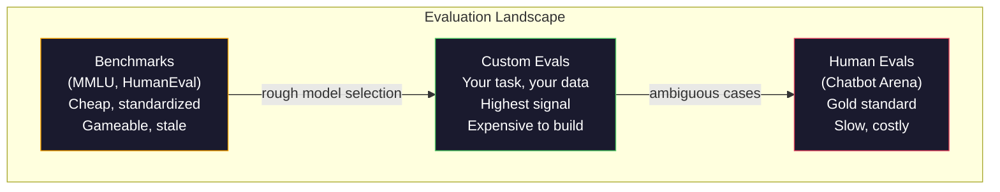
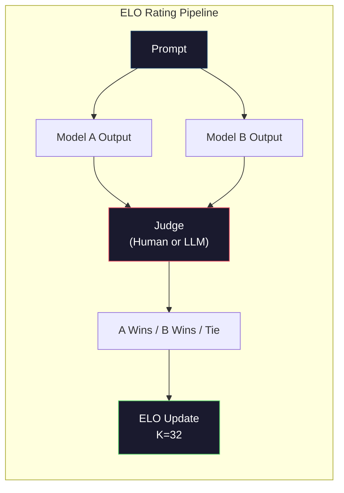

# Ewaluacja: Benchmarki, Ewaluacje, Uprząż LM

> Prawo Goodharta: gdy miara staje się celem, przestaje być dobrą miarą. Każde laboratorium graniczne gra na benchmarkach. Wyniki MMLU rosną, podczas gdy modele wciąż nie potrafią niezawodnie policzyć liczby R w "strawberry." Jedyna ewaluacja, która ma znaczenie, to TWOJA ewaluacja -- na TWOIM zadaniu, z TWOIMI danymi.

**Type:** Build
**Languages:** Python
**Prerequisites:** Phase 10, Lessons 01-05 (LLMs from Scratch)
**Time:** ~90 minutes

## Learning Objectives

- Zbudować własną uprząż ewaluacyjną, która uruchamia benchmarki wielokrotnego wyboru i otwarte przeciw modelowi językowemu
- Wyjaśnić, dlaczego standardowe benchmarki (MMLU, HumanEval) ulegają nasyceniu i przestają różnicować modele graniczne
- Zaimplementować ewaluacje specyficzne dla zadania z odpowiednimi metrykami: dokładne dopasowanie, F1, BLEU i scoring LLM-jako-sędzia
- Zaprojektować niestandardowy zestaw ewaluacyjny celujący w konkretny przypadek użycia, zamiast polegać wyłącznie na publicznych rankingach

## The Problem

MMLU został opublikowany w 2020 z 15 908 pytaniami z 57 przedmiotów. W ciągu trzech lat modele graniczne go nasyciły. GPT-4 osiągnął 86,4%. Claude 3 Opus osiągnął 86,8%. Llama 3 405B osiągnęła 88,6%. Ranking skompresował się do zakresu 3 punktów, gdzie różnice są szumem statystycznym, a nie rzeczywistymi lukami w możliwościach.

Tymczasem te same modele zawodzą przy zadaniach, które 10-latek rozwiązuje bez myślenia. Claude 3.5 Sonnet, osiągając 88,7% na MMLU, początkowo nie potrafił policzyć liter w "strawberry" -- zadaniu wymagającym zerowej wiedzy o świecie i zerowego rozumowania, tylko iteracji na poziomie znaków. HumanEval testuje generowanie kodu za pomocą 164 problemów. Modele osiągają 90%+ na nim, wciąż produkując kod, który się crashuje na przypadkach brzegowych, które każdy młodszy programista by wychwycił.

Luka między wydajnością na benchmarkach a rzeczywistą niezawodnością jest centralnym problemem ewaluacji LLM. Benchmarki mówią ci, jak model radzi sobie na benchmarku. Mówią ci prawie nic o tym, jak ten model będzie działał na twoim konkretnym zadaniu, z twoimi konkretnymi danymi, w twoich konkretnych trybach awarii. Jeśli budujesz bota obsługi klienta, MMLU jest nieistotne. Jeśli budujesz asystenta kodowania, HumanEval obejmuje tylko generowanie na poziomie funkcji -- nie mówi nic o debugowaniu, refaktoryzacji czy wyjaśnianiu kodu między plikami.

Potrzebujesz niestandardowych ewaluacji. Nie dlatego, że benchmarki są bezużyteczne -- są przydatne do wstępnego wyboru modelu -- ale dlatego, że końcowa ewaluacja musi dokładnie odpowiadać twoim warunkom wdrożenia.

## The Concept

### Krajobraz Ewaluacji

Istnieją trzy kategorie ewaluacji, każda o innym koszcie i jakości sygnału.

**Benchmarki** to standaryzowane zestawy testów. MMLU, HumanEval, SWE-bench, MATH, ARC, HellaSwag. Uruchamiasz model na benchmarku i dostajesz wynik. Zaleta: wszyscy używają tego samego testu, więc możesz porównywać modele. Wada: modele i dane treningowe coraz bardziej zanieczyszczają te benchmarki. Laboratoria trenują na danych zawierających pytania z benchmarków. Wyniki rosną. Możliwości mogą nie.

**Niestandardowe ewaluacje** to zestawy testów, które budujesz dla swojego konkretnego przypadku użycia. Definiujesz wejścia, oczekiwane wyjścia i funkcję scoringową. Podsumowujący dokumenty prawne jest oceniany na dokumentach prawnych. Generator SQL jest oceniany na twoim schemacie bazy danych. Są one drogie w tworzeniu, ale są jedyną ewaluacją, która przewiduje wydajność produkcyjną.

**Ewaluacje ludzkie** używają płatnych annotatorów do oceny wyników modelu według kryteriów takich jak pomocność, poprawność, płynność i bezpieczeństwo. Złoty standard dla zadań otwartych, gdzie automatyczne scoringowanie zawodzi. Chatbot Arena zebrała ponad 2 miliony głosów preferencji ludzkich dla 100+ modeli. Minus: koszt ($0,10-$2,00 za osąd) i szybkość (godziny do dni).



### Dlaczego Benchmarki się Psują

Trzy mechanizmy powodują, że wyniki benchmarków przestają odzwierciedlać rzeczywiste możliwości.

**Zanieczyszczenie danych.** Korpusy treningowe skrapują internet. Pytania benchmarkowe żyją w internecie. Modele widzą odpowiedzi podczas treningu. To nie jest oszustwo w tradycyjnym sensie -- laboratoria nie umieszczają celowo danych benchmarkowych. Ale skrapowanie na skalę internetu sprawia, że prawie niemożliwe jest ich wykluczenie.

**Nauczanie pod test.** Laboratoria optymalizują mieszanki treningowe pod kątem wydajności na benchmarkach. Jeśli 5% mieszanki treningowej to pytania wielokrotnego wyboru w stylu MMLU, model uczy się formatu i dystrybucji odpowiedzi. MMLU to wielokrotny wybór z 4 opcjami. Modele uczą się, że dystrybucja odpowiedzi jest w przybliżeniu równomierna między A/B/C/D, co pomaga nawet gdy model nie zna odpowiedzi.

**Nasycenie.** Gdy każdy model graniczny osiąga 85-90% na benchmarku, benchmark przestaje dyskryminować. Pozostałe 10-15% pytań może być niejednoznacznych, błędnie oznaczonych lub wymagać obscurnej wiedzy domenowej. Poprawa z 87% do 89% na MMLU może oznaczać, że model zapamiętał dwa bardziej obscurne pytania, a nie że stał się mądrzejszy.

### Perplexity: Szybkie Badanie Stanu

Perplexity mierzy, jak bardzo model jest zaskoczony sekwencją tokenów. Formalnie jest to wyeksponencjonowana średnia ujemnego logarytmu wiarogodności:

```
PPL = exp(-1/N * sum(log P(token_i | context)))
```

Perplexity równe 10 oznacza, że model jest średnio tak samo niepewny, jak wybór równomiernie spośród 10 opcji na każdej pozycji tokena. Niższe jest lepsze. GPT-2 osiąga perplexity ~30 na WikiText-103. GPT-3 osiąga ~20. Llama 3 8B osiąga ~7.

Perplexity jest przydatne do porównywania modeli na tym samym zestawie testowym, ale ma martwe punkty. Model może mieć niskie perplexity, będąc dobrym w przewidywaniu powszechnych wzorców, będąc jednocześnie okropnym w rzadkich, ale ważnych wzorcach. Nie mówi też nic o podążaniu za instrukcjami, rozumowaniu czy dokładności faktycznej. Używaj go jako badania stanu, a nie ostatecznego werdyktu.

### LLM-jako-Sędzia

Użyj silnego modelu do oceny wyników słabszego modelu. Pomysł jest prosty: poproś GPT-4o lub Claude Sonnet o ocenę odpowiedzi w skali 1-5 za poprawność, pomocność i bezpieczeństwo. Kosztuje to około $0,01 za osąd z GPT-4o-mini i koreluje zaskakująco dobrze z ludzkimi osądami -- około 80% zgodności w większości zadań.

Prompt scoringowy ma większe znaczenie niż model. Niejasny prompt ("Oceń tę odpowiedź") produkuje zaszumione wyniki. Ustrukturyzowany prompt z rubryką ("Ocena 5, jeśli odpowiedź jest faktycznie poprawna i cytuje źródło, 4, jeśli poprawna, ale bez źródła, 3, jeśli częściowo poprawna...") produkuje spójne, powtarzalne wyniki.

Tryby awarii: modele sędziowskie wykazują błąd pozycji (preferują pierwszą odpowiedź w porównaniach parami), błąd gadatliwości (preferują dłuższe odpowiedzi) i samopreferencję (GPT-4 ocenia wyniki GPT-4 wyżej niż odpowiedniki Claude). Łagodzenie: losowa kolejność, normalizacja długości, używanie innego sędziego ni�� oceniany model.

### Oceny ELO z Porównań Parami

Podejście Chatbot Arena. Pokaż dwie odpowiedzi na ten sam prompt z różnych modeli. Człowiek (lub sędzia LLM) wybiera lepszą. Z tysięcy tych porównań oblicz ocenę ELO dla każdego modelu -- ten sam system używany w szachach.

Zalety ELO: ranking względny jest bardziej wiarygodny niż scoring bezwzględny, elegancko obsługuje remisy i zbiega się z mniejszą liczbą porównań niż scoring każdego wyniku niezależnie. Na początku 2026 ranking Chatbot Arena pokazuje GPT-4o, Claude 3.5 Sonnet i Gemini 1.5 Pro w odległości 20 punktów ELO od siebie na szczycie.



### Frameworki Ewaluacyjne

**lm-evaluation-harness** (EleutherAI): standardowy framework ewaluacyjny open-source. Obsługuje 200+ benchmarków. Uruchom dowolny model Hugging Face przeciw MMLU, HellaSwag, ARC itp. jednym poleceniem. Używany przez Open LLM Leaderboard.

**RAGAS**: framework ewaluacji specyficznie dla potoków RAG. Mierzy wierność (czy odpowiedź pasuje do pobranego kontekstu?), trafność (czy pobrany kontekst jest istotny dla pytania?) i poprawność odpowiedzi.

**promptfoo**: ewaluacja sterowana konfiguracją dla inżynierii promptów. Zdefiniuj przypadki testowe w YAML, uruchom na wielu modelach, otrzymaj raport zaliczenia/niezaliczenia. Przydatne do testów regresyjnych promptów -- upewnij się, że zmiana promptu nie psuje istniejących przypadków testowych.

### Budowanie Niestandardowych Ewaluacji

Jedyna ewaluacja, która ma znaczenie dla produkcji. Proces:

1. **Zdefiniuj zadanie.** Co dokładnie model powinien robić? Bądź precyzyjny. "Odpowiadaj na pytania" jest zbyt niejasne. "Biorąc pod uwagę e-mail ze skargą klienta, wyodrębnij nazwę produktu, kategorię problemu i sentyment" to zadanie, które możesz ewaluować.

2. **Stwórz przypadki testowe.** Minimum 50 dla prototypowej ewaluacji, 200+ dla produkcji. Każdy przypadek testowy to para (wejście, oczekiwane_wyjście). Uwzględnij przypadki brzegowe: puste wejścia, wejścia adversarialne, niejednoznaczne wejścia, wejścia w innych językach.

3. **Zdefiniuj scoring.** Dokładne dopasowanie dla strukturalnych wyników. BLEU/ROUGE dla podobieństwa tekstu. LLM-jako-sędzia dla otwartej jakości. F1 dla zadań ekstrakcji. Połącz wiele metryk z wagami.

4. **Automatyzuj.** Każda ewaluacja uruchamia się jednym poleceniem. Żadnych ręcznych kroków. Przechowuj wyniki w formacie umożliwiającym porównanie w czasie.

5. **Śledź w czasie.** Wynik ewaluacji jest bez znaczenia w izolacji. Potrzebujesz linii trendu. Czy wynik poprawił się po ostatniej zmianie promptu? Czy uległ regresji po zmianie modeli? Wersjonuj swoją ewaluację wraz z promptami.

| Typ Ewaluacji | Koszt za osąd | Zgodność z ludźmi | Najlepsze dla |
|-----------|------------------|----------------------|----------|
| Dokładne dopasowanie | ~$0 | 100% (gdy stosowne) | Strukturalne wyjście, klasyfikacja |
| BLEU/ROUGE | ~$0 | ~60% | Tłumaczenie, podsumowywanie |
| LLM-jako-sędzia | ~$0.01 | ~80% | Otwarta generacja |
| Ewaluacja ludzka | $0.10-$2.00 | N/A (jest prawdą podstawową) | Niejednoznaczne, wysokiego ryzyka zadania |

```figure
perplexity-loss
```

## Build It

### Krok 1: Minimalny Framework Ewaluacyjny

Zdefiniuj podstawowe abstrakcje. Przypadek ewaluacyjny ma wejście, oczekiwane wyjście i opcjonalny słownik metadanych. Skorer przyjmuje predykcję i referencję i zwraca wynik między 0 a 1.

```python
import json
from collections import Counter

class EvalCase:
    def __init__(self, input_text, expected, metadata=None):
        self.input_text = input_text
        self.expected = expected
        self.metadata = metadata or {}

class EvalSuite:
    def __init__(self, name, cases, scorers):
        self.name = name
        self.cases = cases
        self.scorers = scorers

    def run(self, model_fn):
        results = []
        for case in self.cases:
            prediction = model_fn(case.input_text)
            scores = {}
            for scorer_name, scorer_fn in self.scorers.items():
                scores[scorer_name] = scorer_fn(prediction, case.expected)
            results.append({
                "input": case.input_text,
                "expected": case.expected,
                "prediction": prediction,
                "scores": scores,
            })
        return results
```

### Krok 2: Funkcje Scoringowe

Zbuduj dokładne dopasowanie, F1 na tokenach i symulowany skorer LLM-jako-sędzia.

```python
def exact_match(prediction, expected):
    return 1.0 if prediction.strip().lower() == expected.strip().lower() else 0.0

def token_f1(prediction, expected):
    pred_tokens = set(prediction.lower().split())
    exp_tokens = set(expected.lower().split())
    if not pred_tokens or not exp_tokens:
        return 0.0
    common = pred_tokens & exp_tokens
    precision = len(common) / len(pred_tokens)
    recall = len(common) / len(exp_tokens)
    if precision + recall == 0:
        return 0.0
    return 2 * (precision * recall) / (precision + recall)

def llm_judge_simulated(prediction, expected):
    pred_words = set(prediction.lower().split())
    exp_words = set(expected.lower().split())
    if not exp_words:
        return 0.0
    overlap = len(pred_words & exp_words) / len(exp_words)
    length_penalty = min(1.0, len(prediction) / max(len(expected), 1))
    return round(overlap * 0.7 + length_penalty * 0.3, 3)
```

### Krok 3: System Oceny ELO

Zaimplementuj porównania parami z aktualizacjami ELO. To jest dokładnie system, którego Chatbot Arena używa do rankowania modeli.

```python
class ELOTracker:
    def __init__(self, k=32, initial_rating=1500):
        self.ratings = {}
        self.k = k
        self.initial_rating = initial_rating
        self.history = []

    def _ensure_player(self, name):
        if name not in self.ratings:
            self.ratings[name] = self.initial_rating

    def expected_score(self, rating_a, rating_b):
        return 1 / (1 + 10 ** ((rating_b - rating_a) / 400))

    def record_match(self, player_a, player_b, outcome):
        self._ensure_player(player_a)
        self._ensure_player(player_b)

        ea = self.expected_score(self.ratings[player_a], self.ratings[player_b])
        eb = 1 - ea

        if outcome == "a":
            sa, sb = 1.0, 0.0
        elif outcome == "b":
            sa, sb = 0.0, 1.0
        else:
            sa, sb = 0.5, 0.5

        self.ratings[player_a] += self.k * (sa - ea)
        self.ratings[player_b] += self.k * (sb - eb)

        self.history.append({
            "a": player_a, "b": player_b,
            "outcome": outcome,
            "rating_a": round(self.ratings[player_a], 1),
            "rating_b": round(self.ratings[player_b], 1),
        })

    def leaderboard(self):
        return sorted(self.ratings.items(), key=lambda x: -x[1])
```

### Krok 4: Obliczanie Perplexity

Oblicz perplexity używając prawdopodobieństw tokenów. W praktyce dostałbyś je z logitów modelu. Tutaj symulujemy z rozkładem prawdopodobieństwa.

```python
import numpy as np

def perplexity(log_probs):
    if not log_probs:
        return float("inf")
    avg_neg_log_prob = -np.mean(log_probs)
    return float(np.exp(avg_neg_log_prob))

def token_log_probs_simulated(text, model_quality=0.8):
    np.random.seed(hash(text) % 2**31)
    tokens = text.split()
    log_probs = []
    for i, token in enumerate(tokens):
        base_prob = model_quality
        if len(token) > 8:
            base_prob *= 0.6
        if i == 0:
            base_prob *= 0.7
        prob = np.clip(base_prob + np.random.normal(0, 0.1), 0.01, 0.99)
        log_probs.append(float(np.log(prob)))
    return log_probs
```

### Krok 5: Agregacja Wyników

Oblicz statystyki podsumowujące z przebiegu ewaluacji: średnia, mediana, wskaźnik zdawalności przy progu i podział na metryki.

```python
def summarize_results(results, threshold=0.8):
    all_scores = {}
    for r in results:
        for metric, score in r["scores"].items():
            all_scores.setdefault(metric, []).append(score)

    summary = {}
    for metric, scores in all_scores.items():
        arr = np.array(scores)
        summary[metric] = {
            "mean": round(float(np.mean(arr)), 3),
            "median": round(float(np.median(arr)), 3),
            "std": round(float(np.std(arr)), 3),
            "min": round(float(np.min(arr)), 3),
            "max": round(float(np.max(arr)), 3),
            "pass_rate": round(float(np.mean(arr >= threshold)), 3),
            "n": len(scores),
        }
    return summary

def print_summary(summary, suite_name="Eval"):
    print(f"\n{'=' * 60}")
    print(f"  {suite_name} Summary")
    print(f"{'=' * 60}")
    for metric, stats in summary.items():
        print(f"\n  {metric}:")
        print(f"    Mean:      {stats['mean']:.3f}")
        print(f"    Median:    {stats['median']:.3f}")
        print(f"    Std:       {stats['std']:.3f}")
        print(f"    Range:     [{stats['min']:.3f}, {stats['max']:.3f}]")
        print(f"    Pass rate: {stats['pass_rate']:.1%} (threshold >= 0.8)")
        print(f"    N:         {stats['n']}")
```

### Krok 6: Uruchom Pełny Potok

Połącz wszystko. Zdefiniuj zadanie, stwórz przypadki testowe, symuluj dwa modele, uruchom ewaluacje, oblicz ELO z porównań parami i wydrukuj ranking.

```python
def demo_model_good(prompt):
    responses = {
        "What is the capital of France?": "Paris",
        "What is 2 + 2?": "4",
        "Who wrote Hamlet?": "William Shakespeare",
        "What language is PyTorch written in?": "Python and C++",
        "What is the boiling point of water?": "100 degrees Celsius",
    }
    return responses.get(prompt, "I don't know")

def demo_model_bad(prompt):
    responses = {
        "What is the capital of France?": "Paris is the capital city of France",
        "What is 2 + 2?": "The answer is four",
        "Who wrote Hamlet?": "Shakespeare",
        "What language is PyTorch written in?": "Python",
        "What is the boiling point of water?": "212 Fahrenheit",
    }
    return responses.get(prompt, "Unknown")

cases = [
    EvalCase("What is the capital of France?", "Paris"),
    EvalCase("What is 2 + 2?", "4"),
    EvalCase("Who wrote Hamlet?", "William Shakespeare"),
    EvalCase("What language is PyTorch written in?", "Python and C++"),
    EvalCase("What is the boiling point of water?", "100 degrees Celsius"),
]

suite = EvalSuite(
    name="General Knowledge",
    cases=cases,
    scorers={
        "exact_match": exact_match,
        "token_f1": token_f1,
        "llm_judge": llm_judge_simulated,
    },
)

results_good = suite.run(demo_model_good)
results_bad = suite.run(demo_model_bad)

print_summary(summarize_results(results_good), "Model A (concise)")
print_summary(summarize_results(results_bad), "Model B (verbose)")
```

" Dobry" model daje dokładne odpowiedzi. "Zły" model daje rozwlekłe parafrazy. Dokładne dopasowanie karze rozwlekły model surowo. F1 na tokenach i LLM-jako-sędzia są bardziej wyrozumiałe. To ilustruje, dlaczego wybór metryki ma znaczenie: ten sam model wygląda świetnie lub okropnie w zależności od tego, jak go oceniasz.

### Krok 7: Turniej ELO

Uruchom porównania parami między modelami w wielu rundach.

```python
elo = ELOTracker(k=32)

for case in cases:
    pred_a = demo_model_good(case.input_text)
    pred_b = demo_model_bad(case.input_text)

    score_a = token_f1(pred_a, case.expected)
    score_b = token_f1(pred_b, case.expected)

    if score_a > score_b:
        outcome = "a"
    elif score_b > score_a:
        outcome = "b"
    else:
        outcome = "tie"

    elo.record_match("model_a_concise", "model_b_verbose", outcome)

print("\nELO Leaderboard:")
for name, rating in elo.leaderboard():
    print(f"  {name}: {rating:.0f}")
```

### Krok 8: Porównanie Perplexity

Porównaj perplexity między "modelami" o różnym poziomie jakości.

```python
test_text = "The quick brown fox jumps over the lazy dog in the garden"

for quality, label in [(0.9, "Strong model"), (0.7, "Medium model"), (0.4, "Weak model")]:
    log_probs = token_log_probs_simulated(test_text, model_quality=quality)
    ppl = perplexity(log_probs)
    print(f"  {label} (quality={quality}): perplexity = {ppl:.2f}")
```

## Use It

### lm-evaluation-harness (EleutherAI)

Standardowe narzędzie do uruchamiania benchmarków na dowolnym modelu.

```python
# pip install lm-eval
# Command line:
# lm_eval --model hf --model_args pretrained=meta-llama/Llama-3.1-8B --tasks mmlu --batch_size 8

# Python API:
# import lm_eval
# results = lm_eval.simple_evaluate(
#     model="hf",
#     model_args="pretrained=meta-llama/Llama-3.1-8B",
#     tasks=["mmlu", "hellaswag", "arc_easy"],
#     batch_size=8,
# )
# print(results["results"])
```

### promptfoo

Ewaluacja sterowana konfiguracją dla inżynierii promptów. Zdefiniuj testy w YAML i uruchom na wielu dostawcach.

```yaml
# promptfoo.yaml
providers:
  - openai:gpt-4o-mini
  - anthropic:claude-3-haiku

prompts:
  - "Answer in one word: {{question}}"

tests:
  - vars:
      question: "What is the capital of France?"
    assert:
      - type: contains
        value: "Paris"
  - vars:
      question: "What is 2 + 2?"
    assert:
      - type: equals
        value: "4"
```

### RAGAS dla ewaluacji RAG

```python
# pip install ragas
# from ragas import evaluate
# from ragas.metrics import faithfulness, answer_relevancy, context_precision
#
# result = evaluate(
#     dataset,
#     metrics=[faithfulness, answer_relevancy, context_precision],
# )
# print(result)
```

RAGAS mierzy to, czego ogólne ewaluacje nie łapią: czy odpowiedź modelu jest ugruntowana w pobranym kontekście, a nie tylko czy odpowiedź jest "poprawna" abstrakcyjnie.

## Ship It

Ta lekcja produkuje `outputs/prompt-eval-designer.md` -- wielokrotnego użytku prompt, który projektuje niestandardowe zestawy ewaluacyjne dla dowolnego zadania. Podaj mu opis zadania, a on generuje przypadki testowe, funkcje scoringowe i rekomendację progu zaliczenia/niezaliczenia.

Produkuje też `outputs/skill-llm-evaluation.md` -- ramy decyzyjne do wyboru odpowiedniej strategii ewaluacyjnej w oparciu o typ zadania, budżet i wymagania dotyczące opóźnienia.

## Exercises

1. Dodaj skorer "spójności", który uruchamia to samo wejście przez model 5 razy i mierzy, jak często wyniki są zgodne. Niespójne odpowiedzi na deterministyczne wejścia ujawniają kruche prompty lub wysokie ustawienia temperatury.

2. Rozszerz tracker ELO, aby obsługiwał wiele funkcji sędziowskich (dokładne dopasowanie, F1, LLM-jako-sędzia) i ważył je. Porównaj, jak zmienia się ranking, gdy mocno ważysz dokładne dopasowanie w porównaniu do F1.

3. Zbuduj zestaw ewaluacyjny dla konkretnego zadania: klasyfikacji e-maili do 5 kategorii. Stwórz 100 przypadków testowych z różnorodnymi przykładami, w tym przypadkami brzegowymi (emaile, które mogą należeć do wielu kategorii, puste emaile, emaile w innych językach). Zmierz, jak różne "modele" (regułowe, dopasowanie słów kluczowych, symulowany LLM) sobie radzą.

4. Zaimplementuj wykrywanie zanieczyszczenia: biorąc zbiór pytań ewaluacyjnych i korpus treningowy, sprawdź, jaki procent pytań ewaluacyjnych (lub bliskich parafraz) pojawia się w danych treningowych. W ten sposób badacze audytują ważność benchmarków.

5. Zbuduj narzędzie "diff modelu". Mając wyniki ewaluacji z dwóch wersji modelu, podświetl, które konkretne przypadki testowe uległy poprawie, które uległy regresji, a które pozostały takie same. To jest ewaluacyjny odpowiednik diffa kodu -- niezbędny do zrozumienia, czy zmiana pomogła czy zaszkodziła.

## Key Terms

| Termin | Co ludzie mówią | Co naprawdę oznacza |
|------|----------------|----------------------|
| MMLU | "Ten benchmark" | Massive Multitask Language Understanding -- 15 908 pytań wielokrotnego wyboru z 57 przedmiotów, nasycone powyżej 88% do 2025 |
| HumanEval | "Ewaluacja kodu" | 164 problemy uzupełniania funkcji Pythona od OpenAI, testuje tylko izolowane generowanie funkcji |
| SWE-bench | "Prawdziwa ewaluacja kodowania" | 2 294 zgłoszeń GitHub z 12 repozytoriów Pythona, mierzy kompleksowe naprawianie błędów wraz z generowaniem testów |
| Perplexity | "Jak bardzo model jest zdezorientowany" | exp(-avg(log P(token_i given context))) -- niższe oznacza, że model przypisuje wyższe prawdopodobieństwo rzeczywistym tokenom |
| Ocena ELO | "Szachowy ranking dla modeli" | Względna ocena umiejętności obliczana z rekordów wygranych/przegranych w parach, używana przez Chatbot Arena do rankowania 100+ modeli |
| LLM-jako-sędzia | "Używanie AI do oceny AI" | Silny model ocenia wyniki słabszego modelu względem rubryki, ~80% zgodności z ludzkimi sędziami przy ~$0,01/osąd |
| Zanieczyszczenie danych | "Model widział test" | Dane treningowe zawierają pytania benchmarkowe, zawyżając wyniki bez poprawy rzeczywistych możliwości |
| Zestaw ewaluacyjny | "Kupa testów" | Wersjonowana kolekcja trójek (wejście, oczekiwane_wyjście, skorer), które mierzą konkretną zdolność |
| Wskaźnik zdawalności | "Jaki procent rozwiązuje poprawnie" | Frakcja przypadków ewaluacyjnych powyżej progu -- bardziej użyteczna niż średnia, ponieważ mierzy niezawodność |
| Chatbot Arena | "Strona rankingu modeli" | Platforma LMSYS z 2M+ głosami preferencji ludzkich, produkująca najbardziej zaufany ranking LLM przez oceny ELO |

## Further Reading

- [Hendrycks et al., 2021 -- "Measuring Massive Multitask Language Understanding"](https://arxiv.org/abs/2009.03300) -- the MMLU paper, still the most cited LLM benchmark despite its saturation
- [Chen et al., 2021 -- "Evaluating Large Language Models Trained on Code"](https://arxiv.org/abs/2107.03374) -- the HumanEval paper from OpenAI, established code generation evaluation methodology
- [Zheng et al., 2023 -- "Judging LLM-as-a-Judge"](https://arxiv.org/abs/2306.05685) -- systematic analysis of using LLMs to evaluate LLMs, including position bias and verbosity bias findings
- [LMSYS Chatbot Arena](https://chat.lmsys.org/) -- crowdsourced model comparison platform with 2M+ votes, the most trusted real-world LLM ranking