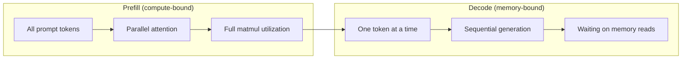
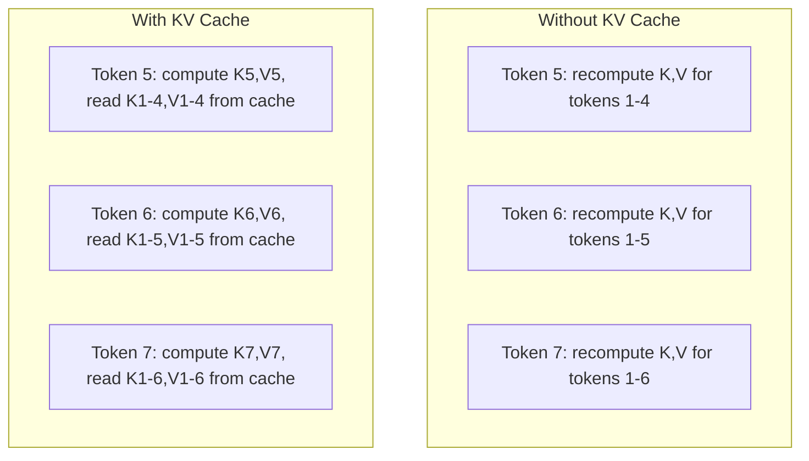
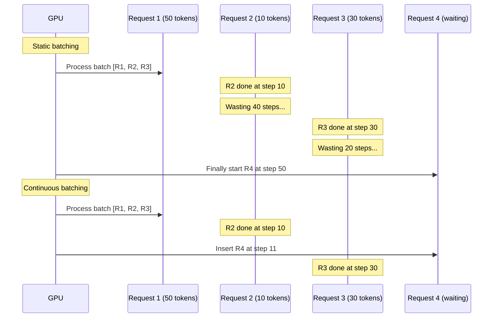
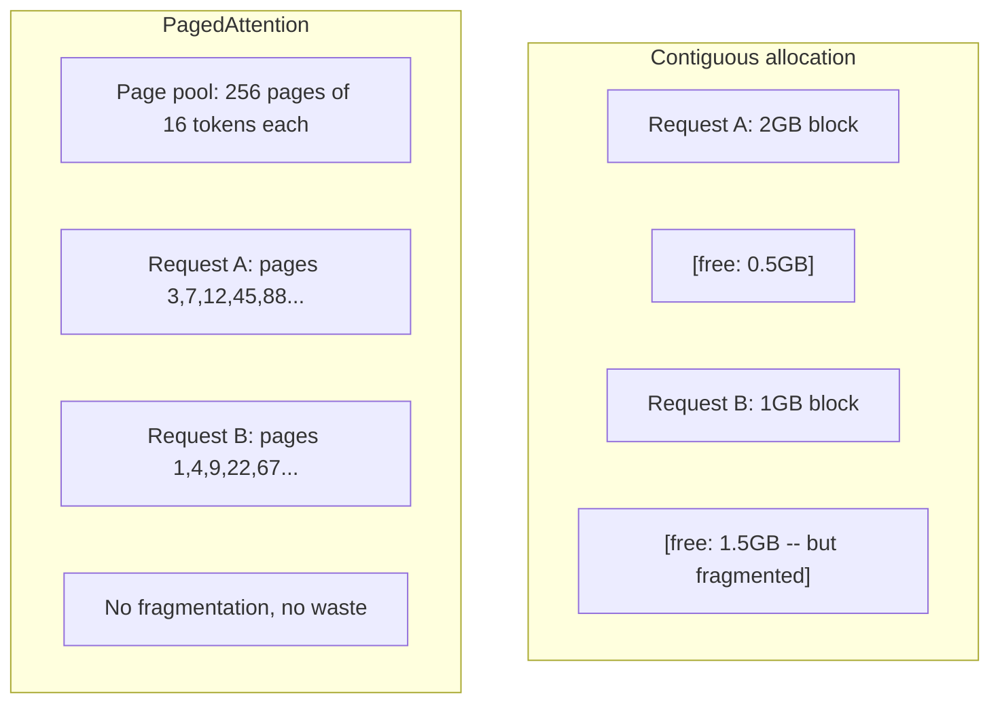
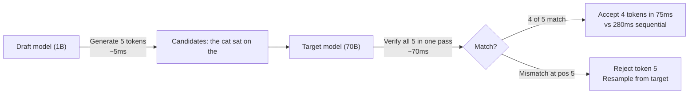

# Optymalizacja Inferencji

> Dwie fazy definiują inferencję LLM. Prefill przetwarza twój prompt równolegle -- związany obliczeniowo. Dekodowanie generuje tokeny jeden po drugim -- związane z pamięcią. Każda optymalizacja celuje w jedną lub obie.

**Type:** Build
**Languages:** Python
**Prerequisites:** Phase 10, Lessons 01-08 (Transformer architecture, attention)
**Time:** ~120 minutes

## Learning Objectives

- Zaimplementować pamięć podręczną KV, aby wyeliminować nadmiarowe obliczenia podczas autregresyjnego generowania tokenów
- Wyjaśnić różnicę między fazami prefill i dekodowania inferencji LLM i dlaczego każda ma inne wąskie gardła (obliczenia vs pamięć)
- Zaimplementować koncepcje ciągłego grupowania i stronicowanej uwagi, aby zmaksymalizować wykorzystanie GPU przy równoczesnych żądaniach
- Porównać techniki optymalizacji inferencji (pamięć podręczna KV, spekulatywne dekodowanie, flash attention) i ich kompromisy przepustowości/opóźnienia

## The Problem

Wdrażasz Llama 3 70B na 4x A100 GPU. Pojedynczy użytkownik dostaje ~50 tokenów na sekundę. Czuje się szybko. Potem 100 użytkowników trafia na endpoint jednocześnie. Przepustowość spada do 3 tokenów/sekundę/użytkownika. Twój rachunek za GPU w wysokości $25 000/miesiąc obsługuje odpowiedzi wolniejsze niż człowiek pisze.

Sam model nie zmienia się między 1 użytkownikiem a 100 użytkownikami. Te same wagi, ta sama architektura, ta sama matematyka. Zmienia się to, jak planujesz pracę. Naiwna inferencja marnuje 90%+ dostępnych mocy obliczeniowych GPU. Użytkownik czekający na token 47 trzyma cały slot grupy otwarty, podczas gdy magistrala pamięci GPU pozostaje bezczynna między mnożeniami macierzy. Tymczasem prompt 2 000 tokenów nowego użytkownika mógłby wypełnić ten martwy czas użytecznym obliczeniem.

To nie jest problem skalowania. To problem planowania. Techniki w tej lekcji -- pamięć podręczna KV, ciągłe grupowanie, stronicowana uwaga, spekulatywne dekodowanie, buforowanie prefiksów -- to to, co odróżnia rachunek za inferencję w wysokości $25k/miesiąc od $5k/miesiąc obsługującego ten sam ruch.

vLLM obsługujące Llama 3 70B na 4xA100-80GB osiąga ~50 tokenów/sekundę/użytkownika przy niskiej współbieżności i utrzymuje 15-25 TPS/użytkownika przy 100 równoczesnych żądaniach dzięki ciągłemu grupowaniu i stronicowanej uwadze. Bez tych optymalizacji ten sam sprzęt obsługuje 5 TPS/użytkownika przy tej współbieżności. Te same GPU, ten sam model, 4x przepustowość.

## The Concept

### Prefill vs Dekodowanie

Każde żądanie inferencji LLM ma dwie odrębne fazy.

**Prefill** przetwarza cały prompt wejściowy. Wszystkie tokeny są znane, więc uwaga może być obliczona równolegle w całej sekwencji. To jest duże mnożenie macierzy -- rdzenie GPU pozostają zajęte. Wąskim gardłem są obliczenia: ile FLOPS twój sprzęt może dostarczyć na sekundę. A100 robi 312 TFLOPS (BF16). Prefill dla promptu 4 096 tokenów na modelu 70B zajmuje ~400ms na pojedynczym A100.

**Dekodowanie** generuje tokeny wyjściowe jeden po drugim. Każdy nowy token uwzględnia wszystkie poprzednie tokeny, ale tylko jeden token jest produkowany na przejście w przód. Macierze wag są tej samej wielkości co podczas prefillu, ale mnożysz je przez pojedynczy wektor zamiast macierzy. Rdzenie GPU kończą w mikrosekundach, a potem czekają na następną partię wag z pamięci. Wąskim gardłem jest przepustowość pamięci: jak szybko możesz przesyłać wagi modelu z HBM do jednostek obliczeniowych. A100 ma przepustowość 2 TB/s. Model 70B w FP16 to 140 GB. Odczytanie całego modelu raz zajmuje 70ms -- to jest twoje minimum dla pojedynczego kroku dekodowania.



**Współczynnik ops:byte** (zwany też intensywnością arytmetyczną) oddaje ten kompromis. Mierzy, ile operacji wykonujesz na bajt załadowany z pamięci.

```
ops:byte ratio = FLOPs per token / bytes read from memory
```

Podczas prefillu z grupą 4 096 tokenów wykonujesz ~4 096 operacji mnożenia-akumulacji na załadowaną wagę. Współczynnik jest wysoki -- jesteś związany obliczeniowo. Podczas dekodowania z rozmiarem grupy 1 wykonujesz ~1 operację na załadowaną wagę. Współczynnik jest niski -- jesteś związany z pamięcią.

Podstawowy wgląd: *dekodowanie jest związane z pamięcią, ponieważ odczytujesz cały model, aby wyprodukować pojedynczy token*. Każda optymalizacja poniżej albo zmniejsza to, co czytasz, zwiększa partię tokenów przetwarzanych na odczyt, albo całkowicie unika odczytów.

### Pamięć Podręczna KV

Podczas uwagi zapytanie każdego tokena uwzględnia wektory klucza i wartości każdego poprzedniego tokena. Bez buforowania, wygenerowanie tokena N wymaga ponownego obliczenia projekcji klucza i wartości dla wszystkich N-1 poprzedzających tokenów. Token 1 jest projektowany podczas generowania tokena 2, potem znowu dla tokena 3, potem znowu dla tokena 4. Przy tokenie 1 000 projektowałeś token 1 łącznie 999 razy.

Pamięć podręczna KV przechowuje projekcje kluczy i wartości ze wszystkich poprzednich tokenów. Podczas generowania tokena N obliczasz tylko klucz i wartość dla tokena N, a następnie łączysz je z buforowanym K/V z tokenów 1 do N-1.



**Wzór pamięci dla pamięci KV:**

```
KV cache size = 2 * num_layers * num_kv_heads * head_dim * seq_len * bytes_per_param
```

Dla Llama 3 70B (80 warstw, 8 głów KV z GQA, head_dim=128, BF16):

```
per token: 2 * 80 * 8 * 128 * 2 bytes = 327,680 bytes = 320 KB
at 4,096 tokens: 320 KB * 4,096 = 1.28 GB
at 128K tokens: 320 KB * 131,072 = 40 GB
```

Pojedyncza rozmowa z kontekstem 128K dla Llama 3 70B zużywa 40 GB pamięci podręcznej KV -- połowę pamięci A100. Przy 100 równoczesnych użytkownikach po 4K tokenów każdy, sama pamięć KV wymaga 128 GB. Dlatego zarządzanie pamięcią podręczną KV jest centralnym wyzwaniem optymalizacji inferencji.

### Ciągłe Grupowanie

Statyczne grupowanie czeka, aż grupa N żądań nadejdzie, przetwarza je razem i czeka, aż *wszystkie* zakończą, zanim przyjmie nowe żądania. Jeśli jedno żądanie potrzebuje 500 tokenów, a inne 10, krótkie żądanie pozostaje bezczynne przez 490 kroków dekodowania po zakończeniu.

Ciągłe grupowanie (zwane też grupowaniem na poziomie iteracji) wstawia nowe żądania do grupy, gdy tylko któreś z żądań się zakończy. Grupa jest ponownie oceniana na każdym kroku dekodowania. Żądanie, które kończy się po 10 tokenach, jest natychmiast zastępowane przez oczekujące żądanie.



Poprawa przepustowości zależy od tego, jak bardzo długości wyjściowe się różnią. Przy jednolitych długościach, ciągłe grupowanie dorównuje statycznemu. Przy zmiennych długościach (typowy przypadek), ciągłe grupowanie może dostarczyć 2-5x wyższą przepustowość, ponieważ sloty GPU nigdy nie pozostają puste.

### Stronicowana Uwaga (PagedAttention)

Pamięć podręczna KV dla każdego żądania to ciągły blok pamięci. Gdy żądania przychodzą i odchodzą, pamięć ulega fragmentacji -- dokładnie jak fragmentacja RAM w systemach operacyjnych. Żądanie 4K tokenów potrzebuje 1,28 GB ciągłej pamięci. Nawet jeśli masz 2 GB wolnego miejsca, możesz nie mieć 1,28 GB *ciągłego*. Albo marnujesz pamięć, albo odrzucasz żądanie.

Stronicowana uwaga (z vLLM) stosuje pamięć wirtualną w stylu OS do pamięci podręcznej KV. Zamiast alokować jeden ciągły blok na żądanie, alokuje strony o stałym rozmiarze (typowo 16 tokenów każda). Strony mogą być gdziekolwiek w fizycznej pamięci GPU. Tablica stron odwzorowuje logiczne pozycje sekwencji każdego żądania na fizyczne lokalizacje stron.



Stronicowana uwaga umożliwia również **kopiowanie przy zapisie** dla współdzielonych prefiksów. Jeśli 50 żądań dzieli ten sam prompt systemowy, strony pamięci podręcznej KV dla tego promptu są przechowywane raz i odwoływane przez wszystkie 50 żądań. Dopiero gdy żądanie się rozchodzi (różne wiadomości użytkowników), dostaje własne strony. To drastycznie zmniejsza użycie pamięci dla aplikacji ze współdzielonymi promptami systemowymi.

vLLM raportuje prawie zerowe marnotrawstwo pamięci (~4% vs ~60-80% w naiwnej alokacji) dzięki stronicowanej uwadze.

### Spekulatywne Dekodowanie

Dekodowanie jest wolne, ponieważ jest sekwencyjne -- generujesz jeden token, podajesz go z powrotem, generujesz następny. Ale co, jeśli mógłbyś odgadnąć następne 5 tokenów tanio, a potem zweryfikować je wszystkie naraz?

Spekulatywne dekodowanie używa małego, szybkiego **modelu szkicu** do wygenerowania K kandydackich tokenów. Duży **model docelowy** następnie przetwarza wszystkich K kandydatów w pojedynczym przejściu w przód (które wygląda jak prefill -- równoległe, związane obliczeniowo, wydajne). Jeśli model docelowy zgadza się z przewidywaniami modelu szkicu, akceptujesz wszystkie K tokenów w czasie jednego przejścia w przód modelu docelowego. Jeśli nie zgadza się na pozycji j, akceptujesz tokeny 1 do j-1 i odrzucasz resztę.



Przyspieszenie zależy od **wskaźnika akceptacji** -- jak często przewidywania modelu szkicowego pasują do docelowego. Dla Llama 3 8B szkicującego dla Llama 3 70B, wskaźniki akceptacji 70-85% są typowe dla języka naturalnego. To przekłada się na 2-3x przyspieszenie dekodowania.

Trzy podejścia do spekulatywnego dekodowania:

| Metoda | Źródło szkicu | Wskaźnik akceptacji | Narzut |
|--------|-------------|-----------------|----------|
| Draft-target (Leviathan et al.) | Osobny mały model | 70-85% | Pamięć modelu szkicu |
| EAGLE (Li et al.) | Lekka głowa na docelowym | 75-90% | ~1% dodatkowych parametrów |
| Wyszukiwanie N-gramów | Tabela N-gramów tokenów | 40-60% | Pomijalny |

**EAGLE** trenuje małą autregresyjną głowę na wierzchu ukrytych stanów modelu docelowego. Przewiduje embedding następnego tokena przy użyciu cech przedostatniej warstwy modelu docelowego. Ponieważ działa na reprezentacjach samego modelu docelowego (nie osobnego modelu), osiąga wyższe wskaźniki akceptacji przy minimalnej dodatkowej pamięci. EAGLE-2 dodaje dynamiczne drzewo szkicu, które dostosowuje liczbę kandydatów na podstawie kontekstu.

**Spekulatywne dekodowanie N-gramów** utrzymuje tabelę kontynuacji N-gramów z bieżącego kontekstu lub prezbudowanego korpusu. Jeśli szkic pasuje do tego, co pojawiło się wcześniej w tej samej rozmowie (powtarzające się wzorce, kod, strukturalne wyjście), działa z zerowym narzutem sieci neuronowej. Wskaźniki akceptacji są niższe średnio, ale koszt na spekulację jest zasadniczo darmowy.

Spekulatywne dekodowanie jest *matematycznie dokładne* -- dystrybucja wyjściowa jest identyczna z dystrybucją modelu docelowego. Nie jest przybliżeniem. Krok weryfikacji zapewnia, że każdy zaakceptowany token ma dokładnie takie prawdopodobieństwo, jakie przypisałby model docelowy.

### Buforowanie Prefiksów

Wiele żądań dzieli ten sam prefiks. Prompt systemowy bota czatu. Blok kontekstu RAG. Zestaw przykładów few-shot. Bez buforowania prefiksów każde żądanie ponownie oblicza pamięć podręczną KV dla tych współdzielonych tokenów od zera.

Buforowanie prefiksów przechowuje pamięć podręczną KV dla wspólnych prefiksów i ponownie je wykorzystuje między żądaniami. Gdy nadejdzie nowe żądanie ze znanym prefiksem, system kopiuje (lub odwołuje się do) buforowanych wpisów KV i oblicza tylko KV dla unikalnego przyrostka.

Dla promptu systemowego 2 000 tokenów współdzielonego przez wszystkie żądania, buforowanie prefiksów eliminuje ~400ms prefillu na żądanie. Przy 100 żądaniach/sekundę oszczędza to 40 sekund obliczeń GPU na sekundę -- więcej niż wartość jednego GPU.

RadixAttention SGLang implementuje buforowanie prefiksów z drzewem radix (trie), które indeksuje prefiksy według ich zawartości tokenów. Każde żądanie pasujące do przechowywanego prefiksu dostaje pamięć KV za darmo. Drzewo umożliwia częściowe dopasowanie prefiksów -- jeśli dzielisz 1 500 z 2 000 tokenów prefiksu z buforowanym wpisem, wykorzystujesz je ponownie i przeliczasz tylko 500.

### Silniki Inferencji

Trzy silniki dominują w produkcyjnym serwowaniu LLM:

| Silnik | Kluczowa innowacja | Najlepsze dla |
|--------|---------------|----------|
| vLLM | Stronicowana uwaga, ciągłe grupowanie | Ogólne serwowanie, najwyższa kompatybilność |
| SGLang | RadixAttention (buforowanie prefiksów), strukturalna generacja | Boty wieloobrotowe, ograniczone dekodowanie |
| TensorRT-LLM | Fuzja kernelek NVIDIA, kwantyzacja FP8 | Maksymalna przepustowość na jednym GPU na sprzęcie NVIDIA |

**vLLM** jest domyślnym punktem startowym. Obsługuje najszerszy zakres modeli, działa na dowolnym dostawcy GPU (NVIDIA, AMD, Intel) i osiąga silną przepustowość dzięki stronicowanej uwadze + ciągłemu grupowaniu. Zgodne z OpenAI API oznacza, że możesz go wrzucić jako zamiennik dowolnego wywołania API OpenAI.

**SGLang** buduje na tych samych fundamentach co vLLM, ale dodaje RadixAttention do buforowania prefiksów i język specyficzny dla domeny dla strukturalnych programów LLM. Jeśli twoje obciążenie obejmuje rozmowy wieloobrotowe, użycie narzędzi lub ograniczone dekodowanie (wyjście JSON, generowanie sterowane regex), SGLang często przewyższa vLLM 2-5x dzięki ponownemu wykorzystaniu prefiksów.

**TensorRT-LLM** kompiluje modele do zoptymalizowanych kernelek GPU NVIDIA. Łączy operacje (uwaga + liniowa + aktywacja w jednym kernelu), używa FP8 na kartach H100 i integruje się z NVIDIA Triton Inference Server do wdrożenia produkcyjnego. Osiąga najwyższą przepustowość na jednym GPU na sprzęcie NVIDIA, ale wymaga więcej konfiguracji i działa tylko na GPU NVIDIA.

Rzeczywiste liczby dla Llama 3 70B (4xA100-80GB, BF16):

| Metryka | vLLM | SGLang | TensorRT-LLM |
|--------|------|--------|---------------|
| Przepustowość (1 użytkownik) | ~50 TPS | ~55 TPS | ~65 TPS |
| Przepustowość (100 użytkowników) | ~2 500 łącznych TPS | ~3 200 łącznych TPS | ~3 000 łącznych TPS |
| Czas do pierwszego tokena | ~400ms | ~300ms (trafienie prefiksu) | ~350ms |
| Maksymalny kontekst | 128K | 128K | 128K |

### Framework Ops:Byte

Nie możesz optymalizować tego, czego nie mierzysz. Współczynnik ops:byte mówi ci, czy jesteś związany obliczeniowo, czy z pamięcią, co określa, które optymalizacje mają znaczenie.

```
Compute roof: peak FLOPS of the GPU
Memory roof:  peak bandwidth * ops:byte ratio
```

Gdy ops:byte jest niski (dekodowanie, małe grupy), uderzasz w sufit przepustowości pamięci. Dodawanie większej mocy obliczeniowej (wyższy zegar, więcej rdzeni) nie pomaga. Musisz zmniejszyć odczyty pamięci (kwantyzacja, kompresja pamięci KV) lub zwiększyć rozmiar grupy, aby amortyzować odczyty na więcej użytecznej pracy.

Gdy ops:byte jest wysoki (prefill, duże grupy), uderzasz w sufit obliczeniowy. Optymalizacja przepustowości pamięci nie pomaga. Potrzebujesz szybszych GPU, fuzji kernelek lub zredukowanej precyzji, aby wycisnąć więcej FLOPS.

| Scenariusz | ops:byte | Ograniczenie | Optymalizuj z |
|----------|----------|-------|---------------|
| Prefill, grupa=1 | ~4 096 | Obliczenia | Fuzja kernelek, FP8 |
| Dekodowanie, grupa=1 | ~1 | Pamięć | Kwantyzacja, kompresja KV |
| Dekodowanie, grupa=32 | ~32 | Pamięć | Większa grupa, ciągłe grupowanie |
| Dekodowanie, grupa=256 | ~256 | Przejściowy | Oba mają znaczenie |
| Dekodowanie, grupa=1024 | ~1 024 | Obliczenia | Fuzja kernelek, równoległość tensorów |

Punkt przecięcia na A100 to około ops:byte = 156 (312 TFLOPS / 2 TB/s). Poniżej 156 jesteś związany z pamięcią. Powyżej 156 jesteś związany obliczeniowo. Ciągłe grupowanie popycha dekodowanie w kierunku tego przecięcia, pakując więcej tokenów na iterację.

```figure
context-window-slide
```

## Build It

### Krok 1: Pamięć Podręczna KV od Zera

Budujemy wielogłowicową pamięć podręczną KV, która przechowuje projekcje klucza i wartości na warstwę, na głowę i demonstruje wzorzec wzrostu pamięci.

```python
import numpy as np

class KVCache:
    def __init__(self, num_layers, num_heads, head_dim, max_seq_len, dtype=np.float16):
        self.num_layers = num_layers
        self.num_heads = num_heads
        self.head_dim = head_dim
        self.max_seq_len = max_seq_len
        self.dtype = dtype

        self.k_cache = np.zeros(
            (num_layers, num_heads, max_seq_len, head_dim), dtype=dtype
        )
        self.v_cache = np.zeros(
            (num_layers, num_heads, max_seq_len, head_dim), dtype=dtype
        )
        self.seq_len = 0

    def update(self, layer_idx, new_keys, new_values):
        num_new = new_keys.shape[1]
        end = self.seq_len + num_new
        self.k_cache[layer_idx, :, self.seq_len:end, :] = new_keys
        self.v_cache[layer_idx, :, self.seq_len:end, :] = new_values
        return (
            self.k_cache[layer_idx, :, :end, :],
            self.v_cache[layer_idx, :, :end, :]
        )

    def advance(self, num_tokens):
        self.seq_len += num_tokens

    def memory_bytes(self):
        return self.k_cache.nbytes + self.v_cache.nbytes

    def used_bytes(self):
        per_token = 2 * self.num_layers * self.num_heads * self.head_dim * np.dtype(self.dtype).itemsize
        return per_token * self.seq_len
```

### Krok 2: Uwaga z Pamięcią Podręczną KV

Uproszczona wielogłowicowa uwaga, która używa pamięci podręcznej KV dla kroków dekodowania.

```python
def scaled_dot_product_attention(query, keys, values):
    head_dim = query.shape[-1]
    scores = np.matmul(query, keys.transpose(0, 1, 3, 2)) / np.sqrt(head_dim)
    seq_len_q = scores.shape[-2]
    seq_len_k = scores.shape[-1]
    if seq_len_q > 1:
        mask = np.triu(np.ones((seq_len_q, seq_len_k), dtype=np.float32), k=seq_len_k - seq_len_q + 1)
        scores = scores + mask * (-1e9)
    max_scores = np.max(scores, axis=-1, keepdims=True)
    exp_scores = np.exp(scores - max_scores)
    attn_weights = exp_scores / np.sum(exp_scores, axis=-1, keepdims=True)
    return np.matmul(attn_weights, values)


class MultiHeadAttention:
    def __init__(self, d_model, num_heads):
        self.num_heads = num_heads
        self.head_dim = d_model // num_heads
        scale = np.sqrt(2.0 / d_model)
        self.W_q = np.random.randn(d_model, d_model).astype(np.float32) * scale
        self.W_k = np.random.randn(d_model, d_model).astype(np.float32) * scale
        self.W_v = np.random.randn(d_model, d_model).astype(np.float32) * scale
        self.W_o = np.random.randn(d_model, d_model).astype(np.float32) * scale

    def forward(self, x, kv_cache=None, layer_idx=0):
        batch, seq_len, d_model = x.shape
        Q = np.matmul(x, self.W_q).reshape(batch, seq_len, self.num_heads, self.head_dim).transpose(0, 2, 1, 3)
        K = np.matmul(x, self.W_k).reshape(batch, seq_len, self.num_heads, self.head_dim).transpose(0, 2, 1, 3)
        V = np.matmul(x, self.W_v).reshape(batch, seq_len, self.num_heads, self.head_dim).transpose(0, 2, 1, 3)

        if kv_cache is not None:
            K_full, V_full = kv_cache.update(layer_idx, K[0], V[0])
            K = K_full[np.newaxis, :, :, :]
            V = V_full[np.newaxis, :, :, :]
            if seq_len == 1:
                kv_cache.advance(1)

        attn_out = scaled_dot_product_attention(Q, K, V)
        attn_out = attn_out.transpose(0, 2, 1, 3).reshape(batch, -1, d_model)
        return np.matmul(attn_out, self.W_o)
```

### Krok 3: Symulator Ciągłego Grupowania

To symuluje różnicę w planowaniu między statycznym a ciągłym grupowaniem.

```python
import heapq

class Request:
    def __init__(self, request_id, prompt_tokens, output_tokens, arrival_step):
        self.request_id = request_id
        self.prompt_tokens = prompt_tokens
        self.output_tokens = output_tokens
        self.arrival_step = arrival_step
        self.tokens_generated = 0
        self.start_step = None
        self.end_step = None

    def is_done(self):
        return self.tokens_generated >= self.output_tokens


def simulate_static_batching(requests, batch_size):
    step = 0
    completed = []
    queue = list(requests)
    queue.sort(key=lambda r: r.arrival_step)

    while queue:
        batch = []
        while queue and len(batch) < batch_size:
            r = queue.pop(0)
            r.start_step = max(step, r.arrival_step)
            batch.append(r)

        if batch:
            step = max(step, max(r.start_step for r in batch))
            max_output = max(r.output_tokens for r in batch)
            for r in batch:
                r.tokens_generated = r.output_tokens
                r.end_step = step + max_output
            step += max_output
            completed.extend(batch)

    return completed


def simulate_continuous_batching(requests, batch_size):
    step = 0
    completed = []
    queue = sorted(requests, key=lambda r: r.arrival_step)
    queue_idx = 0
    active = []
    waiting = []

    while queue_idx < len(queue) or active or waiting:
        while queue_idx < len(queue) and queue[queue_idx].arrival_step <= step:
            waiting.append(queue[queue_idx])
            queue_idx += 1

        while waiting and len(active) < batch_size:
            r = waiting.pop(0)
            r.start_step = step
            active.append(r)

        if not active:
            if waiting:
                step += 1
                continue
            elif queue_idx < len(queue):
                step = queue[queue_idx].arrival_step
                continue
            else:
                break

        for r in active:
            r.tokens_generated += 1

        done = [r for r in active if r.is_done()]
        for r in done:
            r.end_step = step + 1
            completed.append(r)
        active = [r for r in active if not r.is_done()]

        step += 1

    return completed


def batching_stats(completed):
    latencies = [r.end_step - r.arrival_step for r in completed]
    total_time = max(r.end_step for r in completed) - min(r.arrival_step for r in completed)
    total_tokens = sum(r.output_tokens for r in completed)
    return {
        "avg_latency": np.mean(latencies),
        "p50_latency": np.median(latencies),
        "p99_latency": np.percentile(latencies, 99),
        "total_time": total_time,
        "throughput": total_tokens / total_time if total_time > 0 else 0,
    }
```

### Krok 4: Bufor Prefiksów

Bufor prefiksów oparty na trie, który przechowuje wpisy KV dla wspólnych prefiksów.

```python
class TrieNode:
    def __init__(self):
        self.children = {}
        self.kv_data = None
        self.hit_count = 0


class PrefixCache:
    def __init__(self, max_entries=1000):
        self.root = TrieNode()
        self.max_entries = max_entries
        self.total_entries = 0
        self.hits = 0
        self.misses = 0

    def _walk(self, token_ids):
        node = self.root
        depth = 0
        for tid in token_ids:
            if tid not in node.children:
                break
            node = node.children[tid]
            depth += 1
        return node, depth

    def lookup(self, token_ids):
        node, depth = self._walk(token_ids)
        if depth > 0:
            self.hits += 1
            current = self.root
            for tid in token_ids[:depth]:
                current = current.children[tid]
                current.hit_count += 1
            kv_entries = []
            current = self.root
            for tid in token_ids[:depth]:
                current = current.children[tid]
                if current.kv_data is not None:
                    kv_entries.append(current.kv_data)
            return depth, kv_entries
        self.misses += 1
        return 0, []

    def insert(self, token_ids, kv_per_token):
        node = self.root
        for i, tid in enumerate(token_ids):
            if tid not in node.children:
                if self.total_entries >= self.max_entries:
                    return i
                node.children[tid] = TrieNode()
                self.total_entries += 1
            node = node.children[tid]
            if i < len(kv_per_token):
                node.kv_data = kv_per_token[i]
        return len(token_ids)

    def hit_rate(self):
        total = self.hits + self.misses
        return self.hits / total if total > 0 else 0.0
```

### Krok 5: Symulator Spekulatywnego Dekodowania

Symulujemy spekulatywne dekodowanie szkic-docel z konfigurowalnymi wskaźnikami akceptacji.

```python
class DraftModel:
    def __init__(self, vocab_size, acceptance_rate=0.8):
        self.vocab_size = vocab_size
        self.acceptance_rate = acceptance_rate

    def generate(self, context, num_tokens):
        tokens = np.random.randint(0, self.vocab_size, size=num_tokens)
        return tokens

    def get_probs(self, context, token):
        probs = np.random.dirichlet(np.ones(self.vocab_size))
        return probs


class TargetModel:
    def __init__(self, vocab_size):
        self.vocab_size = vocab_size

    def get_probs(self, context, tokens=None):
        if tokens is not None:
            return [np.random.dirichlet(np.ones(self.vocab_size)) for _ in tokens]
        return np.random.dirichlet(np.ones(self.vocab_size))


def speculative_decode(draft_model, target_model, context, num_speculative=5,
                       draft_cost=1.0, target_cost=10.0, verify_cost=12.0):
    total_tokens = 0
    total_cost = 0.0
    accepted_counts = []
    context = list(context)

    max_tokens = 100

    while total_tokens < max_tokens:
        draft_tokens = draft_model.generate(context, num_speculative)
        total_cost += draft_cost * num_speculative

        target_probs = target_model.get_probs(context, draft_tokens)
        total_cost += verify_cost

        accepted = 0
        for i, token in enumerate(draft_tokens):
            draft_p = draft_model.get_probs(context + list(draft_tokens[:i]), token)
            target_p = target_probs[i]

            r = np.random.random()
            acceptance_prob = min(1.0, target_p[token] / (draft_p[token] + 1e-10))

            if r < draft_model.acceptance_rate:
                accepted += 1
                context.append(token)
                total_tokens += 1
            else:
                new_token = np.random.choice(draft_model.vocab_size, p=target_p)
                context.append(new_token)
                total_tokens += 1
                break

        accepted_counts.append(accepted)

        if accepted == num_speculative:
            bonus_probs = target_model.get_probs(context)
            bonus_token = np.random.choice(draft_model.vocab_size, p=bonus_probs)
            context.append(bonus_token)
            total_tokens += 1

    sequential_cost = total_tokens * target_cost
    return {
        "total_tokens": total_tokens,
        "speculative_cost": total_cost,
        "sequential_cost": sequential_cost,
        "speedup": sequential_cost / total_cost if total_cost > 0 else 1.0,
        "avg_accepted": np.mean(accepted_counts),
        "acceptance_rate": np.mean(accepted_counts) / num_speculative,
    }


def compare_speculation_strategies(vocab_size=1000, num_trials=20):
    results = {}

    for name, acceptance_rate, spec_tokens in [
        ("Draft-target (8B->70B)", 0.78, 5),
        ("EAGLE", 0.85, 6),
        ("N-gram", 0.50, 4),
        ("No speculation", 0.0, 0),
    ]:
        if spec_tokens == 0:
            results[name] = {
                "speedup": 1.0,
                "acceptance_rate": 0.0,
                "avg_accepted": 0.0,
            }
            continue

        trial_results = []
        for _ in range(num_trials):
            draft = DraftModel(vocab_size, acceptance_rate=acceptance_rate)
            target = TargetModel(vocab_size)
            context = list(np.random.randint(0, vocab_size, size=10))
            result = speculative_decode(draft, target, context, num_speculative=spec_tokens)
            trial_results.append(result)

        results[name] = {
            "speedup": np.mean([r["speedup"] for r in trial_results]),
            "acceptance_rate": np.mean([r["acceptance_rate"] for r in trial_results]),
            "avg_accepted": np.mean([r["avg_accepted"] for r in trial_results]),
        }

    return results
```

### Krok 6: Profiler Pamięci Pamięci Podręcznej KV

Oblicz wymagania pamięci pamięci podręcznej KV dla rzeczywistych konfiguracji modeli.

```python
MODEL_CONFIGS = {
    "Llama-3-8B": {
        "num_layers": 32, "num_kv_heads": 8, "head_dim": 128,
        "model_params_b": 8, "gqa": True,
    },
    "Llama-3-70B": {
        "num_layers": 80, "num_kv_heads": 8, "head_dim": 128,
        "model_params_b": 70, "gqa": True,
    },
    "Llama-3-405B": {
        "num_layers": 126, "num_kv_heads": 8, "head_dim": 128,
        "model_params_b": 405, "gqa": True,
    },
    "Mistral-7B": {
        "num_layers": 32, "num_kv_heads": 8, "head_dim": 128,
        "model_params_b": 7, "gqa": True,
    },
    "GPT-4-est": {
        "num_layers": 120, "num_kv_heads": 96, "head_dim": 128,
        "model_params_b": 1800, "gqa": False,
    },
}


def kv_cache_memory(config, seq_len, dtype_bytes=2):
    per_token = 2 * config["num_layers"] * config["num_kv_heads"] * config["head_dim"] * dtype_bytes
    total = per_token * seq_len
    return {
        "per_token_bytes": per_token,
        "per_token_kb": per_token / 1024,
        "total_bytes": total,
        "total_mb": total / (1024 ** 2),
        "total_gb": total / (1024 ** 3),
    }


def memory_budget(config, gpu_memory_gb, model_dtype_bytes=2, kv_dtype_bytes=2):
    model_memory_gb = config["model_params_b"] * 1e9 * model_dtype_bytes / (1024 ** 3)
    overhead_gb = gpu_memory_gb * 0.1
    available_for_kv = gpu_memory_gb - model_memory_gb - overhead_gb

    if available_for_kv <= 0:
        return {"error": "Model does not fit in GPU memory", "model_memory_gb": model_memory_gb}

    per_token = 2 * config["num_layers"] * config["num_kv_heads"] * config["head_dim"] * kv_dtype_bytes
    max_tokens = int(available_for_kv * (1024 ** 3) / per_token)

    return {
        "gpu_memory_gb": gpu_memory_gb,
        "model_memory_gb": round(model_memory_gb, 1),
        "overhead_gb": round(overhead_gb, 1),
        "available_for_kv_gb": round(available_for_kv, 1),
        "max_total_tokens": max_tokens,
        "max_users_at_2k": max_tokens // 2048,
        "max_users_at_4k": max_tokens // 4096,
        "max_users_at_32k": max_tokens // 32768,
    }
```

## Use It

Z vLLM:

```python
from vllm import LLM, SamplingParams

llm = LLM(
    model="meta-llama/Llama-3-70B-Instruct",
    tensor_parallel_size=4,
    enable_prefix_caching=True,
    max_model_len=8192,
    gpu_memory_utilization=0.9,
)

params = SamplingParams(temperature=0.7, max_tokens=256)
outputs = llm.generate(["Explain inference optimization in one paragraph."], params)
```

Z SGLang dla buforowania prefiksów + strukturalnego wyjścia:

```python
import sglang as sgl

@sgl.function
def classify(s, text):
    s += sgl.system("You are a classifier. Output JSON only.")
    s += sgl.user(f"Classify this text: {text}")
    s += sgl.assistant(sgl.gen("result", regex=r'\{"label": "(positive|negative|neutral)"\}'))

runtime = sgl.Runtime(model_path="meta-llama/Llama-3-70B-Instruct", tp_size=4)
sgl.set_default_backend(runtime)

results = classify.run_batch([
    {"text": "This product is amazing!"},
    {"text": "Terrible experience."},
    {"text": "It was okay I guess."},
])
```

Z TensorRT-LLM:

```python
import tensorrt_llm
from tensorrt_llm.runtime import ModelRunner

runner = ModelRunner.from_dir("./llama-70b-trt-engine/", rank=0)

outputs = runner.generate(
    batch_input_ids=[tokenizer.encode("Explain KV caching.")],
    max_new_tokens=256,
    temperature=0.7,
)
```

## Ship It

Ta lekcja produkuje:
- `outputs/skill-inference-optimization.md` -- umiejętność do diagnozowania i optymalizacji serwowania inferencji LLM

## Exercises

1. Zmodyfikuj profiler pamięci podręcznej KV, aby porównać kwantyzację pamięci podręcznej KV w FP16 vs FP8 vs INT4. Dla Llama 3 70B przy kontekście 4K, oblicz maksymalną liczbę równoczesnych użytkowników dla każdej na 4xA100-80GB. Kwantyzacja KV do INT4 powinna z grubsza 4x zwiększyć pojemność użytkowników.

2. Rozszerz symulator ciągłego grupowania, aby śledzić wykorzystanie GPU (ułamek slotów grupy wypełnionych na krok). Narysuj wykorzystanie w czasie zarówno dla statycznego, jak i ciągłego grupowania z 50 żądaniami, których długości wyjściowe mają rozkład Pareto (kształt=1.5, skala=20). Ciągłe grupowanie powinno utrzymywać >80% wykorzystania.

3. Zaimplementuj wersję uwagi z grupowanym zapytaniem (GQA) pamięci podręcznej KV, gdzie `num_kv_heads < num_query_heads`. Llama 3 70B używa 64 głów zapytań, ale tylko 8 głów KV. Oblicz oszczędności pamięci w porównaniu do pełnej wielogłowicowej uwagi (8x redukcja rozmiaru pamięci KV).

4. Zbuduj bufor prefiksów, który używa usuwania LRU. Ustaw max_entries na 500 i wygeneruj 1 000 żądań, gdzie 60% dzieli jeden z 5 wspólnych prefiksów. Zmierz wskaźnik trafień i porównaj z nieograniczonym buforem. Przy dobrym usuwaniu, wskaźnik trafień powinien pozostać powyżej 55%.

5. Rozszerz symulator spekulatywnego dekodowania, aby zaimplementować spekulację opartą na drzewie (styl EAGLE-2). Zamiast pojedynczego łańcucha K tokenów szkicu, wygeneruj drzewo kandydatów (np. 2 gałęzie na każdym z 3 poziomów = 8 kandydatów-liści). Porównaj całkowitą liczbę zaakceptowanych tokenów na rundę weryfikacji w porównaniu do liniowej spekulacji.

## Key Terms

| Termin | Co ludzie mówią | Co naprawdę oznacza |
|------|----------------|----------------------|
| Prefill | "Przetwarzanie promptu" | Obliczanie uwagi na wszystkich tokenach wejściowych równolegle -- związane obliczeniowo, ponieważ pełne mnożenie macierzy utrzymuje rdzenie GPU zajęte |
| Dekodowanie | "Generowanie tokenów" | Produkowanie jednego tokena na przejście w przód, odczytywanie pełnych wag modelu za każdym razem -- związane z pamięcią, ponieważ obliczenia kończą się przed przybyciem następnych wag |
| Pamięć podręczna KV | "Buforowanie stanów uwagi" | Przechowywanie projekcji klucza i wartości dla wszystkich poprzednich tokenów, aby nie były przeliczane na każdym kroku dekodowania -- wymienia pamięć na obliczenia |
| Ciągłe grupowanie | "Dynamiczne grupowanie" | Wstawianie nowych żądań do bieżącej grupy, gdy tylko któreś żądanie się zakończy, oceniane na każdej iteracji dekodowania zamiast czekania na całą grupę |
| Stronicowana uwaga | "Pamięć wirtualna dla pamięci KV" | Alokowanie pamięci podręcznej KV w stronach o stałym rozmiarze zamiast ciągłych bloków, eliminując fragmentację pamięci i umożliwiając kopiowanie przy zapisie dla współdzielonych prefiksów |
| Spekulatywne dekodowanie | "Szkic i weryfikacja" | Używanie szybkiego modelu szkicu do zaproponowania wielu tokenów, a następnie weryfikowanie ich wszystkich w jednym przejściu w przód modelu docelowego -- matematycznie dokładne, 2-3x przyspieszenie |
| EAGLE | "Samospekulatywne dekodowanie" | Wariant spekulatywnego dekodowania, który trenuje lekką głowę na własnych ukrytych stanach modelu docelowego, osiągając wyższe wskaźniki akceptacji niż osobny model szkicu |
| Buforowanie prefiksów | "Ponowne wykorzystanie KV promptu systemowego" | Przechowywanie obliczonych wpisów pamięci podręcznej KV dla wspólnych prefiksów (promptów systemowych, przykładów few-shot) i ponowne ich wykorzystywanie między żądaniami, aby pominąć nadmiarowy prefill |
| Współczynnik ops:byte | "Intensywność arytmetyczna" | Stosunek operacji obliczeniowych do bajtów odczytanych z pamięci -- determinuje, czy obciążenie jest związane obliczeniowo (wysoki stosunek) czy związane z pamięcią (niski stosunek) |
| Czas do pierwszego tokena | "TTFT" | Opóźnienie od otrzymania żądania do wyprodukowania pierwszego tokena wyjściowego -- zdominowane przez czas prefillu dla długich promptów |

## Further Reading

- Kwon et al., "Efficient Memory Management for Large Language Model Serving with PagedAttention" (2023) -- the vLLM paper that introduced paged KV cache management, now the industry standard for inference serving
- Leviathan et al., "Fast Inference from Transformers via Speculative Decoding" (2023) -- the foundational paper proving that draft-verify speculation produces exact target model distributions while achieving 2-3x speedup
- Li et al., "EAGLE: Speculative Sampling Requires Rethinking Feature Uncertainty" (2024) -- achieves higher acceptance rates by training a head on the target model's own features instead of using a separate draft model
- Zheng et al., "SGLang: Efficient Execution of Structured Language Model Programs" (2024) -- introduces RadixAttention for prefix caching and a programming model for multi-call LLM programs
- Williams et al., "Roofline: An Insightful Visual Performance Model for Multicore Architectures" (2009) -- the original roofline paper that formalized the ops:byte framework for reasoning about compute vs memory bottlenecks