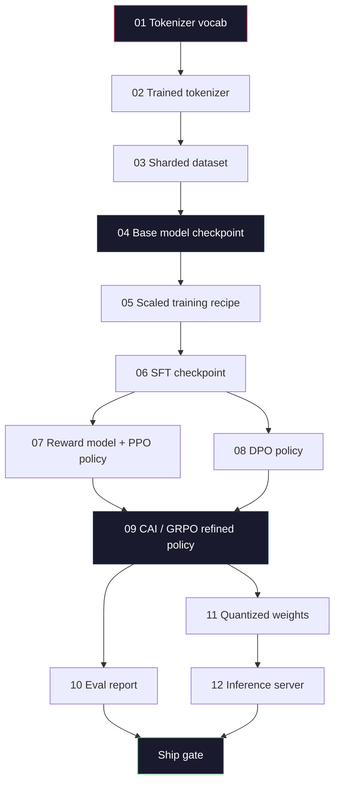
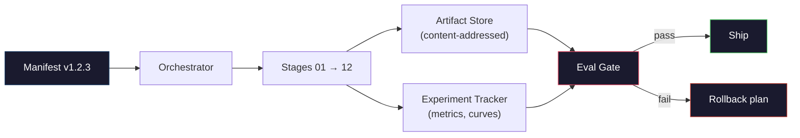

# Budowa Kompletnego Potoku LLM

> Wszystko od Lekcji 01 do 12 to jeden etap jednego potoku. Ta lekcja jest rusztowaniem, które zamienia te etapy w pojedyncze uruchomienie end-to-end: tokenizacja, pre-trening, skalowanie, SFT, align, ewaluacja, kwantyzacja, serwowanie. Nie wytrenujesz modelu 70B na laptopie. Stworzysz warstwę orkiestracji, manifest, bramę ewaluacyjną i plan wycofania, których zespół frontier w 2026 roku używa do decydowania, co trafia do produkcji. To jest capstone.

**Type:** Build
**Languages:** Python (stdlib)
**Prerequisites:** All Phase 10 lessons 01-12
**Time:** ~120 minutes

## Learning Objectives

- Połącz jedenaście poprzednich lekcji (tokenizer, dane, pre-trening, skalowanie, SFT, RLHF, DPO, CAI, ewaluacja, kwantyzacja, inferencja) w jedną powtarzalną specyfikację potoku
- Zdefiniuj kontrakt artefaktów między etapami: co każdy etap konsumuje, co produkuje i jak następny etap weryfikuje wejście
- Zbuduj orkiestrator, który śledzi eksperymenty, hashuje artefakty i blokuje decyzje o wdrożeniu na progach ewaluacyjnych
- Zaprojektuj plan wycofania: które artefakty są tanie do ponownego uruchomienia, które są drogie i ile kosztuje uszkodzony checkpoint

## Problem

Poprzednie lekcje działają każda z osobna. Tokenizer wytrenowany. Mały GPT pre-trenowany. Zbiór SFT złożony. Model nagrody wytrenowany. DPO uruchomione. Ewaluacje zmierzone. Skwantyzowane wagi wyeksportowane. Serwer inferencji uruchomiony. Każda to notebook. Każda ma własne konwencje, własne ścieżki wyjściowe, własne ziarno.

Frontierowe uruchomienie treningowe to nie notebook. Llama 3 405B zajęła 30 milionów godzin H100 przez około 54 dni. DeepSeek-V3 użył około 2,8 miliona godzin H800. W tym czasie jeden uszkodzony checkpoint, jedna kontaminacja danych, jedna regresja ewaluacyjna może kosztować zespół tydzień czasu rzeczywistego i miesiąc budżetu GPU. Sposobem, w jaki zespoły sobie z tym radzą, jest higiena potoku: każdy etap ma deterministyczne wejście, deterministyczne wyjście, manifest, hash i bramę.

To jest capstone. Nie uruchomisz potoku end-to-end na laptopie. Napiszesz orkiestrator, który koordynuje etapy, manifest, który opisuje uruchomienie, weryfikator, który blokuje decyzje o wdrożeniu, oraz plan odtworzenia, który pozwala osobie trzeciej odtworzyć twoją pracę z pojedynczego pliku. Kod jest mały; dyscyplina jest duża.

Wzorzec skaluje się od 100M do 1T parametrów bez zmian. Te same cztery komponenty -- manifest, orkiestrator, brama ewaluacyjna, magazyn artefaktów -- obsługują Llamę 3, a także twojego hobby GPT. Różnica polega na wielkości liczb w konfiguracji każdego etapu, a nie na kształcie potoku.

## Koncepcja

### Dwanaście Etapów

Każda lekcja z Phase 10 to etap. Oto pełny graf zależności.



Etapy 07 i 08 mogą działać równolegle. Wszystko inne to twarda zależność. Zmiana w etapie 02 (tokenizer) unieważnia wszystkie downstreamowe artefakty. Zmiana w etapie 10 (ewaluacja) unieważnia tylko decyzję o wdrożeniu.

### Manifest

Manifest to pojedynczy plik, który opisuje uruchomienie na tyle kompletnie, aby je odtworzyć. Nic, co produkuje potok, nie powinno zależeć od stanu, który nie znajduje się w manifeście. Pola są nudne i obowiązkowe.

```
pipeline_version: 1.2.3
seed: 42
git_commit: a1b2c3d4
stages:
  01_tokenizer:
    recipe: bpe_32k
    input_hash: sha256:...
    output_hash: sha256:...
    wall_clock_sec: 3600
    cost_usd: 12
```

Hash wyjściowy etapu N jest hashem wejściowym etapu N+1. Każde odstępstwo zatrzymuje potok. W ten sposób wcześnie łapiesz kontaminację danych. To także sposób, w jaki członek zespołu na innym kontynencie weryfikuje, że jego odtworzenie wyprodukowało ten sam artefakt co twój.

W praktyce zespoły używają małego schematu YAML plus sprawdzacza manifestu, który porównuje z poprzednim udanym uruchomieniem. Każda delta poza oczekiwanymi polami (koszt, czas ścienny) jest czerwoną flagą.

### Typowanie Artefaktów

Wyjście każdego etapu to typowany artefakt. Nie blob katalogowy, nie pickle, ale nazwany typ ze znanym schematem.

| Stage | Artifact Type | Key Fields |
|-------|--------------|-----------|
| 01-02 | Tokenizer | vocab.json, merges.txt, config.json, hash |
| 03 | Dataset | shards[], row count, token count, dedup stats |
| 04-05 | Checkpoint | weights.safetensors, config.json, optimizer state, step count |
| 06 | SFT Model | checkpoint + SFT recipe + data mix |
| 07 | Reward Model | RM checkpoint + preference data hash |
| 08-09 | Policy | checkpoint + reference hash + beta + KL budget consumed |
| 10 | Eval Report | benchmark scores + regression diffs + eval data hash |
| 11 | Quantized Model | quantized weights + calibration data + accuracy delta vs FP16 |
| 12 | Server Spec | endpoint + model hash + config + observability hooks |

Typowanie zapobiega najczęstszemu trybowi awarii: użyciu wyjścia z etapu 08 jako wejścia do etapu 06, wdrożeniu modelu trenowanego DPO przez ścieżkę SFT. Typowane artefakty i typowane sygnatury etapów sprawiają, że te błędy są błędami kompilacji, a nie błędami piątego dnia.

### Brama Ewaluacyjna

Wdrożenie to nie "trening zakończony." Wdrożenie to "trening zakończony i brama ewaluacyjna przepuszczona." Brama jest zdefiniowana przed rozpoczęciem uruchomienia.

```
gates:
  mmlu:      >= baseline + 0.5   # no regression
  humaneval: >= baseline + 1.0
  truthfulqa: >= baseline         # no drop
  safety_refusal_rate: <= 0.05
  kl_from_reference: <= 25.0
  cost_total_usd: <= 50000
```

Każda brama to próg liczbowy. Żadnych bram "wygląda dobrze." Żadnych subiektywnych zatwierdzeń. Jeśli każda brama przechodzi, artefakt jest oznaczany jako nadający się do wdrożenia. Jeśli którakolwiek brama zawiedzie, uruchomienie jest wstrzymane do czasu jawnego nadpisania przez nazwanego recenzenta, co samo jest rejestrowane w manifeście.

Dwie bramy łapią większość katastrof. Brama *regresji* (nowy model musi być co najmniej tak dobry jak poprzedni na podstawowych benchmarkach) łapie błędy treningowe. Brama *budżetu KL* (alignowana polityka nie może dryfować dalej niż X od referencji) łapie przegrzanie alignamentu. Każdy produkcyjny potok ma obie.

### Orkiestrator

Mały kawałek kodu, który czyta manifest, wysyła etapy, śledzi artefakty i zatrzymuje się przy każdym naruszeniu kontraktu. To nie jest Airflow. To nie jest Kubeflow. Do higieny potoku chcesz czegoś nudnego, co sam napisałeś.

Zadanie orkiestratora jest wąskie:

1. Rozwiąż DAG z manifestu.
2. Dla każdego etapu sprawdź, czy oczekiwane wyjście już istnieje z poprawnym hashem (pomiń, jeśli tak).
3. Uruchom etap, przechwyć stdout/stderr, zmierz czas ścienny i koszt.
4. Zweryfikuj hash wyjściowy z oczekiwanym hashem wejściowym downstreamowego etapu.
5. W przypadku awarii, zapisz częściowy manifest z dokładnym etapem, który zawiódł i zakończ z kodem niezerowym.

To 200 linii Pythona. Będzie wyglądać jak plik `code/main.py` w tej lekcji. Pod maską, prawdziwy potok używa `torchrun` lub `ray` do wykonywania poszczególnych etapów na klastrach, ale sam orkiestrator działa na pojedynczej maszynie.

### Śledzenie Eksperymentów i Przechowywanie Artefaktów

Dwa zewnętrzne systemy kotwiczą potok.

**Tracker eksperymentów (wandb, neptune, mlflow).** Rejestruje krzywe strat, metryki ewaluacyjne, telemetrię systemową na etap. Tracker to miejsce, do którego idziesz, gdy potrzebujesz porównać uruchomienie A z uruchomieniem B trzy tygodnie później. Zespoły prawie zawsze używają hostowanego trackera -- pisanie własnego traci czas, który powinien iść na trening.

**Magazyn artefaktów (S3, R2, GCS).** Niemutowalny magazyn obiektów dla checkpointów, zbiorów danych, tokenizerów, raportów ewaluacyjnych. Artefakty są adresowane przez hash, a nie przez nazwę pliku. Nazwa pliku taka jak `latest.pt` to strzał w stopę; `ckpt-7b-step-20000-sha256:abc123.safetensors` to kontrakt.

Orkiestrator zapisuje do obu. Tracker jest dla ludzi patrzących na wykresy. Magazyn artefaktów jest dla następnego etapu szukającego danych wejściowych.

### Kosztorysowanie

Frontierowe uruchomienie ma przypisaną kwotę w dolarach. Dyscyplina budżetowa odbywa się w dwóch miejscach.

**Oszacowanie przed uruchomieniem.** Z manifestu oblicz oczekiwane FLOPy (dla pre-treningu: 6 x parametry x tokeny), oczekiwane godziny GPU (FLOPy / szczytowa przepustowość / wykorzystanie) i koszt w dolarach przy bieżącej stawce wynajmu. Jeśli oszacowanie przekracza bramę budżetową, potok odmawia uruchomienia.

**Śledzenie w trakcie uruchomienia.** Czas ścienny i koszt na etap są rejestrowane w manifeście. Po każdym etapie sprawdzany jest pozostały budżet. Jeśli etap przekroczył budżet, brama następnego etapu jest oceniana z nowym pozostałym budżetem. Nie dowiadujesz się, że skończyły ci się pieniądze, gdy dzwoni VC.

Zgłoszony koszt Llamy 3 wyniósł 61 mln dolarów. DeepSeek-V3 zgłosił 5,6 mln dolarów za główne uruchomienie pre-treningu. Stosunek wynika głównie z wydajności sprzętu plus mixture-of-experts -- ale konkretny koszt jest widoczny, ponieważ oba zespoły śledziły go na etap, a nie na uruchomienie.

### Powtarzalność a Determinizm

To nie to samo. *Powtarzalne* oznacza, że ten sam manifest plus ten sam kod plus ta sama infrastruktura produkuje checkpoint z równoważnymi downstreamowymi metrykami. *Deterministyczne* oznacza bitowo identyczne wyjście.

Współczesny trening LLM jest powtarzalny, ale nie deterministyczny. Kolejność redukcji w treningu rozproszonym, niedeterminizm jąder GPU (cuBLAS, flash-attn) i zaokrąglanie w mieszanej precyzji łączą się, produkując floaty różniące się na poziomie 1e-5 między uruchomieniami. To jest w porządku dla końcowych metryk, które się nie zmieniają. Jest to fatalne, jeśli próbujesz debugować za pomocą różnic na poziomie bitów. Lekarstwem jest rejestrowanie hasha wejściowego, hasha wyjściowego i głównych metryk każdego etapu -- jeśli te się zgadzają, uruchomienie jest "odtworzone", nawet jeśli wagi nie są bitowo identyczne.



### Plan Wycofania

Przed rozpoczęciem uruchomienia zapisz, co się dzieje w przypadku awarii każdego etapu. Trzy kategorie.

- **Tanie do ponownego uruchomienia** (godziny): tokenizer, ewaluacja, kwantyzacja, serwer inferencji. Po prostu uruchom ponownie.
- **Średnie** (dni): SFT, DPO, CAI. Zachowaj model bazowy; uruchom ponownie tylko etapy alignamentu.
- **Drogie** (tygodnie i miliony dolarów): pre-trening. Plan wycofania tutaj to nie "uruchom ponownie." To "użyj ostatniego dobrego checkpointu i uruchom ponownie tańsze downstreamowe etapy ze zmienionymi danymi."

Ponieważ zależności etapów są typowane i hashowane, orkiestrator może automatycznie obliczyć zestaw wycofania: unieważnij etap, który zawiódł, plus wszystkich jego potomków. Awaria na etapie 06 (SFT) unieważnia 06, 07, 08, 09, 10, 11, 12. Awaria na etapie 11 (kwantyzacja) unieważnia tylko 11 i 12. Nazwanie tego z góry pozwala uniknąć improwizacji, gdy zespół jest wyczerpany o 4 nad ranem.

### Przepisy Produkcyjne Zaobserwowane w 2026

Większość frontierowych zespołów zbiegła się do tego samego szkieletu.

- Tokenizer: 128k BPE z fallbackiem bajtowym. Trenowany na małym, zbalansowanym, wielojęzycznym wycinku.
- Pre-trening: 10-20T tokenów, głównie web plus kod plus syntetyczne. Optymalizator Muon lub AdamW. FSDP2 lub DeepSpeed ZeRO-3. Gradient checkpointing. Wagi BF16, master FP32.
- SFT: 500k-2M par instrukcyjnych, mieszane ludzkie i syntetyczne, ze ścisłą deduplikacją względem zbioru ewaluacyjnego.
- Alignament: DPO lub CAI + GRPO. RLHF tylko tam, gdzie sygnał preferencji jest zbyt wielowymiarowy dla DPO.
- Ewaluacja: MMLU-Pro, MATH, HumanEval+, GPQA, SWE-Bench Verified, LiveBench, plus prywatny zestaw, którego publiczność nigdy nie widzi.
- Kwantyzacja: 4-bit GPTQ lub AWQ do serwowania, 8-bit do ewaluacji bezpieczeństwa, gdzie delty dokładności mają znaczenie.
- Serwowanie: vLLM, TensorRT-LLM lub własne. Ciągłe batchowanie. Dekodowanie spekulatywne. Ewikcja cache KV.

Liczby zmieniają się co sześć miesięcy. Szkielet nie.

```figure
beam-search
```

## Build It

Kod lekcji to orkiestrator i sprawdzacz manifestu, a nie dwanaście skryptów treningowych. Każdy etap jest symulowany za pomocą placeholderu, który produkuje artefakt wyjściowy o poprawnym kształcie i hash-u. Uruchomienie orkiestratora end-to-end dowodzi, że hydraulika potoku działa, zanim spalisz pieniądze na GPU na prawdziwych etapach.

Zobacz `code/main.py` po pełną implementację. Kluczowe elementy:

- `Manifest` dataclass: wersja potoku, ziarno, commit git, etapy, bramy.
- `Stage` dataclass: nazwa, typ, wejścia (hashe), wyjście (hash), czas ścienny, koszt.
- `Orchestrator.run()`: rozwiązuje DAG, wysyła etapy, weryfikuje hashe, aktualizuje manifest.
- `EvalGate.check()`: czyta progi, porównuje z najnowszym raportem ewaluacyjnym, zwraca pass/fail.
- `ArtifactStore` (atrapa w pamięci): put/get po hash-u, symuluje S3.
- `CostTracker`: na etap i skumulowany, zatrzymuje się po przekroczeniu limitu.

Potok w `main.py` uruchamia dwanaście placeholderowych etapów, produkuje manifest i ćwiczy zawodzącą bramę ewaluacyjną, aby pokazać, jak wygląda wstrzymane uruchomienie. Zamień każdy placeholder na prawdziwy skrypt treningowy z odpowiedniej lekcji, a otrzymasz szkielet, którego używa prawdziwy frontierowy potok.

## Use It

Kanoniczny przepływ pracy ma trzy komendy.

```
python code/main.py plan    # validate manifest, compute cost estimate, print DAG
python code/main.py run     # execute stages, writing to manifest.out.yaml
python code/main.py gate    # read manifest.out.yaml, apply eval gates, ship-or-hold
```

Uruchom `plan` najpierw za każdym razem. Większość błędów potoku ujawnia się na etapie planowania -- brakujące progi bram, nieaktualne hashe, przekroczenia budżetu. Uruchomienie `plan` jest darmowe. Uruchomienie `run` jest drogie. Oszczędzaj pieniądze, łapiąc błędy po tańszej stronie.

Wyjście `gate` to albo `SHIP`, albo `HOLD: <reason>`. Wstrzymane uruchomienie to nie porażka; to punkt decyzyjny. Nazwany recenzent albo nadpisuje (a nadpisanie jest rejestrowane), albo zatwierdza wycofanie.

## Ship It

Ta lekcja produkuje `outputs/skill-llm-pipeline-reviewer.md`. Podaj mu proponowany manifest potoku, a sprawdzi wszystkie kontrakty: typowanie etapów, łańcuch hash-y, bramy, plan wycofania, oszacowanie kosztów. Odmawia zatwierdzenia manifestu z brakującą bramą ewaluacyjną, nieograniczonym budżetem KL lub uruchomieniem mieszającym dane ewaluacyjne i treningowe.

## Ćwiczenia

1. Rozszerz orkiestrator o obsługę równoległego wykonywania etapów 07 i 08. Użyj modułu `concurrent.futures` ze stdlib. Potwierdź, że końcowy manifest rejestruje wyjścia obu etapów i że hash wejściowy etapu 09 jest deterministyczną kombinacją obu.

2. Dodaj bramę "sprawdzenia kontaminacji". Mając hash zbioru ewaluacyjnego i shardy zbioru treningowego, oblicz nakładanie się (dopasowanie dokładnego stringa lub 13-gramu). Brama zawodzi, jeśli nakładanie się przekracza 0,1%. Podaj skontaminowany zbiór treningowy i potwierdź, że brama wstrzymuje uruchomienie.

3. Zaimplementuj estymator kosztów od podstaw. Dla etapu 04 (pre-trening), oszacuj FLOPy jako 6 x parametry x tokeny, załóż 40% MFU (wykorzystanie FLOPów modelu) na H100 przy 989 TFLOPs BF16, po 2,50 USD/GPU-godzinę. Podaj oszacowanie dla modelu 7B trenowanego na 2T tokenów. Porównaj z opublikowanymi liczbami Llamy 2.

4. Zbuduj częściowe wycofanie. Zasymuluj awarię na etapie 09 (CAI), a następnie uruchom ponownie etapy 09 do 12, pozostawiając 01-08 w cache. Orkiestrator powinien wykryć artefakty w cache po hash-u i pominąć je. Zmierz czas ścienny zaoszczędzony w porównaniu do pełnego ponownego uruchomienia.

5. Dodaj obserwowalność. Emituj span-y OpenTelemetry dla każdego etapu, z atrybutami dla parametrów, widzianych tokenów, straty i kosztu. Przekaż span-y do lokalnego kolektora. Chodzi nie o dashboardy; chodzi o to, że stan każdego etapu jest możliwy do prześledzenia z pojedynczego ID śledzenia.

## Kluczowe Pojęcia

| Term | What people say | What it actually means |
|------|----------------|----------------------|
| Manifest | "Plik przepisu" | YAML lub JSON opisujący wersję potoku, ziarno, konfigurację na etap i progi bram — wystarczający do odtworzenia uruchomienia |
| Content-addressed | "Po hash-u, nie po nazwie" | Artefakty przechowywane po SHA-256 ich zawartości, więc nigdy nie pomylisz wersji A z wersją B |
| Eval gate | "Kryteria wdrożenia" | Progowe wartości liczbowe na metrykach benchmarkowych i wynikach bezpieczeństwa, które muszą zostać spełnione, zanim artefakt zostanie oznaczony jako nadający się do wdrożenia |
| KL budget | "Jak daleko dryfował alignament" | Limit na skumulowany KL(polityka || referencja) w etapach alignamentu, egzekwowany jako brama |
| MFU | "Ile GPU wykorzystałeś" | Wykorzystanie FLOPów modelu — osiągnięte FLOPy podzielone przez teoretyczne maksimum. 40% jest typowe w skali 70B, 55% przy 7B |
| Rollback plan | "Co robimy, gdy się zepsuje" | Z góry napisany zestaw działań na etap w przypadku awarii: uruchom ponownie, wycofaj się, trenuj ponownie ze zmienionymi danymi wejściowymi |
| Orchestrator | "Dyrygent" | Proces, który czyta manifest, wysyła etapy, weryfikuje hashe, zatrzymuje się przy każdym naruszeniu kontraktu |
| Artifact store | "Wersjonowane S3 dla wag" | Niemutowalny, content-addressed magazyn obiektów — pojedyncze źródło prawdy dla checkpointów, zbiorów danych, raportów ewaluacyjnych |
| Reproducible | "Te same metryki przy odtworzeniu" | Różne wagi na poziomie bitów, ale równoważne downstreamowe metryki — realistyczny cel dla rozproszonego treningu LLM |
| Cost gate | "Nie możesz przekroczyć X" | Oszacowanie kosztów przed uruchomieniem plus tracker w trakcie — potok odmawia uruchomienia, jeśli oszacowanie przekracza budżet |

## Dalsza Lektura

- [Dubey et al., 2024 -- "The Llama 3 Herd of Models"](https://arxiv.org/abs/2407.21783) -- najbardziej szczegółowy publiczny opis frontierowego potoku obejmujący dane, trening, alignament, ewaluację
- [DeepSeek-AI, 2024 -- "DeepSeek-V3 Technical Report"](https://arxiv.org/abs/2412.19437) -- potok zorientowany na wydajność przy mniej więcej 1/10 kosztów treningu klasy Llama 3
- [Kaplan et al., 2020 -- "Scaling Laws for Neural Language Models"](https://arxiv.org/abs/2001.08361) -- oryginalna zależność skalowania compute-data-params
- [Hoffmann et al., 2022 -- "Training Compute-Optimal Large Language Models (Chinchilla)"](https://arxiv.org/abs/2203.15556) -- korekta do Kaplana, która skalibrowała współczesne budżety danych
- [PyTorch FSDP2 documentation](https://pytorch.org/docs/stable/fsdp.html) -- prymityw treningu rozproszonego zastępujący FSDP1 w PyTorch 2.4+
- [Weights & Biases LLM Reports](https://wandb.ai/site/llms) -- prawdziwe manifesty i wyniki trackerów eksperymentów dla open-source'owych uruchomień LLM, przydatne jako szablony do plagiatowania