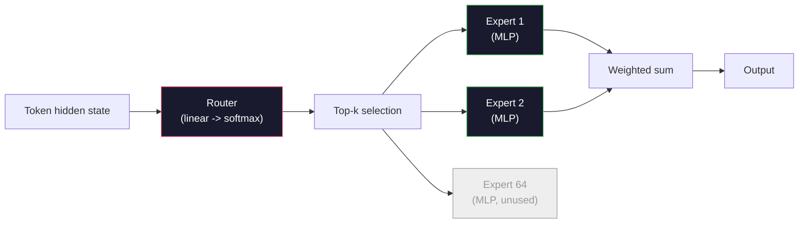

# Otwarte Modele: Przewodnik po Architekturach

> Zbudowałeś GPT-2 Small od zera w Lekcji 04. Frontierowe otwarte modele w 2026 to ta sama rodzina z pięcioma lub sześcioma konkretnymi zmianami. RMSNorm zamiast LayerNorm. SwiGLU zamiast GELU. RoPE zamiast learned positions. GQA lub MLA zamiast pełnego MHA. Mixture-of-Experts na dużą skalę. Matematyka, którą już znasz, pokrywa 95% z nich. Ta lekcja czyta Llamę 3, DeepSeek-V3, Mixtral, Qwen i Gemmę obok siebie i nazywa dokładną linię, w której każda architektura się rozchodzi.

**Type:** Learn
**Languages:** Python (stdlib)
**Prerequisites:** Phase 10, Lessons 04, 05, 12 (Pre-training, Scaling, Inference)
**Time:** ~45 minutes

## Learning Objectives

- Przeczytaj config.json Llamy 3, Mistrala, Mixtrala, Gemmy 2, Qwena 2.5 i DeepSeek-V3 i wyjaśnij każde pole
- Nazwij konkretną zmianę architektoniczną, którą każdy model wprowadził względem GPT-2 Small i uzasadnij ją z pierwszych zasad
- Oblicz liczbę parametrów, rozmiar cache KV i pamięć aktywacji dla dowolnego otwartego modelu z samej jego konfiguracji
- Wybierz odpowiedni otwarty model dla celu wdrożenia, biorąc pod uwagę ograniczenia opóźnienia, pamięci i możliwości

## Problem

W Lekcji 04 napisałeś 350 linii numpy i miałeś model w kształcie GPT-2. Llama 3 405B ma 200-stronicowy raport techniczny. Twój instynkt podpowiada, że to różne bestie. Nie są. 200 stron opisuje ten sam obiekt z pięcioma lub sześcioma dobrze umotywowanymi modyfikacjami, plus tysiącem szczegółów implementacyjnych dotyczących skalowania. Szkielet -- embedding, bloki transformera, attention, MLP, norma, head -- jest niezmieniony.

Ta lekcja to diff. Dla każdej głównej rodziny otwartych modeli wymieniamy dokładnie, co zmieniło się względem GPT-2, dlaczego i jaki był tego koszt. Kiedy skończysz, będziesz mógł przeczytać nową kartę modelu i mentalnie przetłumaczyć ją z powrotem na bazę GPT-2.

Praktyczna korzyść jest taka, że gdy Meta wyda Llamę 5 lub DeepSeek wyda V4, nie będziesz potrzebować nowego modelu mentalnego. Spojrzysz na konfigurację, zobaczysz, które ze znanych pokręteł się przesunęły, i będziesz wiedzieć, jakie są downstreamowe implikacje. Architektury 2026 to skończony zestaw narzędzi. Każdy nowy model wybiera inny podzbiór.

## Koncepcja

### Niezmienny Rdzeń

Wszystkie autoregresyjne otwarte modele dzielą:

- Macierz embeddingu tokenów (vocab_size x hidden_dim).
- Stos N bloków dekodera: norma, self-attention, residuum, norma, MLP, residuum.
- Końcowa norma i liniowa głowica rzutująca na vocab_size (często z tied wagami z embeddingami).
- Maska przyczynowa, strata cross-entropy następnego tokena.

To jest kształt. Reszta to pokrętła.

### Sześć Pokręteł, Które Faktycznie Się Poruszają

We wszystkich frontierowych otwartych modelach 2024-2026 te same sześć wyborów projektowych pojawia się w kółko:

1. **Normalizacja.** LayerNorm -> RMSNorm.
2. **Kodowanie pozycyjne.** Learned absolute -> RoPE (plus warianty: YaRN, NTK).
3. **Aktywacja.** GELU -> SwiGLU (lub GeGLU).
4. **Współdzielenie głowic attention.** MHA -> GQA -> MQA -> MLA.
5. **Gęste vs rzadkie MLP.** Dense -> Mixture-of-Experts.
6. **Umiejscowienie pre-norm.** Pre-norm zostaje. Post-norm znika.

Wszystko inne (schemat szybkości uczenia, mieszanka danych, rozmiar batcha, długość kontekstu) znajduje się w konfiguracji treningowej, a nie w architekturze. Sześć pokręteł.

### Pokrętło 1: RMSNorm

LayerNorm odejmuje średnią, dzieli przez odchylenie standardowe, skaluje i przesuwa. RMSNorm zachowuje tylko skalowanie:

```
RMSNorm(x) = x / sqrt(mean(x^2) + eps) * gamma
```

Bez odejmowania średniej. Bez biasu. O jeden matmul mniej na token. Zhang i Sennrich (2019) argumentowali, że dorównuje LayerNorm w tłumaczeniu maszynowym, będąc jednocześnie 10% szybszym. Każdy nowoczesny otwarty model go używa.

Koszt: żaden. Korzyść: mały wzrost przepustowości, prostszy kod.

### Pokrętło 2: RoPE

Learned position embeddings były tablicą lookup 1024-slot w GPT-2. Kontekst 1025 jest poza końcem tablicy. Modele nie mogą ekstrapolować poza swoją długość treningową.

Rotary Position Embedding (RoPE, Su et al. 2021) wprowadza pozycję poprzez obracanie każdego wektora Q i K w parach przed iloczynem skalarnym attention. Kąt obrotu jest deterministyczną funkcją pozycji, więc nie ma niczego learned i niczego, co mogłoby się skończyć. Dzięki sztuczkom skalowania (NTK-aware interpolation, YaRN), model trenowany na kontekście 8k może rozciągnąć się do 128k przy inferencji z niewielką utratą dokładności.

```
q_rotated = rotate(q, angle(pos))
k_rotated = rotate(k, angle(pos))
score = q_rotated . k_rotated
```

Każdy Llama, Mistral, Qwen, DeepSeek i Gemma używa RoPE. Gemma 2 używa hybrydy (RoPE na większości warstw, lokalne sliding-window attention na innych).

### Pokrętło 3: SwiGLU

MLP GPT-2 to `x -> gelu(xW1 + b1) -> (...)W2 + b2`. SwiGLU (Shazeer 2020) zastępuje aktywację bramkowanym iloczynem:

```
SwiGLU(x) = (xW1) * sigmoid(xW1) * xV
```

Dwie projekcje równolegle zamiast jednej, bramkowane aktywacją Swish. Empirycznie silniejszy pod względem perplexity na parametr. Llama 2 przyjęła, wszyscy poszli w ślad. Ukryty rozmiar MLP jest zwykle ustawiony tak, aby całkowita liczba parametrów odpowiadała oryginalnemu gęstemu MLP: jeśli GPT-2 używał `ff_dim = 4 * hidden`, SwiGLU używa `ff_dim = (2/3) * 4 * hidden = 8/3 * hidden`.

### Pokrętło 4: Współdzielenie Głowic Attention

GPT-2 używał **Multi-Head Attention (MHA)**: każda głowica ma własną projekcję Q, K, V.

**Multi-Query Attention (MQA, Shazeer 2019)** współdzieli jedno K i jedno V między wszystkimi głowicami. Zmniejsza cache KV o num_heads, co stanowi 12x do 32x redukcję w typowym modelu. Dokładność nieznacznie spada na trudnych benchmarkach.

**Grouped-Query Attention (GQA, Ainslie et al. 2023)** to złoty środek: G grup głowic Q współdzieli jedno K i jedno V. Llama 3 8B używa GQA z 32 głowicami Q i 8 głowicami KV (G=8), więc cache KV kurczy się 4x w porównaniu do pełnego MHA.

**Multi-Head Latent Attention (MLA, DeepSeek 2024)** kompresuje K i V do wspólnej low-rank latentnej reprezentacji, rzutując je z powrotem na głowicę. Dodatkowo zmniejsza cache KV, zachowując ekspresyjność na głowicę. DeepSeek-V2 i V3 polegają na tym dla swojej wydajności na długich kontekstach.

| Scheme | KV Heads | KV Cache | Accuracy |
|--------|----------|----------|----------|
| MHA    | num_heads | pełny | najlepsza |
| GQA    | num_groups (G < num_heads) | redukcja num_heads / G | blisko MHA |
| MQA    | 1 | redukcja num_heads | mały spadek |
| MLA    | latent, dekompresja na głowicę | mniejszy niż MQA | blisko MHA |

Dla każdego modelu powyżej ~13B parametrów, GQA lub MLA jest praktycznie obowiązkowe. Pełne MHA w skali to katastrofa cache KV.

### Pokrętło 5: Mixture of Experts

Gęste MLP aktywuje wszystkie swoje parametry dla każdego tokena. MoE MLP ma K ekspertów na blok i router, który wybiera top-k ekspertów na token (zazwyczaj top-2). Tylko wagi tych ekspertów wykonują forward pass dla tego tokena.

```
router_logits = xW_r
indices, weights = top_k(router_logits, k=2)
output = sum_i weights[i] * expert[indices[i]](x)
```

Atut: możesz mieć 64 ekspertów o rozmiarze 7B każdy (więc całkowita liczba parametrów jest ogromna), podczas gdy uruchamiasz tylko 2 z nich na token (więc obliczenia na token odpowiadają gęstemu modelowi 7B). Mixtral 8x7B ma 47B całkowitych parametrów, ale aktywuje tylko 13B na token. DeepSeek-V3 ma 671B całkowitych parametrów, ale aktywuje tylko 37B na token.



Plusy: te same obliczenia, więcej parametrów, lepsza pojemność. Minusy: pamięć ekspertów i tak musi gdzieś być (więc serwowanie potrzebuje więcej VRAM niż gęsty odpowiednik), balansowanie obciążenia routera jest trudne, a fine-tuning routera podczas alignamentu to osobny obszar badawczy.

### Pokrętło 6: Pre-norm zostaje

Oryginalny transformer stosował layer norm po każdym podwarstwie. Każdy otwarty model od czasów GPT-2 umieszcza go *przed* każdą podwarstwą. Pre-norm jest zdecydowanie łatwiejszy do trenowania na głębokości. Nie ma co dyskutować.

### Różnice Model po Modelu

Oto tabela, która czyni to wszystko konkretnym.

| Model | Year | Total Params | Active Params | Norm | Activation | Position | Attention | MoE | Context |
|-------|------|-------------|---------------|------|-----------|----------|-----------|-----|---------|
| GPT-2 Small | 2019 | 124M | 124M | LayerNorm | GELU | Learned | MHA (12 heads) | nie | 1k |
| Llama 3 8B | 2024 | 8B | 8B | RMSNorm | SwiGLU | RoPE | GQA (32/8) | nie | 128k |
| Llama 3 70B | 2024 | 70B | 70B | RMSNorm | SwiGLU | RoPE | GQA (64/8) | nie | 128k |
| Llama 3 405B | 2024 | 405B | 405B | RMSNorm | SwiGLU | RoPE | GQA (128/16) | nie | 128k |
| Mistral 7B | 2023 | 7.2B | 7.2B | RMSNorm | SwiGLU | RoPE | GQA | nie | 32k |
| Mixtral 8x7B | 2023 | 47B | 13B | RMSNorm | SwiGLU | RoPE | GQA | tak (8 ekspertów, top-2) | 32k |
| Gemma 2 9B | 2024 | 9B | 9B | RMSNorm (pre+post) | GeGLU | RoPE + sliding | GQA | nie | 8k |
| Qwen 2.5 72B | 2024 | 72B | 72B | RMSNorm | SwiGLU | RoPE (YaRN) | GQA (64/8) | nie | 128k |
| DeepSeek V2 236B | 2024 | 236B | 21B | RMSNorm | SwiGLU | RoPE | MLA | tak (160 ekspertów, top-6) | 128k |
| DeepSeek V3 | 2024 | 671B | 37B | RMSNorm | SwiGLU | RoPE | MLA | tak (256 ekspertów, top-8) | 128k |

Przejrzyj kolumny. RMSNorm jest uniwersalny. SwiGLU lub jego kuzyn GeGLU jest uniwersalny. RoPE jest uniwersalny. GQA jest uniwersalny powyżej 7B, chyba że zastąpiony przez MLA. MoE jest wyróżnikiem na szczycie.

### Czytanie config.json

Konfiguracja Llamy 3 8B:

```
{
  "hidden_size": 4096,
  "intermediate_size": 14336,
  "num_hidden_layers": 32,
  "num_attention_heads": 32,
  "num_key_value_heads": 8,
  "max_position_embeddings": 131072,
  "rope_theta": 500000.0,
  "rms_norm_eps": 1e-5,
  "vocab_size": 128256
}
```

Każde pole odpowiada czemuś, co już zaimplementowałeś.

- `hidden_size`: wymiar embeddingu.
- `intermediate_size`: ukryty rozmiar MLP (3.5x hidden -- matematyka SwiGLU).
- `num_hidden_layers`: głębokość stosu.
- `num_attention_heads`: głowice Q.
- `num_key_value_heads`: głowice KV (GQA).
- `max_position_embeddings`: długość kontekstu treningowego.
- `rope_theta`: częstotliwość bazowa RoPE. Meta przeskalowała ją z domyślnych 10k do 500k dla ekstrapolacji długiego kontekstu.
- `rms_norm_eps`: stabilność numeryczna.
- `vocab_size`: tokeny.

Z samych tych danych obliczasz całkowite parametry, cache KV i szczytową pamięć aktywacji. Zobacz `code/main.py` po dokładne wzory.

### Budżet pamięci aktywacji

Aktywacje dominują pamięć treningową powyżej kilku miliardów parametrów. Reguła kciuka dla pre-treningu (z gradient checkpointing):

```
activation_mem ~ batch_size * seq_len * hidden_size * num_layers * bytes_per_element
```

Dla Llamy 3 8B przy batch 1, seq 8192, BF16, 32 warstwy, hidden 4096: około 8 GB tylko dla aktywacji z checkpointingiem, 40 GB bez. Dlatego flash-attention i ring-attention mają znaczenie -- przepisują obliczenia attention tak, aby aktywacje się mieściły.

### Budżet cache KV

Dla inferencji przy maksymalnym kontekście:

```
kv_cache = 2 * num_layers * num_kv_heads * head_dim * max_seq_len * bytes_per_element
```

Llama 3 8B przy kontekście 128k, BF16, head_dim = hidden / num_heads = 128:
`2 * 32 * 8 * 128 * 131072 * 2 = 17.2 GB` na sekwencję.

Wagi 8B to 16 GB w BF16. Cache KV dla pojedynczej sekwencji 128k jest większy niż wagi. To jest presja pamięciowa napędzająca badania nad GQA, MLA i kwantyzacją cache KV.

### Kiedy Który Model Wygrywa

- **Pojedyncze GPU 80GB, bez MoE**: Llama 3 8B, Mistral 7B, Gemma 2 9B. Łatwe do serwowania, szerokie narzędzia.
- **Pojedynczy węzeł (8x80GB), duża pojemność**: Llama 3 70B, Qwen 2.5 72B. Najwyższa gęsta otwarta możliwość.
- **Największa otwarta możliwość, akceptacja złożoności MoE**: DeepSeek V3, Mixtral 8x22B. Najlepsza możliwość na aktywny FLOP.
- **Potrzeby długiego kontekstu**: Llama 3 (128k ze skalowaniem RoPE), DeepSeek (przewaga MLA).
- **Serwowanie o niskim opóźnieniu**: Gemma 2 9B (sliding window tnie obliczenia długiego kontekstu).

```figure
rmsnorm-vs-layernorm
```

## Build It

Kod lekcji to kalkulator. Mając dowolny config.json, wypisuje liczbę parametrów na komponent, cache KV przy maksymalnym kontekście, współczynnik MLP SwiGLU i krótki werdykt o architekturze (dense / GQA / MLA / MoE).

```python
config = {
    "hidden_size": 4096, "intermediate_size": 14336,
    "num_hidden_layers": 32, "num_attention_heads": 32,
    "num_key_value_heads": 8, "vocab_size": 128256,
    "max_position_embeddings": 131072,
}
```

Skrypt przechodzi przez architekturę pole po polu, oblicza liczby parametrów dla embeddingu, attention (z redukcją GQA), MLP (z ekspansją SwiGLU), layernorm i głowicy. Następnie oblicza cache KV przy podanej długości kontekstu i wypisuje podsumowanie.

Zobacz `code/main.py` po implementację.

## Use It

Uruchom kalkulator na konfiguracjach Llamy 3 8B, Mistrala 7B, Mixtrala 8x7B i DeepSeek V3 dołączonych do skryptu. Porównaj podziały parametrów. Zauważ, że modele MoE mają całkowitą liczbę parametrów, która przyćmiewa gęste modele, ale aktywną liczbę parametrów, która jest często mniejsza. Zauważ, że cache KV DeepSeek V3 jest mniejszy niż Llamy 3 405B pomimo większej liczby całkowitych parametrów -- to działanie MLA.

Następnie wstaw konfigurację dla dowolnego modelu, który masz lokalnie, przeczytaj podsumowanie i zdecyduj, czy mieści się na twoim GPU.

## Ship It

Ta lekcja produkuje `outputs/skill-open-model-picker.md`. Mając cel wdrożenia (typ GPU, VRAM, długość kontekstu, budżet opóźnienia) i profil zadania (czat, kod, rozumowanie, długi kontekst), rekomenduje otwarty model, schemat kwantyzacji z Lekcji 11 i stos inferencji z Lekcji 12, z jawnym uzasadnieniem dotyczącym sześciu pokręteł architektonicznych.

## Ćwiczenia

1. Przeczytaj konfigurację Qwen 2.5 72B z HuggingFace. Oblicz całkowite parametry od zera. Porównaj z wartością podaną przez HF i zidentyfikuj, skąd pochodzi ewentualna delta (zaokrąglenie head dim, współczynnik współdzielenia KV itp.).

2. DeepSeek V3 używa 256 ekspertów z routingiem top-8. Oblicz stosunek aktywowanych ekspertów do całkowitych i porównaj z top-2 z 8 w Mixtral 8x7B. Co przesunięcie od rzadkiego (25%) do gęstszego rzadkiego (3%) oznacza dla pojemności na FLOP?

3. Oblicz cache KV dla Llamy 3 405B przy kontekście 128k w FP8 i BF16. W FP8 jest to połowa liczby BF16. Ile równoległych sekwencji możesz obsłużyć na pojedynczym węźle 8xH100 (80GB każdy = 640GB łącznie, minus pamięć wag)?

4. Gemma 2 naprzemiennie stosuje warstwy full-attention i sliding-window-attention. Napisz matematykę dla cache KV, gdy połowa warstw używa sliding window 4096 tokenów zamiast pełnego kontekstu. Ile pamięci to oszczędza przy całkowitym kontekście 8k?

5. Znajdź niedawny frontierowy otwarty model, który został wydany po napisaniu tej lekcji. Zidentyfikuj, które z sześciu pokręteł wybrał i czy wprowadził siódme pokrętło. Program nauczania będzie wydawał się nieaktualny w momencie, gdy pojawi się nowa architektura -- celem jest zaktualizowanie twojej tabeli bez przebudowywania twojego modelu mentalnego.

## Kluczowe Pojęcia

| Term | What people say | What it actually means |
|------|----------------|----------------------|
| RMSNorm | "LayerNorm bez średniej" | Normalizuj tylko przez pierwiastek średniej kwadratowej, z learned skalą -- tańszy i porównywalny do LayerNorm |
| RoPE | "Rotary positions" | Obracaj każdy wektor Q i K w parach 2D o kąt zależny od pozycji -- ekstrapoluje poza długość treningową dzięki sztuczkom skalowania |
| SwiGLU | "Nowa aktywacja MLP" | Bramkowana jednostka liniowa z Swish: `(xW1) * sigmoid(xW1) * xV` -- standard w każdym otwartym modelu 2024+ |
| GQA | "Złoty środek attention" | Grouped-Query Attention: G grup głowic Q współdzieli jedną głowicę K i jedną V -- zmniejsza cache KV bez utraty dokładności MQA |
| MLA | "Attention DeepSeeka" | Multi-Head Latent Attention: kompresja K/V do wspólnej low-rank latentnej reprezentacji, dekompresja na głowicę -- najmniejszy cache KV dla dużych modeli |
| MoE | "Rzadcy eksperci" | Mixture of Experts: N MLP na blok, router wybiera top-k na token -- ogromne całkowite parametry, małe aktywne parametry |
| Top-k routing | "Wybierz k ekspertów na token" | Router oblicza wynik na eksperta i aktywuje k najwyższych -- typowe k to 2 (Mixtral) do 8 (DeepSeek) |
| YaRN | "Rozciągnij RoPE" | Yet another RoPE extension -- interpoluje kąty obrotu, aby rozszerzyć kontekst z 8k do 128k+ w czasie inferencji |
| Sliding-window attention | "Nie zwracaj uwagi na wszystko" | Każdy token zwraca uwagę tylko na ostatnie W tokenów -- ogranicza koszt attention do O(W) na token, używane w Gemma 2 i wczesnym Mistralu |
| Active params | "Co działa na token" | Dla modeli MoE, liczba parametrów, które wykonują forward pass na token (znacznie mniejsza niż całkowite parametry) -- określa FLOPy na token |

## Dalsza Lektura

- [Dubey et al., 2024 -- "The Llama 3 Herd of Models"](https://arxiv.org/abs/2407.21783) -- architektoniczne i treningowe odniesienie dla gęstej rodziny Llama 3
- [DeepSeek-AI, 2024 -- "DeepSeek-V3 Technical Report"](https://arxiv.org/abs/2412.19437) -- MLA plus balansowanie obciążenia bez straty pomocniczej plus 671B MoE
- [Jiang et al., 2024 -- "Mixtral of Experts"](https://arxiv.org/abs/2401.04088) -- kanoniczna praca o otwartym modelu MoE
- [Su et al., 2021 -- "RoFormer: Enhanced Transformer with Rotary Position Embedding"](https://arxiv.org/abs/2104.09864) -- praca o RoPE
- [Shazeer, 2020 -- "GLU Variants Improve Transformer"](https://arxiv.org/abs/2002.05202) -- SwiGLU, GeGLU i pokrewne
- [Ainslie et al., 2023 -- "GQA: Training Generalized Multi-Query Transformer Models"](https://arxiv.org/abs/2305.13245) -- praca o GQA
- [Gemma 2 Team, 2024 -- "Gemma 2: Improving Open Language Models at a Practical Size"](https://arxiv.org/abs/2408.00118) -- hybrydowe full+sliding attention, pre+post-norm
- [Qwen Team, 2024 -- "Qwen 2.5 Technical Report"](https://arxiv.org/abs/2412.15115) -- rozszerzenie kontekstu YaRN i przepisy na trening długiego kontekstu