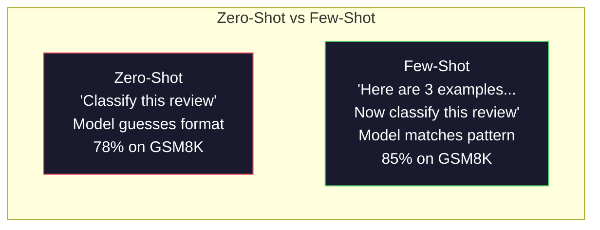
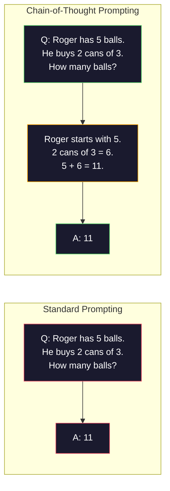
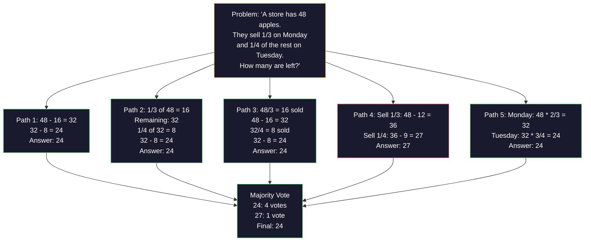
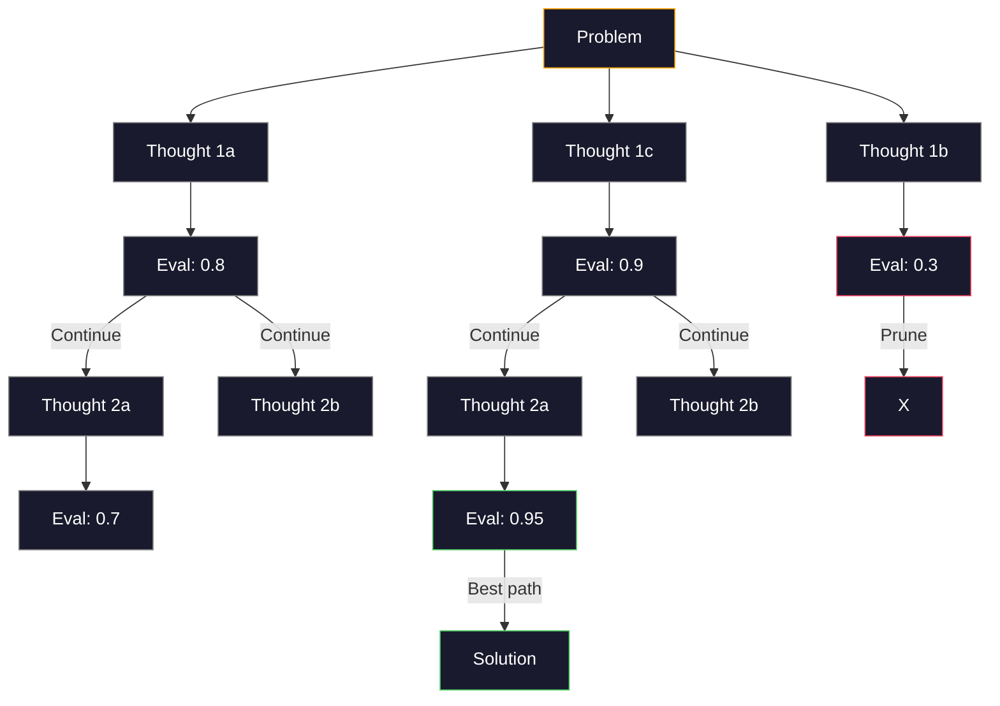

# Few-Shot, Chain-of-Thought, Tree-of-Thought

> Mówienie modelowi, co ma robić, to promptowanie. Pokazanie mu, jak myśleć, to inżynieria. Różnica między 78% a 91% dokładności na tym samym modelu, tym samym zadaniu, tych samych danych, to nie lepszy model. To lepsza strategia rozumowania.

**Type:** Build
**Languages:** Python
**Prerequisites:** Lesson 11.01 (Prompt Engineering)
**Time:** ~45 minutes

## Learning Objectives

- Zaimplementuj few-shot prompting, wybierając i formatując przykładowe demonstracje, które maksymalizują dokładność zadania
- Zastosuj rozumowanie łańcuchowe (chain-of-thought, CoT) w celu poprawy dokładności w problemach wieloetapowych, takich jak matematyczne zadania tekstowe
- Zbuduj prompt tree-of-thought, który eksploruje wiele ścieżek rozumowania i wybiera najlepszą
- Zmierz poprawę dokładności między zero-shot, few-shot i CoT na standardowym benchmarku

## Problem

Budujesz aplikację do nauki matematyki. Twój prompt mówi: „Rozwiąż to zadanie tekstowe." GPT-5 rozwiązuje je poprawnie w 94% przypadków na GSM8K, standardowym benchmarku matematyki szkolnej. Myślisz, że już osiągnąłeś szczyt. Nie osiągnąłeś — chain-of-thought wciąż dodaje 3-4 punkty.

Dodaj pięć słów — „Pomyślmy krok po kroku" — a dokładność skacze do 91%. Dodaj kilka przepracowanych przykładów i osiąga 95%. Ten sam model. Ta sama temperatura. Ten sam koszt API. Jedyna różnica polega na tym, że dałeś modelowi brudnopis.

To nie jest hack. To sposób, w jaki działa rozumowanie. Ludzie nie rozwiązują problemów wieloetapowych w jednym skoku umysłowym. Transformatory też nie. Kiedy zmuszasz model do generowania pośrednich tokenów, tokeny te stają się częścią kontekstu dla następnego tokena. Każdy krok rozumowania zasila następny. Model dosłownie oblicza swoją drogę do odpowiedzi.

Ale „myśl krok po kroku" to początek, nie koniec. Co jeśli pobrałeś próbkę pięciu ścieżek rozumowania i wziąłeś głos większości? Co jeśli pozwoliłeś modelowi eksplorować drzewo możliwości, oceniając i przycinając gałęzie? Co jeśli przeplatałeś rozumowanie z użyciem narzędzi? To nie są hipotezy. To opublikowane techniki z mierzalnymi ulepszeniami, a wszystkie zbudujesz w tej lekcji.

## Koncepcja

### Zero-Shot vs Few-Shot: Kiedy Przykłady Pokonują Instrukcje

Zero-shot prompting daje modelowi zadanie i nic więcej. Few-shot prompting daje mu najpierw przykłady.

Wei i in. (2022) zmierzyli to na 8 benchmarkach. Dla prostych zadań, takich jak klasyfikacja sentymentu, zero-shot i few-shot osiągały wyniki w granicach 2% od siebie. Dla złożonych zadań, takich jak wieloetapowa arytmetyka i rozumowanie symboliczne, few-shot poprawiło dokładność o 10-25%.

Intuicja: przykłady to skompresowane instrukcje. Zamiast opisywać format wyjścia, pokazujesz go. Zamiast wyjaśniać proces rozumowania, demonstrujesz go. Model dopasowuje się do wzorców na przykładach bardziej niezawodnie, niż interpretuje abstrakcyjne instrukcje.



**Kiedy few-shot wygrywa:** zadania wrażliwe na format, klasyfikacja, strukturalna ekstrakcja, żargon domenowy, każde zadanie, w którym model musi dopasować konkretny wzorzec.

**Kiedy zero-shot wygrywa:** proste pytania faktograficzne, zadania kreatywne, gdzie przykłady ograniczają kreatywność, zadania, gdzie znalezienie dobrych przykładów jest trudniejsze niż napisanie dobrych instrukcji.

### Wybór Przykładów: Podobne Pokonuje Losowe

Nie wszystkie przykłady są równe. Wybór przykładów podobnych do docelowego wejścia przewyższa losowy wybór o 5-15% w zadaniach klasyfikacji (Liu i in., 2022). Trzy zasady:

1. **Podobieństwo semantyczne**: wybierz przykłady najbliższe wejściu w przestrzeni embeddingów
2. **Różnorodność etykiet**: pokryj wszystkie kategorie wyjścia w swoich przykładach
3. **Dopasowanie trudności**: dopasuj poziom złożoności docelowego problemu

Optymalna liczba przykładów dla większości zadań to 3-5. Poniżej 3 model nie ma wystarczającego sygnału, aby wyodrębnić wzorzec. Powyżej 5 osiągasz malejące zyski i marnujesz tokeny okna kontekstowego. Dla klasyfikacji z wieloma etykietami użyj jednego przykładu na etykietę.

### Chain-of-Thought: Dawanie Modelom Brudnopisu

Chain-of-Thought (CoT) został wprowadzony przez Wei i in. (2022) w Google Brain. Pomysł jest prosty: zamiast prosić model tylko o odpowiedź, poproś go, aby najpierw pokazał swoje kroki rozumowania.



Dlaczego to działa mechanicznie? Każdy token wygenerowany przez transformator staje się kontekstem dla następnego tokena. Bez CoT model musi skompresować całe rozumowanie w ukryty stan pojedynczego przejścia w przód. Z CoT model externalizuje pośrednie obliczenia jako tokeny. Każdy token rozumowania wydłuża efektywną głębokość obliczeń.

**Benchmarki GSM8K (matematyka szkolna, 8,5K problemów):**

| Model | Zero-Shot | Zero-Shot CoT | Few-Shot CoT |
|-------|-----------|---------------|--------------|
| GPT-4o | 78% | 91% | 95% |
| GPT-5 | 94% | 97% | 98% |
| o4-mini (reasoning) | 97% | — | — |
| Claude Opus 4.7 | 93% | 97% | 98% |
| Gemini 3 Pro | 92% | 96% | 98% |
| Llama 4 70B | 80% | 89% | 94% |
| DeepSeek-V3.1 | 89% | 94% | 96% |

**Uwaga o modelach rozumujących.** Modele takie jak seria o od OpenAI (o3, o4-mini) i DeepSeek-R1 uruchamiają chain-of-thought wewnętrznie przed wydaniem odpowiedzi. Dodawanie „Pomyślmy krok po kroku" do modelu rozumującego jest zbędne, a czasem kontrproduktywne — one już to zrobiły.

Dwa rodzaje CoT:

**Zero-shot CoT:** dołącz „Pomyślmy krok po kroku" do promptu. Nie potrzeba przykładów. Kojima i in. (2022) pokazali, że to pojedyncze zdanie poprawia dokładność w zadaniach arytmetycznych, zdroworozsądkowych i symbolicznych.

**Few-shot CoT:** dostarcz przykłady, które zawierają kroki rozumowania. Bardziej efektywne niż zero-shot CoT, ponieważ model widzi dokładny format rozumowania, jakiego oczekujesz.

**Kiedy CoT szkodzi:** proste przypominanie faktów („Jaka jest stolica Francji?"), klasyfikacja jednoetapowa, zadania, gdzie szybkość ma większe znaczenie niż dokładność. CoT dodaje 50-200 tokenów narzutu rozumowania na zapytanie. Dla zadań o wysokiej przepustowości i niskiej złożoności jest to marnowanie kosztów.

### Self-Consistency: Próbkuj Wielokrotnie, Głosuj Raz

Wang i in. (2023) wprowadzili self-consistency. Insight: pojedyncza ścieżka CoT może zawierać błędy rozumowania. Ale jeśli pobierzesz próbkę N niezależnych ścieżek rozumowania (używając temperatury > 0) i weźmiesz głos większości na ostateczną odpowiedź, błędy się znoszą.



Self-consistency poprawiło dokładność GSM8K z 56,5% (pojedynczy CoT) do 74,4% z N=40 w oryginalnych eksperymentach PaLM 540B. Na GPT-5 poprawa jest niewielka (97% do 98%), ponieważ bazowa dokładność jest już nasycona. Technika błyszczy najbardziej na modelach z 60-85% bazową dokładnością CoT — to słodki punkt, gdzie błędy pojedynczej ścieżki są częste, ale nie systematyczne. Dla modeli rozumujących (seria o, R1) self-consistency jest wchłonięte przez wbudowane wewnętrzne próbkowanie.

Kompromis: N próbek oznacza N-krotność kosztów API i opóźnienia. W praktyce N=5 wychwytuje większość korzyści. N=3 to minimum dla znaczącego głosowania. N > 10 ma malejące zyski dla większości zadań.

### Tree-of-Thought: Eksploracja Rozgałęziona

Yao i in. (2023) wprowadzili Tree-of-Thought (ToT). Podczas gdy CoT podąża jedną liniową ścieżką rozumowania, ToT eksploruje wiele gałęzi i ocenia, które są najbardziej obiecujące przed kontynuacją.



ToT ma trzy komponenty:

1. **Generowanie myśli**: wyprodukuj wiele kandydatów na następny krok
2. **Ocena stanu**: oceń każdego kandydata (można użyć samego LLM jako ewaluatora)
3. **Algorytm wyszukiwania**: BFS lub DFS przez drzewo, przycinając nisko punktowane gałęzie

W zadaniu Game of 24 (połącz 4 liczby za pomocą arytmetyki, aby uzyskać 24), GPT-4 ze standardowym promptowaniem rozwiązuje 7,3% problemów. Z CoT, 4,0% (CoT tutaj szkodzi, ponieważ przestrzeń wyszukiwania jest szeroka). Z ToT, 74%.

ToT jest kosztowny. Każdy węzeł w drzewie wymaga wywołania LLM. Drzewo z czynnikiem rozgałęzienia 3 i głębokością 3 wymaga do 39 wywołań LLM. Używaj go tylko do problemów, gdzie przestrzeń wyszukiwania jest duża, ale można ją ocenić — planowanie, rozwiązywanie łamigłówek, kreatywne rozwiązywanie problemów z ograniczeniami.

### ReAct: Myślenie + Działanie

Yao i in. (2022) połączyli ślady rozumowania z działaniami. Model przeplata myślenie (generowanie rozumowania) i działanie (wywoływanie narzędzi, wyszukiwanie, obliczanie).

```mermaid
graph LR
    Q["Question:\nWhat is the\npopulation of the\ncountry where\nthe Eiffel Tower\nis located?"]
    T1["Thought: I need to\nfind which country\nhas the Eiffel Tower"]
    A1["Action: search\n'Eiffel Tower location'"]
    O1["Observation:\nParis, France"]
    T2["Thought: Now I need\nFrance's population"]
    A2["Action: search\n'France population 2024'"]
    O2["Observation:\n68.4 million"]
    T3["Thought: I have\nthe answer"]
    F["Answer:\n68.4 million"]

    Q --> T1 --> A1 --> O1 --> T2 --> A2 --> O2 --> T3 --> F

    style Q fill:#1a1a2e,stroke:#ffa500,color:#fff
    style T1 fill:#1a1a2e,stroke:#51cf66,color:#fff
    style A1 fill:#1a1a2e,stroke:#e94560,color:#fff
    style O1 fill:#1a1a2e,stroke:#808080,color:#fff
    style T2 fill:#1a1a2e,stroke:#51cf66,color:#fff
    style A2 fill:#1a1a2e,stroke:#e94560,color:#fff
    style O2 fill:#1a1a2e,stroke:#808080,color:#fff
    style T3 fill:#1a1a2e,stroke:#51cf66,color:#fff
    style F fill:#1a1a2e,stroke:#51cf66,color:#fff
```



ReAct przewyższa czysty CoT w zadaniach intensywnie korzystających z wiedzy, ponieważ może ugruntować swoje rozumowanie w rzeczywistych danych. Na HotpotQA (wieloetapowe odpowiadanie na pytania), ReAct z GPT-4 osiąga 35,1% dokładnego dopasowania vs 29,4% dla samego CoT. Prawdziwa moc polega na tym, że błędy rozumowania są korygowane przez obserwacje — model może zaktualizować swój plan w trakcie wykonywania.

ReAct jest fundamentem nowoczesnych agentów AI. Każdy framework agentów (LangChain, CrewAI, AutoGen) implementuje jakąś odmianę pętli Thought-Action-Observation. Pełne agenty zbudujesz w Fazie 14. Ta lekcja obejmuje wzorzec promptowania.

### Strukturalne Promptowanie: Tagi XML, Ograniczniki, Nagłówki

Gdy prompte stają się złożone, struktura zapobiega myleniu sekcji przez model. Trzy podejścia:

**Tagi XML** (działa najlepiej z Claude, solidnie wszędzie):
```
<kontekst>
Przeglądasz pull request. Codebase używa TypeScript i React.
</kontekst>

<zadanie>
Przejrzyj poniższy diff pod kątem błędów, problemów bezpieczeństwa i naruszeń stylu.
</zadanie>

<diff>
{dyf_content}
</diff>

<format_wyjścia>
Wymień każdy problem z: plik, linia, dotkliwość (critical/warning/info), opis.
</format_wyjścia>
```

**Nagłówki Markdown** (uniwersalne):
```
## Rola
Starszy inżynier bezpieczeństwa w firmie fintech.

## Zadanie
Przeanalizuj ten endpoint API pod kątem podatności.

## Wejście
{api_kod}

## Zasady
- Skup się na OWASP Top 10
- Oceń każde znalezisko: critical, high, medium, low
- Dołącz kroki naprawcze
```

**Ograniczniki** (minimalne, ale skuteczne):
```
---WEJŚCIE---
{tekst_użytkownika}
---KONIEC WEJŚCIA---

---INSTRUKCJE---
Podsumuj powyższe w 3 punktach.
---KONIEC INSTRUKCJI---
```

### Łańcuchowanie Promptów: Sekwencyjna Dekompozycja

Niektóre zadania są zbyt złożone dla pojedynczego promptu. Łańcuchowanie promptów dzieli je na kroki, gdzie wyjście jednego promptu staje się wejściem następnego.


Łańcuchowanie bije pojedynczy prompt z trzech powodów:

1. **Każdy krok jest prostszy**: model zajmuje się jednym skupionym zadaniem zamiast żonglować wszystkim
2. **Wyniki pośrednie są inspekcjonowalne**: możesz walidować i korygować między krokami
3. **Różne kroki mogą używać różnych modeli**: użyj taniego modelu do ekstrakcji, drogiego do rozumowania

### Porównanie Wydajności

| Technika | Najlepsza dla | Dokładność GSM8K (GPT-5) | Wywołania API | Narzut Tokenów | Złożoność |
|----------|---------------|--------------------------|---------------|----------------|-----------|
| Zero-Shot | Proste zadania | 94% | 1 | Brak | Trywialna |
| Few-Shot | Dopasowanie formatu | 96% | 1 | 200-500 tokenów | Niska |
| Zero-Shot CoT | Szybkie zwiększenie rozumowania | 97% | 1 | 50-200 tokenów | Trywialna |
| Few-Shot CoT | Maksymalna dokładność pojedynczego wywołania | 98% | 1 | 300-600 tokenów | Niska |
| Self-Consistency (N=5) | Rozumowanie o wysokiej stawce | 98.5% | 5 | 5x koszt tokenów | Średnia |
| Reasoning model (o4-mini) | Zamiennik CoT typu drop-in | 97% | 1 | ukryty (2-10x wewnętrznie) | Trywialna |
| Tree-of-Thought | Problemy wyszukiwania/planowania | N/A (74% w Game of 24) | 10-40+ | 10-40x koszt tokenów | Wysoka |
| ReAct | Rozumowanie ugruntowane w wiedzy | N/A (35.1% na HotpotQA) | 3-10+ | Zmienny | Wysoka |
| Łańcuchowanie promptów | Złożone zadania wieloetapowe | 96% (pipeline) | 2-5 | 2-5x koszt tokenów | Średnia |

Właściwa technika zależy od trzech czynników: wymaganej dokładności, budżetu opóźnienia i tolerancji kosztów. Dla większości systemów produkcyjnych, few-shot CoT z 3-próbkowym self-consistency jako zabezpieczeniem pokrywa 90% przypadków użycia.

## Build It

Zbudujemy solver problemów matematycznych, który łączy few-shot prompting, chain-of-thought reasoning i self-consistency voting w jeden pipeline. Następnie dodamy tree-of-thought dla trudnych problemów.

Pełna implementacja znajduje się w `code/advanced_prompting.py`. Oto kluczowe komponenty.

### Krok 1: Magazyn Przykładów Few-Shot

Pierwszy komponent zarządza przykładami few-shot i wybiera najbardziej odpowiednie dla danego problemu.

```python
GSM8K_EXAMPLES = [
    {
        "question": "Janet's ducks lay 16 eggs per day. She eats three for breakfast every morning and bakes muffins for her friends every day with four. She sells every egg at the farmers' market for $2. How much does she make every day at the farmers' market?",
        "reasoning": "Janet's ducks lay 16 eggs per day. She eats 3 and bakes 4, using 3 + 4 = 7 eggs. So she has 16 - 7 = 9 eggs left. She sells each for $2, so she makes 9 * 2 = $18 per day.",
        "answer": "18"
    },
    ...
]
```

Każdy przykład ma trzy części: pytanie, łańcuch rozumowania i ostateczną odpowiedź. Łańcuch rozumowania to to, co przekształca zwykły przykład few-shot w przykład few-shot CoT.

### Krok 2: Konstruktor Promptów Chain-of-Thought

Konstruktor promptów składa system message, przykłady few-shot z łańcuchami rozumowania i docelowe pytanie w jeden prompt.

```python
def build_cot_prompt(question, examples, num_examples=3):
    system = (
        "You are a math problem solver. "
        "For each problem, show your step-by-step reasoning, "
        "then give the final numerical answer on the last line "
        "in the format: 'The answer is [number]'."
    )

    example_text = ""
    for ex in examples[:num_examples]:
        example_text += f"Q: {ex['question']}\n"
        example_text += f"A: {ex['reasoning']} The answer is {ex['answer']}.\n\n"

    user = f"{example_text}Q: {question}\nA:"
    return system, user
```

Ograniczenie formatu („The answer is [number]") jest krytyczne. Bez niego self-consistency nie może wyodrębnić i porównać odpowiedzi między próbkami.

### Krok 3: Głosowanie Self-Consistency

Pobierz próbkę N ścieżek rozumowania i weź odpowiedź większości.

```python
def self_consistency_solve(question, examples, client, model, n_samples=5):
    system, user = build_cot_prompt(question, examples)

    answers = []
    reasonings = []
    for _ in range(n_samples):
        response = client.chat.completions.create(
            model=model,
            messages=[
                {"role": "system", "content": system},
                {"role": "user", "content": user}
            ],
            temperature=0.7
        )
        text = response.choices[0].message.content
        reasonings.append(text)
        answer = extract_answer(text)
        if answer is not None:
            answers.append(answer)

    vote_counts = Counter(answers)
    best_answer = vote_counts.most_common(1)[0][0] if vote_counts else None
    confidence = vote_counts[best_answer] / len(answers) if best_answer else 0

    return best_answer, confidence, reasonings, vote_counts
```

Temperatura 0.7 jest ważna. Przy temperaturze 0.0 wszystkie N próbek byłoby identycznych, co niweczy cel. Potrzebujesz wystarczającej losowości dla różnorodnych ścieżek rozumowania, ale nie tak dużej, aby model produkował bzdury.

### Krok 4: Solver Tree-of-Thought

Dla problemów, gdzie liniowe rozumowanie zawodzi, ToT eksploruje wiele podejść i ocenia, który kierunek jest najbardziej obiecujący.

```python
def tree_of_thought_solve(question, client, model, breadth=3, depth=3):
    thoughts = generate_initial_thoughts(question, client, model, breadth)
    scored = [(t, evaluate_thought(t, question, client, model)) for t in thoughts]
    scored.sort(key=lambda x: x[1], reverse=True)

    for current_depth in range(1, depth):
        next_thoughts = []
        for thought, score in scored[:2]:
            extensions = extend_thought(thought, question, client, model, breadth)
            for ext in extensions:
                ext_score = evaluate_thought(ext, question, client, model)
                next_thoughts.append((ext, ext_score))
        scored = sorted(next_thoughts, key=lambda x: x[1], reverse=True)

    best_thought = scored[0][0] if scored else ""
    return extract_answer(best_thought), best_thought
```

Ewaluator sam w sobie jest wywołaniem LLM. Pytasz model: „W skali od 0.0 do 1.0, jak obiecująca jest ta ścieżka rozumowania dla rozwiązania problemu?" To jest kluczowy insight ToT — model ocenia własne częściowe rozwiązania.

### Krok 5: Pełny Pipeline

Pipeline łączy wszystkie techniki ze strategią eskalacji.

```python
def solve_with_escalation(question, examples, client, model):
    system, user = build_cot_prompt(question, examples)
    single_response = call_llm(client, model, system, user, temperature=0.0)
    single_answer = extract_answer(single_response)

    sc_answer, confidence, _, _ = self_consistency_solve(
        question, examples, client, model, n_samples=5
    )

    if confidence >= 0.8:
        return sc_answer, "self_consistency", confidence

    tot_answer, _ = tree_of_thought_solve(question, client, model)
    return tot_answer, "tree_of_thought", None
```

Logika eskalacji: najpierw spróbuj taniego (pojedynczy CoT). Jeśli pewność self-consistency jest poniżej 0.8 (mniej niż 4 z 5 próbek zgadzają się), eskaluj do ToT. To równoważy koszt i dokładność — większość problemów jest rozwiązywana tanio, trudne problemy otrzymują więcej obliczeń.

## Use It

### Z LangChain

LangChain zapewnia wbudowane wsparcie dla szablonów promptów i parsowania wyjścia, które upraszczają wzorce few-shot i CoT:

```python
from langchain_core.prompts import FewShotPromptTemplate, PromptTemplate
from langchain_openai import ChatOpenAI

example_prompt = PromptTemplate(
    input_variables=["question", "reasoning", "answer"],
    template="Q: {question}\nA: {reasoning} The answer is {answer}."
)

few_shot_prompt = FewShotPromptTemplate(
    examples=examples,
    example_prompt=example_prompt,
    suffix="Q: {input}\nA: Let's think step by step.",
    input_variables=["input"]
)

llm = ChatOpenAI(model="gpt-4o", temperature=0.7)
chain = few_shot_prompt | llm
result = chain.invoke({"input": "If a train travels 120 km in 2 hours..."})
```

LangChain ma również klasy `ExampleSelector` do wyboru na podstawie podobieństwa semantycznego:

```python
from langchain_core.example_selectors import SemanticSimilarityExampleSelector
from langchain_openai import OpenAIEmbeddings

selector = SemanticSimilarityExampleSelector.from_examples(
    examples,
    OpenAIEmbeddings(),
    k=3
)
```

### Z DSPy

DSPy traktuje strategie promptowania jako optymalizowalne moduły. Zamiast ręcznie tworzyć prompte CoT, definiujesz sygnaturę i pozwalasz DSPy zoptymalizować prompt:

```python
import dspy

dspy.configure(lm=dspy.LM("openai/gpt-4o", temperature=0.7))

class MathSolver(dspy.Module):
    def __init__(self):
        self.solve = dspy.ChainOfThought("question -> answer")

    def forward(self, question):
        return self.solve(question=question)

solver = MathSolver()
result = solver(question="Janet's ducks lay 16 eggs per day...")
```

`ChainOfThought` DSPy automatycznie dodaje ślady rozumowania. `dspy.majority` implementuje self-consistency:

```python
result = dspy.majority(
    [solver(question=q) for _ in range(5)],
    field="answer"
)
```

### Porównanie: Od Zera vs Frameworki

| Cecha | Od Zera (ta lekcja) | LangChain | DSPy |
|-------|---------------------|-----------|------|
| Kontrola nad formatem promptu | Pełna | Oparta na szablonie | Automatyczna |
| Self-consistency | Ręczne głosowanie | Ręczne | Wbudowane (`dspy.majority`) |
| Wybór przykładów | Własna logika | `ExampleSelector` | `dspy.BootstrapFewShot` |
| Tree-of-Thought | Własne wyszukiwanie drzewiaste | Społecznościowe łańcuchy | Niewbudowane |
| Optymalizacja promptów | Ręczna iteracja | Ręczna | Automatyczna kompilacja |
| Najlepsze dla | Nauka, własne pipeline'y | Standardowe przepływy pracy | Badania, optymalizacja |

## Ship It

Ta lekcja produkuje dwa artefakty.

**1. Prompt Łańcucha Rozumowania** (`outputs/prompt-reasoning-chain.md`): gotowy do produkcji szablon promptu dla few-shot CoT z self-consistency. Podłącz swoje przykłady i domenę problemu.

**2. Umiejętność Wyboru Wzorca CoT** (`outputs/skill-cot-patterns.md`): framework decyzyjny do wyboru odpowiedniej techniki rozumowania na podstawie typu zadania, wymagań dokładności i ograniczeń kosztowych.

## Ćwiczenia

1. **Zmierz lukę**: Weź 10 problemów GSM8K. Rozwiąż każdy z zero-shot, few-shot, zero-shot CoT i few-shot CoT. Zapisz dokładność dla każdego. Która technika daje największy wzrost na twoim modelu?

2. **Eksperyment z wyborem przykładów**: Dla tych samych 10 problemów, porównaj losowy wybór przykładów vs ręcznie wybrane podobne przykłady. Zmierz różnicę w dokładności. W którym momencie jakość przykładów ma większe znaczenie niż ich ilość?

3. **Krzywa kosztów self-consistency**: Uruchom self-consistency z N=1, 3, 5, 7, 10 na 20 problemach GSM8K. Narysuj wykres dokładności vs kosztu (całkowite tokeny). Gdzie znajduje się kolano krzywej dla twojego modelu?

4. **Zbuduj pętlę ReAct**: Rozszerz pipeline o narzędzie kalkulatora. Gdy model wygeneruje wyrażenie matematyczne, wykonaj je za pomocą `eval()` w Pythonie (w sandboxie) i przekaż wynik z powrotem. Zmierz, czy rozumowanie ugruntowane w narzędziach przewyższa czysty CoT.

5. **ToT dla zadań kreatywnych**: Dostosuj solver Tree-of-Thought do zadania kreatywnego pisania: „Napisz 6-słowne opowiadanie, które jest jednocześnie zabawne i smutne." Użyj LLM jako ewaluatora. Czy eksploracja rozgałęziona daje lepsze kreatywne wyniki niż jednorazowe generowanie?

## Kluczowe Terminy

| Termin | Co ludzie mówią | Co to naprawdę oznacza |
|--------|-----------------|------------------------|
| Few-shot prompting | „Daj mu kilka przykładów" | Dołączenie demonstracji wejścia-wyjścia w promptcie, aby zakotwiczyć format wyjścia i zachowanie modelu |
| Chain-of-Thought | „Spraw, by myślał krok po kroku" | Wywoływanie pośrednich tokenów rozumowania, które wydłużają efektywne obliczenia modelu przed wydaniem ostatecznej odpowiedzi |
| Self-Consistency | „Uruchom to wielokrotnie" | Próbkowanie N różnych ścieżek rozumowania przy temperaturze > 0 i wybór najczęstszej ostatecznej odpowiedzi przez głos większości |
| Tree-of-Thought | „Pozwól mu eksplorować opcje" | Strukturalne wyszukiwanie po gałęziach rozumowania, gdzie każde częściowe rozwiązanie jest oceniane i tylko obiecujące ścieżki są rozwijane |
| ReAct | „Myślenie + używanie narzędzi" | Przeplatanie śladów rozumowania z zewnętrznymi działaniami (wyszukiwanie, obliczenia, wywołania API) w pętli Thought-Action-Observation |
| Prompt chaining | „Podziel to na kroki" | Dekompozycja złożonego zadania na sekwencyjne prompte, gdzie każde wyjście zasila następne wejście |
| Zero-shot CoT | „Po prostu dodaj 'myśl krok po kroku'" | Dołączenie frazy wyzwalającej rozumowanie do promptu bez żadnych przykładów, polegające na ukrytej zdolności rozumowania modelu |

## Dalsza Lektura

- [Chain-of-Thought Prompting Elicits Reasoning in Large Language Models](https://arxiv.org/abs/2201.11903) -- Wei i in. 2022. Oryginalna praca CoT z Google Brain. Przeczytaj sekcje 2-3 dla podstawowych wyników.
- [Self-Consistency Improves Chain of Thought Reasoning in Language Models](https://arxiv.org/abs/2203.11171) -- Wang i in. 2023. Praca o self-consistency. Tabela 1 zawiera wszystkie potrzebne liczby.
- [Tree of Thoughts: Deliberate Problem Solving with Large Language Models](https://arxiv.org/abs/2305.10601) -- Yao i in. 2023. Praca ToT. Wyniki Game of 24 w sekcji 4 są najważniejsze.
- [ReAct: Synergizing Reasoning and Acting in Language Models](https://arxiv.org/abs/2210.03629) -- Yao i in. 2022. Podstawa nowoczesnych agentów AI. Sekcja 3 wyjaśnia pętlę Thought-Action-Observation.
- [Large Language Models are Zero-Shot Reasoners](https://arxiv.org/abs/2205.11916) -- Kojima i in. 2022. Praca „Pomyślmy krok po kroku". Zaskakująco skuteczna, biorąc pod uwagę, jak jest prosta.
- [DSPy: Compiling Declarative Language Model Calls into Self-Improving Pipelines](https://arxiv.org/abs/2310.03714) -- Khattab i in. 2023. Traktuje promptowanie jako problem kompilacji. Przeczytaj, jeśli chcesz wyjść poza ręczny prompt engineering.
- [OpenAI — Reasoning models guide](https://platform.openai.com/docs/guides/reasoning) -- wskazówki dostawcy, kiedy chain-of-thought staje się wewnętrznym, płatnym za token trybem „rozumowania" a nie sztuczką na poziomie promptu.
- [Lightman i in., "Let's Verify Step by Step" (2023)](https://arxiv.org/abs/2305.20050) -- process reward models (PRM), które oceniają każdy krok łańcucha; sygnał nadzoru rozumowania, który przewyższa nagrody tylko za wynik.
- [Snell i in., "Scaling LLM Test-Time Compute Optimally" (2024)](https://arxiv.org/abs/2408.03314) -- systematyczne badanie długości CoT, próbkowania self-consistency i MCTS; gdzie „myśl krok po kroku" zmierza, gdy dokładność ma większe znaczenie niż opóźnienie.