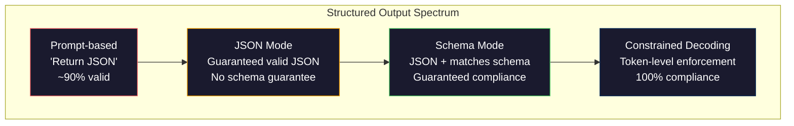
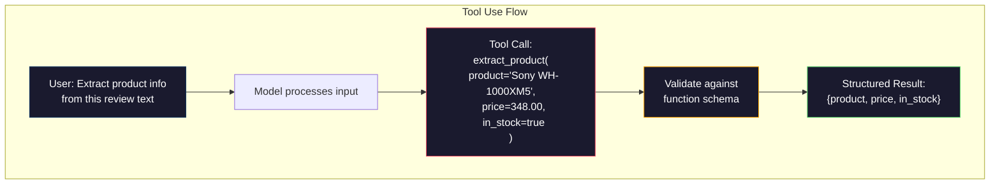

# Structured Outputs: JSON, Schema Validation, Constrained Decoding

> Twój LLM zwraca string. Twoja aplikacja potrzebuje JSON. Ta luka zniszczyła więcej systemów produkcyjnych niż jakakolwiek halucynacja modelu. Structured output to most między językiem naturalnym a typowanymi danymi. Zrób to dobrze, a twój LLM stanie się niezawodnym API. Zrób to źle, a będziesz parsować dowolny tekst regexem o 3 nad ranem.

**Type:** Build
**Languages:** Python
**Prerequisites:** Phase 10, Lessons 01-05 (LLMs from Scratch)
**Time:** ~90 minutes
**Related:** Phase 5 · 20 (Structured Outputs & Constrained Decoding) covers the decoder-level theory (FSM/CFG logit processors, Outlines, XGrammar). This lesson focuses on the production SDK surface (OpenAI `response_format`, Anthropic tool use, Instructor) — read Phase 5 · 20 first if you want to understand what is happening below the API.

## Learning Objectives

- Zaimplementuj tryb JSON i wyjście ograniczone schematem przy użyciu parametrów API OpenAI i Anthropic
- Zbuduj warstwę walidacji Pydantic, która odrzuca nieprawidłowe wyniki LLM i ponawia próby z informacją zwrotną o błędach
- Wyjaśnij, jak constrained decoding wymusza prawidłowy JSON na poziomie tokena bez post-processingu
- Zaprojektuj solidne prompte ekstrakcji, które niezawodnie konwertują nieustrukturyzowany tekst na typowane struktury danych

## Problem

Pytasz LLM: „Wyodrębnij nazwę produktu, cenę i dostępność z tego tekstu." Odpowiada:

```
The product is the Sony WH-1000XM5 headphones, which cost $348.00 and are currently in stock.
```

To jest całkowicie poprawna odpowiedź. Jest też całkowicie bezużyteczna dla twojej aplikacji. Twój system inwentaryzacji potrzebuje `{"product": "Sony WH-1000XM5", "price": 348.00, "in_stock": true}`. Potrzebujesz obiektu JSON z konkretnymi kluczami, konkretnymi typami i konkretnymi ograniczeniami wartości. Nie potrzebujesz zdania.

Naiwne rozwiązanie: dodaj „Odpowiedz w JSON" do swojego promptu. Działa to w 90% przypadków. W pozostałych 10% model owija JSON w znaczniki kodu markdown, albo dodaje wstęp w stylu „Oto JSON:", albo produkuje składniowo nieprawidłowy JSON, ponieważ zamknął nawias za wcześnie. Twój parser JSON się wywraca. Twój pipeline się psuje. Dodajesz try/except i pętlę ponawiania. Ponowienie czasami produkuje inne dane. Teraz masz problem ze spójnością na dodatek do problemu z parsowaniem.

To nie jest problem prompt engineeringu. To problem dekodowania. Model generuje tokeny od lewej do prawej. Na każdej pozycji wybiera najbardziej prawdopodobny następny token ze słownika 100K+ opcji. Większość tych opcji wygenerowałaby nieprawidłowy JSON na dowolnej pozycji. Jeśli model właśnie wyemitował `{"price":`, następny token musi być cyfrą, cudzysłowem (dla stringa), `null`, `true`, `false` lub znakiem minusa. Wszystko inne produkuje nieprawidłowy JSON. Bez ograniczeń model może wybrać całkowicie rozsądne angielskie słowo, które jest katastrofalnie błędne składniowo.

## Koncepcja

### Spektrum Structured Output

Istnieją cztery poziomy kontroli structured output, każdy bardziej niezawodny od poprzedniego.



**Prompt-based** („Odpowiedz w prawidłowym JSON"): brak egzekwowania. Model zazwyczaj się stosuje, ale czasami nie. Niezawodność: ~90%. Sposób awarii: znaczniki markdown, tekst wstępny, obcięte wyjście, zła struktura.

**JSON mode**: API gwarantuje, że wyjście jest prawidłowym JSON. OpenAI's `response_format: { type: "json_object" }` to włącza. Wynik sparsuje się bez błędów. Ale może nie pasować do oczekiwanego schematu — dodatkowe klucze, złe typy, brakujące pola.

**Schema mode**: API przyjmuje JSON Schema i gwarantuje, że wyjście mu odpowiada. W 2026 każdy główny dostawca obsługuje to natywnie: OpenAI's `response_format: { type: "json_schema", json_schema: {...} }` (również jako `tool_choice="required"`), tool use Anthropica z `input_schema`, i `response_schema` Gemini + `response_mime_type: "application/json"`. Wynik ma dokładne klucze, typy i ograniczenia, które określiłeś.

**Constrained decoding**: na każdej pozycji tokena podczas generowania, dekoder maskuje wszystkie tokeny, które wygenerowałyby nieprawidłowe wyjście. Jeśli schema wymaga liczby, a model ma zamiar wyemitować literę, ten token ma ustawione prawdopodobieństwo zero. Model może produkować tylko tokeny prowadzące do prawidłowego wyjścia. To właśnie implementują pod spodem tryb structured output OpenAI i biblioteki takie jak Outlines i Guidance.

### JSON Schema: Język Kontraktu

JSON Schema to sposób, w jaki mówisz modelowi (lub warstwie walidacji), jaki kształt musi mieć wyjście. Każdy główny system structured output go używa.

```json
{
  "type": "object",
  "properties": {
    "product": { "type": "string" },
    "price": { "type": "number", "minimum": 0 },
    "in_stock": { "type": "boolean" },
    "categories": {
      "type": "array",
      "items": { "type": "string" }
    }
  },
  "required": ["product", "price", "in_stock"]
}
```

Ten schemat mówi: wyjście musi być obiektem z stringiem `product`, nieujemną liczbą `price`, booleanem `in_stock` i opcjonalną tablicą stringów `categories`. Każde wyjście, które nie pasuje, zostanie odrzucone.

Schematy obsługują trudne przypadki: zagnieżdżone obiekty, tablice z typowanymi elementami, enumy (ogranicz string do konkretnych wartości), dopasowanie wzorców (regex na stringach) i kombiratory (oneOf, anyOf, allOf dla polimorficznych wyników).

### Wzorzec Pydantic

W Pythonie nie piszesz JSON Schema ręcznie. Definiujesz model Pydantic, a on generuje schemat za ciebie.

```python
from pydantic import BaseModel

class Product(BaseModel):
    product: str
    price: float
    in_stock: bool
    categories: list[str] = []
```

To produkuje to samo JSON Schema co powyżej. Biblioteka Instructor (i SDK OpenAI) akceptują modele Pydantic bezpośrednio: przekaż klasę modelu, otrzymaj zwalidowaną instancję. Jeśli wyjście LLM nie pasuje, Instructor automatycznie ponawia.

### Function Calling / Tool Use

Alternatywny interfejs dla tego samego problemu. Zamiast prosić model o bezpośrednie wygenerowanie JSON, definiujesz „narzędzia" (funkcje) z typowanymi parametrami. Model wyjściowo wywołuje funkcję ze strukturalnymi argumentami. OpenAI nazywa to „function calling". Anthropic nazywa to „tool use". Wynik jest ten sam: strukturalne dane.



Tool use jest preferowany, gdy model musi wybrać, którą funkcję wywołać, nie tylko wypełnić parametry. Jeśli masz 10 różnych schematów ekstrakcji i model musi wybrać właściwy na podstawie wejścia, tool use daje ci zarówno wybór schematu, jak i strukturalne wyjście.

### Typowe Sposoby Awarie

Nawet z egzekwowaniem schematu, structured outputs mogą zawodzić w subtelny sposób.

**Halucynowane wartości**: wyjście pasuje do schematu, ale zawiera zmyślone dane. Model produkuje `{"price": 299.99}`, gdy tekst mówi $348. Walidacja schematu nie może tego wychwycić — typ jest poprawny, wartość jest zła.

**Zamieszanie enumów**: ograniczasz pole do `["in_stock", "out_of_stock", "preorder"]`. Model wyjściowo daje `"available"` — semantycznie poprawne, ale nie w dozwolonym zestawie. Dobre constrained decoding zapobiega temu. Podejścia promptowe nie.

**Głębokość zagnieżdżonego obiektu**: głęboko zagnieżdżone schematy (4+ poziomów) produkują więcej błędów. Każdy poziom zagnieżdżenia to kolejne miejsce, gdzie model może stracić orientację w strukturze.

**Długość tablicy**: model może wyprodukować za dużo lub za mało elementów w tablicy. Schematy obsługują `minItems` i `maxItems`, ale nie wszyscy dostawcy egzekwują je na poziomie dekodowania.

**Pominięcie opcjonalnego pola**: model pomija pola, które są technicznie opcjonalne, ale semantycznie ważne dla twojego przypadku użycia. Ustaw je jako wymagane w schemacie, nawet jeśli dane czasami brakują — wymuś na modelu jawne wyprodukowanie `null`.

## Build It

### Krok 1: Validator JSON Schema

Zbuduj validator od zera, który sprawdza, czy obiekt Pythona pasuje do JSON Schema. To jest to, co działa po stronie wyjścia, aby zweryfikować zgodność.

```python
import json

def validate_schema(data, schema):
    errors = []
    _validate(data, schema, "", errors)
    return errors

def _validate(data, schema, path, errors):
    schema_type = schema.get("type")

    if schema_type == "object":
        if not isinstance(data, dict):
            errors.append(f"{path}: expected object, got {type(data).__name__}")
            return
        for key in schema.get("required", []):
            if key not in data:
                errors.append(f"{path}.{key}: required field missing")
        properties = schema.get("properties", {})
        for key, value in data.items():
            if key in properties:
                _validate(value, properties[key], f"{path}.{key}", errors)

    elif schema_type == "array":
        if not isinstance(data, list):
            errors.append(f"{path}: expected array, got {type(data).__name__}")
            return
        min_items = schema.get("minItems", 0)
        max_items = schema.get("maxItems", float("inf"))
        if len(data) < min_items:
            errors.append(f"{path}: array has {len(data)} items, minimum is {min_items}")
        if len(data) > max_items:
            errors.append(f"{path}: array has {len(data)} items, maximum is {max_items}")
        items_schema = schema.get("items", {})
        for i, item in enumerate(data):
            _validate(item, items_schema, f"{path}[{i}]", errors)

    elif schema_type == "string":
        if not isinstance(data, str):
            errors.append(f"{path}: expected string, got {type(data).__name__}")
            return
        enum_values = schema.get("enum")
        if enum_values and data not in enum_values:
            errors.append(f"{path}: '{data}' not in allowed values {enum_values}")

    elif schema_type == "number":
        if not isinstance(data, (int, float)):
            errors.append(f"{path}: expected number, got {type(data).__name__}")
            return
        minimum = schema.get("minimum")
        maximum = schema.get("maximum")
        if minimum is not None and data < minimum:
            errors.append(f"{path}: {data} is less than minimum {minimum}")
        if maximum is not None and data > maximum:
            errors.append(f"{path}: {data} is greater than maximum {maximum}")

    elif schema_type == "boolean":
        if not isinstance(data, bool):
            errors.append(f"{path}: expected boolean, got {type(data).__name__}")

    elif schema_type == "integer":
        if not isinstance(data, int) or isinstance(data, bool):
            errors.append(f"{path}: expected integer, got {type(data).__name__}")
```

### Krok 2: Konwersja Modelu w Stylu Pydantic na Schemat

Zbuduj minimalny konwerter klasy na schemat. Zdefiniuj klasę Pythona i wygeneruj jej JSON Schema automatycznie.

```python
class SchemaField:
    def __init__(self, field_type, required=True, default=None, enum=None, minimum=None, maximum=None):
        self.field_type = field_type
        self.required = required
        self.default = default
        self.enum = enum
        self.minimum = minimum
        self.maximum = maximum

def python_type_to_schema(field):
    type_map = {
        str: "string",
        int: "integer",
        float: "number",
        bool: "boolean",
    }

    schema = {}

    if field.field_type in type_map:
        schema["type"] = type_map[field.field_type]
    elif field.field_type == list:
        schema["type"] = "array"
        schema["items"] = {"type": "string"}
    elif isinstance(field.field_type, dict):
        schema = field.field_type

    if field.enum:
        schema["enum"] = field.enum
    if field.minimum is not None:
        schema["minimum"] = field.minimum
    if field.maximum is not None:
        schema["maximum"] = field.maximum

    return schema

def model_to_schema(name, fields):
    properties = {}
    required = []

    for field_name, field in fields.items():
        properties[field_name] = python_type_to_schema(field)
        if field.required:
            required.append(field_name)

    return {
        "type": "object",
        "properties": properties,
        "required": required,
    }
```

### Krok 3: Filtr Ograniczonych Tokenów

Symuluj constrained decoding. Mając częściowy string JSON i schemat, określ, które kategorie tokenów są prawidłowe na bieżącej pozycji.

```python
def next_valid_tokens(partial_json, schema):
    stripped = partial_json.strip()

    if not stripped:
        return ["{"]

    try:
        json.loads(stripped)
        return ["<EOS>"]
    except json.JSONDecodeError:
        pass

    last_char = stripped[-1] if stripped else ""

    if last_char == "{":
        return ['"', "}"]
    elif last_char == '"':
        if stripped.endswith('":'):
            return ['"', "0-9", "true", "false", "null", "[", "{"]
        return ["a-z", '"']
    elif last_char == ":":
        return [" ", '"', "0-9", "true", "false", "null", "[", "{"]
    elif last_char == ",":
        return [" ", '"', "{", "["]
    elif last_char in "0123456789":
        return ["0-9", ".", ",", "}", "]"]
    elif last_char == "}":
        return [",", "}", "]", "<EOS>"]
    elif last_char == "]":
        return [",", "}", "<EOS>"]
    elif last_char == "[":
        return ['"', "0-9", "true", "false", "null", "{", "[", "]"]
    else:
        return ["any"]

def demonstrate_constrained_decoding():
    partial_states = [
        '',
        '{',
        '{"product"',
        '{"product":',
        '{"product": "Sony"',
        '{"product": "Sony",',
        '{"product": "Sony", "price":',
        '{"product": "Sony", "price": 348',
        '{"product": "Sony", "price": 348}',
    ]

    print(f"{'Partial JSON':<45} {'Valid Next Tokens'}")
    print("-" * 80)
    for state in partial_states:
        valid = next_valid_tokens(state, {})
        display = state if state else "(empty)"
        print(f"{display:<45} {valid}")
```

### Krok 4: Pipeline Ekstrakcji

Połącz wszystko w pipeline ekstrakcji: zdefiniuj schemat, symuluj LLM produkujący strukturalne wyjście, zweryfikuj wyjście i obsłuż ponowienia.

```python
def simulate_llm_extraction(text, schema, attempt=0):
    if "headphones" in text.lower() or "sony" in text.lower():
        if attempt == 0:
            return '{"product": "Sony WH-1000XM5", "price": 348.00, "in_stock": true, "categories": ["audio", "headphones"]}'
        return '{"product": "Sony WH-1000XM5", "price": 348.00, "in_stock": true}'

    if "laptop" in text.lower():
        return '{"product": "MacBook Pro 16", "price": 2499.00, "in_stock": false, "categories": ["computers"]}'

    return '{"product": "Unknown", "price": 0, "in_stock": false}'

def extract_with_retry(text, schema, max_retries=3):
    for attempt in range(max_retries):
        raw = simulate_llm_extraction(text, schema, attempt)

        try:
            data = json.loads(raw)
        except json.JSONDecodeError as e:
            print(f"  Attempt {attempt + 1}: JSON parse error -- {e}")
            continue

        errors = validate_schema(data, schema)
        if not errors:
            return data

        print(f"  Attempt {attempt + 1}: Schema validation errors -- {errors}")

    return None

product_schema = {
    "type": "object",
    "properties": {
        "product": {"type": "string"},
        "price": {"type": "number", "minimum": 0},
        "in_stock": {"type": "boolean"},
        "categories": {"type": "array", "items": {"type": "string"}},
    },
    "required": ["product", "price", "in_stock"],
}
```

### Krok 5: Uruchom Pełny Pipeline

```python
def run_demo():
    print("=" * 60)
    print("  Structured Output Pipeline Demo")
    print("=" * 60)

    print("\n--- Schema Definition ---")
    product_fields = {
        "product": SchemaField(str),
        "price": SchemaField(float, minimum=0),
        "in_stock": SchemaField(bool),
        "categories": SchemaField(list, required=False),
    }
    generated_schema = model_to_schema("Product", product_fields)
    print(json.dumps(generated_schema, indent=2))

    print("\n--- Schema Validation ---")
    test_cases = [
        ({"product": "Test", "price": 10.0, "in_stock": True}, "Valid object"),
        ({"product": "Test", "price": -5.0, "in_stock": True}, "Negative price"),
        ({"product": "Test", "in_stock": True}, "Missing price"),
        ({"product": "Test", "price": "ten", "in_stock": True}, "String as price"),
        ("not an object", "String instead of object"),
    ]

    for data, label in test_cases:
        errors = validate_schema(data, product_schema)
        status = "PASS" if not errors else f"FAIL: {errors}"
        print(f"  {label}: {status}")

    print("\n--- Constrained Decoding Simulation ---")
    demonstrate_constrained_decoding()

    print("\n--- Extraction Pipeline ---")
    texts = [
        "The Sony WH-1000XM5 headphones are priced at $348 and currently available.",
        "The new MacBook Pro 16-inch laptop costs $2499 but is sold out.",
        "This is a random sentence with no product info.",
    ]

    for text in texts:
        print(f"\n  Input: {text[:60]}...")
        result = extract_with_retry(text, product_schema)
        if result:
            print(f"  Output: {json.dumps(result)}")
        else:
            print(f"  Output: FAILED after retries")
```

## Use It

### OpenAI Structured Outputs

```python
# from openai import OpenAI
# from pydantic import BaseModel
#
# client = OpenAI()
#
# class Product(BaseModel):
#     product: str
#     price: float
#     in_stock: bool
#
# response = client.beta.chat.completions.parse(
#     model="gpt-5-mini",
#     messages=[
#         {"role": "system", "content": "Extract product information."},
#         {"role": "user", "content": "Sony WH-1000XM5, $348, in stock"},
#     ],
#     response_format=Product,
# )
#
# product = response.choices[0].message.parsed
# print(product.product, product.price, product.in_stock)
```

Tryb structured output OpenAI używa wewnętrznie constrained decoding. Każdy token wygenerowany przez model gwarantuje wyjście pasujące do schematu Pydantic. Żadnych ponowień. Żadnej walidacji. Ograniczenie jest wbudowane w proces dekodowania.

### Anthropic Tool Use

```python
# import anthropic
#
# client = anthropic.Anthropic()
#
# response = client.messages.create(
#     model="claude-opus-4-7",
#     max_tokens=1024,
#     tools=[{
#         "name": "extract_product",
#         "description": "Extract product information from text",
#         "input_schema": {
#             "type": "object",
#             "properties": {
#                 "product": {"type": "string"},
#                 "price": {"type": "number"},
#                 "in_stock": {"type": "boolean"},
#             },
#             "required": ["product", "price", "in_stock"],
#         },
#     }],
#     messages=[{"role": "user", "content": "Extract: Sony WH-1000XM5, $348, in stock"}],
# )
```

Anthropic osiąga structured output poprzez tool use. Model emituje wywołanie narzędzia ze strukturalnymi argumentami pasującymi do input_schema. Ten sam wynik, inna powierzchnia API.

### Biblioteka Instructor

```python
# pip install instructor
# import instructor
# from openai import OpenAI
# from pydantic import BaseModel
#
# client = instructor.from_openai(OpenAI())
#
# class Product(BaseModel):
#     product: str
#     price: float
#     in_stock: bool
#
# product = client.chat.completions.create(
#     model="gpt-5-mini",
#     response_model=Product,
#     messages=[{"role": "user", "content": "Sony WH-1000XM5, $348, in stock"}],
# )
```

Instructor owija dowolnego klienta LLM i dodaje automatyczne ponowienia z walidacją. Jeśli pierwsza próba nie przejdzie walidacji, wysyła błędy z powrotem do modelu jako kontekst i prosi go o naprawę wyjścia. Działa to z dowolnym dostawcą, nie tylko OpenAI.

## Ship It

Ta lekcja produkuje `outputs/prompt-structured-extractor.md` — wielokrotnego użytku szablon promptu, który wyodrębnia strukturalne dane z dowolnego tekstu na podstawie definicji schematu. Podaj JSON Schema i nieustrukturyzowany tekst, a zwróci zwalidowany JSON.

Produkuje również `outputs/skill-structured-outputs.md` — framework decyzyjny do wyboru odpowiedniej strategii structured output na podstawie twojego dostawcy, wymagań niezawodności i złożoności schematu.

## Ćwiczenia

1. Rozszerz validator schematu o obsługę `oneOf` (dane muszą pasować do dokładnie jednego z kilku schematów). Obsługuje to polimorficzne wyniki — na przykład pole, które może być obiektem `Product` lub `Service` o różnych kształtach.

2. Zbuduj narzędzie do „diff schematów", które porównuje dwa schematy i identyfikuje zmiany przełamujące (usunięte wymagane pola, zmienione typy) vs zmiany nieprzełamujące (dodane opcjonalne pola, złagodzone ograniczenia). Jest to niezbędne do wersjonowania schematów ekstrakcji w produkcji.

3. Zaimplementuj bardziej realistyczny symulator constrained decoding. Mając JSON Schema i słownik 100 tokenów (litery, cyfry, znaki interpunkcyjne, słowa kluczowe), przejdź przez generowanie krok po kroku, maskując nieprawidłowe tokeny na każdej pozycji. Zmierz, jaki procent słownika jest prawidłowy na każdym kroku.

4. Zbuduj zestaw ewaluacyjny ekstrakcji. Stwórz 50 opisów produktów z ręcznie oznaczonymi wynikami JSON. Uruchom swój pipeline ekstrakcji na wszystkich 50 i zmierz dokładne dopasowanie, dokładność na poziomie pola i zgodność typów. Zidentyfikuj, które pola są najtrudniejsze do prawidłowego wyodrębnienia.

5. Dodaj „wskaźniki ufności" do swojego pipeline'u ekstrakcji. Dla każdego wyodrębnionego pola oszacuj, jak pewny jest model (na podstawie prawdopodobieństw tokenów lub przez uruchomienie ekstrakcji 3 razy i zmierzenie spójności). Oznacz pola o niskiej ufności do przeglądu przez człowieka.

## Kluczowe Terminy

| Termin | Co ludzie mówią | Co to naprawdę oznacza |
|--------|-----------------|------------------------|
| JSON mode | „Zwraca JSON" | Flaga API gwarantująca składniowo prawidłowe wyjście JSON, ale nie wymuszająca żadnego konkretnego schematu |
| Structured output | „Typowany JSON" | Wyjście pasujące do konkretnego JSON Schema z poprawnymi kluczami, typami i ograniczeniami |
| Constrained decoding | „Kierowane generowanie" | Na każdej pozycji tokena maskuj tokeny, które wygenerowałyby nieprawidłowe wyjście — gwarantuje 100% zgodność ze schematem |
| JSON Schema | „Szablon JSON" | Język deklaratywny do opisywania struktury, typów i ograniczeń danych JSON (używany przez OpenAPI, JSON Forms itp.) |
| Pydantic | „Python dataclasses+" | Biblioteka Pythona definiująca modele danych z walidacją typów, używana przez FastAPI i Instructor do generowania JSON Schema |
| Function calling | „Tool use" | LLM wyjściowo produkuje strukturalne wywołanie funkcji (nazwa + typowane argumenty) zamiast dowolnego tekstu — OpenAI i Anthropic to obsługują |
| Instructor | „Pydantic dla LLM" | Biblioteka Pythona owijająca klientów LLM, aby zwracać zwalidowane instancje Pydantic, z automatycznym ponawianiem przy niepowodzeniu walidacji |
| Token masking | „Filtrowanie słownika" | Ustawienie prawdopodobieństw konkretnych tokenów na zero podczas generowania, aby model nie mógł ich wyprodukować |
| Schema compliance | „Pasuje do kształtu" | Wyjście ma każde wymagane pole, poprawne typy, wartości w ramach ograniczeń i żadnych dodatkowych niedozwolonych pól |
| Retry loop | „Próbuj aż zadziała" | Wyślij błędy walidacji z powrotem do modelu i poproś o naprawę wyjścia — Instructor robi to automatycznie, do konfigurowalnego maksimum |

## Dalsza Lektura

- [OpenAI Structured Outputs Guide](https://platform.openai.com/docs/guides/structured-outputs) -- oficjalna dokumentacja dla constrained decoding opartego na JSON Schema w API OpenAI
- [Willard & Louf, 2023 -- "Efficient Guided Generation for Large Language Models"](https://arxiv.org/abs/2307.09702) -- praca Outlines, opisująca jak kompilować JSON Schema do maszyn stanów skończonych dla ograniczeń na poziomie tokenów
- [Instructor documentation](https://python.useinstructor.com/) -- standardowa biblioteka do uzyskiwania strukturalnych wyników z dowolnego LLM z walidacją Pydantic i ponowieniami
- [Anthropic Tool Use Guide](https://docs.anthropic.com/en/docs/tool-use) -- jak Claude implementuje structured output poprzez tool use z JSON Schema input_schema
- [JSON Schema specification](https://json-schema.org/) -- pełna specyfikacja języka schematów używanego przez każdy główny system structured output
- [Outlines library](https://github.com/outlines-dev/outlines) -- open-source constrained generation używające regex i JSON Schema skompilowanych do maszyn stanów skończonych
- [Dong et al., "XGrammar: Flexible and Efficient Structured Generation Engine for Large Language Models" (MLSys 2025)](https://arxiv.org/abs/2411.15100) -- obecny najnowocześniejszy silnik gramatyczny; kompilacja automatu pushdown, który maskuje tokeny w ~100 ns / token.
- [Beurer-Kellner et al., "Prompting Is Programming: A Query Language for Large Language Models" (LMQL)](https://arxiv.org/abs/2212.06094) -- praca LMQL ujmująca constrained decoding jako język zapytań z ograniczeniami typów i wartości.
- [Microsoft Guidance (framework docs)](https://github.com/guidance-ai/guidance) -- template-driven constrained generation; uzupełnienie Outlines i XGrammar niezależne od dostawcy.