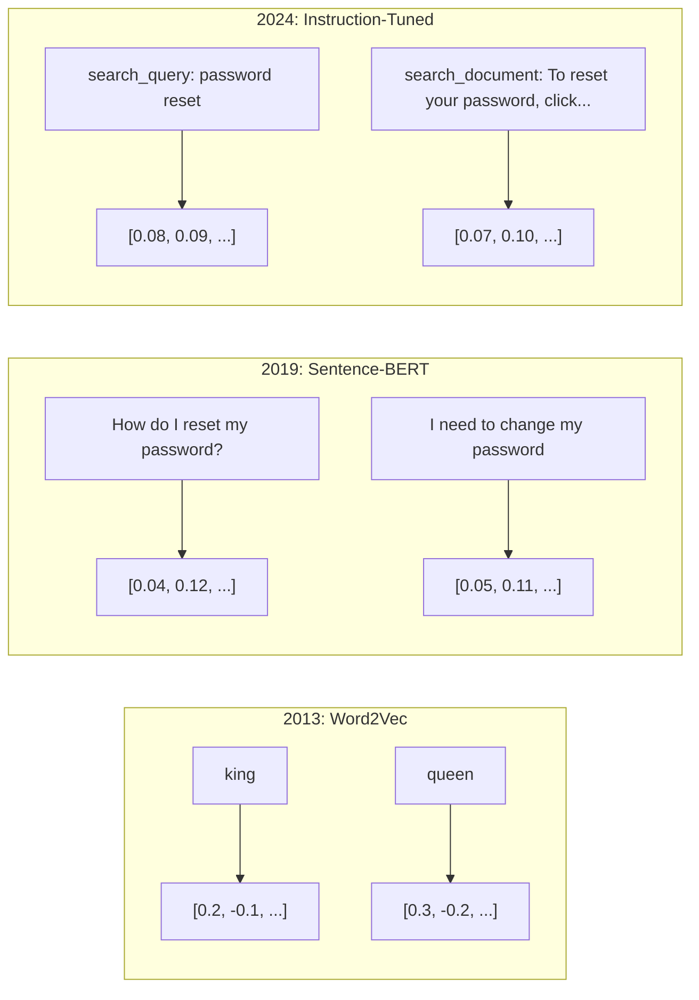
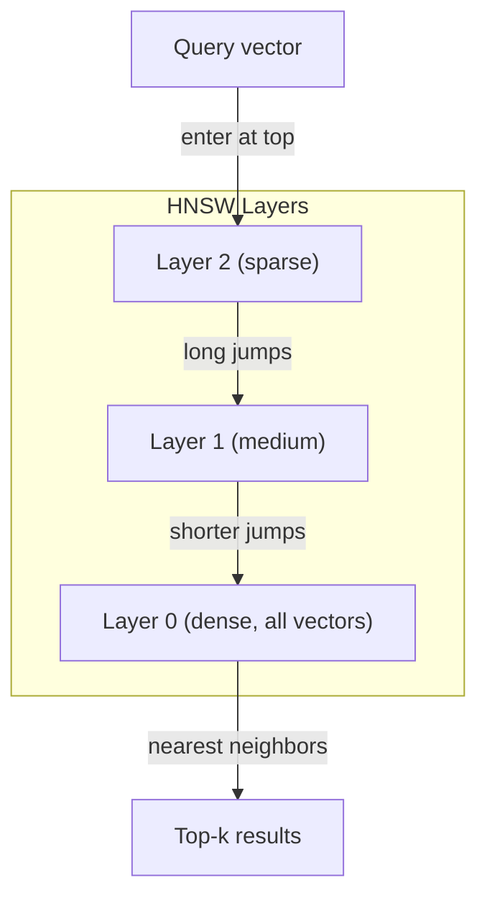
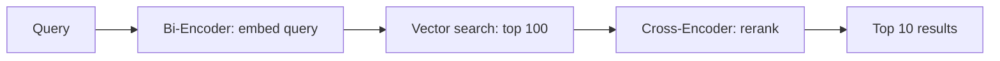

# Embeddings & Reprezentacje Wektorowe

> Tekst jest dyskretny. Matematyka jest ciągła. Za każdym razem, gdy prosisz LLM o znalezienie „podobnych" dokumentów, porównanie znaczeń lub wyszukiwanie poza słowami kluczowymi, polegasz na moście między tymi dwoma światami. Tym mostem jest embedding. Jeśli nie rozumiesz embeddingów, nie rozumiesz nowoczesnej AI. Po prostu jej używasz.

**Type:** Build
**Languages:** Python
**Prerequisites:** Phase 11, Lesson 01 (Prompt Engineering)
**Time:** ~75 minutes
**Related:** Phase 5 · 22 (Embedding Models Deep Dive) covers dense vs sparse vs multi-vector, Matryoshka truncation, and per-axis model selection. This lesson focuses on the production pipeline (vector DBs, HNSW, similarity math). Read Phase 5 · 22 before picking a model.

## Learning Objectives

- Generuj embeddingi tekstowe przy użyciu API i modeli open-source oraz obliczaj podobieństwo cosinusowe między nimi
- Wyjaśnij, dlaczego embeddingi rozwiązują problem niedopasowania słownictwa, którego wyszukiwanie słów kluczowych nie może obsłużyć
- Zbuduj indeks wyszukiwania semantycznego, który wyszukuje dokumenty według znaczenia, a nie dokładnego dopasowania słów kluczowych
- Oceń jakość embeddingów za pomocą benchmarków wyszukiwania (precision@k, recall) i wybierz odpowiedni model embeddingu dla swojego zadania

## Problem

Masz 10 000 zgłoszeń wsparcia. Klient pisze „moja płatność nie przeszła." Musisz znaleźć podobne przeszłe zgłoszenia. Wyszukiwanie słów kluczowych znajduje zgłoszenia zawierające „płatność" i „nie przeszła." Pomija „transakcja odrzucona", „opłata została odrzucona" i „błąd rozliczenia." Te zgłoszenia opisują dokładnie ten sam problem zupełnie innymi słowami.

To jest problem niedopasowania słownictwa. Język ludzki ma dziesiątki sposobów na powiedzenie tego samego. Wyszukiwanie słów kluczowych traktuje każde słowo jako niezależny symbol bez znaczenia. Nie może wiedzieć, że „odrzucona" i „nie przeszła" odnoszą się do tego samego pojęcia.

Potrzebujesz reprezentacji tekstu, w której znaczenie, a nie pisownia, określa podobieństwo. Potrzebujesz sposobu, aby umieścić „moja płatność nie przeszła" i „transakcja została odrzucona" blisko siebie w jakiejś matematycznej przestrzeni, jednocześnie odpychając „moja płatność dotarła na czas" daleko, mimo że dzieli słowo „płatność."

Tą reprezentacją jest embedding.

## Koncepcja

### Czym Jest Embedding?

Embedding to gęsty wektor liczb zmiennoprzecinkowych, który reprezentuje znaczenie tekstu. Słowo „gęsty" ma znaczenie — każdy wymiar niesie informację, w przeciwieństwie do rzadkich reprezentacji (bag-of-words, TF-IDF), gdzie większość wymiarów to zero.

„Kot usiadł na macie" staje się czymś w rodzaju `[0.023, -0.041, 0.087, ..., 0.012]` — lista 768 do 3072 liczb, w zależności od modelu. Te liczby kodują znaczenie. Nigdy nie oglądasz ich bezpośrednio. Porównujesz je.

### Przełom Word2Vec

W 2013 roku Tomas Mikolov i koledzy z Google opublikowali Word2Vec. Kluczowy insight: wytrenuj sieć neuronową do przewidywania słowa na podstawie jego sąsiadów (lub sąsiadów na podstawie słowa), a wagi ukrytej warstwy stają się znaczącymi reprezentacjami wektorowymi.

Słynny wynik:

```
king - man + woman = queen
```

Arytmetyka wektorowa na embeddingach słów wychwytuje relacje semantyczne. Kierunek od „man" do „woman" jest mniej więcej taki sam, jak kierunek od „king" do „queen." To był moment, w którym dziedzina zdała sobie sprawę, że geometria może kodować znaczenie.

Word2Vec produkowało 300-wymiarowe wektory. Każde słowo dostawało jeden wektor niezależnie od kontekstu. „Bank" w „river bank" i „bank account" miało ten sam embedding. To ograniczenie napędzało następną dekadę badań.

### Od Słów do Zdań

Embeddingi słów reprezentują pojedyncze tokeny. Systemy produkcyjne muszą embedować całe zdania, akapity lub dokumenty. Pojawiły się cztery podejścia:

**Uśrednianie**: weź średnią wszystkich wektorów słów w zdaniu. Tanie, stratne, zaskakująco przyzwoite dla krótkiego tekstu. Całkowicie traci kolejność słów — „pies gryzie człowieka" i „człowiek gryzie psa" dostają identyczne embeddingi.

**Token CLS**: modele transformerowe (BERT, 2018) wyjściowo dają specjalny embedding tokena [CLS], który reprezentuje całe wejście. Lepsze niż uśrednianie, ale token [CLS] był trenowany do przewidywania następnego zdania, a nie podobieństwa.

**Uczenie kontrastywne**: trenuj model jawnie, aby zbliżać podobne pary i oddalać niepodobne. Sentence-BERT (Reimers & Gurevych, 2019) użył tego podejścia i stał się fundamentem nowoczesnych modeli embeddingów. Mając „Jak zresetować hasło?" i „Muszę zmienić hasło", model uczy się, że te powinny mieć prawie identyczne wektory.

**Embeddingi z instrukcjami**: najnowsze podejście. Modele takie jak E5 i GTE akceptują prefiks zadania („search_query:", „search_document:"), który mówi modelowi, jaki rodzaj embeddingu wyprodukować. Pozwala to jednemu modelowi obsługiwać wiele zadań.



### Nowoczesne Modele Embeddingów

Rynek osiadł na kilku produkcyjnych opcjach (wyniki MTEB z początku 2026, MTEB v2):

| Model | Dostawca | Wymiary | MTEB | Kontekst | Koszt / 1M tokenów |
|-------|----------|---------|------|----------|--------------------|
| Gemini Embedding 2 | Google | 3072 (Matryoshka) | 67.7 (retrieval) | 8192 | $0.15 |
| embed-v4 | Cohere | 1024 (Matryoshka) | 65.2 | 128K | $0.12 |
| voyage-4 | Voyage AI | 1024/2048 (Matryoshka) | 66.8 | 32K | $0.12 |
| text-embedding-3-large | OpenAI | 3072 (Matryoshka) | 64.6 | 8192 | $0.13 |
| text-embedding-3-small | OpenAI | 1536 (Matryoshka) | 62.3 | 8192 | $0.02 |
| BGE-M3 | BAAI | 1024 (dense+sparse+ColBERT) | 63.0 wielojęzyczny | 8192 | Open-weight |
| Qwen3-Embedding | Alibaba | 4096 (Matryoshka) | 66.9 | 32K | Open-weight |
| Nomic-embed-v2 | Nomic | 768 (Matryoshka) | 63.1 | 8192 | Open-weight |

MTEB (Massive Text Embedding Benchmark) v2 obejmuje 100+ zadań w zakresie wyszukiwania, klasyfikacji, grupowania, rerankowania i podsumowywania. Wyższy znaczy lepszy. Do 2026 roku modele open-weight (Qwen3-Embedding, BGE-M3) dorównują lub przewyższają zamknięte hostowane modele w większości aspektów. Gemini Embedding 2 prowadzi w czystym wyszukiwaniu; Voyage/Cohere prowadzą w konkretnych domenach (finanse, prawo, kod). Zawsze benchmarkuj na własnych zapytaniach przed zobowiązaniem się.

### Metryki Podobieństwa

Mając dwa wektory embeddingów, trzy sposoby na zmierzenie, jak bardzo są podobne:

**Podobieństwo cosinusowe**: cosinus kąta między dwoma wektorami. Zakres od -1 (przeciwne) do 1 (identyczny kierunek). Ignoruje wielkość — 10-wyrazowe zdanie i 500-wyrazowy dokument mogą mieć wynik 1.0, jeśli wskazują ten sam kierunek. Jest to domyślna metryka dla 90% przypadków użycia.

```
cosine_sim(a, b) = dot(a, b) / (||a|| * ||b||)
```

**Iloczyn skalarny**: surowy iloczyn wewnętrzny dwóch wektorów. Identyczny z podobieństwem cosinusowym, gdy wektory są znormalizowane (długość jednostkowa). Szybszy do obliczenia. Embeddingi OpenAI są znormalizowane, więc iloczyn skalarny i cosinus dają tę samą kolejność.

```
dot(a, b) = sum(a_i * b_i)
```

**Odległość euklidesowa (L2)**: odległość w linii prostej w przestrzeni wektorowej. Mniejsza = bardziej podobne. Wrażliwa na różnice wielkości. Używaj, gdy bezwzględna pozycja w przestrzeni ma znaczenie, a nie tylko kierunek.

```
L2(a, b) = sqrt(sum((a_i - b_i)^2))
```

Kiedy używać której:

| Metryka | Używaj gdy | Unikaj gdy |
|---------|------------|------------|
| Podobieństwo cosinusowe | Porównywanie tekstów o różnej długości; większość zadań wyszukiwania | Wielkość niesie informację |
| Iloczyn skalarny | Embeddingi są już znormalizowane; maksymalna szybkość | Wektory mają różne wielkości |
| Odległość euklidesowa | Grupowanie; problemy najbliższych sąsiadów przestrzennych | Porównywanie dokumentów o radykalnie różnej długości |

### Bazy Wektorowe i HNSW

Wyszukiwanie brute-force porównuje zapytanie z każdym przechowywanym wektorem. Przy 1 milionie wektorów o 1536 wymiarach, to 1,5 miliarda operacji mnożenia-dodawania na zapytanie. Zbyt wolne.

Bazy wektorowe rozwiązują to za pomocą algorytmów Approximate Nearest Neighbor (ANN). Dominującym algorytmem jest HNSW (Hierarchical Navigable Small World):

1. Zbuduj wielowarstwowy graf wektorów
2. Górne warstwy są rzadkie — dalekosiężne połączenia między odległymi klastrami
3. Dolne warstwy są gęste — drobnoziarniste połączenia między pobliskimi wektorami
4. Wyszukiwanie zaczyna się od górnej warstwy, zachłannie schodząc w dół
5. Zwraca przybliżone wyniki top-k w czasie O(log n) zamiast O(n)

HNSW wymienia niewielką utratę dokładności (zazwyczaj 95-99% recall) na ogromne zyski szybkości. Przy 10 milionach wektorów, brute-force zajmuje sekundy. HNSW zajmuje milisekundy.



Opcje produkcyjne:

| Baza danych | Typ | Najlepsza dla | Maks. skala |
|-------------|------|---------------|-------------|
| Pinecone | Zarządzane SaaS | Produkcja zero-ops | Miliardy |
| Weaviate | Open source | Samodzielne hostowanie, hybrydowe wyszukiwanie | 100M+ |
| Qdrant | Open source | Wysoka wydajność, filtrowanie | 100M+ |
| ChromaDB | Osadzona | Prototypowanie, lokalny rozwój | 1M |
| pgvector | Rozszerzenie Postgres | Już używasz Postgres | 10M |
| FAISS | Biblioteka | Wewnątrzprocesowo, badania | 1B+ |

### Strategie Dzielenia na Fragmenty

Dokumenty są zbyt długie, aby embedować jako pojedyncze wektory. 50-stronicowy PDF obejmuje dziesiątki tematów — jego embedding staje się średnią wszystkiego, podobny do niczego konkretnego. Dzielisz dokumenty na fragmenty i embedujesz każdy.

**Dzielenie o stałym rozmiarze**: podziel co N tokenów z pokryciem M tokenów. Proste i przewidywalne. Działa dobrze, gdy dokumenty nie mają jasnej struktury. Fragment 512 tokenów z pokryciem 50 tokenów: fragment 1 to tokeny 0-511, fragment 2 to tokeny 462-973.

**Dzielenie na zdania**: dziel na granicach zdań, grupując zdania aż do osiągnięcia limitu tokenów. Każdy fragment to co najmniej jedno pełne zdanie. Lepsze niż stały rozmiar, ponieważ nigdy nie przecinasz myśli w połowie.

**Rekurencyjne dzielenie**: najpierw spróbuj podzielić na największej granicy (nagłówki sekcji). Jeśli wciąż za duże, spróbuj granic akapitów. Potem granic zdań. Potem limitów znaków. To jest `RecursiveCharacterTextSplitter` z LangChain i działa dobrze dla korpusów mieszanego formatu.

**Semantyczne dzielenie**: embeduj każde zdanie, następnie grupuj kolejne zdania, których embeddingi są podobne. Gdy podobieństwo embeddingów spadnie poniżej progu, rozpocznij nowy fragment. Drogie (wymaga embedowania każdego zdania indywidualnie), ale produkuje najbardziej spójne fragmenty.

| Strategia | Złożoność | Jakość | Najlepsza dla |
|-----------|-----------|--------|---------------|
| Stały rozmiar | Niska | Przyzwoita | Nieustrukturyzowany tekst, logi |
| Oparta na zdaniach | Niska | Dobra | Artykuły, e-maile |
| Rekurencyjna | Średnia | Dobra | Markdown, HTML, mieszane dokumenty |
| Semantyczna | Wysoka | Najlepsza | Krytyczna jakość wyszukiwania |

Słodki punkt dla większości systemów: fragmenty 256-512 tokenów z pokryciem 50 tokenów.

### Bi-Encodery vs Cross-Encodery

Bi-encoder embeduje zapytanie i dokumenty niezależnie, a następnie porównuje wektory. Szybki — embedujesz zapytanie raz i porównujesz z pre-obliczonymi embeddingami dokumentów. To jest to, czego używasz do wyszukiwania.

Cross-encoder przyjmuje zapytanie i dokument jako pojedyncze wejście i wyjściowo daje wynik relevancji. Wolny — przetwarza każdą parę zapytanie-dokument przez pełny model. Ale znacznie dokładniejszy, ponieważ może uwzględniać tokeny zapytania i dokumentu jednocześnie.

Wzorzec produkcyjny: bi-encoder wyszukuje top-100 kandydatów, cross-encoder rerankuje je do top-10. To jest pipeline retrieve-then-rerank.



Modele rerankujące: Cohere Rerank 3.5 ($2 za 1000 zapytań), BGE-reranker-v2 (darmowy, open source), Jina Reranker v2 (darmowy, open source).

### Embeddingi Matryoshka

Tradycyjne embeddingi są typu wszystko-albo-nic. 1536-wymiarowy wektor używa 1536 liczb zmiennoprzecinkowych. Nie możesz go skrócić do 256 wymiarów bez ponownego trenowania.

Matryoshka Representation Learning (Kusupati i in., 2022) naprawia to. Model jest trenowany tak, że pierwsze N wymiarów przechwytuje najważniejsze informacje, jak rosyjska lalka Matrioszka. Skrócenie 1536-wymiarowego embeddingu Matryoshka do 256 wymiarów traci trochę dokładności, ale pozostaje funkcjonalne.

OpenAI's text-embedding-3-small i text-embedding-3-large obsługują przycinanie Matryoshka poprzez parametr `dimensions`. Żądanie 256 wymiarów zamiast 1536 zmniejsza pamięć o 6x przy mniej więcej 3-5% utracie dokładności na benchmarkach MTEB.

### Kwantyzacja Binarna

1536-wymiarowy embedding przechowywany jako float32 zajmuje 6 144 bajty. Pomnóż przez 10 milionów dokumentów: 61 GB tylko dla wektorów.

Kwantyzacja binarna konwertuje każdą liczbę zmiennoprzecinkową na pojedynczy bit: wartości dodatnie stają się 1, ujemne stają się 0. Pamięć spada z 6 144 bajtów do 192 bajtów — 32-krotna redukcja. Podobieństwo jest obliczane za pomocą odległości Hamminga (liczenie różnych bitów), co procesory mogą wykonać w jednej instrukcji.

Utrata dokładności wynosi około 5-10% w recall wyszukiwania. Typowy wzorzec: kwantyzacja binarna dla pierwszego przeszukania milionów wektorów, a następnie ponowna ocena top-1000 z wektorami pełnej precyzji. Daje to 95%+ dokładności pełnej precyzji przy 32x mniejszej pamięci.

```figure
cosine-similarity
```

## Build It

Budujemy semantyczną wyszukiwarkę od zera. Żadnej bazy wektorowej. Żadnego zewnętrznego API embeddingów. Czysty Python z numpy do matematyki.

### Krok 1: Dzielenie Tekstu na Fragmenty

```python
def chunk_text(text, chunk_size=200, overlap=50):
    words = text.split()
    chunks = []
    start = 0
    while start < len(words):
        end = start + chunk_size
        chunk = " ".join(words[start:end])
        chunks.append(chunk)
        start += chunk_size - overlap
    return chunks


def chunk_by_sentences(text, max_chunk_tokens=200):
    sentences = text.replace("\n", " ").split(".")
    sentences = [s.strip() + "." for s in sentences if s.strip()]
    chunks = []
    current_chunk = []
    current_length = 0
    for sentence in sentences:
        sentence_length = len(sentence.split())
        if current_length + sentence_length > max_chunk_tokens and current_chunk:
            chunks.append(" ".join(current_chunk))
            current_chunk = []
            current_length = 0
        current_chunk.append(sentence)
        current_length += sentence_length
    if current_chunk:
        chunks.append(" ".join(current_chunk))
    return chunks
```

### Krok 2: Budowanie Embeddingów od Zera

Implementujemy prosty gęsty embedding używający TF-IDF z normalizacją L2. To nie jest neuronowy embedding, ale przestrzega tego samego kontraktu: tekst w środku, wektor o stałym rozmiarze na zewnątrz, podobne teksty produkują podobne wektory.

```python
import math
import numpy as np
from collections import Counter

class SimpleEmbedder:
    def __init__(self):
        self.vocab = []
        self.idf = []
        self.word_to_idx = {}

    def fit(self, documents):
        vocab_set = set()
        for doc in documents:
            vocab_set.update(doc.lower().split())
        self.vocab = sorted(vocab_set)
        self.word_to_idx = {w: i for i, w in enumerate(self.vocab)}
        n = len(documents)
        self.idf = np.zeros(len(self.vocab))
        for i, word in enumerate(self.vocab):
            doc_count = sum(1 for doc in documents if word in doc.lower().split())
            self.idf[i] = math.log((n + 1) / (doc_count + 1)) + 1

    def embed(self, text):
        words = text.lower().split()
        count = Counter(words)
        total = len(words) if words else 1
        vec = np.zeros(len(self.vocab))
        for word, freq in count.items():
            if word in self.word_to_idx:
                tf = freq / total
                vec[self.word_to_idx[word]] = tf * self.idf[self.word_to_idx[word]]
        norm = np.linalg.norm(vec)
        if norm > 0:
            vec = vec / norm
        return vec
```

### Krok 3: Funkcje Podobieństwa

```python
def cosine_similarity(a, b):
    dot = np.dot(a, b)
    norm_a = np.linalg.norm(a)
    norm_b = np.linalg.norm(b)
    if norm_a == 0 or norm_b == 0:
        return 0.0
    return float(dot / (norm_a * norm_b))


def dot_product(a, b):
    return float(np.dot(a, b))


def euclidean_distance(a, b):
    return float(np.linalg.norm(a - b))
```

### Krok 4: Indeks Wektorowy z Wyszukiwaniem Brute-Force

```python
class VectorIndex:
    def __init__(self):
        self.vectors = []
        self.texts = []
        self.metadata = []

    def add(self, vector, text, meta=None):
        self.vectors.append(vector)
        self.texts.append(text)
        self.metadata.append(meta or {})

    def search(self, query_vector, top_k=5, metric="cosine"):
        scores = []
        for i, vec in enumerate(self.vectors):
            if metric == "cosine":
                score = cosine_similarity(query_vector, vec)
            elif metric == "dot":
                score = dot_product(query_vector, vec)
            elif metric == "euclidean":
                score = -euclidean_distance(query_vector, vec)
            else:
                raise ValueError(f"Unknown metric: {metric}")
            scores.append((i, score))
        scores.sort(key=lambda x: x[1], reverse=True)
        results = []
        for idx, score in scores[:top_k]:
            results.append({
                "text": self.texts[idx],
                "score": score,
                "metadata": self.metadata[idx],
                "index": idx
            })
        return results

    def size(self):
        return len(self.vectors)
```

### Krok 5: Semantyczna Wyszukiwarka

```python
class SemanticSearchEngine:
    def __init__(self, chunk_size=200, overlap=50):
        self.embedder = SimpleEmbedder()
        self.index = VectorIndex()
        self.chunk_size = chunk_size
        self.overlap = overlap

    def index_documents(self, documents, source_names=None):
        all_chunks = []
        all_sources = []
        for i, doc in enumerate(documents):
            chunks = chunk_text(doc, self.chunk_size, self.overlap)
            all_chunks.extend(chunks)
            name = source_names[i] if source_names else f"doc_{i}"
            all_sources.extend([name] * len(chunks))
        self.embedder.fit(all_chunks)
        for chunk, source in zip(all_chunks, all_sources):
            vec = self.embedder.embed(chunk)
            self.index.add(vec, chunk, {"source": source})
        return len(all_chunks)

    def search(self, query, top_k=5, metric="cosine"):
        query_vec = self.embedder.embed(query)
        return self.index.search(query_vec, top_k, metric)

    def search_with_scores(self, query, top_k=5):
        results = self.search(query, top_k)
        return [
            {
                "text": r["text"][:200],
                "source": r["metadata"].get("source", "unknown"),
                "score": round(r["score"], 4)
            }
            for r in results
        ]
```

### Krok 6: Porównanie Metryk Podobieństwa

```python
def compare_metrics(engine, query, top_k=3):
    results = {}
    for metric in ["cosine", "dot", "euclidean"]:
        hits = engine.search(query, top_k=top_k, metric=metric)
        results[metric] = [
            {"score": round(h["score"], 4), "preview": h["text"][:80]}
            for h in hits
        ]
    return results
```

## Use It

Z produkcyjnym API embeddingów architektura pozostaje identyczna. Zmienia się tylko embedder:

```python
from openai import OpenAI

client = OpenAI()

def openai_embed(texts, model="text-embedding-3-small", dimensions=None):
    kwargs = {"model": model, "input": texts}
    if dimensions:
        kwargs["dimensions"] = dimensions
    response = client.embeddings.create(**kwargs)
    return [item.embedding for item in response.data]
```

Przycinanie Matryoshka z OpenAI — ten sam model, mniej wymiarów, mniejsza pamięć:

```python
full = openai_embed(["semantic search query"], dimensions=1536)
compact = openai_embed(["semantic search query"], dimensions=256)
```

256-wymiarowy wektor używa 6x mniej pamięci. Dla 10 milionów dokumentów to 10 GB vs 61 GB. Utrata dokładności wynosi około 3-5% na standardowych benchmarkach.

Do rerankowania z Cohere:

```python
import cohere

co = cohere.ClientV2()

results = co.rerank(
    model="rerank-v3.5",
    query="What is the refund policy?",
    documents=["Full refund within 30 days...", "No refunds after 90 days..."],
    top_n=3
)
```

Do lokalnych embeddingów bez zależności API:

```python
from sentence_transformers import SentenceTransformer

model = SentenceTransformer("BAAI/bge-small-en-v1.5")
embeddings = model.encode(["semantic search query", "another document"])
```

Klasa VectorIndex z naszej budowy działa z dowolnym z nich. Zamień funkcję embeddingu, zachowaj logikę wyszukiwania.

## Ship It

Ta lekcja produkuje:
- `outputs/prompt-embedding-advisor.md` — prompt do wyboru modeli embeddingów i strategii dla konkretnych przypadków użycia
- `outputs/skill-embedding-patterns.md` — umiejętność, która uczy agentów, jak efektywnie używać embeddingów w produkcji

## Ćwiczenia

1. **Porównanie metryk**: uruchom te same 5 zapytań względem przykładowych dokumentów używając podobieństwa cosinusowego, iloczynu skalarnego i odległości euklidesowej. Zapisz wyniki top-3 dla każdego. Dla których zapytań metryki się różnią? Dlaczego?

2. **Eksperyment z rozmiarem fragmentu**: indeksuj przykładowe dokumenty z rozmiarami fragmentów 50, 100, 200 i 500 słów. Dla każdego, uruchom 5 zapytań i zapisz wynik podobieństwa top-1. Narysuj zależność między rozmiarem fragmentu a jakością wyszukiwania. Znajdź punkt, w którym większe fragmenty zaczynają szkodzić.

3. **Symulacja Matryoshka**: zbuduj SimpleEmbedder, który produkuje 500-wymiarowe wektory. Przytnij do 50, 100, 200 i 500 wymiarów. Zmierz, jak recall wyszukiwania degraduje się przy każdym przycięciu. To symuluje zachowanie Matryoshka bez potrzeby prawdziwej sztuczki treningowej.

4. **Kwantyzacja binarna**: weź embeddingi z wyszukiwarki, przekonwertuj je na binarne (1 jeśli dodatnie, 0 jeśli ujemne) i zaimplementuj wyszukiwanie odległością Hamminga. Porównaj wyniki top-10 z podobieństwem cosinusowym pełnej precyzji. Zmierz procent pokrycia.

5. **Dzielenie na zdania**: zastąp dzielenie o stałym rozmiarze funkcją `chunk_by_sentences`. Uruchom te same zapytania i porównaj wyniki wyszukiwania. Czy szanowanie granic zdań poprawia wyniki?

## Kluczowe Terminy

| Termin | Co ludzie mówią | Co to naprawdę oznacza |
|--------|-----------------|------------------------|
| Embedding | „Tekst na liczby" | Gęsty wektor, w którym geometryczna bliskość koduje semantyczne podobieństwo |
| Word2Vec | „Pradziadek embeddingów" | Model z 2013, który uczył się wektorów słów przez przewidywanie słów kontekstowych; udowodnił, że arytmetyka wektorowa koduje znaczenie |
| Cosine similarity | „Jak podobne są dwa wektory" | Cosinus kąta między wektorami; 1 = identyczny kierunek, 0 = ortogonalne, -1 = przeciwne |
| HNSW | „Szybkie wyszukiwanie wektorowe" | Hierarchical Navigable Small World graph — wielowarstwowa struktura umożliwiająca O(log n) przybliżone wyszukiwanie najbliższych sąsiadów |
| Bi-encoder | „Embeduj osobno, porównuj szybko" | Koduje zapytanie i dokument niezależnie w wektory; umożliwia pre-obliczenie i szybkie wyszukiwanie |
| Cross-encoder | „Wolny, ale dokładny reranker" | Przetwarza parę zapytanie-dokument wspólnie przez pełny model; wyższa dokładność, brak pre-obliczenia |
| Matryoshka embeddings | „Przycinane wektory" | Embeddingi trenowane tak, że pierwsze N wymiarów przechwytuje najważniejsze informacje, umożliwiając pamięć o zmiennym rozmiarze |
| Binary quantization | „1-bitowe embeddingi" | Konwersja wektorów zmiennoprzecinkowych na binarne (tylko bit znaku) dla 32-krotnej redukcji pamięci z wyszukiwaniem odległością Hamminga |
| Chunking | „Dzielenie dokumentów do embedowania" | Dzielenie dokumentów na segmenty 256-512 tokenów, aby każdy mógł być niezależnie embedowany i wyszukiwany |
| Vector database | „Wyszukiwarka dla embeddingów" | Magazyn danych zoptymalizowany do przechowywania wektorów i wykonywania przybliżonego wyszukiwania najbliższych sąsiadów na skalę |
| Contrastive learning | „Trenowanie przez porównanie" | Podejście treningowe, które zbliża embeddingi podobnych par i oddala embeddingi niepodobnych par |
| MTEB | „Benchmark embeddingów" | Massive Text Embedding Benchmark — 56 zestawów danych w 8 zadaniach; standard do porównywania modeli embeddingów |

## Dalsza Lektura

- Mikolov i in., "Efficient Estimation of Word Representations in Vector Space" (2013) -- praca Word2Vec, która rozpoczęła rewolucję embeddingów z analogią king-queen
- Reimers & Gurevych, "Sentence-BERT: Sentence Embeddings using Siamese BERT-Networks" (2019) -- jak trenować bi-encodery do podobieństwa na poziomie zdań, fundament nowoczesnych modeli embeddingów
- Kusupati i in., "Matryoshka Representation Learning" (2022) -- technika stojąca za embeddingami o zmiennych wymiarach, którą OpenAI przyjęło dla text-embedding-3
- Malkov & Yashunin, "Efficient and Robust Approximate Nearest Neighbor using Hierarchical Navigable Small World Graphs" (2018) -- praca HNSW, algorytm za większością produkcyjnego wyszukiwania wektorowego
- OpenAI Embeddings Guide (platform.openai.com/docs/guides/embeddings) -- praktyczne odniesienie dla modeli text-embedding-3, w tym redukcja wymiarów Matryoshka
- MTEB Leaderboard (huggingface.co/spaces/mteb/leaderboard) -- benchmark na żywo porównujący wszystkie modele embeddingów w zadaniach i językach
- [Muennighoff i in., "MTEB: Massive Text Embedding Benchmark" (EACL 2023)](https://arxiv.org/abs/2210.07316) -- benchmark definiujący 8 kategorii zadań (classification, clustering, pair classification, reranking, retrieval, STS, summarization, bitext mining), które raportuje leaderboard; przeczytaj przed zaufaniem jakiemukolwiek pojedynczemu wynikowi MTEB.
- [Sentence Transformers documentation](https://www.sbert.net/) -- kanoniczne odniesienie dla bi-encoder vs cross-encoder, strategii pooling i pipeline'u ingest-split-embed-store RAG, który ta lekcja implementuje.