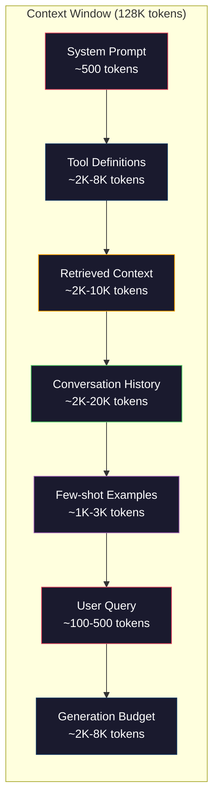
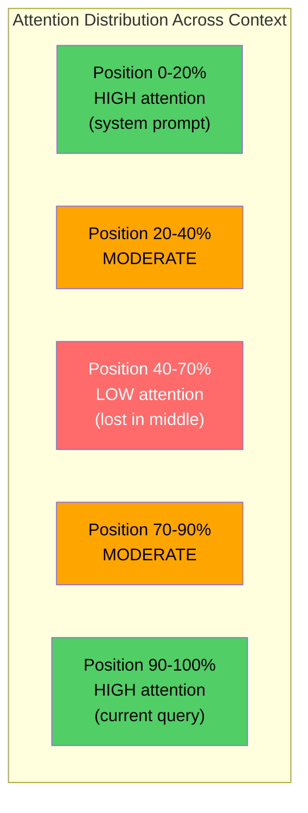
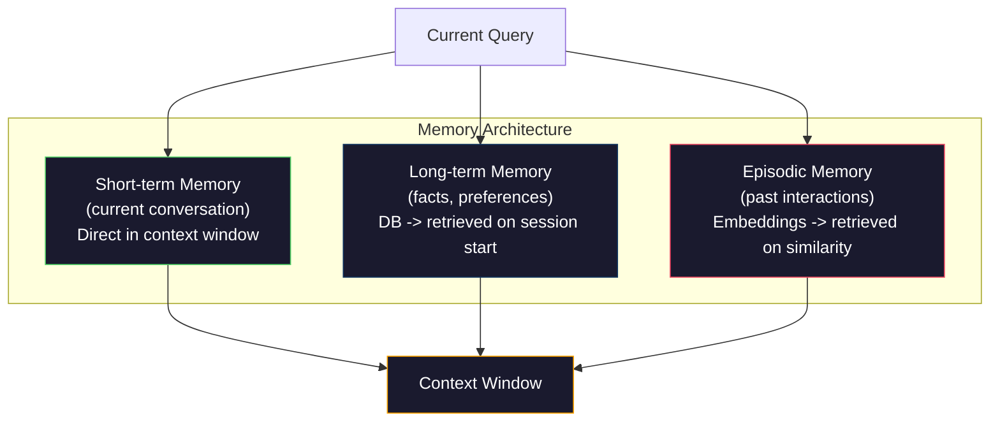

# Context Engineering: Okna, Budżety, Pamięć i Wyszukiwanie

> Prompt engineering to podzbiór. Context engineering to cała gra. Prompt to string, który wpisujesz. Kontekst to wszystko, co trafia do okna modelu: instrukcje systemowe, wyszukane dokumenty, definicje narzędzi, historia rozmowy, przykłady few-shot i sam prompt. Najlepsi inżynierowie AI w 2026 roku to inżynierowie kontekstu. Decydują, co trafia do środka, co pozostaje na zewnątrz i w jakiej kolejności.

**Type:** Build
**Languages:** Python
**Prerequisites:** Phase 10 (LLMs from Scratch), Phase 11 Lesson 01-02
**Time:** ~90 minutes
**Related:** Phase 11 · 15 (Prompt Caching) — the cache-friendly layout is an extension of context engineering. Phase 5 · 28 (Long-Context Evaluation) for how to measure lost-in-the-middle with NIAH/RULER.

## Learning Objectives

- Obliczaj budżety tokenów dla wszystkich komponentów okna kontekstowego (system prompt, narzędzia, historia, wyszukane dokumenty, przestrzeń na generację)
- Implementuj strategie zarządzania oknem kontekstowym: przycinanie, podsumowywanie i przesuwane okno dla historii rozmowy
- Priorytetyzuj i porządkuj komponenty kontekstu, aby zmaksymalizować uwagę modelu na najbardziej istotnych informacjach
- Zbuduj asembler kontekstu, który dynamicznie alokuje tokeny na podstawie typu zapytania i dostępnego miejsca w oknie

## Problem

Claude Opus 4.7 ma okno 200K tokenów (1M w becie). GPT-5 ma 400K. Gemini 3 Pro ma 2M. Llama 4 twierdzi, że ma 10M. Te liczby brzmią ogromnie, dopóki ich nie wypełnisz.

Oto rzeczywisty podział dla asystenta kodowania. System prompt: 500 tokenów. Definicje 50 narzędzi: 8 000 tokenów. Wyszukana dokumentacja: 4 000 tokenów. Historia rozmowy (10 tur): 6 000 tokenów. Aktualne zapytanie użytkownika: 200 tokenów. Budżet generacji (maks. wyjście): 4 000 tokenów. Razem: 22 700 tokenów. To tylko 18% okna 128K.

Ale uwaga nie skaluje się liniowo z długością kontekstu. Model z 128K tokenami kontekstu płaci kwadratowy koszt uwagi (O(n^2) w waniliowych transformatorach, choć większość produkcyjnych modeli używa wydajnych wariantów uwagi). Co ważniejsze, dokładność wyszukiwania degraduje się. Test „Needle in a Haystack" pokazuje, że modele mają trudności ze znalezieniem informacji umieszczonych w środku długich kontekstów. Badania Liu i in. (2023) pokazały, że LLMy wyszukują informacje na początku i na końcu długich kontekstów z prawie idealną dokładnością, ale dokładność spada o 10-20% dla informacji umieszczonych w środku (pozycje 40-70% kontekstu). Ten efekt „lost-in-the-middle" różni się w zależności od modelu, ale dotyczy wszystkich obecnych architektur.

Praktyczna lekcja: posiadanie 200K dostępnych tokenów nie oznacza, że używanie 200K tokenów jest skuteczne. Starannie wyselekcjonowany kontekst 10K tokenów często przewyższa zrzucony kontekst 100K tokenów. Context engineering to dyscyplina maksymalizacji stosunku sygnału do szumu w oknie kontekstowym.

Każdy token, który umieścisz w oknie, wypiera token, który mógłby nieść bardziej istotne informacje. Każda nieistotna definicja narzędzia, każda nieaktualna tura rozmowy, każdy fragment wyszukanego tekstu, który nie odpowiada na pytanie — każdy z nich sprawia, że model jest nieco gorszy w zadaniu.

## Koncepcja

### Okno Kontekstowe to Zasób Ograniczony

Myśl o oknie kontekstowym jak o RAM, nie dysku. Jest szybkie i bezpośrednio dostępne, ale ograniczone. Nie możesz zmieścić wszystkiego. Musisz wybierać.



Każdy komponent konkuruje o miejsce. Dodanie większej liczby definicji narzędzi oznacza mniej miejsca na historię rozmowy. Dodanie większej liczby wyszukanych kontekstów oznacza mniej miejsca na przykłady few-shot. Context engineering to sztuka alokowania tego budżetu w celu maksymalizacji wydajności zadania.

### Lost-in-the-Middle

Najważniejsze empiryczne odkrycie w inżynierii kontekstu. Modele lepiej przetwarzają informacje na początku i na końcu kontekstu. Informacje w środku otrzymują niższe wyniki uwagi i są bardziej narażone na zignorowanie.

Liu i in. (2023) przetestowali to systematycznie. Umieścili istotny dokument wśród 20 nieistotnych dokumentów na różnych pozycjach i zmierzyli dokładność odpowiedzi. Gdy istotny dokument był pierwszy lub ostatni, dokładność wynosiła 85-90%. Gdy był w środku (pozycja 10 z 20), dokładność spadała do 60-70%.

Ma to bezpośrednie implikacje inżynieryjne:

- Umieść najważniejsze informacje jako pierwsze (system prompt, krytyczne instrukcje)
- Umieść bieżące zapytanie i najbardziej istotny kontekst jako ostatnie (bias świeżości pomaga)
- Traktuj środek kontekstu jako strefę najniższego priorytetu
- Jeśli musisz umieścić informację w środku, zduplikuj kluczowy punkt na końcu



### Komponenty Kontekstu

**System prompt**: ustawia personę, ograniczenia i reguły behawioralne. Jest pierwszy i pozostaje stały między turami. Claude Code używa około 6 000 tokenów na swój system prompt, w tym definicje narzędzi i instrukcje behawioralne. Utrzymuj go zwięzłym. Każde słowo w system prompt jest powtarzane przy każdym wywołaniu API.

**Definicje narzędzi**: każde narzędzie dodaje 50-200 tokenów (nazwa, opis, schemat parametrów). 50 narzędzi po 150 tokenów każde to 7 500 tokenów, zanim zacznie się jakakolwiek rozmowa. Dynamiczny wybór narzędzi — uwzględnianie tylko narzędzi istotnych dla bieżącego zapytania — może zmniejszyć to o 60-80%.

**Wyszukany kontekst**: dokumenty z bazy wektorowej, wyniki wyszukiwania, zawartość plików. Jakość wyszukiwania bezpośrednio determinuje jakość odpowiedzi. Złe wyszukiwanie jest gorsze niż brak wyszukiwania — wypełnia okno szumem i aktywnie wprowadza model w błąd.

**Historia rozmowy**: każda poprzednia wiadomość użytkownika i odpowiedź asystenta. Rośnie liniowo z długością rozmowy. Rozmowa 50 tur po 200 tokenów na turę to 10 000 tokenów historii. Większość z nich jest nieistotna dla bieżącego zapytania.

**Przykłady Few-Shot**: pary wejścia/wyjścia, które demonstrują pożądane zachowanie. Dwa do trzech dobrze dobranych przykładów często poprawia jakość wyjścia bardziej niż tysiące tokenów instrukcji. Ale kosztują miejsce.

**Budżet generacji**: tokeny zarezerwowane na odpowiedź modelu. Jeśli wypełnisz okno do pełna, model nie ma miejsca na odpowiedź. Zarezerwuj co najmniej 2 000-4 000 tokenów na generację.

### Strategie Kompresji Kontekstu

**Podsumowywanie historii**: zamiast przechowywać wszystkie poprzednie tury dosłownie, okresowo podsumowuj rozmowę. „Omówiliśmy X, zdecydowaliśmy Y, a użytkownik chce Z" w 100 tokenach zastępuje 10 tur, które zajęły 2 000 tokenów. Uruchom podsumowywanie, gdy historia przekroczy próg (np. 5 000 tokenów).

**Filtrowanie relevancji**: oceń każdy wyszukany dokument względem bieżącego zapytania i odrzuć dokumenty poniżej progu. Jeśli wyszukałeś 10 fragmentów, ale tylko 3 są istotne, odrzuć pozostałe 7. Lepiej mieć 3 wysoce istotne fragmenty niż 10 przeciętnych.

**Przycinanie narzędzi**: sklasyfikuj intencję zapytania użytkownika i uwzględnij tylko narzędzia istotne dla tej intencji. Pytanie o kod nie potrzebuje narzędzi kalendarza. Pytanie o harmonogram nie potrzebuje narzędzi systemu plików. Może to zmniejszyć definicje narzędzi z 8 000 tokenów do 1 000.

**Rekurencyjne podsumowywanie**: dla bardzo długich dokumentów, podsumowuj etapami. Najpierw podsumuj każdą sekcję, następnie podsumuj podsumowania. 50-stronicowy dokument staje się 500-tokenowym digestem, który przechwytuje kluczowe punkty.

### Systemy Pamięci

Context engineering obejmuje trzy horyzonty czasowe.

**Pamięć krótkoterminowa**: bieżąca rozmowa. Przechowywana bezpośrednio w oknie kontekstowym. Rośnie z każdą turą. Zarządzana przez podsumowywanie i przycinanie.

**Pamięć długoterminowa**: fakty i preferencje, które utrzymują się między rozmowami. „Użytkownik preferuje TypeScript." „Projekt używa PostgreSQL." Przechowywana w bazie danych, wyszukiwana na początku sesji. Claude Code przechowuje to w plikach CLAUDE.md. ChatGPT przechowuje to w swojej funkcji pamięci.

**Pamięć epizodyczna**: konkretne przeszłe interakcje, które mogą być istotne. „W zeszły wtorek debugowaliśmy podobny problem w module auth." Przechowywana jako embeddingi, wyszukiwana, gdy bieżąca rozmowa pasuje do przeszłego epizodu.



### Dynamiczny Asembler Kontekstu

Kluczowy insight: różne zapytania potrzebują różnego kontekstu. Statyczny system prompt + statyczne narzędzia + statyczna historia są marnotrawne. Najlepsze systemy dynamicznie składają kontekst na zapytanie.

1. Sklasyfikuj intencję zapytania
2. Wybierz istotne narzędzia (nie wszystkie)
3. Wyszukaj istotne dokumenty (nie stały zestaw)
4. Uwzględnij istotne tury historii (nie całą historię)
5. Dodaj przykłady few-shot pasujące do typu zadania
6. Uporządkuj wszystko według ważności: krytyczne pierwsze, ważne ostatnie, opcjonalne w środku

To odróżnia dobrą aplikację AI od świetnej. Model jest ten sam. Kontekst jest wyróżnikiem.

## Build It

### Krok 1: Licznik Tokenów

Nie możesz budżetować tego, czego nie możesz zmierzyć. Zbuduj prosty licznik tokenów (przybliżenie używające dzielenia białymi znakami, ponieważ dokładna liczba zależy od tokenizera).

```python
import json
import numpy as np
from collections import OrderedDict

def count_tokens(text):
    if not text:
        return 0
    return int(len(text.split()) * 1.3)

def count_tokens_json(obj):
    return count_tokens(json.dumps(obj))
```

### Krok 2: Menedżer Budżetu Kontekstu

Podstawowa abstrakcja. Menedżer budżetu śledzi, ile tokenów używa każdy komponent i egzekwuje limity.

```python
class ContextBudget:
    def __init__(self, max_tokens=128000, generation_reserve=4000):
        self.max_tokens = max_tokens
        self.generation_reserve = generation_reserve
        self.available = max_tokens - generation_reserve
        self.allocations = OrderedDict()

    def allocate(self, component, content, max_tokens=None):
        tokens = count_tokens(content)
        if max_tokens and tokens > max_tokens:
            words = content.split()
            target_words = int(max_tokens / 1.3)
            content = " ".join(words[:target_words])
            tokens = count_tokens(content)

        used = sum(self.allocations.values())
        if used + tokens > self.available:
            allowed = self.available - used
            if allowed <= 0:
                return None, 0
            words = content.split()
            target_words = int(allowed / 1.3)
            content = " ".join(words[:target_words])
            tokens = count_tokens(content)

        self.allocations[component] = tokens
        return content, tokens

    def remaining(self):
        used = sum(self.allocations.values())
        return self.available - used

    def utilization(self):
        used = sum(self.allocations.values())
        return used / self.max_tokens

    def report(self):
        total_used = sum(self.allocations.values())
        lines = []
        lines.append(f"Context Budget Report ({self.max_tokens:,} token window)")
        lines.append("-" * 50)
        for component, tokens in self.allocations.items():
            pct = tokens / self.max_tokens * 100
            bar = "#" * int(pct / 2)
            lines.append(f"  {component:<25} {tokens:>6} tokens ({pct:>5.1f}%) {bar}")
        lines.append("-" * 50)
        lines.append(f"  {'Used':<25} {total_used:>6} tokens ({total_used/self.max_tokens*100:.1f}%)")
        lines.append(f"  {'Generation reserve':<25} {self.generation_reserve:>6} tokens")
        lines.append(f"  {'Remaining':<25} {self.remaining():>6} tokens")
        return "\n".join(lines)
```

### Krok 3: Zmiana Kolejności Lost-in-the-Middle

Implementuj strategię zmiany kolejności: najważniejsze elementy idą pierwsze i ostatnie, najmniej ważne w środku.

```python
def reorder_lost_in_middle(items, scores):
    paired = sorted(zip(scores, items), reverse=True)
    sorted_items = [item for _, item in paired]

    if len(sorted_items) <= 2:
        return sorted_items

    first_half = sorted_items[::2]
    second_half = sorted_items[1::2]
    second_half.reverse()

    return first_half + second_half

def score_relevance(query, documents):
    query_words = set(query.lower().split())
    scores = []
    for doc in documents:
        doc_words = set(doc.lower().split())
        if not query_words:
            scores.append(0.0)
            continue
        overlap = len(query_words & doc_words) / len(query_words)
        scores.append(round(overlap, 3))
    return scores
```

### Krok 4: Kompresor Historii Rozmowy

Podsumowuj stare tury rozmów, aby odzyskać budżet tokenów.

```python
class ConversationManager:
    def __init__(self, max_history_tokens=5000):
        self.turns = []
        self.summaries = []
        self.max_history_tokens = max_history_tokens

    def add_turn(self, role, content):
        self.turns.append({"role": role, "content": content})
        self._compress_if_needed()

    def _compress_if_needed(self):
        total = sum(count_tokens(t["content"]) for t in self.turns)
        if total <= self.max_history_tokens:
            return

        while total > self.max_history_tokens and len(self.turns) > 4:
            old_turns = self.turns[:2]
            summary = self._summarize_turns(old_turns)
            self.summaries.append(summary)
            self.turns = self.turns[2:]
            total = sum(count_tokens(t["content"]) for t in self.turns)

    def _summarize_turns(self, turns):
        parts = []
        for t in turns:
            content = t["content"]
            if len(content) > 100:
                content = content[:100] + "..."
            parts.append(f"{t['role']}: {content}")
        return "Previous: " + " | ".join(parts)

    def get_context(self):
        parts = []
        if self.summaries:
            parts.append("[Conversation Summary]")
            for s in self.summaries:
                parts.append(s)
        parts.append("[Recent Conversation]")
        for t in self.turns:
            parts.append(f"{t['role']}: {t['content']}")
        return "\n".join(parts)

    def token_count(self):
        return count_tokens(self.get_context())
```

### Krok 5: Dynamiczny Selektor Narzędzi

Uwzględniaj tylko narzędzia istotne dla bieżącego zapytania. Sklasyfikuj intencję, następnie filtruj.

```python
TOOL_REGISTRY = {
    "read_file": {
        "description": "Read contents of a file",
        "tokens": 120,
        "categories": ["code", "files"],
    },
    "write_file": {
        "description": "Write content to a file",
        "tokens": 150,
        "categories": ["code", "files"],
    },
    "search_code": {
        "description": "Search for patterns in codebase",
        "tokens": 130,
        "categories": ["code"],
    },
    "run_command": {
        "description": "Execute a shell command",
        "tokens": 140,
        "categories": ["code", "system"],
    },
    "create_calendar_event": {
        "description": "Create a new calendar event",
        "tokens": 180,
        "categories": ["calendar"],
    },
    "list_emails": {
        "description": "List recent emails",
        "tokens": 160,
        "categories": ["email"],
    },
    "send_email": {
        "description": "Send an email message",
        "tokens": 200,
        "categories": ["email"],
    },
    "web_search": {
        "description": "Search the web for information",
        "tokens": 140,
        "categories": ["research"],
    },
    "query_database": {
        "description": "Run a SQL query on the database",
        "tokens": 170,
        "categories": ["code", "data"],
    },
    "generate_chart": {
        "description": "Generate a chart from data",
        "tokens": 190,
        "categories": ["data", "visualization"],
    },
}

def classify_intent(query):
    query_lower = query.lower()

    intent_keywords = {
        "code": ["code", "function", "bug", "error", "file", "implement", "refactor", "debug", "test"],
        "calendar": ["meeting", "schedule", "calendar", "appointment", "event"],
        "email": ["email", "mail", "send", "inbox", "message"],
        "research": ["search", "find", "what is", "how does", "explain", "look up"],
        "data": ["data", "query", "database", "chart", "graph", "analytics", "sql"],
    }

    scores = {}
    for intent, keywords in intent_keywords.items():
        score = sum(1 for kw in keywords if kw in query_lower)
        if score > 0:
            scores[intent] = score

    if not scores:
        return ["code"]

    max_score = max(scores.values())
    return [intent for intent, score in scores.items() if score >= max_score * 0.5]

def select_tools(query, token_budget=2000):
    intents = classify_intent(query)
    relevant = {}
    total_tokens = 0

    for name, tool in TOOL_REGISTRY.items():
        if any(cat in intents for cat in tool["categories"]):
            if total_tokens + tool["tokens"] <= token_budget:
                relevant[name] = tool
                total_tokens += tool["tokens"]

    return relevant, total_tokens
```

### Krok 6: Pełny Pipeline Asemblacji Kontekstu

Połącz wszystko. Mając zapytanie, dynamicznie złóż optymalny kontekst.

```python
class ContextEngine:
    def __init__(self, max_tokens=128000, generation_reserve=4000):
        self.budget = ContextBudget(max_tokens, generation_reserve)
        self.conversation = ConversationManager(max_history_tokens=5000)
        self.system_prompt = (
            "You are a helpful AI assistant. You have access to tools for "
            "code editing, file management, web search, and data analysis. "
            "Use the appropriate tools for each task. Be concise and accurate."
        )
        self.knowledge_base = [
            "Python 3.12 introduced type parameter syntax for generic classes using bracket notation.",
            "The project uses PostgreSQL 16 with pgvector for embedding storage.",
            "Authentication is handled by Supabase Auth with JWT tokens.",
            "The frontend is built with Next.js 15 using the App Router.",
            "API rate limits are set to 100 requests per minute per user.",
            "The deployment pipeline uses GitHub Actions with Docker multi-stage builds.",
            "Test coverage must be above 80% for all new modules.",
            "The codebase follows the repository pattern for data access.",
        ]

    def assemble(self, query):
        self.budget = ContextBudget(self.budget.max_tokens, self.budget.generation_reserve)

        system_content, _ = self.budget.allocate("system_prompt", self.system_prompt, max_tokens=1000)

        tools, tool_tokens = select_tools(query, token_budget=2000)
        tool_text = json.dumps(list(tools.keys()))
        tool_content, _ = self.budget.allocate("tools", tool_text, max_tokens=2000)

        relevance = score_relevance(query, self.knowledge_base)
        threshold = 0.1
        relevant_docs = [
            doc for doc, score in zip(self.knowledge_base, relevance)
            if score >= threshold
        ]

        if relevant_docs:
            doc_scores = [s for s in relevance if s >= threshold]
            reordered = reorder_lost_in_middle(relevant_docs, doc_scores)
            doc_text = "\n".join(reordered)
            doc_content, _ = self.budget.allocate("retrieved_context", doc_text, max_tokens=3000)

        history_text = self.conversation.get_context()
        if history_text.strip():
            history_content, _ = self.budget.allocate("conversation_history", history_text, max_tokens=5000)

        query_content, _ = self.budget.allocate("user_query", query, max_tokens=500)

        return self.budget

    def chat(self, query):
        self.conversation.add_turn("user", query)
        budget = self.assemble(query)
        response = f"[Response to: {query[:50]}...]"
        self.conversation.add_turn("assistant", response)
        return budget


def run_demo():
    print("=" * 60)
    print("  Context Engineering Pipeline Demo")
    print("=" * 60)

    engine = ContextEngine(max_tokens=128000, generation_reserve=4000)

    print("\n--- Query 1: Code task ---")
    budget = engine.chat("Fix the bug in the authentication module where JWT tokens expire too early")
    print(budget.report())

    print("\n--- Query 2: Research task ---")
    budget = engine.chat("What is the best approach for implementing vector search in PostgreSQL?")
    print(budget.report())

    print("\n--- Query 3: After conversation history builds up ---")
    for i in range(8):
        engine.conversation.add_turn("user", f"Follow-up question number {i+1} about the implementation details of the system")
        engine.conversation.add_turn("assistant", f"Here is the response to follow-up {i+1} with technical details about the architecture")

    budget = engine.chat("Now implement the changes we discussed")
    print(budget.report())

    print("\n--- Tool Selection Examples ---")
    test_queries = [
        "Fix the bug in auth.py",
        "Schedule a meeting with the team for Tuesday",
        "Show me the database query performance stats",
        "Search for best practices on error handling",
    ]

    for q in test_queries:
        tools, tokens = select_tools(q)
        intents = classify_intent(q)
        print(f"\n  Query: {q}")
        print(f"  Intents: {intents}")
        print(f"  Tools: {list(tools.keys())} ({tokens} tokens)")

    print("\n--- Lost-in-the-Middle Reordering ---")
    docs = ["Doc A (most relevant)", "Doc B (somewhat relevant)", "Doc C (least relevant)",
            "Doc D (relevant)", "Doc E (moderately relevant)"]
    scores = [0.95, 0.60, 0.20, 0.80, 0.50]
    reordered = reorder_lost_in_middle(docs, scores)
    print(f"  Original order: {docs}")
    print(f"  Scores:         {scores}")
    print(f"  Reordered:      {reordered}")
    print(f"  (Most relevant at start and end, least relevant in middle)")
```

## Use It

### Strategia Kontekstu Claude Code

Claude Code zarządza kontekstem za pomocą warstwowego podejścia. System prompt zawiera reguły behawioralne i definicje narzędzi (~6K tokenów). Gdy otwierasz plik, jego zawartość jest wstrzykiwana jako kontekst. Gdy szukasz, wyniki są dodawane. Stare tury rozmowy są podsumowywane. CLAUDE.md zapewnia pamięć długoterminową, która utrzymuje się między sesjami.

Kluczowa decyzja inżynieryjna: Claude Code nie zrzuca całego twojego codebase'u do kontekstu. Wyszukuje istotne pliki na żądanie. To jest context engineering w praktyce.

### Dynamiczne Ładowanie Kontekstu Cursor

Cursor indeksuje cały twój codebase do embeddingów. Gdy wpisujesz zapytanie, wyszukuje najbardziej istotne pliki i bloki kodu używając podobieństwa wektorowego. Tylko te fragmenty trafiają do okna kontekstowego. Codebase 500K linii jest kompresowany do 5-10 najbardziej istotnych bloków kodu.

To jest wzorzec: embeduj wszystko, wyszukuj na żądanie, uwzględniaj tylko to, co ma znaczenie.

### Pamięć ChatGPT

ChatGPT przechowuje preferencje użytkownika i fakty jako pamięć długoterminową. Na początku każdej rozmowy, istotne wspomnienia są wyszukiwane i dołączane do system promptu. „Użytkownik preferuje Python" kosztuje 5 tokenów, ale oszczędza setki tokenów powtarzanych instrukcji między rozmowami.

### RAG jako Context Engineering

Retrieval-Augmented Generation to sformalizowany context engineering. Zamiast wpychać wiedzę do wag modelu (trenowanie) lub system promptu (statyczny kontekst), wyszukujesz istotne dokumenty w czasie zapytania i wstrzykujesz je do okna kontekstowego. Cały pipeline RAG — dzielenie, embedowanie, wyszukiwanie, rerankowanie — istnieje, aby rozwiązać jeden problem: umieszczenie właściwych informacji w oknie kontekstowym.

## Ship It

Ta lekcja produkuje `outputs/prompt-context-optimizer.md` — wielokrotnego użytku prompt, który audytuje strategię asemblacji kontekstu i rekomenduje optymalizacje. Podaj swój system prompt, liczbę narzędzi, średnią długość historii i strategię wyszukiwania, a zidentyfikuje marnotrawstwo tokenów i zasugeruje ulepszenia.

Produkuje również `outputs/skill-context-engineering.md` — framework decyzyjny do projektowania pipeline'ów asemblacji kontekstu na podstawie typu zadania, rozmiaru okna kontekstowego i budżetu opóźnienia.

## Ćwiczenia

1. Dodaj „detektor marnotrawstwa tokenów" do klasy ContextBudget. Powinien flagować komponenty używające więcej niż 30% budżetu i sugerować strategie kompresji specyficzne dla każdego typu komponentu (podsumuj historię, przytnij narzędzia, rerankuj dokumenty).

2. Zaimplementuj semantyczną deduplikację dla wyszukanego kontekstu. Jeśli dwa wyszukane dokumenty są w więcej niż 80% podobne (przez pokrycie słów lub podobieństwo cosinusowe ich embeddingów), zachowaj tylko ten z wyższym wynikiem. Zmierz, ile budżetu tokenów to odzyskuje.

3. Zbuduj narzędzie do „odtwarzania kontekstu". Mając transkrypt rozmowy, odtwórz go przez ContextEngine i wizualizuj, jak alokacja budżetu zmienia się tura po turze. Narysuj użycie tokenów na komponent w czasie. Zidentyfikuj turę, w której kontekst zaczyna być kompresowany.

4. Zaimplementuj selektor narzędzi oparty na priorytetach. Zamiast binarnego włącz/wyłącz, przypisz każdemu narzędziu wynik relevancji do bieżącego zapytania. Uwzględniaj narzędzia w kolejności malejącej relevancji, aż budżet narzędzi zostanie wyczerpany. Porównaj wydajność zadania z 5, 10, 20 i 50 uwzględnionymi narzędziami.

5. Zbuduj wielostrategiczny kompresor kontekstu. Zaimplementuj trzy strategie kompresji (przycinanie, podsumowywanie, ekstrakcja kluczowych zdań) i porównaj je na zestawie 20 dokumentów. Zmierz kompromis między współczynnikiem kompresji a zachowaniem informacji (czy skompresowana wersja wciąż zawiera odpowiedź na pytanie?).

## Kluczowe Terminy

| Termin | Co ludzie mówią | Co to naprawdę oznacza |
|--------|-----------------|------------------------|
| Context window | „Ile model może przeczytać" | Maksymalna liczba tokenów (wejście + wyjście), które model przetwarza w pojedynczym przejściu w przód — 400K dla GPT-5, 200K (1M beta) dla Claude Opus 4.7, 2M dla Gemini 3 Pro |
| Context engineering | „Zaawansowany prompt engineering" | Dyscyplina decydowania, co trafia do okna kontekstowego, w jakiej kolejności i z jakim priorytetem — obejmuje wyszukiwanie, kompresję, wybór narzędzi i zarządzanie pamięcią |
| Lost-in-the-middle | „Modele zapominają rzeczy w środku" | Empiryczne odkrycie, że LLMy lepiej przetwarzają początek i koniec kontekstu, z 10-20% spadkiem dokładności dla informacji umieszczonych w środku |
| Token budget | „Ile tokenów ci zostało" | Jawna alokacja pojemności okna kontekstowego między komponenty (system prompt, narzędzia, historia, wyszukiwanie, generacja) z limitami na komponent |
| Dynamic context | „Ładowanie rzeczy na bieżąco" | Składanie okna kontekstowego inaczej dla każdego zapytania na podstawie klasyfikacji intencji, wyboru istotnych narzędzi i wyników wyszukiwania |
| History summarization | „Kompresowanie rozmowy" | Zastępowanie dosłownych starych tur rozmowy zwięzłym podsumowaniem, zmniejszając koszt tokenów przy zachowaniu kluczowych informacji |
| Tool pruning | „Uwzględnianie tylko istotnych narzędzi" | Klasyfikowanie intencji zapytania i uwzględnianie tylko definicji narzędzi, które pasują, zmniejszając koszt tokenów narzędzi o 60-80% |
| Long-term memory | „Pamiętanie między sesjami" | Fakty i preferencje przechowywane w bazie danych i wyszukiwane na początku sesji — CLAUDE.md, ChatGPT Memory i podobne systemy |
| Episodic memory | „Pamiętanie konkretnych przeszłych zdarzeń" | Przeszłe interakcje przechowywane jako embeddingi i wyszukiwane, gdy bieżące zapytanie jest podobne do przeszłej rozmowy |
| Generation budget | „Miejsce na odpowiedź" | Tokeny zarezerwowane na wyjście modelu — jeśli kontekst wypełnia okno całkowicie, model nie ma miejsca na odpowiedź |

## Dalsza Lektura

- [Liu i in., 2023 -- "Lost in the Middle: How Language Models Use Long Contexts"](https://arxiv.org/abs/2307.03172) -- ostateczne badanie uwagi zależnej od pozycji, pokazujące, że modele mają trudności z informacjami w środku długich kontekstów
- [Anthropic's Contextual Retrieval blog post](https://www.anthropic.com/news/contextual-retrieval) -- jak Anthropic podchodzi do świadomego kontekstu wyszukiwania fragmentów, zmniejszając niepowodzenia wyszukiwania o 49%
- [Simon Willison's "Context Engineering"](https://simonwillison.net/2025/Jun/27/context-engineering/) -- wpis na blogu, który nazwał dyscyplinę i odróżnił ją od prompt engineeringu
- [LangChain documentation on RAG](https://python.langchain.com/docs/tutorials/rag/) -- praktyczna implementacja retrieval-augmented generation jako wzorca context engineeringu
- [Greg Kamradt's Needle in a Haystack test](https://github.com/gkamradt/LLMTest_NeedleInAHaystack) -- benchmark, który ujawnił zależne od pozycji niepowodzenia wyszukiwania we wszystkich głównych modelach
- [Pope i in., "Efficiently Scaling Transformer Inference" (2022)](https://arxiv.org/abs/2211.05102) -- dlaczego długość kontekstu napędza pamięć i opóźnienie oraz jak KV cache, MQA i GQA zmieniają obliczenia budżetu.
- [Agrawal i in., "SARATHI: Efficient LLM Inference by Piggybacking Decodes with Chunked Prefills" (2023)](https://arxiv.org/abs/2308.16369) -- dwie fazy inferencji, które sprawiają, że długie prompte są drogie w TTFT, ale tanie w TPOT; prawda stojąca za kompromisami pakowania kontekstu.
- [Ainslie i in., "GQA: Training Generalized Multi-Query Transformer Models from Multi-Head Checkpoints" (EMNLP 2023)](https://arxiv.org/abs/2305.13245) -- praca o grouped-query attention, która zmniejszyła pamięć KV 8× w produkcyjnych dekoderach bez utraty jakości.