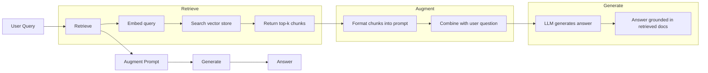
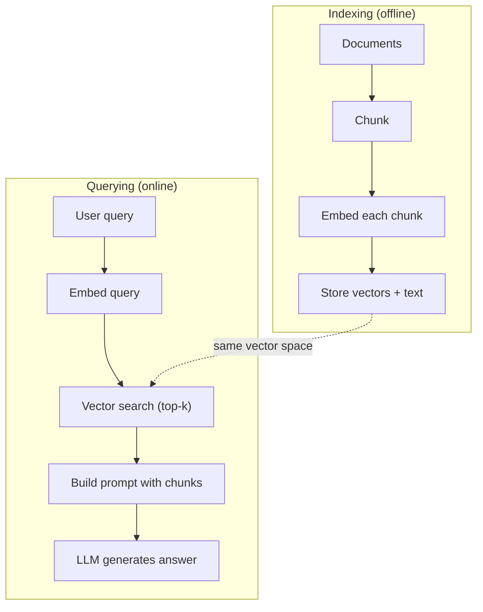

# RAG (Retrieval-Augmented Generation)

> Twój LLM wie wszystko do swojej daty granicznej treningu. Nie wie nic o dokumentach twojej firmy, twojej bazie kodu ani notatkach z ostatniego spotkania. RAG rozwiązuje to, pobierając odpowiednie dokumenty i umieszczając je w prompcie. To najczęściej wdrażany wzorzec w produkcyjnym AI. Jeśli z tego kursu zbudujesz tylko jedną rzecz, zbuduj potok RAG.

**Type:** Build
**Languages:** Python
**Prerequisites:** Phase 10 (LLMs from Scratch), Phase 11 Lessons 01-05
**Time:** ~90 minutes
**Related:** Phase 5 · 23 (Chunking Strategies for RAG) for the six chunking algorithms and when each wins. Phase 5 · 22 (Embedding Models Deep Dive) for picking the embedder. Phase 11 · 07 (Advanced RAG) for hybrid search, reranking, and query transformation.

## Learning Objectives

- Zbuduj kompletny potok RAG: ładowanie dokumentów, dzielenie na fragmenty, osadzanie, przechowywanie wektorów, wyszukiwanie i generowanie
- Zaimplementuj wyszukiwanie semantyczne przy użyciu bazy wektorowej (ChromaDB, FAISS lub Pinecone) z odpowiednim indeksowaniem
- Wyjaśnij, dlaczego RAG jest preferowany nad fine-tuningiem w aplikacjach opartych na wiedzy (koszt, aktualność, atrybucja)
- Oceń jakość RAG za pomocą metryk wyszukiwania (precyzja, recall) i metryk generowania (wierność, trafność)

## The Problem

Budujesz chatbota dla swojej firmy. Klient pyta: "Jaka jest polityka zwrotów dla planów enterprise?" LLM odpowiada ogólną odpowiedzią o typowych politykach zwrotów SaaS. Rzeczywista polityka, ukryta w 200-stronicowej wewnętrznej wiki, mówi, że klienci enterprise mają 60-dniowe okno z proporcjonalnymi zwrotami. LLM nigdy nie widział tego dokumentu. Nie może wiedzieć, czego nie został nauczony.

Fine-tuning jest jednym rozwiązaniem. Weź LLM, wytrenuj go na swoich wewnętrznych dokumentach i wdróż zaktualizowany model. To działa, ale ma poważne problemy. Fine-tuning kosztuje tysiące dolarów za moc obliczeniową. Model staje się nieaktualny w momencie zmiany dokumentu. Nie masz sposobu, by dowiedzieć się, z jakiego źródła model korzystał. A jeśli firma w przyszłym miesiącu przejmie kolejną linię produktów, robisz fine-tuning od nowa.

RAG jest drugim rozwiązaniem. Pozostaw model nietknięty. Gdy pojawia się pytanie, przeszukaj swój magazyn dokumentów w poszukiwaniu odpowiednich fragmentów, wklej je do promptu przed pytaniem i pozwól modelowi odpowiedzieć, używając tych fragmentów jako kontekstu. Magazyn dokumentów można zaktualizować w minutach. Widzisz dokładnie, które dokumenty zostały pobrane. Sam model nigdy się nie zmienia. Dlatego RAG jest dominującym wzorcem w produkcji: jest tańszy, świeższy, bardziej audytowalny i działa z każdym LLM.

## The Concept

### The RAG Pattern

Cały wzorzec mieści się w czterech krokach:



Zapytanie -> Pobierz -> Rozszerz prompt -> Generuj. Każdy system RAG podąża za tym wzorcem. Różnice między produkcyjnymi systemami RAG tkwią w szczegółach każdego kroku: jak dzielisz na fragmenty, jak osadzasz, jak wyszukujesz i jak konstruujesz prompt.

### Why RAG Beats Fine-Tuning

| Concern | Fine-tuning | RAG |
|---------|------------|-----|
| Koszt | 1 000–100 000+ USD za sesję treningową | 0,01–0,10 USD za zapytanie (osadzanie + LLM) |
| Aktualność | Nieaktualny do czasu ponownego treningu | Aktualizowany w minutach przez ponowne indeksowanie dokumentów |
| Audytowalność | Nie można prześledzić odpowiedzi do źródła | Można pokazać dokładnie pobrane fragmenty |
| Halucynacje | Wciąż swobodnie halucynuje | Oparty na pobranych dokumentach |
| Prywatność danych | Dane treningowe wbudowane w wagi | Dokumenty pozostają w twoim magazynie wektorów |

Fine-tuning zmienia wagi modelu trwale. RAG zmienia kontekst modelu tymczasowo. W większości aplikacji tymczasowy kontekst jest tym, czego potrzebujesz.

Jedynym przypadkiem, w którym wygrywa fine-tuning, jest sytuacja, gdy potrzebujesz, aby model przyjął określony styl, ton lub wzorzec rozumowania, którego nie można osiągnąć przez samo promptowanie. W przypadku wyszukiwania wiedzy faktograficznej RAG wygrywa za każdym razem.

### Embedding Models

Model osadzania konwertuje tekst na gęsty wektor. Podobne teksty produkują wektory, które są blisko siebie w tej wielowymiarowej przestrzeni. "Jak zresetować hasło?" i "Muszę zmienić hasło" produkują prawie identyczne wektory, mimo że dzielą niewiele słów. "Kot siedział na macie" produkuje bardzo inny wektor.

Typowe modele osadzania (stan na 2026 — pełna analiza w Phase 5 · 22):

| Model | Dimensions | Provider | Notes |
|-------|-----------|----------|-------|
| text-embedding-3-small | 1536 (Matryoshka) | OpenAI | Najlepszy stosunek ceny do wydajności dla większości przypadków użycia |
| text-embedding-3-large | 3072 (Matryoshka) | OpenAI | Wyższa dokładność, możliwość przycięcia do 256/512/1024 |
| Gemini Embedding 2 | 3072 (Matryoshka) | Google | Najlepszy MTEB retrieval; 8K kontekstu |
| voyage-4 | 1024/2048 (Matryoshka) | Voyage AI | Warianty domenowe (kod, finanse, prawo) |
| Cohere embed-v4 | 1024 (Matryoshka) | Cohere | Silne wielojęzyczność, 128K kontekstu |
| BGE-M3 | 1024 (dense + sparse + ColBERT) | BAAI (open-weight) | Trzy widoki z jednego modelu |
| Qwen3-Embedding | 4096 (Matryoshka) | Alibaba (open-weight) | Najlepszy wynik retrieval wśród open-weight |
| all-MiniLM-L6-v2 | 384 | Open-weight (Sentence Transformers) | Linia bazowa do prototypowania |

Na potrzeby tej lekcji budujemy własne proste osadzanie przy użyciu TF-IDF. Nie dlatego, że TF-IDF jest używane w systemach produkcyjnych, ale dlatego, że konkretyzuje koncepcję: tekst wchodzi, wektor wychodzi, podobne teksty produkują podobne wektory.

### Vector Similarity

Mając dwa wektory, jak mierzysz podobieństwo? Trzy opcje:

**Cosine similarity**: cosinus kąta między dwoma wektorami. Zakres od -1 (przeciwne) do 1 (identyczne). Ignoruje wielkość, uwzględnia tylko kierunek. To domyślna miara dla RAG.

```
cosine_sim(a, b) = dot(a, b) / (||a|| * ||b||)
```

**Dot product**: surowy iloczyn skalarny. Większe wektory otrzymują wyższe wyniki. Przydatne, gdy wielkość niesie informację (dłuższe dokumenty mogą być bardziej trafne).

```
dot(a, b) = sum(a_i * b_i)
```

**L2 (Euclidean) distance**: odległość w linii prostej w przestrzeni wektorowej. Mniejsza odległość = większe podobieństwo. Wrażliwe na różnice w wielkości.

```
L2(a, b) = sqrt(sum((a_i - b_i)^2))
```

Cosine similarity jest standardem. Radzi sobie z dokumentami o różnej długości, ponieważ normalizuje przez wielkość. Kiedy ktoś mówi "wyszukiwanie wektorowe", prawie zawsze ma na myśli cosine similarity.

### Chunking Strategies

Dokumenty są zbyt długie, by osadzać je jako pojedyncze wektory. 50-stronicowy PDF może wyprodukować kiepskie osadzenie, ponieważ zawiera dziesiątki tematów. Zamiast tego dzielisz dokumenty na fragmenty i osadzasz każdy fragment osobno.

**Fixed-size chunking**: dziel co N tokenów. Proste i przewidywalne. Fragment 512 tokenów z nakładaniem 50 tokenów oznacza, że fragment 1 to tokeny 0-511, fragment 2 to tokeny 462-973 i tak dalej. Nakładanie zapewnia, że nie rozetniesz zdania w niefortunnym miejscu.

**Semantic chunking**: dziel przy naturalnych granicach. Akapity, sekcje lub nagłówki markdown. Każdy fragment jest spójną jednostką znaczeniową. Bardziej złożony w implementacji, ale daje lepsze wyniki wyszukiwania.

**Recursive chunking**: najpierw próbuj dzielić przy największych granicach (nagłówki sekcji). Jeśli sekcja jest wciąż za duża, dziel przy granicach akapitów. Jeśli akapit jest wciąż za duży, dziel przy granicach zdań. To podejście LangChain RecursiveCharacterTextSplitter i działa dobrze w praktyce.

Rozmiar fragmentu ma większe znaczenie, niż ludzie myślą:

- Zbyt mały (64-128 tokenów): każdemu fragmentowi brakuje kontekstu. "Wzrosło o 15% w zeszłym kwartale" nic nie znaczy bez wiedzy, do czego odnosi się "to".
- Zbyt duży (2048+ tokenów): każdy fragment obejmuje wiele tematów, rozwadniając trafność. Gdy szukasz danych o przychodach, dostajesz fragment, który jest w 10% o przychodach i w 90% o zatrudnieniu.
- Optymalny (256-512 tokenów): wystarczająco kontekstu, by być samodzielnym, wystarczająco skupionym, by być trafnym.

Większość produkcyjnych systemów RAG używa fragmentów 256-512 tokenów z nakładaniem 50 tokenów. Wytyczne RAG od Anthropic zalecają ten zakres.

### Vector Databases

Gdy masz osadzenia, potrzebujesz miejsca do ich przechowywania i przeszukiwania. Opcje:

| Database | Type | Best for |
|----------|------|----------|
| FAISS | Biblioteka (w procesie) | Prototypowanie, małe i średnie zbiory danych |
| Chroma | Lekka baza danych | Lokalny rozwój, małe wdrożenia |
| Pinecone | Zarządzana usługa | Produkcja bez narzutu operacyjnego |
| Weaviate | Otwartoźródłowa baza danych | Samodzielnie hostowana produkcja |
| pgvector | Rozszerzenie Postgres | Gdy już używasz Postgres |
| Qdrant | Otwartoźródłowa baza danych | Wydajna samodzielnie hostowana |

Na potrzeby tej lekcji budujemy prosty magazyn wektorów w pamięci. Przechowuje wektory na liście i wykonuje brute-force cosine similarity. Jest to odpowiednik FAISS z indeksem płaskim. Skaluje się do może 100 000 wektorów, zanim zwolni. Systemy produkcyjne używają algorytmów przybliżonych najbliższych sąsiadów (ANN), takich jak HNSW, aby przeszukiwać miliony wektorów w milisekundach.

### The Full Pipeline



Faza indeksowania uruchamiana jest raz na dokument (lub gdy dokumenty są aktualizowane). Faza zapytań uruchamiana jest przy każdym żądaniu użytkownika. W produkcji indeksowanie może przetwarzać miliony dokumentów przez wiele godzin. Zapytania muszą odpowiadać w czasie poniżej sekundy.

### Real Numbers

Większość produkcyjnych systemów RAG używa następujących parametrów:

- **k = 5 do 10** pobranych fragmentów na zapytanie
- **Rozmiar fragmentu = 256 do 512 tokenów** z nakładaniem 50 tokenów
- **Budżet kontekstu**: 2500-5000 tokenów pobranej treści na zapytanie
- **Całkowity prompt**: ~8000-16000 tokenów (system prompt + pobrane fragmenty + historia konwersacji + zapytanie użytkownika)
- **Wymiar osadzania**: 384-3072 w zależności od modelu
- **Przepustowość indeksowania**: 100-1000 dokumentów na sekundę z API osadzania
- **Opóźnienie zapytania**: 50-200ms dla wyszukiwania, 500-3000ms dla generowania

```figure
rag-chunking
```

## Build It

### Step 1: Document Chunking

```python
def chunk_text(text, chunk_size=200, overlap=50):
    words = text.split()
    chunks = []
    start = 0
    while start < len(words):
        end = start + chunk_size
        chunk = " ".join(words[start:end])
        chunks.append(chunk)
        start += chunk_size - overlap
    return chunks
```

### Step 2: TF-IDF Embeddings

Budujemy prostą funkcję osadzania. TF-IDF (Term Frequency-Inverse Document Frequency) nie jest neuronowym osadzaniem, ale konwertuje tekst na wektory w sposób, który oddaje ważność słów. Częste słowa w dokumencie mają wyższe TF. Rzadkie słowa w całym korpusie mają wyższe IDF. Iloczyn daje wektor, w którym ważne, charakterystyczne słowa mają wysokie wartości.

```python
import math
from collections import Counter

def build_vocabulary(documents):
    vocab = set()
    for doc in documents:
        vocab.update(doc.lower().split())
    return sorted(vocab)

def compute_tf(text, vocab):
    words = text.lower().split()
    count = Counter(words)
    total = len(words)
    return [count.get(word, 0) / total for word in vocab]

def compute_idf(documents, vocab):
    n = len(documents)
    idf = []
    for word in vocab:
        doc_count = sum(1 for doc in documents if word in doc.lower().split())
        idf.append(math.log((n + 1) / (doc_count + 1)) + 1)
    return idf

def tfidf_embed(text, vocab, idf):
    tf = compute_tf(text, vocab)
    return [t * i for t, i in zip(tf, idf)]
```

### Step 3: Cosine Similarity Search

```python
def cosine_similarity(a, b):
    dot = sum(x * y for x, y in zip(a, b))
    norm_a = math.sqrt(sum(x * x for x in a))
    norm_b = math.sqrt(sum(x * x for x in b))
    if norm_a == 0 or norm_b == 0:
        return 0.0
    return dot / (norm_a * norm_b)

def search(query_embedding, stored_embeddings, top_k=5):
    scores = []
    for i, emb in enumerate(stored_embeddings):
        sim = cosine_similarity(query_embedding, emb)
        scores.append((i, sim))
    scores.sort(key=lambda x: x[1], reverse=True)
    return scores[:top_k]
```

### Step 4: Prompt Construction

To jest miejsce, gdzie dzieje się "augmented" w RAG. Weź pobrane fragmenty, sformatuj je w prompt i poproś LLM o odpowiedź na podstawie dostarczonego kontekstu.

```python
def build_rag_prompt(query, retrieved_chunks):
    context = "\n\n---\n\n".join(
        f"[Source {i+1}]\n{chunk}"
        for i, chunk in enumerate(retrieved_chunks)
    )
    return f"""Answer the question based ONLY on the following context.
If the context doesn't contain enough information, say "I don't have enough information to answer that."

Context:
{context}

Question: {query}

Answer:"""
```

### Step 5: The Complete RAG Pipeline

```python
class RAGPipeline:
    def __init__(self):
        self.chunks = []
        self.embeddings = []
        self.vocab = []
        self.idf = []

    def index(self, documents):
        all_chunks = []
        for doc in documents:
            all_chunks.extend(chunk_text(doc))
        self.chunks = all_chunks
        self.vocab = build_vocabulary(all_chunks)
        self.idf = compute_idf(all_chunks, self.vocab)
        self.embeddings = [
            tfidf_embed(chunk, self.vocab, self.idf)
            for chunk in all_chunks
        ]

    def query(self, question, top_k=5):
        query_emb = tfidf_embed(question, self.vocab, self.idf)
        results = search(query_emb, self.embeddings, top_k)
        retrieved = [(self.chunks[i], score) for i, score in results]
        prompt = build_rag_prompt(
            question, [chunk for chunk, _ in retrieved]
        )
        return prompt, retrieved
```

### Step 6: Generation (simulated)

W produkcji tutaj wywołujesz API LLM. Na potrzeby tej lekcji symulujemy generowanie, wyodrębniając najbardziej trafne zdanie z pobranego kontekstu.

```python
def simple_generate(prompt, retrieved_chunks):
    query_words = set(prompt.lower().split("question:")[-1].split())
    best_sentence = ""
    best_score = 0
    for chunk in retrieved_chunks:
        for sentence in chunk.split("."):
            sentence = sentence.strip()
            if not sentence:
                continue
            words = set(sentence.lower().split())
            overlap = len(query_words & words)
            if overlap > best_score:
                best_score = overlap
                best_sentence = sentence
    return best_sentence if best_sentence else "I don't have enough information."
```

## Use It

Z prawdziwym modelem osadzania i LLM kod prawie się nie zmienia:

```python
from openai import OpenAI

client = OpenAI()

def embed(text):
    response = client.embeddings.create(
        model="text-embedding-3-small",
        input=text
    )
    return response.data[0].embedding

def generate(prompt):
    response = client.chat.completions.create(
        model="gpt-4o-mini",
        messages=[{"role": "user", "content": prompt}],
        temperature=0
    )
    return response.choices[0].message.content
```

Lub z Anthropic:

```python
import anthropic

client = anthropic.Anthropic()

def generate(prompt):
    response = client.messages.create(
        model="claude-sonnet-4-20250514",
        max_tokens=1024,
        messages=[{"role": "user", "content": prompt}]
    )
    return response.content[0].text
```

Potok jest ten sam. Zamień funkcję osadzania. Zamień funkcję generowania. Logika wyszukiwania, dzielenia na fragmenty, konstrukcji promptu — wszystko identyczne niezależnie od tego, których modeli używasz.

Do przechowywania wektorów na dużą skalę zastąp brute-force odpowiednią bazą wektorową:

```python
import chromadb

client = chromadb.Client()
collection = client.create_collection("my_docs")

collection.add(
    documents=chunks,
    ids=[f"chunk_{i}" for i in range(len(chunks))]
)

results = collection.query(
    query_texts=["What is the refund policy?"],
    n_results=5
)
```

Chroma obsługuje osadzanie wewnętrznie (domyślnie używa all-MiniLM-L6-v2) i przechowuje wektory w lokalnej bazie danych. Ten sam wzorzec, inna implementacja.

## Ship It

Ta lekcja produkuje:
- `outputs/prompt-rag-architect.md` — prompt do projektowania systemów RAG dla konkretnych przypadków użycia
- `outputs/skill-rag-pipeline.md` — umiejętność ucząca agentów budowania i debugowania potoków RAG

## Exercises

1. Zastąp osadzanie TF-IDF prostym podejściem bag-of-words (binarne: 1 jeśli słowo występuje, 0 jeśli nie). Porównaj jakość wyszukiwania na przykładowych dokumentach. TF-IDF powinno działać lepiej, ponieważ nadaje większą wagę rzadkim słowom.

2. Eksperymentuj z rozmiarami fragmentów: spróbuj 50, 100, 200 i 500 słów na tym samym zestawie dokumentów. Dla każdego rozmiaru uruchom te same 5 zapytań i policz, ile z nich zwraca trafny fragment w top-3. Znajdź optymalny punkt, w którym jakość wyszukiwania jest najwyższa.

3. Dodaj metadane do każdego fragmentu (nazwa dokumentu źródłowego, pozycja fragmentu). Zmodyfikuj szablon promptu, aby zawierał atrybucję źródła, tak aby LLM cytował swoje źródła.

4. Zaimplementuj prostą ewaluację: dla 10 par pytanie-odpowiedź, przeprowadź każde pytanie przez potok RAG i zmierz, jaki procent pobranych fragmentów zawiera odpowiedź. To jest retrieval recall at k.

5. Zbuduj potok RAG świadomy kontekstu rozmowy: utrzymuj historię ostatnich 3 wymian i dołączaj je do promptu wraz z pobranymi fragmentami. Przetestuj z pytaniami uzupełniającymi, takimi jak "A co z enterprise?" po zapytaniu o cennik.

## Key Terms

| Term | What people say | What it actually means |
|------|----------------|----------------------|
| RAG | "AI, które czyta twoje dokumenty" | Pobierz odpowiednie dokumenty, wklej je do promptu i wygeneruj odpowiedź opartą na tych dokumentach |
| Embedding | "Konwertuj tekst na liczby" | Gęsta wektorowa reprezentacja tekstu, w której podobne znaczenia produkują podobne wektory |
| Vector database | "Wyszukiwarka dla AI" | Magazyn danych zoptymalizowany do przechowywania wektorów i znajdowania najbliższych sąsiadów według podobieństwa |
| Chunking | "Dziel dokumenty na kawałki" | Dzielenie dokumentów na mniejsze segmenty (zazwyczaj 256-512 tokenów), aby każdy mógł być osadzony i wyszukiwany niezależnie |
| Cosine similarity | "Jak podobne są dwa wektory" | Cosinus kąta między dwoma wektorami; 1 = identyczny kierunek, 0 = ortogonalne, -1 = przeciwne |
| Top-k retrieval | "Pobierz k najlepszych dopasowań" | Zwróć k najbardziej podobnych fragmentów do zapytania z magazynu wektorów |
| Context window | "Ile tekstu LLM może zobaczyć" | Maksymalna liczba tokenów, które LLM może przetworzyć w jednym żądaniu; pobrane fragmenty muszą się w tym zmieścić |
| Augmented generation | "Odpowiadaj używając podanego kontekstu" | Generowanie odpowiedzi z użyciem pobranych dokumentów jako kontekstu, zamiast polegania wyłącznie na wyuczonej wiedzy |
| TF-IDF | "Ocena ważności słów" | Częstość terminu razy odwrotna częstość dokumentowa; waży słowa według tego, jak charakterystyczne są w korpusie |
| Indexing | "Przygotowanie dokumentów do wyszukiwania" | Proces offline dzielenia na fragmenty, osadzania i przechowywania dokumentów, aby mogły być wyszukiwane w czasie zapytania |

## Further Reading

- Lewis et al., "Retrieval-Augmented Generation for Knowledge-Intensive NLP Tasks" (2020) -- the original RAG paper from Facebook AI Research that formalized the retrieve-then-generate pattern
- Anthropic's RAG documentation (docs.anthropic.com) -- practical guidelines for chunk sizes, prompt construction, and evaluation
- Pinecone Learning Center, "What is RAG?" -- clear visual explanations of the RAG pipeline with production considerations
- Sentence-BERT: Reimers & Gurevych (2019) -- the paper behind the all-MiniLM embedding models, showing how to train bi-encoders for semantic similarity
- [Karpukhin et al., "Dense Passage Retrieval for Open-Domain Question Answering" (EMNLP 2020)](https://arxiv.org/abs/2004.04906) -- the DPR paper that proved dense bi-encoder retrieval beats BM25 on open-domain QA and set the pattern for modern RAG retrievers.
- [LlamaIndex High-Level Concepts](https://docs.llamaindex.ai/en/stable/getting_started/concepts.html) -- the main concepts to know when building RAG pipelines: data loaders, node parsers, indices, retrievers, response synthesizers.
- [LangChain RAG tutorial](https://python.langchain.com/docs/tutorials/rag/) -- the opposite-flavor orchestrator; chain-of-runnables view of the same retrieve-then-generate pattern.
