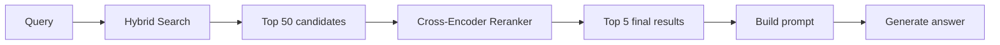
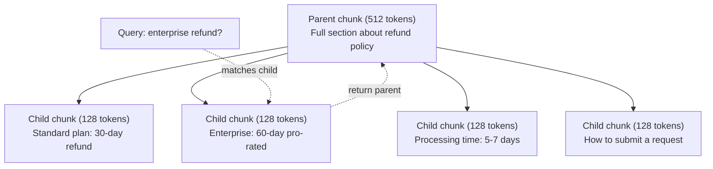
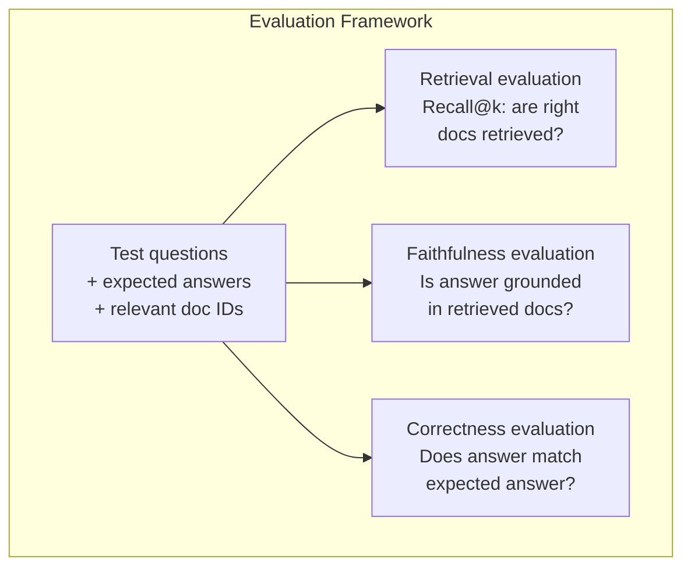

# Advanced RAG (Chunking, Reranking, Hybrid Search)

> Podstawowy RAG pobiera top-k najbardziej podobnych fragmentów. To działa w przypadku prostych pytań. Zawodzi przy wnioskowaniu wieloetapowym, niejednoznacznych zapytaniach i dużych korpusach. Zaawansowany RAG to różnica między demem działającym na 10 dokumentach a systemem działającym na 10 milionach.

**Type:** Build
**Languages:** Python
**Prerequisites:** Phase 11, Lesson 06 (RAG)
**Time:** ~90 minutes
**Related:** Phase 5 · 23 (Chunking Strategies for RAG) covers all six chunking algorithms — recursive, semantic, sentence, parent-document, late chunking, contextual retrieval — with Vectara/Anthropic benchmarks. This lesson builds on top: hybrid search, reranking, query transformation.

## Learning Objectives

- Zaimplementuj zaawansowane strategie dzielenia na fragmenty (semantyczne, rekurencyjne, rodzic-dziecko), które zachowują strukturę dokumentu i kontekst
- Zbuduj hybrydowy potok wyszukiwania łączący dopasowanie słów kluczowych BM25 z semantycznym wyszukiwaniem wektorowym i rerankerem cross-encoder
- Zastosuj techniki transformacji zapytań (HyDE, multi-query, step-back), aby poprawić wyszukiwanie przy niejednoznacznych lub złożonych pytaniach
- Diagnozuj i naprawiaj typowe problemy RAG: niewłaściwy fragment pobrany, odpowiedź poza kontekstem, załamanie wnioskowania wieloetapowego

## The Problem

Zbudowałeś podstawowy potok RAG w Lekcji 06. Działa w przypadku prostych pytań na małym korpusie. Teraz spróbuj tych:

**Niejednoznaczne zapytanie**: "Jaki był przychód w ostatnim kwartale?" Wyszukiwanie semantyczne zwraca fragmenty o strategii przychodów, prognozach przychodów i przemyśleniach CFO na temat wzrostu przychodów. Wszystkie semantycznie podobne do słowa "przychód". Żaden nie zawiera rzeczywistej liczby. Prawidłowy fragment mówi "47,2 mln USD w Q3 2025", ale używa słowa "zarobki" zamiast "przychód". Model osadzania myśli, że "strategia przychodów" jest bliższa zapytaniu niż "zarobki Q3 wyniosły 47,2 mln USD".

**Pytanie wieloetapowe**: "Który zespół miał największą poprawę wskaźnika satysfakcji klientów?" Wymaga to znalezienia wskaźników satysfakcji dla każdego zespołu, porównania ich i zidentyfikowania maksimum. Żaden pojedynczy fragment nie zawiera odpowiedzi. Informacje są rozproszone po raportach zespołów.

**Problem dużego korpusu**: Masz 2 miliony fragmentów. Prawidłowa odpowiedź znajduje się we fragmencie #1 847 293. Twoje top-5 pobiera fragmenty #14, #89 201, #1 200 000, #44 i #901 333. Blisko w przestrzeni osadzania, ale żaden nie zawiera odpowiedzi. Przy tej skali przybliżone wyszukiwanie najbliższych sąsiadów wprowadza wystarczająco dużo błędów, że trafne wyniki są wypychane poza top-k.

Podstawowy RAG zawodzi, ponieważ podobieństwo wektorowe nie jest tym samym co trafność. Fragment może być semantycznie podobny do zapytania, ale nieprzydatny do udzielenia odpowiedzi. Zaawansowany RAG rozwiązuje to za pomocą czterech technik: wyszukiwanie hybrydowe (dodaj dopasowanie słów kluczowych), reranking (dokładniejsze ocenianie kandydatów), transformacja zapytań (napraw zapytanie przed wyszukiwaniem) i lepsze dzielenie na fragmenty (pobieraj z odpowiednią granularnością).

## The Concept

### Hybrid Search: Semantic + Keyword

Wyszukiwanie semantyczne (podobieństwo wektorowe) jest dobre w rozumieniu znaczenia. "Jak anulować subskrypcję?" pasuje do "Kroki, aby zakończyć plan", mimo że nie dzielą żadnych słów. Ale trafia dopasowania dokładne. "Kod błędu E-4021" może nie pasować do fragmentu zawierającego "E-4021", jeśli model osadzania traktuje to jako szum.

Wyszukiwanie słów kluczowych (BM25) jest odwrotnością. Doskonale radzi sobie z dokładnymi dopasowaniami. "E-4021" pasuje idealnie. Ale "anuluj subskrypcję" zwraca zero wyników, jeśli dokument mówi "zakończ plan".

Wyszukiwanie hybrydowe uruchamia oba, a następnie scala wyniki.

**BM25** (Best Matching 25) to standardowy algorytm wyszukiwania słów kluczowych. Jest kręgosłupem wyszukiwarek od lat 90. Wzór:

```
BM25(q, d) = sum over terms t in q:
    IDF(t) * (tf(t,d) * (k1 + 1)) / (tf(t,d) + k1 * (1 - b + b * |d| / avgdl))
```

Gdzie tf(t,d) to częstość terminu t w dokumencie d, IDF(t) to odwrotna częstość dokumentowa, |d| to długość dokumentu, avgdl to średnia długość dokumentu, k1 kontroluje nasycenie częstości terminu (domyślnie 1.2), a b kontroluje normalizację długości (domyślnie 0.75).

Mówiąc wprost: BM25 przyznaje wyższe oceny dokumentom zawierającym terminy z zapytania (zwłaszcza rzadkie), ale z malejącymi korzyściami dla powtarzających się terminów. Dokument zawierający słowo "przychód" 50 razy nie jest 50 razy bardziej trafny niż ten z jednym wystąpieniem.

### Reciprocal Rank Fusion (RRF)

Masz dwie rankingowane listy: jedną z wyszukiwania wektorowego, drugą z BM25. Jak je połączyć? Reciprocal Rank Fusion to standardowe podejście.

```
RRF_score(d) = sum over rankings R:
    1 / (k + rank_R(d))
```

Gdzie k to stała (zazwyczaj 60), która zapobiega dominacji wyniku z pierwszym miejscem.

Dokument zajmujący #1 w wyszukiwaniu wektorowym i #5 w BM25 otrzymuje: 1/(60+1) + 1/(60+5) = 0.0164 + 0.0154 = 0.0318

Dokument zajmujący #3 w wyszukiwaniu wektorowym i #2 w BM25 otrzymuje: 1/(60+3) + 1/(60+2) = 0.0159 + 0.0161 = 0.0320

RRF naturalnie równoważy dwa sygnały. Dokument, który zajmuje wysoką pozycję w obu listach, otrzymuje najlepszy wynik. Dokument zajmujący #1 w jednej liście, ale nieobecny w drugiej, otrzymuje umiarkowany wynik. Jest to niezawodne, ponieważ używa pozycji, a nie surowych wyników, więc różnice w rozkładach wyników między dwoma systemami nie mają znaczenia.

### Reranking

Wyszukiwanie (wektorowe, słów kluczowych lub hybrydowe) jest szybkie, ale niedokładne. Używa bi-encoderów: zapytanie i każdy dokument są osadzane niezależnie, a następnie porównywane. Osadzenia są obliczane raz i buforowane. To skaluje się do milionów dokumentów.

Reranking używa cross-encoderów: zapytanie i dokument kandydacki są podawane razem do modelu, który zwraca wynik trafności. Model widzi oba teksty jednocześnie i może wychwycić drobnoziarniste interakcje między nimi. Cross-encoder może zrozumieć, że "Jakie były zarobki w Q3?" jest wysoce trafne dla fragmentu zawierającego "47,2 mln USD w Q3", nawet jeśli bi-encoder przegapił to powiązanie.

Kompromis: cross-encodery są 100-1000 razy wolniejsze niż bi-encodery, ponieważ przetwarzają parę zapytanie-dokument łącznie. Nie możesz wstępnie obliczyć wyników cross-encoderów dla miliona dokumentów. Rozwiązanie: pobierz większy zestaw kandydatów (top-50 z wyszukiwania hybrydowego), a następnie przeskaluj za pomocą cross-encodera, aby uzyskać końcowe top-5.



Typowe modele rerankingowe (stan na 2026):
- Cohere Rerank 3.5: zarządzane API, wielojęzyczne, najlepszy przyrost recall na mieszanych korpusach
- Voyage rerank-2.5: zarządzane API, najniższe opóźnienie spośród hostowanych opcji
- Jina-Reranker-v2 Multilingual: otwarte wagi, 100+ języków
- bge-reranker-v2-m3: otwarte wagi, silna linia bazowa
- cross-encoder/ms-marco-MiniLM-L-6-v2: otwarte wagi, działa na CPU do prototypowania
- ColBERTv2 / Jina-ColBERT-v2: późnointerakcyjne wielowektorowe rerankery — O(tokenów) a nie O(dokumentów) w czasie oceniania

### Query Transformation

Czasami problemem nie jest wyszukiwanie, ale samo zapytanie. "O co chodziło z tą nową zmianą polityki?" to okropne zapytanie wyszukiwania. Nie zawiera żadnych konkretnych terminów. Osadzenie jest niejasne. Żaden system wyszukiwania nie znajdzie odpowiednich dokumentów na podstawie tego.

**Query rewriting**: przeformułuj zapytanie użytkownika na lepsze zapytanie wyszukiwania. LLM może to zrobić:

```
User: "O co chodziło z tą nową zmianą polityki?"
Rewritten: "Ostatnie zmiany i aktualizacje polityki"
```

**HyDE (Hypothetical Document Embeddings)**: zamiast szukać za pomocą zapytania, wygeneruj hipotetyczną odpowiedź, osadź ją i szukaj podobnych rzeczywistych dokumentów.

```
Query: "Jaka jest polityka zwrotów dla enterprise?"
Hypothetical answer: "Klienci enterprise kwalifikują się do pełnego zwrotu
w ciągu 60 dni od zakupu. Zwroty są proporcjonalne do pozostałego
okresu subskrypcji i przetwarzane w ciągu 5-7 dni roboczych."
```

Osadź hipotetyczną odpowiedź i szukaj rzeczywistych dokumentów podobnych do niej. Intuicja: hipotetyczna odpowiedź znajduje się bliżej w przestrzeni osadzania rzeczywistej odpowiedzi niż oryginalne pytanie. Pytania i odpowiedzi mają różne struktury językowe. Generując hipotetyczną odpowiedź, pokonujesz lukę między "przestrzenią pytań" a "przestrzenią odpowiedzi" w osadzaniu.

HyDE dodaje jedno wywołanie LLM przed wyszukiwaniem. Zwiększa to opóźnienie o 500-2000ms. Warto, gdy jakość wyszukiwania na surowych zapytaniach jest słaba.

### Parent-Child Chunking

Standardowe dzielenie na fragmenty narzuca kompromis: małe fragmenty dla precyzyjnego wyszukiwania, duże fragmenty dla wystarczającego kontekstu. Dzielenie rodzic-dziecko eliminuje ten kompromis.

Indeksuj małe fragmenty (128 tokenów) do wyszukiwania. Gdy mały fragment zostanie pobrany, zwróć jego fragment nadrzędny (512 tokenów) do promptu. Mały fragment pasuje do zapytania precyzyjnie. Fragment nadrzędny zapewnia wystarczająco dużo kontekstu, aby LLM mógł wygenerować dobrą odpowiedź.



Zapytanie "zwrot enterprise?" pasuje precyzyjnie do fragmentu dziecięcego C2. Ale prompt otrzymuje pełny fragment nadrzędny P, który zawiera otaczający kontekst o czasie przetwarzania i procesie składania wniosku.

### Metadata Filtering

Przed uruchomieniem wyszukiwania wektorowego przefiltruj korpus według metadanych: data, źródło, kategoria, autor, język. Zmniejsza to przestrzeń wyszukiwania i zapobiega nieistotnym wynikom.

"Co zmieniło się w polityce bezpieczeństwa w zeszłym miesiącu?" powinno przeszukiwać tylko dokumenty z ostatnich 30 dni w kategorii bezpieczeństwo. Bez filtrowania metadanych przeszukujesz cały korpus i możesz pobrać 2-letni dokument o bezpieczeństwie, który jest semantycznie podobny.

Produkcyjne systemy RAG przechowują metadane obok każdego fragmentu: dokument źródłowy, data utworzenia, kategoria, autor, wersja. Bazy wektorowe obsługują wstępne filtrowanie według metadanych przed wyszukiwaniem podobieństwa, co jest kluczowe dla wydajności na dużą skalę.

### Evaluation

Zbudowałeś system RAG. Skąd wiesz, czy działa? Trzy metryki:

**Retrieval relevance (Recall@k)**: dla zestawu pytań testowych ze znanymi trafnymi dokumentami, jaki procent trafnych dokumentów pojawia się w wynikach top-k? Jeśli odpowiedź na pytanie znajduje się we fragmencie #47, czy fragment #47 pojawia się w top-5?

**Faithfulness**: czy wygenerowana odpowiedź jest osadzona w pobranych dokumentach? Jeśli pobrane fragmenty mówią "60-dniowe okno zwrotu", a model mówi "90-dniowe okno zwrotu", jest to błąd wierności. Model halucynował mimo posiadania poprawnego kontekstu.

**Answer correctness**: czy wygenerowana odpowiedź jest zgodna z oczekiwaną odpowiedzią? To metryka end-to-end. Łączy jakość wyszukiwania i jakość generowania.

Proste sprawdzenie wierności: weź każde twierdzenie w wygenerowanej odpowiedzi i zweryfikuj, czy pojawia się (w treści) w pobranych fragmentach. Jeśli odpowiedź zawiera fakt, którego nie ma w żadnym pobranym fragmencie, jest prawdopodobnie halucynacją.



## Build It

### Step 1: BM25 Implementation

```python
import math
from collections import Counter

class BM25:
    def __init__(self, k1=1.2, b=0.75):
        self.k1 = k1
        self.b = b
        self.docs = []
        self.doc_lengths = []
        self.avg_dl = 0
        self.doc_freqs = {}
        self.n_docs = 0

    def index(self, documents):
        self.docs = documents
        self.n_docs = len(documents)
        self.doc_lengths = []
        self.doc_freqs = {}

        for doc in documents:
            words = doc.lower().split()
            self.doc_lengths.append(len(words))
            unique_words = set(words)
            for word in unique_words:
                self.doc_freqs[word] = self.doc_freqs.get(word, 0) + 1

        self.avg_dl = sum(self.doc_lengths) / self.n_docs if self.n_docs else 1

    def score(self, query, doc_idx):
        query_words = query.lower().split()
        doc_words = self.docs[doc_idx].lower().split()
        doc_len = self.doc_lengths[doc_idx]
        word_counts = Counter(doc_words)
        score = 0.0

        for term in query_words:
            if term not in word_counts:
                continue
            tf = word_counts[term]
            df = self.doc_freqs.get(term, 0)
            idf = math.log((self.n_docs - df + 0.5) / (df + 0.5) + 1)
            numerator = tf * (self.k1 + 1)
            denominator = tf + self.k1 * (1 - self.b + self.b * doc_len / self.avg_dl)
            score += idf * numerator / denominator

        return score

    def search(self, query, top_k=10):
        scores = [(i, self.score(query, i)) for i in range(self.n_docs)]
        scores.sort(key=lambda x: x[1], reverse=True)
        return scores[:top_k]
```

### Step 2: Reciprocal Rank Fusion

```python
def reciprocal_rank_fusion(ranked_lists, k=60):
    scores = {}
    for ranked_list in ranked_lists:
        for rank, (doc_id, _) in enumerate(ranked_list):
            if doc_id not in scores:
                scores[doc_id] = 0.0
            scores[doc_id] += 1.0 / (k + rank + 1)
    fused = sorted(scores.items(), key=lambda x: x[1], reverse=True)
    return fused
```

### Step 3: Hybrid Search Pipeline

```python
def hybrid_search(query, chunks, vector_embeddings, vocab, idf, bm25_index, top_k=5, fusion_k=60):
    query_emb = tfidf_embed(query, vocab, idf)
    vector_results = search(query_emb, vector_embeddings, top_k=top_k * 3)
    bm25_results = bm25_index.search(query, top_k=top_k * 3)
    fused = reciprocal_rank_fusion([vector_results, bm25_results], k=fusion_k)
    return fused[:top_k]
```

### Step 4: Simple Reranker

W produkcji użyłbyś modelu cross-encoder. Tutaj budujemy reranker, który ocenia trafność zapytanie-dokument przy użyciu nakładania się słów, ważności terminów i dopasowania fraz.

```python
def rerank(query, candidates, chunks):
    query_words = set(query.lower().split())
    stop_words = {"the", "a", "an", "is", "are", "was", "were", "what", "how",
                  "why", "when", "where", "do", "does", "for", "of", "in", "to",
                  "and", "or", "on", "at", "by", "it", "its", "this", "that",
                  "with", "from", "be", "has", "have", "had", "not", "but"}
    query_terms = query_words - stop_words

    scored = []
    for doc_id, initial_score in candidates:
        chunk = chunks[doc_id].lower()
        chunk_words = set(chunk.split())

        term_overlap = len(query_terms & chunk_words)

        query_bigrams = set()
        q_list = [w for w in query.lower().split() if w not in stop_words]
        for i in range(len(q_list) - 1):
            query_bigrams.add(q_list[i] + " " + q_list[i + 1])
        bigram_matches = sum(1 for bg in query_bigrams if bg in chunk)

        position_boost = 0
        for term in query_terms:
            pos = chunk.find(term)
            if pos != -1 and pos < len(chunk) // 3:
                position_boost += 0.5

        rerank_score = (
            term_overlap * 1.0
            + bigram_matches * 2.0
            + position_boost
            + initial_score * 5.0
        )
        scored.append((doc_id, rerank_score))

    scored.sort(key=lambda x: x[1], reverse=True)
    return scored
```

### Step 5: HyDE (Hypothetical Document Embeddings)

```python
def hyde_generate_hypothesis(query):
    templates = {
        "what": "The answer to '{query}' is as follows: Based on our documentation, {topic} involves specific policies and procedures that define how the process works.",
        "how": "To address '{query}': The process involves several steps. First, you need to initiate the request. Then, the system processes it according to the defined rules.",
        "default": "Regarding '{query}': Our records indicate specific details and policies related to this topic that provide a comprehensive answer."
    }
    query_lower = query.lower()
    if query_lower.startswith("what"):
        template = templates["what"]
    elif query_lower.startswith("how"):
        template = templates["how"]
    else:
        template = templates["default"]

    topic_words = [w for w in query.lower().split()
                   if w not in {"what", "is", "the", "how", "do", "does", "a", "an",
                                "for", "of", "to", "in", "on", "at", "by", "and", "or"}]
    topic = " ".join(topic_words) if topic_words else "this topic"

    return template.format(query=query, topic=topic)


def hyde_search(query, chunks, vector_embeddings, vocab, idf, top_k=5):
    hypothesis = hyde_generate_hypothesis(query)
    hypothesis_emb = tfidf_embed(hypothesis, vocab, idf)
    results = search(hypothesis_emb, vector_embeddings, top_k)
    return results, hypothesis
```

### Step 6: Parent-Child Chunking

```python
def create_parent_child_chunks(text, parent_size=200, child_size=50):
    words = text.split()
    parents = []
    children = []
    child_to_parent = {}

    parent_idx = 0
    start = 0
    while start < len(words):
        parent_end = min(start + parent_size, len(words))
        parent_text = " ".join(words[start:parent_end])
        parents.append(parent_text)

        child_start = start
        while child_start < parent_end:
            child_end = min(child_start + child_size, parent_end)
            child_text = " ".join(words[child_start:child_end])
            child_idx = len(children)
            children.append(child_text)
            child_to_parent[child_idx] = parent_idx
            child_start += child_size

        parent_idx += 1
        start += parent_size

    return parents, children, child_to_parent
```

### Step 7: Faithfulness Evaluation

```python
def evaluate_faithfulness(answer, retrieved_chunks):
    answer_sentences = [s.strip() for s in answer.split(".") if len(s.strip()) > 10]
    if not answer_sentences:
        return 1.0, []

    grounded = 0
    ungrounded = []
    context = " ".join(retrieved_chunks).lower()

    for sentence in answer_sentences:
        words = set(sentence.lower().split())
        stop_words = {"the", "a", "an", "is", "are", "was", "were", "and", "or",
                      "to", "of", "in", "for", "on", "at", "by", "it", "this", "that"}
        content_words = words - stop_words
        if not content_words:
            grounded += 1
            continue

        matched = sum(1 for w in content_words if w in context)
        ratio = matched / len(content_words) if content_words else 0

        if ratio >= 0.5:
            grounded += 1
        else:
            ungrounded.append(sentence)

    score = grounded / len(answer_sentences) if answer_sentences else 1.0
    return score, ungrounded


def evaluate_retrieval_recall(queries_with_relevant, retrieval_fn, k=5):
    total_recall = 0.0
    results = []

    for query, relevant_indices in queries_with_relevant:
        retrieved = retrieval_fn(query, k)
        retrieved_indices = set(idx for idx, _ in retrieved)
        relevant_set = set(relevant_indices)
        hits = len(retrieved_indices & relevant_set)
        recall = hits / len(relevant_set) if relevant_set else 1.0
        total_recall += recall
        results.append({
            "query": query,
            "recall": recall,
            "hits": hits,
            "total_relevant": len(relevant_set)
        })

    avg_recall = total_recall / len(queries_with_relevant) if queries_with_relevant else 0
    return avg_recall, results
```

## Use It

Z prawdziwym cross-encoderem do rerankingu:

```python
from sentence_transformers import CrossEncoder

reranker = CrossEncoder("cross-encoder/ms-marco-MiniLM-L-6-v2")

def rerank_with_cross_encoder(query, candidates, chunks, top_k=5):
    pairs = [(query, chunks[doc_id]) for doc_id, _ in candidates]
    scores = reranker.predict(pairs)
    scored = list(zip([doc_id for doc_id, _ in candidates], scores))
    scored.sort(key=lambda x: x[1], reverse=True)
    return scored[:top_k]
```

Z zarządzanym rerankerem Cohere:

```python
import cohere

co = cohere.Client()

def rerank_with_cohere(query, candidates, chunks, top_k=5):
    docs = [chunks[doc_id] for doc_id, _ in candidates]
    response = co.rerank(
        model="rerank-english-v3.0",
        query=query,
        documents=docs,
        top_n=top_k
    )
    return [(candidates[r.index][0], r.relevance_score) for r in response.results]
```

Dla HyDE z prawdziwym LLM:

```python
import anthropic

client = anthropic.Anthropic()

def hyde_with_llm(query):
    response = client.messages.create(
        model="claude-sonnet-4-20250514",
        max_tokens=256,
        messages=[{
            "role": "user",
            "content": f"Write a short paragraph that would be a good answer to this question. Do not say you don't know. Just write what the answer would look like.\n\nQuestion: {query}"
        }]
    )
    return response.content[0].text
```

Dla produkcyjnego wyszukiwania hybrydowego z Weaviate:

```python
import weaviate

client = weaviate.connect_to_local()

collection = client.collections.get("Documents")
response = collection.query.hybrid(
    query="enterprise refund policy",
    alpha=0.5,
    limit=10
)
```

Parametr alpha kontroluje równowagę: 0.0 = czyste słowa kluczowe (BM25), 1.0 = czyste wektory, 0.5 = równa waga. Większość systemów produkcyjnych używa alpha między 0.3 a 0.7.

## Ship It

Ta lekcja produkuje:
- `outputs/prompt-advanced-rag-debugger.md` — prompt do diagnozowania i naprawiania problemów z jakością RAG
- `outputs/skill-advanced-rag.md` — umiejętność budowania produkcyjnego RAG z wyszukiwaniem hybrydowym i rerankingiem

## Exercises

1. Porównaj BM25 vs wyszukiwanie wektorowe vs wyszukiwanie hybrydowe na przykładowych dokumentach. Dla każdego z 5 zapytań testowych zanotuj, które podejście zwraca najbardziej trafny fragment na pozycji #1. Wyszukiwanie hybrydowe powinno wygrać w co najmniej 3 z 5 przypadków.

2. Zaimplementuj filtr metadanych. Dodaj pole "kategoria" do każdego dokumentu (bezpieczeństwo, rozliczenia, API, produkt). Przed uruchomieniem wyszukiwania wektorowego przefiltruj fragmenty tylko do odpowiedniej kategorii. Przetestuj z "Jakie szyfrowanie jest używane?" i zweryfikuj, że wyszukuje tylko fragmenty z kategorii bezpieczeństwa.

3. Zbuduj pełny potok HyDE używając prostej funkcji generowania z Lekcji 06. Porównaj jakość wyszukiwania (trafność top-3) między bezpośrednim wyszukiwaniem zapytania a wyszukiwaniem HyDE na wszystkich 5 zapytaniach testowych. HyDE powinno poprawić wyniki dla niejasnych zapytań.

4. Zaimplementuj strategię dzielenia rodzic-dziecko na przykładowych dokumentach. Użyj child_size=30 i parent_size=100. Szukaj przy użyciu fragmentów dziecięcych, ale zwracaj fragmenty nadrzędne w prompcie. Porównaj wygenerowane odpowiedzi ze standardowym dzieleniem z chunk_size=50.

5. Stwórz zestaw danych ewaluacyjnych: 10 pytań ze znanymi fragmentami odpowiedzi. Zmierz Recall@3, Recall@5 i Recall@10 dla (a) tylko wyszukiwania wektorowego, (b) tylko BM25, (c) wyszukiwania hybrydowego, (d) hybrydowego + rerankingu. Wykreśl wyniki i zidentyfikuj, gdzie reranking pomaga najbardziej.

## Key Terms

| Term | What people say | What it actually means |
|------|----------------|----------------------|
| BM25 | "Wyszukiwanie słów kluczowych" | Probabilistyczny algorytm rankingowy, który ocenia dokumenty według częstości terminu, odwrotnej częstości dokumentowej i normalizacji długości dokumentu |
| Hybrid search | "To, co najlepsze z obu światów" | Uruchomienie równoległe wyszukiwania semantycznego (wektorowego) i słów kluczowych (BM25), a następnie scalenie wyników za pomocą rank fusion |
| Reciprocal Rank Fusion | "Scalanie list rankingowych" | Łączenie wielu list rankingowych poprzez sumowanie 1/(k + rank) dla każdego dokumentu ze wszystkich list |
| Reranking | "Ocena drugiego przejścia" | Użycie droższego modelu cross-encoder do ponownej oceny zestawu kandydatów z początkowego wyszukiwania |
| Cross-encoder | "Wspólny model zapytanie-dokument" | Model, który przyjmuje zapytanie i dokument jako pojedyncze wejście, produkując wynik trafności; dokładniejszy niż bi-encodery, ale zbyt wolny do przeszukiwania całego korpusu |
| Bi-encoder | "Niezależny model osadzania" | Model, który osadza zapytania i dokumenty niezależnie; szybki, ponieważ osadzenia są wstępnie obliczone, ale mniej dokładny niż cross-encodery |
| HyDE | "Szukaj z fałszywą odpowiedzią" | Wygeneruj hipotetyczną odpowiedź na zapytanie, osadź ją i szukaj rzeczywistych dokumentów podobnych do niej |
| Parent-child chunking | "Małe wyszukiwanie, duży kontekst" | Indeksuj małe fragmenty do precyzyjnego wyszukiwania, ale zwracaj większy fragment nadrzędny, aby zapewnić wystarczający kontekst |
| Metadata filtering | "Zawężaj przed wyszukiwaniem" | Filtrowanie dokumentów według atrybutów (data, źródło, kategoria) przed uruchomieniem wyszukiwania wektorowego w celu zmniejszenia przestrzeni wyszukiwania |
| Faithfulness | "Czy pozostało osadzone w faktach" | Czy wygenerowana odpowiedź jest poparta przez pobrane dokumenty, w przeciwieństwie do halucynacji z danych treningowych modelu |

## Further Reading

- Robertson & Zaragoza, "The Probabilistic Relevance Framework: BM25 and Beyond" (2009) -- the definitive reference for BM25, explaining the probabilistic foundations behind the formula
- Cormack et al., "Reciprocal Rank Fusion Outperforms Condorcet and Individual Rank Learning Methods" (2009) -- the original RRF paper showing it beats more complex fusion methods
- Gao et al., "Precise Zero-Shot Dense Retrieval without Relevance Labels" (2022) -- the HyDE paper demonstrating that hypothetical document embeddings improve retrieval without any training data
- Nogueira & Cho, "Passage Re-ranking with BERT" (2019) -- showed cross-encoder reranking on top of BM25 significantly improves retrieval quality
- [Khattab et al., "DSPy: Compiling Declarative Language Model Calls into Self-Improving Pipelines" (2023)](https://arxiv.org/abs/2310.03714) -- treats prompt construction and weight selection as an optimization problem over retrieval pipelines; read this for "program LLMs" instead of "prompt LLMs."
- [Edge et al., "From Local to Global: A Graph RAG Approach to Query-Focused Summarization" (Microsoft Research 2024)](https://arxiv.org/abs/2404.16130) -- GraphRAG paper: entity-relation extraction + Leiden community detection for query-focused summarization; the global vs local retrieval distinction.
- [Asai et al., "Self-RAG: Learning to Retrieve, Generate, and Critique through Self-Reflection" (ICLR 2024)](https://arxiv.org/abs/2310.11511) -- self-evaluating RAG with reflection tokens; the agentic frontier past static retrieve-then-generate.
- [LangChain Query Construction blog](https://blog.langchain.dev/query-construction/) -- how to translate natural-language queries into structured database queries (Text-to-SQL, Cypher) as a pre-retrieval step.
