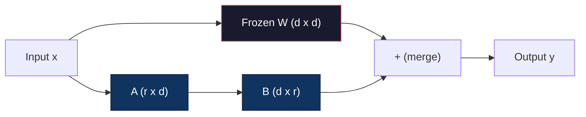
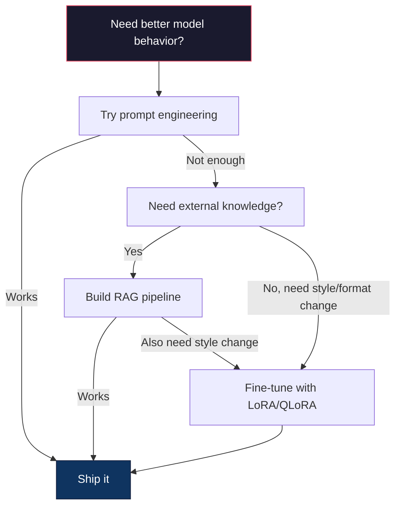

# Fine-Tuning with LoRA & QLoRA

> Pełny fine-tuning modelu 7B wymaga 56 GB VRAM. Nie masz tyle. Większość firm też nie. LoRA pozwala na fine-tuning tego samego modelu w 6 GB, trenując mniej niż 1% parametrów. To nie jest kompromis — dorównuje jakości pełnego fine-tuningu w większości zadań. Cały ekosystem open-source fine-tuningu opiera się na tej jednej sztuczce.

**Type:** Build
**Languages:** Python
**Prerequisites:** Phase 10, Lesson 06 (Instruction Tuning / SFT)
**Time:** ~75 minutes
**Related:** Phase 10 covers the SFT/DPO loops from scratch. This lesson plugs those into the 2026 PEFT toolkits (PEFT, TRL, Unsloth, Axolotl, LLaMA-Factory).

## Learning Objectives

- Zaimplementuj LoRA poprzez wstrzyknięcie macierzy adapterów niskiego rzędu (A i B) do warstw atencji wstępnie wytrenowanego modelu
- Oblicz oszczędności parametrów LoRA w porównaniu z pełnym fine-tuningiem: rząd r z wymiarami d_model trenuje 2*r*d parametrów zamiast d^2
- Wytrenuj model używając QLoRA (4-bitowa skwantowana baza + adaptery LoRA), aby zmieścił się w pamięci konsumenckiego GPU
- Scalaj wagi LoRA z powrotem do modelu bazowego do wdrożenia i porównaj szybkość wnioskowania z adapterami i bez

## The Problem

Masz model bazowy. Llama 3 8B. Chcesz, aby odpowiadał na zgłoszenia wsparcia klienta w tonie twojej firmy. SFT jest odpowiedzią. Ale SFT ma problem kosztowy.

Pełny fine-tuning aktualizuje każdy parametr w modelu. Llama 3 8B ma 8 miliardów parametrów. W fp16 każdy parametr zajmuje 2 bajty. To 16 GB tylko do załadowania wag. Podczas treningu potrzebujesz również gradientów (16 GB), stanów optymalizatora dla Adama (32 GB dla pędu + wariancji) i aktywacji. Razem: około 56 GB VRAM dla pojedynczego modelu 8B.

A100 80GB ledwo to pomieści. Dwie sztuki A100 kosztują 3-4 USD/godzinę u dostawców chmurowych. Trening przez 3 epoki na 50 000 przykładów zajmuje 6-10 godzin. To 30-40 USD za eksperyment. Uruchom 10 eksperymentów, aby dobrać hiperparametry, i wydałeś 400 USD przed wdrożeniem czegokolwiek.

Skaluj to do Llama 3 70B, a liczby stają się absurdalne. 140 GB samych wag. Potrzebujesz klastra. 100+ USD za eksperyment.

Jest też głębszy problem. Pełny fine-tuning modyfikuje każdą wagę w modelu. Jeśli trenujesz na danych wsparcia klienta, możesz zdegradować ogólne możliwości modelu. To się nazywa katastroficzne zapominanie. Model staje się lepszy w twoim zadaniu, a gorszy we wszystkim innym.

Potrzebujesz metody, która trenuje mniej parametrów, używa mniej pamięci i nie niszczy istniejącej wiedzy modelu.

## The Concept

### LoRA: Low-Rank Adaptation

Edward Hu i współpracownicy z Microsoft opublikowali LoRA w czerwcu 2021. Wgląd z pracy: aktualizacje wag podczas fine-tuningu mają niski wewnętrzny rząd. Nie musisz aktualizować wszystkich 16,7 miliona parametrów w macierzy wag 4096x4096. Przydatna informacja w aktualizacji może być uchwycona przez macierz rzędu 16 lub 32.

Oto matematyka. Standardowa warstwa liniowa oblicza:

```
y = Wx
```

Gdzie W to macierz d_out x d_in. Dla projekcji atencji 4096x4096 to 16 777 216 parametrów.

LoRA zamraża W i dodaje dekompozycję niskiego rzędu:

```
y = Wx + BAx
```

Gdzie B to (d_out x r), a A to (r x d_in). Rząd r jest znacznie mniejszy niż d — zazwyczaj 8, 16 lub 32.

Dla r=16 w warstwie 4096x4096:
- Oryginalne parametry: 4096 x 4096 = 16 777 216
- Parametry LoRA: (4096 x 16) + (16 x 4096) = 65 536 + 65 536 = 131 072
- Redukcja: 131 072 / 16 777 216 = 0,78%

Trenujesz 0,78% parametrów i uzyskujesz 95-100% jakości.



A jest inicjalizowane losowym rozkładem Gaussa. B jest inicjalizowane zerami. Oznacza to, że wkład LoRA zaczyna się od zera — model rozpoczyna trening od swojego oryginalnego zachowania i stopniowo uczy się adaptacji.

### The Scaling Factor: Alpha

LoRA wprowadza współczynnik skalowania alpha, który kontroluje, jak bardzo aktualizacja niskiego rzędu wpływa na wynik:

```
y = Wx + (alpha / r) * BAx
```

Gdy alpha = r, skalowanie wynosi 1x. Gdy alpha = 2r (popularna wartość domyślna), skalowanie wynosi 2x. Ten hiperparametr kontroluje szybkość uczenia ścieżki LoRA niezależnie od bazowej szybkości uczenia.

Praktyczne wskazówki:
- alpha = 2 * rank to powszechna konwencja społeczności (oryginalna praca używała alpha = rank w większości eksperymentów)
- alpha = rank daje skalowanie 1x, konserwatywne, ale stabilne
- Wyższe alpha oznacza większe aktualizacje na krok, co może przyspieszyć zbieżność lub spowodować niestabilność

### Where to Apply LoRA

Transformer ma wiele warstw liniowych. Nie musisz dodawać LoRA do wszystkich. Oryginalna praca testowała różne kombinacje:

| Target Layers | Trainable Params (7B) | Quality |
|--------------|----------------------|---------|
| q_proj only | 4.7M | Dobra |
| q_proj + v_proj | 9.4M | Lepsza |
| q_proj + k_proj + v_proj + o_proj | 18.9M | Najlepsza dla atencji |
| All linear (attention + MLP) | 37.7M | Marginalny zysk, 2x parametry |

Optymalny punkt dla większości zadań: q_proj + v_proj. To celuje w projekcje zapytania i wartości w samoatencji, które kontrolują, na co model zwraca uwagę i jakie informacje wydobywa. Dodanie warstw MLP pomaga w złożonych zadaniach, takich jak generowanie kodu, ale podwaja liczbę parametrów przy malejących zyskach dla prostszych zadań.

### Rank Selection

Rząd r kontroluje ekspresywność adaptacji:

| Rank | Trainable Params (per layer) | Best For |
|------|---------------------------|----------|
| 4 | 32 768 | Prosta klasyfikacja, analiza sentymentu |
| 8 | 65 536 | Pytania i odpowiedzi z jednej domeny, streszczanie |
| 16 | 131 072 | Zadania wielodomenowe, podążanie za instrukcjami |
| 32 | 262 144 | Złożone rozumowanie, generowanie kodu |
| 64 | 524 288 | Malejące zyski dla większości zadań |
| 128 | 1 048 576 | Rzadko uzasadnione |

Hu i in. pokazali, że r=4 już przechwytuje większość adaptacji dla prostych zadań. r=8 i r=16 to najczęstsze wybory w praktyce. Przekroczenie r=64 rzadko poprawia jakość i zaczyna tracić przewagę pamięciową LoRA.

### QLoRA: 4-Bit Quantization + LoRA

Tim Dettmers i współpracownicy z University of Washington opublikowali QLoRA w maju 2023. Pomysł: skwantuj zamrożony model bazowy do precyzji 4-bitowej, a następnie dołącz adaptery LoRA w fp16 na wierzchu.

To dramatycznie zmienia równanie pamięci:

| Method | Weight Memory (7B) | Training Memory (7B) | GPU Required |
|--------|-------------------|---------------------|-------------|
| Full fine-tune (fp16) | 14GB | ~56GB | 1x A100 80GB |
| LoRA (fp16 base) | 14GB | ~18GB | 1x A100 40GB |
| QLoRA (4-bit base) | 3.5GB | ~6GB | 1x RTX 3090 24GB |

QLoRA wnosi trzy techniczne wkłady:

**NF4 (Normal Float 4-bit)**: Nowy typ danych zaprojektowany specjalnie dla wag sieci neuronowych. Wagi sieci neuronowych mają w przybliżeniu rozkład normalny. NF4 umieszcza swoje 16 poziomów kwantyzacji na kwantylach standardowego rozkładu normalnego. Jest to optymalne informacyjnie dla danych o rozkładzie normalnym. Traci mniej informacji niż jednolita kwantyzacja 4-bitowa (INT4) czy standardowy Float4.

**Double quantization**: Same stałe kwantyzacji zajmują pamięć. Każdy blok 64 wag potrzebuje współczynnika skali fp32 (4 bajty). Dla modelu 7B to dodatkowe 0.4 GB. Podwójna kwantyzacja kwantyzuje te stałe do fp8, redukując narzut do 0.1 GB. Mało, ale się sumuje.

**Paged optimizers**: Podczas treningu stany optymalizatora (pęd i wariancja Adama) mogą przekroczyć pamięć GPU przy długich sekwencjach. Stronicowane optymalizatory używają pamięci ujednoliconej NVIDIA do automatycznego stronicowania stanów optymalizatora do pamięci RAM CPU, gdy pamięć GPU jest wyczerpana, i przywracania ich, gdy są potrzebne. Zapobiega to awariom OOM kosztem pewnej przepustowości.

### The Quality Question

Czy redukcja parametrów lub kwantyzacja bazy szkodzi jakości? Wyniki z wielu prac:

| Method | MMLU (5-shot) | MT-Bench | HumanEval |
|--------|--------------|----------|-----------|
| Full fine-tune (Llama 2 7B) | 48.3 | 6.72 | 14.6 |
| LoRA r=16 | 47.9 | 6.68 | 14.0 |
| QLoRA r=16 (NF4) | 47.5 | 6.61 | 13.4 |
| QLoRA r=64 (NF4) | 48.1 | 6.70 | 14.2 |

LoRA przy r=16 jest w granicach 1% pełnego fine-tuningu w większości benchmarków. QLoRA przy r=16 traci kolejny ułamek procenta. QLoRA przy r=64 zasadniczo dorównuje pełnemu fine-tuningowi, używając 90% mniej pamięci.

### Real-World Costs

Fine-tuning Llama 3 8B na 50 000 przykładach (3 epoki):

| Method | GPU | Time | Cost |
|--------|-----|------|------|
| Full fine-tune | 2x A100 80GB | 8 hours | ~$32 |
| LoRA r=16 | 1x A100 40GB | 4 hours | ~$8 |
| QLoRA r=16 | 1x RTX 4090 24GB | 6 hours | ~$5 |
| QLoRA r=16 (Unsloth) | 1x RTX 4090 24GB | 2.5 hours | ~$2 |
| QLoRA r=16 | 1x T4 16GB | 12 hours | ~$4 |

QLoRA na pojedynczym konsumenckim GPU kosztuje mniej niż lunch. Dlatego społeczność fine-tuningu open-weight eksplodowała w 2023 i dlatego każdy框架 treningowy poniżej domyślnie dostarcza QLoRA w 2026.

### The 2026 PEFT stack

| Framework | What it is | Pick when |
|-----------|-----------|-----------|
| **Hugging Face PEFT** | Kanoniczna biblioteka LoRA/QLoRA/DoRA/IA3 | Chcesz surowej kontroli, a twoja pętla treningowa jest już na `transformers.Trainer` |
| **TRL** | Trenerzy HF do uczenia ze wzmocnieniem (SFT, DPO, GRPO, PPO, ORPO) | Potrzebujesz DPO/GRPO po SFT; zbudowany na PEFT |
| **Unsloth** | Przepisanie forward/backward pass przez Triton kernel | Chcesz 2-5x przyspieszenia + połowę VRAM bez utraty dokładności; rodzina Llama/Mistral/Qwen |
| **Axolotl** | Nakładka YAML-config na PEFT + TRL + DeepSpeed + Unsloth | Chcesz powtarzalnych, kontrolowanych wersjami przebiegów treningowych |
| **LLaMA-Factory** | GUI/CLI/API na PEFT + TRL | Chcesz fine-tuningu bez kodowania; obsługuje 100+ rodzin modeli |
| **torchtune** | Natywne przepisy PyTorch, bez zależności `transformers` | Chcesz minimalnych zależności, a twoja organizacja standardowo używa PyTorch |

Zasada kciuka: badania lub jednorazowy eksperyment → PEFT. Powtarzalny potok produkcyjny → Axolotl z włączonymi kernelami Unsloth. Szybkie prototypowanie → LLaMA-Factory.

### Merging Adapters

Po treningu masz dwie rzeczy: zamrożony model bazowy i mały adapter LoRA (zazwyczaj 10-100 MB). Możesz albo:

1. **Trzymać je osobno**: Załaduj model bazowy, załaduj adapter na wierzch. Zamieniaj adaptery dla różnych zadań. W ten sposób obsługujesz wiele wariantów fine-tuningu z jednego modelu bazowego.

2. **Scalić je trwale**: Oblicz W' = W + (alpha/r) * BA i zapisz wynik jako nowy pełny model. Scalamy model jest tego samego rozmiaru co oryginał. Zero narzutu na wnioskowanie. Żaden adapter do zarządzania.

Do obsługi wielu zadań (adapter wsparcia klienta, adapter kodu, adapter tłumaczenia) trzymaj je osobno. Do wdrożenia pojedynczego wyspecjalizowanego modelu — scalaj.

Zaawansowane techniki scalania do łączenia wielu adapterów:

- **TIES-Merging** (Yadav et al. 2023): Przycina parametry o małej wielkości, rozwiązuje konflikty znaków, a następnie scala. Zmniejsza interferencję między adapterami.
- **DARE** (Yu et al. 2023): Losowo odrzuca parametry adaptera przed scaleniem i przeskalowuje resztę. Zaskakująco skuteczne w łączeniu możliwości.
- **Task arithmetic**: Po prostu dodaj lub odejmij wagi adapterów. Dodanie adaptera "kodu" i adaptera "matematyki" często daje model dobry w obu.

### When NOT to Fine-Tune

Fine-tuning jest trzecią opcją, nie pierwszą.

**Po pierwsze: prompt engineering.** Napisz lepszy system prompt. Dodaj kilka przykładów. Użyj chain-of-thought. To nic nie kosztuje i zajmuje minuty. Jeśli promptowanie daje 80% celu, prawdopodobnie nie potrzebujesz fine-tuningu.

**Po drugie: RAG.** Jeśli model potrzebuje wiedzy o twoich konkretnych danych (dokumenty, baza wiedzy, katalog produktów), wyszukiwanie jest tańsze i łatwiejsze w utrzymaniu niż wypalanie wiedzy w wagi. Zobacz Lekcję 06.

**Po trzecie: fine-tuning.** Użyj tego, gdy potrzebujesz, aby model przyjął określony styl, format lub wzorzec rozumowania, którego nie można osiągnąć przez promptowanie. Gdy potrzebujesz spójnego strukturalnego wyniku. Gdy potrzebujesz destylować większy model do mniejszego. Gdy opóźnienie ma znaczenie i nie możesz sobie pozwolić na dodatkowe tokeny z promptowania z przykładami.



```figure
lora-params
```

## Build It

Implementujemy LoRA od zera w czystym PyTorch. Bez bibliotek. Bez magii. Zbudujesz warstwę LoRA, wstrzykniesz ją do modelu, wytrenujesz i scalisz wagi.

### Step 1: The LoRA Layer

```python
import torch
import torch.nn as nn
import math

class LoRALayer(nn.Module):
    def __init__(self, in_features, out_features, rank=8, alpha=16):
        super().__init__()
        self.rank = rank
        self.alpha = alpha
        self.scaling = alpha / rank

        self.A = nn.Parameter(torch.randn(in_features, rank) * (1 / math.sqrt(rank)))
        self.B = nn.Parameter(torch.zeros(rank, out_features))

    def forward(self, x):
        return (x @ self.A @ self.B) * self.scaling
```

A jest inicjalizowane przeskalowanymi losowymi wartościami. B jest inicjalizowane zerami. Iloczyn BA zaczyna od zera, więc model zaczyna od swojego oryginalnego zachowania.

### Step 2: LoRA-Wrapped Linear Layer

```python
class LinearWithLoRA(nn.Module):
    def __init__(self, linear, rank=8, alpha=16):
        super().__init__()
        self.linear = linear
        self.lora = LoRALayer(
            linear.in_features, linear.out_features, rank, alpha
        )

        for param in self.linear.parameters():
            param.requires_grad = False

    def forward(self, x):
        return self.linear(x) + self.lora(x)
```

Oryginalna warstwa liniowa jest zamrożona. Tylko parametry LoRA (A i B) są trenowalne.

### Step 3: Inject LoRA into a Model

```python
def inject_lora(model, target_modules, rank=8, alpha=16):
    for param in model.parameters():
        param.requires_grad = False

    lora_layers = {}
    for name, module in model.named_modules():
        if isinstance(module, nn.Linear):
            if any(t in name for t in target_modules):
                parent_name = ".".join(name.split(".")[:-1])
                child_name = name.split(".")[-1]
                parent = dict(model.named_modules())[parent_name]
                lora_linear = LinearWithLoRA(module, rank, alpha)
                setattr(parent, child_name, lora_linear)
                lora_layers[name] = lora_linear
    return lora_layers
```

Najpierw zamroź każdy parametr w modelu. Następnie przejdź drzewo modelu, znajdź warstwy liniowe pasujące do nazw docelowych i zastąp je wersjami opakowanymi w LoRA. Macierze A i B LoRA to jedyne trenowalne parametry w całym modelu.

### Step 4: Count Parameters

```python
def count_parameters(model):
    total = sum(p.numel() for p in model.parameters())
    trainable = sum(p.numel() for p in model.parameters() if p.requires_grad)
    frozen = total - trainable
    return {
        "total": total,
        "trainable": trainable,
        "frozen": frozen,
        "trainable_pct": 100 * trainable / total if total > 0 else 0
    }
```

### Step 5: Merge Weights Back

```python
def merge_lora_weights(model):
    for name, module in model.named_modules():
        if isinstance(module, LinearWithLoRA):
            with torch.no_grad():
                merged = (
                    module.lora.A @ module.lora.B
                ) * module.lora.scaling
                module.linear.weight.data += merged.T
            parent_name = ".".join(name.split(".")[:-1])
            child_name = name.split(".")[-1]
            if parent_name:
                parent = dict(model.named_modules())[parent_name]
            else:
                parent = model
            setattr(parent, child_name, module.linear)
```

Po scaleniu warstwy LoRA znikają. Model jest tego samego rozmiaru co oryginał z adaptacją wbudowaną w wagi. Zero narzutu na wnioskowanie.

### Step 6: Simulated QLoRA Quantization

```python
def quantize_to_nf4(tensor, block_size=64):
    blocks = tensor.reshape(-1, block_size)
    scales = blocks.abs().max(dim=1, keepdim=True).values / 7.0
    scales = torch.clamp(scales, min=1e-8)
    quantized = torch.round(blocks / scales).clamp(-8, 7).to(torch.int8)
    return quantized, scales

def dequantize_from_nf4(quantized, scales, original_shape):
    dequantized = quantized.float() * scales
    return dequantized.reshape(original_shape)
```

To symuluje 4-bitową kwantyzację poprzez mapowanie wag do 16 dyskretnych poziomów w blokach po 64. Produkcyjny QLoRA używa biblioteki bitsandbytes dla prawdziwego NF4 na GPU.

### Step 7: Training Loop

```python
def train_lora(model, data, epochs=5, lr=1e-3, batch_size=4):
    optimizer = torch.optim.AdamW(
        [p for p in model.parameters() if p.requires_grad], lr=lr
    )
    criterion = nn.MSELoss()

    losses = []
    for epoch in range(epochs):
        epoch_loss = 0.0
        n_batches = 0
        indices = torch.randperm(len(data["inputs"]))

        for i in range(0, len(indices), batch_size):
            batch_idx = indices[i:i + batch_size]
            x = data["inputs"][batch_idx]
            y = data["targets"][batch_idx]

            output = model(x)
            loss = criterion(output, y)

            optimizer.zero_grad()
            loss.backward()
            optimizer.step()

            epoch_loss += loss.item()
            n_batches += 1

        avg_loss = epoch_loss / n_batches
        losses.append(avg_loss)

    return losses
```

### Step 8: Full Demo

```python
def demo():
    torch.manual_seed(42)
    d_model = 256
    n_classes = 10

    model = nn.Sequential(
        nn.Linear(d_model, 512),
        nn.ReLU(),
        nn.Linear(512, 512),
        nn.ReLU(),
        nn.Linear(512, n_classes),
    )

    n_samples = 500
    x = torch.randn(n_samples, d_model)
    y = torch.randint(0, n_classes, (n_samples,))
    y_onehot = torch.zeros(n_samples, n_classes).scatter_(1, y.unsqueeze(1), 1.0)

    data = {"inputs": x, "targets": y_onehot}

    params_before = count_parameters(model)

    lora_layers = inject_lora(
        model, target_modules=["0", "2"], rank=8, alpha=16
    )

    params_after = count_parameters(model)

    losses = train_lora(model, data, epochs=20, lr=1e-3)

    merge_lora_weights(model)
    params_merged = count_parameters(model)

    return {
        "params_before": params_before,
        "params_after": params_after,
        "params_merged": params_merged,
        "losses": losses,
    }
```

Demo tworzy mały model, wstrzykuje LoRA do dwóch warstw, trenuje go i scala wagi z powrotem. Liczba parametrów spada z pełnej trenowalności do ~1% trenowalnych podczas treningu LoRA, a następnie wraca do oryginalnej architektury po scaleniu.

## Use It

Z ekosystemem Hugging Face, LoRA na prawdziwym modelu zajmuje około 20 linii:

```python
from transformers import AutoModelForCausalLM, AutoTokenizer
from peft import LoraConfig, get_peft_model, TaskType

model = AutoModelForCausalLM.from_pretrained("meta-llama/Llama-3.1-8B")
tokenizer = AutoTokenizer.from_pretrained("meta-llama/Llama-3.1-8B")

lora_config = LoraConfig(
    task_type=TaskType.CAUSAL_LM,
    r=16,
    lora_alpha=32,
    lora_dropout=0.05,
    target_modules=["q_proj", "v_proj"],
)

model = get_peft_model(model, lora_config)
model.print_trainable_parameters()
```

Dla QLoRA dodaj kwantyzację bitsandbytes:

```python
from transformers import BitsAndBytesConfig

bnb_config = BitsAndBytesConfig(
    load_in_4bit=True,
    bnb_4bit_quant_type="nf4",
    bnb_4bit_compute_dtype=torch.bfloat16,
    bnb_4bit_use_double_quant=True,
)

model = AutoModelForCausalLM.from_pretrained(
    "meta-llama/Llama-3.1-8B",
    quantization_config=bnb_config,
    device_map="auto",
)

model = get_peft_model(model, lora_config)
```

To wszystko. Ta sama pętla treningowa. Ten sam potok danych. Model bazowy żyje teraz w 4-bitach, adaptery LoRA trenują w fp16, a całość mieści się w 6 GB.

Do treningu z Hugging Face Trainer:

```python
from transformers import TrainingArguments, Trainer
from datasets import load_dataset

dataset = load_dataset("tatsu-lab/alpaca", split="train[:5000]")

training_args = TrainingArguments(
    output_dir="./lora-llama",
    num_train_epochs=3,
    per_device_train_batch_size=4,
    gradient_accumulation_steps=4,
    learning_rate=2e-4,
    fp16=True,
    logging_steps=10,
    save_strategy="epoch",
    optim="paged_adamw_8bit",
)

trainer = Trainer(
    model=model,
    args=training_args,
    train_dataset=dataset,
)

trainer.train()

model.save_pretrained("./lora-adapter")
```

Zapisany adapter ma 10-100 MB. Model bazowy pozostaje nietknięty. Możesz udostępniać adaptery na Hugging Face Hub bez redystrybucji pełnego modelu.

## Ship It

Ta lekcja produkuje:
- `outputs/prompt-lora-advisor.md` — prompt, który pomaga zdecydować o rzędzie LoRA, docelowych modułach i hiperparametrach dla konkretnego zadania
- `outputs/skill-fine-tuning-guide.md` — umiejętność ucząca agentów drzewa decyzyjnego kiedy i jak fine-tunować

## Exercises

1. **Badanie ablacyjne rzędu.** Uruchom demo z rzędami 2, 4, 8, 16, 32 i 64. Wykreśl końcową stratę względem rzędu. Znajdź punkt malejących zysków, gdzie podwojenie rzędu nie zmniejsza już o połowę straty. Dla prostego zadania klasyfikacji na cechach 256-wymiarowych powinno to być około r=8-16.

2. **Porównanie docelowych modułów.** Zmodyfikuj inject_lora, aby celować tylko w warstwę "0", tylko "2", tylko "4" i wszystkie trzy. Trenuj każdy wariant przez 20 epok. Porównaj szybkość zbieżności i końcową stratę. To odzwierciedla rzeczywistą decyzję celowania w q_proj vs v_proj vs wszystkie warstwy liniowe.

3. **Analiza błędu kwantyzacji.** Weź macierze wag wytrenowanego modelu przed i po quantize_to_nf4 / dequantize_from_nf4. Oblicz średni błąd kwadratowy, maksymalny błąd bezwzględny i korelację między oryginalnymi a zrekonstruowanymi wagami. Eksperymentuj z wartościami block_size 32, 64, 128 i 256.

4. **Obsługa wielu adapterów.** Wytrenuj dwa adaptery LoRA na różnych podzbiorach danych (indeksy parzyste vs nieparzyste). Zapisz oba adaptery. Załaduj model bazowy raz, a następnie zamieniaj adaptery i zweryfikuj, że każdy produkuje inne wyniki na tym samym wejściu. W ten sposób systemy produkcyjne obsługują wiele modeli fine-tunowanych z jednej bazy.

5. **Wnioskowanie po scaleniu vs przed.** Porównaj wyniki modelu LoRA przed i po merge_lora_weights na tych samych 100 wejściach. Zweryfikuj, że wyniki są identyczne (w granicach tolerancji zmiennoprzecinkowej 1e-5). Następnie porównaj szybkość wnioskowania — scalony powinien być nieco szybszy, ponieważ to pojedyncze mnożenie macierzy zamiast dwóch.

## Key Terms

| Term | What people say | What it actually means |
|------|----------------|----------------------|
| LoRA | "Efektywny fine-tuning" | Low-Rank Adaptation: zamroź bazowe wagi, trenuj dwie małe macierze A i B, których iloczyn aproksymuje pełną aktualizację wag |
| QLoRA | "Fine-tuning na laptopie" | Kwantyzowany LoRA: załaduj model bazowy w 4-bitowym NF4, trenuj adaptery LoRA w fp16 na wierzchu, umożliwiając fine-tuning 7B w 6 GB VRAM |
| Rank (r) | "Ile model może się nauczyć" | Wewnętrzny wymiar macierzy A i B; kontroluje ekspresywność vs liczbę parametrów |
| Alpha | "Szybkość uczenia LoRA" | Współczynnik skalowania zastosowany do wyniku LoRA; alpha/r skaluje wkład adaptacji do końcowego wyniku |
| NF4 | "Kwantyzacja 4-bitowa" | Normal Float 4: 4-bitowy typ danych z poziomami kwantyzacji na kwantylach rozkładu normalnego, optymalny dla wag sieci neuronowych |
| Adapter | "Mała wytrenowana część" | Macierze A i B LoRA zapisane jako osobny plik (10-100 MB), ładowalne na wierzch dowolnej kopii modelu bazowego |
| Target modules | "Które warstwy LoRA" | Konkretne warstwy liniowe (q_proj, v_proj, itp.), w które wstrzykiwane są adaptery LoRA |
| Merging | "Wbuduj na stałe" | Obliczenie W + (alpha/r) * BA i zastąpienie oryginalnej wagi, eliminujące narzut adaptera przy wnioskowaniu |
| Paged optimizers | "Bez OOM podczas treningu" | Przenoszenie stanów optymalizatora (pęd Adama, wariancja) do CPU, gdy pamięć GPU jest wyczerpana |
| Catastrophic forgetting | "Fine-tuning zepsuł wszystko inne" | Gdy aktualizacja wszystkich wag powoduje utratę przez model wcześniej wyuczonych zdolności |

## Further Reading

- Hu et al., "LoRA: Low-Rank Adaptation of Large Language Models" (2021) -- the original paper introducing the low-rank decomposition method, tested on GPT-3 175B with rank as low as 4
- Dettmers et al., "QLoRA: Efficient Finetuning of Quantized Language Models" (2023) -- introduces NF4, double quantization, and paged optimizers, enabling 65B fine-tuning on a single 48GB GPU
- PEFT library documentation (huggingface.co/docs/peft) -- the standard library for LoRA, QLoRA, and other parameter-efficient methods in the Hugging Face ecosystem
- Yadav et al., "TIES-Merging: Resolving Interference When Merging Models" (2023) -- techniques for combining multiple LoRA adapters without quality degradation
- [Rafailov et al., "Direct Preference Optimization: Your Language Model is Secretly a Reward Model" (NeurIPS 2023)](https://arxiv.org/abs/2305.18290) -- DPO derivation; the preference-tuning stage that comes after SFT, no reward model needed.
- [TRL documentation](https://huggingface.co/docs/trl/) -- official reference for `SFTTrainer`, `DPOTrainer`, `KTOTrainer`, and the integration surface with PEFT/bitsandbytes/Unsloth.
- [Unsloth documentation](https://docs.unsloth.ai/) -- fused kernels that double fine-tuning throughput and halve memory; the performance layer under TRL.
- [Axolotl documentation](https://axolotl-ai-cloud.github.io/axolotl/) -- YAML-configured multi-GPU SFT/DPO/QLoRA trainer; the config-as-code alternative to hand-written scripts.
