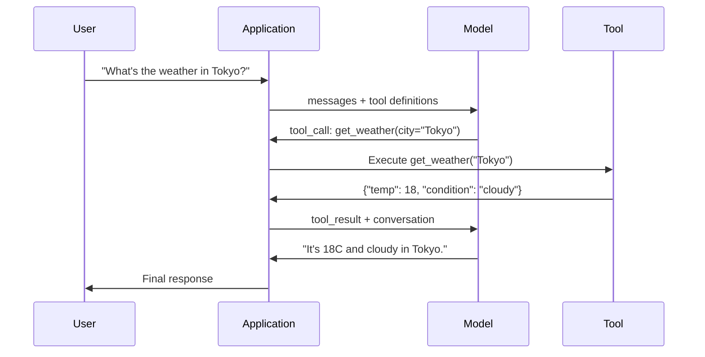

# Function Calling & Tool Use

> LLM-y nie mogą nic zrobić. Generują tekst. To cała ich możliwość. Nie mogą sprawdzić pogody, odpytać bazy danych, wysłać e-maila, uruchomić kodu ani przeczytać pliku. Każdy "agent AI", jakiego kiedykolwiek widziałeś, to LLM generujący JSON mówiący, którą funkcję wywołać — a twój kod faktycznie ją wywołuje. Model jest mózgiem. Narzędzia są rękami. Function calling jest układem nerwowym, który je łączy.

**Type:** Build
**Languages:** Python
**Prerequisites:** Phase 11 Lesson 03 (Structured Outputs)
**Time:** ~75 minutes
**Related:** Phase 11 · 14 (Model Context Protocol) — when a tool is shared across hosts, graduate from inline function-calling to an MCP server. This lesson covers the inline case; MCP covers the protocol case.

## Learning Objectives

- Zaimplementuj pętlę function calling: zdefiniuj schematy narzędzi, przeanalizuj JSON wywołania narzędzia modelu, wykonaj funkcje i zwróć wyniki
- Projektuj schematy narzędzi z jasnymi opisami i typowanymi parametrami, które model może niezawodnie wywoływać
- Zbuduj pętlę agenta wieloetapowego, która łańcuchuje wiele wywołań funkcji, aby odpowiedzieć na złożone zapytania
- Obsłuż przypadki brzegowe function calling: równoległe wywołania narzędzi, propagację błędów i zapobieganie nieskończonym pętlom narzędzi

## The Problem

Budujesz chatbota. Użytkownik pyta: "Jaka jest pogoda w Tokio teraz?"

Model odpowiada: "Nie mam dostępu do danych pogodowych w czasie rzeczywistym, ale na podstawie pory roku, w Tokio jest prawdopodobnie około 15 stopni Celsjusza..."

To jest halucynacja ubrana w zastrzeżenie. Model nie zna pogody. Nigdy nie będzie. Pogoda zmienia się co godzinę. Dane treningowe modelu są miesiące stare.

Prawidłowa odpowiedź wymaga wywołania API OpenWeatherMap, pobrania aktualnej temperatury i zwrócenia prawdziwej liczby. Model nie może wywoływać API. Twój kod może. Brakujący element: ustrukturyzowany protokół, który pozwala modelowi powiedzieć "Muszę wywołać API pogody z tymi argumentami" i pozwala twojemu kodowi go wykonać i przekazać wynik z powrotem.

To jest function calling. Model wyprowadza ustrukturyzowany JSON opisujący, którą funkcję wywołać i z jakimi argumentami. Twoja aplikacja wykonuje funkcję. Wynik wraca do konwersacji. Model używa wyniku do wyprodukowania końcowej odpowiedzi.

Bez function calling LLM-y są encyklopediami. Z nim stają się agentami.

## The Concept

### The Function Calling Loop

Każda interakcja z użyciem narzędzia podąża za tą samą 5-etapową pętlą.



Krok 1: użytkownik wysyła wiadomość. Krok 2: model otrzymuje wiadomość wraz z definicjami narzędzi (JSON Schema opisujący dostępne funkcje). Krok 3: zamiast odpowiedzieć tekstem, model wyprowadza wywołanie narzędzia — ustrukturyzowany obiekt JSON z nazwą funkcji i argumentami. Krok 4: twój kod wykonuje funkcję i przechwytuje wynik. Krok 5: wynik wraca do modelu, który teraz ma prawdziwe dane do wyprodukowania końcowej odpowiedzi.

Model nigdy niczego nie wykonuje. Tylko decyduje, co wywołać i z jakimi argumentami. Twój kod jest wykonawcą.

### Tool Definitions: The JSON Schema Contract

Każde narzędzie jest zdefiniowane przez JSON Schema, który mówi modelowi, co funkcja robi, jakie argumenty przyjmuje i jakich typów te argumenty muszą być.

```json
{
  "type": "function",
  "function": {
    "name": "get_weather",
    "description": "Get current weather for a city. Returns temperature in Celsius and conditions.",
    "parameters": {
      "type": "object",
      "properties": {
        "city": {
          "type": "string",
          "description": "City name, e.g. 'Tokyo' or 'San Francisco'"
        },
        "units": {
          "type": "string",
          "enum": ["celsius", "fahrenheit"],
          "description": "Temperature units"
        }
      },
      "required": ["city"]
    }
  }
}
```

Pola `description` są krytyczne. Model je czyta, aby zdecydować, kiedy i jak użyć narzędzia. Niejasny opis jak "pobiera pogodę" daje gorszy wybór narzędzia niż "Pobiera aktualną pogodę dla miasta. Zwraca temperaturę w Celsjuszach i warunki." Opis to prompt do wyboru narzędzia.

### Provider Comparison

Każdy główny dostawca obsługuje function calling, ale powierzchnia API się różni.

| Provider | API Parameter | Tool Call Format | Parallel Calls | Forced Calling |
|----------|--------------|-----------------|---------------|----------------|
| OpenAI (GPT-5, o4) | `tools` | `tool_calls[].function` | Tak (wiele na turę) | `tool_choice="required"` |
| Anthropic (Claude 4.6/4.7) | `tools` | `content[].type="tool_use"` | Tak (wiele bloków) | `tool_choice={"type":"any"}` |
| Google (Gemini 3) | `function_declarations` | `functionCall` | Tak | `function_calling_config` |
| Open-weight (Llama 4, Qwen3, DeepSeek-V3) | Natywne `tools` na Llama 4; Hermes lub ChatML na innych | Mieszane | Zależne od modelu | Prompt-based lub `tool_choice` jeśli obsługiwane |

Do 2026 roku trzej zamknięci dostawcy zbiegli się do prawie identycznych formatów opartych na JSON Schema. Llama 4 ma natywne pole `tools` pasujące do kształtu OpenAI. Fine-tuny open-weight wciąż się różnią — format Hermes (NousResearch) jest najczęstszy dla fine-tunów stron trzecich. Dla współdzielonych narzędzi między hostami preferuj MCP (Phase 11 · 14) nad inline function calling — serwer jest ten sam dla wszystkich.

### Tool Choice: Auto, Required, Specific

Kontrolujesz, kiedy model używa narzędzi.

**Auto** (domyślnie): model decyduje, czy wywołać narzędzie, czy odpowiedzieć bezpośrednio. "Ile to 2+2?" — odpowiada bezpośrednio. "Jaka jest pogoda?" — wywołuje narzędzie.

**Required**: model musi wywołać co najmniej jedno narzędzie. Użyj tego, gdy wiesz, że intencja użytkownika wymaga narzędzia. Zapobiega zgadywaniu przez model zamiast wyszukiwania prawdziwych danych.

**Specific function**: wymuś wywołanie konkretnej funkcji. `tool_choice={"type":"function", "function": {"name": "get_weather"}}` gwarantuje wywołanie narzędzia pogodowego, niezależnie od zapytania. Użyj do routingu — gdy logika nadrzędna już ustaliła, które narzędzie jest potrzebne.

### Parallel Function Calling

GPT-4o i Claude mogą wywołać wiele funkcji w jednej turze. Użytkownik pyta: "Jaka jest pogoda w Tokio i Nowym Jorku?" Model wyprowadza dwa wywołania narzędzi jednocześnie:

```json
[
  {"name": "get_weather", "arguments": {"city": "Tokyo"}},
  {"name": "get_weather", "arguments": {"city": "New York"}}
]
```

Twój kod wykonuje oba (najlepiej współbieżnie), zwraca oba wyniki, a model syntetyzuje pojedynczą odpowiedź. To zmniejsza liczbę rund z 2 do 1. Dla agentów z 5-10 wywołaniami narzędzi na zapytanie, równoległe wywoływanie redukuje opóźnienie o 60-80%.

### Structured Outputs vs Function Calling

Lekcja 03 omówiła strukturalne wyniki. Function calling używa tego samego mechanizmu JSON Schema, ale w innym celu.

**Structured outputs**: wymuś na modelu produkcję danych w określonym kształcie. Wynik jest produktem końcowym. Przykład: wyodrębnij informację o produkcie z tekstu jako `{name, price, in_stock}`.

**Function calling**: model deklaruje zamiar wykonania akcji. Wynik jest krokiem pośrednim. Przykład: `get_weather(city="Tokyo")` — model żąda akcji, nie produkuje końcowej odpowiedzi.

Użyj structured outputs, gdy chcesz ekstrakcji danych. Użyj function calling, gdy chcesz, aby model współdziałał z zewnętrznymi systemami.

### Security: The Non-Negotiable Rules

Function calling jest najniebezpieczniejszą zdolnością, jaką możesz dać LLM-owi. Model wybiera, co wykonać. Jeśli twój zestaw narzędzi zawiera zapytania do bazy danych, model konstruuje zapytania. Jeśli zawiera polecenia powłoki, model je pisze.

**Zasada 1: Nigdy nie przekazuj SQL wygenerowanego przez model bezpośrednio do bazy danych.** Model może i wygeneruje DROP TABLE, wstrzyknięcia UNION lub zapytania zwracające każdy wiersz. Zawsze parametryzuj. Zawsze waliduj. Zawsze używaj listy dozwolonych operacji.

**Zasada 2: Lista dozwolonych funkcji.** Model może wywoływać tylko funkcje, które jawnie zdefiniowałeś. Nigdy nie buduj ogólnego narzędzia "wykonaj dowolną funkcję po nazwie". Jeśli masz 50 wewnętrznych funkcji, udostępnij tylko 5, których potrzebuje użytkownik.

**Zasada 3: Waliduj argumenty.** Model może przekazać nazwę miasta `"; DROP TABLE users; --"`. Waliduj każdy argument względem oczekiwanych typów, zakresów i formatów przed wykonaniem.

**Zasada 4: Oczyść wyniki narzędzi.** Jeśli narzędzie zwraca wrażliwe dane (klucze API, PII, wewnętrzne błędy), przefiltruj je przed wysłaniem z powrotem do modelu. Model dołączy wyniki narzędzia do swojej odpowiedzi dosłownie.

**Zasada 5: Ogranicz szybkość wywołań narzędzi.** Model w pętli może wywoływać narzędzia setki razy. Ustaw maksimum (10-20 wywołań na rozmowę jest rozsądne). Przerwuj nieskończone pętle.

### Error Handling

Narzędzia zawodzą. API się przerywają. Bazy danych padają. Pliki nie istnieją. Model musi wiedzieć, kiedy narzędzie zawiedzie i dlaczego.

Zwracaj błędy jako strukturalne wyniki narzędzi, nie wyjątki:

```json
{
  "error": true,
  "message": "City 'Toky' not found. Did you mean 'Tokyo'?",
  "code": "CITY_NOT_FOUND"
}
```

Model to czyta, dostosowuje argumenty i próbuje ponownie. Modele są dobre w samonaprawianiu na podstawie strukturalnych komunikatów błędów. Są złe w odzyskiwaniu się z pustych odpowiedzi lub ogólnych błędów "coś poszło nie tak".

### MCP: Model Context Protocol

MCP to otwarty standard Anthropic dla interoperacyjności narzędzi. Zamiast każdej aplikacji definiującej własne narzędzia, MCP zapewnia uniwersalny protokół: narzędzia są udostępniane przez serwery MCP, konsumowane przez klienty MCP (takie jak Claude Code, Cursor czy twoja aplikacja).

Jeden serwer MCP może udostępniać narzędzia każdemu kompatybilnemu klientowi. Serwer MCP Postgres daje każdemu agentowi kompatybilnemu z MCP dostęp do bazy danych. Serwer MCP GitHub daje każdemu agentowi dostęp do repozytorium. Narzędzia są zdefiniowane raz, używane wszędzie.

MCP jest do function calling tym, czym HTTP jest do sieciowania. Standaryzuje warstwę transportową, dzięki czemu narzędzia stają się przenośne.

## Build It

### Step 1: Define the Tool Registry

Zbuduj rejestr przechowujący definicje narzędzi i ich implementacje. Każde narzędzie ma definicję JSON Schema (co widzi model) i funkcję Python (co wykonuje twój kod).

```python
import json
import math
import time
import hashlib


TOOL_REGISTRY = {}


def register_tool(name, description, parameters, function):
    TOOL_REGISTRY[name] = {
        "definition": {
            "type": "function",
            "function": {
                "name": name,
                "description": description,
                "parameters": parameters,
            },
        },
        "function": function,
    }
```

### Step 2: Implement 5 Tools

Zbuduj kalkulator, wyszukiwarkę pogody, symulator wyszukiwania w sieci, czytnik plików i runner kodu.

```python
def calculator(expression, precision=2):
    allowed = set("0123456789+-*/.() ")
    if not all(c in allowed for c in expression):
        return {"error": True, "message": f"Invalid characters in expression: {expression}"}
    try:
        result = eval(expression, {"__builtins__": {}}, {"math": math})
        return {"result": round(float(result), precision), "expression": expression}
    except Exception as e:
        return {"error": True, "message": str(e)}


WEATHER_DB = {
    "tokyo": {"temp_c": 18, "condition": "cloudy", "humidity": 72, "wind_kph": 14},
    "new york": {"temp_c": 22, "condition": "sunny", "humidity": 45, "wind_kph": 8},
    "london": {"temp_c": 12, "condition": "rainy", "humidity": 88, "wind_kph": 22},
    "san francisco": {"temp_c": 16, "condition": "foggy", "humidity": 80, "wind_kph": 18},
    "sydney": {"temp_c": 25, "condition": "sunny", "humidity": 55, "wind_kph": 10},
}


def get_weather(city, units="celsius"):
    key = city.lower().strip()
    if key not in WEATHER_DB:
        suggestions = [c for c in WEATHER_DB if c.startswith(key[:3])]
        return {
            "error": True,
            "message": f"City '{city}' not found.",
            "suggestions": suggestions,
            "code": "CITY_NOT_FOUND",
        }
    data = WEATHER_DB[key].copy()
    if units == "fahrenheit":
        data["temp_f"] = round(data["temp_c"] * 9 / 5 + 32, 1)
        del data["temp_c"]
    data["city"] = city
    return data


SEARCH_DB = {
    "python function calling": [
        {"title": "OpenAI Function Calling Guide", "url": "https://platform.openai.com/docs/guides/function-calling", "snippet": "Learn how to connect LLMs to external tools."},
        {"title": "Anthropic Tool Use", "url": "https://docs.anthropic.com/en/docs/tool-use", "snippet": "Claude can interact with external tools and APIs."},
    ],
    "MCP protocol": [
        {"title": "Model Context Protocol", "url": "https://modelcontextprotocol.io", "snippet": "An open standard for connecting AI models to data sources."},
    ],
    "weather API": [
        {"title": "OpenWeatherMap API", "url": "https://openweathermap.org/api", "snippet": "Free weather API with current, forecast, and historical data."},
    ],
}


def web_search(query, max_results=3):
    key = query.lower().strip()
    for db_key, results in SEARCH_DB.items():
        if db_key in key or key in db_key:
            return {"query": query, "results": results[:max_results], "total": len(results)}
    return {"query": query, "results": [], "total": 0}


FILE_SYSTEM = {
    "data/config.json": '{"model": "gpt-4o", "temperature": 0.7, "max_tokens": 4096}',
    "data/users.csv": "name,email,role\nAlice,alice@example.com,admin\nBob,bob@example.com,user",
    "README.md": "# My Project\nA tool-use agent built from scratch.",
}


def read_file(path):
    if ".." in path or path.startswith("/"):
        return {"error": True, "message": "Path traversal not allowed.", "code": "FORBIDDEN"}
    if path not in FILE_SYSTEM:
        available = list(FILE_SYSTEM.keys())
        return {"error": True, "message": f"File '{path}' not found.", "available_files": available, "code": "NOT_FOUND"}
    content = FILE_SYSTEM[path]
    return {"path": path, "content": content, "size_bytes": len(content), "lines": content.count("\n") + 1}


def run_code(code, language="python"):
    if language != "python":
        return {"error": True, "message": f"Language '{language}' not supported. Only 'python' is available."}
    forbidden = ["import os", "import sys", "import subprocess", "exec(", "eval(", "__import__", "open("]
    for pattern in forbidden:
        if pattern in code:
            return {"error": True, "message": f"Forbidden operation: {pattern}", "code": "SECURITY_VIOLATION"}
    try:
        local_vars = {}
        exec(code, {"__builtins__": {"print": print, "range": range, "len": len, "str": str, "int": int, "float": float, "list": list, "dict": dict, "sum": sum, "min": min, "max": max, "abs": abs, "round": round, "sorted": sorted, "enumerate": enumerate, "zip": zip, "map": map, "filter": filter, "math": math}}, local_vars)
        result = local_vars.get("result", None)
        return {"success": True, "result": result, "variables": {k: str(v) for k, v in local_vars.items() if not k.startswith("_")}}
    except Exception as e:
        return {"error": True, "message": f"{type(e).__name__}: {e}"}
```

### Step 3: Register All Tools

```python
def register_all_tools():
    register_tool(
        "calculator", "Evaluate a mathematical expression. Supports +, -, *, /, parentheses, and decimals. Returns the numeric result.",
        {"type": "object", "properties": {"expression": {"type": "string", "description": "Math expression, e.g. '(10 + 5) * 3'"}, "precision": {"type": "integer", "description": "Decimal places in result", "default": 2}}, "required": ["expression"]},
        calculator,
    )
    register_tool(
        "get_weather", "Get current weather for a city. Returns temperature, condition, humidity, and wind speed.",
        {"type": "object", "properties": {"city": {"type": "string", "description": "City name, e.g. 'Tokyo' or 'San Francisco'"}, "units": {"type": "string", "enum": ["celsius", "fahrenheit"], "description": "Temperature units, defaults to celsius"}}, "required": ["city"]},
        get_weather,
    )
    register_tool(
        "web_search", "Search the web for information. Returns a list of results with title, URL, and snippet.",
        {"type": "object", "properties": {"query": {"type": "string", "description": "Search query"}, "max_results": {"type": "integer", "description": "Maximum results to return", "default": 3}}, "required": ["query"]},
        web_search,
    )
    register_tool(
        "read_file", "Read the contents of a file. Returns the file content, size, and line count.",
        {"type": "object", "properties": {"path": {"type": "string", "description": "Relative file path, e.g. 'data/config.json'"}}, "required": ["path"]},
        read_file,
    )
    register_tool(
        "run_code", "Execute Python code in a sandboxed environment. Set a 'result' variable to return output.",
        {"type": "object", "properties": {"code": {"type": "string", "description": "Python code to execute"}, "language": {"type": "string", "enum": ["python"], "description": "Programming language"}}, "required": ["code"]},
        run_code,
    )
```

### Step 4: Build the Function Calling Loop

To jest podstawowy silnik. Symuluje model decydujący, które narzędzie wywołać, wykonuje narzędzie i przekazuje wyniki z powrotem.

```python
def simulate_model_decision(user_message, tools, conversation_history):
    msg = user_message.lower()

    if any(word in msg for word in ["weather", "temperature", "forecast"]):
        cities = []
        for city in WEATHER_DB:
            if city in msg:
                cities.append(city)
        if not cities:
            for word in msg.split():
                if word.capitalize() in [c.title() for c in WEATHER_DB]:
                    cities.append(word)
        if not cities:
            cities = ["tokyo"]
        calls = []
        for city in cities:
            calls.append({"name": "get_weather", "arguments": {"city": city.title()}})
        return calls

    if any(word in msg for word in ["calculate", "compute", "math", "what is", "how much"]):
        for token in msg.split():
            if any(c in token for c in "+-*/"):
                return [{"name": "calculator", "arguments": {"expression": token}}]
        if "+" in msg or "-" in msg or "*" in msg or "/" in msg:
            expr = "".join(c for c in msg if c in "0123456789+-*/.() ")
            if expr.strip():
                return [{"name": "calculator", "arguments": {"expression": expr.strip()}}]
        return [{"name": "calculator", "arguments": {"expression": "0"}}]

    if any(word in msg for word in ["search", "find", "look up", "google"]):
        query = msg.replace("search for", "").replace("look up", "").replace("find", "").strip()
        return [{"name": "web_search", "arguments": {"query": query}}]

    if any(word in msg for word in ["read", "file", "open", "cat", "show"]):
        for path in FILE_SYSTEM:
            if path.split("/")[-1].split(".")[0] in msg:
                return [{"name": "read_file", "arguments": {"path": path}}]
        return [{"name": "read_file", "arguments": {"path": "README.md"}}]

    if any(word in msg for word in ["run", "execute", "code", "python"]):
        return [{"name": "run_code", "arguments": {"code": "result = 'Hello from the sandbox!'", "language": "python"}}]

    return []


def execute_tool_call(tool_call):
    name = tool_call["name"]
    args = tool_call["arguments"]

    if name not in TOOL_REGISTRY:
        return {"error": True, "message": f"Unknown tool: {name}", "code": "UNKNOWN_TOOL"}

    tool = TOOL_REGISTRY[name]
    func = tool["function"]
    start = time.time()

    try:
        result = func(**args)
    except TypeError as e:
        result = {"error": True, "message": f"Invalid arguments: {e}"}

    elapsed_ms = round((time.time() - start) * 1000, 2)
    return {"tool": name, "result": result, "execution_time_ms": elapsed_ms}


def run_function_calling_loop(user_message, max_iterations=5):
    conversation = [{"role": "user", "content": user_message}]
    tool_definitions = [t["definition"] for t in TOOL_REGISTRY.values()]
    all_tool_results = []

    for iteration in range(max_iterations):
        tool_calls = simulate_model_decision(user_message, tool_definitions, conversation)

        if not tool_calls:
            break

        results = []
        for call in tool_calls:
            result = execute_tool_call(call)
            results.append(result)

        conversation.append({"role": "assistant", "content": None, "tool_calls": tool_calls})

        for result in results:
            conversation.append({"role": "tool", "content": json.dumps(result["result"]), "tool_name": result["tool"]})

        all_tool_results.extend(results)
        break

    return {"conversation": conversation, "tool_results": all_tool_results, "iterations": iteration + 1 if tool_calls else 0}
```

### Step 5: Argument Validation

Zbuduj walidator, który sprawdza argumenty wywołania narzędzia względem JSON Schema przed wykonaniem.

```python
def validate_tool_arguments(tool_name, arguments):
    if tool_name not in TOOL_REGISTRY:
        return [f"Unknown tool: {tool_name}"]

    schema = TOOL_REGISTRY[tool_name]["definition"]["function"]["parameters"]
    errors = []

    if not isinstance(arguments, dict):
        return [f"Arguments must be an object, got {type(arguments).__name__}"]

    for required_field in schema.get("required", []):
        if required_field not in arguments:
            errors.append(f"Missing required argument: {required_field}")

    properties = schema.get("properties", {})
    for arg_name, arg_value in arguments.items():
        if arg_name not in properties:
            errors.append(f"Unknown argument: {arg_name}")
            continue

        prop_schema = properties[arg_name]
        expected_type = prop_schema.get("type")

        type_checks = {"string": str, "integer": int, "number": (int, float), "boolean": bool, "array": list, "object": dict}
        if expected_type in type_checks:
            if not isinstance(arg_value, type_checks[expected_type]):
                errors.append(f"Argument '{arg_name}': expected {expected_type}, got {type(arg_value).__name__}")

        if "enum" in prop_schema and arg_value not in prop_schema["enum"]:
            errors.append(f"Argument '{arg_name}': '{arg_value}' not in {prop_schema['enum']}")

    return errors
```

### Step 6: Run the Demo

```python
def run_demo():
    register_all_tools()

    print("=" * 60)
    print("  Function Calling & Tool Use Demo")
    print("=" * 60)

    print("\n--- Registered Tools ---")
    for name, tool in TOOL_REGISTRY.items():
        desc = tool["definition"]["function"]["description"][:60]
        params = list(tool["definition"]["function"]["parameters"].get("properties", {}).keys())
        print(f"  {name}: {desc}...")
        print(f"    params: {params}")

    print(f"\n--- Argument Validation ---")
    validation_tests = [
        ("get_weather", {"city": "Tokyo"}, "Valid call"),
        ("get_weather", {}, "Missing required arg"),
        ("get_weather", {"city": "Tokyo", "units": "kelvin"}, "Invalid enum value"),
        ("calculator", {"expression": 123}, "Wrong type (int for string)"),
        ("unknown_tool", {"x": 1}, "Unknown tool"),
    ]
    for tool_name, args, label in validation_tests:
        errors = validate_tool_arguments(tool_name, args)
        status = "VALID" if not errors else f"ERRORS: {errors}"
        print(f"  {label}: {status}")

    print(f"\n--- Tool Execution ---")
    direct_tests = [
        {"name": "calculator", "arguments": {"expression": "(10 + 5) * 3 / 2"}},
        {"name": "get_weather", "arguments": {"city": "Tokyo"}},
        {"name": "get_weather", "arguments": {"city": "Mars"}},
        {"name": "web_search", "arguments": {"query": "python function calling"}},
        {"name": "read_file", "arguments": {"path": "data/config.json"}},
        {"name": "read_file", "arguments": {"path": "../etc/passwd"}},
        {"name": "run_code", "arguments": {"code": "result = sum(range(1, 101))"}},
        {"name": "run_code", "arguments": {"code": "import os; os.system('rm -rf /')"}},
    ]
    for call in direct_tests:
        result = execute_tool_call(call)
        print(f"\n  {call['name']}({json.dumps(call['arguments'])})")
        print(f"    -> {json.dumps(result['result'], indent=None)[:100]}")
        print(f"    time: {result['execution_time_ms']}ms")

    print(f"\n--- Full Function Calling Loop ---")
    test_queries = [
        "What's the weather in Tokyo?",
        "Calculate (100 + 250) * 0.15",
        "Search for MCP protocol",
        "Read the config file",
        "Run some Python code",
        "Tell me a joke",
    ]
    for query in test_queries:
        print(f"\n  User: {query}")
        result = run_function_calling_loop(query)
        if result["tool_results"]:
            for tr in result["tool_results"]:
                print(f"    Tool: {tr['tool']} ({tr['execution_time_ms']}ms)")
                print(f"    Result: {json.dumps(tr['result'], indent=None)[:90]}")
        else:
            print(f"    [No tool called -- direct response]")
        print(f"    Iterations: {result['iterations']}")

    print(f"\n--- Parallel Tool Calls ---")
    multi_city_query = "What's the weather in tokyo and london?"
    print(f"  User: {multi_city_query}")
    result = run_function_calling_loop(multi_city_query)
    print(f"  Tool calls made: {len(result['tool_results'])}")
    for tr in result["tool_results"]:
        city = tr["result"].get("city", "unknown")
        temp = tr["result"].get("temp_c", "N/A")
        print(f"    {city}: {temp}C, {tr['result'].get('condition', 'N/A')}")

    print(f"\n--- Security Checks ---")
    security_tests = [
        ("read_file", {"path": "../../etc/passwd"}),
        ("run_code", {"code": "import subprocess; subprocess.run(['ls'])"}),
        ("calculator", {"expression": "__import__('os').system('ls')"}),
    ]
    for tool_name, args in security_tests:
        result = execute_tool_call({"name": tool_name, "arguments": args})
        blocked = result["result"].get("error", False)
        print(f"  {tool_name}({list(args.values())[0][:40]}): {'BLOCKED' if blocked else 'ALLOWED'}")
```

## Use It

### OpenAI Function Calling

```python
# from openai import OpenAI
#
# client = OpenAI()
#
# tools = [{
#     "type": "function",
#     "function": {
#         "name": "get_weather",
#         "description": "Get current weather for a city",
#         "parameters": {
#             "type": "object",
#             "properties": {
#                 "city": {"type": "string"},
#                 "units": {"type": "string", "enum": ["celsius", "fahrenheit"]}
#             },
#             "required": ["city"]
#         }
#     }
# }]
#
# response = client.chat.completions.create(
#     model="gpt-4o",
#     messages=[{"role": "user", "content": "Weather in Tokyo?"}],
#     tools=tools,
#     tool_choice="auto",
# )
#
# tool_call = response.choices[0].message.tool_calls[0]
# args = json.loads(tool_call.function.arguments)
# result = get_weather(**args)
#
# final = client.chat.completions.create(
#     model="gpt-4o",
#     messages=[
#         {"role": "user", "content": "Weather in Tokyo?"},
#         response.choices[0].message,
#         {"role": "tool", "tool_call_id": tool_call.id, "content": json.dumps(result)},
#     ],
# )
# print(final.choices[0].message.content)
```

OpenAI zwraca wywołania narzędzi jako `response.choices[0].message.tool_calls`. Każde wywołanie ma `id`, które musisz dołączyć, zwracając wynik. Model używa tego ID do dopasowania wyników do wywołań. GPT-4o może zwrócić wiele wywołań narzędzi w jednej odpowiedzi — iteruj i wykonaj wszystkie.

### Anthropic Tool Use

```python
# import anthropic
#
# client = anthropic.Anthropic()
#
# response = client.messages.create(
#     model="claude-sonnet-4-20250514",
#     max_tokens=1024,
#     tools=[{
#         "name": "get_weather",
#         "description": "Get current weather for a city",
#         "input_schema": {
#             "type": "object",
#             "properties": {
#                 "city": {"type": "string"},
#                 "units": {"type": "string", "enum": ["celsius", "fahrenheit"]}
#             },
#             "required": ["city"]
#         }
#     }],
#     messages=[{"role": "user", "content": "Weather in Tokyo?"}],
# )
#
# tool_block = next(b for b in response.content if b.type == "tool_use")
# result = get_weather(**tool_block.input)
#
# final = client.messages.create(
#     model="claude-sonnet-4-20250514",
#     max_tokens=1024,
#     tools=[...],
#     messages=[
#         {"role": "user", "content": "Weather in Tokyo?"},
#         {"role": "assistant", "content": response.content},
#         {"role": "user", "content": [{"type": "tool_result", "tool_use_id": tool_block.id, "content": json.dumps(result)}]},
#     ],
# )
```

Anthropic zwraca wywołania narzędzi jako bloki treści z `type: "tool_use"`. Wynik narzędzia idzie w wiadomości użytkownika z `type: "tool_result"`. Kluczowa różnica: Anthropic używa `input_schema` do definicji parametrów narzędzia, podczas gdy OpenAI używa `parameters`.

### MCP Integration

```python
# MCP servers expose tools over a standardized protocol.
# Any MCP-compatible client can discover and call these tools.
#
# Example: connecting to a Postgres MCP server
#
# from mcp import ClientSession, StdioServerParameters
# from mcp.client.stdio import stdio_client
#
# server_params = StdioServerParameters(
#     command="npx",
#     args=["-y", "@modelcontextprotocol/server-postgres", "postgresql://localhost/mydb"],
# )
#
# async with stdio_client(server_params) as (read, write):
#     async with ClientSession(read, write) as session:
#         await session.initialize()
#         tools = await session.list_tools()
#         result = await session.call_tool("query", {"sql": "SELECT count(*) FROM users"})
```

MCP oddziela implementację narzędzia od jego konsumpcji. Serwer Postgres zna SQL. Serwer GitHub zna API. Twój agent po prostu odkrywa i wywołuje narzędzia — nie potrzebuje kodu specyficznego dla dostawcy dla każdej integracji.

## Ship It

Ta lekcja produkuje `outputs/prompt-tool-designer.md` — wielokrotnego użytku szablon promptu do projektowania definicji narzędzi. Podaj mu opis tego, co narzędzie ma robić, a on produkuje kompletną definicję JSON Schema z opisami, typami i ograniczeniami.

Produkuje również `outputs/skill-function-calling-patterns.md` — framework decyzyjny do implementacji function calling w produkcji, obejmujący projektowanie narzędzi, obsługę błędów, bezpieczeństwo i wzorce specyficzne dla dostawców.

## Exercises

1. **Dodaj 6. narzędzie: zapytanie do bazy danych.** Zaimplementuj symulowane narzędzie SQL z tabelą w pamięci. Narzędzie przyjmuje nazwę tabeli i warunki filtrowania (nie surowy SQL). Waliduj, że nazwa tabeli znajduje się na liście dozwolonych, a operatory filtrowania są ograniczone do `=`, `>`, `<`, `>=`, `<=`. Zwróć pasujące wiersze jako JSON.

2. **Zaimplementuj ponawianie z informacją zwrotną o błędzie.** Gdy wywołanie narzędzia zawiedzie (np. miasto nie znalezione), przekaż komunikat błędu z powrotem do funkcji decyzyjnej modelu i pozwól mu poprawić argumenty. Śledź, ile ponowień zajmuje każde wywołanie. Ustaw maksimum 3 ponowień na wywołanie narzędzia.

3. **Zbuduj agenta wieloetapowego.** Niektóre zapytania wymagają łańcuchowania wywołań narzędzi: "Przeczytaj plik konfiguracyjny i powiedz mi, jaki model jest skonfigurowany, a następnie wyszukaj w sieci cennik tego modelu." Zaimplementuj pętlę, która działa, dopóki model nie zdecyduje, że więcej narzędzi nie jest potrzebnych, przekazując skumulowane wyniki do każdego etapu decyzyjnego. Ogranicz do 10 iteracji, aby zapobiec nieskończonym pętlom.

4. **Zmierz dokładność wyboru narzędzia.** Stwórz 30 zapytań testowych z oczekiwanymi nazwami narzędzi. Uruchom swoją funkcję decyzyjną na wszystkich 30 i zmierz, w jakim procencie przypadków wybiera właściwe narzędzie. Zidentyfikuj, które zapytania powodują najwięcej pomyłek między narzędziami.

5. **Zaimplementuj buforowanie wywołań narzędzi.** Jeśli to samo narzędzie jest wywoływane z identycznymi argumentami w ciągu 60 sekund, zwróć buforowany wynik zamiast ponownie go wykonywać. Użyj słownika kluczowanego przez `(tool_name, frozenset(args.items()))`. Zmierz współczynnik trafień bufora w konwersacji z 20 zapytaniami.

## Key Terms

| Term | What people say | What it actually means |
|------|----------------|----------------------|
| Function calling | "Użycie narzędzi" | Model wyprowadza strukturalny JSON opisujący funkcję do wywołania z konkretnymi argumentami — twój kod ją wykonuje, nie model |
| Tool definition | "Schemat funkcji" | Obiekt JSON Schema opisujący nazwę narzędzia, jego cel, parametry i typy — model to czyta, aby zdecydować, kiedy i jak użyć narzędzia |
| Tool choice | "Tryb wywoływania" | Kontroluje, czy model musi wywołać narzędzie (required), może wywołać (auto), czy musi wywołać konkretne narzędzie (named) |
| Parallel calling | "Wiele narzędzi" | Model wyprowadza wiele wywołań narzędzi w jednej turze, redukując liczbę rund — GPT-4o i Claude oba to obsługują |
| Tool result | "Wynik funkcji" | Wartość zwrócona z wykonania narzędzia, wysłana z powrotem do modelu jako wiadomość, aby mógł użyć prawdziwych danych w swojej odpowiedzi |
| Argument validation | "Sprawdzanie wejścia" | Weryfikacja, że argumenty wygenerowane przez model pasują do oczekiwanych typów, zakresów i ograniczeń przed wykonaniem narzędzia |
| MCP | "Protokół narzędzi" | Model Context Protocol — otwarty standard Anthropic do udostępniania narzędzi przez serwery, które każdy kompatybilny klient może odkrywać i wywoływać |
| Agent loop | "Pętla ReAct" | Cykl iteracyjny: model-decyduje-narzędzie, kod-wykonuje-narzędzie, wynik-wraca, aż model ma wystarczająco informacji, by odpowiedzieć |
| Tool poisoning | "Wstrzyknięcie promptu przez narzędzia" | Atak, w którym wyniki narzędzi zawierają instrukcje manipulujące zachowaniem modelu — czyść wszystkie wyniki narzędzi |
| Rate limiting | "Budżet wywołań" | Ustawienie maksymalnej liczby wywołań narzędzi na rozmowę, aby zapobiec nieskończonym pętlom i niekontrolowanym kosztom API |

## Further Reading

- [OpenAI Function Calling Guide](https://platform.openai.com/docs/guides/function-calling) -- the definitive reference for tool use with GPT-4o, including parallel calls, forced calling, and structured arguments
- [Anthropic Tool Use Guide](https://docs.anthropic.com/en/docs/tool-use) -- Claude's tool use implementation with input_schema, multi-tool responses, and tool_choice configuration
- [Model Context Protocol Specification](https://modelcontextprotocol.io) -- the open standard for tool interoperability across AI applications, with server/client architecture
- [Schick et al., 2023 -- "Toolformer: Language Models Can Teach Themselves to Use Tools"](https://arxiv.org/abs/2302.04761) -- the foundational paper on training LLMs to decide when and how to call external tools
- [Patil et al., 2023 -- "Gorilla: Large Language Model Connected with Massive APIs"](https://arxiv.org/abs/2305.15334) -- fine-tuning LLMs for accurate API calls across 1,645 APIs with hallucination reduction
- [Berkeley Function Calling Leaderboard](https://gorilla.cs.berkeley.edu/leaderboard.html) -- real-time benchmark comparing function calling accuracy across GPT-4o, Claude, Gemini, and open models
- [Yao et al., "ReAct: Synergizing Reasoning and Acting in Language Models" (ICLR 2023)](https://arxiv.org/abs/2210.03629) -- the Thought-Action-Observation loop that is the outer agent loop around every tool call; where this lesson ends, Phase 14 picks up.
- [Anthropic — Building effective agents (Dec 2024)](https://www.anthropic.com/research/building-effective-agents) -- five composable patterns (prompt chaining, routing, parallelization, orchestrator-workers, evaluator-optimizer) built from the single tool-use primitive.
