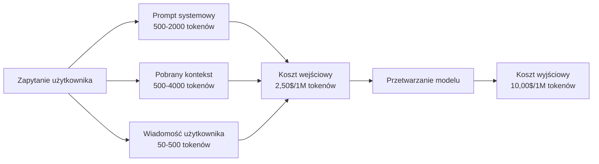
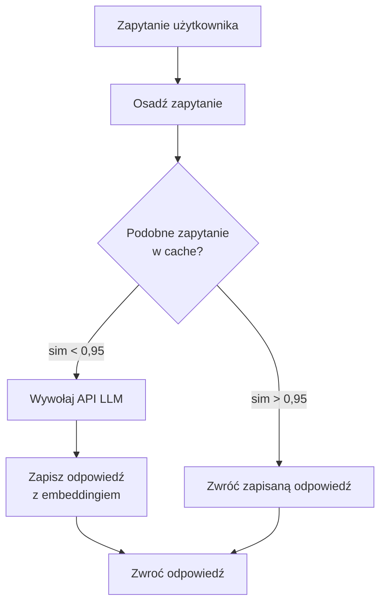
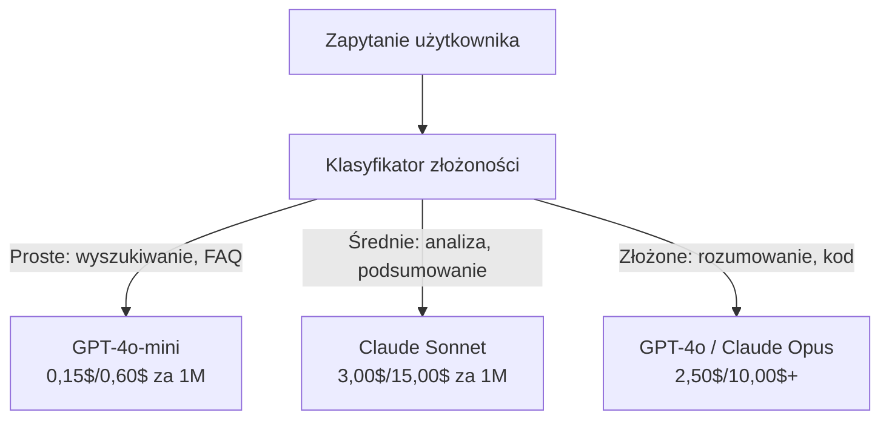

# Cache'owanie, Limitowanie Stawek i Optymalizacja Kosztów

> Większość startupów AI nie umiera przez złe modele. Umiera przez złą ekonomię jednostkową. Pojedyncze wywołanie GPT-4o kosztuje ułamki centa. Dziesięć tysięcy użytkowników wykonujących dziesięć zapytań dziennie kosztuje 250 dolarów za same tokeny wejściowe — zanim zarobisz pierwszego dolara. Firmy, które przetrwają, to te, które traktują każde wywołanie API jako transakcję finansową, a nie wywołanie funkcji.

**Type:** Build
**Languages:** Python
**Prerequisites:** Phase 11 Lesson 09 (Function Calling)
**Time:** ~45 minutes
**Related:** Phase 11 · 15 (Prompt Caching) — ta lekcja obejmuje cache'owanie na poziomie aplikacji (cache semantyczny, cache dokładnego hasha, routing modeli). Lekcja 15 obejmuje cache'owanie promptów na poziomie dostawcy (Anthropic cache_control, automatyczne OpenAI, CachedContent Gemini). Połącz obie, aby uzyskać 50-95% redukcji kosztów.

## Learning Objectives

- Zaimplementować cache semantyczny, który obsługuje powtarzające się lub podobne zapytania z cache'a zamiast wykonywać nowe wywołanie API
- Obliczać koszty na żądanie u różnych dostawców oraz implementować limitowanie stawek z uwzględnieniem tokenów i alerty budżetowe
- Zbudować warstwę optymalizacji kosztów z kompresją promptów, routingiem modeli (drogie vs tanie) i cache'owaniem odpowiedzi
- Zaprojektować warstwową strategię cache'owania wykorzystującą dokładne dopasowanie, podobieństwo semantyczne i cache'owanie prefiksów dla różnych typów zapytań

## The Problem

Budujesz czatbota RAG. Działa pięknie. Użytkownicy go uwielbiają.

Potem przychodzi faktura.

GPT-5 kosztuje 5 dolarów za milion tokenów wejściowych i 15 dolarów za milion wyjściowych. Claude Opus 4.7 kosztuje 15 dolarów wejściowe / 75 dolarów wyjściowe. Gemini 3 Pro kosztuje 1,25 dolara wejściowe / 5 dolarów wyjściowe. GPT-5-mini kosztuje 0,25/2 dolary. Poniższe ceny mają charakter poglądowy; zawsze sprawdzaj aktualną stronę cenową dostawcy.

Oto matematyka, która zabija startupy:

- 10 000 aktywnych użytkowników dziennie
- 10 zapytań na użytkownika dziennie
- 1000 tokenów wejściowych na zapytanie (prompt systemowy + kontekst + wiadomość użytkownika)
- 500 tokenów wyjściowych na odpowiedź

**Dzienny koszt wejściowy:** 10 000 x 10 x 1000 / 1 000 000 x 2,50 $ = **250 $/dzień**
**Dzienny koszt wyjściowy:** 10 000 x 10 x 500 / 1 000 000 x 10,00 $ = **500 $/dzień**
**Miesięczna suma:** **22 500 $/miesiąc**

To tylko LLM. Dodaj embeddingi, hosting bazy wektorowej, infrastrukturę. Otrzymujesz około 30 000 $/miesiąc za czatbota.

Najgorsze: 40-60% tych zapytań to prawie duplikaty. Użytkownicy zadają te same pytania, używając nieco innych słów. Twój prompt systemowy — identyczny w każdym żądaniu — jest rozliczany za każdym razem. Dokumenty kontekstowe pobrane przez RAG powtarzają się wśród użytkowników pytających o ten sam temat.

Płacisz pełną cenę za zbędne obliczenia.

## The Concept

### The Cost Anatomy of an LLM Call

Każde wywołanie API ma pięć składowych kosztu.



Prompt systemowy to cichy zabójca. Prompt systemowy o długości 1500 tokenów wysyłany z każdym żądaniem kosztuje 3,75 dolara za milion żądań tylko za ten prefiks. Przy 100 tysiącach żądań dziennie to 375 $/dzień — 11 250 $/miesiąc — za tekst, który nigdy się nie zmienia.

### Provider Caching: Wbudowane Rabaty

Wszyscy trzej główni dostawcy oferują w 2026 roku cache'owanie promptów po stronie dostawcy, ale mechanika się różni. Zobacz Faza 11 · 15, aby poznać szczegóły.

| Dostawca | Mechanizm | Rabat | Minimum | Czas przechowywania w cache |
|----------|-----------|-------|---------|-----------------------------|
| Anthropic | Jawne znaczniki cache_control | 90% przy trafieniu w cache (dopłata 25% przy zapisie) | 1024 tokeny (Sonnet/Opus), 2048 (Haiku) | Domyślnie 5 min; 1h rozszerzony (2x premia za zapis) |
| OpenAI | Automatyczne dopasowanie prefiksu | 50% przy trafieniu w cache | 1024 tokeny | Najlepsza staranność do 1 godziny |
| Google Gemini | Jawne API CachedContent | ~75% redukcji (plus przechowywanie) | 4096 (Flash) / 32768 (Pro) | Konfigurowalny TTL |

**Podejście Anthropic** jest jawne. Oznaczasz sekcje swojego prompta za pomocą `cache_control: {"type": "ephemeral"}`. Pierwsze żądanie płaci 25% premii za zapis. Kolejne żądania z tym samym prefiksem otrzymują 90% rabatu. Prompt systemowy o długości 2000 tokenów, który normalnie kosztuje 0,005 dolara, kosztuje 0,000625 dolara przy trafieniu w cache. Przy 100 tysiącach żądań oszczędza to 437,50 $/dzień.

**Podejście OpenAI** jest automatyczne. Każdy prefiks prompta, który pasuje do poprzedniego żądania, otrzymuje 50% rabatu. Nie są potrzebne żadne znaczniki. Kompromis: mniejszy rabat, mniejsza kontrola, ale zerowy wysiłek implementacyjny.

### Semantic Caching: Twoja Niestandardowa Warstwa

Cache'owanie u dostawcy działa tylko dla identycznych prefiksów. Cache semantyczny obsługuje trudniejszy przypadek: różne zapytania o tym samym znaczeniu.

"Jaka jest polityka zwrotów?" i "Jak zwrócić produkt?" to różne ciągi znaków, ale identyczny zamiar. Cache semantyczny osadza oba zapytania, oblicza podobieństwo cosinusowe i zwraca zapisaną odpowiedź, jeśli podobieństwo przekracza próg (zwykle 0,92-0,95).



Koszty embeddingu są pomijalne. OpenAI text-embedding-3-small kosztuje 0,02 dolara za milion tokenów. Sprawdzenie cache'a kosztuje prawie nic w porównaniu z pełnym wywołaniem LLM.

### Exact Caching: Hash i Dopasowanie

W przypadku deterministycznych wywołań (temperature=0, ten sam model, ten sam prompt) cache'owanie dokładne jest prostsze i szybsze. Zhashuj cały prompt, sprawdź cache, zwróć, jeśli znaleziono.

Działa to doskonale dla:
- Prompt systemowy + stały kontekst + identyczne zapytania użytkownika
- Wywołania funkcji z identycznymi definicjami narzędzi
- Przetwarzanie wsadowe, gdzie ten sam dokument jest przetwarzany wielokrotnie

### Rate Limiting: Ochrona Budżetu

Limitowanie stawek to nie tylko kwestia uczciwości. To kwestia przetrwania.

**Algorytm wiaderka tokenów:** każdy użytkownik otrzymuje wiaderko z N tokenami, które uzupełnia się w tempie R na sekundę. Żądanie zużywa tokeny z wiaderka. Jeśli wiaderko jest puste, żądanie jest odrzucane. Pozwala to na skoki (użycie całego wiaderka naraz) przy jednoczesnym egzekwowaniu średniego tempa.

**Limity na użytkownika:** ustaw dzienne/miesięczne limity tokenów na poziomie użytkownika.

| Poziom | Dzienna limit tokenów | Maks. żądań/min | Dostęp do modeli |
|--------|----------------------|-----------------|------------------|
| Free | 50 000 | 10 | Tylko GPT-4o-mini |
| Pro | 500 000 | 60 | GPT-4o, Claude Sonnet |
| Enterprise | 5 000 000 | 300 | Wszystkie modele |

### Model Routing: Właściwy Model do Właściwego Zadania

Nie każde zapytanie potrzebuje GPT-4o.

"O której godzinie zamyka sklep?" nie wymaga modelu za 10$/M wyjściowych. GPT-4o-mini za 0,60$/M wyjściowych radzi sobie doskonale. Claude Haiku za 1,25$/M wyjściowych też. Prosty klasyfikator kieruje tanie zapytania do tanich modeli, a złożone do drogich.



Dobrze dostrojony router oszczędza 40-70% na samych kosztach modeli.

### Cost Tracking: Wiedz, Gdzie Idą Pieniądze

Nie możesz zoptymalizować tego, czego nie mierzysz. Rejestruj każde wywołanie API z:

- Znacznik czasu
- Nazwa modelu
- Tokeny wejściowe
- Tokeny wyjściowe
- Opóźnienie (ms)
- Obliczony koszt ($)
- ID użytkownika
- Trafienie/pudło w cache
- Kategoria żądania

Te dane ujawniają, które funkcje są drogie, którzy użytkownicy są intensywnymi konsumentami i gdzie cache'owanie ma największy wpływ.

### Batching: Rabaty Hurtowe

API Batch od OpenAI przetwarza żądania asynchronicznie z 50% rabatem. Przesyłasz partię do 50 000 żądań, a wyniki wracają w ciągu 24 godzin.

Używaj batchy do:
- Nocnego przetwarzania dokumentów
- Klasyfikacji masowej
- Przebiegów ewaluacyjnych
- Potoków wzbogacania danych

Nie do: zapytań użytkowników w czasie rzeczywistym (opóźnienie ma znaczenie).

### Budget Alerts i Circuit Breakers

Wyłącznik awaryjny zatrzymuje wydawanie, gdy osiągniesz limit. Bez niego błąd lub nadużycie może spalić miesięczny budżet w ciągu godzin.

Ustaw trzy progi:
1. **Ostrzeżenie** (70% budżetu): wyślij alert
2. **Ograniczenie** (85% budżetu): przełącz tylko na tańsze modele
3. **Stop** (95% budżetu): odrzuć nowe żądania, zwracaj tylko zapisane odpowiedzi

### The Optimization Stack

Stosuj te techniki w podanej kolejności. Każda warstwa nakłada się na poprzednie.

| Warstwa | Technika | Typowe oszczędności | Wysiłek implementacyjny |
|---------|----------|---------------------|-------------------------|
| 1 | Cache'owanie promptów u dostawcy | 30-50% | Niski (dodaj znaczniki cache) |
| 2 | Cache'owanie dokładne | 10-20% | Niski (hash + dict) |
| 3 | Cache'owanie semantyczne | 15-30% | Średni (embeddingi + podobieństwo) |
| 4 | Routing modeli | 40-70% | Średni (klasyfikator) |
| 5 | Limitowanie stawek | Ochrona budżetu | Niski (wiaderko tokenów) |
| 6 | Kompresja promptów | 10-30% | Średni (przepisywanie promptów) |
| 7 | Batchowanie | 50% na kwalifikujących się | Niski (API Batch) |

Aplikacja RAG stosująca warstwy 1-5 zazwyczaj redukuje koszty z 22 500 $/miesiąc do 4 000-6 000 $/miesiąc. To różnica między wypalaniem gotówki a budowaniem biznesu.

### Real Savings: Before and After

Oto rzeczywiste zestawienie dla czatbota RAG obsługującego 10 000 DAU.

| Metryka | Przed optymalizacją | Po optymalizacji | Oszczędności |
|---------|---------------------|------------------|--------------|
| Miesięczny koszt LLM | 22 500 $ | 5 200 $ | 77% |
| Średni koszt na zapytanie | 0,0075 $ | 0,0017 $ | 77% |
| Współczynnik trafień w cache | 0% | 52% | -- |
| Zapytania kierowane do mini | 0% | 65% | -- |
| Opóźnienie P95 | 2800 ms | 900 ms (trafienia w cache: 50 ms) | 68% |
| Miesięczny koszt embeddingu | 0 $ | 180 $ | (nowy koszt) |
| Całkowity miesięczny koszt | 22 500 $ | 5 380 $ | 76% |

Koszt embeddingu dla cache'owania semantycznego (180 $/miesiąc) zwraca się w ciągu pierwszej godziny trafień w cache.

## Build It

### Step 1: Kalkulator Kosztów

Zbuduj kalkulator kosztów tokenów, który zna aktualne ceny głównych modeli.

```python
import hashlib
import time
import json
import math
from dataclasses import dataclass, field


MODEL_PRICING = {
    "gpt-4o": {"input": 2.50, "output": 10.00, "cached_input": 1.25},
    "gpt-4o-mini": {"input": 0.15, "output": 0.60, "cached_input": 0.075},
    "gpt-4.1": {"input": 2.00, "output": 8.00, "cached_input": 0.50},
    "gpt-4.1-mini": {"input": 0.40, "output": 1.60, "cached_input": 0.10},
    "gpt-4.1-nano": {"input": 0.10, "output": 0.40, "cached_input": 0.025},
    "o3": {"input": 2.00, "output": 8.00, "cached_input": 0.50},
    "o3-mini": {"input": 1.10, "output": 4.40, "cached_input": 0.55},
    "o4-mini": {"input": 1.10, "output": 4.40, "cached_input": 0.275},
    "claude-opus-4": {"input": 15.00, "output": 75.00, "cached_input": 1.50},
    "claude-sonnet-4": {"input": 3.00, "output": 15.00, "cached_input": 0.30},
    "claude-haiku-3.5": {"input": 0.80, "output": 4.00, "cached_input": 0.08},
    "gemini-2.5-pro": {"input": 1.25, "output": 10.00, "cached_input": 0.3125},
    "gemini-2.5-flash": {"input": 0.15, "output": 0.60, "cached_input": 0.0375},
}


def calculate_cost(model, input_tokens, output_tokens, cached_input_tokens=0):
    if model not in MODEL_PRICING:
        return {"error": f"Unknown model: {model}"}
    pricing = MODEL_PRICING[model]
    non_cached = input_tokens - cached_input_tokens
    input_cost = (non_cached / 1_000_000) * pricing["input"]
    cached_cost = (cached_input_tokens / 1_000_000) * pricing["cached_input"]
    output_cost = (output_tokens / 1_000_000) * pricing["output"]
    total = input_cost + cached_cost + output_cost
    return {
        "model": model,
        "input_tokens": input_tokens,
        "output_tokens": output_tokens,
        "cached_input_tokens": cached_input_tokens,
        "input_cost": round(input_cost, 6),
        "cached_input_cost": round(cached_cost, 6),
        "output_cost": round(output_cost, 6),
        "total_cost": round(total, 6),
    }
```

### Step 2: Cache Dokładny

Zhashuj cały prompt i zwróć zapisane odpowiedzi dla identycznych żądań.

```python
class ExactCache:
    def __init__(self, max_size=1000, ttl_seconds=3600):
        self.cache = {}
        self.max_size = max_size
        self.ttl = ttl_seconds
        self.hits = 0
        self.misses = 0

    def _hash(self, model, messages, temperature):
        key_data = json.dumps({"model": model, "messages": messages, "temperature": temperature}, sort_keys=True)
        return hashlib.sha256(key_data.encode()).hexdigest()

    def get(self, model, messages, temperature=0.0):
        if temperature > 0:
            self.misses += 1
            return None
        key = self._hash(model, messages, temperature)
        if key in self.cache:
            entry = self.cache[key]
            if time.time() - entry["timestamp"] < self.ttl:
                self.hits += 1
                entry["access_count"] += 1
                return entry["response"]
            del self.cache[key]
        self.misses += 1
        return None

    def put(self, model, messages, temperature, response):
        if temperature > 0:
            return
        if len(self.cache) >= self.max_size:
            oldest_key = min(self.cache, key=lambda k: self.cache[k]["timestamp"])
            del self.cache[oldest_key]
        key = self._hash(model, messages, temperature)
        self.cache[key] = {
            "response": response,
            "timestamp": time.time(),
            "access_count": 1,
        }

    def stats(self):
        total = self.hits + self.misses
        return {
            "hits": self.hits,
            "misses": self.misses,
            "hit_rate": round(self.hits / total, 4) if total > 0 else 0,
            "cache_size": len(self.cache),
        }
```

### Step 3: Cache Semantyczny

Osadź zapytania i zwróć zapisane odpowiedzi, gdy podobieństwo przekroczy próg.

```python
def simple_embed(text):
    words = text.lower().split()
    vocab = {}
    for w in words:
        vocab[w] = vocab.get(w, 0) + 1
    norm = math.sqrt(sum(v * v for v in vocab.values()))
    if norm == 0:
        return {}
    return {k: v / norm for k, v in vocab.items()}


def cosine_similarity(a, b):
    if not a or not b:
        return 0.0
    all_keys = set(a) | set(b)
    dot = sum(a.get(k, 0) * b.get(k, 0) for k in all_keys)
    return dot


class SemanticCache:
    def __init__(self, similarity_threshold=0.85, max_size=500, ttl_seconds=3600):
        self.entries = []
        self.threshold = similarity_threshold
        self.max_size = max_size
        self.ttl = ttl_seconds
        self.hits = 0
        self.misses = 0

    def get(self, query):
        query_embedding = simple_embed(query)
        now = time.time()
        best_match = None
        best_sim = 0.0
        for entry in self.entries:
            if now - entry["timestamp"] > self.ttl:
                continue
            sim = cosine_similarity(query_embedding, entry["embedding"])
            if sim > best_sim:
                best_sim = sim
                best_match = entry
        if best_match and best_sim >= self.threshold:
            self.hits += 1
            best_match["access_count"] += 1
            return {"response": best_match["response"], "similarity": round(best_sim, 4), "original_query": best_match["query"]}
        self.misses += 1
        return None

    def put(self, query, response):
        if len(self.entries) >= self.max_size:
            self.entries.sort(key=lambda e: e["timestamp"])
            self.entries.pop(0)
        self.entries.append({
            "query": query,
            "embedding": simple_embed(query),
            "response": response,
            "timestamp": time.time(),
            "access_count": 1,
        })

    def stats(self):
        total = self.hits + self.misses
        return {
            "hits": self.hits,
            "misses": self.misses,
            "hit_rate": round(self.hits / total, 4) if total > 0 else 0,
            "cache_size": len(self.entries),
        }
```

### Step 4: Ogranicznik Stawek

Ogranicznik stawek z algorytmem wiaderka tokenów z limitami na użytkownika.

```python
class TokenBucketRateLimiter:
    def __init__(self):
        self.buckets = {}
        self.tiers = {
            "free": {"capacity": 50_000, "refill_rate": 500, "max_requests_per_min": 10},
            "pro": {"capacity": 500_000, "refill_rate": 5_000, "max_requests_per_min": 60},
            "enterprise": {"capacity": 5_000_000, "refill_rate": 50_000, "max_requests_per_min": 300},
        }

    def _get_bucket(self, user_id, tier="free"):
        if user_id not in self.buckets:
            tier_config = self.tiers.get(tier, self.tiers["free"])
            self.buckets[user_id] = {
                "tokens": tier_config["capacity"],
                "capacity": tier_config["capacity"],
                "refill_rate": tier_config["refill_rate"],
                "last_refill": time.time(),
                "request_timestamps": [],
                "max_rpm": tier_config["max_requests_per_min"],
                "tier": tier,
                "total_tokens_used": 0,
            }
        return self.buckets[user_id]

    def _refill(self, bucket):
        now = time.time()
        elapsed = now - bucket["last_refill"]
        refill = int(elapsed * bucket["refill_rate"])
        if refill > 0:
            bucket["tokens"] = min(bucket["capacity"], bucket["tokens"] + refill)
            bucket["last_refill"] = now

    def check(self, user_id, tokens_needed, tier="free"):
        bucket = self._get_bucket(user_id, tier)
        self._refill(bucket)
        now = time.time()
        bucket["request_timestamps"] = [t for t in bucket["request_timestamps"] if now - t < 60]
        if len(bucket["request_timestamps"]) >= bucket["max_rpm"]:
            return {"allowed": False, "reason": "rate_limit", "retry_after_seconds": 60 - (now - bucket["request_timestamps"][0])}
        if bucket["tokens"] < tokens_needed:
            deficit = tokens_needed - bucket["tokens"]
            wait = deficit / bucket["refill_rate"]
            return {"allowed": False, "reason": "token_limit", "tokens_available": bucket["tokens"], "retry_after_seconds": round(wait, 1)}
        return {"allowed": True, "tokens_available": bucket["tokens"]}

    def consume(self, user_id, tokens_used, tier="free"):
        bucket = self._get_bucket(user_id, tier)
        bucket["tokens"] -= tokens_used
        bucket["request_timestamps"].append(time.time())
        bucket["total_tokens_used"] += tokens_used

    def get_usage(self, user_id):
        if user_id not in self.buckets:
            return {"error": "User not found"}
        b = self.buckets[user_id]
        return {
            "user_id": user_id,
            "tier": b["tier"],
            "tokens_remaining": b["tokens"],
            "capacity": b["capacity"],
            "total_tokens_used": b["total_tokens_used"],
            "utilization": round(b["total_tokens_used"] / b["capacity"], 4) if b["capacity"] else 0,
        }
```

### Step 5: Śledzenie Kosztów

Rejestruj każde wywołanie i obliczaj bieżące sumy.

```python
class CostTracker:
    def __init__(self, monthly_budget=1000.0):
        self.logs = []
        self.monthly_budget = monthly_budget
        self.alerts = []

    def log_call(self, model, input_tokens, output_tokens, cached_input_tokens=0, latency_ms=0, user_id="anonymous", cache_status="miss"):
        cost = calculate_cost(model, input_tokens, output_tokens, cached_input_tokens)
        entry = {
            "timestamp": time.time(),
            "model": model,
            "input_tokens": input_tokens,
            "output_tokens": output_tokens,
            "cached_input_tokens": cached_input_tokens,
            "latency_ms": latency_ms,
            "cost": cost["total_cost"],
            "user_id": user_id,
            "cache_status": cache_status,
        }
        self.logs.append(entry)
        self._check_budget()
        return entry

    def _check_budget(self):
        total = self.total_cost()
        pct = total / self.monthly_budget if self.monthly_budget > 0 else 0
        if pct >= 0.95 and not any(a["level"] == "stop" for a in self.alerts):
            self.alerts.append({"level": "stop", "message": f"Budget 95% consumed: ${total:.2f}/${self.monthly_budget:.2f}", "timestamp": time.time()})
        elif pct >= 0.85 and not any(a["level"] == "throttle" for a in self.alerts):
            self.alerts.append({"level": "throttle", "message": f"Budget 85% consumed: ${total:.2f}/${self.monthly_budget:.2f}", "timestamp": time.time()})
        elif pct >= 0.70 and not any(a["level"] == "warning" for a in self.alerts):
            self.alerts.append({"level": "warning", "message": f"Budget 70% consumed: ${total:.2f}/${self.monthly_budget:.2f}", "timestamp": time.time()})

    def total_cost(self):
        return round(sum(e["cost"] for e in self.logs), 6)

    def cost_by_model(self):
        by_model = {}
        for e in self.logs:
            m = e["model"]
            if m not in by_model:
                by_model[m] = {"calls": 0, "cost": 0, "input_tokens": 0, "output_tokens": 0}
            by_model[m]["calls"] += 1
            by_model[m]["cost"] = round(by_model[m]["cost"] + e["cost"], 6)
            by_model[m]["input_tokens"] += e["input_tokens"]
            by_model[m]["output_tokens"] += e["output_tokens"]
        return by_model

    def cache_savings(self):
        cache_hits = [e for e in self.logs if e["cache_status"] == "hit"]
        if not cache_hits:
            return {"saved": 0, "cache_hits": 0}
        saved = 0
        for e in cache_hits:
            full_cost = calculate_cost(e["model"], e["input_tokens"], e["output_tokens"])
            saved += full_cost["total_cost"]
        return {"saved": round(saved, 4), "cache_hits": len(cache_hits)}

    def summary(self):
        if not self.logs:
            return {"total_calls": 0, "total_cost": 0}
        total_latency = sum(e["latency_ms"] for e in self.logs)
        cache_hits = sum(1 for e in self.logs if e["cache_status"] == "hit")
        return {
            "total_calls": len(self.logs),
            "total_cost": self.total_cost(),
            "avg_cost_per_call": round(self.total_cost() / len(self.logs), 6),
            "avg_latency_ms": round(total_latency / len(self.logs), 1),
            "cache_hit_rate": round(cache_hits / len(self.logs), 4),
            "cost_by_model": self.cost_by_model(),
            "cache_savings": self.cache_savings(),
            "budget_remaining": round(self.monthly_budget - self.total_cost(), 2),
            "budget_utilization": round(self.total_cost() / self.monthly_budget, 4) if self.monthly_budget > 0 else 0,
            "alerts": self.alerts,
        }
```

### Step 6: Router Modeli

Kieruj zapytania do najtańszego modelu, który może je obsłużyć.

```python
SIMPLE_KEYWORDS = ["what time", "hours", "address", "phone", "price", "return policy", "hello", "hi", "thanks", "yes", "no"]
COMPLEX_KEYWORDS = ["analyze", "compare", "explain why", "write code", "debug", "architect", "design", "trade-off", "evaluate"]


def classify_complexity(query):
    q = query.lower()
    if len(q.split()) <= 5 or any(kw in q for kw in SIMPLE_KEYWORDS):
        return "simple"
    if any(kw in q for kw in COMPLEX_KEYWORDS):
        return "complex"
    return "medium"


def route_model(query, tier="pro"):
    complexity = classify_complexity(query)
    routing_table = {
        "simple": {"free": "gpt-4.1-nano", "pro": "gpt-4o-mini", "enterprise": "gpt-4o-mini"},
        "medium": {"free": "gpt-4o-mini", "pro": "claude-sonnet-4", "enterprise": "claude-sonnet-4"},
        "complex": {"free": "gpt-4o-mini", "pro": "gpt-4o", "enterprise": "claude-opus-4"},
    }
    model = routing_table[complexity].get(tier, "gpt-4o-mini")
    return {"query": query, "complexity": complexity, "model": model, "tier": tier}
```

### Step 7: Uruchom Demo

```python
def simulate_llm_call(model, query):
    input_tokens = len(query.split()) * 4 + 500
    output_tokens = 150 + (len(query.split()) * 2)
    latency = 200 + (output_tokens * 2)
    return {
        "model": model,
        "response": f"[Simulated {model} response to: {query[:50]}...]",
        "input_tokens": input_tokens,
        "output_tokens": output_tokens,
        "latency_ms": latency,
    }


def run_demo():
    print("=" * 60)
    print("  Cache'owanie, Limitowanie Stawek i Optymalizacja Kosztów — Demo")
    print("=" * 60)

    print("\n--- Cennik Modeli ---")
    for model, pricing in list(MODEL_PRICING.items())[:6]:
        cost_1k = calculate_cost(model, 1000, 500)
        print(f"  {model}: ${cost_1k['total_cost']:.6f} za 1K wejściowych + 500 wyjściowych")

    print("\n--- Porównanie Kosztów: 100K Żądań ---")
    for model in ["gpt-4o", "gpt-4o-mini", "claude-sonnet-4", "claude-haiku-3.5"]:
        cost = calculate_cost(model, 1000 * 100_000, 500 * 100_000)
        print(f"  {model}: ${cost['total_cost']:.2f}")

    print("\n--- Oszczędności Cache Anthropic ---")
    no_cache = calculate_cost("claude-sonnet-4", 2000, 500, 0)
    with_cache = calculate_cost("claude-sonnet-4", 2000, 500, 1500)
    saving = no_cache["total_cost"] - with_cache["total_cost"]
    print(f"  Bez cache: ${no_cache['total_cost']:.6f}")
    print(f"  Z 1500 tokenami w cache: ${with_cache['total_cost']:.6f}")
    print(f"  Oszczędność na wywołanie: ${saving:.6f} ({saving/no_cache['total_cost']*100:.1f}%)")

    exact_cache = ExactCache(max_size=100, ttl_seconds=300)
    semantic_cache = SemanticCache(similarity_threshold=0.75, max_size=100)
    rate_limiter = TokenBucketRateLimiter()
    tracker = CostTracker(monthly_budget=100.0)

    print("\n--- Cache Dokładny ---")
    messages_1 = [{"role": "user", "content": "What is the return policy?"}]
    result = exact_cache.get("gpt-4o-mini", messages_1, 0.0)
    print(f"  Pierwsze wyszukanie: {'TRAFIENIE' if result else 'PUDŁO'}")
    exact_cache.put("gpt-4o-mini", messages_1, 0.0, "You can return items within 30 days.")
    result = exact_cache.get("gpt-4o-mini", messages_1, 0.0)
    print(f"  Drugie wyszukanie: {'TRAFIENIE' if result else 'PUDŁO'} -> {result}")
    result = exact_cache.get("gpt-4o-mini", messages_1, 0.7)
    print(f"  Z temp=0.7: {'TRAFIENIE' if result else 'PUDŁO (niedeterministyczne, pomiń cache)'}")
    print(f"  Statystyki: {exact_cache.stats()}")

    print("\n--- Cache Semantyczny ---")
    test_queries = [
        ("What is the return policy?", "Items can be returned within 30 days with receipt."),
        ("How do I return an item?", None),
        ("What are your store hours?", "We are open 9am-9pm Monday through Saturday."),
        ("When does the store open?", None),
        ("Tell me about quantum computing", "Quantum computers use qubits..."),
        ("Explain quantum mechanics", None),
    ]
    for query, response in test_queries:
        cached = semantic_cache.get(query)
        if cached:
            print(f"  '{query[:40]}' -> TRAFIENIE W CACHE (sim={cached['similarity']}, oryginal='{cached['original_query'][:40]}')")
        elif response:
            semantic_cache.put(query, response)
            print(f"  '{query[:40]}' -> PUDŁO (zapisano)")
        else:
            print(f"  '{query[:40]}' -> PUDŁO (brak dopasowania)")
    print(f"  Statystyki: {semantic_cache.stats()}")

    print("\n--- Limitowanie Stawek ---")
    for i in range(12):
        check = rate_limiter.check("user_1", 1000, "free")
        if check["allowed"]:
            rate_limiter.consume("user_1", 1000, "free")
        status = "OK" if check["allowed"] else f"ZABLOKOWANE ({check['reason']})"
        if i < 5 or not check["allowed"]:
            print(f"  Żądanie {i+1}: {status}")
    print(f"  Użycie: {rate_limiter.get_usage('user_1')}")

    print("\n--- Routing Modeli ---")
    routing_queries = [
        "What time do you close?",
        "Summarize this quarterly earnings report",
        "Analyze the trade-offs between microservices and monoliths",
        "Hello",
        "Write code for a binary search tree with deletion",
    ]
    for q in routing_queries:
        route = route_model(q, "pro")
        print(f"  '{q[:50]}' -> {route['model']} ({route['complexity']})")

    print("\n--- Pełny Potok: Przed vs Po Optymalizacji ---")
    queries = [
        "What is the return policy?",
        "How do I return something?",
        "What are your hours?",
        "When do you open?",
        "Explain the difference between TCP and UDP",
        "Compare TCP vs UDP protocols",
        "Hello",
        "What is your phone number?",
        "Write a Python function to sort a list",
        "Analyze the pros and cons of serverless architecture",
    ]

    print("\n  [Przed: brak cache, pojedynczy model (gpt-4o)]")
    tracker_before = CostTracker(monthly_budget=1000.0)
    for q in queries:
        result = simulate_llm_call("gpt-4o", q)
        tracker_before.log_call("gpt-4o", result["input_tokens"], result["output_tokens"], latency_ms=result["latency_ms"], cache_status="miss")
    before = tracker_before.summary()
    print(f"  Całkowity koszt: ${before['total_cost']:.6f}")
    print(f"  Średni koszt/wywołanie: ${before['avg_cost_per_call']:.6f}")
    print(f"  Średnie opóźnienie: {before['avg_latency_ms']}ms")

    print("\n  [Po: cache + routing + limitowanie stawek]")
    exact_c = ExactCache()
    semantic_c = SemanticCache(similarity_threshold=0.75)
    tracker_after = CostTracker(monthly_budget=1000.0)

    for q in queries:
        messages = [{"role": "user", "content": q}]
        cached = exact_c.get("gpt-4o", messages, 0.0)
        if cached:
            tracker_after.log_call("gpt-4o-mini", 0, 0, latency_ms=5, cache_status="hit")
            continue
        sem_cached = semantic_c.get(q)
        if sem_cached:
            tracker_after.log_call("gpt-4o-mini", 0, 0, latency_ms=15, cache_status="hit")
            continue
        route = route_model(q)
        result = simulate_llm_call(route["model"], q)
        tracker_after.log_call(route["model"], result["input_tokens"], result["output_tokens"], latency_ms=result["latency_ms"], cache_status="miss")
        exact_c.put(route["model"], messages, 0.0, result["response"])
        semantic_c.put(q, result["response"])

    after = tracker_after.summary()
    print(f"  Całkowity koszt: ${after['total_cost']:.6f}")
    print(f"  Średni koszt/wywołanie: ${after['avg_cost_per_call']:.6f}")
    print(f"  Średnie opóźnienie: {after['avg_latency_ms']}ms")
    print(f"  Współczynnik trafień w cache: {after['cache_hit_rate']:.0%}")

    if before["total_cost"] > 0:
        savings_pct = (1 - after["total_cost"] / before["total_cost"]) * 100
        print(f"\n  OSZCZĘDNOŚCI: {savings_pct:.1f}% redukcji kosztów")
        print(f"  Poprawa opóźnienia: {(1 - after['avg_latency_ms'] / before['avg_latency_ms']) * 100:.1f}% szybciej")

    print("\n--- Demo Alertów Budżetowych ---")
    alert_tracker = CostTracker(monthly_budget=0.01)
    for i in range(5):
        alert_tracker.log_call("gpt-4o", 5000, 2000, latency_ms=500)
    print(f"  Wydano: ${alert_tracker.total_cost():.6f} / ${alert_tracker.monthly_budget}")
    for alert in alert_tracker.alerts:
        print(f"  ALERT [{alert['level'].upper()}]: {alert['message']}")

    print("\n--- Podział Kosztów według Modelu ---")
    multi_tracker = CostTracker(monthly_budget=500.0)
    for _ in range(50):
        multi_tracker.log_call("gpt-4o-mini", 800, 200, latency_ms=150)
    for _ in range(30):
        multi_tracker.log_call("claude-sonnet-4", 1500, 500, latency_ms=400)
    for _ in range(10):
        multi_tracker.log_call("gpt-4o", 2000, 800, latency_ms=600)
    for _ in range(10):
        multi_tracker.log_call("claude-opus-4", 3000, 1000, latency_ms=1200)
    breakdown = multi_tracker.cost_by_model()
    for model, data in sorted(breakdown.items(), key=lambda x: x[1]["cost"], reverse=True):
        print(f"  {model}: {data['calls']} wywołań, ${data['cost']:.6f}, {data['input_tokens']:,} wejściowych / {data['output_tokens']:,} wyjściowych")
    print(f"  Razem: ${multi_tracker.total_cost():.6f}")

    print("\n" + "=" * 60)
    print("  Demo zakończone.")
    print("=" * 60)


if __name__ == "__main__":
    run_demo()
```

## Use It

### Cache'owanie Promptów Anthropic

```python
# import anthropic
#
# client = anthropic.Anthropic()
#
# response = client.messages.create(
#     model="claude-sonnet-4-20250514",
#     max_tokens=1024,
#     system=[
#         {
#             "type": "text",
#             "text": "You are a helpful customer support agent for Acme Corp...",
#             "cache_control": {"type": "ephemeral"},
#         }
#     ],
#     messages=[{"role": "user", "content": "What is the return policy?"}],
# )
#
# print(f"Input tokens: {response.usage.input_tokens}")
# print(f"Cache creation tokens: {response.usage.cache_creation_input_tokens}")
# print(f"Cache read tokens: {response.usage.cache_read_input_tokens}")
```

Pierwsze wywołanie zapisuje do cache (25% premii). Każde kolejne wywołanie z tym samym prefiksem promptu systemowego odczytuje z cache (90% rabatu). Cache trwa 5 minut i resetuje licznik czasu przy każdym trafieniu.

### Automatyczne Cache'owanie OpenAI

```python
# from openai import OpenAI
#
# client = OpenAI()
#
# response = client.chat.completions.create(
#     model="gpt-4o",
#     messages=[
#         {"role": "system", "content": "You are a helpful customer support agent..."},
#         {"role": "user", "content": "What is the return policy?"},
#     ],
# )
#
# print(f"Prompt tokens: {response.usage.prompt_tokens}")
# print(f"Cached tokens: {response.usage.prompt_tokens_details.cached_tokens}")
# print(f"Completion tokens: {response.usage.completion_tokens}")
```

OpenAI cache'uje automatycznie. Każdy prefiks promptu o długości 1024+ tokenów pasujący do niedawnego żądania otrzymuje 50% rabatu. Nie są potrzebne żadne zmiany w kodzie — wystarczy sprawdzić `prompt_tokens_details.cached_tokens` w odpowiedzi, aby potwierdzić, że działa.

### API Batch OpenAI

```python
# import json
# from openai import OpenAI
#
# client = OpenAI()
#
# requests = []
# for i, query in enumerate(queries):
#     requests.append({
#         "custom_id": f"request-{i}",
#         "method": "POST",
#         "url": "/v1/chat/completions",
#         "body": {
#             "model": "gpt-4o-mini",
#             "messages": [{"role": "user", "content": query}],
#         },
#     })
#
# with open("batch_input.jsonl", "w") as f:
#     for r in requests:
#         f.write(json.dumps(r) + "\n")
#
# batch_file = client.files.create(file=open("batch_input.jsonl", "rb"), purpose="batch")
# batch = client.batches.create(input_file_id=batch_file.id, endpoint="/v1/chat/completions", completion_window="24h")
# print(f"Batch ID: {batch.id}, Status: {batch.status}")
```

API Batch daje stały 50% rabat na wszystkie tokeny. Wyniki docierają w ciągu 24 godzin. Idealne do obciążeń nie czasu rzeczywistego: ewaluacje, etykietowanie danych, masowe podsumowania.

### Produkcyjny Cache Semantyczny z Redis

```python
# import redis
# import numpy as np
# from openai import OpenAI
#
# r = redis.Redis()
# client = OpenAI()
#
# def get_embedding(text):
#     response = client.embeddings.create(model="text-embedding-3-small", input=text)
#     return response.data[0].embedding
#
# def semantic_cache_lookup(query, threshold=0.95):
#     query_emb = np.array(get_embedding(query))
#     keys = r.keys("cache:emb:*")
#     best_sim, best_key = 0, None
#     for key in keys:
#         stored_emb = np.frombuffer(r.get(key), dtype=np.float32)
#         sim = np.dot(query_emb, stored_emb) / (np.linalg.norm(query_emb) * np.linalg.norm(stored_emb))
#         if sim > best_sim:
#             best_sim, best_key = sim, key
#     if best_sim >= threshold and best_key:
#         response_key = best_key.decode().replace("cache:emb:", "cache:resp:")
#         return r.get(response_key).decode()
#     return None
```

W produkcji zastąp skanowanie liniowe indeksem wektorowym (Redis Vector Search, Pinecone lub pgvector). Skanowanie liniowe działa dla <1000 wpisów. Powyżej tego użyj ANN (przybliżony najbliższy sąsiad) dla wyszukiwania O(log n).

## Ship It

Ta lekcja tworzy `outputs/prompt-cost-optimizer.md` — wielokrotnego użytku prompt, który analizuje twoją aplikację LLM i rekomenduje konkretne optymalizacje kosztów z prognozowanymi oszczędnościami.

Tworzy również `outputs/skill-cost-patterns.md` — framework decyzyjny do wyboru odpowiedniej strategii cache'owania, konfiguracji limitowania stawek i reguł routingu modeli dla twojego przypadku użycia.

## Exercises

1. **Zaimplementuj usuwanie LRU dla cache'a semantycznego.** Zastąp usuwanie najstarszego wpisu usuwaniem najrzadziej używanego. Śledź czas ostatniego dostępu dla każdego wpisu i usuń wpis z najstarszym czasem dostępu, gdy cache jest pełny. Porównaj współczynniki trafień między dwiema strategiami na 100 zapytaniach.

2. **Zbuduj narzędzie do prognozowania kosztów.** Mając log wywołań API (logi CostTracker), prognozuj miesięczny koszt na podstawie średniej z ostatnich 7 dni. Uwzględnij wzorce dni powszednich/weekendów. Wywołaj alert, jeśli prognozowany miesięczny koszt przekracza budżet o więcej niż 20%.

3. **Zaimplementuj warstwowe cache'owanie semantyczne.** Użyj dwóch progów podobieństwa: 0,98 dla trafień o wysokim poziomie ufności (zwróć natychmiast) i 0,90 dla trafień o średnim poziomie ufności (zwróć z zastrzeżeniem: "Na podstawie podobnego wcześniejszego pytania..."). Śledź, z którego poziomu pochodzi każde trafienie i zmierz różnice w zadowoleniu użytkowników.

4. **Zbuduj klasyfikator routingu modeli.** Zastąp klasyfikator oparty na słowach kluczowych klasyfikatorem opartym na embeddingach. Osadź 50 oznaczonych zapytań (proste/średnie/złożone), a następnie klasyfikuj nowe zapytania, znajdując najbliższy oznaczony przykład. Zmierz dokładność klasyfikacji na zbiorze testowym 20 zapytań.

5. **Zaimplementuj wyłącznik awaryjny z poziomami degradacji.** Przy 70% budżetu zaloguj ostrzeżenie. Przy 85% automatycznie przełącz cały routing na najtańszy model (gpt-4o-mini). Przy 95% obsługuj tylko zapisane odpowiedzi i odrzucaj nowe zapytania. Przetestuj, symulując 1000 żądań z budżetem 1,00 $ i sprawdź, czy każdy próg wyzwala się poprawnie.

## Key Terms

| Termin | Co ludzie mówią | Co to naprawdę znaczy |
|--------|-----------------|-----------------------|
| Prompt caching | "Cache'uj prompt systemowy" | Cache'owanie na poziomie dostawcy, gdzie powtarzające się prefiksy promptów otrzymują rabat (90% Anthropic, 50% OpenAI) — brak zmian w kodzie dla OpenAI, jawne znaczniki dla Anthropic |
| Semantic caching | "Inteligentne cache'owanie" | Osadzanie zapytania, obliczanie podobieństwa do poprzednich zapytań i zwracanie zapisanej odpowiedzi, jeśli podobieństwo przekracza próg — wyłapuje parafrazy, których nie wyłapuje dokładne dopasowanie |
| Exact caching | "Cache'owanie hashem" | Haszowanie całego promptu (model + wiadomości + temperatura) i zwracanie zapisanej odpowiedzi dla identycznych danych wejściowych — działa tylko dla deterministycznych wywołań z temperature=0 |
| Token bucket | "Ogranicznik stawek" | Algorytm, w którym każdy użytkownik ma wiaderko z N tokenami, które uzupełnia się w tempie R na sekundę — pozwala na skoki do N przy jednoczesnym egzekwowaniu średniego tempa R |
| Model routing | "Tani routing" | Użycie klasyfikatora do kierowania prostych zapytań do tanich modeli (GPT-4o-mini, Haiku) i złożonych zapytań do drogich modeli (GPT-4o, Opus) — oszczędza 40-70% na kosztach modeli |
| Cost tracking | "Mierzenie" | Rejestrowanie każdego wywołania API z modelem, tokenami, opóźnieniem, kosztem i ID użytkownika, abyś dokładnie wiedział, gdzie idą pieniądze i które funkcje są drogie |
| Circuit breaker | "Wyłącznik awaryjny" | Automatyczne degradowanie usługi (tańsze modele, tylko cache) lub całkowite zatrzymanie żądań, gdy wydatki zbliżają się do limitu budżetu |
| Batch API | "Rabat hurtowy" | Asynchroniczne przetwarzanie OpenAI z 50% rabatem — prześlij do 50 000 żądań, wyniki w ciągu 24 godzin |
| Prompt compression | "Dieta tokenów" | Przepisywanie promptów systemowych i kontekstu, aby używać mniej tokenów przy zachowaniu znaczenia — krótsze prompty kosztują mniej i często działają lepiej |
| Cache hit rate | "Wydajność cache" | Procent żądań obsłużonych z cache zamiast wywoływania LLM — 40-60% jest typowe dla produkcyjnych chatbotów, oszczędza proporcjonalnie koszty |

## Further Reading

- [Anthropic Prompt Caching Guide](https://docs.anthropic.com/en/docs/build-with-claude/prompt-caching) — oficjalna dokumentacja jawnych znaczników cache_control Anthropic, cennik i zachowanie czasu życia cache
- [OpenAI Prompt Caching](https://platform.openai.com/docs/guides/prompt-caching) — automatyczne cache'owanie OpenAI, jak weryfikować trafienia w cache przez pola użycia i minimalne długości prefiksów
- [OpenAI Batch API](https://platform.openai.com/docs/guides/batch) — 50% rabatu za przetwarzanie asynchroniczne, format JSONL, 24-godzinne okno realizacji i limity 50K żądań
- [GPTCache](https://github.com/zilliztech/GPTCache) — biblioteka open-source do cache'owania semantycznego wspierająca wiele backendów embeddingu, magazynów wektorowych i polityk usuwania
- [Martian Model Router](https://docs.withmartian.com) — produkcyjny routing modeli, który automatycznie wybiera najtańszy model zdolny do obsłużenia każdego zapytania
- [Not Diamond](https://www.notdiamond.ai) — router modeli oparty na ML, który uczy się na wzorcach twojego ruchu, optymalizując kompromisy koszt/jakość u różnych dostawców
- [Helicone](https://www.helicone.ai) — platforma obserwowalności LLM ze śledzeniem kosztów, cache'owaniem, limitowaniem stawek i alertami budżetowymi jako warstwa proxy
- [Dean & Barroso, "The Tail at Scale" (CACM 2013)](https://research.google/pubs/the-tail-at-scale/) — opóźnienie, przepustowość, percentyle TTFT/TPOT i żądania zabezpieczone; model kosztów stojący za "wybierz najtańszy model, który wciąż spełnia P95."
- [Kwon et al., "Efficient Memory Management for Large Language Model Serving with PagedAttention" (SOSP 2023)](https://arxiv.org/abs/2309.06180) — artykuł vLLM; dlaczego stronicowany KV-cache + ciągłe batchowanie pokonują naiwne serwery 24× pod względem przepustowości, warstwa infra pod "cache'owaniem i kosztem."
- [Dao et al., "FlashAttention-2: Faster Attention with Better Parallelism and Work Partitioning" (ICLR 2024)](https://arxiv.org/abs/2307.08691) — redukcja kosztów na poziomie jądra, ortogonalna do cache'owania promptów; czytaj obok spekulatywnego dekodowania i GQA dla pełnego obrazu krzywej kosztów.