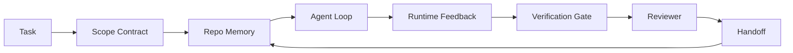

# Inżynieria warsztatu agenta: Dlaczego zdolne modele wciąż zawodzą

> Zdolny model to za mało. Niezawodni agenci potrzebują warsztatu: instrukcji, stanu, zakresu, informacji zwrotnej, weryfikacji, przeglądu i przekazania. Odbierz to, a nawet graniczny model wyprodukuje pracę, którą niebezpiecznie jest wdrożyć.

**Type:** Learn + Build
**Languages:** Python (stdlib)
**Prerequisites:** Phase 14 · 01 (Agent Loop), Phase 14 · 26 (Failure Modes)
**Time:** ~45 minutes

## Learning Objectives

- Oddziel zdolność modelu od niezawodności wykonania.
- Wymień siedem powierzchni warsztatu, które decydują, czy agent zostanie wdrożony.
- Porównaj uruchomienie tylko z promptem z uruchomieniem kierowanym warsztatem na małym zadaniu repozytoryjnym.
- Wyprodukuj raport trybów awarii, który mapuje każdą brakującą powierzchnię na objaw, który spowodowała.

## Problem

Wrzucasz graniczny model do prawdziwego repozytorium i prosisz go o dodanie walidacji wejścia. Otwiera cztery pliki, pisze wiarygodny kod, deklaruje sukces i kończy. Uruchamiasz testy. Dwa zawodzą. Trzeci plik został dotknięty, który nie miał nic wspólnego z walidacją. Nie ma rekordu tego, co agent założył, co najpierw spróbował ani co pozostało do zrobienia.

Model nie mylił się co do Pythona. Mylił się co do pracy. Nie miał pojęcia, co liczy się jako zrobione, gdzie wolno mu pisać, które testy są autorytatywne ani jak następna sesja miała kontynuować.

To nie jest błąd modelu. To błąd warsztatu. Powierzchnia wokół agenta brakuje części, które zamieniają jednorazową generację w niezawodną, możliwą do wznowienia inżynierię.

## Koncepcja

Warsztat to środowisko operacyjne, które otacza model podczas zadania. Ma siedem powierzchni:

| Powierzchnia | Co niesie | Awaria, gdy brakuje |
|---------|-----------------|----------------------|
| Instrukcje | Reguły startowe, zabronione akcje, definicja ukończenia | Agent zgaduje, co znaczy wdrożenie |
| Stan | Bieżące zadanie, dotknięte pliki, blokery, następna akcja | Każda sesja zaczyna od zera |
| Zakres | Dozwolone pliki, zabronione pliki, kryteria akceptacji | Edycje wyciekają do niepowiązanego kodu |
| Informacja zwrotna | Rzeczywiste wyjście poleceń przechwycone do pętli | Agent deklaruje sukces na 400 |
| Weryfikacja | Testy, lint, uruchomienie dymne, sprawdzenie zakresu | "Wygląda dobrze" trafia do main |
| Przegląd | Drugie przejście z inną rolą | Budowniczy ocenia własną pracę |
| Przekazanie | Co się zmieniło, dlaczego, co zostało | Następna sesja odkrywa wszystko od nowa |

Warsztat jest niezależny od modelu. Możesz wymienić model i zachować powierzchnie. Nie możesz wymienić powierzchni i zachować niezawodności.



Pętla zamyka się na pliku stanu, nie na historii czatu. Czat jest ulotny. Repozytorium jest systemem rekordu.

### Warsztat versus inżynieria promptów

Promptowanie mówi modelowi, czego chcesz w tej turze. Warsztat mówi modelowi, jak wykonywać pracę przez tury i sesje. Większość historii awarii agentów to awarie warsztatu ubrane w ubrania inżynierii promptów.

### Warsztat versus framework

Framework daje ci środowisko uruchomieniowe (LangGraph, AutoGen, Agents SDK). Warsztat daje agentowi miejsce do pracy w tym środowisku. Potrzebujesz obu. Ten minicykl dotyczy tego drugiego.

### Rozumowanie z prymitywów, nie z taksonomii dostawców

Jest dużo pisania o "inżynierii harnessu" w tej chwili. Addy Osmani, OpenAI, Anthropic, LangChain, Martin Fowler, MongoDB, HumanLayer, Augment Code, Thoughtworks, lista awesome walkinglabs i stały strumień artykułów na Medium i Hacker News — wszyscy to niosą. Nie zgadzają się co do granicy tego, czym jest harness, co jest w zakresie i jakiego słownictwa używać. Nie musimy wybierać strony. Siedem powierzchni to warstwa UX; pod każdym warsztatem znajduje się ten sam zestaw prymitywów systemów rozproszonych, które podtrzymują każdy niezawodny backend.

Zdejmij etykietę agenta na chwilę. Uruchomienie agenta to obliczenia, które przekraczają czas, procesy i maszyny. Aby to uczynić niezawodnym, potrzebujesz tych samych prymitywów, których potrzebuje każdy system produkcyjny.

| Prymityw | Co to jest | Co niesie dla agenta |
|-----------|------------|------------------------------|
| Funkcja | Typowany handler. Czysty, gdzie to możliwe. Posiada swoje wejścia i wyjścia. | Wywołanie narzędzia, sprawdzenie reguły, krok weryfikacji, wywołanie modelu |
| Pracownik | Długożyciowy proces, który posiada jedną lub więcej funkcji i cykl życia | Budowniczy, recenzent, weryfikator, serwer MCP |
| Wyzwalacz | Źródło zdarzenia, które wywołuje funkcję | Tik pętli agenta, żądanie HTTP, wiadomość kolejki, cron, zmiana pliku, hook |
| Środowisko uruchomieniowe | Granica, która decyduje, co działa gdzie, z jakimi limitami czasu i zasobami | Proces Claude Code, środowisko LangGraph, kontener pracownika |
| HTTP / RPC | Przewód między wywołującym a pracownikiem | Protokół wywołania narzędzia, żądanie MCP, API modelu |
| Kolejka | Trwały bufor między wyzwalaczem a pracownikiem; przeciwciśnienie, ponowienie, idempotentność | Tablica zadań, dziennik informacji zwrotnej, skrzynka odbiorcza przeglądu |
| Trwałość sesji | Stan, który przetrwa awarie, restarty, wymiany modeli | `agent_state.json`, punkty kontrolne, magazyny KV, samo repozytorium |
| Polityka autoryzacji | Kto może wywołać jaką funkcję z jakim zakresem | Dozwolone/zabronione pliki, granice zatwierdzeń, listy możliwości MCP |

Teraz zmapuj siedem powierzchni warsztatu na te prymitywy.

- **Instrukcje** — polityka + metadane funkcji. Reguły to sprawdzenia (funkcje). Router (`AGENTS.md`) to polityka dołączona do uruchomienia środowiska.
- **Stan** — trwałość sesji. Magazyn kluczowany, który środowisko czyta na każdym kroku. Plik, KV lub DB; semantyka trwałości ma znaczenie, backend magazynu nie.
- **Zakres** — polityka autoryzacji na zadanie. Dozwolone/zabronione wzorce to ACL. Wymagane zatwierdzenia to krata uprawnień.
- **Informacja zwrotna** — dziennik wywołań zapisany do kolejki. Każde wywołanie powłoki to rekord, trwały, możliwy do odtworzenia.
- **Weryfikacja** — funkcja. Deterministyczna na wejściach. Wyzwalana przy zamknięciu zadania. Zawodzi w trybie zamkniętym.
- **Przegląd** — oddzielny pracownik z autoryzacją tylko do odczytu artefaktów budowniczego i tylko do zapisu raportów z przeglądu.
- **Przekazanie** — trwały rekord emitowany przez wyzwalacz końca sesji. Wyzwalacz startu następnej sesji go czyta.

Sama pętla agenta to pracownik, który konsumuje zdarzenia (wiadomość użytkownika, wynik narzędzia, tik timera), wywołuje funkcje (model, a potem narzędzia, które model wybiera), zapisuje rekordy (stan, informacja zwrotna) i emituje wyzwalacze (weryfikuj, przeglądaj, przekaż). Żadna tajemnica; ten sam kształt co procesor zadań.

### Wzorce w obiegu, przetłumaczone na prymitywy

Każdy popularny wzór harnessu sprowadza się do ośmiu prymitywów. Tabela tłumaczeń.

| Wzór społeczności lub dostawcy | Czym naprawdę jest |
|------------------------------|--------------------|
| Pętla Ralph (Claude Code, Codex, książka agentic_harness) — ponownie wstrzyknij oryginalny zamiar do świeżego okna kontekstu, gdy agent próbuje wcześnie zatrzymać | Wyzwalacz, który ponownie umieszcza zadanie w kolejce z czystym kontekstem; trwałość sesji niesie cel dalej |
| Planuj / Wykonaj / Zweryfikuj (PEV) | Trzech pracowników, jeden na rolę, komunikujących się przez stan i kolejkę między fazami |
| Separacja harness-obliczenia (OpenAI Agents SDK, kwiecień 2026) — podziel płaszczyznę kontroli od płaszczyzny wykonania | Przeformułowanie płaszczyzny kontroli / płaszczyzny danych. Istnieje dekady przed etykietą agenta |
| Open Agent Passport (OAP, marzec 2026) — podpisz i audytuj każde wywołanie narzędzia względem deklaratywnej polityki przed wykonaniem | Polityka autoryzacji egzekwowana przez pracownika przed akcją, z podpisaną kolejką audytu |
| Guides and Sensors (Birgitta Böckeler / Thoughtworks) — reguły feedforward + obserwowalność feedbacku | Polityka autoryzacji + funkcje weryfikacji + ślady obserwowalności |
| Progresywna kompakcja, 5-etapowa (inżynieria wsteczna Claude Code, kwiecień 2026) | Pracownik zarządzania stanem, który działa jak cron na trwałości sesji, aby utrzymać ją w budżecie |
| Hooki / middleware (LangChain, Claude Code) — przechwytuj wywołania modelu i narzędzi | Wyzwalacze + funkcje owinięte wokół ścieżki wywołania środowiska |
| Umiejętności jako Markdown z progresywnym ujawnianiem (Anthropic, Flue) | Rejestr funkcji, gdzie metadane funkcji są ładowane do kontekstu just-in-time |
| Agenci piaskownicy (Codex, Sandcastle, Vercel Sandbox) | Płaszczyzna obliczeń: środowisko z izolowanym systemem plików, siecią i cyklem życia |
| Serwery MCP | Pracownicy udostępniający funkcje przez stabilne RPC, z listami możliwości jako autoryzacją |

Każdy wpis w tej tabeli to społeczność agentów dochodząca do prymitywu, który już miał nazwę w systemach rozproszonych i nadająca mu nową. Przydatne etykiety dla marketingu; nieprzydatne jako słownictwo inżynieryjne.

### Co mówią dowody

Twierdzenie harness-nad-modelem ma teraz liczby. Warto je znać, ponieważ są też jedynym uczciwym argumentem przeciwko "poczekaj na mądrzejszy model."

- Terminal Bench 2.0 — ten sam model, zmiana harnessu przeniosła agenta kodowania spoza pierwszej 30-tki na piąte miejsce (LangChain, *Anatomy of an Agent Harness*).
- Vercel — usunął 80% narzędzi swojego agenta; wskaźnik sukcesu skoczył z 80% do 100% (MongoDB).
- Harvey — agenci prawni ponad podwoili dokładność przez samą optymalizację harnessu (MongoDB).
- 88% projektów agentów AI w przedsiębiorstwach nie dociera do produkcji. Awarie skupiają się wokół środowiska uruchomieniowego, nie rozumowania (preprints.org, *Harness Engineering for Language Agents*, marzec 2026).
- Badanie benchmarkowe z 2025 na trzech popularnych frameworkach open-source zgłosiło ~50% ukończenia zadań; długokontekstowy WebAgent spadł z 40-50% do poniżej 10% w warunkach długiego kontekstu, głównie z powodu nieskończonych pętli i utraty celu (szeroko opisywane w artykułach z początku 2026).

Wniosek nie brzmi "harness wygrywa na zawsze." Modele z czasem wchłaniają sztuczki harnessu. Wniosek jest taki, że dziś nośna inżynieria jest wokół modelu, nie w nim, a prymitywy, które niosą ten ciężar, to te, których każdy system produkcyjny zawsze potrzebował.

### Gdzie artykuły dostawców się zatrzymują

To jest część, przy której nie musisz być uprzejmy.

- *Anatomy of an Agent Harness* LangChain wylicza jedenaście komponentów — prompty, narzędzia, hooki, piaskownice, orkiestrację, pamięć, umiejętności, podagentów i środowisko "głupia pętla." Nie wymienia kolejek, pracowników jako jednostki wdrożeniowej, semantyki wyzwalaczy, trwałości sesji jako oddzielnej kwestii ani polityki autoryzacji. Traktuje harness jako obiekt, który konfigurujesz, nie jako system, który wdrażasz.
- *Agent Harness Engineering* Addy'ego Osmaniego ląduje na ramie `Agent = Model + Harness` i wzorcu zapadkowym, ale zatrzymuje się przed powiedzeniem, z czego zbudowany jest harness. Czyta się jako stanowisko, nie specyfikację.
- Anthropic i OpenAI idą najgłębiej w powierzchnie, ale pozostają we własnych środowiskach. Ogłoszenie "separacji harness-obliczenia" w Agents SDK z kwietnia 2026 to pierwszy element dostawcy, który jawnie popiera podział płaszczyzna kontroli / płaszczyzna danych. To pomysł prymitywny, nie nowy.
- Książka agentic_harness traktuje harness jako obiekt konfiguracji (Jaymin West, *Agentic Engineering*, rozdział 6), a najsilniejszym stwierdzeniem w niej jest "harness jest podstawową granicą bezpieczeństwa w systemie agentowym." To po prostu polityka autoryzacji, przeformułowana.
- Wątki na Hacker News ciągle dochodzą do tego samego miejsca. Wątek z kwietnia 2026 *The agent harness belongs outside the sandbox* argumentuje, że harness powinien siedzieć "bardziej jak hypervisor, który siedzi poza wszystkim i autoryzuje dostęp na podstawie kontekstu i użytkownika." To znowu polityka autoryzacji jako oddzielna płaszczyzna.

Nie musisz się nie zgadzać z żadnym z tych elementów, aby zauważyć lukę. Piszą opisy UX systemu, który już istnieje. My piszemy system. Gdy system jest zbudowany poprawnie, siedem powierzchni wynika z prymitywów. Gdy jest zbudowany źle, żadna ilość polerowania `AGENTS.md` nie naprawi brakującej kolejki.

Więc gdy słyszysz "inżynieria harnessu" gdzie indziej, tłumacz na prymitywy. Prompty i reguły to polityka i funkcje. Rusztowanie to środowisko uruchomieniowe. Zabezpieczenia to autoryzacja + weryfikacja. Hooki to wyzwalacze. Pamięć to trwałość sesji. Pętla Ralph to ponowne umieszczenie w kolejce. Podagenci to pracownicy. Piaskownice to płaszczyzny obliczeń. Słownictwo się zmienia; inżynieria nie. Warsztat to UX skierowany do agenta; harness, w sensie, który przetrwa następne przeformułowanie dostawcy, to funkcje, pracownicy, wyzwalacze, środowiska, kolejki, trwałość i polityka poprawnie połączone.

## Build It

`code/main.py` uruchamia małe zadanie repozytoryjne dwa razy. Najpierw tylko z promptem, potem z siedmioma powierzchniami podłączonymi. Ten sam model, to samo zadanie. Skrypt liczy, których powierzchni brakowało w nieudanym uruchomieniu i drukuje raport trybów awarii.

Zadanie repozytoryjne jest celowo małe: dodaj walidację wejścia do handlera w stylu FastAPI w jednym pliku i napisz przechodzący test.

Uruchom:

```
python3 code/main.py
```

Wynik: dziennik obok siebie dwóch uruchomień, `failure_modes.json` podsumowujący uruchomienie tylko z promptem i jednowierszowy werdykt dla uruchomienia z warsztatem.

Agent to mały stub oparty na regułach; chodzi o powierzchnie, nie o model. W pozostałej części tego minicyklu odbudujesz każdą powierzchnię jako prawdziwy, wielokrotnego użytku artefakt.

## Use It

Trzy miejsca, gdzie powierzchnie warsztatu już istnieją w dziczy, nawet jeśli nikt nie nazywa ich w ten sposób:

- **Claude Code, Codex, Cursor.** `AGENTS.md` i `CLAUDE.md` to powierzchnia instrukcji. Polecenia z ukośnikiem to zakres. Hooki to weryfikacja.
- **LangGraph, OpenAI Agents SDK.** Punkty kontrolne i magazyny sesji to powierzchnia stanu. Przekazania to powierzchnia przekazania.
- **CI na prawdziwym repozytorium.** Testy, lint i sprawdzanie typów to weryfikacja. Szablon PR to przekazanie. CODEOWNERS to przegląd.

Inżynieria warsztatu to dyscyplina czynienia tych powierzchni jawnymi i wielokrotnego użytku, zamiast pozostawiania każdemu zespołowi ich ponownego odkrywania.

## Ship It

`outputs/skill-workbench-audit.md` to przenośna umiejętność, która audytuje istniejące repozytorium pod kątem siedmiu powierzchni warsztatu i raportuje, których brakuje, które są częściowe, a które zdrowe. Umieść go obok dowolnej konfiguracji agenta; mówi ci, co naprawić najpierw.

## Exercises

1. Wybierz repozytorium, w którym już uruchamiasz agenta. Ocen siedem powierzchni od 0 (brak) do 2 (zdrowe). Jaka jest twoja najsłabsza powierzchnia?
2. Rozszerz `main.py`, aby uruchomienie tylko z promptem również produkowało fałszywe twierdzenie "sukcesu." Zweryfikuj, że bramka weryfikacji by to złapała.
3. Dodaj ósmą powierzchnię dla swojego produktu. Uzasadnij, dlaczego nie zapada się w jedną z istniejących siedmiu.
4. Uruchom ponownie skrypt z innym stubem agenta, który halucynuje dodatkowy zapis pliku. Która powierzchnia łapie to najpierw?
5. Zmapuj pięć powtarzających się w branży trybów awarii z Fazy 14 · 26 na siedem powierzchni. Który tryb każda powierzchnia ma absorbować?

## Key Terms

| Termin | Co ludzie mówią | Co naprawdę znaczy |
|------|----------------|------------------------|
| Workbench | "Konfiguracja" | Zaprojektowane powierzchnie wokół modelu, które czynią pracę niezawodną |
| Surface | "Dokument" lub "skrypt" | Nazwane, maszynowo czytelne wejście, które agent czyta lub zapisuje w każdej turze |
| System of record | "Notatki" | Plik, który agent traktuje jako prawdę, gdy historia czatu zniknie |
| Definition of done | "Akceptacja" | Obiektywna, oparta na plikach lista kontrolna, której agent nie może sfałszować |
| Workbench audit | "Sprawdzenie gotowości repozytorium" | Przejście przez siedem powierzchni, które flaguje brakujące elementy przed rozpoczęciem pracy |

## Further Reading

Czytaj je jako punkty danych, nie jako autorytety. Każdy z nich to częściowa taksonomia. Tłumacz każdą koncepcję z powrotem na prymityw (funkcja, pracownik, wyzwalacz, środowisko, HTTP/RPC, kolejka, trwałość, polityka) przed podjęciem decyzji o adopcji.

Ramy dostawców:

- [Addy Osmani, Agent Harness Engineering](https://addyosmani.com/blog/agent-harness-engineering/) — `Agent = Model + Harness` i wzór zapadkowy; cienki na infrastrukturze
- [LangChain, The Anatomy of an Agent Harness](https://blog.langchain.com/the-anatomy-of-an-agent-harness/) — jedenaście komponentów: prompty, narzędzia, hooki, orkiestracja, piaskownice, pamięć, umiejętności, podagenci, środowisko; pomija kolejki, wdrożenie, autoryzację
- [OpenAI, Harness engineering: leveraging Codex in an agent-first world](https://openai.com/index/harness-engineering/) — widok zespołu Codex na powierzchnie wokół ich środowiska
- [OpenAI, Unrolling the Codex agent loop](https://openai.com/index/unrolling-the-codex-agent-loop/) — pętla agenta zredukowana do `while` na wywołaniach funkcji
- [Anthropic, Effective harnesses for long-running agents](https://www.anthropic.com/engineering/effective-harnesses-for-long-running-agents) — powierzchnie długoterminowe w konkretnym środowisku
- [Anthropic, Harness design for long-running application development](https://www.anthropic.com/engineering/harness-design-long-running-apps) — stosowane notatki projektowe
- [LangChain Deep Agents harness capabilities](https://docs.langchain.com/oss/python/deepagents/harness) — powierzchnia konfiguracji środowiska

Artykuły praktyków z użytecznymi szczegółami:

- [Martin Fowler / Birgitta Böckeler, Harness engineering for coding agent users](https://martinfowler.com/articles/harness-engineering.html) — guides (feedforward) + sensors (feedback); najczystsze ujęcie teorii sterowania
- [HumanLayer, Skill Issue: Harness Engineering for Coding Agents](https://www.humanlayer.dev/blog/skill-issue-harness-engineering-for-coding-agents) — "to nie problem modelu, to problem konfiguracji"
- [MongoDB, The Agent Harness: Why the LLM Is the Smallest Part of Your Agent System](https://www.mongodb.com/company/blog/technical/agent-harness-why-llm-is-smallest-part-of-your-agent-system) — dowody: Vercel 80% do 100%, Harvey 2x dokładność, Terminal Bench Top 30 do Top 5
- [Augment Code, Harness Engineering for AI Coding Agents](https://www.augmentcode.com/guides/harness-engineering-ai-coding-agents) — instruktaż ograniczeń-najpierw
- [Sequoia podcast, Harrison Chase on Context Engineering Long-Horizon Agents](https://sequoiacap.com/podcast/context-engineering-our-way-to-long-horizon-agents-langchains-harrison-chase/) — obawy środowiska nad obawami modelu

Książki, artykuły i implementacje referencyjne:

- [Jaymin West, Agentic Engineering — Chapter 6: Harnesses](https://www.jayminwest.com/agentic-engineering-book/6-harnesses) — traktowanie książkowe, traktuje harness jako podstawową granicę bezpieczeństwa
- [preprints.org, Harness Engineering for Language Agents (March 2026)](https://www.preprints.org/manuscript/202603.1756) — ujęcie akademickie jako kontrola / sprawczość / środowisko
- [walkinglabs/awesome-harness-engineering](https://github.com/walkinglabs/awesome-harness-engineering) — wyselekcjonowana lista czytelnicza przez kontekst, ewaluację, obserwowalność, orkiestrację
- [ai-boost/awesome-harness-engineering](https://github.com/ai-boost/awesome-harness-engineering) — alternatywna lista (narzędzia, ewaluacje, pamięć, MCP, uprawnienia)
- [andrewgarst/agentic_harness](https://github.com/andrewgarst/agentic_harness) — gotowa do produkcji implementacja referencyjna z pamięcią opartą na Redis i zestawem ewaluacyjnym
- [HKUDS/OpenHarness](https://github.com/HKUDS/OpenHarness) — otwarty harness agenta z wbudowanym osobistym agentem

Wątki Hacker News warte przeczytania dla niezgody, nie konsensusu:

- [HN: Effective harnesses for long-running agents](https://news.ycombinator.com/item?id=46081704)
- [HN: Improving 15 LLMs at Coding in One Afternoon. Only the Harness Changed](https://news.ycombinator.com/item?id=46988596)
- [HN: The agent harness belongs outside the sandbox](https://news.ycombinator.com/item?id=47990675) — argumentuje za autoryzacją jako oddzielną płaszczyzną

Krzyżowe odniesienia w tym programie nauczania:

- Phase 14 · 23 — Konwencje OpenTelemetry GenAI: warstwa obserwowalności, na którą wskazuje literatura sensorów
- Phase 14 · 26 — Katalog trybów awarii, które siedem powierzchni ma absorbować
- Phase 14 · 27 — Obrony przed prompt injection, które siedzą na prymitywie polityki autoryzacji
- Phase 14 · 29 — Środowiska produkcyjne (kolejka, zdarzenie, cron): gdzie prymitywy z tej lekcji żyją we wdrożeniu