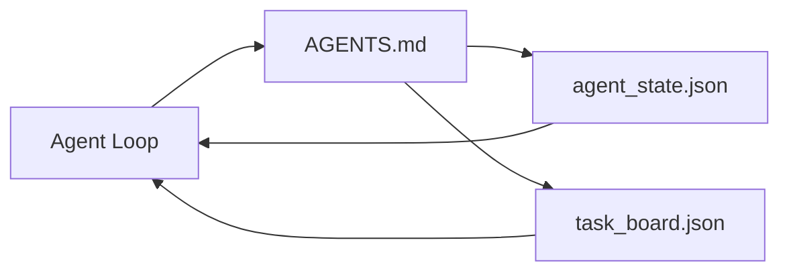

# Minimalny warsztat agenta

> Najmniejszy użyteczny warsztat to trzy pliki: główny router instrukcji, plik stanu i tablica zadań. Wszystko inne jest nałożone na wierzch. Jeśli repozytorium nie może udźwignąć tych trzech, żaden model go nie uratuje.

**Type:** Build
**Languages:** Python (stdlib)
**Prerequisites:** Phase 14 · 31 (Why Capable Models Still Fail)
**Time:** ~45 minutes

## Learning Objectives

- Zdefiniuj trzy pliki, które tworzą minimalny opłacalny warsztat.
- Wyjaśnij, dlaczego krótki główny router bije długi monolityczny `AGENTS.md`.
- Zbuduj plik stanu, który agent może czytać w każdej turze i zapisywać na końcu.
- Zbuduj tablicę zadań, która przetrwa pracę wielosesyjną bez historii czatu.

## Problem

Większość zespołów sięga po warsztat, pisząc 3000-liniowy `AGENTS.md` i uznając to za zrobione. Model ładuje go, ignoruje części, których nie może streścić, i wciąż zawodzi na tych samych powierzchniach, na których zawsze zawodził.

Potrzebujesz czegoś przeciwnego. Mały główny plik, który kieruje agenta do głębszych plików tylko wtedy, gdy są istotne. Trwały stan, który agent czyta przed działaniem i zapisuje po. Tablica zadań, która mówi, co jest w toku, co jest zablokowane i co jest następne.

Trzy pliki. Każdy z zadaniem. Każdy wystarczająco maszynowo czytelny, aby później ewoluować w prawdziwy system.

## Koncepcja



### AGENTS.md to router, nie instrukcja obsługi

Dobry `AGENTS.md` jest krótki. Wskazuje agentowi:

- Plik stanu (gdzie jesteś).
- Tablicę zadań (co zostało).
- Głębsze reguły (pod `docs/agent-rules.md`).
- Polecenie weryfikacji (jak wiedzieć, że działa).

Wszystko dłuższe idzie do głębszych dokumentów, ładowanych tylko w razie potrzeby. Długie instrukcje są ignorowane. Krótkie routery są przestrzegane.

### agent_state.json jest systemem rekordu

Stan niesie: identyfikator aktywnego zadania, dotknięte pliki, poczynione założenia, blokery i następną akcję. Agent czyta go w każdej turze. Następna sesja czyta go zamiast odtwarzać czat.

Stan żyje w pliku, ponieważ historia czatu jest zawodna. Sesje umierają. Rozmowy są przycinane. Plik nie.

### task_board.json jest kolejką

Tablica zadań niesie każde zadanie ze statusem `todo | in_progress | done | blocked`. To kolejka, z której agent pobiera, gdy stan jest pusty, i kolejka, którą czytasz, gdy chcesz wiedzieć, czy agent jest na dobrej drodze.

Zadanie na tablicy ma identyfikator, cel, właściciela (`builder`, `reviewer` lub `human`) i kryteria akceptacji. Tablica jest celowo mała: gdy urośnie poza jeden ekran, masz problem z planowaniem, nie z tablicą.

### Trzy pliki to podłoga, nie sufit

Późniejsze lekcje dodają kontrakty zakresu, uruchamiacze informacji zwrotnej, bramki weryfikacji, listy kontrolne recenzenta i pakiety przekazania. Trzy pliki tutaj są tym, co wszystkie zakładają.

## Build It

`code/main.py` zapisuje minimalny warsztat do pustego repozytorium i demonstruje pojedynczą turę agenta, która:

1. Czyta `agent_state.json`.
2. Pobiera następne zadanie z `task_board.json`, jeśli stan jest pusty.
3. Dotyka pojedynczego pliku w zakresie.
4. Zapisuje zaktualizowany stan.

Uruchom:

```
python3 code/main.py
```

Skrypt tworzy `workdir/` obok siebie, kładzie trzy pliki, wykonuje jedną turę i drukuje różnicę. Uruchom ponownie, aby zobaczyć, jak druga tura kontynuuje tam, gdzie pierwsza skończyła.

## Use It

W produkcyjnych produktach agentowych te same trzy pliki pojawiają się pod różnymi nazwami:

- **Claude Code:** `AGENTS.md` lub `CLAUDE.md` dla routera, magazyny w stylu `.claude/state.json` dla stanu, hooki dla tablicy.
- **Codex / Cursor:** reguły przestrzeni roboczej dla routera, pamięć sesji dla stanu, zadania w kolejce na pasku bocznym czatu dla tablicy.
- **Własny agent Python:** te same pliki, które właśnie napisałeś.

Nazwy się zmieniają. Kształt nie.

## Wzorce produkcyjne w dziczy

Minimalny warsztat przetrwa kontakt z prawdziwymi monorepozytoriami, gdy nałożone są na niego trzy wzorce. Są niezależne; wybierz te, których twoje repozytorium faktycznie potrzebuje.

**Zagnieżdżony `AGENTS.md` z pierwszeństwem najbliższego.** OpenAI wysyła 88 plików `AGENTS.md` w swoim głównym repozytorium, jeden na podkomponent. Codex, Cursor, Claude Code i Copilot wszystkie idą od pliku roboczego w kierunku korzenia repozytorium i łączą każdy `AGENTS.md`, który znajdą po drodze. Pliki w podkatalogach rozszerzają plik główny. Codex dodaje `AGENTS.override.md`, aby zastąpić, a nie rozszerzać; mechanizm nadpisywania jest specyficzny dla Codex i unikaj go dla pracy między narzędziami. Pomiar Augment Code to linia, która ma znaczenie: najlepsze pliki `AGENTS.md` dają skok jakości równoważny przejściu z Haiku na Opus; najgorsze sprawiają, że wyjście jest gorsze niż brak pliku.

**Antywzorce do odrzucenia, nawet gdy wyglądają jak pokrycie.** Sprzeczne instrukcje po cichu przenoszą agenta z trybu interaktywnego do zachłannego (ICLR 2026 AMBIG-SWE: 48.8% → 28% wskaźnik rozwiązywania); numeruj priorytety zamiast układać je płasko. Nieweryfikowalne reguły stylu ("przestrzegaj Google Python Style Guide") bez polecenia egzekwowania pozwalają agentowi wymyślać zgodność; paruj każdą regułę stylu z dokładnym poleceniem lint. Rozpoczynanie od stylu zamiast poleceń zakopuje ścieżkę weryfikacji; polecenia najpierw, styl na końcu. Pisanie dla ludzi zamiast agentów marnuje budżet kontekstu; zwięzłość to zaleta.

**Symlinki między narzędziami.** Pojedynczy plik główny z symlinkami (`ln -s AGENTS.md CLAUDE.md`, `ln -s AGENTS.md .github/copilot-instructions.md`, `ln -s AGENTS.md .cursorrules`) utrzymuje każdego agenta kodowania na tym samym źródle prawdy. `nx ai-setup` automatyzuje to w Claude Code, Cursor, Copilot, Gemini, Codex i OpenCode z jednej konfiguracji.

## Ship It

`outputs/skill-minimal-workbench.md` generuje trzyplikowy warsztat dla każdego nowego repozytorium: router `AGENTS.md` dostrojony do projektu, `agent_state.json` z odpowiednimi kluczami i `task_board.json` wypełniony bieżącym backlogiem.

## Exercises

1. Dodaj znacznik czasu `last_run` do `agent_state.json`. Odmów uruchomienia, jeśli plik jest starszy niż 24 godziny, chyba że operator potwierdzi.
2. Dodaj pole `priority` do tablicy zadań i zmień pobieracza, aby zawsze wybierał najwyższy priorytet `todo`.
3. Migruj `task_board.json` do JSON Lines, aby każde zadanie było linią, a różnice były czyste w kontroli wersji.
4. Napisz `lint_workbench.py`, który zawodzi, jeśli `AGENTS.md` ma ponad 80 linii lub odwołuje się do pliku, który nie istnieje.
5. Zdecyduj, który z trzech plików najbardziej bolałoby stracić. Uzasadnij.

## Key Terms

| Termin | Co ludzie mówią | Co naprawdę znaczy |
|------|----------------|------------------------|
| Router | `AGENTS.md` | Krótki plik główny, który wskazuje agentowi głębsze dokumenty i pliki |
| State file | "Notatki" | Maszynowo czytelny rekord tego, gdzie jest agent, zapisywany w każdej turze |
| Task board | "Backlog" | Kolejka JSON pracy ze statusem, właścicielem, akceptacją |
| System of record | "Źródło prawdy" | Plik, który warsztat traktuje jako autorytatywny, gdy czat zniknie |

## Further Reading

- [agents.md — the open spec](https://agents.md/) — przyjęty przez Cursor, Codex, Claude Code, Copilot, Gemini, OpenCode
- [Augment Code, A good AGENTS.md is a model upgrade. A bad one is worse than no docs at all](https://www.augmentcode.com/blog/how-to-write-good-agents-dot-md-files) — zmierzone skoki jakości
- [Blake Crosley, AGENTS.md Patterns: What Actually Changes Agent Behavior](https://blakecrosley.com/blog/agents-md-patterns) — co działa empirycznie, co nie
- [Datadog Frontend, Steering AI Agents in Monorepos with AGENTS.md](https://dev.to/datadog-frontend-dev/steering-ai-agents-in-monorepos-with-agentsmd-13g0) — zagnieżdżone pierwszeństwo w praktyce
- [Nx Blog, Teach Your AI Agent How to Work in a Monorepo](https://nx.dev/blog/nx-ai-agent-skills) — generacja z jednego źródła w sześciu narzędziach
- [The Prompt Shelf, AGENTS.md Best Practices: Structure, Scope, and Real Examples](https://thepromptshelf.dev/blog/agents-md-best-practices/) — kolejność sekcji, która przetrwa przegląd
- [Anthropic, Claude Code subagents and session store](https://docs.anthropic.com/en/docs/agents-and-tools/claude-code/sub-agents)
- Phase 14 · 31 — tryby awarii, które to minimum absorbuje
- Phase 14 · 34 — schemat trwałego stanu, który ta lekcja zapowiada